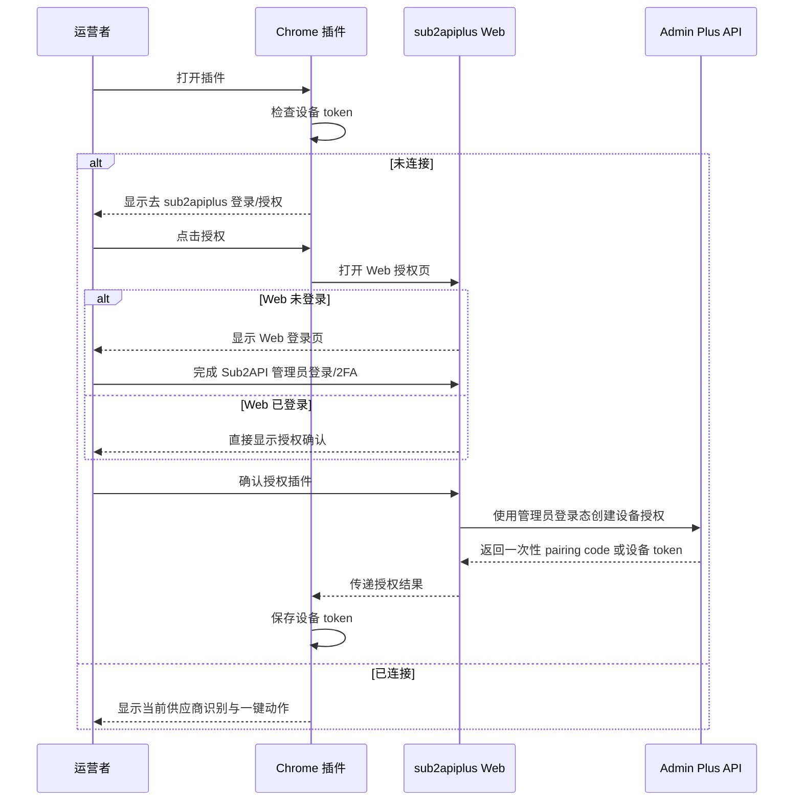
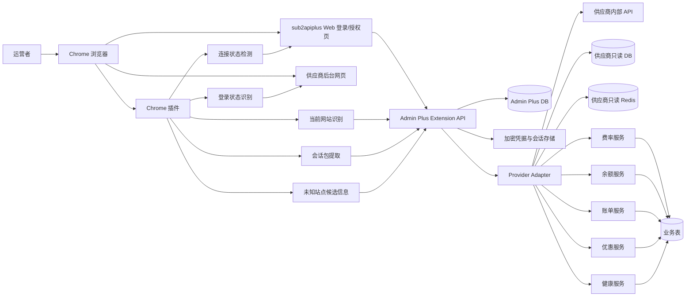
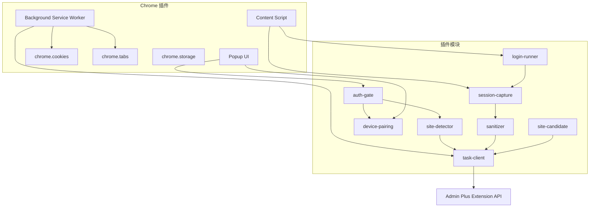
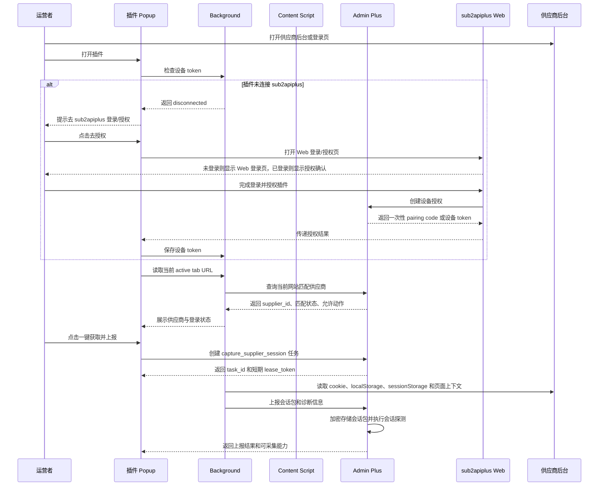
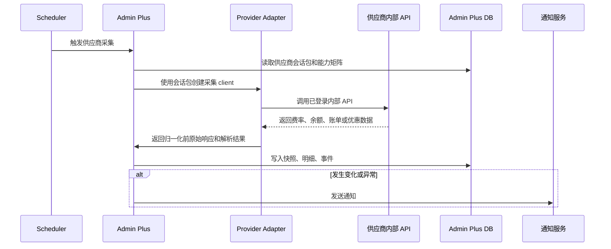
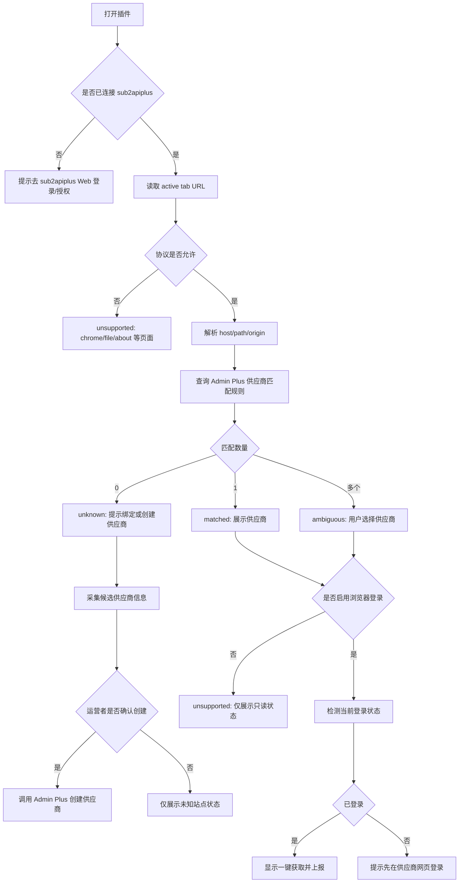
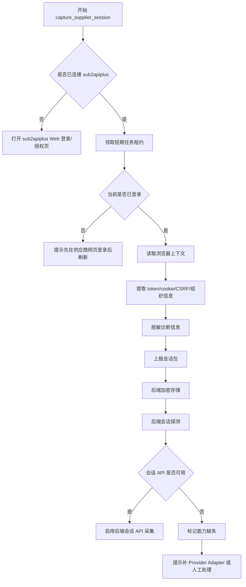
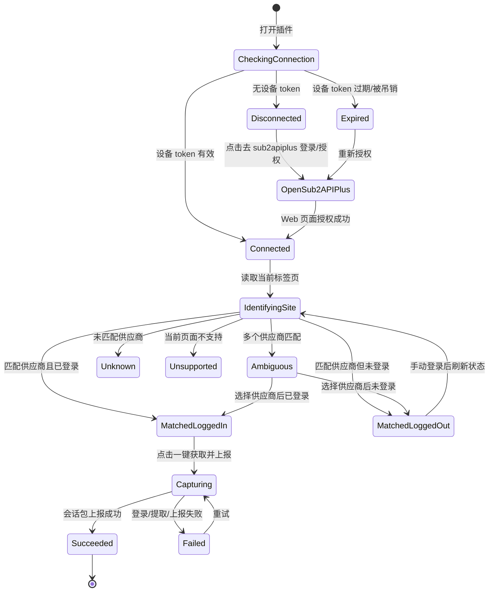

# Chrome 插件路线图：供应商浏览器会话获取器

版本：v0.1.0
日期：2026-06-20
状态：当前 Chrome 插件设计事实源
范围：纠正旧版“插件承担业务采集主路径”的设计偏差，将插件收敛为供应商浏览器会话桥梁。

## 目录

1. 背景
2. 设计结论
3. 收益
4. 目标与非目标
5. PRD 摘要
6. 核心概念
7. 插件与 sub2apiplus 认证模型
8. 总体架构图
9. 模块架构图
10. 已登录会话上报时序图
11. 后端会话 API 采集时序图
12. 当前网站识别流程图
13. 会话获取流程图
14. UI 设计图
15. 用户故事
16. 用户用例
17. 任务类型
18. 数据结构草案
19. 接口草案
20. 安全与合规
21. 迁移与清理计划
22. 测试用例
23. 验收标准
24. 风险与处理

## 1. 背景

Admin Plus 需要从第三方供应商后台获取费率、余额、优惠、账单和运行状态。旧版设计把 Chrome 插件设计成“登录 + 页面抓取 + CSV 导出 + 结构化业务结果上传”的通用执行器，容易导致以下问题：

- 插件内业务逻辑过多，供应商适配散落在浏览器脚本中。
- DOM 抓取脆弱，供应商页面升级后容易失效。
- 费率、余额、账单、优惠的归一化规则可能在后端和插件中重复实现。
- 插件需要理解业务含义，违反单一职责。
- 测试难度高，插件解析样例容易被误认为真实供应商采集已经完成。

新的设计把 Chrome 插件定位为供应商浏览器会话桥梁：

```text
Chrome 插件只负责识别站点、采集浏览器会话和页面上下文、上报第三方供应商信息。
Admin Plus Provider Adapter 负责分组、费率、余额、优惠、健康、并发、账单和密钥创建。
```

## 2. 设计结论

插件主路径：

1. 自动识别当前浏览器网站是否匹配已配置供应商。
2. 先确认插件已经通过 sub2apiplus 登录态完成授权，取得可吊销的插件设备 token。
3. 识别当前供应商页面是否已有登录会话。
4. 已登录时获取第三方会话包；未登录时提示运营者先在供应商网页登录。
5. 使用插件设备 token 将会话包、登录状态和诊断信息上报 Admin Plus。
6. 后端使用会话包通过 Provider Adapter 模拟已登录 API 请求，完成费率、余额、优惠、账单等业务采集。

插件不承担业务兜底执行：

1. 插件不解析分组、费率、余额、优惠、健康、并发或账单。
2. 插件不创建第三方密钥。
3. 插件不下载 CSV、截图或 DOM 指标作为业务结果。
4. Provider Adapter 能力缺失时，应记录 `capability_missing` 并补适配器，而不是把业务动作塞回插件。

## 3. 收益

- KISS：插件只做浏览器必须做的事，后端做业务。
- YAGNI：不为每个供应商提前写复杂 DOM 解析器。
- DRY：费率、余额、账单、优惠归一化只在后端 Provider Adapter 和业务服务中实现一次。
- SOLID：插件、任务协议、Provider Adapter、业务服务边界清晰。
- 稳定性更高：优先使用登录后的 API，而不是依赖页面 DOM。
- 可测试性更好：后端会话 API 采集可以用 HTTP fixture 和 adapter 单测覆盖。
- 安全边界更清楚：插件不保存 Sub2API 管理员身份，不长期保存供应商密码。
- 上传边界更清楚：插件必须先登录/连接 sub2apiplus，不能匿名上传第三方供应商 token。

## 4. 目标与非目标

目标：

- 插件能识别当前 active tab 所属供应商。
- 插件能检测是否已连接 sub2apiplus。
- sub2apiplus 已登录时，插件能一键完成授权并继续供应商已登录会话上报。
- sub2apiplus 未登录时，插件只提醒并打开 sub2apiplus Web 登录页，登录后再授权插件。
- 插件能在供应商后台页面展示匹配状态、登录状态和一键上报入口。
- 插件能识别供应商当前页面是否已有登录会话；未登录时只提示运营者先在供应商网页登录。
- 插件能提取 access token、cookie、CSRF token、组织 ID、账号 ID、API base URL、过期时间等会话字段。
- 插件能使用插件设备 token 把会话包加密上报给 Admin Plus。
- 后端能用会话包完成供应商 API 采集。
- 插件能上报 Provider Adapter 所需的浏览器会话和页面上下文。

非目标：

- 插件不做费率变化判断。
- 插件不做账单归一化。
- 插件不做余额阈值判断。
- 插件不读取或解析分组。
- 插件不创建第三方密钥。
- 插件不下载 CSV、截图或 DOM 指标作为业务采集结果。
- 插件不做对账、毛利计算或调度建议。
- 插件不保存 Sub2API 管理员 access token。
- 插件不绕过 sub2apiplus 登录态匿名上传供应商会话包。
- 插件不设计管理员登录 UI，不提供账号、密码、2FA、OAuth 输入框。
- 插件不作为长期凭据仓库。
- 插件不直接修改本地 Sub2API 状态。

## 5. PRD 摘要

### 5.1 角色

- 运营者：Sub2API 管理员，负责配置供应商和触发已登录会话上报。
- Chrome 插件：通过 sub2apiplus 授权的供应商浏览器会话获取器。
- Admin Plus 后端：任务、凭据、会话、采集和业务处理中心。
- Provider Adapter：使用 Admin API、只读 DB、只读 Redis 或供应商会话 API 获取业务数据。
- 供应商后台：第三方 Sub2API、New API、New API-like 或 browser-only 后台。

### 5.2 核心需求

- 运营者打开任意供应商后台，插件自动识别当前网站。
- 插件先检查是否已有有效设备 token；没有时必须连接 sub2apiplus。
- 如果浏览器中 sub2apiplus 已登录，运营者可以一键授权插件；如果未登录，插件只打开 sub2apiplus Web 登录页，不在插件内登录。
- 插件能提示当前网站匹配的供应商名称和匹配规则。
- 未登录时，插件提示运营者先在供应商网页登录，并提供刷新识别入口。
- 已登录时，运营者点击“一键获取并上报”，插件直接提取会话包。
- 上报成功后，Admin Plus 后端立即尝试会话探测，判断该会话是否能调用供应商内部 API。
- 会话可用时，后端把该供应商切换到“会话 API 可采集”路径。
- 会话不可用或适配器能力缺失时，后端标记原因并提示重新上报会话或补供应商适配器。

### 5.3 完成定义

Chrome 插件完成不是指能跑通 fake parser，而是：

- 至少一个真实供应商后台可以被自动识别。
- 插件能通过 sub2apiplus 已登录状态一键完成授权，换取插件设备 token。
- 在真实供应商后台可以识别已登录状态并一键上报会话包。
- 插件能上报真实会话包。
- 后端能用该会话包完成至少一种真实业务 API 采集。
- 失败时能给出明确错误原因，不生成 mock 成功数据。

## 6. 核心概念

### 6.1 网站识别

网站识别是插件根据当前 active tab 判断供应商身份的过程。

匹配来源：

- `supplier.admin_url`
- `supplier.login_url`
- `supplier.api_base_url`
- 供应商配置的 `host_patterns`
- 供应商类型默认规则，例如 Sub2API、New API 的常见路径特征
- 页面指纹，例如标题、meta、全局变量、登录接口路径

匹配结果：

- `matched`：唯一匹配一个供应商。
- `ambiguous`：同一 host 匹配多个供应商，需要用户选择。
- `unknown`：未匹配，需要创建或绑定供应商。
- `unsupported`：匹配供应商，但未启用浏览器登录。

### 6.2 会话包

会话包不是单一 access token。它是供应商已登录浏览器上下文中后端采集可能需要的一组短期凭据。

典型字段：

- access token
- refresh token，如供应商前端可见且允许采集
- session cookie
- CSRF token
- organization id
- project id
- account id
- user id
- API base URL
- login URL
- expires at
- required headers
- origin / referer 约束
- 授权范围和角色信息

### 6.3 会话探测

后端收到会话包后，必须先执行会话探测：

- 调用供应商 `/me`、`/profile`、`/user` 或等价接口。
- 校验账号、组织、权限和过期时间。
- 探测费率、余额、账单等内部 API 是否可用。
- 记录可用能力矩阵。

## 7. 插件与 sub2apiplus 认证模型

Chrome 插件必须先通过 sub2apiplus 授权，才能上传第三方供应商 token、cookie 或会话包。插件本身不实现管理员登录 UI，也不接收 Sub2API 管理员账号、密码、2FA 或 OAuth 输入。

认证边界：

- sub2apiplus Web 页面负责管理员登录、2FA、refresh token 和管理员身份校验。
- Chrome 插件只负责检测连接状态、打开 sub2apiplus Web 登录/授权页、接收一次性授权结果。
- 插件拿到的是 Admin Plus 生成的插件设备 token，不是 Sub2API 管理员 access token。
- 设备 token 只代表插件任务执行和会话包上传权限，可吊销、可轮换、可过期。
- 上传第三方供应商会话包时，后端必须校验设备 token、设备状态、任务租约、supplier_id 和 task_id。

插件状态：

- `disconnected`：没有设备 token，不能识别敏感供应商配置，不能读取凭据，不能上传供应商会话包。
- `needs_admin_login`：插件打开 sub2apiplus Web 登录页，等待运营者在 Web 页面完成登录。
- `needs_authorization`：sub2apiplus 已登录，但当前插件设备尚未授权。
- `connected`：插件有有效设备 token，可以创建/领取任务和上传会话包。
- `expired_or_revoked`：设备 token 过期或被吊销，需要重新到 sub2apiplus Web 页面授权。

推荐授权流程：

1. 插件启动时检查本地是否有设备 token。
2. 没有设备 token 时，插件只展示“去 sub2apiplus 登录/授权”按钮。
3. 点击按钮后，插件打开 sub2apiplus Web 授权页，例如 `/admin-plus/extension/connect?device_id=...`。
4. 如果 sub2apiplus Web 未登录，Web 页面显示 Admin Plus 登录页，并复用 Sub2API 管理员登录代理。
5. 如果 sub2apiplus Web 已登录，Web 页面直接显示“授权此 Chrome 插件”确认动作。
6. Web 页面调用后端创建设备 token 或一次性 pairing code。
7. 插件通过 `chrome.runtime` 消息、轮询 pairing code 或回调页拿到授权结果。
8. 插件保存设备 token，后续用设备 token 调用 Extension API。



## 8. 总体架构图



## 9. 模块架构图



## 10. 已登录会话上报时序图



## 11. 后端会话 API 采集时序图



## 12. 当前网站识别流程图



## 13. 会话获取流程图



## 14. UI 设计图

Chrome 插件 Popup 只做任务入口和状态展示，不提供管理员登录表单。管理员登录、2FA、OAuth、refresh token 都在 sub2apiplus Web 页面完成。

### 14.1 Popup 状态机



### 14.2 Popup 低保真原型图

设计约束：

- Popup 宽度建议 `360px`，高度随状态自适应，默认不超过 `560px`。
- 插件内没有管理员登录表单，没有密码框，没有 2FA 输入框，没有 OAuth 按钮。
- 主按钮在每个状态只能有一个，避免误操作。
- token、cookie、密码、完整设备 ID 默认不展示。

#### 未连接 sub2apiplus

```text
┌────────────────────────────────────────┐
│ Sub2API Plus                    未连接 │
├────────────────────────────────────────┤
│ 当前页面                               │
│ admin.supplier.com                     │
│                                        │
│ 需要先连接 sub2apiplus，插件才可以     │
│ 识别供应商配置、读取任务和上传会话包。 │
│                                        │
│ [ 去 sub2apiplus 登录/授权 ]           │
│                                        │
│ 插件不提供登录表单。管理员登录只在     │
│ sub2apiplus Web 页面完成。             │
└────────────────────────────────────────┘
```

#### 已连接，当前网站识别成功，供应商已登录

```text
┌────────────────────────────────────────┐
│ Sub2API Plus               已连接 d9f2 │
├────────────────────────────────────────┤
│ 当前页面                               │
│ admin.supplier.com                     │
│                                        │
│ 匹配供应商                             │
│ Example Relay                          │
│ relay · sub2api · 置信度 98%           │
│                                        │
│ 供应商登录状态                         │
│ 已登录 · 可提取会话                    │
│                                        │
│ [ 一键获取并上报 ]                     │
│                                        │
│ 刷新识别              查看诊断         │
└────────────────────────────────────────┘
```

#### 已连接，当前网站识别成功，供应商未登录

```text
┌────────────────────────────────────────┐
│ Sub2API Plus               已连接 d9f2 │
├────────────────────────────────────────┤
│ 当前页面                               │
│ admin.supplier.com/login               │
│                                        │
│ 匹配供应商                             │
│ Example Relay                          │
│ relay · sub2api · 置信度 98%           │
│                                        │
│ 供应商登录状态                         │
│ 未登录 · 请先在供应商网页登录          │
│                                        │
│ [ 刷新状态 ]                           │
│                                        │
│ 刷新识别              查看诊断         │
└────────────────────────────────────────┘
```

#### 已连接，当前网站未匹配

```text
┌────────────────────────────────────────┐
│ Sub2API Plus               已连接 d9f2 │
├────────────────────────────────────────┤
│ 当前页面                               │
│ unknown.example.com                    │
│                                        │
│ 匹配状态                               │
│ 未找到已配置供应商                     │
│                                        │
│ 需要先在 sub2apiplus 后台添加供应商    │
│ 或为现有供应商绑定此网站。             │
│                                        │
│ [ 去后台绑定供应商 ]                   │
│                                        │
│ 刷新识别                               │
└────────────────────────────────────────┘
```

#### 已连接，多个供应商匹配

```text
┌────────────────────────────────────────┐
│ Sub2API Plus               已连接 d9f2 │
├────────────────────────────────────────┤
│ 当前页面                               │
│ admin.shared-host.com                  │
│                                        │
│ 匹配状态                               │
│ 发现 2 个可能供应商                    │
│                                        │
│ ○ Example Relay - US                   │
│ ○ Example Relay - EU                   │
│                                        │
│ [ 确认供应商 ]                         │
│                                        │
│ 确认供应商后可检测登录状态。           │
└────────────────────────────────────────┘
```

#### 会话获取执行中

```text
┌────────────────────────────────────────┐
│ Sub2API Plus               已连接 d9f2 │
├────────────────────────────────────────┤
│ 任务                                   │
│ capture_supplier_session               │
│                                        │
│ Example Relay                          │
│ task_8b31                              │
│                                        │
│ 进度                                   │
│ ✓ 领取短期任务租约                     │
│ ✓ 检查供应商登录状态                   │
│ → 提取 token / cookie / CSRF           │
│ · 上传会话包                           │
│ · 后端会话探测                         │
│                                        │
│ [ 取消 ]                               │
└────────────────────────────────────────┘
```

#### 会话上报成功

```text
┌────────────────────────────────────────┐
│ Sub2API Plus               已连接 d9f2 │
├────────────────────────────────────────┤
│ 上报成功                               │
│ Example Relay                          │
│                                        │
│ 后端探测结果                           │
│ 会话有效 · 预计 1 小时 42 分钟后过期   │
│                                        │
│ 可采集能力                             │
│ ✓ 余额                                 │
│ ✓ 费率                                 │
│ ✓ 账单                                 │
│ · 优惠：未发现接口                     │
│                                        │
│ [ 完成 ]                               │
│                                        │
│ 查看诊断                               │
└────────────────────────────────────────┘
```

#### 会话上报失败

```text
┌────────────────────────────────────────┐
│ Sub2API Plus               已连接 d9f2 │
├────────────────────────────────────────┤
│ 上报失败                               │
│ Example Relay                          │
│                                        │
│ 错误类型                               │
│ captcha_required                       │
│                                        │
│ 处理建议                               │
│ 请在供应商页面手动完成验证后，重新点击 │
│ “一键获取并上报”。                     │
│                                        │
│ [ 重试 ]                               │
│                                        │
│ 打开供应商页          查看诊断         │
└────────────────────────────────────────┘
```

### 14.3 Popup 信息架构

- 顶部：产品名、连接状态、设备短 ID。
- 当前网站区：host、匹配状态、供应商名称、置信度。
- 授权区：未连接时只显示“去 sub2apiplus 登录/授权”，不显示登录输入框。
- 供应商动作区：连接、匹配且已登录后显示“一键获取并上报”；未登录时只显示“刷新状态”和网页登录提示。
- 任务进度区：展示当前步骤、失败原因和重试入口。
- 诊断区：展示脱敏错误、任务 ID、供应商 ID、最近上报时间。

## 15. 用户故事

### US-00 连接 sub2apiplus

作为运营者，我希望 Chrome 插件不提供登录表单，而是在未连接时引导我去 sub2apiplus Web 页面登录和授权，这样管理员认证边界保持在 Web 后台。

验收：

- 插件未连接时不允许上传供应商会话包。
- 插件未连接时只显示连接状态和“去 sub2apiplus 登录/授权”动作。
- sub2apiplus 未登录时，Web 页面负责显示登录页。
- sub2apiplus 已登录时，Web 页面允许一键授权插件。
- 插件拿到设备 token 后才允许识别供应商和上报已登录会话。

### US-01 自动识别当前网站

作为运营者，我打开一个供应商后台时，希望插件自动识别这是哪个已配置供应商，这样我不需要手动选择供应商或复制 URL。

验收：

- 插件能显示供应商名称、匹配 host 和匹配置信度。
- 未匹配时能提示绑定到现有供应商或创建新供应商。
- 多供应商共用 host 时能要求用户选择具体供应商。

### US-02 已登录后一键获取并上报

作为运营者，我已经在供应商网页登录后，希望插件直接获取并上报当前会话，这样后端可以开始自动采集。

验收：

- 插件能识别已登录状态。
- 插件能提取必要 token、cookie 和组织上下文。
- 后端能完成会话探测并显示可采集能力。

### US-03 未登录时引导网页登录

作为运营者，我在供应商页面未登录时，希望插件只提示我去供应商网页登录，不在插件内输入或保存供应商账号密码。

验收：

- 插件不展示供应商登录表单。
- 插件不读取供应商后台登录凭据。
- 用户完成网页登录后，点击刷新状态即可继续一键上报。

### US-04 后端使用会话 API 采集

作为运营者，我希望上报一次会话后，后续费率、余额、账单尽量由后端自动调用 API 获取，而不是每次都打开浏览器页面。

验收：

- 后端能记录会话有效期。
- 会话过期前能执行定时采集。
- 会话失效后能通知重新登录上报。

### US-05 供应商上下文上报

作为运营者，我希望插件把 Provider Adapter 需要的页面上下文、组织信息、API base URL 和会话字段上报，这样后端适配器可以完成采集和创建密钥。

验收：

- 插件只上报会话和上下文，不上报已解析业务结果。
- 后端加密保存会话包。
- Provider Adapter 基于会话包完成能力探测。

## 16. 用户用例

### UC-01 首次绑定供应商网站

前置条件：

- Admin Plus 可能已存在供应商父级，也可能尚未配置该站点。
- 已配置供应商时，供应商配置了后台地址或 host pattern。
- 插件已经和 Admin Plus 配对。

主流程：

1. 运营者打开供应商后台。
2. 插件读取 active tab URL。
3. 插件请求 Admin Plus 匹配供应商。
4. Admin Plus 返回唯一供应商。
5. 插件展示供应商名称、当前登录状态和可执行动作。

异常：

- 未匹配：插件提取候选供应商信息，运营者确认后由 Admin Plus 后端创建供应商。
- 多匹配：提示选择供应商。
- 未登录供应商页面：只提示先网页登录，不允许在插件内输入供应商账号密码。

### UC-01A 未知站点一键创建供应商

前置条件：

- 插件已经和 Admin Plus 配对。
- 当前 active tab 未匹配任何供应商。
- 运营者具备管理员权限。

主流程：

1. 插件读取当前站点 origin、host、title、favicon、登录页路径和可能的 API base URL。
2. 插件展示“创建供应商”确认动作。
3. 运营者确认供应商名称、系统类型和后台地址。
4. 插件把候选信息提交给 Admin Plus。
5. Admin Plus 后端校验管理员身份、host 唯一性和 URL 合法性。
6. Admin Plus 后端创建供应商父级，并返回 supplier_id。
7. 插件继续执行已登录会话上报。

约束：

- 插件不能静默创建供应商。
- 插件不能直接写数据库。
- 插件只提交候选信息，最终创建由 Admin Plus 后端完成。

### UC-02 已登录会话获取并上报

前置条件：

- 运营者已经在当前供应商网页登录。
- 插件有有效设备 token。

主流程：

1. 运营者点击“一键获取并上报”。
2. 插件创建 `capture_supplier_session` 任务。
3. 插件检测当前页面登录态。
4. 插件获取会话包。
5. 插件上报会话包。
6. 后端加密存储并执行会话探测。
7. 后端返回可采集能力矩阵。

异常：

- 未登录：提示先在供应商网页登录后刷新状态。
- 需要验证码或 2FA：由供应商网页完成，插件不接管。
- 会话探测失败：标记 `session_probe_failed`。

### UC-03 已登录页面一键上报

前置条件：

- 运营者已经手动登录供应商后台。
- 插件能识别当前供应商。

主流程：

1. 运营者点击“一键获取并上报”。
2. 插件跳过凭据读取和登录动作。
3. 插件读取当前页面上下文、cookie 和前端存储。
4. 插件上报会话包。
5. 后端执行会话探测。

异常：

- 当前页面登录态不足：提示重新登录。
- 权限不足：上报 `permission_denied`。
- 会话字段缺失：上报 `session_incomplete`。

### UC-04 会话 API 定时采集

前置条件：

- 已有有效会话包。
- 会话探测确认支持供应商内部 API。

主流程：

1. Scheduler 触发采集任务。
2. Provider Adapter 读取会话包。
3. Provider Adapter 调用供应商内部 API。
4. 后端解析并写入业务表。
5. 后端生成事件和通知。

异常：

- 会话过期：标记 `session_expired` 并通知重新上报。
- API 结构变化：标记 adapter 解析失败。
- 权限变化：标记供应商凭据需要复核。

## 17. 任务类型

主路径任务：

- `identify_current_site`：识别当前网站。
- `capture_supplier_session`：获取并上报供应商会话包。
- `refresh_supplier_session`：刷新或重新获取供应商会话包。
- `probe_supplier_session`：后端探测会话可用能力。

废弃为主路径的旧任务：

- `scrape_rate_page`
- `scrape_promotion_page`
- `scrape_balance`
- `scrape_concurrency`
- `export_usage_csv`

这些任务不再进入 Chrome 插件目标架构。Provider Adapter 暂不支持时，后端记录 `capability_missing`，并补对应供应商适配器。

## 18. 数据结构草案

### 18.1 SupplierSiteMatch

```json
{
  "supplier_id": "supplier_123",
  "supplier_name": "Example Relay",
  "match_status": "matched",
  "match_confidence": 0.98,
  "matched_rule": "host_patterns:*.example.com",
  "browser_login_enabled": true,
  "session_capture_enabled": true,
  "business_collection_enabled": false,
  "available_actions": [
    "capture_supplier_session"
  ]
}
```

### 18.2 SupplierSessionBundle

```json
{
  "supplier_id": "supplier_123",
  "origin": "https://admin.example.com",
  "captured_at": "2026-06-20T12:00:00Z",
  "expires_at": "2026-06-20T14:00:00Z",
  "tokens": {
    "access_token": "encrypted-or-redacted",
    "refresh_token": "encrypted-or-redacted",
    "csrf_token": "encrypted-or-redacted"
  },
  "cookies": [
    {
      "name": "session",
      "domain": ".example.com",
      "path": "/",
      "http_only": true,
      "secure": true,
      "same_site": "Lax",
      "expires_at": "2026-06-20T14:00:00Z"
    }
  ],
  "context": {
    "user_id": "user_1",
    "organization_id": "org_1",
    "project_id": "project_1",
    "account_id": "account_1",
    "api_base_url": "https://admin.example.com/api"
  },
  "required_headers": {
    "origin": "https://admin.example.com",
    "referer": "https://admin.example.com/"
  },
  "capabilities": {
    "unknown_until_probe": true
  }
}
```

### 18.3 SupplierSessionProbeResult

```json
{
  "supplier_id": "supplier_123",
  "session_status": "valid",
  "expires_at": "2026-06-20T14:00:00Z",
  "capabilities": {
    "fetch_rates": true,
    "fetch_balance": true,
    "fetch_promotions": false,
    "fetch_usage_bills": true,
    "fetch_concurrency": false
  },
  "failure_reason": null
}
```

## 19. 接口草案

插件侧接口：

```text
POST /api/v1/admin-plus/suppliers/site-match
POST /api/v1/admin-plus/suppliers/from-site-candidate
POST /api/v1/admin-plus/extension/session/capture-task
POST /api/v1/admin-plus/extension/tasks/:id/browser-credential
POST /api/v1/admin-plus/extension/tasks/:id/heartbeat
POST /api/v1/admin-plus/extension/tasks/:id/complete
POST /api/v1/admin-plus/extension/tasks/:id/fail
```

后端管理接口：

```text
POST /api/v1/admin-plus/suppliers/site-match
POST /api/v1/admin-plus/suppliers/:id/browser-sessions
GET  /api/v1/admin-plus/suppliers/:id/session
POST /api/v1/admin-plus/suppliers/:id/session/probe
POST /api/v1/admin-plus/suppliers/:id/session/revoke
GET  /api/v1/admin-plus/suppliers/:id/capabilities
```

说明：

- 当前主路径通过 `capture_supplier_session` 短租约任务上报会话包，插件完成任务时把 `session_bundle` 放在 `complete.result.session_bundle`；后端 ingest 会删除明文、加密保存，并在任务结果中只保留摘要。
- `POST /api/v1/admin-plus/suppliers/:id/browser-sessions` 已作为管理员登录态下的直接上报入口落地，用于调试、手动导入和插件联调；插件长期主路径仍优先使用短租约任务，避免绕过设备、租约和任务审计。
- `browser-credential` 是历史浏览器登录凭据租约读取机制；新主路径优先支持“已登录页面一键上报”，供应商自动登录不是插件必须完成的业务动作。
- 新增接口必须继续使用短期设备 token，不使用 Sub2API 管理员 token。
- 会话包入库前必须服务端加密。
- 后端已支持 `cookies` 字符串和 Chrome cookies 数组，Provider Adapter 会归一化为供应商请求所需的 Cookie header。

## 20. 安全与合规

- 插件不保存 Sub2API 管理员身份。
- 插件设备 token 可吊销、可轮换、可过期。
- 供应商登录凭据只在任务租约窗口内解密。
- 会话包必须加密传输、加密存储。
- Popup 和日志默认不展示明文 token、cookie、密码。
- 截图上传默认关闭，必须按供应商配置开启。
- 会话包必须记录来源页面、采集时间、设备 ID 和任务 ID。
- 读取 HttpOnly cookie 必须依赖 Chrome 扩展权限，并限定 host permissions。
- 对第三方后台的访问必须符合供应商条款和管理员授权边界。
- 插件只上报供应商浏览器会话，不上报“请后端请求某个 URL”的任意请求指令。
- 后端 Provider Adapter 必须按供应商 `base_url`、`api_base_url` 和 host 白名单构造请求，不能信任插件传入的任意 URL。
- 后端会话 API 采集默认只允许只读接口；创建第三方密钥等写操作必须由 Admin Plus 后台管理员确认后触发，不能由插件直接触发。
- 对同源 Sub2API 供应商，普通下游会话只允许调用用户侧接口，例如 profile、groups、keys、usage；除非供应商明确授权，不允许尝试调用供应商 `/api/v1/admin/*`。
- 会话包、供应商登录密码、临时 token、cookie、CSRF 和 refresh token 都按高敏凭据处理，前端只能看到状态、过期时间和脱敏指纹。
- 插件上报未知站点候选供应商时，只能提交 origin、host、title、favicon、登录页路径和系统识别证据；最终创建必须由 Admin Plus 后端在管理员登录态下校验和执行。

## 21. 迁移与清理计划

### 21.1 文档清理

- PRD 中 Chrome 插件章节改为指向本路线文档。
- 删除 `scrape_*` 和 `fallback_*` 业务任务的目标路线。
- “插件解析业务数据并写入业务表”的描述改为“插件上报会话包和页面上下文，Provider Adapter 采集、解析和写入业务表”。
- README 的下一阶段定义改为“真实会话获取 + 后端会话 API 采集”。

### 21.2 代码清理

- 新增网站识别和会话包上报接口。
- 将 `parser.js` 保留为历史兼容和测试参考，不作为新目标架构验收依据。
- 新增 `site-detector`、`session-capture`、`login-runner` 模块。
- 后端新增供应商会话存储和会话探测服务。
- Provider Adapter 优先实现会话 API 请求。

### 21.3 验收清理

- 不再以“DOM 解析样例通过”作为 Chrome 插件完成标准。
- 不再要求插件主路径完成费率、余额、并发页面抓取。
- 改为要求真实供应商一键识别、已登录会话一键上报、Provider Adapter 采集闭环。

## 22. 测试用例

### 22.1 单元测试

| 编号 | 模块 | 场景 | 期望 |
|------|------|------|------|
| UT-01 | site-detector | URL 精确匹配 `admin_url` | 返回唯一供应商 |
| UT-02 | site-detector | wildcard host 匹配 | 返回匹配规则和置信度 |
| UT-03 | site-detector | 多供应商匹配同一 host | 返回 `ambiguous` |
| UT-04 | site-detector | 未配置网站 | 返回 `unknown` |
| UT-05 | session-capture | localStorage 中存在 access token | 提取 token 并脱敏日志 |
| UT-06 | session-capture | HttpOnly cookie 存在 | 通过 cookies 权限读取元信息和值 |
| UT-07 | sanitizer | token 出现在错误信息中 | 输出被脱敏 |
| UT-08 | task-client | lease_token 过期 | 阻止凭据读取 |

### 22.2 集成测试

| 编号 | 场景 | 步骤 | 期望 |
|------|------|------|------|
| IT-01 | 当前网站识别 | 打开已配置供应商后台并点击插件 | 展示供应商名称和一键动作 |
| IT-02 | 未登录提示 | 未登录状态打开插件 | 提示先在供应商网页登录，不展示登录表单 |
| IT-03 | 已登录上报 | 手动登录后点击一键获取并上报 | 上报会话包 |
| IT-04 | 会话探测 | 后端收到会话包 | 返回能力矩阵 |
| IT-05 | 会话 API 采集 | Scheduler 触发费率采集 | Provider Adapter 使用会话 API 写入费率快照 |
| IT-06 | 会话过期 | 使用过期会话采集 | 标记 `session_expired` 并生成通知 |
| IT-07 | 能力缺失 | API 不支持账单导出 | 后端记录 `capability_missing` 并提示补适配器 |

### 22.3 E2E 测试

| 编号 | 场景 | 期望 |
|------|------|------|
| E2E-01 | 真实 Sub2API 供应商后台识别 | 插件识别真实后台并匹配供应商 |
| E2E-02 | 真实后台已登录会话上报 | 会话包成功进入 Admin Plus |
| E2E-03 | 后端调用真实会话 API | 至少完成余额或账号信息采集 |
| E2E-04 | 真实失败链路 | 密码错误、验证码、权限不足能明确失败 |
| E2E-05 | 不生成 mock 成功 | 任一真实采集失败不得写入伪造业务快照 |

### 22.4 安全测试

| 编号 | 场景 | 期望 |
|------|------|------|
| SEC-01 | 插件未配对 | 无法识别供应商敏感配置或读取凭据 |
| SEC-02 | 非任务窗口读取凭据 | 后端拒绝 |
| SEC-03 | 错误 supplier_id 上报 | 后端拒绝 |
| SEC-04 | 日志含 token | 日志输出脱敏 |
| SEC-05 | 设备 token 吊销 | 插件无法继续调用接口 |
| SEC-06 | 插件上报非供应商 URL | 后端拒绝，不发起请求 |
| SEC-07 | 插件上报内网、文件、本机地址 | 后端拒绝，避免 SSRF |
| SEC-08 | 普通会话请求供应商 admin 路径 | 后端拒绝，记录越权尝试 |
| SEC-09 | 会话包接口返回明文 cookie/token | 接口测试失败，只允许返回脱敏状态 |
| SEC-10 | 未知站点一键创建供应商 | 必须经过管理员确认和后端 host 唯一性校验 |

## 23. 验收标准

M1：网站识别

- 插件可识别当前 active tab。
- Admin Plus 可配置供应商 host patterns。
- matched、ambiguous、unknown、unsupported 状态完整。

M2：已登录会话上报

- 插件可创建 `capture_supplier_session` 任务。
- 插件可识别供应商页面已登录状态。
- 插件可上报会话包。

M3：后端会话探测

- 会话包加密存储。
- 后端可探测会话有效性。
- 后端可记录能力矩阵。
- 会话失效可生成明确事件。

M4：会话 API 采集

- 至少一个真实供应商通过会话 API 完成余额或费率采集。
- 采集结果由后端 Provider Adapter 归一化。
- 插件不参与业务判断。

M5：能力缺失处理

- 会话 API 或供应商 API 不可用时，后端记录明确 `capability_missing`。
- 页面展示需要补适配器或人工处理的原因。
- 插件不承接业务采集或密钥创建任务。

## 24. 风险与处理

| 风险 | 影响 | 处理 |
|------|------|------|
| 供应商 token 存在 HttpOnly cookie | content script 读不到 | 使用 `chrome.cookies` 和最小 host permission |
| 供应商 API 绑定 Origin/Referer | 后端请求失败 | 会话探测记录约束，补 Provider Adapter 能力或进入人工处理 |
| 供应商需要验证码或 2FA | 无法完全自动登录 | 支持人工完成后“一键获取并上报” |
| 多供应商共用域名 | 自动匹配错误 | 返回 ambiguous，要求人工选择 |
| 会话短期失效 | 定时采集中断 | 记录 expires_at，提前通知刷新 |
| 插件权限过宽 | 安全风险 | 按供应商动态申请 host permissions，默认最小权限 |
| 旧 DOM 解析路径被误用 | 产生伪数据或维护成本高 | 新目标架构不接受插件业务采集结果，失败必须可观测 |
