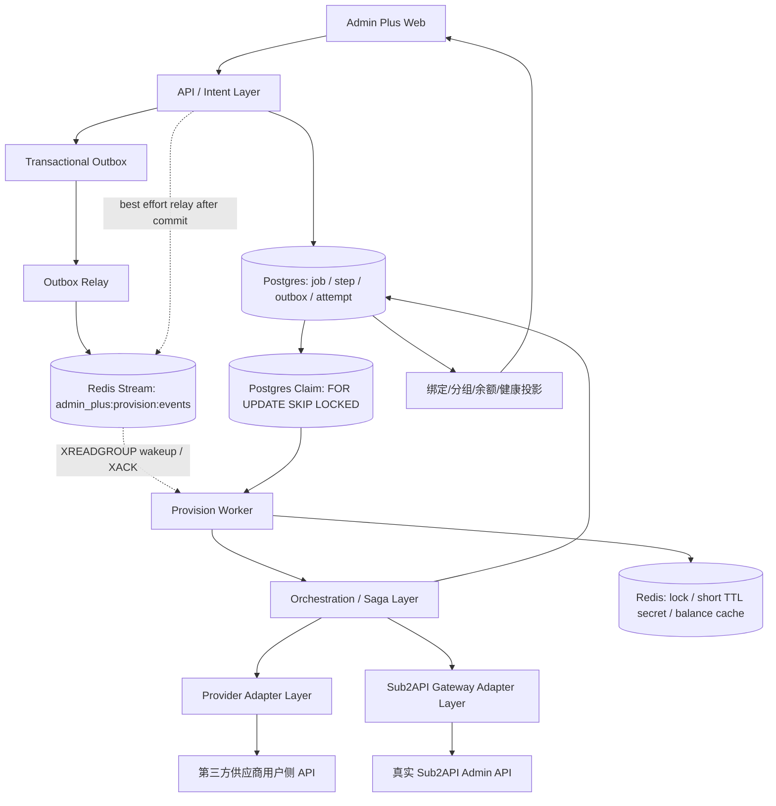
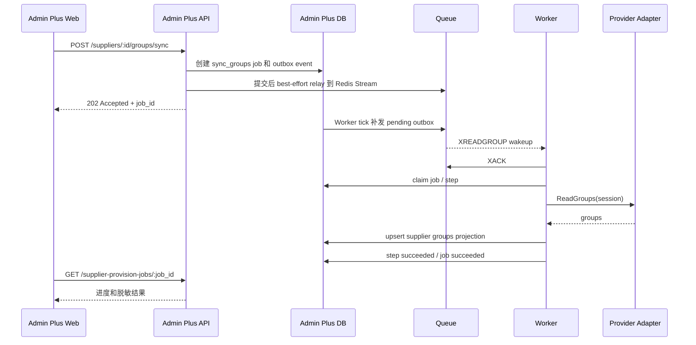
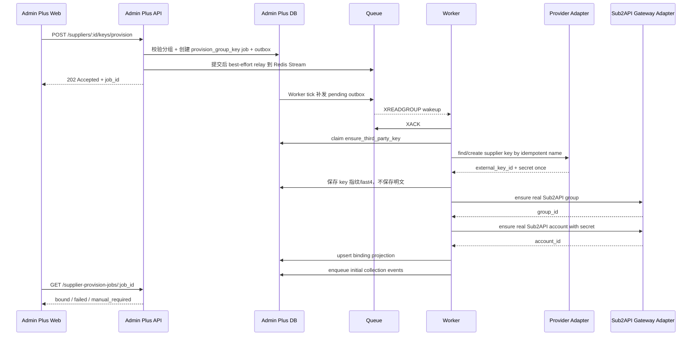
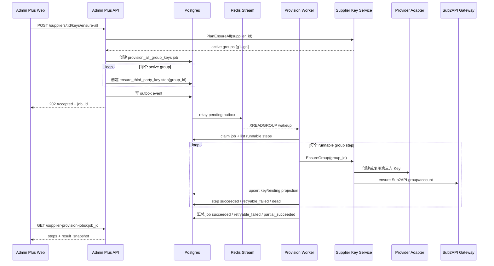
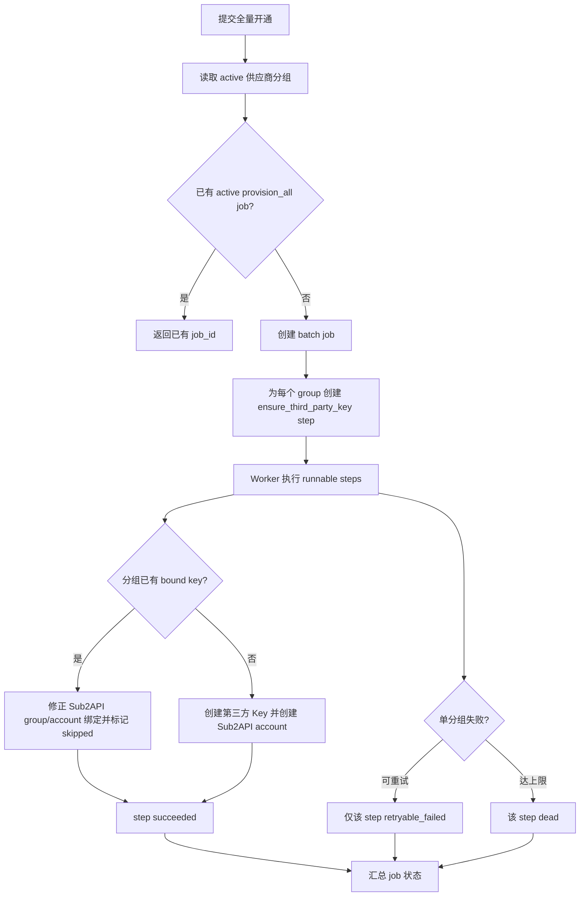

# 供应商账号开通异步治理方案

版本：v0.2.2
日期：2026-06-21
状态：第一阶段已落地；Postgres 任务事实源 + Redis Stream consumer group 唤醒 + DB claim Worker + 可配置 Sub2API Gateway HTTP Adapter + UI 轮询 + `provision_all_group_keys` 每分组 step 已接入，真实 E2E 仍待收口
范围：供应商分组同步、第三方 Key 创建、真实 Sub2API 分组/账号落地、Admin Plus 绑定投影、余额/费率/健康初次采集。

## 1. 背景与结论

供应商账号开通不能继续做成请求线程内的同步长链路。这个链路同时跨越第三方供应商、Admin Plus 数据库、真实 Sub2API Admin API、Redis 缓存和前端状态展示，任何一步失败都会造成重复 Key、半绑定账号、页面误判或真实网关不可见。

异步化后的目标事实源：

```text
Admin Plus API 接收运营意图 -> 写 Postgres job + outbox event -> Redis Stream 唤醒/DB claim -> Worker 执行 -> Provider Adapter / Sub2API Gateway Adapter -> Admin Plus 写投影和审计
```

Redis 不是任务事实源。Redis 在本链路中的定位是队列、锁、短 TTL secret handoff 和余额/运行态缓存；Postgres 保存 job/step/outbox/attempt 的长期事实和审计。原因是 Redis Stream 适合快路径和水平扩展，但不能替代幂等、审计、失败重放、重启恢复和历史追溯。

治理分类：

| 类别 | 路径 | 结论 |
|------|------|------|
| `current` | `supplier_provision_jobs`、`supplier_provision_steps`、`admin_plus_outbox_events`、`supplier_provision_attempts`、Redis Stream consumer group、Provision Worker、供应商分组弹窗任务 UI | 当前已接入的任务事实源、队列唤醒和执行入口 |
| `current` | `supplierkeys.Sub2APIGateway` 边界与 `Sub2APIHTTPGateway` | 已把真实 Sub2API 落地语义从 `LocalAccountService` 收口为 Gateway 接口；配置远端 Admin API 后走 HTTP Adapter |
| `current-compat-executor` | Worker 内复用的 `suppliergroups.Service.Sync`、`supplierkeys.Service.Provision`、`supplierkeys.Service.EnsureGroup` | 第一阶段执行器，负责复用已验证能力；`provision_all_group_keys` 已从 `EnsureAll` 大循环拆成每分组 step，后续继续拆成更细 Saga step |
| `compat` | `UseSub2APIGateway(adminService)` 的本进程回退实现 | 仅在未配置远端 Sub2API Admin API 时用于本地开发；生产退出条件是配置 HTTP Gateway 环境变量 |
| `compat` | `POST /groups/sync`、`POST /keys/provision`、`POST /keys/ensure-all` | 生产 ProviderSet 中只提交异步任务并返回 `job_id`；测试或旧注入可短期回退同步结果，不继续增强同步业务逻辑 |
| `deprecated` | 请求线程内串联创建第三方 Key、本地账号、绑定 | 生产路径已迁出；保留兼容构造仅用于旧测试和临时注入，退出条件是所有测试和调用方改为异步契约 |
| `deprecated` | Admin Plus 直接写本地 `accounts/groups` 当真实网关事实 | 异步 Gateway Adapter 落地后禁止；目标写入只允许走真实 Sub2API Admin API |
| `dead` | Chrome 插件解析分组、余额、账单、创建 Key | 不再作为主路径验收 |

架构依据：

- Transactional Outbox 用于避免“业务数据库写入成功、消息发送失败”或反向失败的双写不一致。
- Saga 用于把“创建第三方 Key -> 创建真实 Sub2API group/account -> 写绑定”拆成可重试、可补偿的本地事务。
- 队列按 at-least-once 处理，消费者必须幂等；不能依赖“消息只投递一次”来保证不重复创建 Key。

参考资料：

- Microservices.io: Transactional Outbox Pattern, https://microservices.io/patterns/data/transactional-outbox.html
- AWS Prescriptive Guidance: Transactional outbox pattern, https://docs.aws.amazon.com/prescriptive-guidance/latest/cloud-design-patterns/transactional-outbox.html
- Microservices.io: Saga Pattern, https://microservices.io/patterns/data/saga.html
- Microsoft Azure Architecture Center: Saga design pattern, https://learn.microsoft.com/en-us/azure/architecture/patterns/saga
- Google Cloud Pub/Sub: Exactly-once delivery, https://docs.cloud.google.com/pubsub/docs/exactly-once-delivery

## 2. 分层架构



分层职责：

| 层 | 职责 | 禁止事项 |
|----|------|----------|
| API / Intent Layer | 鉴权、参数校验、幂等键校验、创建 job、写 outbox、快速返回 `job_id` | 不直接调用供应商写接口，不直接创建真实 Sub2API 账号 |
| Orchestration / Saga Layer | 推进步骤、状态机、重试、补偿、审计、失败分类 | 不解析供应商私有响应细节 |
| Provider Adapter Layer | 登录、读取分组/余额/费率、创建第三方 Key | 不写真实 Sub2API，不写 Admin Plus 绑定事实 |
| Sub2API Gateway Adapter Layer | 通过真实 Sub2API Admin API ensure group/account | 不直写 Sub2API DB/Redis |
| Projection Layer | Admin Plus 分组、Key、绑定、余额、健康等运营投影 | 不把投影当真实网关事实源 |

### 2.1 Redis 与 Postgres 分工

| 组件 | 定位 | 当前实现 | 审计要求 |
|------|------|----------|----------|
| Postgres `supplier_provision_jobs` | 批次事实源 | 已落地，API 创建，Worker claim | 必须保留请求脱敏快照、状态、错误、重试次数 |
| Postgres `supplier_provision_steps` | 步骤事实源 | 已落地；单分组 job 一个 step，全量开通 job 按每个供应商分组展开 step | 后续 Saga 拆分时继续扩展，不另起表 |
| Postgres `admin_plus_outbox_events` | 事件事实源 | 已落地，API 同事务写入 | Redis 发布失败不得丢事件 |
| Postgres `supplier_provision_attempts` | 执行审计 | 已落地，记录每次 Worker 执行结果 | 禁止保存完整 token、cookie、key、password |
| Redis Stream `admin_plus:provision:events` | 事件快路径和 Worker 唤醒 | 已落地 `XADD`、`XREADGROUP`、`XACK`；consumer group 为 `admin_plus_provision_workers` | 不作为唯一事实；可从 Postgres outbox 重放 |
| Redis lock / TTL secret | 并发控制和短期密钥传递 | 待拆出到 Gateway Adapter 阶段 | secret 必须加密、短 TTL、不可进入 job/outbox |
| Redis 余额缓存 | 余额快照加速 | 已有 `admin_plus:supplier:{id}:balance:current` | 未过期前优先读缓存；过期后重新采集，失败兜底 0 |

真实 C 端服务事实源始终是 `/Users/coso/Documents/dev/go/sub2api` 对应的真实 Sub2API 服务。Admin Plus 只能通过 Sub2API Admin API 写入 group/account，并保存返回 ID 和脱敏快照。

## 3. 任务与事件模型

### 3.1 `supplier_provision_jobs`

用于批次级追踪。一个 job 可以是同步分组、单分组开通、全量按分组开通或修复绑定。

| 字段 | 说明 |
|------|------|
| `id` | job id，前端轮询和审计入口 |
| `job_type` | `sync_groups` / `provision_group_key` / `provision_all_group_keys` / `repair_binding` |
| `supplier_id` | 供应商父级 |
| `idempotency_key` | 管理端请求幂等键 |
| `status` | `queued` / `running` / `succeeded` / `partial_succeeded` / `retryable_failed` / `dead` / `cancelled` |
| `requested_by` | 管理员 ID |
| `request_snapshot` | 脱敏后的请求参数 |
| `result_snapshot` | 脱敏后的汇总结果 |
| `error_code` / `error_message` | 最后一条错误摘要 |
| `attempts` / `max_attempts` | 批次级重试 |

### 3.2 `supplier_provision_steps`

用于分组和步骤级追踪。一个分组至少包含以下 step：

| step_type | 说明 |
|-----------|------|
| `ensure_supplier_session` | 确认可用 direct login 或 browser extension 会话 |
| `sync_supplier_group` | 读取并 upsert 供应商分组投影 |
| `ensure_third_party_key` | 在供应商侧创建或复用第三方 Key |
| `ensure_sub2api_group` | 在真实 Sub2API 中创建或复用 group |
| `ensure_sub2api_account` | 在真实 Sub2API 中创建或复用 account |
| `upsert_admin_plus_binding` | 写 Admin Plus 绑定投影 |
| `enqueue_initial_collection` | 触发余额、费率、健康初次采集事件 |

状态包括 `queued`、`running`、`succeeded`、`retryable_failed`、`manual_required`、`dead` 和 `skipped`。

### 3.3 `admin_plus_outbox_events`

所有 job 创建、step 完成和后续采集触发都先写 outbox。API 层和业务状态写入必须在同一个数据库事务内完成。

| 字段 | 说明 |
|------|------|
| `event_id` | 全局唯一事件 ID |
| `event_type` | `supplier.groups.sync.requested` 等 |
| `aggregate_type` | `supplier` / `supplier_provision_job` |
| `aggregate_id` | 对应 supplier 或 job |
| `payload` | 脱敏事件体 |
| `status` | `pending` / `published` / `failed` |
| `available_at` | 延迟重试时间 |

### 3.4 `processed_events`

`processed_events` 用于后续多事件消费去重。当前第一阶段 Redis consumer group 负责唤醒和 ack，业务执行仍以 DB claim、终态状态和外部幂等防重复；不能把 Redis ack 当成“业务已成功”的证据。

幂等判断优先级：

1. `event_id` 是否已处理。
2. job/step 状态是否已达终态。
3. 外部资源是否已存在并匹配命名/metadata。
4. Admin Plus 唯一索引是否已有绑定投影。

## 4. 异步主流程

### 4.1 分组同步



### 4.2 单分组开通 Key/账号



### 4.3 全量按分组开通

`provision_all_group_keys` 不允许一次性在请求线程内循环创建。它只创建一个 batch job，然后为每个 active 供应商分组创建 `ensure_third_party_key` step；已有绑定的分组在 step 内走幂等校验和本地 Sub2API group/account 修正，不重复创建第三方 Key。

并发规则：

- 同一供应商同一时间只允许一个 active `provision_all_group_keys` job。
- 同一 `supplier_group_id` 只允许一个未终态 `ensure_third_party_key` step。
- Worker 并发按供应商限流，避免触发第三方风控。
- 单个分组失败不阻断其他分组，job 最终可为 `partial_succeeded`。





## 5. 幂等与命名规则

所有外部写操作都必须先查找、再创建。

| 对象 | 幂等键 | 查找策略 |
|------|--------|----------|
| 第三方 Key | `supplier_id + supplier_group_external_id + purpose + name_rule_version` | 优先按供应商 key name 和 metadata；供应商不支持 metadata 时按 name 前缀和创建时间窗口 |
| 真实 Sub2API group | `supplier_id + supplier_group_external_id` | 通过 Sub2API Admin API 查询全部 group，按 metadata 或规范 name 匹配 |
| 真实 Sub2API account | `supplier_key_id` 或 `supplier_id + supplier_group_external_id` | 通过 Sub2API Admin API 查询账号，按 metadata、name 和 base_url 匹配 |
| Admin Plus binding | `supplier_id + supplier_group_id + supplier_key_id + local_sub2api_account_id` | 数据库唯一约束 + upsert |
| 队列事件 | `event_id` | `processed_events` 去重 |

命名规则：

```text
第三方 Key name: sub2apiplus-{supplier_slug}-{group_slug}-{purpose}-v{rule_version}
Sub2API group name: supplier:{supplier_id}:{group_slug}
Sub2API account name: supplier:{supplier_id}:{group_slug}:{external_key_last4}
```

命名只用于查找和人工排查，不能作为唯一安全凭据。所有日志和响应禁止输出完整 key、token、cookie、密码。

## 6. 失败、补偿与重试

失败分类：

| 错误码 | 类型 | 处理 |
|--------|------|------|
| `SESSION_REQUIRED` | 人工可修复 | UI 提示直登或插件兜底 |
| `SESSION_EXPIRED` | 人工或自动可修复 | 先尝试 direct_login，失败后提示插件 |
| `CAPABILITY_MISSING` | 需要开发适配器 | step 标记 `manual_required` |
| `PROVIDER_RATE_LIMITED` | 可重试 | 指数退避 |
| `PROVIDER_KEY_CREATE_FAILED` | 视错误决定 | 可重试或转人工 |
| `SUB2API_GROUP_CREATE_FAILED` | 可重试 | 不再创建新的第三方 Key |
| `SUB2API_ACCOUNT_CREATE_FAILED` | 可重试/人工修复 | 加密短 TTL 保存待修复 secret，过期后需要重新创建或人工导入 |
| `BINDING_UPSERT_FAILED` | 可重试 | 不调用外部写接口，只重试本地投影 |

补偿原则：

- 第三方 Key 创建成功后，通常不能删除或回滚，只能进入 `manual_required` 或重试真实 Sub2API 落地。
- 本地 Sub2API group/account 创建是 retryable step；重试前必须先查找是否已经创建。
- Admin Plus 绑定失败不再触发第三方 Key 重建。
- 第三方 Key 明文只允许内存流转；确需跨重试保存时必须加密并设置短 TTL。

数据库和 UI/UX 都需要重构。数据库重构解决异步事实源、幂等、重试和跨系统可见性问题；UI/UX 重构解决运营者不知道当前停在哪一步、是否真的写入 Sub2API、失败后应该重试还是人工介入的问题。

## 7. 数据库重构方案

### 7.1 必须新增的事实源表

| 表 | 定位 | 说明 |
|----|------|------|
| `supplier_provision_jobs` | `current-target` 任务事实源 | 记录同步分组、单分组开通、全量开通、修复绑定的批次状态 |
| `supplier_provision_steps` | `current-target` 步骤事实源 | 记录每个分组每个 Saga step 的状态、重试、错误和外部资源引用 |
| `admin_plus_outbox_events` | `current-target` 事件事实源 | 与业务状态同事务写入，供 relay/worker 投递 |
| `processed_events` | `current-target` 消费去重事实源 | 防止队列重复投递导致重复创建第三方 Key 或 Sub2API account |
| `supplier_provision_attempts` | `current-target` 审计明细 | 记录每次外部调用的脱敏 request/response、耗时和错误分类 |

### 7.2 现有表的定位调整

| 现有表 | 新定位 | 调整 |
|--------|--------|------|
| `admin_plus_supplier_groups` | `current` 供应商分组投影 | 保留；增加最近同步 job/step 引用、外部可见性和差异状态 |
| `admin_plus_supplier_keys` | `current` 第三方 Key 投影 | 保留；不再承载开通流程事实，增加 `provision_job_id`、`provision_step_id`、`external_visibility_status` |
| `admin_plus_supplier_accounts` | `current` 绑定投影 | 保留；必须能追溯真实 Sub2API account ID、group ID、最后验证时间 |
| `idempotency_records` | `compat/current` API 请求去重 | 保留；只解决 HTTP 重复提交，不替代 job/step/outbox 的业务幂等 |
| 旧本地 `accounts/groups` 写入路径 | `deprecated` | 生产不再直接调用；真实写入必须走 Sub2API Admin API |

### 7.3 建议字段

`supplier_provision_jobs`：

```text
id, job_type, supplier_id, status, idempotency_key_hash,
requested_by, request_snapshot, result_snapshot,
total_steps, succeeded_steps, failed_steps, manual_required_steps,
attempts, max_attempts, next_run_at, locked_by, locked_until,
error_code, error_message, created_at, updated_at, finished_at
```

`supplier_provision_steps`：

```text
id, job_id, supplier_id, supplier_group_id, step_type, status,
idempotency_key, external_resource_type, external_resource_id,
attempts, max_attempts, next_run_at, locked_by, locked_until,
error_code, error_message, request_snapshot, result_snapshot,
created_at, updated_at, finished_at
```

`admin_plus_outbox_events`：

```text
event_id, event_type, aggregate_type, aggregate_id,
payload, status, attempts, available_at, published_at,
created_at, updated_at
```

关键索引和约束：

- `supplier_provision_jobs(job_type, supplier_id, idempotency_key_hash)` 唯一，防止同一批次重复提交。
- `supplier_provision_steps(job_id, supplier_group_id, step_type)` 唯一，防止同一分组同一步骤重复创建。
- `supplier_provision_steps(supplier_id, supplier_group_id, step_type)` 对未终态记录建立部分唯一索引，防止并发开通同一分组。
- `admin_plus_outbox_events(status, available_at)` 支持 relay 扫描。
- `processed_events(event_id)` 唯一，支持幂等消费。

### 7.4 迁移策略

1. 只新增 forward-only migration，不修改已应用迁移文件。
2. 先加表和只读查询接口，再把 `groups/sync`、`keys/provision`、`keys/ensure-all` 改成提交 job。已完成：`backend/migrations/169_admin_plus_supplier_provision_jobs.sql`、`GET /admin-plus/supplier-provision-jobs/:jobID`、`GET /admin-plus/supplier-provision-jobs`。
3. 当前同步 `supplierkeys` 逻辑先迁入 Worker step handler；迁移期 handler 可以保留 compat 分支，但不得继续增强。已完成第一阶段：Worker 复用 `suppliergroups.Service.Sync`、`supplierkeys.Service.Provision`、`supplierkeys.Service.EnsureGroup`；`supplierkeys.Service.EnsureAll` 仅作为无任务服务注入时的 compat fallback。
4. 对已有 `admin_plus_supplier_keys` / `admin_plus_supplier_accounts` 数据执行一次 backfill：生成 `legacy_import` job 和已成功 step，便于 UI 和审计统一展示。
5. 上线后用治理扫描或测试禁止生产 ProviderSet 回退到 Admin Plus 本地 `AdminService` 作为真实 Sub2API 写入路径；生产必须配置 Sub2API Gateway HTTP Adapter 调真实 Sub2API Admin API。

### 6.1 Gateway HTTP Adapter 配置

当前已落地 `Sub2APIHTTPGateway`：

```text
ADMIN_PLUS_SUB2API_ADMIN_BASE_URL=https://your-sub2api.example
ADMIN_PLUS_SUB2API_ADMIN_API_KEY=admin-...
```

运行规则：

- 两个环境变量同时存在时，`UseSub2APIGateway` 走真实 Sub2API Admin API。
- 任一变量缺失时，回退同进程 `AdminService`，只作为本地开发和旧测试兼容。
- HTTP Adapter 使用 `x-api-key` 调用 `/api/v1/admin/groups`、`/api/v1/admin/groups/all`、`/api/v1/admin/accounts` 和 `/api/v1/admin/accounts/:id`。
- HTTP Adapter 只解析远端脱敏响应中的 ID、名称、平台、类型、分组和 `extra` 等必要字段；不从远端读取或依赖完整 secret。

第一阶段运行时入口：

| API | 当前语义 | 返回 |
|-----|----------|------|
| `POST /api/v1/admin-plus/suppliers/:id/groups/sync` | 创建 `sync_groups` job | `202 Accepted + job_id + poll_url + mode=async_job` |
| `POST /api/v1/admin-plus/suppliers/:id/keys/provision` | 创建 `provision_group_key` job | `202 Accepted + job_id + supplier_group_id` |
| `POST /api/v1/admin-plus/suppliers/:id/keys/ensure-all` | 创建 `provision_all_group_keys` job | `202 Accepted + job_id` |
| `GET /api/v1/admin-plus/supplier-provision-jobs/:jobID` | 查询 job/step 状态 | 脱敏 job、step、result snapshot |
| `GET /api/v1/admin-plus/supplier-provision-jobs?supplier_id=...` | 查询最近任务 | 分页列表 |

## 8. UI/UX 重构方案

供应商分组弹窗采用步骤式任务视图，不再平铺所有字段。

```text
┌────────────────────────────────────────────────────────────┐
│ AI Pixel / 分组与账号开通                                  │
├────────────────────────────────────────────────────────────┤
│ 1 会话  ✓ 可用 browser_extension，10 分钟前验证             │
│ 2 分组  ✓ 已同步 11 个分组，2 个新增                         │
│ 3 开通  ● 选择未绑定分组并创建 Key/账号                      │
│ 4 验证  ○ 等待真实 Sub2API 可见和初次采集                    │
├────────────────────────────────────────────────────────────┤
│ 分组              倍率    状态              操作             │
│ default           1.00   已绑定 #456        查看             │
│ claude-pro        0.85   未开通             创建 Key/账号    │
│ gpt-premium       1.20   失败: 会话过期      重试             │
├────────────────────────────────────────────────────────────┤
│ 当前任务 #job_123：创建 9/11，失败 1，处理中 1               │
└────────────────────────────────────────────────────────────┘
```

当前第一阶段 UI 原型已落到供应商分组弹窗：

```text
┌────────────────────────────────────────────────────────────┐
│ 供应商分组 - AI Pixel                                      │
│ 搜索 [............]  状态 [全部]      [刷新] [同步分组] [补齐 Key/账号] │
├────────────────────────────────────────────────────────────┤
│ ① 会话        ✓ 后端直登/Chrome 兜底                       │
│ ② 分组        ✓ 11 个分组                                  │
│ ③ Key         ● 补齐全部 Key/账号任务 #124                  │
│ ④ 验证        ○ 待任务完成                                  │
├────────────────────────────────────────────────────────────┤
│ 当前任务 #124  执行中  补齐全部 Key/账号  2026-06-21 15:20  │
│ 服务端正在执行，请稍候。                                    │
├────────────────────────────────────────────────────────────┤
│ 分组        倍率     Key / 本地账号        状态       操作   │
│ default     1.00     已绑定 #45            有效       修复   │
│ claude      0.85     未开通                有效       开通   │
└────────────────────────────────────────────────────────────┘
```

交互收口：

- “同步分组”和“补齐 Key/账号”拆成两个按钮，不再一个按钮里同步做长链路。
- 单组“开通”只提交 `provision_group_key` job，弹窗内显示任务状态。
- API 返回 `job_id` 时只提示“任务已提交”；只有 job 终态后刷新投影列表。

显示规则：

- 默认只展示当前步骤需要的按钮。
- 会话不可用时只显示“后端直登”和“打开插件兜底”，不显示创建 Key。
- 分组未同步时只显示“同步分组”。
- 分组已绑定时不显示创建按钮。
- step 失败时显示错误摘要、重试和人工修复入口。

### 8.1 页面信息架构

供应商管理页仍是主入口，但页面内要拆成三类区域：

| 区域 | 目的 | 展示内容 |
|------|------|----------|
| 供应商列表 | 找到父级和整体状态 | 会话状态、分组数量、绑定数量、最后任务状态、余额新鲜度 |
| 分组弹窗 | 完成主流程 | 会话、同步分组、开通 Key/账号、真实 Sub2API 验证 |
| 任务抽屉 | 追踪异步执行 | job/step 进度、失败原因、重试、人工修复、审计 |

账号/Key 绑定页只作为修复和审计入口，不再作为新增主流程。

### 8.2 交互状态

| 状态 | 主按钮 | 次按钮 | 禁止展示 |
|------|--------|--------|----------|
| `session_missing` | 后端直登 | 插件兜底 | 创建 Key |
| `session_ready` | 同步分组 | 刷新会话 | 全量开通 |
| `groups_synced` | 开通选中分组 | 全量按分组开通 | 已绑定分组的创建按钮 |
| `job_running` | 查看进度 | 后台执行 | 重复提交同一分组 |
| `manual_required` | 人工修复 | 重试可重试步骤 | 假成功提示 |
| `sub2api_verified` | 查看账号 | 初次采集 | 继续创建重复账号 |

### 8.3 成功定义

UI 不能在 API 返回 `job_id` 时显示“创建成功”。只能显示“任务已提交”。

真正成功必须同时满足：

1. 第三方 Key 投影为 `bound`。
2. Admin Plus 绑定投影存在。
3. 真实 Sub2API Admin API 查询到 group/account。
4. 初次余额、费率或健康采集至少一个成功，或明确标记为 `monitor_only`。

## 9. API 契约

### 9.1 提交分组同步任务

```http
POST /api/v1/admin-plus/suppliers/:id/groups/sync
Idempotency-Key: supplier-24-sync-groups-20260621
```

响应：

```json
{
  "job_id": 123,
  "status": "queued",
  "job_type": "sync_groups",
  "supplier_id": 24,
  "poll_url": "/api/v1/admin-plus/supplier-provision-jobs/123",
  "mode": "async_job"
}
```

### 9.2 提交单分组开通任务

```http
POST /api/v1/admin-plus/suppliers/:id/keys/provision
Idempotency-Key: supplier-24-group-claude-pro-provision-v1
```

响应：

```json
{
  "job_id": 124,
  "status": "queued",
  "job_type": "provision_group_key",
  "supplier_id": 24,
  "supplier_group_id": 12,
  "poll_url": "/api/v1/admin-plus/supplier-provision-jobs/124",
  "mode": "async_job"
}
```

### 9.3 查询任务

```http
GET /api/v1/admin-plus/supplier-provision-jobs/:job_id
```

响应只返回脱敏结果：

```json
{
  "id": 124,
  "job_type": "provision_group_key",
  "supplier_id": 24,
  "status": "running",
  "total_steps": 1,
  "succeeded_steps": 0,
  "failed_steps": 0,
  "manual_required_steps": 0,
  "steps": [
    {
      "id": 991,
      "job_id": 124,
      "step_type": "ensure_third_party_key",
      "supplier_group_id": 12,
      "status": "running"
    }
  ]
}
```

旧同步接口迁移期可以继续返回历史结构，但必须带上 `job_id` 和 `mode: "async_job"`，前端以 job 状态为准。

## 10. 测试用例

| 层级 | 用例 |
|------|------|
| 单元测试 | job 状态机、step 状态机、幂等键生成、错误分类、敏感字段脱敏 |
| Repository | job 创建与 outbox 同事务、step claim、并发 claim、processed_events 去重 |
| Worker | 重复事件不重复创建 Key、Sub2API account 创建失败后只重试本地落地、不重复调用 Provider CreateKey |
| Provider Adapter | 真实 Sub2API 同源供应商读取 profile、分组、创建 Key；失败响应归一化 |
| Gateway Adapter | 真实 Sub2API Admin API 查询/创建 group 和 account，重复执行不重复创建 |
| E2E | 添加供应商、会话获取、同步 11 个分组、每组一个 Key、Admin Plus 可见绑定、真实 Sub2API 可见 group/account |
| 安全 | API 响应、日志、job snapshot、outbox payload 不包含完整 token/cookie/key/password |

验收口径：

- UI 显示成功不等于验收成功；必须在真实 Sub2API 后台或 Admin API 中能看到对应 group/account。
- `provision_all_group_keys` 对每个供应商分组最多创建一个第三方 Key 和一个真实 Sub2API account。
- Worker 重启、队列重复投递、API 重复提交都不能造成重复 Key。
- 余额过期前读取缓存；过期后由事件触发重新采集，兜底值为 0 但不能覆盖未过期真实值。

## 11. 首批落地顺序

1. [x] 新增 job、step、outbox、processed_events、attempts 数据结构和 SQL repository。
2. [x] 新增 Redis Stream publisher，stream key 为 `admin_plus:provision:events`。
3. [x] 新增 Redis Stream consumer group 唤醒，consumer group 为 `admin_plus_provision_workers`，Worker 使用 `XREADGROUP` 等待事件并 `XACK`。
4. [x] 新增 Provision Worker：发布 pending outbox、DB claim 任务、执行并记录 attempt；Redis 不可用时继续按 DB claim 扫描执行。
5. [x] 把 `groups/sync` 改成提交 `sync_groups` job。
6. [x] 把 `keys/provision` 改成提交 `provision_group_key` job。
7. [x] 把 `keys/ensure-all` 改成提交 `provision_all_group_keys` job。
8. [x] UI 分组弹窗改为步骤式任务视图，API 返回 `job_id` 时只显示“任务已提交”，轮询任务状态。
9. [x] 将本地 Sub2API 落地接口命名收口为 `Sub2APIGateway`。
10. [x] 新增可配置 `Sub2APIHTTPGateway`，配置 `ADMIN_PLUS_SUB2API_ADMIN_BASE_URL` 和 `ADMIN_PLUS_SUB2API_ADMIN_API_KEY` 后通过真实 Sub2API Admin API ensure group/account。
11. [x] 将 `provision_all_group_keys` 从单 step `EnsureAll` 拆成每分组 `ensure_third_party_key` step，支持部分成功和分组级重试。
12. [ ] 增加真实 Sub2API 可见性验证和 E2E。
13. [ ] 将旧插件业务任务降级为 compat 补录入口，默认任务中心只保留会话采集和后端任务状态。

## 12. 当前落地审计清单

| 范围 | 文件 | 状态 |
|------|------|------|
| migration | `backend/migrations/169_admin_plus_supplier_provision_jobs.sql` | 已新增 forward-only migration |
| domain | `backend/internal/adminplus/domain/provision_job.go` | 已新增 job/step 类型 |
| app service | `backend/internal/adminplus/app/provisionjobs/*` | 已新增 service、SQL repository、Redis Stream publisher/consumer waiter、worker、provider；全量开通已按分组展开 step |
| gateway boundary | `backend/internal/adminplus/app/supplierkeys/service.go`、`provider.go`、`sub2api_gateway_http.go` | 已将本地 Sub2API 落地语义收口为 `Sub2APIGateway`；已新增可配置 HTTP Adapter；`LocalAccountService` 仅为兼容别名 |
| API handler | `backend/internal/handler/adminplus/provision_job_handler.go` | 已新增查询接口 |
| compat handler | `supplier_group_handler.go`、`supplier_key_handler.go` | 生产注入提交异步任务；无 provision service 时保留旧同步 fallback |
| route | `backend/internal/server/routes/adminplus.go` | 已新增 `/supplier-provision-jobs` |
| frontend API | `frontend/src/api/admin/adminPlus.ts` | 已改为 async job response |
| frontend UI | `frontend/src/views/admin/operations/SuppliersView.vue` | 已改步骤式任务面板、拆分“同步分组”和“补齐 Key/账号” |
| cleanup | `backend/cmd/server/wire.go`、`wire_gen.go` | 已接入 Provision Worker stop |

验证记录：

- `go test ./internal/adminplus/app/provisionjobs ./internal/handler/adminplus ./internal/server/routes ./cmd/server`
- `go test ./internal/adminplus/app/provisionjobs ./internal/adminplus/app/supplierkeys`
- `pnpm -C frontend typecheck`

剩余治理点：

- `current-compat-executor` 仍复用 `supplierkeys.Service` 的账号创建执行器；`provision_all_group_keys` 已拆成每分组 step，下一阶段要继续拆成 `ensure_third_party_key`、`ensure_sub2api_group`、`ensure_sub2api_account`、`upsert_admin_plus_binding` 等显式 Saga step。
- `Sub2APIHTTPGateway` 已落地，但真实 `ai-pixel.online` / 真实 Sub2API 部署的 E2E 仍未完成；生产必须配置 HTTP Gateway env，不能依赖同进程回退。
- `processed_events` 表已建；第一阶段 Redis consumer group 只负责唤醒和 ack，业务去重仍由 DB claim、终态状态、唯一索引和外部幂等承担。
