# 供应商分组、第三方密钥、本地账号与成本上下文方案

版本：v0.2.0
日期：2026-06-21
状态：账号链路目标方案；成本内容保留为账号链路上下文
范围：重新梳理供应商、后端直登、Chrome 插件兜底、第三方分组、第三方密钥、本地 Sub2API 账号、供应商充值订单、供应商兑换记录和 Admin Plus 成本对账入口关系。

> 财务对账事实源说明：完整双边账务、成本台账、收入台账、利润对账、异常处理和后台 PRD 以 [`../billing/README.md`](../billing/README.md) 为准。本文只保留供应商账号链路中必须知道的成本上下文，例如供应商父级需要能采集充值订单、兑换记录、usage 使用记录和余额快照。
>
> 账号开通异步治理：分组同步、第三方 Key 创建、真实 Sub2API 分组/账号落地和绑定投影的异步 job / outbox / worker / Saga 方案见 [`ASYNC_PROVISIONING.md`](ASYNC_PROVISIONING.md)。当前第一阶段已落地 Postgres 任务事实源、Redis Stream consumer group 唤醒、DB claim Worker、任务查询 API、分组弹窗步骤式 UI、可配置 `Sub2APIHTTPGateway`，并已将全量开通拆成每个供应商分组一个 `ensure_third_party_key` step。生产需配置 `ADMIN_PLUS_SUB2API_ADMIN_BASE_URL` 与 `ADMIN_PLUS_SUB2API_ADMIN_API_KEY` 才走真实 Sub2API Admin API；未配置时仅作为本地开发兼容回退到同进程 `AdminService`。

## 1. 设计结论

新的主流程必须按以下顺序推进：

1. 在 Admin Plus 先添加供应商父级。
2. Admin Plus 优先使用供应商登录配置进行后端直登，获取供应商用户侧 access token、cookie、CSRF 和上下文。
3. 如果供应商需要验证码、2FA、强风控或未知页面上下文，再使用 Chrome 插件采集已登录浏览器会话。
4. Admin Plus 加密保存供应商会话包，并记录来源为 `direct_login` 或 `browser_extension`。
5. Admin Plus Provider Adapter 基于统一会话包读取供应商分组。
6. 运营者在供应商分组弹窗的某个分组行选择“开通 Key/账号”，填写密钥和本地账号参数。
7. Admin Plus Provider Adapter 基于统一会话包创建第三方密钥。
8. Admin Plus 提交异步开通任务，由 Worker 通过真实 Sub2API Admin API 创建或修正本地分组和账号。
9. Admin Plus 建立供应商父级、第三方密钥、本地 Sub2API 分组/账号之间的绑定投影。
10. 后续费率、余额、健康、用量消耗、充值订单、兑换记录、成本台账和动作建议全部由 Provider Adapter 采集并落到供应商父级或绑定子级。

核心原则：

- 供应商是父级。
- 第三方分组属于供应商。
- 第三方密钥由供应商创建，创建时选择供应商分组；Admin Plus 不创建供应商分组。
- 本地 Sub2API 账号是第三方密钥在本地网关中的落地实体。
- MVP 中按“一组一个可调度 Key/本地账号绑定”收敛；未绑定分组不能作为切换候选。
- Admin Plus 绑定关系只关联事实，不伪造第三方密钥，也不直接写本地 Sub2API 数据库。
- 写本地 Sub2API 必须走本地 Sub2API Admin API；读取可以走 Admin API、只读 DB 或只读 Redis。
- 分组同步、Key 开通和本地落地必须异步化；HTTP 请求只提交任务并返回 `job_id`，不再把跨供应商和本地网关的长事务放在请求线程里。
- 供应商会话获取采用双通道：后端直登优先，Chrome 插件兜底。
- 后端直登适用于无验证码、无 2FA、可稳定调用登录 API 的供应商；直登流程仍由 Provider Adapter 执行，不放到前端。
- Chrome 插件只负责作为浏览器兜底桥梁：识别供应商站点、采集已登录浏览器会话和第三方供应商页面上下文、上报给 Admin Plus。
- Provider Adapter 负责供应商侧业务能力：分组、费率、余额、公告、用量消耗、健康、并发和密钥创建。
- Admin Plus 应用层负责编排：能力探测、创建本地 Sub2API 账号、绑定、幂等、补偿和审计。
- 插件不做分组解析、不做费率/余额/用量消耗/充值订单/兑换记录采集，不创建第三方密钥；适配器暂不支持时，应标记能力缺失并新增适配器，不把业务动作塞回插件。
- 插件不是必须链路；只有后端直登失败、需要人工验证码/2FA、供应商强绑定浏览器环境时才进入插件兜底。
- 供应商成本上下文必须从供应商父级收口：充值订单、兑换记录、供应商用量消耗和余额快照共同进入成本台账；完整双边账务和下游收入台账见 `docs/roadmap/billing/README.md`。
- `admin_plus_supplier_usage_cost_lines` 只表示供应商用量消耗明细，不再单独代表完整成本。
- Sub2API 同源供应商必须优先读取用户侧 `/api/v1/payment/orders/my` 和 `/api/v1/redeem/history`，分别归一化为供应商充值订单和兑换记录。
- 供应商列表必须展示累计充值额度；成本模块必须同时展示累计充值额度、累计实付金额、累计兑换额度、已消耗成本、当前余额和资金差异。
- 供应商成本对账分两种口径：请求利润口径使用本地收入减供应商用量消耗；资金库存口径使用期初余额、充值、兑换、退款、消耗和期末余额核对。完整的上游成本、下游收入和经营利润三链路口径以 `docs/roadmap/billing/README.md` 为准。

## 2. 背景

当前页面把“供应商管理”和“账号/Key 绑定”割裂展示，容易让流程变成：

```text
先手工找一个本地 Sub2API 账号 -> 再手工绑定供应商 -> 再补费率或账号信息
```

这个顺序不符合真实运营。真实业务里，运营者需要先确定上游供应商，然后根据供应商后台的真实分组和费率创建可用密钥，再把这个密钥添加到本地 Sub2API 中，最后绑定成本、健康和对账数据。

因此账号链路需要从“绑定已有账号”改为“从供应商出发完成密钥开通和本地落地”。

## 3. 业务对象

| 对象 | 归属 | 来源 | 是否写入 Admin Plus | 说明 |
|------|------|------|---------------------|------|
| 供应商 | Admin Plus | 运营者创建 | 是 | 父级，例如某个 Sub2API/New API 上游实例 |
| 供应商登录配置 | Admin Plus | 运营者配置或临时录入 | 是，需加密和脱敏 | 用于后端直登；验证码/2FA 场景不强求可用 |
| 供应商会话 | Admin Plus | 后端直登或 Chrome 插件上报 | 是，需加密和过期 | 供 Provider Adapter 调用供应商用户侧 API |
| Provider Adapter | Admin Plus | 后端实现 | 否 | 供应商侧登录、采集和写操作适配层 |
| 供应商分组 | 供应商 | Provider Adapter 读取 | 是 | 包含名称、倍率、描述、私有标记、原始 ID |
| 第三方密钥 | 供应商 | Provider Adapter 创建 | 是，保存脱敏元数据 | 密钥明文只用于 Worker 调用真实 Sub2API Admin API 创建本地账号 |
| 本地 Sub2API 账号 | 本地 Sub2API | Admin Plus 调用 Sub2API Admin API 创建 | 只保存 ID 快照 | 承载第三方密钥，供本地网关调度 |
| 账号绑定 | Admin Plus | 系统创建 | 是 | 供应商父级 + 第三方密钥 + 本地账号 ID 的关联 |
| 供应商充值订单 | 供应商 | Provider Adapter 读取供应商用户侧订单 | 是 | Sub2API 同源供应商对应 `/api/v1/payment/orders/my`，表示向第三方充值产生的资金投入和到账额度 |
| 供应商兑换记录 | 供应商 | Provider Adapter 读取供应商用户侧兑换历史 | 是 | Sub2API 同源供应商对应 `/api/v1/redeem/history`，表示兑换码带来的第三方额度或权益 |
| 供应商用量消耗 | 供应商 | Provider Adapter 读取供应商用户侧用量 | 是 | 对应 `/api/v1/usage`，只表示请求级消耗成本，不代表完整资金投入 |
| 供应商成本台账 | Admin Plus | 充值订单、兑换记录、用量消耗、余额快照归一化生成 | 是 | 账号链路依赖的供应商成本摘要；完整财务模型见 `docs/roadmap/billing/README.md` |

## 4. 总体流程图

### 4.1 未知供应商自动创建流程

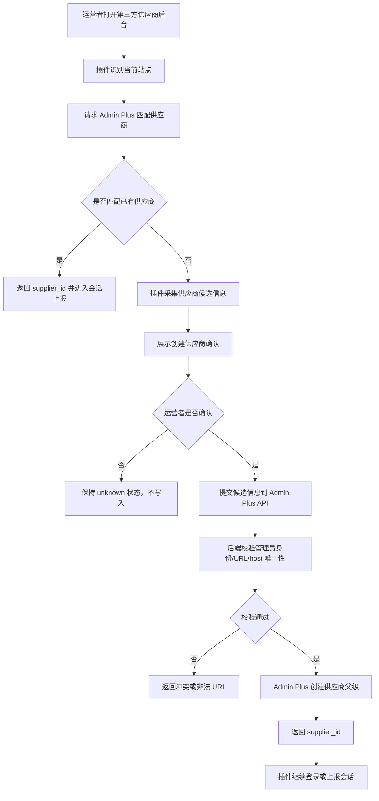

插件只负责提交候选信息，不能静默创建供应商，也不能直接写数据库。创建动作由 Admin Plus 后端在管理员登录态下完成。

### 4.2 会话获取双通道流程

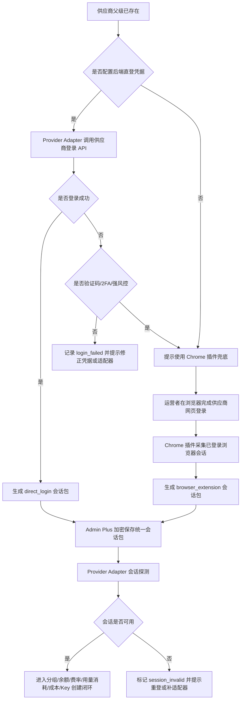

### 4.3 分组弹窗开通总流程

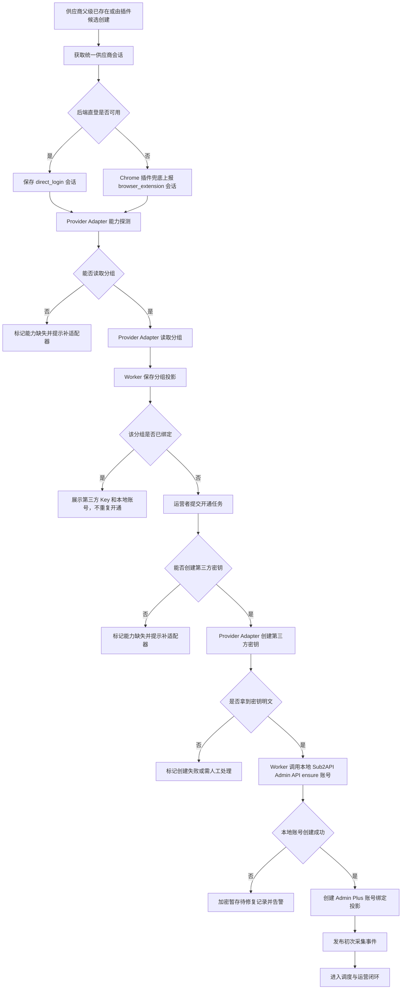

### 4.4 UI 与后端责任图

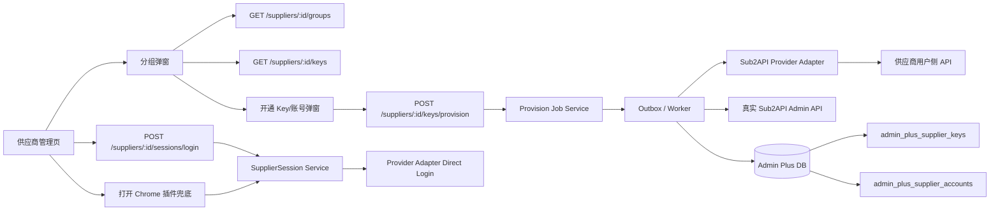

## 5. 数据关系图

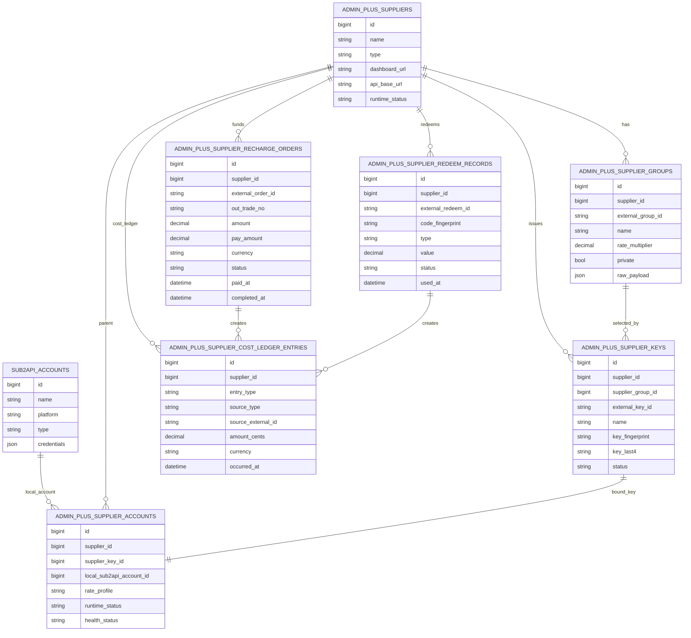

## 6. 端到端时序图

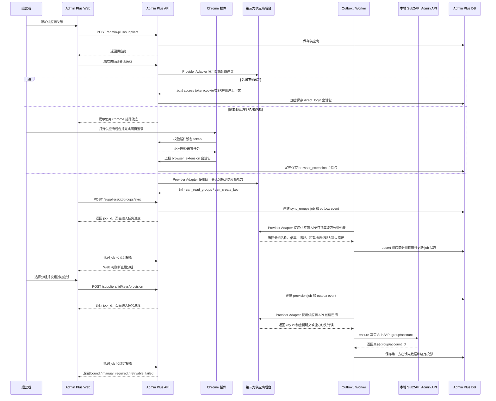

## 7. 分组同步流程图

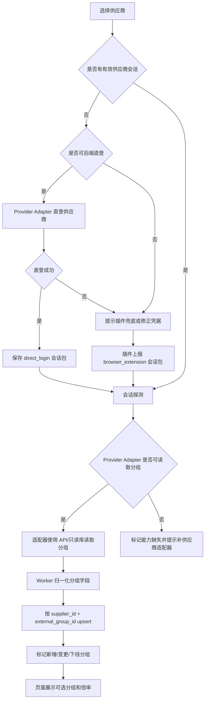

## 8. 密钥创建与本地同步时序图

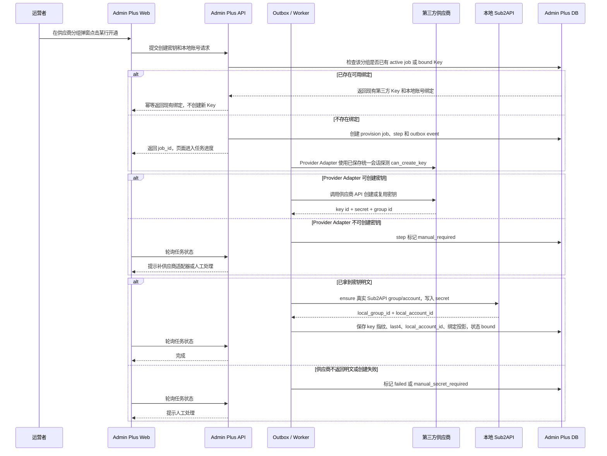

## 9. Provider Adapter 采集流程图

以下流程都遵守同一个边界：Admin Plus 后端优先通过 Provider Adapter 直登供应商并生成统一会话；Chrome 插件只在验证码、2FA、强风控或浏览器上下文绑定场景下采集已登录浏览器会话。Provider Adapter 才负责读取分组、余额、费率、公告、健康、并发、用量消耗、充值订单、兑换记录和创建第三方密钥。

### 9.0 同源 Sub2API 供应商余额采集口径

如果第三方供应商也是基于 Sub2API 源码部署，余额可以采集，但必须先明确采集的是哪一层余额。

| 余额类型 | 是否作为 MVP 主路径 | 采集方式 | 用途 | 限制 |
|----------|--------------------|----------|------|------|
| 我们在供应商 Sub2API 中的下游用户余额 | 是 | 后端直登或插件兜底形成统一会话后，Provider Adapter 调用供应商用户侧接口，例如 `/api/v1/user/profile` | 判断是否可继续使用、是否允许进入切换候选、余额不足通知 | 依赖普通用户登录态有效性 |
| 供应商自己的上游源站账号余额/额度 | 否，除非供应商授权 | 供应商 Admin API、只读 DB、只读 Redis 或供应商明确提供的只读集成 | 评估供应商整体稳定性 | 作为下游通常没有权限，不能默认采集 |
| 本地 Sub2API 账号额度和用量 | 是，但不是供应商余额 | 本地 Sub2API Admin API、只读 DB、只读 Redis | 本地调度、成本核算、对账 | 不得误判为供应商账户余额 |

MVP 的“供应商余额”默认定义为：我们作为下游用户在该供应商 Sub2API 实例中的当前可用余额或有效额度。这个余额决定供应商父级是否可以从 `monitor_only` 进入 `candidate`，也决定是否生成余额不足飞书通知。

Sub2API 同源供应商的优先采集路径：

1. Provider Adapter 优先使用供应商登录配置调用 `/api/v1/auth/login` 等价登录接口获取用户侧会话。
2. 如果直登失败且原因是验证码、2FA、强风控或浏览器绑定，再由 Chrome 插件上报已登录浏览器会话。
3. Provider Adapter 使用统一会话调用供应商用户侧接口读取 `/user/profile` 等价数据。
4. 从返回数据中归一化 `balance`、`currency`、`concurrency`、`allowed_groups`、`status`。
5. 如会话具备权限，再读取 `/api/v1/groups/available`、`/api/v1/groups/rates`、`/api/v1/keys`、`/api/v1/usage` 辅助判断分组、密钥入口和用量。
6. 只有供应商明确提供 Admin API Key 或只读 DB/Redis 时，才读取管理员侧账号、渠道或供应商上游账号数据。

当前 `Sub2APIProviderAdapter` 的非破坏性能力探测会访问以下用户侧接口：

| capability | 探测接口 | 说明 |
|------------|----------|------|
| `can_read_profile` / `can_read_balance` | `/api/v1/user/profile` | 读取当前用户 profile 和余额 |
| `can_read_groups` | `/api/v1/groups/available` | 判断是否可同步供应商分组 |
| `can_read_rates` | `/api/v1/channels/available` | 判断是否可读取渠道/模型费率 |
| `can_read_announcements` | `/api/v1/announcements` 或 `/api/v1/payment/checkout-info` | 判断是否可读取公告或充值页 |
| `can_read_usage_costs` | `/api/v1/usage?page=1&page_size=1` | 判断是否可读取用户侧用量消耗 |
| `can_read_funding_transactions` | `/api/v1/payment/orders/my?page=1&page_size=1` | 判断是否可读取当前供应商下游账号的充值订单 |
| `can_read_entitlement_transactions` | `/api/v1/redeem/history` | 判断是否可读取当前供应商下游账号的兑换记录 |
| `can_create_key` | `/api/v1/keys?page=1&page_size=1` | 只判断 Key 管理入口是否可访问，不执行创建 |

真正创建第三方 Key 时，Provider Adapter 调用供应商用户侧 `POST /api/v1/keys`。该写操作只能由管理员确认后的 Admin Plus provision 流程触发，不能由插件直接触发。

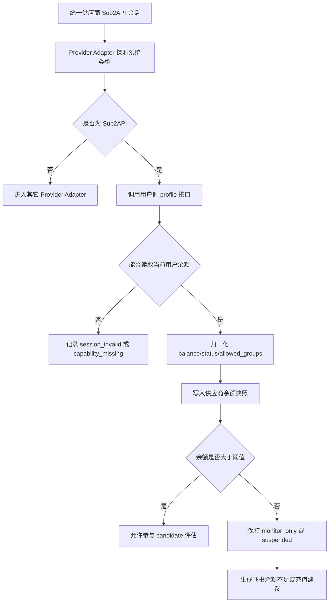

关键结论：

- 可以采集供应商余额，但主路径不是页面 DOM 抓取，而是后端使用统一会话调用供应商 Sub2API 用户侧 API。
- 统一会话优先来自后端直登；插件只作为浏览器兜底通道。
- 作为下游没有供应商 Admin Key，因此默认不能依赖供应商 `/api/v1/admin/*`。
- 不得把本地 Sub2API `accounts.quota_used`、`usage_logs` 或本地 API Key quota 当成供应商余额。
- 无余额供应商仍然可以监控费率和公告，但不能进入自动切换候选。

### 9.1 通用采集调度流程

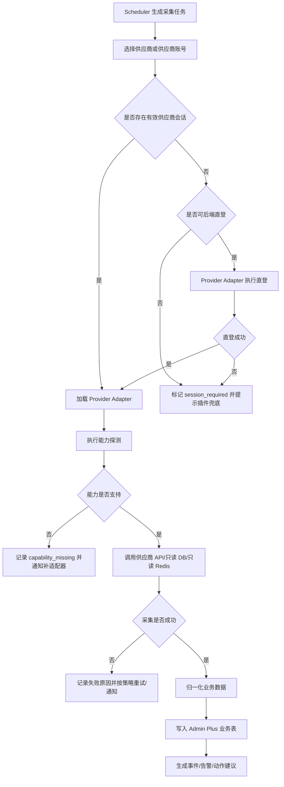

### 9.2 获取分组流程

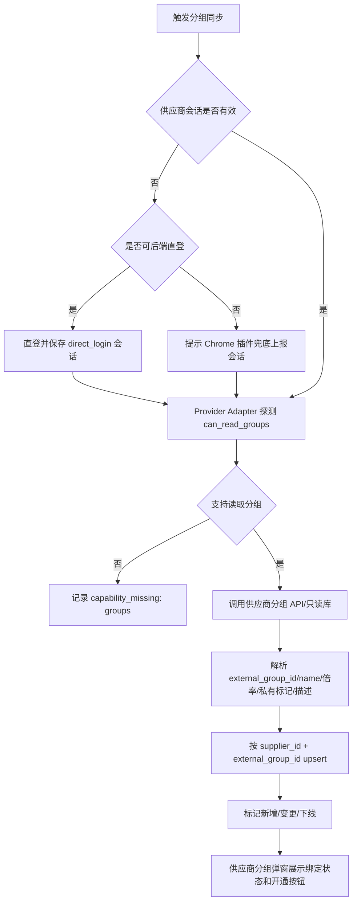

### 9.3 获取余额流程

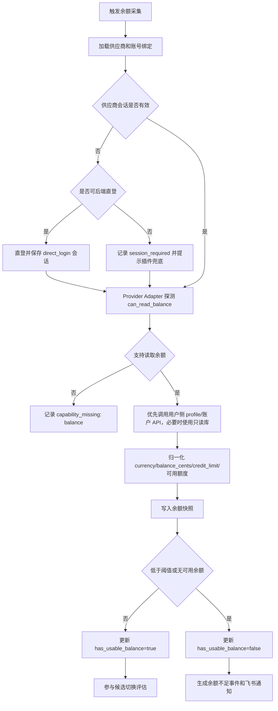

### 9.4 获取费率流程

当前主路径已经落地为后端 Provider Adapter 读取：

```text
POST /api/v1/admin-plus/suppliers/:id/rates/sync
```

该接口只使用 Admin Plus 已保存并解密后的统一供应商会话，由 `Sub2APIProviderAdapter.ReadRates(session)` 调用供应商用户侧受限 API，归一化为 `model / billing_mode / price_item / unit / currency / price_micros`，再交给 `rates.Service.RecordSnapshot` 写入 `admin_plus_rate_snapshots` 和 `admin_plus_rate_change_events`。旧插件任务 `fetch_rates` 仅作为兼容路径，不作为费率同步主链路继续增强。

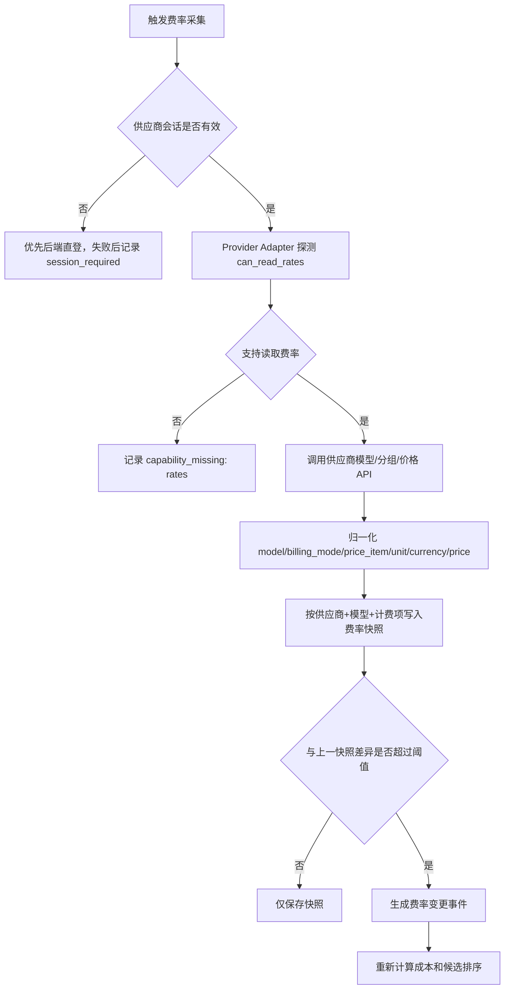

### 9.5 获取公告流程

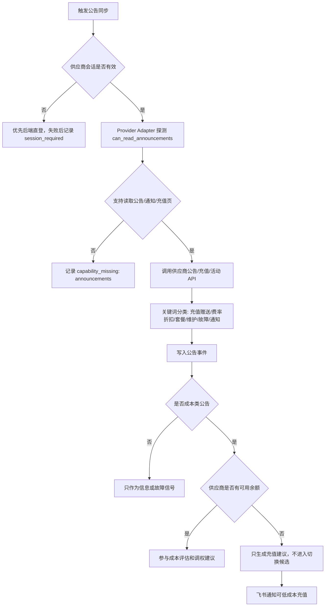

### 9.6 采集健康与并发事实流程

健康、并发和账号运行态是供应商状态、账号/Key 绑定和动作建议的输入事实，不注册独立后台页面。后台只在供应商、绑定、成本对账和运营事件等主流程中展示必要字段和事件。

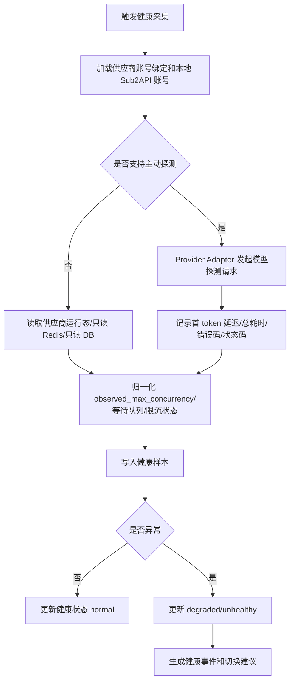

### 9.7 获取用量消耗流程

本节只处理供应商请求级用量消耗。它是“消耗成本明细”，不是完整成本事实源。完整成本必须进入 `9.8 获取充值订单与兑换记录流程` 和 `9.9 成本台账与对账流程`。

```mermaid
flowchart TD
  A[触发每日用量消耗采集] --> B{供应商会话或只读数据源是否可用}
  B -- 否 --> B1[优先后端直登，失败后记录 session_required 或 datasource_required]
  B -- 是 --> C[调用 POST /suppliers/:id/usage-costs/sync]
  C --> D[Provider Adapter 执行 ReadUsageCosts(session, date_range)]
  D --> E{是否读取到用量消耗明细}
  E -- 否 --> E1[记录 capability_missing: usage_costs]
  E -- 是 --> F[优先调用供应商用户侧 /api/v1/usage]
  F --> G[归一化 request_id/model/tokens/cost/计费模式/时间]
  G --> H[写入 supplier_usage_cost_lines]
  H --> I[写入 cost_ledger usage_debit 消耗分录]
  I --> J[与本地 Sub2API usage_logs 做请求级利润对账]
```

当前 `Sub2APIProviderAdapter.ReadUsageCosts(session, date_range)` 已落地，后端使用已保存并解密后的统一供应商会话优先读取供应商用户侧 `/api/v1/usage`，归一化后写入 `admin_plus_supplier_usage_cost_lines`。该表保持 `current` 的用量消耗明细定位，但不能再作为财务成本唯一事实源。Chrome 插件不解析用量消耗、不上传已解析用量消耗业务结果；`fetch_usage_costs` 插件任务仅作为兼容补录路径。

### 9.8 获取充值订单与兑换记录流程

Sub2API 同源供应商的 `/orders` 页面来自用户侧订单接口，`/redeem` 页面来自用户侧兑换接口。Admin Plus 必须按供应商父级采集这两类数据，因为它们代表我们对第三方供应商的充值投入和兑换额度来源。

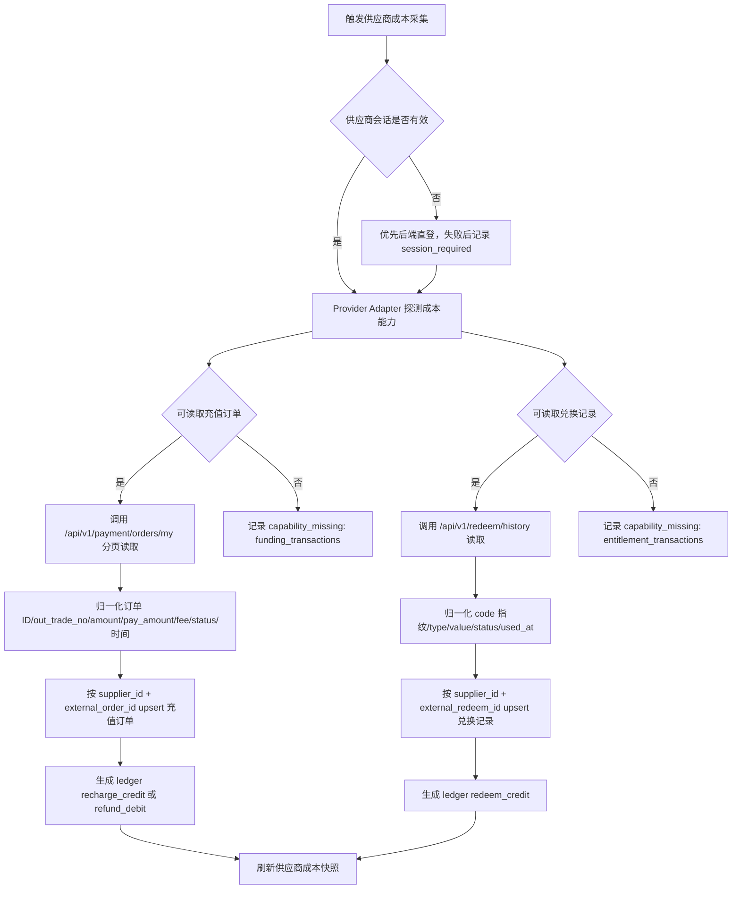

读取口径：

- `ReadFundingTransactions(session, date_range)` 对 Sub2API 同源供应商调用 `/api/v1/payment/orders/my`，仅保存当前下游账号可见订单。
- `ReadEntitlementTransactions(session, date_range)` 对 Sub2API 同源供应商调用 `/api/v1/redeem/history`，仅保存当前下游账号已兑换记录。
- 订单状态只把 `PAID`、`RECHARGING`、`COMPLETED` 计入充值额度；`REFUNDED`、`PARTIALLY_REFUNDED` 按退款金额生成反向分录；`PENDING`、`EXPIRED`、`CANCELLED`、`FAILED` 只留审计，不计入已投入成本。
- 兑换记录只把 `used` 或接口返回中明确已兑换的数据计入兑换额度；`balance` 类型计入余额额度，`subscription` 和 `concurrency` 类型计入权益成本事件但不直接与余额金额混算。
- `amount` 表示到账额度或订单标价，`pay_amount` 表示实付金额，`fee_rate` 表示支付手续费率。供应商列表的“充值累计额度”默认使用已完成订单的 `amount` 汇总，同时在成本模块展示 `pay_amount` 汇总。
- 兑换码明文不得长期保存。成本表只保存 code 指纹、末尾脱敏片段和原始响应脱敏快照。

### 9.9 成本台账与对账流程

本节是账号链路视角的供应商成本摘要，用于说明供应商父级、分组、第三方 Key 和本地账号绑定后，哪些成本事实会落到供应商父级。完整双边账务、下游 C 端收入、利润对账、异常闭环和后台 PRD 以 `docs/roadmap/billing/README.md` 为准。

供应商成本模块的 `current` 事实源是 `admin_plus_supplier_cost_ledger_entries` 和按供应商聚合的成本快照。充值订单、兑换记录、供应商用量消耗和余额快照只作为生成台账的输入。

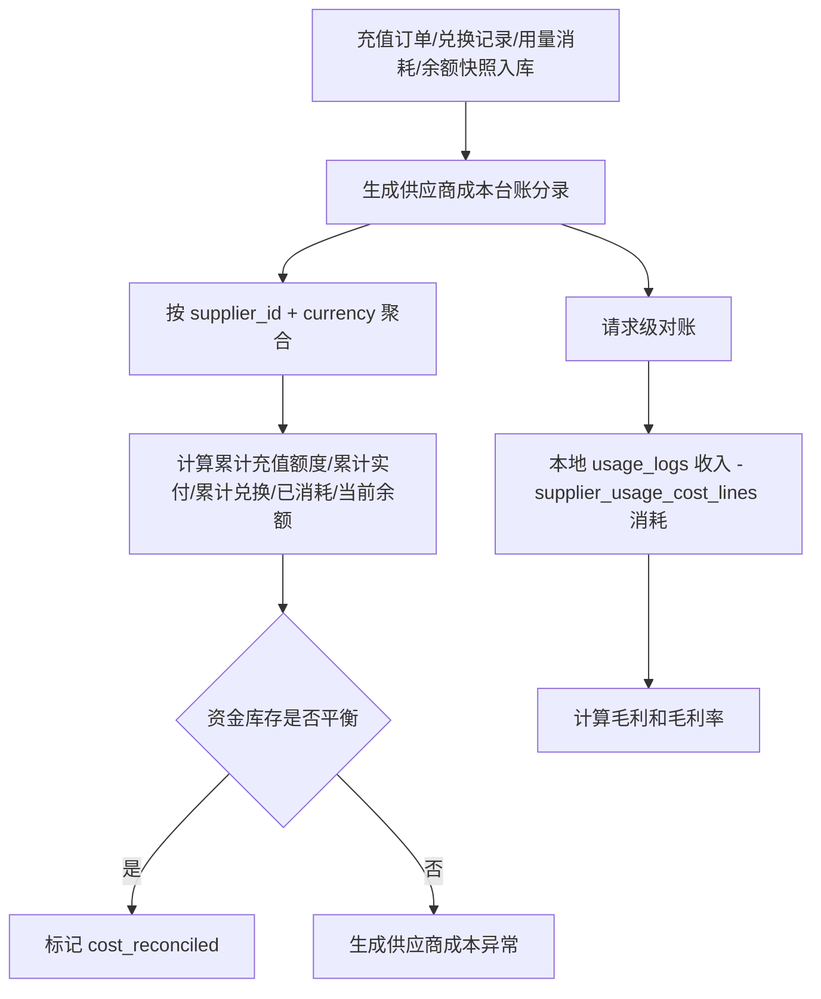

核心公式：

```text
请求利润口径：
gross_profit = local_usage_revenue - supplier_usage_cost

资金库存口径：
expected_ending_balance = opening_balance + completed_recharge_amount + used_redeem_balance_amount - supplier_usage_cost - refunded_amount + manual_adjustment
balance_delta = actual_supplier_balance - expected_ending_balance
```

治理结论：

- `current`：`supplier_cost_ledger_entries`、`supplier_cost_snapshots`、`supplier_funding_transactions`、`supplier_entitlement_transactions`。
- `current` 但边界受限：`supplier_usage_cost_lines` 只用于请求级消耗成本，不再单独驱动财务成本汇总。
- `compat`：手工补录用量消耗、`fetch_usage_costs` 插件补录和 `/admin/operations/billing` 兼容入口，只能生成台账分录或委托新成本服务，不能新增独立成本计算；`/admin/operations/billing` 只重定向到 `/admin/finance/costs`。
- `deprecated`：任何只用 `/api/v1/usage` 推导供应商总成本的对账逻辑。

## 10. 失败补偿流程图

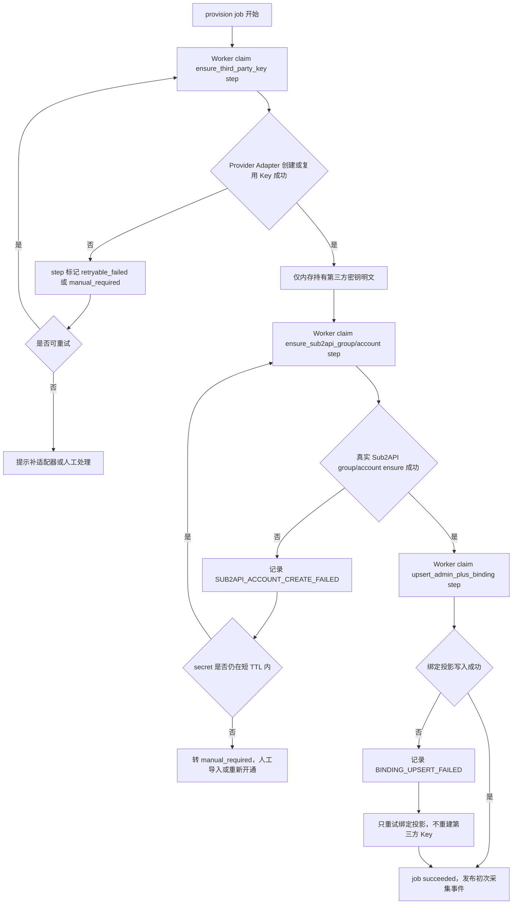

补偿规则：

- Provider Adapter 创建第三方密钥失败：不创建本地账号。
- Provider Adapter 能力缺失：标记 `capability_missing`，提示补供应商适配器或进入人工处理，不把创建动作下放给插件。
- 第三方密钥创建成功、真实 Sub2API group/account ensure 失败：记录失败 Key 元数据和错误码，只重试 Sub2API 落地或进入人工修复，不让插件参与业务补偿。
- 真实 Sub2API group/account 创建成功、绑定投影失败：不重复创建第三方 Key，只重试 Admin Plus 绑定投影。
- 如未来需要自动重试本地账号创建，第三方密钥明文只能加密短 TTL 暂存，并必须产生告警和审计；当前主链路不长期保存明文。
- 运营者删除绑定时，默认只删除 Admin Plus 绑定；是否禁用第三方密钥和本地 Sub2API 账号必须独立确认。

## 11. 页面流程

### 11.1 供应商管理页

供应商管理页负责父级：

- 新增供应商。
- 配置 dashboard URL、login URL、API base URL。
- 配置后端直登凭据、登录协议参数或临时 token；所有敏感字段加密保存并脱敏展示。
- 展示会话来源、直登状态、插件兜底状态、分组同步状态和最后会话探测时间。
- 展示供应商当前余额、累计充值额度、累计实付金额、累计兑换额度、已消耗成本和资金差异。
- “累计充值额度”来自该供应商已完成充值订单的 `amount` 汇总，不允许用手工余额或本地账号 quota 代替。
- 提供“同步成本”动作：一次触发充值订单、兑换记录、用量消耗和余额快照同步，再刷新成本快照。
- 提供“后端直登并同步分组”动作；直登失败且需要验证码/2FA/强风控时，再引导使用 Chrome 插件兜底上报已登录会话。

### 11.2 供应商分组弹窗内开通 Key/账号

MVP 主路径不再跳转到独立“账号/Key 绑定”页手工选本地账号，而是在供应商管理页的“分组”弹窗内完成。该弹窗必须按 [`ASYNC_PROVISIONING.md`](ASYNC_PROVISIONING.md) 重构为步骤式任务面板，不再把所有字段和按钮平铺在一张表里：

1. 打开供应商父级的“分组”弹窗。
2. 步骤 1 展示会话状态；会话不可用时只显示后端直登和插件兜底。
3. 步骤 2 提交分组同步 job，并展示分组数量、最后同步时间和 job 状态。
4. 步骤 3 每个分组行展示当前第三方 Key、真实 Sub2API account 和绑定状态；未绑定分组才显示“开通”按钮。
5. 开通表单设置第三方密钥名称、额度、有效期、本地账号名称、平台、Base URL、并发、优先级、倍率、余额和状态。
6. 系统提交 `provision_group_key` job，页面只提示“任务已提交”，不能提示“创建成功”。
7. Worker 通过 Provider Adapter 创建或复用第三方密钥。
8. Worker 通过真实 Sub2API Admin API ensure group/account。
9. Worker 创建绑定投影并发布初次余额、费率、健康采集事件。
10. 步骤 4 展示真实 Sub2API 可见性、初次采集状态和失败修复入口。
11. 如果适配器能力缺失，页面展示需要补适配器或人工处理的明确原因。

成功定义：

- API 返回 `job_id` 时只代表任务进入队列。
- job 进入 `succeeded`、Admin Plus 绑定投影存在、真实 Sub2API Admin API 可查询到 group/account 后，才能展示“开通完成”。
- job/step 失败时必须展示停在哪一步、错误码、可重试或需人工处理的判断。

### 11.3 账号/Key 绑定页

账号/Key 绑定页降级为审计和历史查看：

- 自动开通结果列表：展示本地账号名称、脱敏第三方 key、供应商、分组名称、渠道颜色、倍率、local_account_id、状态、健康、真实 token 用量和请求级消耗成本。
- 历史绑定查看：帮助运营核对已有绑定事实，不承载新增、编辑、删除或通用补录。
- 单个 Key 不展示余额；余额属于供应商父级或供应商侧账户口径，只用于切换候选门禁。

不再把“选择已有本地账号”作为主路径。失败修复入口在供应商管理页的分组弹窗中按失败状态出现，只允许修复本地账号创建或绑定失败，不创建第三方 Key，不让插件参与业务补偿。

### 11.4 成本模块

成本模块是财务对账主页面，不再复用旧“用量消耗”作为唯一入口。本节只列账号链路需要暴露的供应商成本入口；完整页面、下游收入、利润对账和测试用例见 `docs/roadmap/billing/README.md`。

导航更新必须与成本口径同步：

- 财务分组新增 `成本对账`、`收入对账`、`利润对账`、`对账异常`、`台账审计` 和 `用量消耗`。
- 当前导航只开放已实现页面：`成本对账`、`用量消耗`、`本地用量`。
- 旧 `用量消耗` 与旧 `对账结果` 不再注册为当前路由，避免把 usage 明细或未落地利润对账误认为完整对账。
- 点击同一财务分组二级导航时不关闭展开状态；只有点击其他一级、其他类型二级、主动折叠或关闭时才收起。

页面分为四个视图：

- 供应商成本总览：按供应商展示当前余额、累计充值额度、累计实付金额、累计兑换额度、退款金额、已消耗成本、预期余额、实际余额和资金差异。
- 充值订单：展示每个供应商 `/orders` 对应的订单明细，包含外部订单 ID、out_trade_no、状态、amount、pay_amount、fee_rate、支付方式、paid_at、completed_at。
- 兑换记录：展示每个供应商 `/redeem` 对应的兑换历史，包含 code 指纹、类型、value、状态、used_at、group、validity_days。
- 请求利润对账：展示本地收入、供应商用量消耗、毛利、毛利率和 request_id 级异常。

页面动作：

- “同步成本”：对选中供应商执行 `POST /suppliers/:id/costs/sync`。
- “只同步订单”：仅执行充值订单采集，用于供应商订单页异常排查。
- “只同步兑换”：仅执行兑换记录采集，用于兑换码补录核对。
- “只同步用量”：调用 `POST /suppliers/:id/usage-costs/sync`，结果只作为成本台账和后续利润对账的消耗输入。
- “手工调整”：只允许生成 `manual_adjustment` 台账分录，必须填写原因和审计备注，不能直接改历史订单或兑换记录。

旧“用量消耗”页不保留为 current surface：

- `/admin/finance/billing` 为 `dead`，前端路由不再注册。
- `/admin/finance/reconciliation` 为 `dead`，利润对账落地前不提供假页面。
- `/admin/operations/billing` 仅作为 `compat` 重定向到 `/admin/finance/costs`。

## 12. 后端模块建议

```text
backend/internal/adminplus/app/supplierkeys/
  service.go                     # 第三方 Key 创建、本地账号创建和绑定编排
  sql_repository.go              # admin_plus_supplier_keys + admin_plus_supplier_accounts 写入
  memory_repository.go           # 单元测试仓储
  provider.go                    # Wire provider

backend/internal/adminplus/app/costs/
  service.go                     # 充值订单、兑换记录、用量消耗和余额快照归一化为成本台账
  sql_repository.go              # supplier_funding_transactions / supplier_entitlement_transactions / cost_ledger / cost_snapshots
  memory_repository.go           # 单元测试仓储
  provider.go                    # Wire provider

backend/internal/adminplus/adapters/sub2api/provider/
  session_profile.go             # Sub2API 供应商用户侧 profile、分组、费率和 Key 创建
  session_costs.go               # Sub2API 供应商用户侧充值订单、兑换记录和成本采集

backend/internal/handler/adminplus/
  supplier_key_handler.go        # GET keys / POST keys/provision / POST keys/:keyID/repair-binding
  supplier_cost_handler.go       # GET costs / POST costs/sync / GET recharge-orders / GET redeem-records
```

保持边界：

- `provider/sub2api` 面向第三方供应商。
- `local/sub2apiadmin` 面向本地 Sub2API。
- `app/accounts` 做编排和幂等，不直接依赖页面 DOM。
- Provider Adapter 是采集主路径，负责分组、费率、余额、公告、用量消耗、充值订单、兑换记录、健康、并发和第三方密钥创建。
- Provider Adapter 同时负责可自动化的供应商后端直登。
- Chrome 插件只负责在直登不可用时识别站点、采集已登录浏览器会话、采集页面上下文和上报第三方供应商信息；不承载分组解析、密钥创建、费率、余额、用量消耗、充值订单、兑换记录等业务动作。

## 13. 数据表草案

账号开通链路后续需要数据库重构。当前实现仍以 `admin_plus_supplier_groups`、`admin_plus_supplier_keys` 和 `admin_plus_supplier_accounts` 作为同步开通和绑定投影；分组同步、Key 开通、真实 Sub2API 落地、失败重试和审计的异步事实源见 [`ASYNC_PROVISIONING.md`](ASYNC_PROVISIONING.md)。

后续规划表：

- `supplier_provision_jobs`：批次任务事实源。
- `supplier_provision_steps`：每个分组每个 Saga step 的事实源。
- `admin_plus_outbox_events`：事务内事件表。
- `processed_events`：Worker 消费去重表。
- `supplier_provision_attempts`：外部调用脱敏审计表。

现有表定位：

- `admin_plus_supplier_groups`：供应商分组投影，保留。
- `admin_plus_supplier_keys`：第三方 Key 投影，保留，增加 job/step 可追溯字段。
- `admin_plus_supplier_accounts`：Admin Plus 绑定投影，保留，必须追溯真实 Sub2API group/account。
- `idempotency_records`：HTTP 请求去重，保留，但不替代业务幂等。

### 13.1 `admin_plus_supplier_groups`

| 字段 | 类型 | 说明 |
|------|------|------|
| `id` | bigint | 主键 |
| `supplier_id` | bigint | 供应商 ID |
| `external_group_id` | text | 第三方分组 ID，无法获取时用稳定指纹 |
| `name` | text | 分组名称 |
| `description` | text | 描述 |
| `rate_multiplier` | numeric | 倍率 |
| `is_private` | boolean | 是否私有分组 |
| `provider_family` | text | openai / anthropic / gemini / mixed |
| `status` | text | active / missing / disabled |
| `raw_payload` | jsonb | 原始数据 |
| `last_seen_at` | timestamptz | 最后看到时间 |

唯一约束：

```text
unique(supplier_id, external_group_id)
```

### 13.2 `admin_plus_supplier_keys`

| 字段 | 类型 | 说明 |
|------|------|------|
| `id` | bigint | 主键 |
| `supplier_id` | bigint | 供应商 ID |
| `supplier_group_id` | bigint | 分组 ID |
| `external_key_id` | text | 第三方 key ID |
| `name` | text | 第三方 key 名称 |
| `key_fingerprint` | text | 密钥指纹 |
| `key_last4` | text | 密钥末 4 位 |
| `status` | text | provisioning / bound / manual_secret_required / failed / disabled |
| `local_sub2api_account_id` | bigint | 本地 Sub2API 账号 ID |
| `local_account_name` | text | 本地账号名称快照 |
| `local_account_platform` | text | 本地账号平台快照 |
| `provision_request` | jsonb | 开通请求脱敏快照 |
| `provision_response` | jsonb | 第三方响应脱敏快照 |
| `error_code` | text | 失败码 |
| `error_message` | text | 失败原因 |
| `created_at` | timestamptz | 创建时间 |

Admin Plus 默认不长期保存第三方密钥明文。当前失败修复只使用第三方 Key 脱敏元数据和已有本地账号绑定；如未来需要自动重试本地账号创建，才允许加密短 TTL 暂存明文。

### 13.3 扩展 `admin_plus_supplier_accounts`

建议新增字段：

| 字段 | 类型 | 说明 |
|------|------|------|
| `supplier_key_id` | bigint | 绑定的第三方密钥 |
| `supplier_group_id` | bigint | 冗余分组 ID，便于查询 |
| `provisioning_status` | text | provisioning / active / repair_required |
| `provisioning_run_id` | text | 幂等开通批次 |

### 13.4 `admin_plus_supplier_funding_transactions`

| 字段 | 类型 | 说明 |
|------|------|------|
| `id` | bigint | 主键 |
| `supplier_id` | bigint | 供应商 ID |
| `external_order_id` | text | 供应商订单 ID；Sub2API 同源取 `payment_orders.id` |
| `out_trade_no` | text | 外部交易号 |
| `payment_trade_no` | text | 支付渠道交易号，脱敏保存 |
| `payment_type` | text | 支付方式 |
| `order_type` | text | balance / subscription |
| `status` | text | PENDING / PAID / RECHARGING / COMPLETED / REFUNDED 等 |
| `currency` | text | 币种 |
| `amount_cents` | bigint | 到账额度或订单金额，供应商列表累计充值额度使用该字段 |
| `pay_amount_cents` | bigint | 实付金额 |
| `fee_rate` | numeric | 支付手续费率 |
| `refund_amount_cents` | bigint | 退款金额 |
| `plan_id` | bigint | 订阅订单 plan id |
| `provider_instance_id` | text | 支付实例 ID |
| `created_at_external` | timestamptz | 供应商订单创建时间 |
| `paid_at` | timestamptz | 支付时间 |
| `completed_at` | timestamptz | 到账完成时间 |
| `raw_payload` | jsonb | 脱敏原始响应 |
| `last_seen_at` | timestamptz | 最近采集时间 |

唯一约束：

```text
unique(supplier_id, external_order_id)
unique(supplier_id, out_trade_no) where out_trade_no <> ''
```

### 13.5 `admin_plus_supplier_entitlement_transactions`

| 字段 | 类型 | 说明 |
|------|------|------|
| `id` | bigint | 主键 |
| `supplier_id` | bigint | 供应商 ID |
| `external_redeem_id` | text | 供应商兑换记录 ID；Sub2API 同源取 `redeem_codes.id` |
| `code_fingerprint` | text | 兑换码 sha256 指纹 |
| `code_last4` | text | 兑换码末 4 位，允许为空 |
| `type` | text | balance / concurrency / subscription / invitation |
| `status` | text | used / unused / expired / disabled |
| `currency` | text | balance 类型币种 |
| `value_cents` | bigint | balance 类型折算金额；非金额权益为 0 |
| `raw_value` | numeric | 原始 value |
| `group_id` | bigint | subscription 类型分组 |
| `validity_days` | int | subscription 有效期 |
| `used_at` | timestamptz | 兑换时间 |
| `created_at_external` | timestamptz | 兑换码创建时间 |
| `raw_payload` | jsonb | 脱敏原始响应 |
| `last_seen_at` | timestamptz | 最近采集时间 |

唯一约束：

```text
unique(supplier_id, external_redeem_id)
unique(supplier_id, code_fingerprint) where code_fingerprint <> ''
```

### 13.6 `admin_plus_supplier_cost_ledger_entries`

| 字段 | 类型 | 说明 |
|------|------|------|
| `id` | bigint | 主键 |
| `supplier_id` | bigint | 供应商 ID |
| `supplier_account_id` | bigint | 可选，绑定子级 |
| `supplier_key_id` | bigint | 可选，第三方 Key |
| `entry_type` | text | recharge_credit / recharge_refund_debit / redeem_credit / usage_debit / manual_adjustment |
| `source_type` | text | recharge_order / redeem_record / supplier_bill_line / balance_snapshot / manual |
| `source_id` | bigint | Admin Plus 本地来源 ID |
| `source_external_id` | text | 第三方来源 ID |
| `currency` | text | 币种 |
| `amount_cents` | bigint | 正数为额度增加，负数为消耗或退款 |
| `cash_amount_cents` | bigint | 实付现金口径，兑换和用量可为 0 |
| `occurred_at` | timestamptz | 业务发生时间 |
| `raw_payload` | jsonb | 脱敏原始响应或计算上下文 |
| `created_at` | timestamptz | 入库时间 |

唯一约束：

```text
unique(supplier_id, entry_type, source_type, source_id)
```

### 13.7 `admin_plus_supplier_cost_snapshots`

| 字段 | 类型 | 说明 |
|------|------|------|
| `id` | bigint | 主键 |
| `supplier_id` | bigint | 供应商 ID |
| `currency` | text | 币种 |
| `opening_balance_cents` | bigint | 期初余额 |
| `current_balance_cents` | bigint | 最近供应商余额 |
| `completed_recharge_amount_cents` | bigint | 累计充值额度 |
| `completed_recharge_cash_cents` | bigint | 累计实付金额 |
| `redeem_amount_cents` | bigint | 累计兑换额度 |
| `refund_amount_cents` | bigint | 累计退款金额 |
| `usage_cost_cents` | bigint | 累计用量消耗 |
| `manual_adjustment_cents` | bigint | 手工调整 |
| `expected_balance_cents` | bigint | 台账预期余额 |
| `balance_delta_cents` | bigint | 实际余额 - 预期余额 |
| `request_revenue_cents` | bigint | 本地用量收入 |
| `gross_profit_cents` | bigint | 请求利润口径毛利 |
| `gross_margin` | numeric | 请求利润口径毛利率 |
| `computed_at` | timestamptz | 计算时间 |

供应商列表的字段来源：

- `recharge_amount_cents` 读取 `completed_recharge_amount_cents`。
- `recharge_cash_cents` 读取 `completed_recharge_cash_cents`。
- `redeem_amount_cents` 读取 `redeem_amount_cents`。
- `usage_cost_cents` 读取 `usage_cost_cents`。
- `cost_balance_delta_cents` 读取 `balance_delta_cents`。
- 现有 `balance_cents` 继续表示供应商当前余额快照，不与充值累计混用。

## 14. API 草案

### 14.1 当前站点匹配供应商

```http
POST /api/v1/admin-plus/suppliers/site-match
```

请求：

```json
{
  "origin": "https://supplier.example.com",
  "host": "supplier.example.com",
  "path": "/dashboard",
  "title": "Supplier Admin",
  "favicon_url": "https://supplier.example.com/favicon.ico"
}
```

响应：

```json
{
  "status": "matched|ambiguous|unknown|unsupported",
  "supplier_id": 123,
  "candidates": [],
  "suggested_supplier": {
    "name": "supplier.example.com",
    "type": "sub2api",
    "dashboard_url": "https://supplier.example.com",
    "api_base_url": "https://supplier.example.com/api/v1"
  }
}
```

### 14.2 从插件候选创建供应商

```http
POST /api/v1/admin-plus/suppliers/from-site-candidate
```

请求：

```json
{
  "name": "Supplier Example",
  "type": "sub2api",
  "dashboard_url": "https://supplier.example.com",
  "api_base_url": "https://supplier.example.com/api/v1",
  "host_patterns": ["supplier.example.com"],
  "source": "chrome_extension",
  "page_context": {
    "title": "Supplier Admin",
    "origin": "https://supplier.example.com"
  }
}
```

响应：

```json
{
  "id": 123,
  "name": "Supplier Example",
  "type": "sub2api",
  "dashboard_url": "https://supplier.example.com"
}
```

该接口必须要求管理员身份。插件只提交候选信息，不能绕过后端校验静默创建供应商。

### 14.3 同步供应商分组

```http
POST /api/v1/admin-plus/suppliers/:id/groups/sync
```

当前实现作用：同步读取供应商分组并写入分组投影。后续异步方案中，API 层只创建 `sync_groups` job 和 outbox event，Worker 使用 Provider Adapter 基于已保存供应商会话读取分组；能力缺失时写入 job/step 错误。

响应：

```json
{
  "mode": "async_job",
  "job_id": "spj_123",
  "status": "queued",
  "job_type": "sync_groups",
  "poll_url": "/api/v1/admin-plus/supplier-provision-jobs/spj_123"
}
```

同步返回 `group_count` 的实现是当前链路；迁移到异步后前端必须以 job 状态和 `GET /suppliers/:id/groups` 的投影结果为准。

### 14.4 查询供应商分组

```http
GET /api/v1/admin-plus/suppliers/:id/groups?page=1&page_size=50
```

### 14.5 查询供应商 Key

```http
GET /api/v1/admin-plus/suppliers/:id/keys?page=1&page_size=1000
```

作用：供应商分组弹窗加载分组后，同时查询 Key 列表并按 `supplier_group_id` 建立映射。每个分组行展示“已绑定/未开通/失败”等状态。

### 14.6 创建第三方密钥并异步落地本地账号

```http
POST /api/v1/admin-plus/suppliers/:id/keys/provision
```

请求：

```json
{
  "supplier_group_id": 12,
  "name": "sub2api-plus-20260621-main",
  "quota_usd": 25,
  "expires_in_days": null,
  "local_account_name": "supplier-a / PRO 0.12 / main",
  "local_account_platform": "openai",
  "local_account_base_url": "https://supplier.example.com/v1",
  "local_account_priority": 50,
  "local_account_concurrency": 5,
  "local_account_rate_multiplier": 0.8,
  "local_account_group_ids": [1],
  "runtime_status": "monitor_only",
  "health_status": "normal",
  "balance_threshold_cents": 0,
  "balance_cents": 0,
  "balance_currency": "USD"
}
```

响应：

```json
{
  "mode": "async_job",
  "job_id": 124,
  "status": "queued",
  "job_type": "provision_group_key",
  "supplier_id": 24,
  "supplier_group_id": 12,
  "poll_url": "/api/v1/admin-plus/supplier-provision-jobs/124"
}
```

当前生产路径只提交 `provision_group_key` job 并返回 `job_id`；第三方 Key 明文只允许在 Worker 内存中流转到真实 Sub2API Admin API，不在接口响应、`provision_response`、job snapshot 或列表接口中回显。`Idempotency-Key` 写入 job hash；业务幂等以 job/step/outbox、同分组 active step 复用和外部资源查找为准。

任务查询：

```http
GET /api/v1/admin-plus/supplier-provision-jobs/:jobID
```

响应：

```json
{
  "id": "spj_124",
  "status": "running",
  "job_type": "provision_group_key",
  "progress": {
    "total": 7,
    "succeeded": 4,
    "failed": 0,
    "manual_required": 0
  },
  "steps": [
    {
      "step_type": "ensure_third_party_key",
      "supplier_group_id": 12,
      "status": "succeeded"
    },
    {
      "step_type": "ensure_sub2api_account",
      "supplier_group_id": 12,
      "status": "running"
    }
  ]
}
```

本地落地失败的修复入口已收敛在供应商分组弹窗：

```http
POST /api/v1/admin-plus/suppliers/:id/keys/:keyID/repair-binding
```

请求：

```json
{
  "local_sub2api_account_id": 456,
  "runtime_status": "monitor_only",
  "health_status": "normal",
  "configured_concurrency": 0,
  "balance_threshold_cents": 0,
  "balance_cents": 0,
  "balance_currency": "USD"
}
```

该接口只允许修复 `failed` 且错误原因为 `LOCAL_ACCOUNT_CREATE_FAILED` 或 `SUPPLIER_ACCOUNT_BIND_FAILED` 的 Key；它不会再次调用 Provider Adapter 创建第三方 Key，只会读取已有本地 Sub2API account、写入 `admin_plus_supplier_accounts` 绑定，并把 `admin_plus_supplier_keys` 更新为 `bound`。接口同样接入 `Idempotency-Key` 去重。

### 14.7 后端直登供应商会话

```http
POST /api/v1/admin-plus/suppliers/:id/session/login
```

作用：后端使用已加密保存的供应商登录配置或本次请求提供的临时凭据执行直登，成功后写入统一供应商会话。该接口由 Provider Adapter 调用供应商用户侧登录 API，不经过 Chrome 插件。

请求示例：

```json
{
  "username": "operator@example.com",
  "password": "******",
  "remember": false,
  "login_context": {
    "api_base_url": "https://supplier.example.com",
    "login_agreement_revision": "a90464c54fba46d4"
  }
}
```

响应示例：

```json
{
  "session_source": "direct_login",
  "session_status": "valid",
  "capabilities": {
    "can_read_balance": true,
    "can_read_groups": true,
    "can_create_key": true
  },
  "fallback_required": false
}
```

失败时必须返回明确原因：

- `LOGIN_CREDENTIAL_INVALID`：用户名或密码错误。
- `LOGIN_CAPTCHA_REQUIRED`：需要验证码，提示插件兜底或人工处理。
- `LOGIN_MFA_REQUIRED`：需要 2FA，提示插件兜底或人工处理。
- `LOGIN_PROVIDER_CHANGED`：登录协议变化，需要补 Provider Adapter。
- `BROWSER_FALLBACK_REQUIRED`：供应商强绑定浏览器上下文，需要 Chrome 插件兜底。

### 14.8 同步与查询供应商成本

```http
POST /api/v1/admin-plus/suppliers/:id/costs/sync
GET  /api/v1/admin-plus/suppliers/:id/costs/summary
GET  /api/v1/admin-plus/suppliers/:id/recharge-orders?page=1&page_size=50
GET  /api/v1/admin-plus/suppliers/:id/redeem-records?page=1&page_size=50
GET  /api/v1/admin-plus/costs/suppliers?page=1&page_size=50
```

`POST /suppliers/:id/costs/sync` 请求：

```json
{
  "started_at": "2026-06-01T00:00:00Z",
  "ended_at": "2026-06-21T23:59:59Z",
  "include_funding_transactions": true,
  "include_entitlement_transactions": true,
  "include_usage_cost_lines": true,
  "include_balance_snapshot": true
}
```

响应：

```json
{
  "supplier_id": 123,
  "synced_at": "2026-06-21T12:00:00Z",
  "funding_transactions": 18,
  "entitlement_transactions": 4,
  "usage_cost_lines": 260,
  "ledger_entries": 282,
  "snapshot": {
    "currency": "CNY",
    "completed_recharge_amount_cents": 350000,
    "completed_recharge_cash_cents": 350000,
    "redeem_amount_cents": 50000,
    "usage_cost_cents": 120000,
    "current_balance_cents": 279500,
    "expected_balance_cents": 280000,
    "balance_delta_cents": -500
  },
  "capabilities": {
    "can_read_funding_transactions": true,
    "can_read_entitlement_transactions": true,
    "can_read_usage_costs": true,
    "can_read_balance": true
  }
}
```

`GET /admin-plus/costs/suppliers` 用于供应商列表和成本总览，返回供应商基础字段加成本快照：

```json
{
  "items": [
    {
      "id": 123,
      "name": "Supplier Example",
      "type": "sub2api",
      "balance_cents": 279500,
      "balance_currency": "CNY",
      "recharge_amount_cents": 350000,
      "recharge_cash_cents": 350000,
      "redeem_amount_cents": 50000,
      "usage_cost_cents": 120000,
      "cost_balance_delta_cents": -500,
      "cost_snapshot_computed_at": "2026-06-21T12:00:00Z"
    }
  ],
  "total": 1
}
```

规则：

- `GET /admin-plus/suppliers` 可以扩展返回成本快照字段，或者前端在供应商列表并行调用 `GET /admin-plus/costs/suppliers`。事实源必须仍是 `cost_snapshots`。
- `costs/sync` 是只读采集和本地台账生成，不调用供应商写接口。
- 如果供应商未开放订单或兑换接口，返回 capability missing，同时保留其它已采集成本项，不生成 mock 数据。
- 充值订单和兑换记录列表只展示脱敏字段，不能回显兑换码明文、cookie、access token 或第三方密钥。

### 14.9 插件兜底上报供应商会话

```http
POST /api/v1/admin-plus/extension/session/capture-task
POST /api/v1/admin-plus/extension/tasks/:id/complete
POST /api/v1/admin-plus/suppliers/:id/browser-sessions
```

插件兜底推荐使用短租约 `capture_supplier_session` 任务：插件先创建会话采集任务，再在 `complete.result.session_bundle` 中提交会话包。这样可以绑定 `device_id`、`lease_token`、任务状态和审计记录。

`POST /api/v1/admin-plus/suppliers/:id/browser-sessions` 已作为管理员登录态下的直接写入入口落地，主要用于手动导入、插件联调和调试，不作为插件兜底长期绕过短租约的主路径。

`complete` 请求中的 `result.session_bundle`：

```json
{
  "origin": "https://supplier.example.com",
  "captured_at": "2026-06-21T12:00:00Z",
  "expires_at": "2026-06-21T14:00:00Z",
  "tokens": {
    "access_token": "token-from-browser",
    "csrf_token": "csrf-from-browser"
  },
  "cookies": [],
  "context": {
    "api_base_url": "https://supplier.example.com/api/v1",
    "organization_id": "org_123"
  },
  "required_headers": {
    "origin": "https://supplier.example.com",
    "referer": "https://supplier.example.com/dashboard",
    "cookie": "sid=..."
  }
}
```

后端 ingest 会加密保存会话包，并从任务结果中移除明文。管理端可通过以下接口查看脱敏会话和触发 Provider Adapter 探测：

```http
GET  /api/v1/admin-plus/suppliers/:id/session
POST /api/v1/admin-plus/suppliers/:id/session/probe
POST /api/v1/admin-plus/suppliers/:id/groups/sync
GET  /api/v1/admin-plus/suppliers/:id/groups
POST /api/v1/admin-plus/suppliers/:id/rates/sync
POST /api/v1/admin-plus/suppliers/:id/keys/provision
GET  /api/v1/admin-plus/suppliers/:id/keys
POST /api/v1/admin-plus/suppliers/:id/keys/:keyID/repair-binding
POST /api/v1/admin-plus/suppliers/:id/costs/sync
GET  /api/v1/admin-plus/suppliers/:id/costs/summary
GET  /api/v1/admin-plus/suppliers/:id/recharge-orders
GET  /api/v1/admin-plus/suppliers/:id/redeem-records
```

插件不通过该链路上报已经解析好的分组、费率、余额、用量消耗、充值订单、兑换记录或第三方密钥创建结果。

当前已实现：

- 会话包加密保存。
- host 白名单校验。
- 响应只返回脱敏摘要。
- 支持 `cookies` 字符串和 Chrome cookies 数组。
- 可通过 `POST /api/v1/admin-plus/suppliers/:id/session/probe` 读取 Sub2API 用户侧 profile/余额并写入余额快照。
- 可通过 `POST /api/v1/admin-plus/suppliers/:id/groups/sync` 使用后端 Provider Adapter 读取供应商用户侧分组和倍率，并 upsert 到 `admin_plus_supplier_groups`。
- 可通过 `GET /api/v1/admin-plus/suppliers/:id/groups` 查询本地分组事实表；旧插件 `fetch_groups` 不作为分组同步主路径。
- 可通过 `POST /api/v1/admin-plus/suppliers/:id/rates/sync` 使用后端 Provider Adapter 读取供应商用户侧费率并写入费率快照；旧插件 `fetch_rates` 只作为兼容任务类型。
- 当前 `POST /api/v1/admin-plus/suppliers/:id/keys/provision` 已有同步基础链路，但它是 `deprecated` 过渡实现；目标链路必须改为提交 `provision_group_key` job，由 Worker 创建第三方 Key、ensure 真实 Sub2API group/account 并写入绑定投影。
- 可通过 `POST /api/v1/admin-plus/suppliers/:id/keys/:keyID/repair-binding` 对本地账号创建或绑定失败的 Key 选择已有本地 Sub2API account 完成绑定；插件不上报修复结果。
- 供应商管理页的“分组”弹窗已作为 Key/账号开通和失败修复主入口；下一步必须改为步骤式任务视图，未绑定行提交 job，本地落地失败行进入 job/step 修复。

待实现并作为成本 current 主链路：

- 通过 `POST /api/v1/admin-plus/suppliers/:id/costs/sync` 读取供应商用户侧 `/api/v1/payment/orders/my`、`/api/v1/redeem/history`、usage 消耗和余额快照。
- 把供应商充值订单写入 `admin_plus_supplier_funding_transactions`。
- 把供应商兑换记录写入 `admin_plus_supplier_entitlement_transactions`。
- 把充值、兑换、退款、用量消耗和手工调整归一化到 `admin_plus_supplier_cost_ledger_entries`。
- 生成 `admin_plus_supplier_cost_snapshots`，并在供应商列表展示累计充值额度。

## 15. 幂等与一致性

幂等键必须覆盖：

- `supplier_id`
- `supplier_group_id`
- `key_name`
- `intended_local_account_name`
- 操作日期或显式 run id

不能只用页面按钮点击时间。否则插件重试可能重复创建第三方密钥。

当前 `keys/provision` 和 `keys/:keyID/repair-binding` 已接入通用 `idempotency_records`，但这只能解决 HTTP 重复提交。异步治理后还必须增加 job/step/outbox 级幂等：

- 同一个 `Idempotency-Key` 和相同 payload 会重放首次成功结果，并返回 `X-Idempotency-Replayed: true`。
- 同一个 `Idempotency-Key` 但 payload 不同会返回冲突。
- 并发或短时间重复提交不会二次调用供应商创建 Key API。
- 同一供应商分组只允许存在一个 `provisioning` / `bound` / `manual_secret_required` Key，防止未携带幂等键的旧客户端重复创建。
- `repair-binding` 不调用供应商创建 Key API，只修复 Admin Plus 绑定事实和本地账号引用。
- `processed_events(event_id)` 必须防止队列重复投递。
- `supplier_provision_steps(job_id, supplier_group_id, step_type)` 必须防止同一步骤重复执行。
- 所有外部写操作必须先通过 Provider Adapter 或 Sub2API Gateway Adapter 查找现有资源，再决定是否创建。

一致性策略：

- 对第三方供应商：无法保证强事务，只能靠幂等检测、重复 key name 检查和补偿。
- 对本地 Sub2API：通过 Admin API 创建账号后必须记录返回的 `local_account_id`。
- 对 Admin Plus：绑定写入必须使用唯一约束防重复。
- 对异步队列：默认 at-least-once 投递，消费者必须幂等，不能依赖队列 exactly-once 语义。

## 16. 状态机

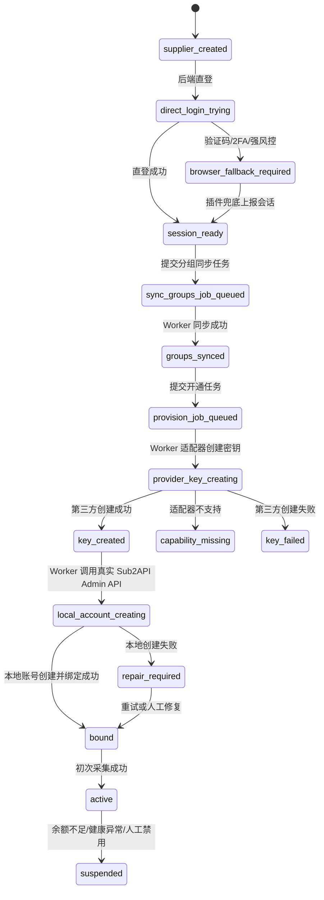

## 17. 权限与安全

- 不新增独立权限系统，复用 Sub2API 管理员身份。
- 插件必须先连接 sub2apiplus，不能匿名上报供应商会话。
- 创建第三方密钥是写操作，必须有明确的管理员确认和操作审计；写操作由 Provider Adapter 执行并归档 provisioning run。
- 第三方密钥明文默认只在内存中流转到本地 Sub2API Admin API。
- 本地 Sub2API 创建失败时，密钥明文如需暂存，必须加密、设置短 TTL，并产生告警。
- 前端不展示第三方密钥明文，只展示 key id、指纹、last4 和创建状态。
- 删除绑定、禁用本地账号、撤销第三方密钥必须拆成独立动作，避免误删可用资产。
- Provider Adapter 不能成为任意 URL 代理。每个供应商必须先保存 `base_url`、`api_base_url` 和 host 白名单，后端只允许访问该供应商域名下的已知接口路径。
- 余额、分组、费率、公告、健康、用量消耗、充值订单和兑换记录采集默认只允许只读请求；创建第三方密钥等写操作必须单独声明 capability、单独确认和单独审计。
- 后端直登凭据、插件上报的 cookie、token、CSRF、页面上下文和供应商登录密码都按高敏凭据处理，必须服务端加密、设置过期时间、日志脱敏，不允许前端回显明文。
- 供应商会话必须记录来源：`direct_login` / `browser_extension` / `manual_import`；插件兜底会话还必须记录来源设备、来源页面、任务 ID、采集时间、过期时间和最近探测结果。
- Sub2API 同源供应商的普通下游会话只能调用用户侧 API。除非供应商明确授权 Admin API Key 或只读 DB/Redis，否则不得调用供应商 `/api/v1/admin/*`。
- 所有直接读取本地或供应商 DB/Redis 的连接必须使用只读账号，并限制在 Adapter 层。

## 18. 测试计划

### 18.1 单元测试

- 分组归一化：名称、倍率、私有标记、provider family。
- key 指纹和 last4 生成。
- Provider Adapter 能力探测：`can_read_groups`、`can_read_balance`、`can_create_key`、`can_read_usage_costs`、`can_read_funding_transactions`、`can_read_entitlement_transactions`。
- Provider Adapter 后端直登：无验证码成功、密码错误、验证码/2FA 兜底、登录协议变化。
- Provider Adapter 用量消耗读取：`ReadUsageCosts(session, date_range)` 只保存脱敏后的 raw payload，不能落库 cookie、access token、secret 或第三方 key 明文。
- Provider Adapter 充值订单读取：`ReadFundingTransactions(session, date_range)` 只读取 `/api/v1/payment/orders/my`，正确归一化 `amount`、`pay_amount`、`fee_rate`、`status`、`paid_at`、`completed_at` 和退款字段。
- Provider Adapter 兑换记录读取：`ReadEntitlementTransactions(session, date_range)` 只读取 `/api/v1/redeem/history`，正确归一化 `type`、`value`、`status`、`used_at`、`group_id`、`validity_days`，且不保存兑换码明文。
- 成本台账生成：充值订单生成 `recharge_credit`，退款生成 `recharge_refund_debit`，balance 兑换生成 `redeem_credit`，供应商用量消耗生成 `usage_debit`。
- 成本快照汇总：累计充值额度使用已完成订单 `amount`，累计实付金额使用 `pay_amount`，资金差异按 `actual_supplier_balance - expected_ending_balance` 计算。
- Sub2API 供应商余额归一化：从用户侧 profile 读取 `balance`，不得使用本地账号 quota 替代供应商余额。
- Provider Adapter 创建密钥成功和失败分支。
- 插件会话上报不得生成分组、密钥、费率、余额、用量消耗、充值订单、兑换记录或成本台账业务结果。
- provisioning 状态机。
- 幂等键重复提交。
- 本地 Sub2API Admin API 创建账号失败后的 `repair-binding` 修复。
- 受限 HTTP client：拒绝非供应商 host、拒绝未登记路径、拒绝非只读采集写方法。

### 18.2 集成测试

- 使用真实 Admin Plus API 创建供应商。
- 使用真实 PostgreSQL 写入供应商分组和第三方 key 元数据。
- 使用 Provider Adapter 读取真实供应商分组。
- 使用 Provider Adapter 基于真实 Sub2API 供应商会话读取用户侧余额。
- 使用 Provider Adapter 基于真实 Sub2API 供应商会话读取 `/payment/orders/my` 充值订单。
- 使用 Provider Adapter 基于真实 Sub2API 供应商会话读取 `/redeem/history` 兑换记录。
- 执行 `costs/sync` 后验证充值订单、兑换记录、用量消耗和余额快照共同生成成本快照。
- 使用 Provider Adapter 在测试供应商环境创建真实 key。
- 使用本地 Sub2API Admin API 创建账号。
- 验证 `admin_plus_supplier_accounts.local_sub2api_account_id` 指向真实本地账号。

### 18.3 Chrome E2E

- 打开真实 Sub2API 供应商后台。
- 在后端直登不可用时，运营者在供应商网页完成登录，插件复用已登录态。
- 上报真实供应商会话包，不允许 mock。
- 插件上报内容只包含会话和页面上下文，不包含已解析业务数据或创建密钥结果。
- 插件不上报已解析的充值订单、兑换记录或成本台账；这些数据必须由后端 Provider Adapter 使用统一会话读取。
- 将 key 同步创建到本地 Sub2API。
- 验证本地 Sub2API 账号可以发起一次探测请求。

## 19. 验收标准

- 可以从供应商管理页创建供应商父级。
- 后端可以直登一个无验证码的真实 Sub2API 同源供应商；如遇验证码/2FA/强风控，系统明确提示 Chrome 插件兜底。
- 插件可以把真实供应商浏览器会话包上报给 Admin Plus。
- Provider Adapter 可以基于真实统一会话包完成能力探测。
- 系统可以读取并展示该供应商真实分组列表。
- 供应商分组弹窗能展示每个分组是否已绑定第三方 Key 和本地 Sub2API 账号。
- 系统可以基于真实供应商 Sub2API 用户侧统一会话读取当前下游用户余额，并按余额决定 `monitor_only` / `candidate`。
- 系统可以基于真实供应商 Sub2API 用户侧统一会话读取 `/api/v1/payment/orders/my`，并在供应商列表显示累计充值额度。
- 系统可以基于真实供应商 Sub2API 用户侧统一会话读取 `/api/v1/redeem/history`，并在成本模块显示累计兑换额度。
- 成本模块可以展示每个供应商的累计充值额度、累计实付金额、累计兑换额度、已消耗成本、当前余额、预期余额和资金差异。
- 请求利润对账使用本地收入减供应商用量消耗；资金库存对账使用充值、兑换、退款、消耗和当前余额核对。
- 运营者可以在某个未绑定分组行创建第三方密钥。
- 系统通过 Provider Adapter 创建第三方密钥。
- 插件不创建第三方密钥，不上报已解析的业务采集结果。
- 系统可以把第三方密钥同步创建为本地 Sub2API 账号。
- 系统可以自动创建 Admin Plus 账号绑定。
- 绑定后费率、余额、健康、用量消耗至少一种采集能落到该绑定子级；充值订单、兑换记录和成本快照落到供应商父级。
- 全链路失败不产生 mock 成功数据。
- 所有写本地 Sub2API 的动作都走 Admin API，不直接写 Sub2API DB。

## 20. 首批开发顺序

本开发顺序以账号链路为主。成本与对账的完整开发阶段以 `docs/roadmap/billing/README.md` 的 P0-P5 为准；本文只保留账号链路必须依赖的供应商成本采集项。

1. 增加供应商分组表、第三方 key 元数据表和绑定字段。
2. 实现 Provider Adapter 能力探测接口。
3. 实现 Sub2API 供应商分组读取适配器。
4. 增加供应商充值订单、兑换记录、成本台账和成本快照表。
5. 实现 Sub2API 供应商充值订单读取适配器：`ReadFundingTransactions`。
6. 实现 Sub2API 供应商兑换记录读取适配器：`ReadEntitlementTransactions`。
7. 实现成本服务：`costs/sync`、台账生成、成本快照、供应商列表累计充值额度。
8. 插件支持真实供应商会话包上报。
9. 实现 Sub2API 供应商密钥创建适配器。
10. 实现本地 Sub2API Admin API 创建账号 client。
11. 实现账号开通编排服务和幂等。
12. 前端在供应商分组弹窗内增加 Key/账号开通入口和绑定状态列。
13. 前端增加成本模块，供应商列表展示累计充值额度。
14. 接入初次采集、飞书失败通知和操作审计。
