# 供应商分组、第三方密钥与本地 Sub2API 账号绑定方案

版本：v0.1.0
日期：2026-06-21
状态：账号链路目标方案
范围：重新梳理供应商、Chrome 插件、第三方分组、第三方密钥、本地 Sub2API 账号和 Admin Plus 绑定关系。

## 1. 设计结论

新的主流程必须按以下顺序推进：

1. 在 Admin Plus 先添加供应商父级。
2. Chrome 插件识别当前供应商站点。
3. Chrome 插件登录或复用已登录的供应商后台会话。
4. Chrome 插件把供应商 token、cookie、CSRF、组织信息、页面上下文等会话包上报给 Admin Plus。
5. Admin Plus Provider Adapter 基于会话包读取供应商分组。
6. 运营者在供应商分组弹窗的某个分组行选择“开通 Key/账号”，填写密钥和本地账号参数。
7. Admin Plus Provider Adapter 基于会话包创建第三方密钥。
8. Admin Plus 使用本地 Sub2API Admin API 同步创建本地 Sub2API 账号。
9. Admin Plus 建立供应商父级、第三方密钥、本地 Sub2API 账号之间的绑定。
10. 后续费率、余额、健康、账单和动作建议全部由 Provider Adapter 采集并落到这个绑定子级。

核心原则：

- 供应商是父级。
- 第三方分组属于供应商。
- 第三方密钥由供应商创建，创建时选择供应商分组；Admin Plus 不创建供应商分组。
- 本地 Sub2API 账号是第三方密钥在本地网关中的落地实体。
- MVP 中按“一组一个可调度 Key/本地账号绑定”收敛；未绑定分组不能作为切换候选。
- Admin Plus 绑定关系只关联事实，不伪造第三方密钥，也不直接写本地 Sub2API 数据库。
- 写本地 Sub2API 必须走本地 Sub2API Admin API；读取可以走 Admin API、只读 DB 或只读 Redis。
- Chrome 插件只负责作为浏览器桥梁：识别供应商站点、采集浏览器会话和第三方供应商页面上下文、上报给 Admin Plus。
- Provider Adapter 负责供应商侧业务能力：分组、费率、余额、优惠、账单、健康、并发和密钥创建。
- Admin Plus 应用层负责编排：能力探测、创建本地 Sub2API 账号、绑定、幂等、补偿和审计。
- 插件不做分组解析、不做费率/余额/账单采集、不创建第三方密钥；适配器暂不支持时，应标记能力缺失并新增适配器，不把业务动作塞回插件。

## 2. 背景

当前页面把“供应商管理”和“账号/Key 绑定”割裂展示，容易让流程变成：

```text
先手工找一个本地 Sub2API 账号 -> 再手工绑定供应商 -> 再补费率或账号信息
```

这个顺序不符合真实运营。真实业务里，运营者需要先确定上游供应商，然后根据供应商后台的真实分组和费率创建可用密钥，再把这个密钥添加到本地 Sub2API 中，最后绑定成本、健康和对账数据。

因此账号链路需要从“绑定已有账号”改为“从供应商出发完成密钥开通和本地落地”。

## 3. 业务对象

| 对象 | 归属 | 来源 | 是否写入 Admin Plus | 说明 |
|------|------|------|---------------------|------|
| 供应商 | Admin Plus | 运营者创建 | 是 | 父级，例如某个 Sub2API/New API 上游实例 |
| 供应商会话 | Admin Plus | Chrome 插件上报 | 是，需加密和过期 | 供 Provider Adapter 调用供应商后台 API |
| Provider Adapter | Admin Plus | 后端实现 | 否 | 供应商侧采集和写操作适配层 |
| 供应商分组 | 供应商 | Provider Adapter 读取 | 是 | 包含名称、倍率、描述、私有标记、原始 ID |
| 第三方密钥 | 供应商 | Provider Adapter 创建 | 是，保存脱敏元数据 | 密钥明文只用于同步创建本地 Sub2API 账号 |
| 本地 Sub2API 账号 | 本地 Sub2API | Admin Plus 调用 Sub2API Admin API 创建 | 只保存 ID 快照 | 承载第三方密钥，供本地网关调度 |
| 账号绑定 | Admin Plus | 系统创建 | 是 | 供应商父级 + 第三方密钥 + 本地账号 ID 的关联 |

## 4. 总体流程图

### 4.1 未知供应商自动创建流程

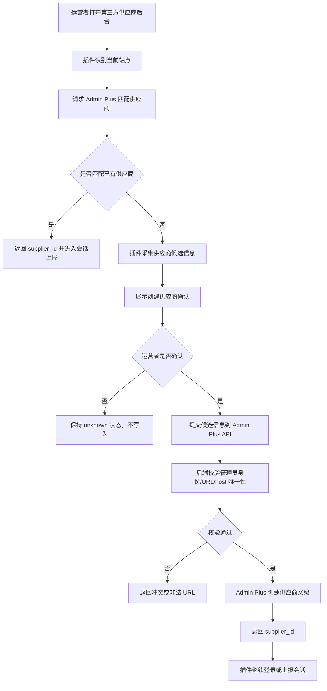

插件只负责提交候选信息，不能静默创建供应商，也不能直接写数据库。创建动作由 Admin Plus 后端在管理员登录态下完成。

### 4.2 分组弹窗开通总流程

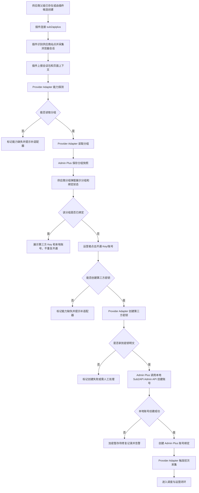

### 4.3 UI 与后端责任图

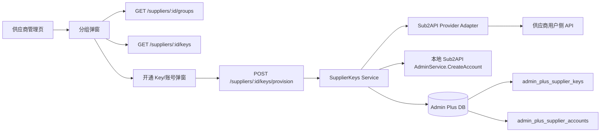

## 5. 数据关系图

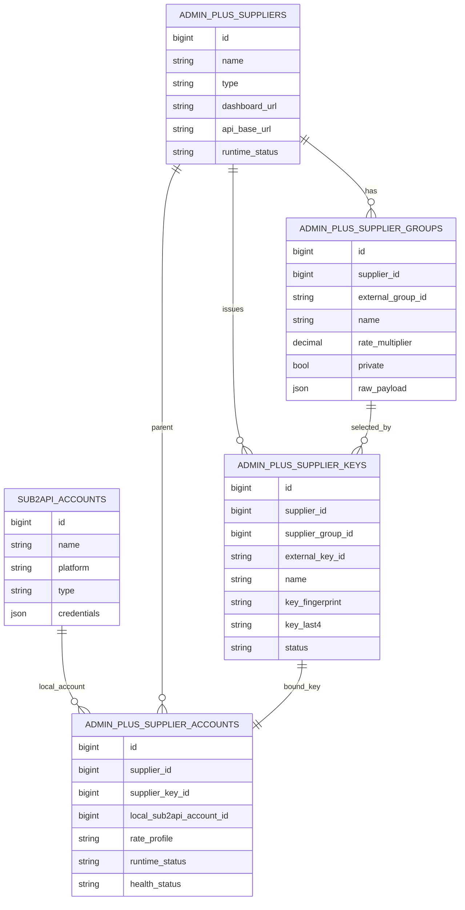

## 6. 端到端时序图

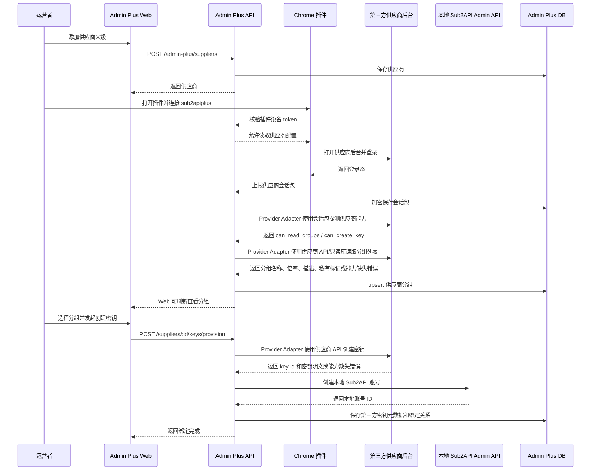

## 7. 分组同步流程图

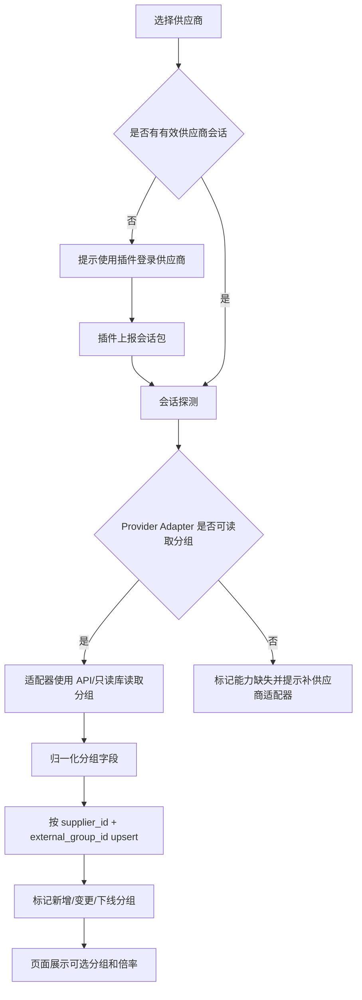

## 8. 密钥创建与本地同步时序图

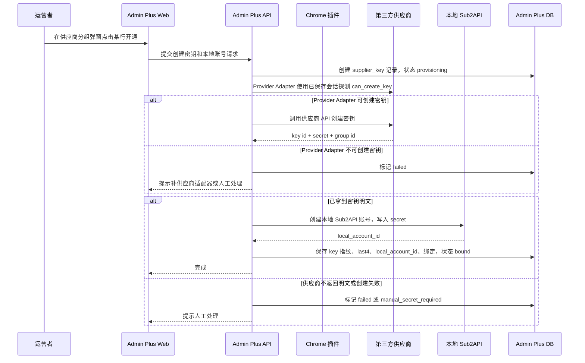

## 9. Provider Adapter 采集流程图

以下流程都遵守同一个边界：Chrome 插件只负责识别站点、采集浏览器会话、采集页面上下文并上报。Provider Adapter 才负责读取分组、余额、费率、优惠、健康、并发、账单和创建第三方密钥。

### 9.0 同源 Sub2API 供应商余额采集口径

如果第三方供应商也是基于 Sub2API 源码部署，余额可以采集，但必须先明确采集的是哪一层余额。

| 余额类型 | 是否作为 MVP 主路径 | 采集方式 | 用途 | 限制 |
|----------|--------------------|----------|------|------|
| 我们在供应商 Sub2API 中的下游用户余额 | 是 | 插件上报浏览器会话后，Provider Adapter 调用供应商用户侧接口，例如 `/api/v1/user/profile` | 判断是否可继续使用、是否允许进入切换候选、余额不足通知 | 依赖普通用户登录态有效性 |
| 供应商自己的上游源站账号余额/额度 | 否，除非供应商授权 | 供应商 Admin API、只读 DB、只读 Redis 或供应商明确提供的只读集成 | 评估供应商整体稳定性 | 作为下游通常没有权限，不能默认采集 |
| 本地 Sub2API 账号额度和用量 | 是，但不是供应商余额 | 本地 Sub2API Admin API、只读 DB、只读 Redis | 本地调度、成本核算、对账 | 不得误判为供应商账户余额 |

MVP 的“供应商余额”默认定义为：我们作为下游用户在该供应商 Sub2API 实例中的当前可用余额或有效额度。这个余额决定供应商父级是否可以从 `monitor_only` 进入 `candidate`，也决定是否生成余额不足飞书通知。

Sub2API 同源供应商的优先采集路径：

1. Chrome 插件识别供应商站点并上报登录会话。
2. Provider Adapter 使用会话调用供应商用户侧接口读取 `/user/profile` 等价数据。
3. 从返回数据中归一化 `balance`、`currency`、`concurrency`、`allowed_groups`、`status`。
4. 如会话具备权限，再读取 `/groups/rates`、`/keys`、`/usage` 辅助判断分组、密钥和用量。
5. 只有供应商明确提供 Admin API Key 或只读 DB/Redis 时，才读取管理员侧账号、渠道或供应商上游账号数据。

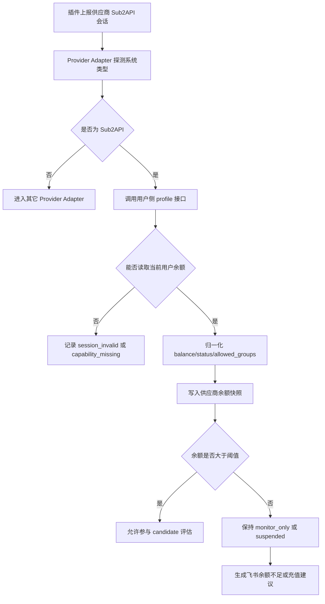

关键结论：

- 可以采集供应商余额，但主路径不是页面 DOM 抓取，而是后端使用插件上报的登录会话调用供应商 Sub2API 用户侧 API。
- 作为下游没有供应商 Admin Key，因此默认不能依赖供应商 `/api/v1/admin/*`。
- 不得把本地 Sub2API `accounts.quota_used`、`usage_logs` 或本地 API Key quota 当成供应商余额。
- 无余额供应商仍然可以监控费率和优惠，但不能进入自动切换候选。

### 9.1 通用采集调度流程

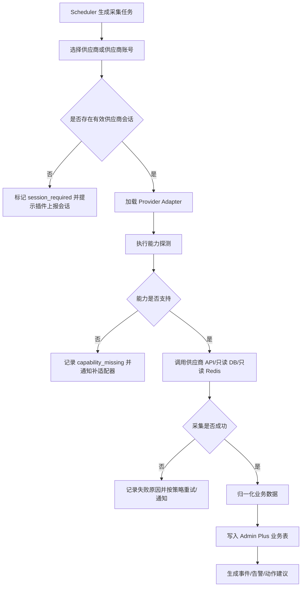

### 9.2 获取分组流程

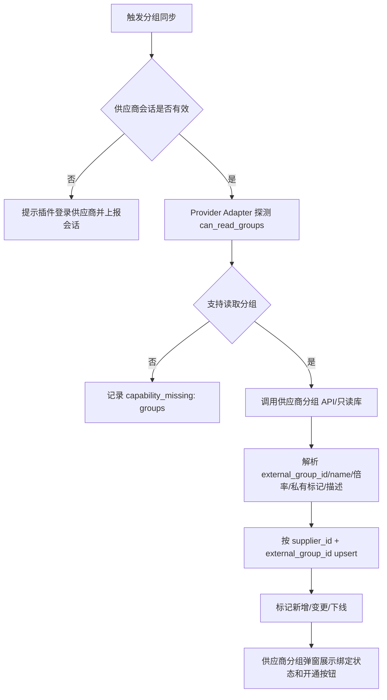

### 9.3 获取余额流程

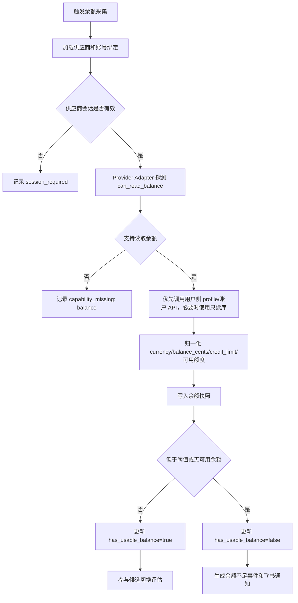

### 9.4 获取费率流程

当前主路径已经落地为后端 Provider Adapter 读取：

```text
POST /api/v1/admin-plus/suppliers/:id/rates/sync
```

该接口只使用 Admin Plus 已保存并解密后的供应商浏览器会话，由 `Sub2APIProviderAdapter.ReadRates(session)` 调用供应商用户侧受限 API，归一化为 `model / billing_mode / price_item / unit / currency / price_micros`，再交给 `rates.Service.RecordSnapshot` 写入 `admin_plus_rate_snapshots` 和 `admin_plus_rate_change_events`。旧插件任务 `fetch_rates` 仅作为兼容路径，不作为费率同步主链路继续增强。

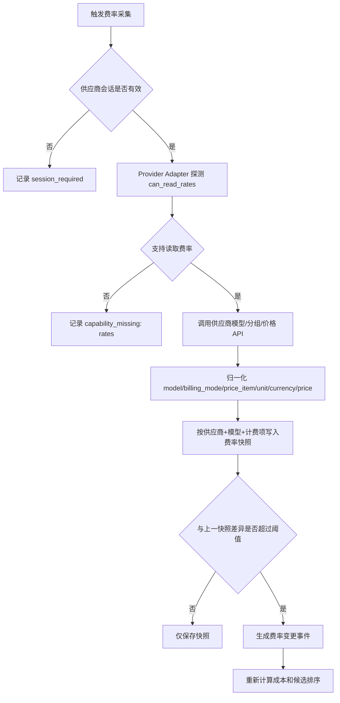

### 9.5 获取优惠流程

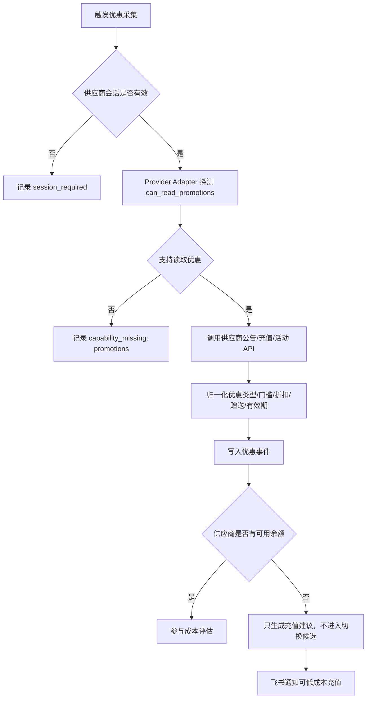

### 9.6 获取健康与并发流程

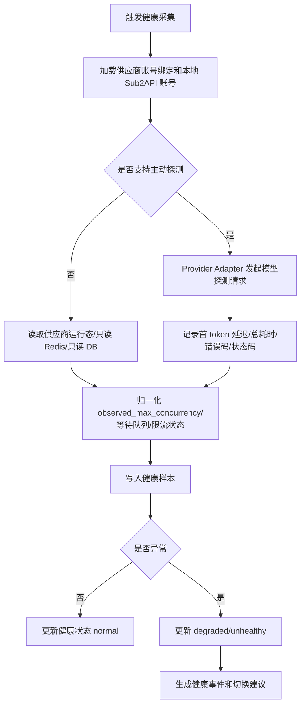

### 9.7 获取账单流程

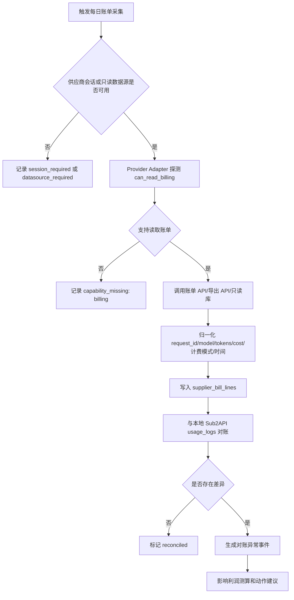

## 10. 失败补偿流程图

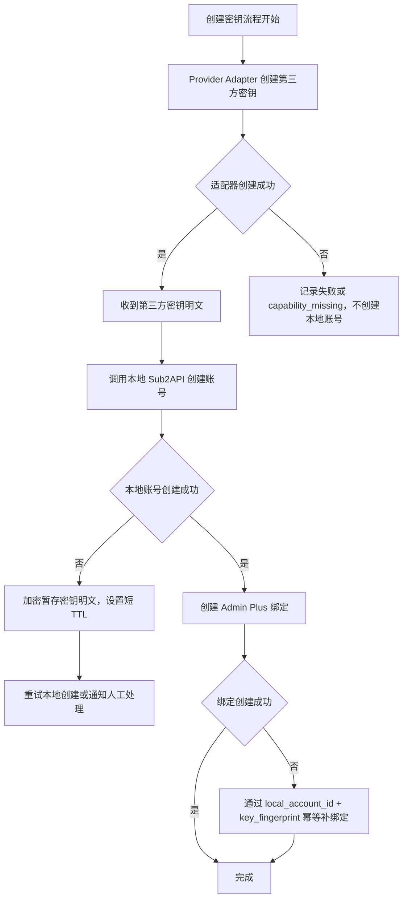

补偿规则：

- Provider Adapter 创建第三方密钥失败：不创建本地账号。
- Provider Adapter 能力缺失：标记 `capability_missing`，提示补供应商适配器或进入人工处理，不把创建动作下放给插件。
- 第三方密钥创建成功、本地账号创建失败：加密暂存密钥明文，设置短 TTL，触发飞书告警。
- 本地账号创建成功、绑定失败：不重复创建本地账号，按幂等键补绑定。
- 运营者删除绑定时，默认只删除 Admin Plus 绑定；是否禁用第三方密钥和本地 Sub2API 账号必须独立确认。

## 11. 页面流程

### 11.1 供应商管理页

供应商管理页负责父级：

- 新增供应商。
- 配置 dashboard URL、login URL、API base URL。
- 配置浏览器登录账号、密码或临时 token。
- 展示插件登录状态、分组同步状态、最后会话探测时间。
- 提供“登录供应商并同步分组”动作。

### 11.2 供应商分组弹窗内开通 Key/账号

MVP 主路径不再跳转到独立“账号/Key 绑定”页手工选本地账号，而是在供应商管理页的“分组”弹窗内完成：

1. 打开供应商父级的“分组”弹窗。
2. 同步并查看供应商真实分组。
3. 每个分组行展示当前第三方 Key、本地 Sub2API 账号和绑定状态。
4. 未绑定分组显示“未开通”，提供“开通”按钮。
5. 开通表单设置第三方密钥名称、额度、有效期、本地账号名称、平台、Base URL、并发、优先级、倍率、余额和状态。
6. 系统通过 Provider Adapter 创建第三方密钥。
7. 系统同步创建本地 Sub2API 账号。
8. 系统创建绑定并在该分组行展示结果。
9. 如果适配器能力缺失，页面展示需要补适配器或人工处理的明确原因。

### 11.3 账号/Key 绑定页

账号/Key 绑定页保留两类能力：

- 自动开通结果列表：展示供应商、分组、第三方 key、local_account_id、状态、余额、健康、成本。
- 手动修复入口：当自动同步失败时，允许选择已有本地账号或补录第三方 key 元数据完成绑定。

不再把“选择已有本地账号”作为主路径。该页面降级为修复、审计和历史绑定入口。

## 12. 后端模块建议

```text
backend/internal/adminplus/app/supplierkeys/
  service.go                     # 第三方 Key 创建、本地账号创建和绑定编排
  sql_repository.go              # admin_plus_supplier_keys + admin_plus_supplier_accounts 写入
  memory_repository.go           # 单元测试仓储
  provider.go                    # Wire provider

backend/internal/adminplus/adapters/sub2api/provider/
  session_profile.go             # Sub2API 供应商用户侧 profile、分组、费率和 Key 创建

backend/internal/handler/adminplus/
  supplier_key_handler.go        # GET keys / POST keys/provision
```

保持边界：

- `provider/sub2api` 面向第三方供应商。
- `local/sub2apiadmin` 面向本地 Sub2API。
- `app/accounts` 做编排和幂等，不直接依赖页面 DOM。
- Provider Adapter 是采集主路径，负责分组、费率、余额、优惠、账单、健康、并发和第三方密钥创建。
- Chrome 插件只负责识别站点、采集浏览器会话、采集页面上下文和上报第三方供应商信息；不承载分组解析、密钥创建、费率、余额、账单等业务动作。

## 13. 数据表草案

### 13.1 `admin_plus_supplier_groups`

| 字段 | 类型 | 说明 |
|------|------|------|
| `id` | bigint | 主键 |
| `supplier_id` | bigint | 供应商 ID |
| `external_group_id` | text | 第三方分组 ID，无法获取时用稳定指纹 |
| `name` | text | 分组名称 |
| `description` | text | 描述 |
| `rate_multiplier` | numeric | 倍率 |
| `is_private` | boolean | 是否私有分组 |
| `provider_family` | text | openai / anthropic / gemini / mixed |
| `status` | text | active / missing / disabled |
| `raw_payload` | jsonb | 原始数据 |
| `last_seen_at` | timestamptz | 最后看到时间 |

唯一约束：

```text
unique(supplier_id, external_group_id)
```

### 13.2 `admin_plus_supplier_keys`

| 字段 | 类型 | 说明 |
|------|------|------|
| `id` | bigint | 主键 |
| `supplier_id` | bigint | 供应商 ID |
| `supplier_group_id` | bigint | 分组 ID |
| `external_key_id` | text | 第三方 key ID |
| `name` | text | 第三方 key 名称 |
| `key_fingerprint` | text | 密钥指纹 |
| `key_last4` | text | 密钥末 4 位 |
| `status` | text | provisioning / bound / manual_secret_required / failed / disabled |
| `local_sub2api_account_id` | bigint | 本地 Sub2API 账号 ID |
| `local_account_name` | text | 本地账号名称快照 |
| `local_account_platform` | text | 本地账号平台快照 |
| `provision_request` | jsonb | 开通请求脱敏快照 |
| `provision_response` | jsonb | 第三方响应脱敏快照 |
| `error_code` | text | 失败码 |
| `error_message` | text | 失败原因 |
| `created_at` | timestamptz | 创建时间 |

Admin Plus 默认不长期保存第三方密钥明文。只有本地 Sub2API 创建失败时，可以加密暂存明文并设置短 TTL。

### 13.3 扩展 `admin_plus_supplier_accounts`

建议新增字段：

| 字段 | 类型 | 说明 |
|------|------|------|
| `supplier_key_id` | bigint | 绑定的第三方密钥 |
| `supplier_group_id` | bigint | 冗余分组 ID，便于查询 |
| `provisioning_status` | text | provisioning / active / repair_required |
| `provisioning_run_id` | text | 幂等开通批次 |

## 14. API 草案

### 14.1 当前站点匹配供应商

```http
POST /api/v1/admin-plus/suppliers/site-match
```

请求：

```json
{
  "origin": "https://supplier.example.com",
  "host": "supplier.example.com",
  "path": "/dashboard",
  "title": "Supplier Admin",
  "favicon_url": "https://supplier.example.com/favicon.ico"
}
```

响应：

```json
{
  "status": "matched|ambiguous|unknown|unsupported",
  "supplier_id": 123,
  "candidates": [],
  "suggested_supplier": {
    "name": "supplier.example.com",
    "type": "sub2api",
    "dashboard_url": "https://supplier.example.com",
    "api_base_url": "https://supplier.example.com/api/v1"
  }
}
```

### 14.2 从插件候选创建供应商

```http
POST /api/v1/admin-plus/suppliers/from-site-candidate
```

请求：

```json
{
  "name": "Supplier Example",
  "type": "sub2api",
  "dashboard_url": "https://supplier.example.com",
  "api_base_url": "https://supplier.example.com/api/v1",
  "host_patterns": ["supplier.example.com"],
  "source": "chrome_extension",
  "page_context": {
    "title": "Supplier Admin",
    "origin": "https://supplier.example.com"
  }
}
```

响应：

```json
{
  "id": 123,
  "name": "Supplier Example",
  "type": "sub2api",
  "dashboard_url": "https://supplier.example.com"
}
```

该接口必须要求管理员身份。插件只提交候选信息，不能绕过后端校验静默创建供应商。

### 14.3 同步供应商分组

```http
POST /api/v1/admin-plus/suppliers/:id/groups/sync
```

作用：创建或触发分组同步。使用 Provider Adapter 基于已保存供应商会话读取；能力缺失时返回明确错误。

响应：

```json
{
  "mode": "provider_adapter",
  "group_count": 12,
  "capability": {
    "can_read_groups": true,
    "reason": ""
  }
}
```

### 14.4 查询供应商分组

```http
GET /api/v1/admin-plus/suppliers/:id/groups?page=1&page_size=50
```

### 14.5 查询供应商 Key

```http
GET /api/v1/admin-plus/suppliers/:id/keys?page=1&page_size=1000
```

作用：供应商分组弹窗加载分组后，同时查询 Key 列表并按 `supplier_group_id` 建立映射。每个分组行展示“已绑定/未开通/失败”等状态。

### 14.6 创建第三方密钥并同步本地账号

```http
POST /api/v1/admin-plus/suppliers/:id/keys/provision
```

请求：

```json
{
  "supplier_group_id": 12,
  "name": "sub2api-plus-20260621-main",
  "quota_usd": 25,
  "expires_in_days": null,
  "local_account_name": "supplier-a / PRO 0.12 / main",
  "local_account_platform": "openai",
  "local_account_base_url": "https://supplier.example.com/v1",
  "local_account_priority": 50,
  "local_account_concurrency": 5,
  "local_account_rate_multiplier": 0.8,
  "local_account_group_ids": [1],
  "runtime_status": "monitor_only",
  "health_status": "normal",
  "balance_threshold_cents": 0,
  "balance_cents": 0,
  "balance_currency": "USD"
}
```

响应：

```json
{
  "key": {
    "id": 88,
    "supplier_id": 123,
    "supplier_group_id": 12,
    "external_key_id": "99",
    "key_fingerprint": "sha256...",
    "key_last4": "abcd",
    "status": "bound",
    "local_sub2api_account_id": 456
  },
  "binding": {
    "id": 77,
    "supplier_id": 123,
    "supplier_key_id": 88,
    "local_sub2api_account_id": 456,
    "runtime_status": "monitor_only"
  }
}
```

当前已落地的是同步返回的基础链路。第三方 Key 明文只用于创建本地 Sub2API 账号，不在接口响应、`provision_response` 或列表接口中回显。幂等 run、失败补偿和人工修复入口仍是后续工作。

### 14.7 插件上报供应商会话

```http
POST /api/v1/admin-plus/extension/session/capture-task
POST /api/v1/admin-plus/extension/tasks/:id/complete
POST /api/v1/admin-plus/suppliers/:id/browser-sessions
```

推荐主路径仍然是短租约 `capture_supplier_session` 任务：插件先创建会话采集任务，再在 `complete.result.session_bundle` 中提交会话包。这样可以绑定 `device_id`、`lease_token`、任务状态和审计记录。

`POST /api/v1/admin-plus/suppliers/:id/browser-sessions` 已作为管理员登录态下的直接写入入口落地，主要用于手动导入、插件联调和调试，不作为插件长期绕过短租约的主路径。

`complete` 请求中的 `result.session_bundle`：

```json
{
  "origin": "https://supplier.example.com",
  "captured_at": "2026-06-21T12:00:00Z",
  "expires_at": "2026-06-21T14:00:00Z",
  "tokens": {
    "access_token": "token-from-browser",
    "csrf_token": "csrf-from-browser"
  },
  "cookies": [],
  "context": {
    "api_base_url": "https://supplier.example.com/api/v1",
    "organization_id": "org_123"
  },
  "required_headers": {
    "origin": "https://supplier.example.com",
    "referer": "https://supplier.example.com/dashboard",
    "cookie": "sid=..."
  }
}
```

后端 ingest 会加密保存会话包，并从任务结果中移除明文。管理端可通过以下接口查看脱敏会话和触发 Provider Adapter 探测：

```http
GET  /api/v1/admin-plus/suppliers/:id/session
POST /api/v1/admin-plus/suppliers/:id/session/probe
POST /api/v1/admin-plus/suppliers/:id/groups/sync
GET  /api/v1/admin-plus/suppliers/:id/groups
POST /api/v1/admin-plus/suppliers/:id/rates/sync
POST /api/v1/admin-plus/suppliers/:id/keys/provision
GET  /api/v1/admin-plus/suppliers/:id/keys
```

插件不通过该链路上报已经解析好的分组、费率、余额、账单或第三方密钥创建结果。

当前已实现：

- 会话包加密保存。
- host 白名单校验。
- 响应只返回脱敏摘要。
- 支持 `cookies` 字符串和 Chrome cookies 数组。
- 可通过 `POST /api/v1/admin-plus/suppliers/:id/session/probe` 读取 Sub2API 用户侧 profile/余额并写入余额快照。
- 可通过 `POST /api/v1/admin-plus/suppliers/:id/groups/sync` 使用后端 Provider Adapter 读取供应商用户侧分组和倍率，并 upsert 到 `admin_plus_supplier_groups`。
- 可通过 `GET /api/v1/admin-plus/suppliers/:id/groups` 查询本地分组事实表；旧插件 `fetch_groups` 不作为分组同步主路径。
- 可通过 `POST /api/v1/admin-plus/suppliers/:id/rates/sync` 使用后端 Provider Adapter 读取供应商用户侧费率并写入费率快照；旧插件 `fetch_rates` 只作为兼容任务类型。
- 可通过 `POST /api/v1/admin-plus/suppliers/:id/keys/provision` 创建第三方 Key、创建本地 Sub2API 账号并写入绑定；插件不上报密钥创建结果。
- 供应商管理页的“分组”弹窗已作为 Key/账号开通主入口：每个分组行展示绑定状态，未绑定行可触发 `keys/provision`。

## 15. 幂等与一致性

幂等键必须覆盖：

- `supplier_id`
- `supplier_group_id`
- `key_name`
- `intended_local_account_name`
- 操作日期或显式 run id

不能只用页面按钮点击时间。否则插件重试可能重复创建第三方密钥。

一致性策略：

- 对第三方供应商：无法保证强事务，只能靠幂等检测、重复 key name 检查和补偿。
- 对本地 Sub2API：通过 Admin API 创建账号后必须记录返回的 `local_account_id`。
- 对 Admin Plus：绑定写入必须使用唯一约束防重复。

## 16. 状态机

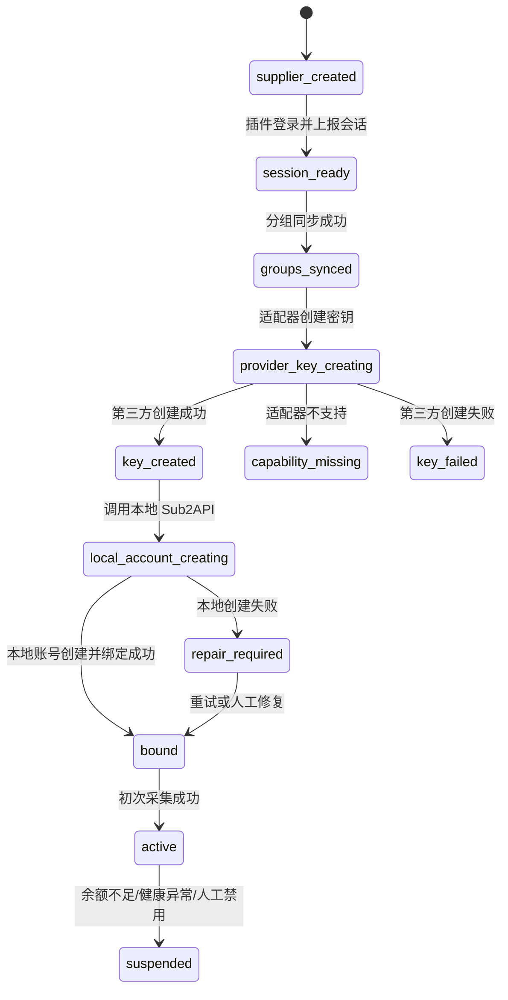

## 17. 权限与安全

- 不新增独立权限系统，复用 Sub2API 管理员身份。
- 插件必须先连接 sub2apiplus，不能匿名上报供应商会话。
- 创建第三方密钥是写操作，必须有明确的管理员确认和操作审计；写操作由 Provider Adapter 执行并归档 provisioning run。
- 第三方密钥明文默认只在内存中流转到本地 Sub2API Admin API。
- 本地 Sub2API 创建失败时，密钥明文如需暂存，必须加密、设置短 TTL，并产生告警。
- 前端不展示第三方密钥明文，只展示 key id、指纹、last4 和创建状态。
- 删除绑定、禁用本地账号、撤销第三方密钥必须拆成独立动作，避免误删可用资产。
- Provider Adapter 不能成为任意 URL 代理。每个供应商必须先保存 `base_url`、`api_base_url` 和 host 白名单，后端只允许访问该供应商域名下的已知接口路径。
- 余额、分组、费率、优惠、健康和账单采集默认只允许只读请求；创建第三方密钥等写操作必须单独声明 capability、单独确认和单独审计。
- 插件上报的 cookie、token、CSRF、页面上下文和供应商登录密码都按高敏凭据处理，必须服务端加密、设置过期时间、日志脱敏，不允许前端回显明文。
- 供应商会话必须记录来源设备、来源页面、任务 ID、采集时间、过期时间和最近探测结果。
- Sub2API 同源供应商的普通下游会话只能调用用户侧 API。除非供应商明确授权 Admin API Key 或只读 DB/Redis，否则不得调用供应商 `/api/v1/admin/*`。
- 所有直接读取本地或供应商 DB/Redis 的连接必须使用只读账号，并限制在 Adapter 层。

## 18. 测试计划

### 18.1 单元测试

- 分组归一化：名称、倍率、私有标记、provider family。
- key 指纹和 last4 生成。
- Provider Adapter 能力探测：`can_read_groups`、`can_read_balance`、`can_create_key`、`can_export_bills`。
- Sub2API 供应商余额归一化：从用户侧 profile 读取 `balance`，不得使用本地账号 quota 替代供应商余额。
- Provider Adapter 创建密钥成功和失败分支。
- 插件会话上报不得生成分组、密钥、费率、余额或账单业务结果。
- provisioning 状态机。
- 幂等键重复提交。
- 本地 Sub2API Admin API 创建账号失败补偿。
- 受限 HTTP client：拒绝非供应商 host、拒绝未登记路径、拒绝非只读采集写方法。

### 18.2 集成测试

- 使用真实 Admin Plus API 创建供应商。
- 使用真实 PostgreSQL 写入供应商分组和第三方 key 元数据。
- 使用 Provider Adapter 读取真实供应商分组。
- 使用 Provider Adapter 基于真实 Sub2API 供应商会话读取用户侧余额。
- 使用 Provider Adapter 在测试供应商环境创建真实 key。
- 使用本地 Sub2API Admin API 创建账号。
- 验证 `admin_plus_supplier_accounts.local_sub2api_account_id` 指向真实本地账号。

### 18.3 Chrome E2E

- 打开真实 Sub2API 供应商后台。
- 插件登录或复用登录态。
- 上报真实供应商会话包，不允许 mock。
- 插件上报内容只包含会话和页面上下文，不包含已解析业务数据或创建密钥结果。
- 将 key 同步创建到本地 Sub2API。
- 验证本地 Sub2API 账号可以发起一次探测请求。

## 19. 验收标准

- 可以从供应商管理页创建供应商父级。
- 插件可以登录一个真实 Sub2API 供应商后台。
- 插件可以把真实供应商会话包上报给 Admin Plus。
- Provider Adapter 可以基于真实会话包完成能力探测。
- 系统可以读取并展示该供应商真实分组列表。
- 供应商分组弹窗能展示每个分组是否已绑定第三方 Key 和本地 Sub2API 账号。
- 系统可以基于真实供应商 Sub2API 用户侧会话读取当前下游用户余额，并按余额决定 `monitor_only` / `candidate`。
- 运营者可以在某个未绑定分组行创建第三方密钥。
- 系统通过 Provider Adapter 创建第三方密钥。
- 插件不创建第三方密钥，不上报已解析的业务采集结果。
- 系统可以把第三方密钥同步创建为本地 Sub2API 账号。
- 系统可以自动创建 Admin Plus 账号绑定。
- 绑定后费率、余额、健康、账单至少一种采集能落到该绑定子级。
- 全链路失败不产生 mock 成功数据。
- 所有写本地 Sub2API 的动作都走 Admin API，不直接写 Sub2API DB。

## 20. 首批开发顺序

1. 增加供应商分组表、第三方 key 元数据表和绑定字段。
2. 实现 Provider Adapter 能力探测接口。
3. 实现 Sub2API 供应商分组读取适配器。
4. 插件支持真实供应商会话包上报。
5. 实现 Sub2API 供应商密钥创建适配器。
6. 实现本地 Sub2API Admin API 创建账号 client。
7. 实现账号开通编排服务和幂等。
8. 前端在供应商分组弹窗内增加 Key/账号开通入口和绑定状态列。
9. 接入初次采集、飞书失败通知和修复入口。
