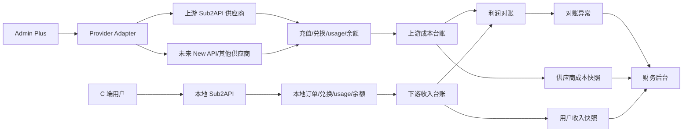
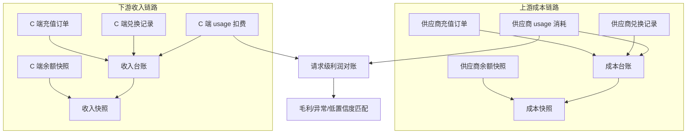
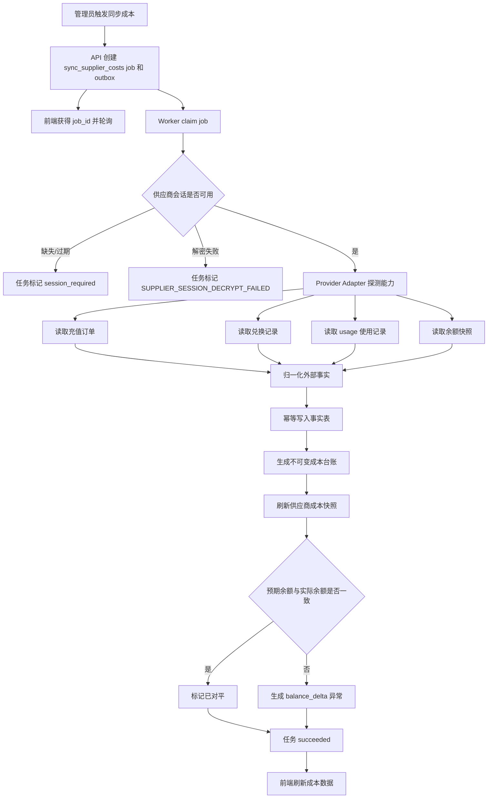
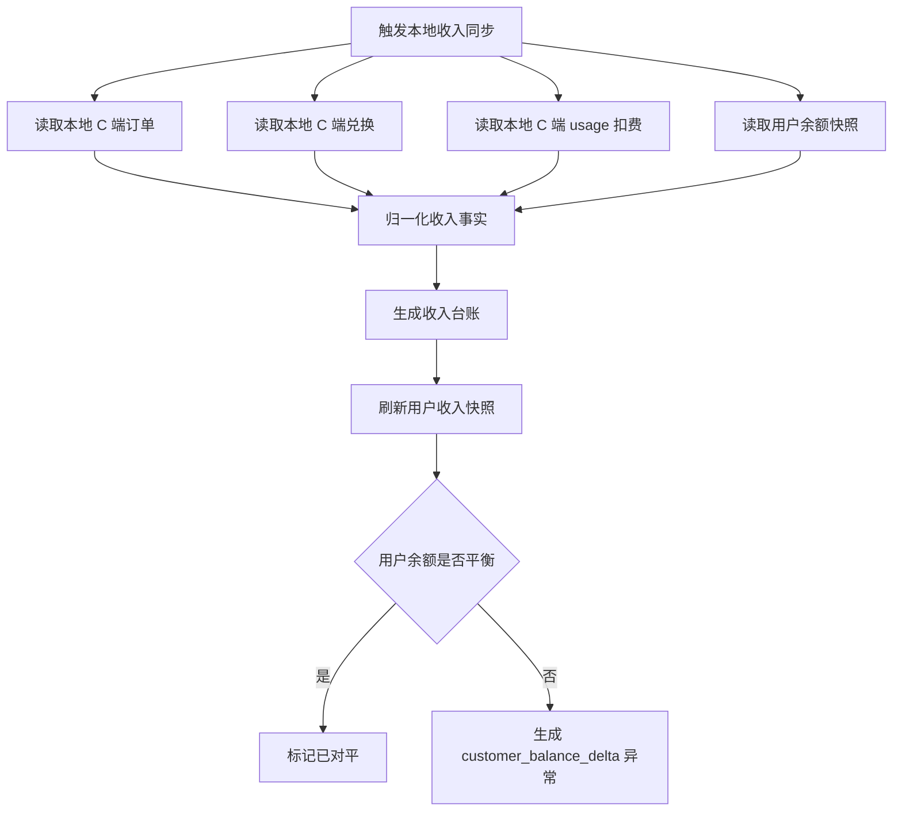
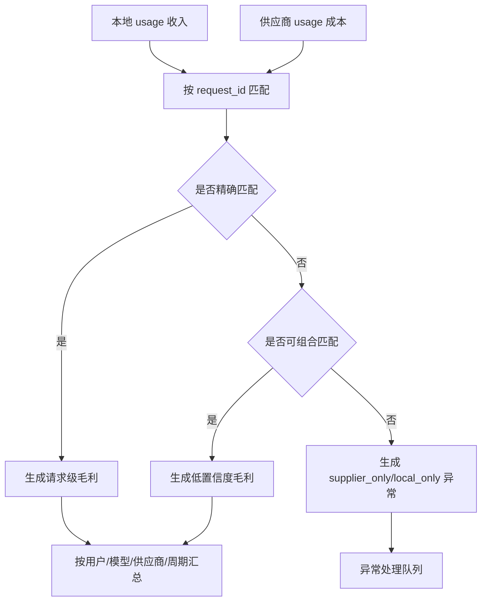
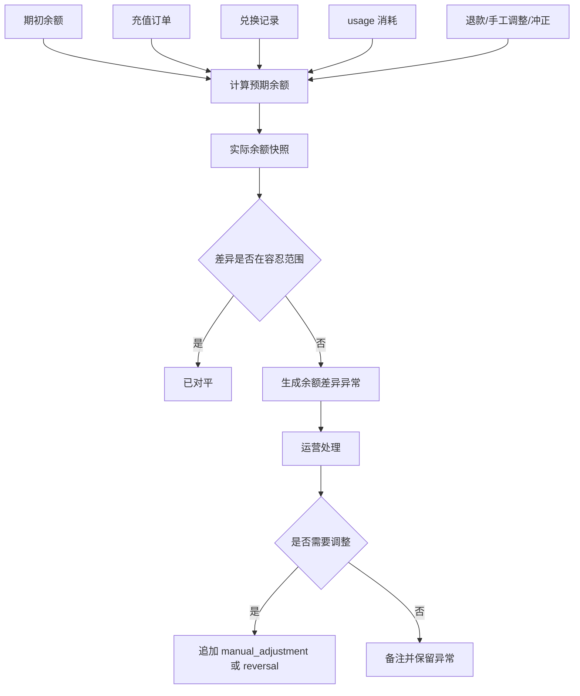
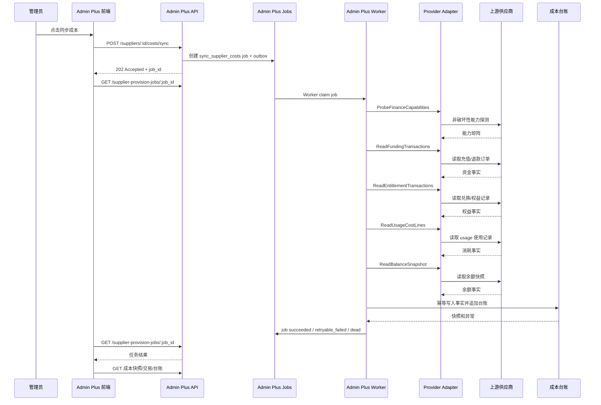
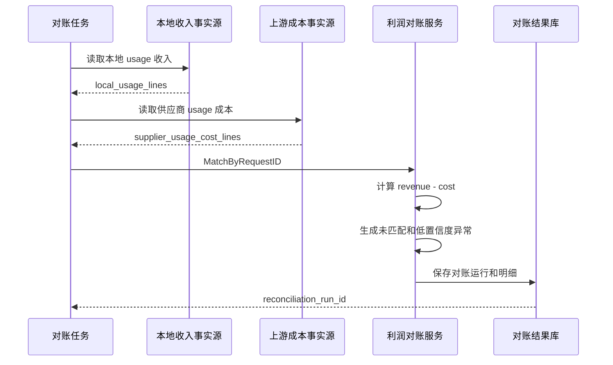
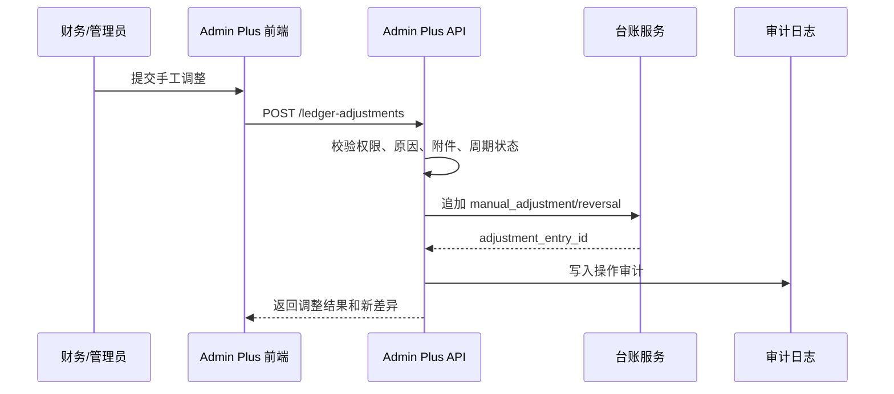

# Admin Plus 双边账务与成本对账 PRD

版本：v0.2.1
日期：2026-06-21
状态：P1 上游成本 MVP 已落地；P1.1 成本同步异步化收口到统一 Admin Plus 作业底座；P2-P4 按本文继续推进
范围：P1 已覆盖供应商上游成本、供应商 usage 消耗、成本台账、成本快照和后台入口；P1.1 将成本同步从请求线程长链路改为异步任务；P2-P4 规划下游 C 端收入、本地 Sub2API 经营利润、对账异常、闭账调整和审计页面。

## 目录

1. 背景
2. 设计结论
3. 目的与收益
4. 用户角色
5. 用户故事
6. 用户用例
7. 术语与账务边界
8. 业务范围
9. 总体架构图
10. 双边账务模型
11. Provider-neutral 能力模型
12. 核心流程图
13. 核心时序图
14. 数据口径
15. 后台功能需求
16. API
17. 数据结构
18. 对账规则
19. 异常处理
20. 权限、安全与审计
21. 外部最佳实践映射
22. 测试用例
23. 验收标准
24. 开发阶段
25. 风险与处理

## 1. 背景

Admin Plus 既是第三方供应商的下游用户，也是本地 Sub2API 服务的运营方。

对上游，Admin Plus 需要向第三方供应商购买额度或权益。供应商可能是别人部署的 Sub2API、New API 或其他兼容平台。我们在供应商侧的充值订单、兑换记录、使用记录和余额快照共同构成上游成本事实。

对下游，Admin Plus 使用本地 Sub2API 向实际 C 端用户提供中转服务。C 端用户在本地平台的充值、兑换、使用扣费和余额共同构成下游收入事实。

因此，完整对账不是单一“用量消耗”，而是三条链路：

```text
上游成本对账：供应商充值/兑换 - 供应商 usage 消耗 ≈ 供应商余额
下游收入对账：用户充值/兑换 - 用户 usage 扣费 ≈ 用户余额
经营利润对账：下游 usage 收入 - 上游 usage 成本 = 毛利
```

当前实现中的 `admin_plus_supplier_usage_cost_lines` 和 `用量消耗` 页面只覆盖供应商 `/usage` 这类请求级消耗明细。使用记录确实是成本消耗明细，但它不能单独解释“钱从哪里来、余额为什么差、供应商是否漏扣或多扣”。完整成本必须同时纳入充值订单、兑换记录、退款、余额快照和人工调整。

## 2. 设计结论

1. 对账系统必须是 Provider-neutral，不能绑定成只适用于 Sub2API。
2. MVP 只实现 `supplier.type = sub2api` 的真实采集适配器。
3. `Sub2API` 有双重角色：上游供应商部署的 Sub2API 是成本源，本地部署的 Sub2API 是收入源。
4. 资金、权益、消耗和余额要分层建模，不能混成一个成本字段。
5. 成本台账和收入台账只追加，不直接修改历史账务事实。
6. 充值订单是资金进入，兑换记录是额度或权益进入，使用记录是成本或收入消耗明细，余额快照是校验点。
7. Admin Plus 供应商 `/usage` 采集统一命名为 `usage-costs`，不能继续用旧 `billing` 语义承载完整财务成本。
8. Chrome 插件只做浏览器会话兜底，不解析订单、兑换、usage 并直接上传业务事实。
9. 成本同步必须异步化：HTTP 请求只创建任务并返回 `202 Accepted + job_id`，真实采集由 Admin Plus Worker 执行。
10. 异步对账复用 `supplier_provision_jobs`、`supplier_provision_steps`、`admin_plus_outbox_events` 和 Worker 底座；当前表名保留兼容，语义收口为 Admin Plus 运营作业底座，不新增第二套成本任务表。

治理分类：

- `current`：`/admin/finance/costs`、`/admin/finance/usage-costs`、`/admin/finance/local-usage`；`admin_plus_supplier_funding_transactions`、`admin_plus_supplier_entitlement_transactions`、`admin_plus_supplier_usage_cost_lines`、`admin_plus_supplier_cost_ledger_entries`、`admin_plus_supplier_cost_snapshots`；后端 `costs` 和 `usagecosts` 服务；`supplier_provision_jobs`、`supplier_provision_steps`、`admin_plus_outbox_events`、`processed_events`、`supplier_provision_attempts` 作为统一 Admin Plus 异步作业底座。
- `compat`：`POST /api/v1/admin-plus/suppliers/:id/costs/sync` 保留路径但只提交 `sync_supplier_costs` 任务，不再在请求线程内执行第三方采集。
- `compat`：`/admin/operations/billing` 仅重定向到 `/admin/finance/costs`，不承载独立业务逻辑或独立存储。
- `deprecated`：只用供应商 `/usage` 推导完整成本；插件解析订单、兑换、usage 并直接上传财务事实；HTTP 请求线程内串行调用供应商订单、兑换、usage 和余额接口。
- `dead`：`/admin/finance/billing`、`/admin/finance/reconciliation`、`/api/v1/admin-plus/reconciliation/run`、旧后端 `billing/reconciliation` 应用和 handler、旧前端 `BillingReconciliationView`；直接修改历史账务事实修正余额。

阶段边界：

- P1 已实现上游供应商成本 MVP。
- P2 下游收入、P3 利润对账、P4 异常闭环/闭账/手工调整仍是后续阶段，当前不展示导航入口，不注册运行时 API，不复用旧 `/admin/finance/reconciliation`。

## 3. 目的与收益

目的：

1. 建立一套双边账务模型，分别管理上游成本、下游收入和经营利润。
2. 用不可变台账作为财务事实源，保证余额和汇总可重建、可审计。
3. 让运营和财务能解释每个供应商、每个用户、每个请求的成本、收入、毛利和异常。
4. 为 New API、OpenAI、Anthropic、Gemini、自定义供应商预留统一 Provider 能力边界。
5. 删除旧 `billing/reconciliation` 当前入口，只保留 `/admin/operations/billing` 到“成本对账”的兼容重定向。

收益：

- 财务可以核对供应商累计充值、累计兑换、已消耗、当前余额、预期余额和差异。
- 运营可以发现供应商漏扣、多扣、费率异常、余额异常和请求未匹配。
- 管理员可以通过一个后台入口同步供应商成本、下游收入和利润对账。
- 技术排障人员可以按 request id 追踪本地收入、上游成本、模型、供应商、用户和毛利。
- 后续新增供应商类型时只补 Provider Adapter，不重写对账模型。

## 4. 用户角色

| 角色 | 关注点 | 典型操作 |
|------|--------|----------|
| 财务 | 成本、收入、毛利、余额差异、月结 | 查看成本总览、收入总览、利润报表、闭账结果 |
| 运营 | 供应商同步、异常处理、余额预警 | 同步成本、处理对账异常、查看供应商资金库存 |
| 管理员 | 供应商配置、会话、权限、手工调整 | 配置供应商、触发同步、创建人工调整、查看审计 |
| 技术排障人员 | 请求链路、字段匹配、低置信度结果 | 按 request id 排查成本、收入、模型和供应商 |

## 5. 用户故事

1. 作为财务，我要看到每个供应商的累计充值、累计实付、累计兑换、已消耗、当前余额、预期余额和差异。
2. 作为财务，我要看到 C 端用户充值、兑换、使用扣费和剩余余额是否平衡。
3. 作为运营，我要点击“同步成本”，一次采集供应商充值订单、兑换记录、usage 使用记录和余额快照。
4. 作为运营，我要知道某个供应商暂不支持订单或兑换采集时的明确原因，而不是看到假成功数据。
5. 作为管理员，我要对账务差异做手工调整，但不能直接改历史充值订单或 usage 明细。
6. 作为技术排障人员，我要通过 request id 查到本地收入、上游成本、模型、API key、耗时和毛利。
7. 作为财务，我要在月结后锁定周期，只允许追加冲正或调整分录。
8. 作为系统维护者，我要将 New API 等未来供应商接入同一套 Provider-neutral 对账模型。

## 6. 用户用例

### 6.1 同步上游供应商成本

前置条件：

- 供应商父级已创建。
- 供应商会话可用，来源可以是后端直登或 Chrome 插件兜底。
- Provider Adapter 支持对应供应商的只读成本采集能力。

主流程：

1. 管理员进入“财务 / 成本对账”。
2. 选择供应商和日期范围。
3. 点击“同步成本”。
4. 后端创建 `sync_supplier_costs` 异步任务，写入 outbox，并立即返回 `job_id`。
5. 前端轮询任务状态，展示排队、运行、成功或失败。
6. Worker 读取充值订单、兑换记录、usage 使用记录和余额快照。
7. Worker 归一化外部事实并幂等写入事实表。
8. Worker 生成成本台账分录并刷新供应商成本快照。
9. 页面在任务完成后刷新成本总览、资金差异和异常。

异常流程：

- 会话缺失或过期：任务失败原因返回 `SUPPLIER_SESSION_NOT_FOUND` / `SUPPLIER_SESSION_EXPIRED`，页面提示刷新供应商会话。
- 会话密文无法解密：任务失败原因返回 `SUPPLIER_SESSION_DECRYPT_FAILED`，常见原因是环境重启后使用了自动生成的 `totp.encryption_key`；处理方式是配置稳定密钥并重新直登供应商刷新会话。
- 能力缺失：返回 `capability_missing`，标记缺失的能力。
- 部分接口成功：保存成功事实，失败项进入同步诊断。
- 金额或币种异常：保留原始事实，生成待处理异常。

### 6.2 同步下游 C 端收入

前置条件：

- 本地 Sub2API 数据源可读。
- C 端用户充值、兑换、usage 和余额有可访问事实源。

主流程：

1. 管理员进入“收入对账”或“成本对账 / 下游收入”。
2. 选择用户、平台或时间范围。
3. 后端读取本地订单、兑换、usage 扣费和用户余额。
4. 归一化为收入事实并生成收入台账。
5. 生成用户收入快照和余额差异。

### 6.3 请求级利润对账

前置条件：

- 已采集本地 usage 收入。
- 已采集供应商 usage 成本。

主流程：

1. 后端按 `external_request_id` 优先匹配。
2. 匹配成功时计算 `gross_profit = local_usage_revenue - supplier_usage_cost`。
3. 匹配失败时生成 `supplier_only` 或 `local_only` 异常。
4. 缺少 request id 时允许降级组合匹配，并标记 `low_confidence_match`。
5. 页面按供应商、用户、模型、时间窗口展示毛利和异常。

## 7. 术语与账务边界

| 术语 | 含义 | 所属链路 |
|------|------|----------|
| 上游供应商 | 我们购买模型额度或中转能力的第三方 | 成本 |
| 本地 Sub2API | 我们部署并向 C 端用户提供服务的网关 | 收入 |
| C 端用户 | 使用我们本地 Sub2API 服务的实际客户 | 收入 |
| 充值订单 | 金额支付或额度到账事实 | 上游是成本投入，下游是收入流入 |
| 兑换记录 | 兑换码、活动额度、权益到账事实 | 上游是成本额度来源，下游是用户权益发放 |
| 使用记录 | 请求级 token、模型、费用、耗时事实 | 上游是成本消耗，下游是收入确认 |
| 余额快照 | 某一时点供应商或用户余额 | 校验点 |
| 成本台账 | 上游资金、权益、消耗和调整分录 | 成本 |
| 收入台账 | 下游资金、权益、消耗和调整分录 | 收入 |
| 利润对账 | 下游收入和上游成本的请求级或周期级匹配 | 经营利润 |

同一份 Sub2API 页面数据在不同角色下含义不同：

| 数据 | 上游供应商侧 Sub2API | 本地服务侧 Sub2API |
|------|----------------------|-------------------|
| 充值订单 | 我们的成本投入 | 用户给我们的收入 |
| 兑换记录 | 我们获得额度或权益 | 用户获得额度或权益 |
| 使用记录 | 我们消耗供应商额度 | 用户消耗我们的服务额度 |
| 余额 | 我们在供应商的剩余额度 | 用户在我们平台的剩余额度 |

## 8. 业务范围

### 8.1 P1 已落地范围

P1 只支持 Sub2API 类型供应商的上游成本：

- 上游供应商充值订单：`/api/v1/payment/orders/my`
- 上游供应商兑换记录：`/api/v1/redeem/history`
- 上游供应商使用记录：`/api/v1/usage`
- 上游供应商余额快照：`/api/v1/user/profile`
- 后台成本对账页面：供应商成本快照、充值订单、兑换记录、成本台账
- 后台用量消耗页面：供应商 usage 消耗明细、供应商会话同步、手工补录
- 财务导航：成本对账、用量消耗、本地用量
- 旧入口治理：删除 `/admin/finance/billing` 和 `/admin/finance/reconciliation` 当前路由，保留 `/admin/operations/billing` 兼容重定向

### 8.2 后续范围

后续业务能力：

- 本地 Sub2API usage 收入：本地 `usage_logs`、计费结果或现有本地用量服务
- 下游收入台账和收入快照
- 请求级利润对账：优先使用 request id 匹配
- 对账异常队列、手工调整、冲正、闭账和审计页面

后续供应商类型：

- New API
- OpenAI
- Anthropic
- Gemini
- Browser-only
- Custom

这些供应商必须通过 Provider-neutral 接口接入，不能新增平行成本模型。

### 8.3 非目标

- 不在 MVP 中自动处理真实付款、退款或兑换写操作。
- 不通过 Chrome 插件解析 DOM 生成财务事实。
- 不直接修改历史订单、兑换记录或 usage 明细。
- 不把本地账号 quota 当作供应商余额。
- 不把供应商 usage 成本当成完整供应商资金成本。

## 9. 总体架构图



## 10. 双边账务模型



分层原则：

1. 外部事实层保存供应商或本地系统的原始事实和脱敏原始响应。
2. 台账层只保存归一化后的财务分录。
3. 快照层是按供应商、用户、币种和周期派生的查询视图。
4. 对账层保存每次对账运行、匹配结果和异常处理状态。

## 11. Provider-neutral 能力模型

Provider Adapter 不应暴露 Sub2API 专属业务名，接口按账务事实分类：

| 能力 | 含义 | Sub2API MVP 映射 |
|------|------|------------------|
| `ReadFundingTransactions` | 读取资金类交易，例如充值、付款、退款 | `/api/v1/payment/orders/my` |
| `ReadEntitlementTransactions` | 读取权益类交易，例如兑换码、套餐、并发、订阅 | `/api/v1/redeem/history` |
| `ReadUsageCostLines` | 读取请求级供应商消耗 | `/api/v1/usage` |
| `ReadBalanceSnapshot` | 读取当前余额和权益快照 | `/api/v1/user/profile` |
| `ProbeFinanceCapabilities` | 探测财务采集能力矩阵 | 非破坏性 GET |

能力结果必须包含：

- `provider_type`
- `provider_family`
- `system_type`
- `capabilities`
- `captured_at`
- `diagnostics`
- `raw_payload` 脱敏快照

不支持的供应商类型返回 `capability_missing`，不得生成 mock 成功数据。

## 12. 核心流程图

### 12.1 供应商成本同步流程



### 12.2 下游收入同步流程



### 12.3 请求级利润对账流程



### 12.4 资金库存对账流程



## 13. 核心时序图

### 13.1 供应商成本同步时序



### 13.2 双边利润对账时序



### 13.3 人工调整时序



## 14. 数据口径

### 14.1 上游成本口径

```text
expected_supplier_balance =
  opening_supplier_balance
  + completed_recharge_amount
  + manual_redeem_balance_amount
  - supplier_usage_cost
  - refunded_amount
  + manual_adjustment
  + reversal

supplier_balance_delta =
  actual_supplier_balance - expected_supplier_balance
```

字段口径：

- `completed_recharge_amount`：已完成充值订单的到账额度，供应商列表“累计充值额度”使用该值。
- `completed_recharge_cash`：已完成充值订单的实付金额，用于现金成本。
- `manual_redeem_balance_amount`：手工兑换、活动码或非充值自动兑换带来的余额额度。
- `supplier_usage_cost`：供应商 `/usage` 使用记录产生的成本消耗。
- `refunded_amount`：退款或冲回金额。
- `actual_supplier_balance`：供应商 profile 或余额接口返回的当前余额。

Sub2API 规则：

- `/api/v1/payment/orders/my` 是现金充值事实源。
- `/api/v1/redeem/history` 是兑换权益事实源。
- `/api/v1/usage` 是成本消耗明细。
- 充值订单完成后可能生成 `PAY***` 形式兑换记录，必须标记为 `payment_auto_redeem`，不得重复计入兑换来源。

### 14.2 下游收入口径

```text
expected_customer_balance =
  opening_customer_balance
  + completed_customer_recharge_amount
  + customer_redeem_balance_amount
  - local_usage_revenue
  - customer_refunded_amount
  + manual_adjustment
  + reversal

customer_balance_delta =
  actual_customer_balance - expected_customer_balance
```

字段口径：

- `completed_customer_recharge_amount`：C 端用户充值到账金额，是平台收入资金流入。
- `customer_redeem_balance_amount`：C 端用户兑换得到的余额或权益。
- `local_usage_revenue`：C 端用户请求扣费，是收入确认。
- `actual_customer_balance`：本地 Sub2API 用户余额。

### 14.3 利润口径

```text
request_gross_profit = local_usage_revenue - supplier_usage_cost

gross_margin =
  request_gross_profit / local_usage_revenue
```

当 `local_usage_revenue = 0` 时，毛利率为空，不能显示为 0%。

### 14.4 金额与币种

- 金额用整数最小单位，例如 `amount_cents`。
- 币种必须保存 ISO 4217 或供应商明确返回的稳定币种。
- 多币种不自动合并，必须先按币种分组。
- 汇率换算属于后续能力，MVP 不做自动换汇。

## 15. 后台功能需求

### 15.1 导航与功能重排

这次对账口径变化必须同步更新导航栏和后台功能，否则用户仍会从旧“用量消耗/对账结果”入口理解为完整成本对账。

新的财务导航：

| 导航分组 | 路由 | 页面 | 定位 |
|----------|------|------|------|
| 财务 | `/admin/finance/costs` | 成本对账 | 上游供应商成本主入口 |
| 财务 | `/admin/finance/usage-costs` | 用量消耗 | 供应商 usage 消耗明细入口 |
| 财务 | `/admin/finance/local-usage` | 本地用量 | 现有本地 usage 明细 |

未实现页面不展示导航入口，避免产生空页面和错误认知；收入对账、利润对账、对账异常、台账审计在对应后端事实源落地后再开放。

旧入口清理：

| 旧路由 | 新处理 |
|--------|--------|
| `/admin/finance/billing` | `dead`：不再注册，避免把 usage 明细误认为完整成本 |
| `/admin/finance/reconciliation` | `dead`：不再注册，利润对账未落地前不提供假入口 |
| `/admin/operations/billing` | `compat`：仅重定向到 `/admin/finance/costs` |

Sidebar 要求：

- 财务分组默认包含上述 current 入口。
- 旧“供应商账单”不再作为认知入口，统一命名为 `用量消耗`。
- 点击同一财务分组下的二级导航时，分组保持展开。
- 只有点击其他一级分组、其他类型二级分组、主动折叠或点击关闭时，才关闭当前展开分组。
- Sidebar 测试必须覆盖财务导航项和二级展开行为。

页面职责：

- `成本对账` 只看上游供应商成本。
- `用量消耗` 只展示供应商 `/usage` 明细，不再显示完整成本结论。
- `本地用量` 保持现有本地 usage 明细入口。
- `收入对账` 后续只看下游 C 端收入，当前不展示入口。
- `利润对账` 后续只看本地收入和上游成本的匹配与毛利，当前不展示入口。
- `对账异常` 后续统一承载成本、收入、利润异常，当前不展示入口。
- `台账审计` 后续统一查看不可变分录、手工调整和冲正，当前不展示入口。

### 15.2 成本对账首页

入口：`财务 / 成本对账`

P1 已落地视图：

1. 供应商成本总览
2. 供应商资金交易
3. 供应商权益交易
4. 供应商成本台账

后续视图：

1. 下游收入总览
2. 请求利润对账
3. 对账异常
4. 台账审计

供应商成本总览字段：

- 供应商名称
- 类型
- 当前余额
- 累计充值额度
- 累计实付金额
- 累计兑换额度
- 已消耗成本
- 预期余额
- 余额差异
- 最近同步时间
- 能力状态

P2 后续下游收入总览字段：

- 用户 ID
- 用户邮箱或名称
- 累计充值
- 累计兑换
- usage 收入
- 当前余额
- 预期余额
- 余额差异
- 最近同步时间

### 15.3 供应商资金交易页

展示供应商充值、付款、退款类事实。

字段：

- 供应商
- provider type
- external order id
- out trade no
- payment trade no 脱敏
- order type
- status
- currency
- amount
- pay amount
- refund amount
- fee rate
- created at external
- paid at
- completed at
- last seen at

### 15.4 供应商权益交易页

展示兑换码、套餐、订阅、并发等权益类事实。

字段：

- 供应商
- external redeem id
- code fingerprint
- code last4
- source family
- type
- status
- currency
- value
- group
- validity days
- used at
- created at external
- last seen at

### 15.5 使用记录页

展示供应商 usage 成本消耗明细。

字段来自用户截图中的使用记录页面：

- API 密钥
- 模型
- 推理强度
- endpoint
- 类型
- 计费模式
- token 明细
- 费用
- 首 token
- 耗时
- 时间
- user-agent
- 外部 request id

该页属于消耗明细，不等同于完整成本总览。

### 15.6 利润对账页

展示本地收入与上游成本的匹配结果。

状态：P3 后续页面，当前不注册导航和路由，不复用旧 `/admin/finance/reconciliation`。

字段：

- request id
- 用户
- 本地账号
- 供应商
- 模型
- 本地收入
- 供应商成本
- 毛利
- 毛利率
- 匹配状态
- 匹配置信度
- 异常原因

### 15.7 异常处理页

异常状态：

- `open`
- `investigating`
- `resolved`
- `ignored`
- `adjusted`

异常类型：

- `supplier_only`
- `local_only`
- `amount_mismatch`
- `currency_mismatch`
- `balance_delta`
- `customer_balance_delta`
- `capability_missing`
- `session_required`
- `low_confidence_match`
- `duplicate_external_fact`

操作：

- 分配处理人
- 添加备注
- 标记忽略
- 追加手工调整
- 追加冲正
- 重新同步
- 查看原始脱敏 payload

## 16. API

### 16.1 P1 已实现 API：上游成本

```http
POST /api/v1/admin-plus/suppliers/:id/costs/sync
GET  /api/v1/admin-plus/supplier-provision-jobs/:job_id
GET  /api/v1/admin-plus/costs/suppliers?page=1&page_size=50
GET  /api/v1/admin-plus/suppliers/:id/costs/summary
GET  /api/v1/admin-plus/suppliers/:id/funding-transactions?page=1&page_size=50
GET  /api/v1/admin-plus/suppliers/:id/entitlement-transactions?page=1&page_size=50
GET  /api/v1/admin-plus/suppliers/:id/cost-ledger?page=1&page_size=50
```

`POST /suppliers/:id/costs/sync` 是兼容路径，语义已经从“同步执行”收口为“提交异步任务”。请求线程只做鉴权、参数校验、幂等键处理和任务创建，不直接访问第三方供应商接口。

### 16.2 P1 已实现 API：供应商 usage 消耗

```http
POST /api/v1/admin-plus/suppliers/:id/usage-costs/sync
POST /api/v1/admin-plus/usage-costs/lines/import
GET  /api/v1/admin-plus/usage-costs/lines?supplier_id=123&page=1&page_size=50
```

同步请求：

```json
{
  "started_at": "2026-06-01T00:00:00Z",
  "ended_at": "2026-06-21T23:59:59Z",
  "include_funding_transactions": true,
  "include_entitlement_transactions": true,
  "include_usage_cost_lines": true,
  "include_balance_snapshot": true
}
```

同步响应：

```json
{
  "job_id": 913,
  "status": "queued",
  "job_type": "sync_supplier_costs",
  "supplier_id": 123,
  "poll_url": "/api/v1/admin-plus/supplier-provision-jobs/913",
  "mode": "async_job"
}
```

任务完成后的 `GET /supplier-provision-jobs/:job_id` 响应在 `result_snapshot` 中保存同步摘要：

```json
{
  "id": 913,
  "job_type": "sync_supplier_costs",
  "status": "succeeded",
  "supplier_id": 123,
  "result_snapshot": {
    "provider_type": "sub2api",
    "synced_at": "2026-06-21T12:00:00Z",
    "funding_transactions": 18,
    "entitlement_transactions": 4,
    "usage_cost_lines": 260,
    "ledger_entries": 282,
    "snapshot_id": 501,
    "currency": "USD"
  }
}
```

完整成本快照、充值订单、兑换记录和台账仍通过查询接口读取；任务结果只保存足够的运营摘要，不作为财务事实源。

### 16.3 P2 后续 API 草案：下游收入

当前不注册这些 API。

```http
POST /api/v1/admin-plus/customers/revenue/sync
GET  /api/v1/admin-plus/customers/revenue/summary?page=1&page_size=50
GET  /api/v1/admin-plus/customers/:id/revenue-ledger?page=1&page_size=50
GET  /api/v1/admin-plus/customers/:id/revenue-summary
```

### 16.4 P3 后续 API 草案：利润对账

当前不注册这些 API，且不复用旧 `/api/v1/admin-plus/reconciliation/run`。

```http
POST /api/v1/admin-plus/reconciliation/profit/run
GET  /api/v1/admin-plus/reconciliation/profit/runs?page=1&page_size=50
GET  /api/v1/admin-plus/reconciliation/profit/runs/:id
GET  /api/v1/admin-plus/reconciliation/anomalies?page=1&page_size=50
PATCH /api/v1/admin-plus/reconciliation/anomalies/:id
```

### 16.5 P4 后续 API 草案：手工调整

```http
POST /api/v1/admin-plus/ledger-adjustments
GET  /api/v1/admin-plus/ledger-adjustments?page=1&page_size=50
```

手工调整请求：

```json
{
  "ledger_scope": "supplier_cost",
  "supplier_id": 123,
  "customer_id": 0,
  "currency": "USD",
  "amount_cents": 500,
  "entry_type": "manual_adjustment",
  "reason": "supplier balance rounding delta",
  "notes": "approved by finance after manual check"
}
```

## 17. 数据结构

### 17.1 P1 当前表

| 表 | 定位 | 事实源 |
|----|------|--------|
| `admin_plus_supplier_funding_transactions` | 上游供应商资金交易事实 | `/api/v1/payment/orders/my` |
| `admin_plus_supplier_entitlement_transactions` | 上游供应商权益交易事实 | `/api/v1/redeem/history` |
| `admin_plus_supplier_usage_cost_lines` | 上游供应商 usage 消耗明细 | `/api/v1/usage`、手工补录 |
| `admin_plus_supplier_cost_ledger_entries` | 上游供应商成本台账 | funding / entitlement / usage 归一化分录 |
| `admin_plus_supplier_cost_snapshots` | 上游供应商成本快照 | 成本台账、usage 明细、余额快照 |

P1 采用拆表作为当前物理事实源，不使用统一 `admin_plus_supplier_finance_facts` 物理表。

### 17.2 `admin_plus_supplier_funding_transactions`

| 字段 | 类型 | 说明 |
|------|------|------|
| `id` | bigint | 主键 |
| `supplier_id` | bigint | 供应商 ID |
| `provider_type` | text | Provider 类型 |
| `external_id` | text | 外部订单 ID |
| `out_trade_no` | text | 商户订单号 |
| `payment_trade_no` | text | 支付渠道交易号，展示需脱敏 |
| `payment_type` | text | 支付方式 |
| `order_type` | text | 订单类型 |
| `status` | text | 外部订单状态 |
| `currency` | text | 币种 |
| `amount_cents` | bigint | 到账额度 |
| `cash_amount_cents` | bigint | 实付现金 |
| `refund_amount_cents` | bigint | 退款金额 |
| `fee_rate` | double precision | 费率 |
| `created_at_external` | timestamptz | 外部创建时间 |
| `paid_at` | timestamptz | 支付时间 |
| `completed_at` | timestamptz | 完成时间 |
| `raw_payload` | jsonb | 脱敏原始响应 |
| `last_seen_at` | timestamptz | 最近采集时间 |

唯一键：

```text
unique(supplier_id, provider_type, external_id)
unique(supplier_id, provider_type, out_trade_no) where out_trade_no <> ''
```

### 17.3 `admin_plus_supplier_entitlement_transactions`

| 字段 | 类型 | 说明 |
|------|------|------|
| `id` | bigint | 主键 |
| `supplier_id` | bigint | 供应商 ID |
| `provider_type` | text | Provider 类型 |
| `external_id` | text | 外部兑换记录 ID |
| `code_fingerprint` | text | 兑换码指纹 |
| `code_last4` | text | 兑换码尾号 |
| `source_family` | text | manual_redeem / payment_auto_redeem 等来源 |
| `type` | text | balance / package / subscription 等权益类型 |
| `status` | text | 外部状态 |
| `currency` | text | 币种 |
| `value_cents` | bigint | 权益额度 |
| `raw_value` | double precision | 外部原始数值 |
| `group_id` | bigint | 外部分组 ID |
| `validity_days` | integer | 有效期 |
| `used_at` | timestamptz | 使用时间 |
| `created_at_external` | timestamptz | 外部创建时间 |
| `raw_payload` | jsonb | 脱敏原始响应 |
| `last_seen_at` | timestamptz | 最近采集时间 |

唯一键：

```text
unique(supplier_id, provider_type, external_id)
unique(supplier_id, provider_type, code_fingerprint) where code_fingerprint <> ''
```

### 17.4 `admin_plus_supplier_usage_cost_lines`

| 字段 | 类型 | 说明 |
|------|------|------|
| `id` | bigint | 主键 |
| `supplier_id` | bigint | 供应商 ID |
| `source` | text | 来源 |
| `external_usage_cost_id` | text | 外部 usage 记录 ID |
| `external_request_id` | text | 外部请求 ID |
| `api_key_name` | text | API Key 名称 |
| `model` | text | 模型 |
| `endpoint` | text | endpoint |
| `request_type` | text | 请求类型 |
| `billing_mode` | text | 计费模式 |
| `reasoning_effort` | text | 推理强度 |
| `currency` | text | 币种 |
| `cost_cents` | bigint | 消耗成本 |
| `input_tokens` | bigint | 输入 token |
| `output_tokens` | bigint | 输出 token |
| `cache_read_tokens` | bigint | 缓存读取 token |
| `total_tokens` | bigint | 总 token |
| `first_token_ms` | bigint | 首 token 毫秒 |
| `duration_ms` | bigint | 总耗时毫秒 |
| `user_agent` | text | user-agent |
| `started_at` | timestamptz | 开始时间 |
| `ended_at` | timestamptz | 结束时间 |
| `raw_payload` | jsonb | 脱敏原始响应 |

### 17.5 `admin_plus_supplier_cost_ledger_entries`

| 字段 | 类型 | 说明 |
|------|------|------|
| `id` | bigint | 主键 |
| `supplier_id` | bigint | 供应商 ID |
| `provider_type` | text | Provider 类型 |
| `entry_type` | text | funding_credit / entitlement_credit / usage_debit / refund_debit / manual_adjustment / reversal |
| `source_type` | text | funding_transaction / entitlement_transaction / usage_cost_line / balance_snapshot / manual |
| `source_id` | bigint | 本地事实 ID |
| `source_external_id` | text | 第三方来源 ID |
| `currency` | text | 币种 |
| `amount_cents` | bigint | 正数增加余额，负数减少余额 |
| `cash_amount_cents` | bigint | 实付现金口径 |
| `occurred_at` | timestamptz | 业务发生时间 |
| `created_at` | timestamptz | 入库时间 |
| `created_by` | bigint | 手工调整时的管理员 |
| `reason` | text | 调整或冲正原因 |
| `raw_payload` | jsonb | 脱敏计算上下文 |

唯一键：

```text
unique(supplier_id, provider_type, entry_type, source_type, source_id)
```

### 17.6 `admin_plus_supplier_cost_snapshots`

| 字段 | 类型 | 说明 |
|------|------|------|
| `id` | bigint | 主键 |
| `supplier_id` | bigint | 供应商 ID |
| `currency` | text | 币种 |
| `completed_funding_amount_cents` | bigint | 已完成充值到账额度 |
| `completed_funding_cash_cents` | bigint | 已完成充值实付金额 |
| `entitlement_amount_cents` | bigint | 权益额度 |
| `usage_cost_cents` | bigint | usage 消耗 |
| `refund_amount_cents` | bigint | 退款 |
| `adjustment_amount_cents` | bigint | 调整 |
| `expected_balance_cents` | bigint | 预期余额 |
| `actual_balance_cents` | bigint | 实际余额 |
| `balance_delta_cents` | bigint | 差异 |
| `captured_at` | timestamptz | 快照采集时间 |
| `created_at` | timestamptz | 生成时间 |

### 17.7 P2 后续表草案：`admin_plus_customer_revenue_ledger_entries`

| 字段 | 类型 | 说明 |
|------|------|------|
| `id` | bigint | 主键 |
| `customer_id` | bigint | 本地用户 ID |
| `entry_type` | text | recharge_credit / redeem_credit / usage_debit / refund_debit / manual_adjustment / reversal |
| `source_type` | text | payment_order / redeem_record / usage_log / balance_snapshot / manual |
| `source_id` | bigint | 本地来源 ID |
| `currency` | text | 币种 |
| `amount_cents` | bigint | 用户余额变动 |
| `cash_amount_cents` | bigint | 用户实付现金 |
| `occurred_at` | timestamptz | 业务发生时间 |
| `created_at` | timestamptz | 入库时间 |
| `raw_payload` | jsonb | 脱敏上下文 |

### 17.8 P2 后续表草案：收入快照

| 字段 | 类型 | 说明 |
|------|------|------|
| `id` | bigint | 主键 |
| `customer_id` | bigint | 本地用户 ID |
| `currency` | text | 币种 |
| `window_start` | timestamptz | 周期开始 |
| `window_end` | timestamptz | 周期结束 |
| `opening_balance_cents` | bigint | 期初余额 |
| `completed_recharge_amount_cents` | bigint | 已完成充值到账额度 |
| `completed_recharge_cash_cents` | bigint | 用户实付金额 |
| `redeem_amount_cents` | bigint | 兑换权益 |
| `usage_revenue_cents` | bigint | usage 收入确认 |
| `refund_amount_cents` | bigint | 退款 |
| `adjustment_amount_cents` | bigint | 调整 |
| `expected_balance_cents` | bigint | 预期余额 |
| `actual_balance_cents` | bigint | 实际余额 |
| `balance_delta_cents` | bigint | 差异 |
| `created_at` | timestamptz | 生成时间 |

下游收入快照不复用 `admin_plus_supplier_cost_snapshots`；P2 应新增独立收入快照表，或在单独的收入 schema 中建模。

### 17.9 P3 后续表草案：`admin_plus_profit_reconciliation_runs`

| 字段 | 类型 | 说明 |
|------|------|------|
| `id` | bigint | 主键 |
| `window_start` | timestamptz | 对账窗口开始 |
| `window_end` | timestamptz | 对账窗口结束 |
| `status` | text | running / completed / failed |
| `matched_count` | bigint | 匹配数量 |
| `supplier_only_count` | bigint | 仅供应商数量 |
| `local_only_count` | bigint | 仅本地数量 |
| `low_confidence_count` | bigint | 低置信度数量 |
| `revenue_cents` | bigint | 收入 |
| `cost_cents` | bigint | 成本 |
| `profit_cents` | bigint | 毛利 |
| `created_at` | timestamptz | 创建时间 |

## 18. 对账规则

### 18.1 精确匹配

优先匹配键：

```text
external_request_id
```

如果供应商和本地都存在 request id，则必须用 request id 精确匹配。

### 18.2 低置信度匹配

缺少 request id 时允许组合匹配：

```text
time_bucket + model + token_count + api_key_fingerprint + amount_cents
```

低置信度匹配要求：

- 必须标记 `low_confidence_match`。
- 不得参与自动闭账。
- 需要人工确认或后续更高质量 request id 数据覆盖。

### 18.3 台账不变性

规则：

- 外部事实表可按外部 ID upsert，以保存供应商状态变化。
- 台账分录只追加。
- 已入账事实状态变化时，生成冲正或差额分录。
- 手工调整必须有原因、操作者、时间和审计记录。
- 闭账周期内不能改历史分录，只能追加调整或冲正。

### 18.4 幂等键

| 来源 | 幂等键 |
|------|--------|
| 供应商充值订单 | `supplier_id + provider_type + external_order_id` |
| 供应商兑换记录 | `supplier_id + provider_type + external_redeem_id/code_fingerprint` |
| 供应商 usage | `supplier_id + provider_type + external_request_id/external_usage_cost_id` |
| 本地 usage | `usage_log_id` |
| 手工调整 | `operator_id + idempotency_key` |

## 19. 异常处理

异常生成规则：

| 异常 | 触发条件 | 默认处理 |
|------|----------|----------|
| `supplier_only` | 供应商有 usage，本地无对应请求 | 排查本地日志缺失或 request id 映射 |
| `local_only` | 本地有 usage，供应商无对应成本 | 排查供应商延迟、采集窗口或免费额度 |
| `amount_mismatch` | 金额不一致且超过容忍阈值 | 检查费率、币种、四舍五入 |
| `currency_mismatch` | 两边币种不一致 | 暂不自动换汇，人工处理 |
| `balance_delta` | 供应商实际余额与预期余额不一致 | 复采、检查退款/兑换/手工调整 |
| `customer_balance_delta` | C 端实际余额与预期余额不一致 | 检查用户订单和 usage 扣费 |
| `capability_missing` | Provider 不支持某类采集 | 记录能力缺失，补适配器 |
| `session_required` | 会话缺失或过期 | 触发后端直登或插件兜底 |
| `SUPPLIER_SESSION_DECRYPT_FAILED` | 会话密文无法用当前密钥解密 | 配置稳定 `totp.encryption_key`，重新直登刷新供应商会话 |
| `duplicate_external_fact` | 外部 ID 冲突或重复 | 进入人工确认 |

## 20. 权限、安全与审计

权限：

- 查看成本：管理员、财务、运营。
- 同步成本：管理员、运营。
- 查看收入：管理员、财务。
- 手工调整：管理员、财务主管角色。
- 闭账：管理员、财务主管角色。

安全：

- 兑换码明文不得长期保存，只保存指纹、末尾脱敏片段和脱敏 raw payload。
- 支付渠道交易号、access token、cookie、用户敏感信息必须脱敏。
- 真实供应商接口默认只读采集。
- 任何写供应商、退款、充值、兑换、禁用账号的动作必须独立确认。

审计：

- 同步任务记录操作者、供应商、窗口、能力、成功数量、失败原因。
- 手工调整记录操作者、原因、金额、附件、审批状态。
- 异常处理记录状态流转、备注和处理人。

## 21. 外部最佳实践映射

本设计参考支付和账务系统的通用做法：

- Stripe Balance Summary 强调用期初余额、期末余额和完整交易明细做月末余额核对，并支持按交易类别下载明细。
- Stripe Payout Reconciliation 强调按结算批次匹配到账款与对应交易。
- Adyen Payment Accounting Report 强调使用支付生命周期状态、事件、费用和记录类型做发票对账。
- Modern Treasury Ledgers 强调用单一不可变账务系统记录余额、交易和资金移动，并通过审计日志重建交易。
- Modern Treasury 关于 ledger 扩展的文章强调不可变性、复式约束、并发控制和高效聚合。

映射到 Admin Plus：

| 最佳实践 | Admin Plus 设计 |
|----------|-----------------|
| 交易明细驱动对账 | 保存充值、兑换、usage 和余额外部事实 |
| 期初/期末余额核对 | 成本快照和收入快照 |
| 生命周期状态 | 订单状态、兑换状态、usage 状态全部归一化 |
| 不可变台账 | 成本台账和收入台账只追加 |
| 可审计调整 | manual_adjustment 和 reversal |
| 批次/周期对账 | reconciliation runs |
| 异常闭环 | anomalies 队列和状态机 |

参考资料：

- Stripe Balance Summary Report：https://docs.stripe.com/reports/balance
- Stripe Payout Reconciliation Report：https://docs.stripe.com/reports/payout-reconciliation
- Adyen Payment Accounting Report：https://docs.adyen.com/reporting/invoice-reconciliation/payment-accounting-report
- Modern Treasury Ledgers：https://www.moderntreasury.com/products/ledgers
- Modern Treasury, How to Scale a Ledger, Part I：https://www.moderntreasury.com/journal/how-to-scale-a-ledger-part-i

## 22. 测试用例

### 22.1 Provider Adapter

| 用例 | 输入 | 预期 |
|------|------|------|
| 读取 Sub2API 充值订单 | 分页订单响应 | 归一化 funding transactions |
| 读取 Sub2API 兑换记录 | 兑换历史响应 | 归一化 entitlement transactions |
| 读取 Sub2API usage | 使用记录响应 | 归一化 usage cost lines |
| 读取余额快照 | profile 响应 | 归一化 balance snapshot |
| 自动兑换去重 | `PAY***` 兑换码 | 标记 `payment_auto_redeem`，不重复计入兑换 |
| 未完成订单 | PENDING/FAILED | 只保存事实，不生成已完成入账 |
| 退款订单 | REFUNDED | 生成 refund_debit |
| 能力缺失 | 供应商无接口 | 返回 `capability_missing` |

### 22.2 成本台账服务

| 用例 | 输入 | 预期 |
|------|------|------|
| 充值入账 | completed recharge | 生成 funding_credit |
| 手工兑换入账 | used redeem code | 生成 entitlement_credit |
| usage 消耗 | usage cost line | 生成 usage_debit |
| 退款扣减 | refunded order | 生成 refund_debit |
| 重复同步 | 同一 external id | 不重复生成台账 |
| 状态变化 | PENDING -> COMPLETED | 追加完成分录 |
| 冲正 | 错误台账分录 | 追加 reversal |
| 闭账后调整 | 已闭账周期 | 只允许追加 adjustment |

### 22.3 收入台账服务

状态：P2 后续测试。

| 用例 | 输入 | 预期 |
|------|------|------|
| C 端充值 | 本地订单完成 | 生成 recharge_credit |
| C 端兑换 | 本地兑换记录 | 生成 redeem_credit |
| C 端 usage 扣费 | usage log | 生成 usage_debit 或收入确认分录 |
| 用户余额差异 | 预期和实际不一致 | 生成 customer_balance_delta |

### 22.4 利润对账

状态：P3 后续测试。

| 用例 | 输入 | 预期 |
|------|------|------|
| request id 精确匹配 | 两边同 request id | 计算毛利 |
| 供应商单边 | 只有供应商 usage | 生成 supplier_only |
| 本地单边 | 只有本地 usage | 生成 local_only |
| 金额不一致 | 两边金额差异超阈值 | 生成 amount_mismatch |
| 币种不一致 | USD vs CNY | 生成 currency_mismatch |
| 缺 request id | 可组合匹配 | 生成 low_confidence_match |
| 本地收入为 0 | 免费请求 | 毛利率为空 |

### 22.5 前端

| 用例 | 操作 | 预期 |
|------|------|------|
| 空数据 | 打开成本对账页 | 显示空态和同步入口 |
| 提交同步 | 点击同步成本 | 返回 `job_id`，显示任务排队/运行状态，禁用重复提交 |
| 同步中 | Worker 正在执行任务 | 前端轮询 `GET /supplier-provision-jobs/:job_id` 并展示进度 |
| 同步成功 | job 进入 `succeeded` | 自动刷新成本快照、充值订单、兑换记录和台账 |
| 同步失败 | job 进入 `retryable_failed`/`dead` | 展示任务错误码和错误信息，不展示假成功数据 |
| 会话解密失败 | 使用错误或自动生成的加密密钥启动 | job 记录 `SUPPLIER_SESSION_DECRYPT_FAILED`，提示重新直登，不吞成泛化 `internal error` |
| 部分成功 | usage 成功，订单失败 | 显示部分成功和失败能力 |
| 成本明细切换 | 切换充值、兑换、台账页签 | 页面只展示上游成本事实，不混入下游收入 |
| 旧页面 | 打开 `/admin/operations/billing` | 重定向到成本对账，不宣称旧账单对账 |
| 导航 | 点击同组二级导航 | 不自动关闭展开组 |
| New API 供应商 | 点击同步 | 显示 capability_missing，不展示假数据 |

## 23. 验收标准

### 23.1 P1 已实现验收标准

1. 可以从后台对 Sub2API 类型供应商同步充值订单。
2. 可以从后台对 Sub2API 类型供应商同步兑换记录。
3. 可以从后台对 Sub2API 类型供应商同步 usage 使用记录。
4. 可以从后台对 Sub2API 类型供应商同步余额快照。
5. 可以生成供应商成本台账和供应商成本快照。
6. 供应商列表展示累计充值额度、累计实付金额、累计兑换额度、已消耗成本、当前余额、预期余额和差异。
7. `/usage` 使用记录被展示为成本消耗明细，但不再作为完整成本事实源。
8. 充值自动生成的 `PAY***` 兑换记录不会重复入账。
9. New API 等未实现供应商返回能力缺失，不生成 mock 成功数据。
10. 财务导航只展示成本对账、用量消耗、本地用量这三个 current 入口。
11. `/admin/operations/billing` 兼容重定向到 `/admin/finance/costs`，不能继续宣称旧账单对账。
12. `/admin/finance/billing` 和 `/admin/finance/reconciliation` 不再作为当前路由注册。
13. 点击同一财务分组二级导航不关闭展开状态，点击其他一级、其他类型二级或主动关闭才收起。
14. `POST /suppliers/:id/costs/sync` 返回 `202 Accepted + job_id`，不在请求线程中调用第三方供应商接口。
15. `sync_supplier_costs` 任务由统一 Admin Plus Worker 执行，成功后 `result_snapshot` 包含 funding、entitlement、usage、ledger 和 snapshot 摘要。
16. 成本页通过任务轮询驱动刷新，不依赖同步接口直接返回财务事实。

### 23.2 P2-P4 后续验收标准

1. P2 可以读取本地 C 端充值、兑换、usage 扣费和余额，生成收入台账与收入快照。
2. P3 可以按 request id 匹配本地 usage 收入和供应商 usage 成本，生成请求级毛利和毛利率。
3. P3 对账异常可以查看、筛选、备注和关闭。
4. P4 所有手工调整和冲正都有原因、操作者、时间和审计记录。
5. P4 闭账周期内不能修改历史事实，只允许追加调整或冲正。
6. 后续收入、利润、异常、台账审计页面只有在对应后端事实源落地后才开放导航。

## 24. 开发阶段

### P0：文档和口径冻结（已完成）

- 冻结本 PRD。
- 更新 `docs/roadmap/accounts/README.md`，明确账号文档不再是完整对账事实源。
- 冻结 `current/compat/deprecated/dead` 分类。

### P1：上游成本 MVP（已完成）

- 新增 Provider-neutral 成本 domain。
- 新增 Sub2API funding/entitlement/usage/balance adapter。
- 新增供应商资金交易表、权益交易表、usage 消耗明细表、成本台账表、成本快照表。
- 新增成本同步 API 和供应商成本总览。
- 新增 `/admin/finance/costs` 页面和导航入口。
- 新增 `/admin/finance/usage-costs` 页面和导航入口。
- 删除 `/admin/finance/billing` 和 `/admin/finance/reconciliation` 当前路由；只保留 `/admin/operations/billing` 到成本对账的兼容重定向。
- 更新 Sidebar 二级导航展开行为。

### P1.1：成本同步异步化（当前实施）

- 复用 `supplier_provision_jobs`、`supplier_provision_steps`、`admin_plus_outbox_events` 和 Worker，新增 `sync_supplier_costs` 任务类型。
- `POST /suppliers/:id/costs/sync` 只创建任务并返回 `202 Accepted + job_id`。
- Worker 调用现有 `costs.Service.Sync` 完成只读采集、幂等落库、台账生成和快照刷新。
- 成本页轮询 `GET /supplier-provision-jobs/:job_id`，任务完成后刷新成本数据。
- 保留现有成本查询接口作为财务事实查询入口，任务 `result_snapshot` 只保存运营摘要。
- 不新增独立成本任务表，不让同步请求线程继续承载第三方长链路。

### P2：下游收入 MVP（后续）

- 读取本地 Sub2API 订单、兑换、usage 和余额。
- 新增收入台账和收入快照。
- 新增用户收入总览。
- 新增 `/admin/finance/revenue` 页面和导航入口。

### P3：利润对账（后续）

- 按 request id 匹配本地收入和供应商成本。
- 生成利润对账运行、明细和异常。
- 前端展示请求级毛利、毛利率和异常。
- 新增 `/admin/finance/profit` 页面和导航入口。
- 利润对账事实源落地后再开放 `/admin/finance/profit`，不复用旧 `/admin/finance/reconciliation`。

### P4：异常闭环、闭账和调整（后续）

- 增加对账异常表和异常状态机。
- 增加周期闭账。
- 增加手工调整和冲正。
- 增加审计和权限。
- 新增 `/admin/finance/anomalies` 和 `/admin/finance/ledger` 页面。

### P5：多 Provider 扩展（后续）

- New API adapter。
- Custom provider adapter。
- 多币种和汇率能力。

## 25. 风险与处理

| 风险 | 影响 | 处理 |
|------|------|------|
| 供应商接口字段变化 | 采集失败或金额错误 | Provider fixture、能力探测、raw payload 审计 |
| request id 缺失 | 利润无法精确匹配 | 低置信度匹配，不自动闭账 |
| 自动兑换重复入账 | 成本虚高 | `payment_auto_redeem` 标记和去重测试 |
| 多币种混算 | 利润错误 | MVP 按币种分组，不自动合并 |
| 旧 billing 页面误导 | 用户以为 usage 就是完整成本 | 删除旧当前路由，仅保留兼容重定向到成本对账 |
| 手工调整滥用 | 财务不可审计 | 权限、原因、审计、闭账约束 |
| 插件承担业务采集 | 事实源分裂 | 插件只交会话，业务采集全部后端 Provider Adapter |
