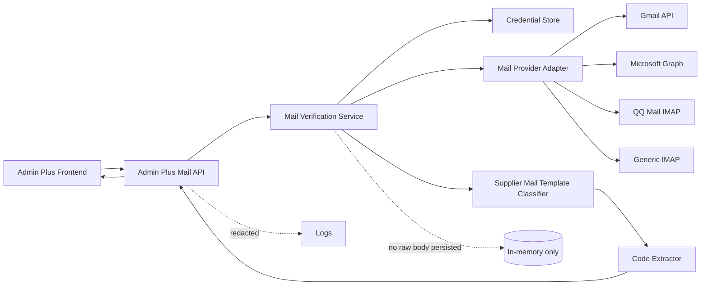
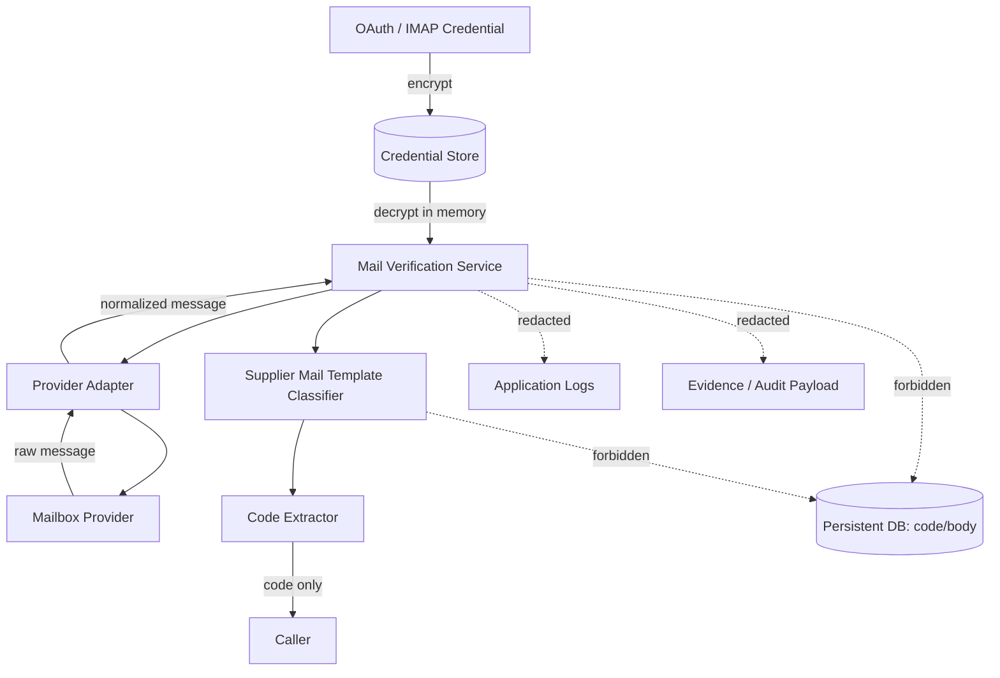
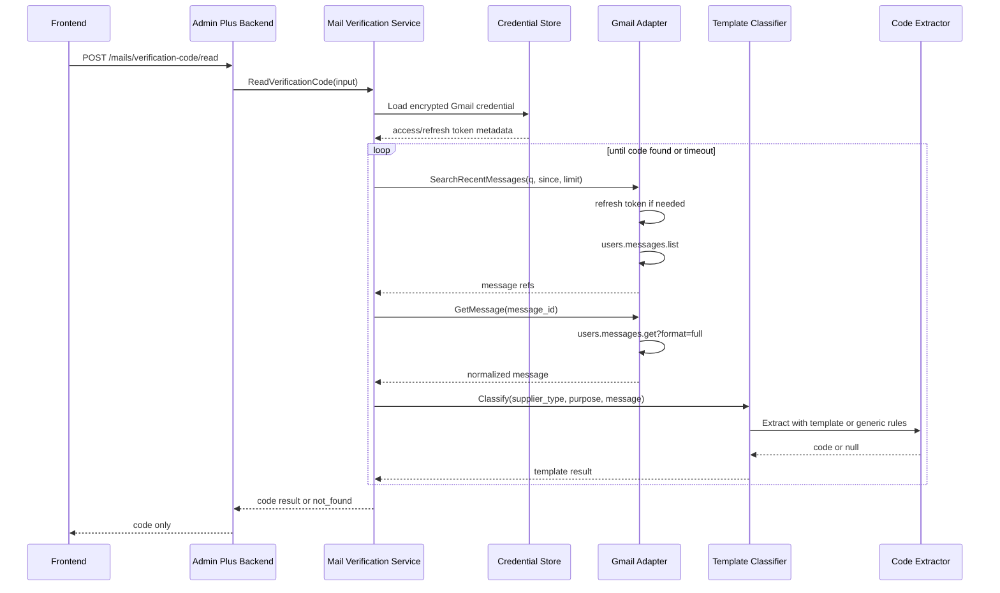
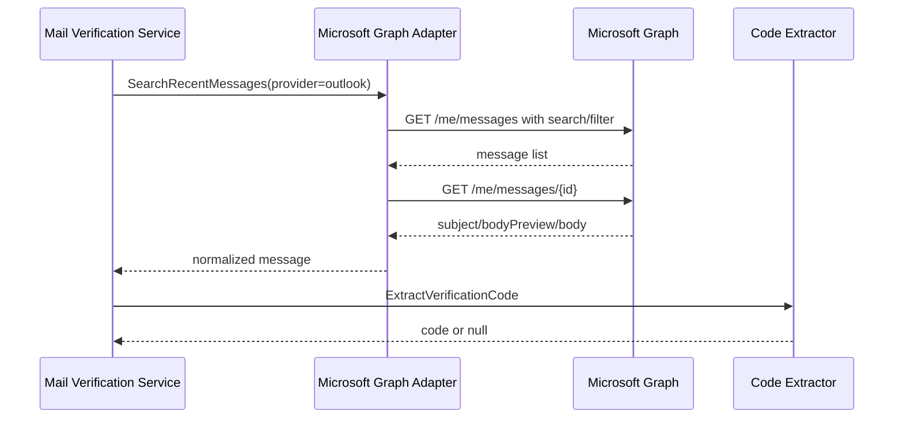
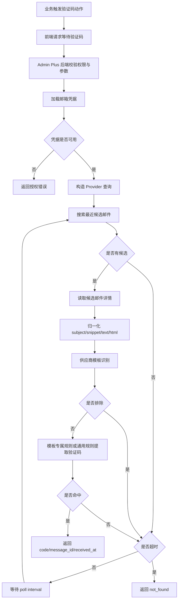
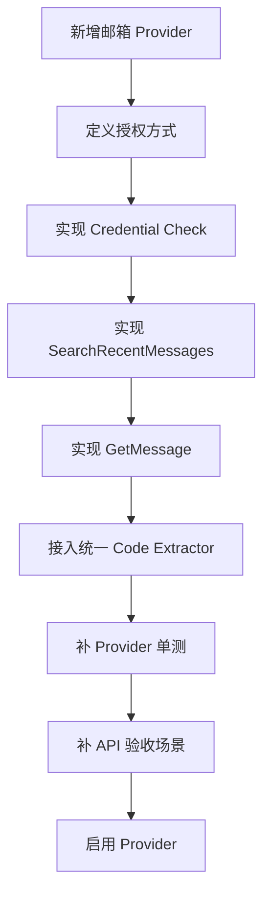
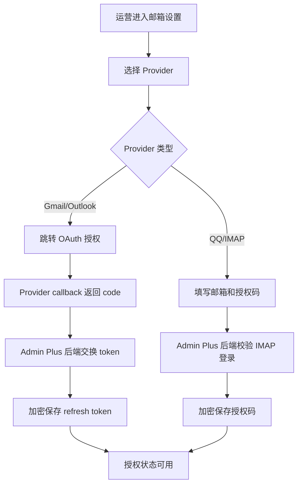

# 邮箱验证码读取能力 Roadmap

版本：v0.1.0
日期：2026-06-25
状态：Gmail v1 已落地，后续扩展待办
范围：用户本人授权邮箱的验证码读取、最近邮件搜索、正文解析、验证码提取、Provider Adapter 扩展，以及 Gmail、Hotmail/Outlook、QQ 邮箱、通用 IMAP 的分阶段接入。

## 目录

1. 背景
2. 设计结论
3. 目标与收益
4. 用户角色
5. 范围与合规边界
6. 用户用例
7. 用户故事
8. 功能需求
9. 非功能需求
10. 总体架构
11. Provider Adapter 设计
12. Gmail v1 方案
13. Hotmail/Outlook 扩展方案
14. QQ 邮箱扩展方案
15. 通用 IMAP 扩展方案
16. API 设计
17. 凭据与数据边界
18. 核心时序图
19. 核心流程图
20. 错误码与失败处理
21. 安全、隐私与审计
22. 测试用例
23. 验收标准
24. 分阶段实施计划
25. 外部参考

## 1. 背景

Admin Plus 的供应商自动注册、后端直登和账号开通流程会遇到邮箱验证码场景。当前人工处理验证码会中断自动化链路，尤其在批量注册候选站点、触发供应商登录验证或补充账号安全验证时，运营需要手动打开邮箱、搜索邮件、复制验证码，再回到业务页面继续操作。

需要新增一个“小而明确”的邮箱验证码读取能力：

- 用户完成邮箱授权。
- 系统在触发验证码动作后短时间等待。
- 后端搜索最近验证码邮件。
- 后端读取候选邮件正文。
- 后端提取验证码。
- 只把验证码返回给当前业务流程。

这个能力第一版从 Gmail 开始，但不能把架构写死为 Gmail。未来还要支持 Hotmail/Outlook、`mail.qq.com`、企业邮箱和通用 IMAP。

本方案参考 EmailEngine 的 Gmail 请求封装、OAuth token refresh、scope 检查、historyId 增量同步和 watch/fallback polling 思路，但不引入 EmailEngine 的 Redis 全量状态机、worker 架构、license、完整邮箱同步和多租户邮件镜像能力。

## 2. 设计结论

1. 邮箱验证码读取必须由 Admin Plus 后端服务层统一处理，前端不能直接读取 Gmail、Outlook、QQ 邮箱或 IMAP。
2. 第一版只实现 Gmail + OAuth + 轮询，不上 Gmail Pub/Sub watch/history。
3. 第一版只读取最近验证码邮件，不做完整邮箱同步。
4. Provider Adapter 必须抽象为统一接口，避免 Gmail 逻辑散落到业务服务中。
5. 验证码只作为短生命周期返回值，不落库、不进日志、不进入 evidence、不写入审计 payload。
6. OAuth token、refresh token、IMAP 授权码必须走现有 credential store 或后续统一 Mail Credential Store，加密保存。
7. 邮件正文默认只在内存中解析，解析后立即丢弃。
8. 调用方只能拿到 `{ code, message_id, received_at, provider }` 和可选的非敏感模板分类结果，不能拿到完整邮件正文。
9. 超时返回 `not_found`，不把“未找到验证码”当作系统异常。
10. 注册自动化默认一次只执行一个注册任务；后端仍必须用任务 lease 和短期 `message_id -> claim_key` 占用防止同一封验证码邮件被不同任务重复消费。
11. 合规边界必须明确：只支持用户本人授权邮箱，不支持批量收码、第三方账号接管、绕过登录和非授权邮箱访问。
12. 后续需要秒级到达或多账号监听时，再引入 Gmail watch/history、Microsoft Graph webhook 或 IMAP IDLE。

## 3. 目标与收益

目标：

1. 为供应商自动注册和登录验证提供统一的邮箱验证码读取能力。
2. 降低运营在邮箱和 Admin Plus 之间来回切换的成本。
3. 为 Gmail、Outlook、QQ 邮箱、IMAP 预留统一扩展点。
4. 保持第一版实现足够小，避免提前引入完整邮箱同步系统。
5. 明确验证码、邮件正文和邮箱凭据的安全边界。

收益：

- 注册任务可以从“等待人工复制验证码”升级为“系统等待验证码并自动回填”。
- 后续新增邮箱 Provider 时只补 Adapter，不重写业务流程。
- 敏感数据处理路径可审计、可测试、可约束。
- 避免把邮箱能力误做成全量邮件系统。

## 4. 用户角色

| 角色 | 关注点 | 典型操作 |
|------|--------|----------|
| 运营 | 自动注册、登录验证、失败重试 | 授权邮箱、触发等待验证码、查看验证码读取状态 |
| 管理员 | Provider 配置、安全边界、凭据治理 | 配置 Gmail OAuth、启用 Outlook/IMAP Provider、查看授权状态 |
| 技术排障人员 | API 失败、scope 不足、邮件解析失败 | 查看错误码、排查 Provider Adapter、跑单测 |
| 合规/安全人员 | 邮箱授权、验证码处理、日志脱敏 | 审核 scope、确认验证码不落库、不出日志 |

## 5. 范围与合规边界

系统支持：

- 用户本人授权的 Gmail。
- 用户本人授权的 Hotmail/Outlook。
- 用户本人配置授权码的 QQ 邮箱。
- 用户本人配置 IMAP 授权信息的邮箱。
- 触发业务动作后短时间读取最近验证码邮件。
- 从主题、snippet、text/plain、text/html 中提取验证码。
- 返回验证码和最小邮件元数据。

系统不支持：

- 未授权邮箱读取。
- 批量收码平台。
- 绕过第三方登录、风控或身份验证。
- 第三方账号接管。
- 长期保存邮件正文。
- 全量邮箱同步、搜索、归档和附件下载。
- 把验证码写入日志、evidence、任务结果持久化字段。

## 6. 用户用例

| 用例 ID | 用例 | 触发者 | 前置条件 | 成功结果 |
|---------|------|--------|----------|----------|
| UC-01 | 授权 Gmail | 运营 | Gmail OAuth 配置可用 | 系统保存加密 refresh token，并标记 Gmail 可用 |
| UC-02 | 等待 Gmail 验证码 | 运营/注册任务 | 已授权 Gmail，已触发验证码邮件 | 返回验证码和邮件元数据 |
| UC-03 | Gmail 超时未找到验证码 | 运营/注册任务 | 已授权 Gmail，邮件未到达或关键词不匹配 | 返回 `not_found` |
| UC-04 | Gmail scope 不足 | 运营 | 授权 scope 不含 `gmail.readonly` | 返回 `mail_scope_insufficient` |
| UC-05 | Outlook 读取验证码 | 运营/注册任务 | 已授权 Microsoft Graph `Mail.Read` | 返回验证码和邮件元数据 |
| UC-06 | QQ 邮箱读取验证码 | 运营/注册任务 | 已配置 QQ 邮箱 IMAP 授权码 | 返回验证码和邮件元数据 |
| UC-07 | 取消等待 | 运营/系统 | 请求上下文取消或任务取消 | 轮询停止，不继续请求邮箱 Provider |
| UC-08 | Provider API 限流 | 系统 | 邮箱服务返回 429 | 返回可重试错误和建议退避 |

## 7. 用户故事

1. 作为运营，我希望在注册第三方供应商账号时不用手动打开 Gmail 搜索验证码，以便注册任务可以自动继续。
2. 作为运营，我希望验证码等待有明确超时结果，以便知道是邮件没到还是系统异常。
3. 作为管理员，我希望邮箱 Provider 统一接入，以便后续可以从 Gmail 扩展到 Outlook、QQ 邮箱和 IMAP。
4. 作为安全人员，我希望验证码不落库、不打日志，以便降低敏感数据泄露风险。
5. 作为技术排障人员，我希望 Provider 错误有稳定错误码，以便快速区分授权失败、scope 不足、限流和解析失败。
6. 作为后续实现者，我希望业务服务不直接依赖 Gmail API，以便新增 Provider 时不改注册流程。

## 8. 功能需求

### 8.1 邮箱授权

- Gmail 使用 OAuth 2.0。
- Gmail v1 scope 固定为 `https://www.googleapis.com/auth/gmail.readonly`。
- Outlook/Hotmail 使用 Microsoft identity platform OAuth 2.0 和 Microsoft Graph delegated `Mail.Read`。
- QQ 邮箱第一阶段按 IMAP 授权码接入，不要求 OAuth。
- 通用 IMAP 支持 host、port、TLS、username、授权码或专用密码。

### 8.2 验证码读取

- 输入 Provider、账号标识、搜索关键词、发件人过滤、触发时间、超时时间。
- 后端按 Provider 搜索最近邮件。
- 对候选邮件读取详情。
- 从 subject、snippet/bodyPreview、text/plain、text/html 中提取验证码。
- 如果调用方知道目标供应商类型，应传入 `supplier_type`，用于启用供应商邮件模板识别。
- 只接受触发窗口内的邮件，默认最近 10 分钟。
- 超时默认 60 秒，可配置到 120 秒。
- 默认轮询间隔 3 秒，失败可退避到 5-10 秒。

### 8.3 验证码提取

提取逻辑不能只依赖一个宽松正则，必须组合语言、上下文和长度约束。

推荐规则：

```text
中文上下文：验证码、校验码、动态码 后 4-8 位数字
英文上下文：verification code、security code、login code 后 4-8 位数字
兜底：独立 6 位数字
过滤：过旧邮件、退订页、长订单号、金额、日期、手机号
```

### 8.4 供应商邮件模板识别

需要针对供应商类型做邮件模板识别，但它是验证码提取的高置信增强层，不是邮箱 Provider 适配层。邮箱 Provider 负责 Gmail/Outlook/QQ/IMAP 的读取；供应商模板识别负责判断“这封邮件是否像 sub2api/new-api 发出的验证码邮件”。

第一阶段重点支持：

| 供应商类型 | 来源事实 | 主题特征 | 正文特征 | 验证码形态 | 说明 |
|------------|----------|----------|----------|------------|------|
| `new_api` | `/Users/coso/Documents/dev/go/new-api` | `{SystemName}邮箱验证邮件` | `您好，你正在进行{SystemName}邮箱验证。`、`您的验证码为:`、`验证码 {n} 分钟内有效` | 6 位数字 | 邮箱验证是数字验证码；密码重置是链接 token，不能当验证码返回 |
| `sub2api` | `/Users/coso/Documents/dev/go/sub2api` | `[{site_name}] Email Verification Code`、`[{site_name}] Email verification code`、`[{site_name}] 邮箱验证码` | `Your verification code is:`、`您的验证码是：`、大号居中数字验证码、`expires in`/`分钟后失效` | 6 位数字 | 同时覆盖 legacy 模板和 notification email 官方模板 |
| `sub2api_notify` | `/Users/coso/Documents/dev/go/sub2api` | `[{site_name}] 通知邮箱验证码 / Notification Email Verification`、`[{site_name}] Notification email verification code` | `通知邮箱验证码`、`Notification Email Verification`、`Your verification code is:` | 6 位数字 | 用于额外通知邮箱绑定，不应和注册验证码混淆 |

识别流程：

1. 调用方传入 `supplier_type`、`site_name`、`expected_purpose`、`triggered_at`。
2. Mail Verification Service 先用邮箱 Provider 搜索候选邮件。
3. Template Classifier 对候选邮件计算模板匹配分数。
4. 高置信模板命中时，优先使用模板专属提取规则。
5. 未命中模板时，回退通用 Code Extractor。
6. 如果命中密码重置、充值、订单、订阅、通知类非验证码模板，则降低优先级或直接排除。

模板识别输入建议：

```json
{
  "supplier_type": "new_api",
  "expected_purpose": "registration",
  "site_name": "Example API"
}
```

模板识别输出建议：

```json
{
  "template_family": "new_api.email_verification",
  "confidence": 0.94,
  "purpose": "registration",
  "code": "123456"
}
```

模板识别原则：

- `supplier_type` 只影响候选排序和提取置信度，不能绕过时间窗口、发件人和授权边界。
- 供应商模板规则应配置化或集中注册，不散落在 Gmail/IMAP Adapter 中。
- 邮件正文中出现 password reset、密码重置、reset_url、订单号、充值金额时，不应被 6 位兜底规则优先命中。
- 后续新增供应商类型时，只新增模板 family，不修改邮箱 Provider。

### 8.5 返回结果

成功返回：

```json
{
  "provider": "gmail",
  "code": "123456",
  "message_id": "18f0...",
  "received_at": "2026-06-25T10:30:00Z"
}
```

超时返回：

```json
{
  "provider": "gmail",
  "status": "not_found",
  "message": "verification code was not found before timeout"
}
```

## 9. 非功能需求

| 类型 | 要求 |
|------|------|
| 安全 | OAuth token、refresh token、IMAP 授权码加密保存 |
| 隐私 | 邮件正文只在内存解析，不落库 |
| 日志 | 日志不得出现验证码、邮件正文、access token、refresh token、授权码 |
| 性能 | 单次读取默认最多检查 10 封候选邮件 |
| 可靠性 | 支持 context cancel，避免任务取消后继续轮询 |
| 可扩展 | Provider Adapter 层隔离 Gmail、Graph、IMAP 差异；Template Classifier 层隔离 sub2api/new-api 等供应商模板差异 |
| 可测试 | 邮件解析、模板识别、验证码提取、Provider API 错误都必须可单测 |

## 10. 总体架构



职责划分：

| 模块 | 职责 | 不负责 |
|------|------|--------|
| Frontend | 发起等待验证码请求、展示状态 | 直接访问邮箱 API、保存 token |
| Admin Plus Mail API | 参数校验、鉴权、调用服务、返回结果 | 邮件正文解析细节 |
| Mail Verification Service | 轮询、Provider 编排、超时、取消 | Provider 私有协议 |
| Credential Store | 加密保存 OAuth/IMAP 凭据 | 保存验证码 |
| Provider Adapter | 搜索邮件、读取邮件、解析 Provider wire format | 业务流程编排 |
| Supplier Mail Template Classifier | 按 sub2api/new-api 等供应商模板识别邮件用途和置信度 | 访问邮箱 API、保存正文 |
| Code Extractor | 从文本中提取验证码 | 请求邮箱 Provider |

## 11. Provider Adapter 设计

统一接口建议：

```go
type MailVerificationProvider interface {
    Provider() string
    CheckCredential(ctx context.Context, credential MailCredential) error
    SearchRecentMessages(ctx context.Context, input SearchMessagesInput) ([]MailMessageRef, error)
    GetMessage(ctx context.Context, credential MailCredential, messageID string) (*MailMessage, error)
}
```

核心类型建议：

```go
type SearchMessagesInput struct {
    Credential MailCredential
    Query string
    From string
    Since time.Time
    Limit int
}

type MailMessage struct {
    ID string
    Subject string
    Snippet string
    Text string
    HTML string
    ReceivedAt time.Time
}
```

供应商模板分类接口建议：

```go
type SupplierMailTemplateClassifier interface {
    Classify(ctx context.Context, input MailTemplateClassifyInput) (*MailTemplateClassifyResult, error)
}

type MailTemplateClassifyInput struct {
    SupplierType string
    ExpectedPurpose string
    SiteName string
    Message MailMessage
}

type MailTemplateClassifyResult struct {
    TemplateFamily string
    Purpose string
    Confidence float64
    Code string
    Excluded bool
    ExcludeReason string
}
```

分类器必须集中注册模板 family，例如：

| Template Family | Supplier Type | Purpose | 说明 |
|-----------------|---------------|---------|------|
| `new_api.email_verification` | `new_api` | `registration`/`email_bind` | 匹配 new-api 邮箱验证邮件 |
| `new_api.password_reset` | `new_api` | `password_reset` | 链接 token 邮件，验证码读取时排除 |
| `sub2api.auth_verify_code` | `sub2api` | `registration`/`email_bind`/`totp` | 匹配 sub2api 登录/注册/绑定验证码 |
| `sub2api.notify_verify_code` | `sub2api` | `notify_email_bind` | 匹配 sub2api 额外通知邮箱验证码 |
| `sub2api.password_reset` | `sub2api` | `password_reset` | 链接 token 邮件，验证码读取时排除 |

Provider 差异收敛：

| Provider | 搜索方式 | 正文读取 | 授权方式 | v1 策略 |
|----------|----------|----------|----------|---------|
| Gmail | `users.messages.list?q=...` | `users.messages.get?format=full` | OAuth `gmail.readonly` | 首发 |
| Outlook/Hotmail | Microsoft Graph messages + `$search`/`$filter` | Graph message body/bodyPreview | OAuth `Mail.Read` | v2 |
| QQ 邮箱 | IMAP SEARCH | IMAP FETCH BODY | 授权码/专用密码 | v2/v3 |
| 通用 IMAP | IMAP SEARCH | IMAP FETCH BODY | 授权码/密码 | v3 |

## 12. Gmail v1 方案

### 12.1 Scope

必须使用：

```text
https://www.googleapis.com/auth/gmail.readonly
```

不能使用 `gmail.metadata` 作为验证码读取 scope，因为该 scope 不能读取正文，且 Gmail `messages.list` 的 `q` 参数不能在 metadata scope 下使用。

### 12.2 搜索请求

默认搜索语法：

```text
newer_than:1d in:anywhere (验证码 OR verification code OR code)
```

如果调用方传入发件人：

```text
newer_than:1d in:anywhere from:example.com (验证码 OR verification code OR code)
```

请求：

```text
GET https://gmail.googleapis.com/gmail/v1/users/me/messages?q=...&maxResults=10&includeSpamTrash=false
Authorization: Bearer <access_token>
```

### 12.3 详情请求

```text
GET https://gmail.googleapis.com/gmail/v1/users/me/messages/{message_id}?format=full
Authorization: Bearer <access_token>
```

解析字段：

- `payload.headers`: subject、from、date。
- `payload.parts`: text/plain、text/html。
- `snippet`: 兜底文本。
- `internalDate`: 接收时间判断。

### 12.4 Gmail 正文解析

Gmail body data 使用 base64url 编码。解析规则：

1. 深度遍历 `payload.parts`。
2. 优先收集 `text/plain`。
3. 再收集 `text/html` 并转纯文本。
4. 最后拼接 subject 和 snippet。
5. 对超大正文设置最大解析字节数，避免内存膨胀。

## 13. Hotmail/Outlook 扩展方案

Hotmail 和 Outlook 使用 Microsoft Graph。

建议授权：

```text
Mail.Read
offline_access
openid profile email
```

读取策略：

- 使用 delegated permission，只读取当前授权用户邮箱。
- 优先使用 Graph message list 的过滤或搜索能力定位最近邮件。
- 读取字段包括 `subject`、`bodyPreview`、`body`、`receivedDateTime`、`from`。
- 默认只读取 Inbox 和必要文件夹，后续再支持 Junk/All mail 类语义。

注意事项：

- Graph `$search`、`$filter`、排序组合存在限制，Adapter 内部必须隔离这些差异。
- Graph 返回 HTML body 时必须转纯文本后提取验证码。
- Graph 限流要映射为统一 `mail_provider_rate_limited`。

## 14. QQ 邮箱扩展方案

QQ 邮箱优先通过 IMAP 授权码接入。

前置条件：

- 用户在 QQ 邮箱设置中启用 IMAP/SMTP 服务。
- 用户生成授权码。
- Admin Plus 加密保存邮箱地址、授权码、IMAP host、port、TLS 设置。

默认连接：

```text
imap.qq.com:993 TLS
```

读取策略：

1. 登录 IMAP。
2. 选择 `INBOX`。
3. 按时间和关键词搜索最近邮件。
4. FETCH 候选邮件 RFC822 或 BODYSTRUCTURE。
5. 解析 MIME、HTML、text/plain。
6. 提取验证码。

注意事项：

- QQ 邮箱不是 OAuth-first，不要套 Gmail OAuth 模型。
- 授权码等同敏感凭据，必须加密保存。
- 中文邮件编码、GBK/GB18030、quoted-printable、base64 MIME 都需要解析。

## 15. 通用 IMAP 扩展方案

通用 IMAP 用于企业邮箱、域名邮箱和其他个人邮箱。

配置项：

| 字段 | 说明 |
|------|------|
| `host` | IMAP 服务地址 |
| `port` | 默认 993 |
| `tls` | 是否启用 TLS |
| `username` | 邮箱账号 |
| `secret` | 授权码或专用密码 |
| `mailbox` | 默认 `INBOX` |

实现要求：

- 连接超时默认 10 秒。
- 搜索和 FETCH 总超时纳入请求总超时。
- MIME 解析必须复用成熟库，不手写完整 MIME parser。
- Provider 不暴露邮件正文给业务层以外的调用方。

## 16. API 设计

### 16.1 读取验证码

推荐 REST API：

```text
POST /api/v1/admin-plus/mails/verification-code/read
```

请求：

```json
{
  "provider": "gmail",
  "credential_id": "gmail-primary",
  "supplier_type": "new_api",
  "expected_purpose": "registration",
  "site_name": "Example API",
  "from": "noreply@example.com",
  "keywords": ["验证码", "verification code"],
  "triggered_at": "2026-06-25T10:30:00Z",
  "timeout_seconds": 60,
  "poll_interval_seconds": 3
}
```

成功响应：

```json
{
  "code": 0,
  "message": "success",
  "data": {
    "provider": "gmail",
    "code": "123456",
    "message_id": "18f0...",
    "received_at": "2026-06-25T10:30:12Z",
    "template_family": "new_api.email_verification",
    "confidence": 0.94
  }
}
```

超时响应：

```json
{
  "code": 404,
  "reason": "MAIL_VERIFICATION_CODE_NOT_FOUND",
  "message": "verification code was not found before timeout"
}
```

### 16.2 授权状态

```text
GET /api/v1/admin-plus/mails/providers
GET /api/v1/admin-plus/mails/credentials
POST /api/v1/admin-plus/mails/credentials/:id/check
```

第一版可以只实现验证码读取依赖的最小凭据查询；Provider 管理页后续再补。

## 17. 凭据与数据边界



持久化允许：

- Provider 类型。
- 邮箱账号脱敏标识。
- OAuth refresh token 密文。
- IMAP 授权码密文。
- 授权 scope。
- token 过期时间。
- 最近检查状态和错误码。
- 模板 family、purpose、confidence 这类非敏感分类结果。

持久化禁止：

- 验证码明文。
- 邮件正文。
- 完整邮件 HTML。
- access token 明文。
- refresh token 明文。
- IMAP 授权码明文。

## 18. 核心时序图

### 18.1 Gmail 验证码读取



### 18.2 Outlook/Hotmail 后续读取



## 19. 核心流程图

### 19.1 读取验证码流程



### 19.2 Provider 扩展流程



### 19.3 用户授权流程



## 20. 错误码与失败处理

| Reason | HTTP | 说明 | 调用方处理 |
|--------|------|------|------------|
| `MAIL_CREDENTIAL_REQUIRED` | 400 | 未选择或未配置邮箱凭据 | 引导授权 |
| `MAIL_PROVIDER_UNSUPPORTED` | 400 | Provider 未支持 | 隐藏入口或提示暂不支持 |
| `MAIL_CREDENTIAL_INVALID` | 401 | token/授权码失效 | 重新授权 |
| `MAIL_SCOPE_INSUFFICIENT` | 403 | OAuth scope 不足 | 重新授权并申请正确 scope |
| `MAIL_PROVIDER_RATE_LIMITED` | 429 | 邮箱 Provider 限流 | 退避重试 |
| `MAIL_PROVIDER_UNAVAILABLE` | 503 | Provider 临时不可用 | 稍后重试 |
| `MAIL_MESSAGE_PARSE_FAILED` | 502 | 邮件结构无法解析 | 记录脱敏错误并继续候选 |
| `MAIL_VERIFICATION_CODE_NOT_FOUND` | 404 | 超时未找到验证码 | 允许人工输入或重试 |
| `MAIL_VERIFICATION_CANCELLED` | 499 | 请求取消 | 停止轮询 |

失败策略：

- 单封邮件解析失败不终止整体轮询，继续下一个候选。
- token 过期优先 refresh，refresh 失败才返回授权错误。
- 429 按 Provider 返回的 retry-after 退避。
- 5xx 不无限重试，受总超时控制。
- `not_found` 不记录为系统错误。

## 21. 安全、隐私与审计

安全要求：

- 后端统一封装邮箱 API，不开放前端直连邮箱 API。
- 凭据密文保存，解密只发生在请求上下文内。
- access token 只在内存中使用。
- 邮件正文解析后立即释放，不进入持久层。
- 返回给前端的只有验证码和最小元数据。
- 同一封邮件的 `message_id` 只允许当前业务 claim 复用，不允许被其他注册任务重复消费。
- 注册任务读码必须带任务 lease、注册邮箱和触发时间窗口，避免错读旧邮件或其他任务的邮件。

日志要求：

- 日志中禁止出现验证码。
- 日志中禁止出现邮件正文。
- 日志中禁止出现 OAuth token、refresh token、IMAP 授权码。
- 错误日志只记录 Provider、错误码、HTTP 状态和 request_id。

审计要求：

- 可以记录“谁发起了等待验证码”。
- 可以记录 Provider、credential_id、成功/失败状态、耗时。
- 不记录验证码内容。
- 不记录邮件正文。
- 不记录完整收件箱搜索结果。

合规声明：

- 仅支持用户本人授权邮箱。
- 不提供批量收码能力。
- 不提供绕过第三方平台登录验证能力。
- 不为第三方账号接管提供工具链。

## 22. 测试用例

### 22.1 Code Extractor

| 场景 | 输入 | 期望 |
|------|------|------|
| 中文验证码 | `您的验证码是 123456` | `123456` |
| 中文校验码 | `校验码：987654，有效期5分钟` | `987654` |
| 英文 verification code | `Your verification code is 123456` | `123456` |
| 英文 security code | `Security code: 123456` | `123456` |
| 独立 6 位兜底 | `Use 654321 to continue` | `654321` |
| 金额过滤 | `支付金额 123456.00` | 不命中或低优先级 |
| 日期过滤 | `2026-06-25 12:34:56` | 不命中 |
| 手机号过滤 | `13800138000` | 不命中 |

### 22.2 Gmail Adapter

- `messages.list` 请求包含 `q`、`maxResults`、`includeSpamTrash=false`。
- `gmail.metadata` scope 不作为正文读取 scope。
- `messages.get` 使用 `format=full`。
- base64url body 正确解码。
- multipart 嵌套邮件能提取 text/plain。
- 只有 HTML 正文时能转纯文本。
- `internalDate` 早于触发窗口时跳过。
- 401 触发 refresh，refresh 成功后重试。
- refresh 失败返回 `MAIL_CREDENTIAL_INVALID`。
- 429 映射 `MAIL_PROVIDER_RATE_LIMITED`。

### 22.3 Supplier Template Classifier

- `new_api.email_verification` 能从主题 `{SystemName}邮箱验证邮件` 和正文 `您的验证码为:` 提取 6 位数字。
- `new_api.password_reset` 命中 `{SystemName}密码重置`、`/user/reset?email=...&token=...` 时必须排除，不返回 UUID/token。
- `sub2api.auth_verify_code` 能识别 `[{site_name}] Email Verification Code`、`[{site_name}] Email verification code`、`[{site_name}] 邮箱验证码`。
- `sub2api.auth_verify_code` 能从 `Your verification code is:` 和 `您的验证码是：` 附近提取 6 位数字。
- `sub2api.notify_verify_code` 能识别 `通知邮箱验证码 / Notification Email Verification`，并只在 `expected_purpose=notify_email_bind` 时优先。
- `sub2api.password_reset` 命中 password reset / 密码重置模板时必须排除。
- 未传 `supplier_type` 时，模板分类器不应阻塞通用 Code Extractor。
- 模板命中但邮件早于 `triggered_at` 时仍必须跳过。

### 22.4 Service

- 超时返回 `MAIL_VERIFICATION_CODE_NOT_FOUND`。
- context cancel 停止轮询。
- 候选邮件解析失败时继续处理下一封。
- 命中第一封邮件后立即返回，不继续轮询。
- 返回体不包含邮件正文。
- 日志脱敏测试覆盖验证码、token、授权码。
- 返回体可包含 `template_family` 和 `confidence`，但不能包含模板命中的原始正文片段。

### 22.5 Outlook/QQ/IMAP 后续

- Graph bodyPreview/body 归一化。
- Graph 429/503 映射统一错误码。
- IMAP 登录失败映射 `MAIL_CREDENTIAL_INVALID`。
- IMAP MIME 编码、quoted-printable、base64、HTML-only 邮件可解析。

## 23. 验收标准

第一阶段 Gmail v1 验收：

1. 已授权 Gmail 后，触发验证码邮件 60 秒内可读取验证码。
2. 支持中文和英文验证码邮件。
3. 支持 text/plain、text/html、multipart 邮件。
4. 超时返回 `not_found`，前端可提示人工输入或重试。
5. Gmail token 过期时可 refresh。
6. scope 不足时有明确错误。
7. 验证码不出现在日志、审计 payload、任务结果持久化字段。
8. 单测覆盖验证码提取、供应商模板识别、Gmail payload 解析、轮询超时和错误码映射。
9. 业务调用方不直接依赖 Gmail API 类型。
10. `sub2api` 和 `new_api` 的验证码邮件模板被高置信识别，密码重置链接邮件不会被当作验证码邮件返回。
11. 同一 `message_id` 被一个注册任务占用后，其他注册任务不会重复消费；同一任务重试可继续读取同一封邮件。

Provider 扩展验收：

1. 新 Provider 只需要实现 Adapter 和凭据校验。
2. 业务调用 API 不因 Provider 变化而变化。
3. Outlook、QQ、IMAP 都复用统一 Code Extractor。
4. Provider 私有错误映射到统一错误码。

## 24. 分阶段实施计划

### Phase 0：文档与边界

- 完成本文档。
- 明确合规边界和敏感数据禁止持久化规则。
- 确认 Gmail v1 不引入 Pub/Sub 和 history 增量同步。

### Phase 1：Gmail 轮询 MVP

- 新增 Mail Verification Service。
- 新增 Gmail Provider Adapter。
- 接入 OAuth credential store。
- 实现验证码提取器。
- 暴露读取验证码 API。
- 接入供应商注册或登录验证链路的“等待验证码”动作。

### Phase 2：Provider 管理与 Outlook

- 新增邮箱 Provider 管理页。
- 支持 Microsoft Graph OAuth。
- 接入 Hotmail/Outlook 读取验证码。
- 补充 Graph 限流和错误映射。

### Phase 3：QQ 邮箱与通用 IMAP

- 支持 QQ 邮箱 IMAP 授权码。
- 支持通用 IMAP 配置。
- 引入成熟 MIME 解析库。
- 完善中文编码和 HTML-only 邮件解析。

### Phase 4：事件驱动增强

仅在需要多账号监听或秒级到达时实施：

- Gmail `users.watch` + Pub/Sub。
- Gmail `users.history.list` 增量处理。
- Microsoft Graph webhook。
- IMAP IDLE。
- fallback polling。
- watch 续期和丢通知补偿。

## 25. 外部参考

- Gmail messages.list: https://developers.google.com/workspace/gmail/api/reference/rest/v1/users.messages/list
- Gmail messages.get: https://developers.google.com/workspace/gmail/api/reference/rest/v1/users.messages/get
- Gmail scopes: https://developers.google.com/workspace/gmail/api/auth/scopes
- Gmail users.watch: https://developers.google.com/workspace/gmail/api/reference/rest/v1/users/watch
- Gmail Push Notifications: https://developers.google.com/workspace/gmail/api/guides/push
- Microsoft Graph list messages: https://learn.microsoft.com/en-us/graph/api/user-list-messages
- Microsoft Graph message resource: https://learn.microsoft.com/en-us/graph/api/resources/message
- Microsoft Graph `$search`: https://learn.microsoft.com/en-us/graph/search-query-parameter
- EmailEngine Gmail implementation: https://github.com/postalsys/emailengine/blob/master/lib/email-client/gmail-client.js
