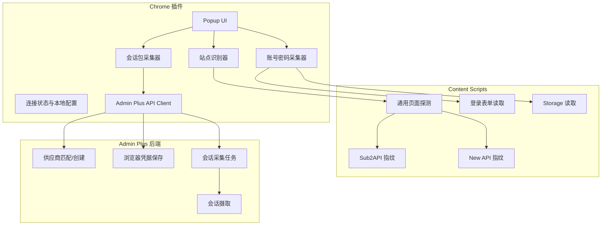
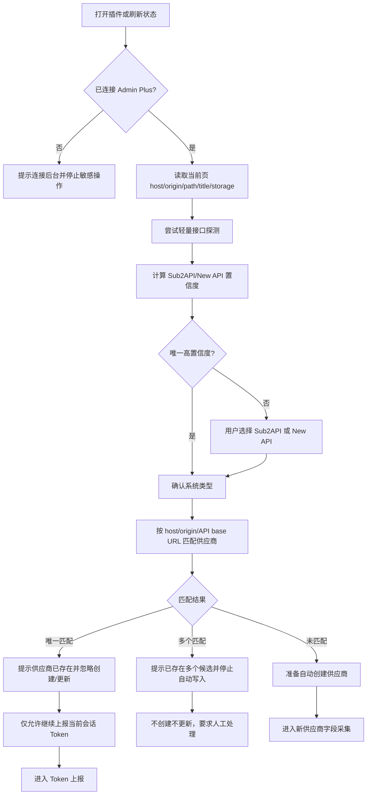
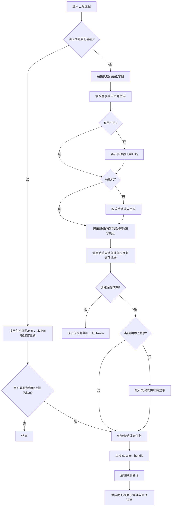
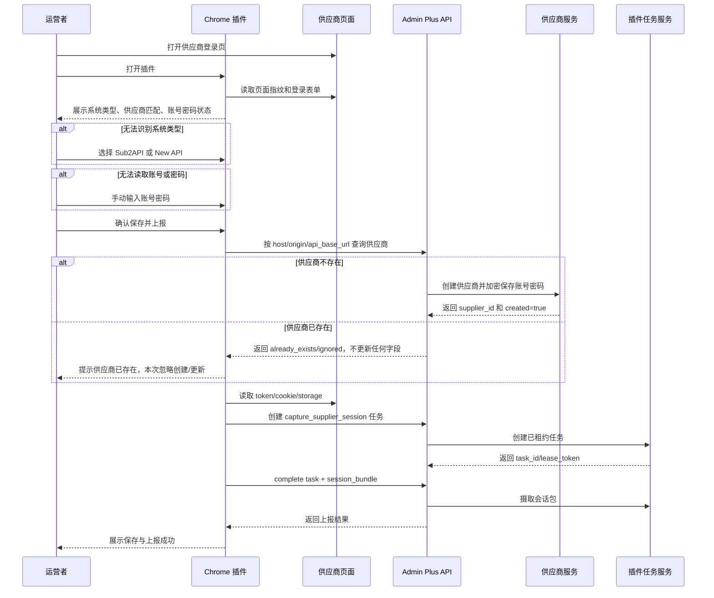
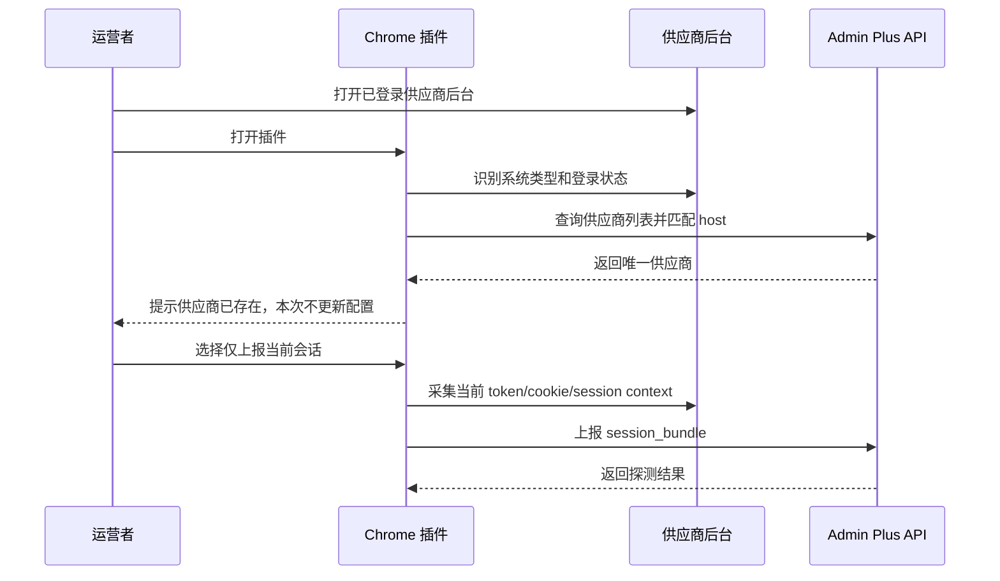
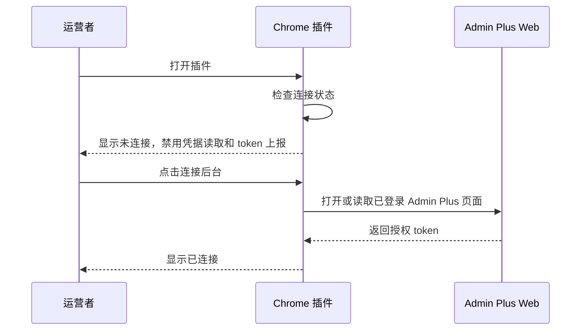

# Chrome 插件账号凭据与 Token 上报路线图

版本：v0.1.0
日期：2026-06-25
状态：需求与技术方案草案
关联事实源：`docs/roadmap/Chrome/README.md`、`extension/README.md`

## 目录

1. 背景
2. 目标与收益
3. 设计结论
4. 范围与边界
5. 角色与核心概念
6. 用户故事
7. 用户用例
8. 总体架构图
9. 模块架构图
10. 自动识别流程图
11. 凭据保存与 Token 上报流程图
12. 时序图
13. 功能需求
14. 识别规则
15. 数据与接口草案
16. UI 与交互要求
17. 安全与合规
18. 测试计划
19. 验收标准
20. 风险与处理
21. 实施拆解

## 1. 背景

当前 Admin Plus 已具备供应商列表、浏览器登录凭据展示、Chrome 插件会话上报和后端会话摄取能力。供应商列表中已经可以看到采集凭据来源、账号、密码配置状态和一键登录入口。现有插件主路径是“识别当前供应商网站并上报当前会话包”，后端再使用会话包调用供应商内部 API 完成余额、费率、账单等采集。

新的需求是在插件侧增加“账号密码采集/补录”能力：

- 运营者打开供应商登录页或后台页时，插件自动判断当前程序类型是 Sub2API 还是 New API。
- 插件尽量读取当前登录页的用户名和密码；无法读取时要求用户手动输入。
- 识别失败时让用户选择系统类型。
- 插件将采集到的供应商基础信息、账号密码和临时 Token 保存到 Admin Plus 供应商列表。
- 上报时如果当前站点已经存在供应商，插件不更新、不覆盖任何字段，只提示用户“供应商已存在，本次已忽略创建/更新”。
- 保存凭据后继续上报当前浏览器 token、cookie 和会话上下文。

用户提到的两个本地程序目录：

- `/Users/coso/Documents/dev/go/sub2api`
- `/Users/coso/Documents/dev/go/new-api`

这两个目录作为识别规则和测试夹具的参考实现来源。普通 Chrome MV3 插件不能直接读取本机任意文件目录；如果要真正读取这些目录，需要 Native Messaging 本地助手或后端本机指纹服务。本路线图 v1 不引入本地助手，采用“页面/API/storage 指纹识别优先，无法判断则用户选择”的方案。

## 2. 目标与收益

目标：

- 插件在供应商登录页或后台页自动识别 Sub2API / New API。
- 插件可以在可行时读取页面中的用户名、密码和登录状态。
- 无法自动读取时，插件提供手动输入账号密码入口。
- 插件根据当前站点匹配已有供应商；没有匹配时自动创建供应商。
- 已有供应商一律忽略创建和更新，不覆盖名称、类型、URL、账号、密码、余额、状态等字段。
- 插件把账号密码和临时 Token 写入新建供应商的浏览器登录凭据。
- 插件保存凭据后继续上报当前会话 token。
- 供应商列表能展示已保存的账号和密码配置状态，支持后续一键登录与定时采集。

收益：

- 降低供应商接入成本：运营者在登录页即可完成“自动创建新供应商、保存账号密码、上报 token”；已存在供应商只提示已存在并忽略创建/更新。
- 提高采集成功率：后端可以用已保存账号密码做直登，插件上报 token 作为浏览器兜底。
- 减少人工录入错误：优先自动识别类型和读取当前页账号。
- 保持职责清晰：插件只做浏览器侧凭据与会话桥接，业务采集仍由后端 Provider Adapter 执行。
- 提高列表可信度：供应商管理页直接展示采集凭据状态，便于运营判断哪些供应商可以自动化。

## 3. 设计结论

v1 采用以下设计：

1. 插件不直接读取本机源码目录。
2. 插件通过当前页面特征识别系统类型：
   - Sub2API：页面标题、路由、接口路径、localStorage key、登录响应形态。
   - New API：`/api/status`、`/api/user/self`、`New-Api-User`、配额相关 storage key。
3. 自动识别结果只有唯一高置信度时才直接使用。
4. 无法判断或置信度不足时，插件弹出类型选择。
5. 插件优先读取当前页面已填充的登录表单字段；密码字段读取失败时要求用户手动输入。
6. 插件先匹配供应商；不存在才自动创建并保存字段；已存在则忽略创建/更新并提示用户。
7. 插件只对新建供应商保存账号密码和临时 Token；保存失败时不得继续上传敏感会话包。
8. 后端保存账号密码到供应商浏览器登录凭据，继续沿用已有加密存储。
9. Token 上报继续使用现有 `capture_supplier_session` 任务和 `session_bundle` 摄取链路；已存在供应商允许只上报会话 Token，不更新供应商基础信息和登录凭据。

## 4. 范围与边界

范围内：

- 当前 active tab 的系统类型识别。
- 当前页面账号密码读取。
- 用户手动选择系统类型。
- 用户手动输入账号密码。
- 自动匹配已有供应商。
- 未匹配时自动创建供应商。
- 新建供应商时保存供应商基础信息和浏览器登录账号密码。
- 已存在供应商时不更新任何供应商字段，只提醒已存在并忽略。
- 保存成功后上报当前会话 token、cookie 和上下文。
- 在插件 UI 中展示识别结果、凭据状态和上报结果。
- 在需求文档中定义接口草案、数据流、测试和验收。

范围外：

- 插件直接读取 `/Users/coso/Documents/dev/go/sub2api` 或 `/Users/coso/Documents/dev/go/new-api` 源码目录。
- Native Messaging 本地助手安装、签名和分发。
- 插件长期保存明文供应商密码。
- 插件保存 Admin Plus 管理员 token 以外的长期管理凭据。
- 插件负责余额、费率、账单、公告等业务采集。
- 插件绕过 Admin Plus 设备授权直接上传供应商 token。
- 插件破解浏览器密码管理器或读取非当前页面的保存密码。

## 5. 角色与核心概念

角色：

- 运营者：打开供应商页面、确认系统类型、补录账号密码、触发上报。
- Chrome 插件：识别当前页面、读取或收集供应商字段和账号密码、创建任务、保存新供应商、上报会话。
- Admin Plus 后端：校验插件授权、匹配或创建供应商、对已存在供应商执行忽略策略、加密保存新供应商凭据、摄取会话包。
- 供应商页面：Sub2API 或 New API 登录页/后台页。
- Provider Adapter：使用已保存凭据或会话包执行后续业务采集。

核心概念：

- 系统类型：`sub2api` 或 `new_api`。
- 页面指纹：当前网页暴露出的可观测特征，包括路径、标题、接口、storage key、全局变量和 DOM。
- 浏览器登录凭据：供应商后台账号、密码和可选临时 token，保存在 Admin Plus 供应商父级。
- 会话包：当前浏览器已登录状态下可采集到的 token、cookie、CSRF、上下文、必要 headers。
- 供应商采集字段：名称、联系人、供应商归类、系统类型、运行状态、健康状态、余额、币种、充值倍率、后台地址、API Base URL、第三方兑换入口、本地充值入口、Chrome 插件登录凭据和备注。
- 供应商匹配：通过当前页面 host、origin、dashboard_url、api_base_url 匹配供应商列表；只要匹配已有供应商，就不得更新该供应商。

## 6. 用户故事

1. 作为运营者，我希望打开供应商登录页后插件自动判断系统类型，这样我不用理解每个站点是 Sub2API 还是 New API。
2. 作为运营者，我希望插件能读取当前登录页中已经填写的账号密码，这样我不用重复录入。
3. 作为运营者，我希望插件读取不到密码时可以手动输入，这样流程不会被浏览器安全限制卡住。
4. 作为运营者，我希望识别不准时可以手动选择系统类型，这样未知站点也能继续接入。
5. 作为运营者，我希望插件能自动创建新供应商，并把账号密码保存到供应商列表，这样后续可以一键登录或自动采集。
6. 作为运营者，我希望保存账号密码后插件继续上报 token，这样后端可以立即验证该供应商会话是否可用。
7. 作为系统管理员，我希望插件不长期保存明文密码，也不能未授权上传 token，这样敏感凭据风险可控。
8. 作为运营者，我希望如果供应商已经存在，插件不要自动改我的配置，只提示已经有了，避免误覆盖人工维护的数据。

## 7. 用户用例

### 7.1 Sub2API 登录页新建供应商

前置条件：

- 插件已连接 Admin Plus。
- 当前页面是一个未配置过的 Sub2API 登录页。

流程：

1. 运营者打开登录页。
2. 插件识别系统类型为 `sub2api`。
3. 插件读取登录表单账号；若密码可读取则带出密码。
4. 若密码不可读取，插件提示手动输入。
5. 运营者确认保存。
6. 后端根据当前 host 判断不存在供应商后自动创建。
7. 后端保存供应商基础信息和浏览器登录账号密码。
8. 插件提示运营者登录或确认已登录。
9. 插件上报当前会话包。
10. 供应商列表显示账号和密码已配置。

### 7.2 New API 后台页命中已有供应商

前置条件：

- 当前 host 已匹配一个供应商。
- 插件已连接 Admin Plus。
- 当前页面已经登录 New API 后台。

流程：

1. 插件识别系统类型为 `new_api`。
2. 插件匹配已有供应商。
3. 插件展示当前供应商和账号状态。
4. 插件提示“供应商已存在，本次不更新供应商配置”。
5. 插件忽略本次采集到的名称、类型、URL、账号、密码、余额、状态等字段。
6. 如果运营者继续执行“仅上报当前会话”，插件只上报 token/cookie/session bundle。
7. 后端探测会话并更新会话状态。

### 7.3 无法判断类型时用户选择

前置条件：

- 当前页面没有足够页面指纹。

流程：

1. 插件展示“无法判断系统类型”。
2. 运营者选择 Sub2API 或 New API。
3. 插件使用用户选择的类型继续匹配或创建供应商。
4. 插件读取或要求输入账号密码。
5. 后端保存凭据并上报 token。

### 7.4 未连接 Admin Plus

前置条件：

- 插件没有有效 Admin Plus 连接 token。

流程：

1. 运营者打开供应商页面。
2. 插件只展示当前页面 host 和“连接 Admin Plus”入口。
3. 插件禁止读取、保存或上传账号密码和 token。
4. 运营者连接后台后再继续。

## 8. 总体架构图

```mermaid
flowchart LR
  Operator[运营者] --> Popup[Chrome 插件 Popup]
  Popup --> Content[Content Script]
  Content --> SupplierPage[供应商登录页/后台页]
  Popup --> Client[Admin Plus Client]
  Client --> API[Admin Plus API]
  API --> SupplierSvc[供应商服务]
  API --> ExtensionSvc[插件任务服务]
  SupplierSvc --> SupplierDB[(admin_plus_suppliers)]
  ExtensionSvc --> SessionDB[(admin_plus_supplier_browser_sessions)]
  ExtensionSvc --> TaskDB[(admin_plus_extension_tasks)]
  API --> ProviderAdapter[Provider Adapter]
  ProviderAdapter --> SupplierAPI[供应商内部 API]

  Content -.读取页面指纹.-> SupplierPage
  Content -.读取账号/会话.-> SupplierPage
  SupplierSvc -.加密保存.-> SupplierDB
  ExtensionSvc -.摄取会话包.-> SessionDB
```



## 9. 模块架构图



## 10. 自动识别流程图



## 11. 凭据保存与 Token 上报流程图



## 12. 时序图

### 12.1 登录页保存账号密码并上报 Token



### 12.2 后台页命中已有供应商并仅上报 Token



### 12.3 未连接 Admin Plus



## 13. 功能需求

### 13.1 页面识别

- 插件必须在打开 Popup 时识别当前 active tab。
- 插件必须输出系统类型、置信度、证据列表和识别状态。
- 识别状态包括：
  - `identified`：唯一识别。
  - `needs_type_selection`：无法判断，需要用户选择。
  - `unsupported`：非供应商页面。
  - `not_connected`：未连接 Admin Plus。
- 识别证据必须用于 UI 展示和调试，但不得上传敏感 storage 原文。

### 13.2 账号密码读取

- 插件优先读取当前页面中可见或已填充的登录表单：
  - 用户名字段：`input[type=email]`、`input[name*=user]`、`input[name*=email]`、`input[name*=account]`。
  - 密码字段：`input[type=password]`。
- 仅在用户明确点击保存/上报时读取密码字段值。
- 如果密码字段为空或浏览器不允许读取，必须提示用户手动输入。
- 如果当前页不是登录页，插件不得声称已自动读取密码；仅在新建供应商流程中允许用户手动输入密码。

### 13.3 供应商匹配、自动创建与忽略策略

- 插件使用当前页面 `origin`、`host`、`api_base_url` 和识别出的系统类型调用后端匹配供应商。
- 唯一匹配时必须提示“供应商已存在”，不更新、不覆盖该供应商任何字段。
- 已存在供应商即使字段不一致，也必须忽略本次采集到的差异，不做自动修正。
- 未匹配时上报流程必须自动创建供应商，默认名称使用页面标题、登录页展示名称或 host。
- 多个匹配时必须停止自动创建和更新，并提示“供应商已存在多个候选，请人工处理”。
- 创建供应商时必须写入供应商类型：Sub2API 或 New API。
- 已存在供应商可以继续执行“仅上报当前会话 Token”，但不得更新账号、密码、临时 Token、URL、余额、状态等供应商资料。

### 13.4 新建供应商保存字段

新建供应商时采集和保存字段以供应商编辑弹窗为准：

- 名称：优先页面标题、站点名称或 host。
- 联系人：优先登录账号；无账号时留空。
- 供应商归类：默认 `下游中转`。
- 系统类型：自动识别或用户选择，限定 `Sub2API` / `New API`。
- 运行状态：默认 `仅监控`。
- 健康状态：默认 `正常`。
- 余额：能从页面或接口读取则保存；无法读取默认 `0`。
- 币种：默认 `USD`，可由页面货币符号或用户输入覆盖。
- 充值倍率：默认 `1`。
- 后台地址：当前页面 origin 或 dashboard URL，保留可登录后台地址。
- API Base URL：自动识别接口 base URL；无法识别默认当前 origin。
- 第三方兑换入口：能从页面识别则保存，否则留空。
- 本地充值入口：能从页面识别则保存，否则留空。
- Chrome 插件登录凭据：默认启用。
- 登录账号：自动读取或用户手动输入。
- 登录密码：自动读取或用户手动输入。
- 临时 Token：能从页面读取则保存，否则留空。
- 备注：可写入“created from Chrome plugin”以及识别证据摘要。

### 13.5 浏览器登录凭据保存

- 保存字段：
  - `browser_login_enabled=true`
  - `browser_login_username`
  - `browser_login_password`
  - 可选 `browser_login_token`
- 凭据只在新建供应商时保存。
- 如果供应商已存在，插件不得更新浏览器登录账号、密码或临时 Token。
- 后端必须沿用现有 SecretEncryptor/SQLRepository 加密存储。
- 保存成功后供应商列表展示：
  - 采集方式：Chrome
  - 账号：脱敏账号
  - 凭据：密码已配置
- 保存失败时不得继续上报 Token。

### 13.6 Token 上报

- 新建供应商并保存凭据成功后，插件继续创建 `capture_supplier_session` 任务。
- 已存在供应商时，插件可以在明确提示已忽略创建/更新后，继续执行“仅上报当前会话 Token”。
- 插件上报 `session_bundle`：
  - access token
  - refresh token，如页面可见
  - cookie，如权限允许
  - CSRF token
  - user id / organization id / account id
  - api_base_url
  - required headers
  - origin / referer
- 后端摄取后立即执行会话探测。
- 上报结果必须写入插件最近结果和供应商会话状态。

## 14. 识别规则

### 14.1 Sub2API 指纹

推荐信号：

- 页面标题或品牌包含 `Sub2API`。
- 路由包含 `/login`、`/admin`、`/dashboard` 且接口形态符合 Sub2API。
- 可访问或可探测 `/api/v1/settings/public`。
- 登录接口或认证接口使用 `/api/v1/auth/login`、`/api/v1/auth/me`。
- storage 中存在 Sub2API 前端保存的 access token / refresh token key。
- 页面结构或全局变量出现 Sub2API 管理后台特征。

置信度建议：

- 命中公开 settings 接口且返回 Sub2API 结构：高。
- 命中品牌、路由和 storage 组合：中。
- 仅 host 或标题模糊命中：低，需要用户确认。

### 14.2 New API 指纹

推荐信号：

- 可访问或可探测 `/api/status`，返回 New API 风格结构。
- 已登录时 `/api/user/self` 可返回用户信息。
- 请求需要或页面使用 `New-Api-User` header。
- storage 中存在 `user`、`uid`、`quota_per_unit`、`display_in_currency` 等 New API 相关 key。
- 页面标题、菜单、接口路径出现 New API 常见特征。

置信度建议：

- `/api/status` 返回 New API 结构：高。
- `/api/user/self` 与 `New-Api-User` 探测成功：高。
- storage key 组合命中：中。
- 仅文本模糊命中：低，需要用户确认。

### 14.3 无法识别

无法识别时，插件 UI 必须提供：

- 选择类型：Sub2API / New API。
- 输入供应商名称，可默认使用页面标题或 host。
- 输入 API Base URL，可默认使用当前 origin。
- 继续保存账号密码并上报。

## 15. 数据与接口草案

### 15.1 插件内部识别结果

```json
{
  "status": "identified",
  "provider_type": "new_api",
  "confidence": 0.98,
  "evidence": [
    "api:/api/status",
    "storage:user+quota_per_unit"
  ],
  "page": {
    "url": "https://supplier.example.com/login",
    "origin": "https://supplier.example.com",
    "host": "supplier.example.com",
    "title": "New API"
  }
}
```

### 15.2 供应商创建/忽略与凭据保存请求

优先复用供应商创建接口和会话上报接口；如果现有接口不适合插件，应新增插件专用接口。该接口必须是“创建或忽略”，不是 upsert：匹配到已有供应商时不得更新任何字段。

```http
POST /api/v1/admin-plus/extension/suppliers/report-candidate
```

请求：

```json
{
  "device_id": "admin-plus-chrome-xxx",
  "auto_create_supplier": true,
  "provider_type": "new_api",
  "name": "codexapis",
  "contact": "ops@example.com",
  "supplier_kind": "relay",
  "runtime_status": "monitor_only",
  "health_status": "normal",
  "balance_cents": 321,
  "balance_currency": "USD",
  "recharge_multiplier": 1,
  "dashboard_url": "https://www.codexapis.com",
  "api_base_url": "https://www.codexapis.com",
  "third_party_recharge_url": "",
  "local_recharge_url": "",
  "source_host": "www.codexapis.com",
  "browser_login_enabled": true,
  "browser_login_username": "ops@example.com",
  "browser_login_password": "plain-password-from-user-confirmation",
  "browser_login_token": "",
  "notes": "created from Chrome plugin",
  "page_context": {
    "title": "New API",
    "url": "https://www.codexapis.com/login",
    "identification_evidence": ["api:/api/status"]
  }
}
```

响应：

```json
{
  "supplier_id": 7,
  "supplier_name": "codexapis",
  "created": true,
  "already_exists": false,
  "ignored": false,
  "credential_saved": true,
  "masked_username": "op***@example.com"
}
```

已存在时响应：

```json
{
  "supplier_id": 7,
  "supplier_name": "codexapis",
  "created": false,
  "already_exists": true,
  "ignored": true,
  "credential_saved": false,
  "message": "供应商已存在，本次已忽略创建/更新"
}
```

已存在时后端必须忽略请求中的以下差异字段：名称、联系人、归类、系统类型、运行状态、健康状态、余额、币种、充值倍率、后台地址、API Base URL、第三方兑换入口、本地充值入口、账号、密码、临时 Token、备注。

### 15.3 Token 上报结果

继续复用现有任务完成结构：

```json
{
  "source": "chrome",
  "captured_at": "2026-06-25T13:00:00Z",
  "session_bundle": {
    "supplier_id": 7,
    "provider_type": "new_api",
    "origin": "https://www.codexapis.com",
    "access_token": "...",
    "cookies": [],
    "context": {
      "api_base_url": "https://www.codexapis.com",
      "user_id": "42"
    },
    "required_headers": {
      "origin": "https://www.codexapis.com",
      "referer": "https://www.codexapis.com/dashboard",
      "New-Api-User": "42"
    }
  }
}
```

## 16. UI 与交互要求

Popup 状态：

- 未连接 Admin Plus：
  - 只显示连接后台入口。
  - 禁用凭据读取和 token 上报。
- 已连接，已识别供应商：
  - 显示系统类型、供应商名称、host、账号状态。
  - 若供应商不存在，提供“创建供应商并上报”主按钮。
  - 若供应商已存在，显示“供应商已存在，本次不更新配置”，主按钮变为“仅上报当前会话”。
  - 提供“仅上报当前会话”次按钮。
- 已连接，无法识别类型：
  - 显示类型选择。
  - 选择后继续凭据流程。
- 读取不到账号密码：
  - 显示手动输入表单。
  - 密码输入框不得默认持久化在插件 storage。
- 保存成功：
  - 显示供应商名称、账号脱敏、任务 ID、会话摘要。
- 已存在并忽略：
  - 显示供应商名称和“已存在，未更新任何字段”。
  - 允许用户继续仅上报当前会话。
- 保存失败：
  - 显示后端错误原因。
  - 不继续上报 Token。

文案要求：

- “创建供应商并上报”
- “供应商已存在，本次不更新配置”
- “已忽略创建/更新，可仅上报当前会话”
- “无法自动读取密码，请手动输入”
- “无法判断系统类型，请选择”
- “已保存到供应商列表，正在上报当前会话”
- “请先连接 Admin Plus 后台”

## 17. 安全与合规

- 插件只有在用户主动点击保存/上报时读取密码。
- 插件不得把明文密码写入 `chrome.storage.local`。
- 插件不得在错误日志、最近结果、调试信息中展示明文密码。
- 插件上传凭据前必须校验 Admin Plus 连接状态。
- 后端必须使用现有加密器保存浏览器登录密码。
- Token、cookie、CSRF 等会话信息只通过 HTTPS 或本地开发 HTTP 发送到配置的 Admin Plus 后端。
- 未授权、token 失效或设备状态异常时，后端必须拒绝保存凭据和上报会话。
- 已存在供应商时必须执行忽略策略，防止插件覆盖人工维护的数据。
- 多供应商匹配时必须停止自动写入，防止凭据写入错误供应商。
- 文档和测试夹具不得包含真实账号密码或真实 token。

## 18. 测试计划

### 18.1 插件单元测试

- Sub2API 指纹识别：
  - `/api/v1/settings/public` 返回 Sub2API 结构。
  - 页面标题包含 Sub2API。
  - storage 中存在 Sub2API token key。
- New API 指纹识别：
  - `/api/status` 返回 New API 结构。
  - `/api/user/self` 与 `New-Api-User` 探测成功。
  - storage 中存在 `user`、`quota_per_unit`。
- 表单读取：
  - 标准 email/password 表单。
  - 用户名字段为 `username`。
  - 密码为空时返回 `password_missing`。
- 未连接后台：
  - 禁止读取密码。
  - 禁止上报凭据。

### 18.2 后端测试

- 未匹配供应商时自动创建供应商并保存浏览器登录凭据。
- 已存在供应商时返回 `already_exists=true`、`ignored=true`，不更新任何字段和浏览器登录凭据。
- 已存在供应商字段不一致时仍然忽略，不做自动修正。
- 多供应商匹配返回冲突，不创建、不更新、不保存凭据。
- 新建供应商保存后，供应商列表返回账号脱敏和密码配置状态。
- 新建供应商保存失败时不创建会话采集任务。

### 18.3 集成测试

- Sub2API 登录页：选择/识别类型，输入账号密码，创建供应商，保存凭据，上报 token。
- New API 登录页：识别类型，保存凭据，上报 token。
- 已登录后台页命中已有供应商：提示已存在，不更新账号密码，仅上报 token。
- 已登录后台页命中已有供应商且采集字段不一致：提示已存在，不覆盖现有配置。
- 未知站点：用户选择类型后继续。
- Admin Plus token 失效：插件提示重新连接，不上传敏感数据。

### 18.4 人工验收

- 在 Chrome 开发者模式加载 `extension/`。
- 连接本地 Admin Plus。
- 分别打开 Sub2API 和 New API 测试站点。
- 验证供应商列表中采集凭据展示正确。
- 验证后端保存的密码为加密态。
- 验证 token 上报后会话状态可用于后端探测。

## 19. 验收标准

- 插件可以自动识别至少一个真实 Sub2API 页面和一个真实 New API 页面。
- 识别失败时可以人工选择类型并继续流程。
- 插件可以从登录页读取账号；密码无法读取时可以手动输入。
- 插件在供应商不存在时可以自动创建供应商，并保存图片中编辑供应商弹窗涉及的基础字段和 Chrome 登录凭据。
- 插件在供应商已存在时不更新、不覆盖任何字段，只提示已经有了。
- 已存在供应商仍可继续仅上报当前 token。
- 新建供应商凭据保存成功后可以继续上报当前 token。
- 新建供应商凭据保存失败时不会上传 token。
- 插件不会在 storage、日志或最近结果中保存明文密码。
- 后端测试覆盖自动创建、已存在忽略、冲突和列表展示。
- 前端/插件手测能完成端到端流程。

## 20. 风险与处理

| 风险 | 影响 | 处理 |
| --- | --- | --- |
| Chrome 无法读取浏览器密码管理器中的密码 | 自动化程度下降 | 允许手动输入密码，明确提示原因 |
| 当前页面类型识别不准确 | 凭据写错类型或供应商 | 使用置信度和证据，低置信度必须人工确认 |
| 多供应商同 host | 可能写错供应商 | 后端返回冲突，插件要求用户选择 |
| 页面 storage 结构变化 | token 读取失败 | 后端直登和手动重新上报兜底 |
| 明文密码泄漏 | 高安全风险 | 不持久化明文，不写日志，后端加密保存 |
| 用户误在非供应商站点上报 | 污染供应商数据 | 识别证据不足时禁止自动创建，要求人工确认 |
| 后续必须读取本机源码目录 | 当前方案不支持 | 单独设计 Native Messaging 或后端本机指纹服务 |

## 21. 实施拆解

建议分三步交付：

### 21.1 v1：规则识别与手动补录

- 新增插件站点识别器，输出 `provider_type`、置信度和证据。
- 新增账号密码采集器，读取当前登录表单。
- 新增 Popup 凭据确认表单。
- 后端支持插件保存供应商浏览器登录凭据。
- 保存成功后复用现有会话上报流程。

### 21.2 v1.1：体验优化

- 增加类型选择和供应商选择 UI。
- 增加最近保存/上报结果展示。
- 增加识别证据调试面板。
- 优化 Sub2API/New API 真实页面指纹覆盖。

### 21.3 v2：本机指纹增强，可选

- 如果必须读取 `/Users/coso/Documents/dev/go/sub2api` 和 `/Users/coso/Documents/dev/go/new-api`，新增 Native Messaging helper 或后端本机指纹服务。
- 本地助手只返回版本、路由、接口签名等非敏感指纹。
- 本地助手安装和授权必须独立评审。
