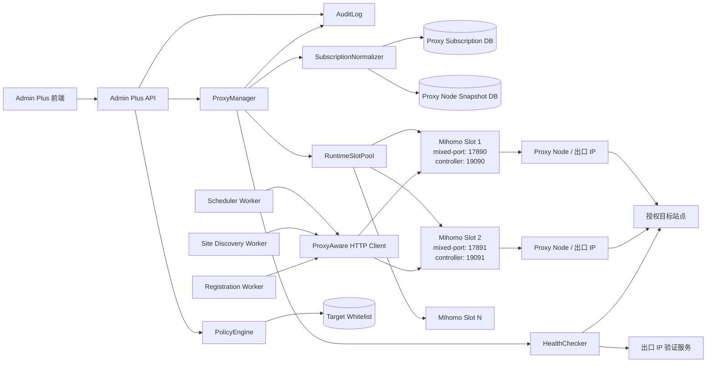
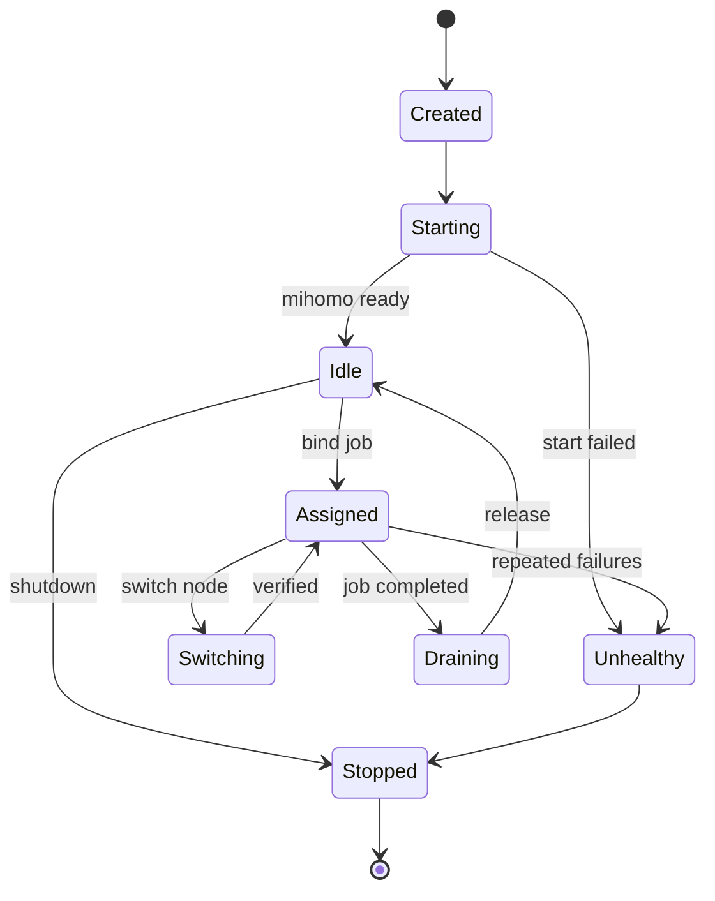
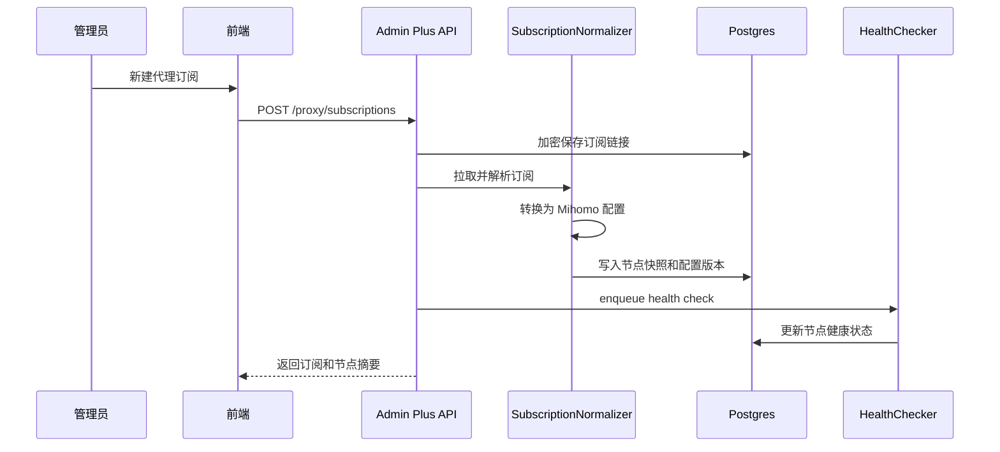
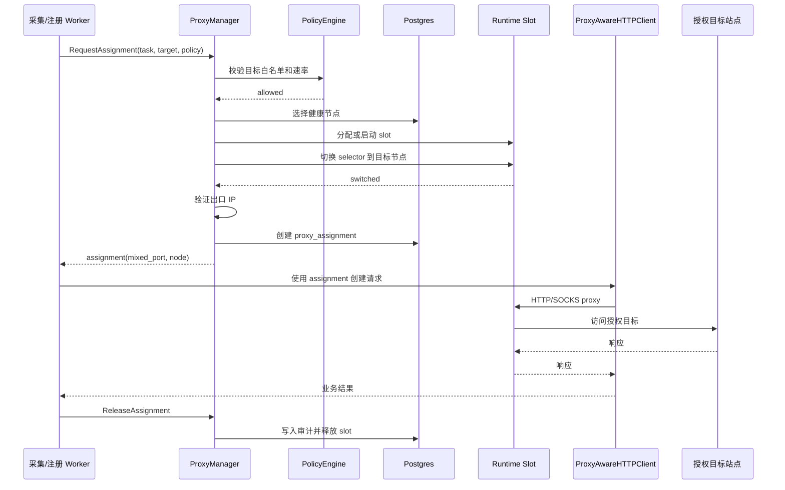
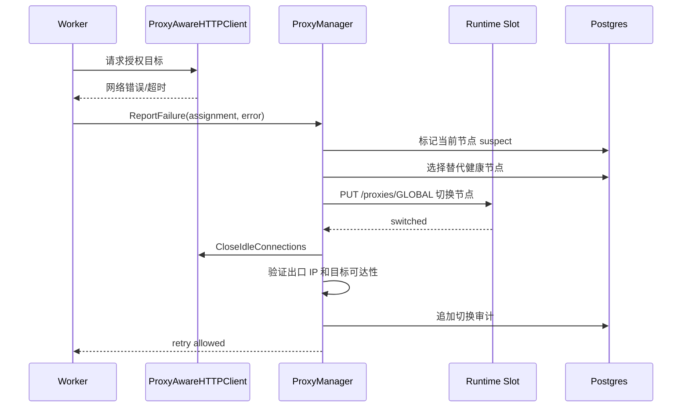
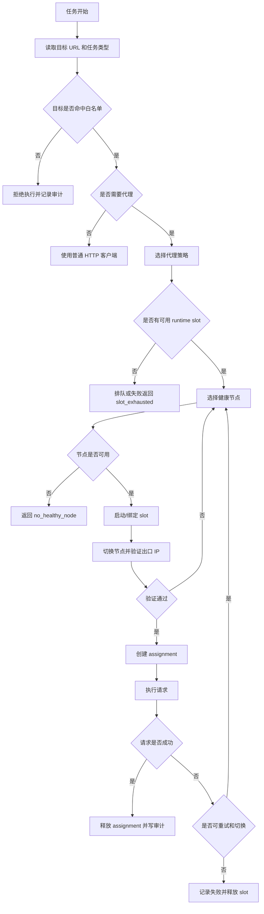
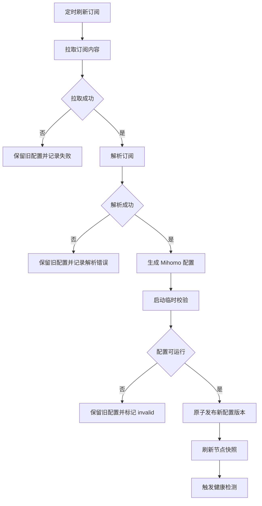

# 代理出口管理 PRD

版本：v0.1.0
日期：2026-06-26
状态：方案设计
范围：授权目标的代理订阅接入、出口节点管理、代理运行槽位、采集/注册任务出口分配、健康检测、审计与合规控制。

## 目录

1. 背景
2. 前提与边界
3. 目标与收益
4. 用户角色
5. 用户故事
6. 用户用例
7. 设计结论
8. 总体架构
9. 核心对象
10. 订阅接入策略
11. 代理运行时方案
12. 节点选择与切换策略
13. 核心时序图
14. 核心流程图
15. 页面信息架构
16. 后端数据模型
17. API 草案
18. 安全、合规与审计
19. 错误码与重试策略
20. 监控指标
21. 测试用例
22. 验收标准
23. 分阶段实施计划
24. 开放问题

## 1. 背景

Admin Plus 已经具备供应商管理、渠道索引采集、站点发现、注册任务、调度中心和 Provider Adapter 等能力。后续在授权采集、供应商接入、站点连通性验证和区域化网络质量测试中，需要稳定、可审计、可切换的出口代理能力。

当前如果仅依赖人工 GUI 客户端，有几个明显问题：

- 无法在服务端稳定运行和自动恢复。
- 无法按采集任务、注册任务或供应商任务隔离出口。
- 多任务并发时，单个全局代理节点切换会互相影响。
- 订阅链接、节点状态、出口 IP、失败原因和任务审计无法进入 Admin Plus 事实源。
- Clash、Shadowrocket、V2Ray/SS 等订阅格式需要统一归一化，否则业务层会直接感知多种格式。

因此需要建设独立的“代理出口管理”能力，把代理运行时从 GUI 操作收敛为后端可控的基础设施。

## 2. 前提与边界

本方案以前提成立为设计基础：

- 目标站点、供应商或测试系统已经获得授权，且访问行为符合目标方规则。
- 代理出口用于授权采集、授权注册、内部测试、区域网络验证和故障诊断。
- 系统必须提供目标白名单、速率限制、任务审计、敏感信息保护和人工停用能力。

系统不负责也不支持：

- 绕过第三方网站的访问控制、风控限制或服务条款。
- 面向未授权目标的批量注册、批量请求或匿名化规避。
- 将代理订阅、节点凭据或 controller 密钥暴露给前端或日志。
- 直接控制 Clash Party、Clash Verge 等 GUI 客户端。

## 3. 目标与收益

目标：

1. 支持导入 Clash 订阅、Shadowrocket 订阅、V2Ray/SS 订阅，并统一归一化为 Mihomo 可运行配置。
2. 使用 Mihomo core 作为无 GUI 代理运行时。
3. 为采集任务、注册任务和供应商任务分配可审计的代理出口。
4. 支持按任务隔离代理运行槽位，避免并发任务切换节点互相影响。
5. 支持节点健康检测、出口 IP 验证、失败自动摘除和人工切换。
6. 支持白名单目标、速率限制、操作审计和敏感配置加密。
7. 为调度中心、渠道索引采集和供应商注册链路提供统一 ProxyManager。

收益：

- 运营可以看到每个任务使用了哪个代理配置、节点、出口 IP 和失败原因。
- 技术排障可以按 run/job/slot/node 追踪网络问题。
- 并发采集不会因为全局节点切换互相污染。
- 订阅格式统一收敛，后续新增订阅源不影响业务层。
- 代理凭据和订阅链接进入受控存储，降低泄露风险。
- 授权访问策略可被系统强制执行，而不是依赖人工约定。

## 4. 用户角色

| 角色 | 关注点 | 典型操作 |
|------|--------|----------|
| 管理员 | 订阅配置、安全策略、运行槽位、密钥保护 | 导入订阅、配置白名单、停用订阅 |
| 运营 | 采集/注册任务能否正常完成、出口是否健康 | 选择出口策略、查看任务结果、重试失败 |
| 技术排障人员 | 节点连通性、出口 IP、错误码、runtime 日志 | 查看 slot 状态、测试节点、切换节点 |
| 合规/负责人 | 目标授权、访问频率、审计记录 | 审查白名单、导出操作审计 |

## 5. 用户故事

1. 作为管理员，我希望导入一个 Clash 订阅链接，并看到解析出的节点数量、地区、协议和健康状态，以便判断订阅是否可用。
2. 作为管理员，我希望 Shadowrocket 或 V2Ray/SS 订阅也能接入，但系统内部统一生成 Mihomo 配置，以便减少业务层复杂度。
3. 作为运营，我希望在启动授权采集任务时选择一个代理策略，而不是手动选择具体节点，以便系统自动选择健康出口。
4. 作为运营，我希望授权注册任务可以使用独立代理运行槽位，以便并发任务之间互不影响。
5. 作为技术排障人员，我希望查看一次任务实际使用的节点、出口 IP、controller 端口和请求错误，以便定位失败原因。
6. 作为管理员，我希望限制代理只能访问已配置白名单目标，以便避免误用。
7. 作为合规负责人，我希望每次代理切换、任务绑定、订阅更新都有审计记录，以便追踪责任。

## 6. 用户用例

### UC-01 导入 Clash 订阅

| 项目 | 说明 |
|------|------|
| 触发角色 | 管理员 |
| 前置条件 | 管理员持有授权订阅链接 |
| 主流程 | 新建代理订阅 -> 输入 Clash 订阅链接 -> 后端拉取配置 -> 校验 YAML -> 归一化节点 -> 写入节点快照 -> 触发健康检测 |
| 成功结果 | 订阅状态为 active，节点进入可选择池 |
| 异常 | 链接不可访问、YAML 非法、无可用节点、协议不支持 |

### UC-02 导入 Shadowrocket/V2Ray/SS 订阅

| 项目 | 说明 |
|------|------|
| 触发角色 | 管理员 |
| 前置条件 | 管理员持有授权订阅链接 |
| 主流程 | 新建代理订阅 -> 选择订阅类型 -> 后端拉取原始内容 -> SubscriptionNormalizer 解析节点 URI -> 转换为 Mihomo proxies/proxy-providers -> 写入节点快照 |
| 成功结果 | 订阅统一转换为 Mihomo 可运行配置 |
| 异常 | base64 解码失败、节点 URI 格式不支持、缺少必需字段 |

### UC-03 授权采集任务使用代理策略

| 项目 | 说明 |
|------|------|
| 触发角色 | 运营 |
| 前置条件 | 目标域名在白名单中，代理策略可用 |
| 主流程 | 运营启动采集 -> 选择代理策略 -> PolicyEngine 校验目标和频率 -> ProxyManager 分配 runtime slot -> 选择健康节点 -> 任务 HTTP 客户端走 slot mixed-port -> 写入审计 |
| 成功结果 | 采集任务完成并记录出口信息 |
| 异常 | 无健康节点、目标不在白名单、slot 资源不足、出口 IP 验证失败 |

### UC-04 授权注册任务使用独立出口

| 项目 | 说明 |
|------|------|
| 触发角色 | 运营/调度中心 |
| 前置条件 | 注册目标已授权，注册任务已创建 |
| 主流程 | 注册任务入队 -> 申请专属 runtime slot -> 绑定代理节点 -> 执行注册流程 -> 记录注册任务和代理审计 -> 释放 slot |
| 成功结果 | 注册任务完成，审计记录可追踪 |
| 异常 | 目标策略禁止注册、节点质量不达标、注册流程需人工验证 |

### UC-05 节点失败自动切换

| 项目 | 说明 |
|------|------|
| 触发角色 | Worker |
| 前置条件 | 任务配置允许自动切换 |
| 主流程 | 请求失败 -> 错误分类 -> 标记当前节点 suspect -> 选择同策略下健康节点 -> 切换 slot selector -> 清理 HTTP idle 连接 -> 验证出口 IP -> 继续任务 |
| 成功结果 | 任务在预算内恢复 |
| 异常 | 切换次数超过上限、同策略无可用节点、目标返回业务拒绝 |

### UC-06 审计与追踪

| 项目 | 说明 |
|------|------|
| 触发角色 | 管理员/合规负责人 |
| 前置条件 | 系统已产生代理任务 |
| 主流程 | 打开代理审计 -> 按任务、节点、目标、操作者筛选 -> 查看切换、验证、失败、停用记录 |
| 成功结果 | 可以定位某次请求对应的策略、slot、节点和出口 IP |
| 异常 | 旧任务日志超出保留期，只能查看摘要 |

## 7. 设计结论

1. 默认技术选型为 Mihomo core，无 GUI 运行。
2. 业务层只调用 ProxyManager，不直接感知 Clash、Shadowrocket、V2Ray/SS 细节。
3. 订阅输入通过 SubscriptionNormalizer 统一转换为 Mihomo 配置。
4. 并发任务必须使用 runtime slot 隔离，每个 slot 拥有独立 mixed-port、controller-port 和选中节点。
5. MVP 可以先支持 Clash 订阅直连，Shadowrocket/V2Ray/SS 作为第二阶段转换能力。
6. 所有代理访问必须经过目标白名单和速率策略校验。
7. 订阅链接、controller secret、节点凭据必须加密存储，日志只保存 hash、脱敏名称和摘要。
8. 切换节点后必须关闭 HTTP 客户端 idle 连接，避免复用旧出口连接。
9. 健康检测分为节点连通性、出口 IP 验证和目标域名可达性三层。
10. 代理运行状态进入调度中心和系统日志，便于排障和审计。

## 8. 总体架构



## 9. 核心对象

| 对象 | 职责 | 生命周期 |
|------|------|----------|
| 代理订阅 `proxy_subscription` | 保存订阅来源、类型、拉取策略和密文链接 | 管理员创建，长期存在 |
| 节点快照 `proxy_node` | 订阅解析后的节点元数据和健康状态 | 随订阅刷新更新 |
| 代理策略 `proxy_policy` | 定义可用订阅、地区偏好、白名单、并发和切换规则 | 管理员配置 |
| 目标白名单 `proxy_target_policy` | 定义允许通过代理访问的域名、用途、速率和方法 | 管理员配置 |
| 运行槽位 `proxy_runtime_slot` | 一个独立 Mihomo 进程/配置/端口集合 | 按需创建，任务结束释放或复用 |
| 任务绑定 `proxy_assignment` | 记录某个 run/job 使用的 policy、slot、node 和出口 IP | 每个任务创建 |
| 健康检查 `proxy_health_check` | 节点连通性、延迟、出口 IP、目标可达性 | 周期或按需创建 |
| 审计事件 `proxy_audit_event` | 导入、切换、停用、任务绑定、策略拒绝 | 持久保存 |

## 10. 订阅接入策略

### 10.1 支持类型

| 订阅类型 | MVP | 说明 |
|----------|-----|------|
| Clash/Mihomo YAML | 是 | 优先支持，直接进入 Mihomo 配置 |
| Shadowrocket | 第二阶段 | 解析节点 URI 后转换为 Mihomo proxies |
| V2Ray + SS | 第二阶段 | 解析 `vmess://`、`vless://`、`ss://`、`trojan://` 等 URI |
| 手工节点 | 第二阶段 | 管理员手动录入单个节点，用于临时排障 |

### 10.2 归一化原则

订阅归一化输出统一结构：

```text
NormalizedProxyConfig
  provider_name
  nodes[]
    name
    protocol
    server
    port
    region
    tags
    raw_hash
  mihomo_yaml
  generated_at
```

规则：

- 不在日志中输出原始订阅链接、节点密码、私钥或 token。
- 节点名称允许展示，但需要支持管理员手动脱敏别名。
- 解析失败不能污染当前可用配置，必须保留上一份成功配置。
- 订阅刷新采用原子切换：新配置校验成功后再替换 active snapshot。

## 11. 代理运行时方案

### 11.1 Runtime Slot

每个 runtime slot 代表一个独立代理运行单元：

```text
slot_id: proxy-slot-001
mixed_port: 17890
controller_port: 19090
controller_secret: encrypted
config_path: runtime/proxy/slots/001/config.yaml
selected_node: 香港Y09
status: idle | assigned | draining | unhealthy
```

选择 slot 隔离而不是全局代理的原因：

- 全局 selector 切换会影响所有正在运行的任务。
- HTTP keep-alive 连接可能继续复用旧节点。
- 任务审计需要精确记录 run/job 到出口 IP 的映射。
- 并发任务可能需要不同地区、不同订阅或不同目标策略。

### 11.2 Slot 生命周期



### 11.3 HTTP 客户端要求

后端需要提供 `ProxyAwareHTTPClient`：

- 按 assignment 选择对应 slot 的 `http://127.0.0.1:{mixed_port}`。
- 切换节点后调用底层 transport 的 idle connection 清理能力。
- 按目标策略执行超时、重试、退避和最大请求数。
- 记录请求摘要，不记录敏感 payload。

## 12. 节点选择与切换策略

### 12.1 节点选择输入

| 输入 | 说明 |
|------|------|
| 目标域名 | 用于白名单和目标可达性检测 |
| 任务类型 | `site_discovery`、`registration`、`supplier_probe`、`manual_test` |
| 地区偏好 | 可选，例如 HK、JP、US |
| 协议偏好 | 可选，例如优先稳定线路 |
| 延迟阈值 | 节点健康筛选 |
| 失败预算 | 单任务最多切换次数 |
| 并发限制 | 每个策略或订阅的并发槽位数 |

### 12.2 健康状态

| 状态 | 说明 | 可被选择 |
|------|------|----------|
| `unknown` | 尚未检测 | 可低优先级选择 |
| `healthy` | 连通性、出口 IP 和目标测试通过 | 是 |
| `degraded` | 可用但延迟高或近期失败 | 仅兜底 |
| `suspect` | 当前任务中失败，等待复检 | 否 |
| `unhealthy` | 连续失败或协议不可用 | 否 |
| `disabled` | 管理员停用 | 否 |

### 12.3 切换触发

允许切换：

- 节点连接失败。
- DNS/握手/超时等网络错误。
- 出口 IP 验证失败。
- 目标可达性检测失败且策略允许切换。
- 管理员手动切换。

不自动切换：

- 目标明确返回业务拒绝且不属于网络错误。
- 白名单策略拒绝。
- 任务超过请求频率或失败预算。
- 注册流程需要人工验证或人工确认。

## 13. 核心时序图

### 13.1 订阅导入时序



### 13.2 任务分配代理时序



### 13.3 节点失败切换时序



## 14. 核心流程图

### 14.1 授权任务代理执行流程



### 14.2 订阅刷新流程



## 15. 页面信息架构

建议新增后台栏目：

```text
运营中心
  代理出口管理
    工作台
    代理订阅
    节点池
    代理策略
    运行槽位
    任务审计
    安全设置
```

页面职责：

| 页面 | 职责 |
|------|------|
| 工作台 | 展示订阅状态、健康节点、运行槽位、失败任务和最近审计 |
| 代理订阅 | 管理 Clash/Shadowrocket/V2Ray/SS 订阅、刷新频率和启停 |
| 节点池 | 展示节点地区、协议、延迟、出口 IP、健康状态和停用按钮 |
| 代理策略 | 配置地区偏好、订阅范围、并发上限、切换预算和目标白名单 |
| 运行槽位 | 查看 Mihomo slot 端口、状态、绑定任务和 runtime 日志摘要 |
| 任务审计 | 按任务、目标、节点、操作者筛选代理使用记录 |
| 安全设置 | 配置加密、secret 轮换、日志脱敏、保留期和全局停用 |

## 16. 后端数据模型

### 16.1 代理订阅

`admin_plus_proxy_subscriptions`

| 字段 | 类型 | 说明 |
|------|------|------|
| `id` | BIGSERIAL | 主键 |
| `name` | TEXT | 订阅名称 |
| `subscription_type` | TEXT | `clash`、`shadowrocket`、`v2ray_ss` |
| `url_ciphertext` | TEXT | 加密订阅链接 |
| `url_hash` | TEXT | 订阅链接 hash，用于去重和审计 |
| `enabled` | BOOLEAN | 是否启用 |
| `refresh_interval_seconds` | INTEGER | 刷新周期 |
| `last_refresh_status` | TEXT | 最近刷新状态 |
| `last_refresh_error` | TEXT | 最近刷新错误摘要 |
| `active_config_version` | TEXT | 当前生效配置版本 |
| `created_by` | BIGINT | 创建人 |
| `created_at` | TIMESTAMPTZ | 创建时间 |
| `updated_at` | TIMESTAMPTZ | 更新时间 |

### 16.2 代理节点

`admin_plus_proxy_nodes`

| 字段 | 类型 | 说明 |
|------|------|------|
| `id` | BIGSERIAL | 主键 |
| `subscription_id` | BIGINT | 订阅 ID |
| `config_version` | TEXT | 配置版本 |
| `node_key` | TEXT | 节点稳定 key，来自 raw hash |
| `display_name` | TEXT | 展示名称 |
| `protocol` | TEXT | 节点协议 |
| `region` | TEXT | 解析或人工标记地区 |
| `server_hash` | TEXT | server 脱敏 hash |
| `health_status` | TEXT | `unknown`、`healthy`、`degraded`、`suspect`、`unhealthy`、`disabled` |
| `last_latency_ms` | INTEGER | 最近延迟 |
| `last_egress_ip` | TEXT | 最近出口 IP，可按配置脱敏 |
| `last_checked_at` | TIMESTAMPTZ | 最近检测时间 |
| `disabled_reason` | TEXT | 停用原因 |
| `created_at` | TIMESTAMPTZ | 创建时间 |
| `updated_at` | TIMESTAMPTZ | 更新时间 |

### 16.3 代理策略

`admin_plus_proxy_policies`

| 字段 | 类型 | 说明 |
|------|------|------|
| `id` | BIGSERIAL | 主键 |
| `name` | TEXT | 策略名称 |
| `enabled` | BOOLEAN | 是否启用 |
| `subscription_ids` | JSONB | 可用订阅 ID 列表 |
| `preferred_regions` | JSONB | 地区偏好 |
| `max_concurrency` | INTEGER | 最大并发 slot |
| `max_switches_per_task` | INTEGER | 单任务最大切换次数 |
| `connect_timeout_ms` | INTEGER | 连接超时 |
| `request_timeout_ms` | INTEGER | 请求超时 |
| `config` | JSONB | 扩展配置 |
| `created_at` | TIMESTAMPTZ | 创建时间 |
| `updated_at` | TIMESTAMPTZ | 更新时间 |

### 16.4 目标白名单

`admin_plus_proxy_target_policies`

| 字段 | 类型 | 说明 |
|------|------|------|
| `id` | BIGSERIAL | 主键 |
| `policy_id` | BIGINT | 代理策略 ID |
| `target_host` | TEXT | 授权目标域名或精确 host |
| `purpose` | TEXT | `site_discovery`、`registration`、`supplier_probe`、`manual_test` |
| `allowed_methods` | JSONB | 允许 HTTP 方法 |
| `rate_limit_per_minute` | INTEGER | 每分钟请求上限 |
| `enabled` | BOOLEAN | 是否启用 |
| `authorization_note` | TEXT | 授权说明或内部审批引用 |
| `created_at` | TIMESTAMPTZ | 创建时间 |
| `updated_at` | TIMESTAMPTZ | 更新时间 |

### 16.5 运行槽位

`admin_plus_proxy_runtime_slots`

| 字段 | 类型 | 说明 |
|------|------|------|
| `id` | BIGSERIAL | 主键 |
| `slot_key` | TEXT | 稳定 slot key |
| `status` | TEXT | `idle`、`assigned`、`draining`、`unhealthy`、`stopped` |
| `mixed_port` | INTEGER | 本地代理端口 |
| `controller_port` | INTEGER | Mihomo controller 端口 |
| `controller_secret_ciphertext` | TEXT | 加密 controller secret |
| `process_id` | INTEGER | 本地进程 ID |
| `config_path` | TEXT | 运行配置路径 |
| `assigned_task_type` | TEXT | 当前任务类型 |
| `assigned_task_id` | TEXT | 当前任务 ID |
| `selected_node_id` | BIGINT | 当前节点 |
| `last_started_at` | TIMESTAMPTZ | 最近启动时间 |
| `last_heartbeat_at` | TIMESTAMPTZ | 最近心跳 |
| `created_at` | TIMESTAMPTZ | 创建时间 |
| `updated_at` | TIMESTAMPTZ | 更新时间 |

### 16.6 任务绑定

`admin_plus_proxy_assignments`

| 字段 | 类型 | 说明 |
|------|------|------|
| `id` | BIGSERIAL | 主键 |
| `task_type` | TEXT | 任务类型 |
| `task_id` | TEXT | 任务 ID |
| `policy_id` | BIGINT | 策略 ID |
| `slot_id` | BIGINT | 运行槽位 ID |
| `node_id` | BIGINT | 节点 ID |
| `target_host` | TEXT | 目标 host |
| `egress_ip` | TEXT | 出口 IP |
| `status` | TEXT | `active`、`released`、`failed` |
| `switch_count` | INTEGER | 切换次数 |
| `started_at` | TIMESTAMPTZ | 开始时间 |
| `released_at` | TIMESTAMPTZ | 释放时间 |
| `created_at` | TIMESTAMPTZ | 创建时间 |

### 16.7 审计事件

`admin_plus_proxy_audit_events`

| 字段 | 类型 | 说明 |
|------|------|------|
| `id` | BIGSERIAL | 主键 |
| `event_type` | TEXT | `subscription_created`、`node_switched`、`assignment_created`、`policy_denied` 等 |
| `actor_id` | BIGINT | 操作者，系统任务可为空 |
| `task_type` | TEXT | 可选任务类型 |
| `task_id` | TEXT | 可选任务 ID |
| `policy_id` | BIGINT | 可选策略 ID |
| `slot_id` | BIGINT | 可选 slot ID |
| `node_id` | BIGINT | 可选节点 ID |
| `target_host` | TEXT | 可选目标 host |
| `level` | TEXT | `info`、`warning`、`error` |
| `message` | TEXT | 脱敏摘要 |
| `payload` | JSONB | 结构化脱敏上下文 |
| `created_at` | TIMESTAMPTZ | 创建时间 |

## 17. API 草案

### 17.1 订阅

| 方法 | 路径 | 说明 |
|------|------|------|
| `GET` | `/admin/proxy/subscriptions` | 订阅列表 |
| `POST` | `/admin/proxy/subscriptions` | 新建订阅 |
| `PATCH` | `/admin/proxy/subscriptions/:id` | 更新订阅配置 |
| `POST` | `/admin/proxy/subscriptions/:id/refresh` | 手动刷新 |
| `POST` | `/admin/proxy/subscriptions/:id/disable` | 停用订阅 |

### 17.2 节点

| 方法 | 路径 | 说明 |
|------|------|------|
| `GET` | `/admin/proxy/nodes` | 节点列表 |
| `POST` | `/admin/proxy/nodes/:id/check` | 检测节点 |
| `POST` | `/admin/proxy/nodes/:id/disable` | 停用节点 |
| `POST` | `/admin/proxy/nodes/:id/enable` | 启用节点 |

### 17.3 策略和白名单

| 方法 | 路径 | 说明 |
|------|------|------|
| `GET` | `/admin/proxy/policies` | 策略列表 |
| `POST` | `/admin/proxy/policies` | 创建策略 |
| `PATCH` | `/admin/proxy/policies/:id` | 更新策略 |
| `GET` | `/admin/proxy/policies/:id/targets` | 目标白名单 |
| `POST` | `/admin/proxy/policies/:id/targets` | 添加目标白名单 |

### 17.4 运行槽位和任务绑定

| 方法 | 路径 | 说明 |
|------|------|------|
| `GET` | `/admin/proxy/runtime-slots` | slot 列表 |
| `POST` | `/admin/proxy/runtime-slots/:id/restart` | 重启 slot |
| `POST` | `/admin/proxy/assignments` | 内部 API：创建任务绑定 |
| `POST` | `/admin/proxy/assignments/:id/release` | 内部 API：释放任务绑定 |
| `POST` | `/admin/proxy/assignments/:id/switch` | 内部 API：切换节点 |

### 17.5 审计

| 方法 | 路径 | 说明 |
|------|------|------|
| `GET` | `/admin/proxy/audit-events` | 查询代理审计 |
| `GET` | `/admin/proxy/assignments` | 查询任务绑定历史 |

## 18. 安全、合规与审计

安全要求：

1. 订阅 URL、节点凭据、controller secret 必须加密存储。
2. controller 只允许监听 `127.0.0.1`，不允许暴露到公网或内网。
3. runtime 配置文件权限应限制为当前服务用户可读写。
4. 前端不返回订阅原文、节点密钥、controller secret。
5. 日志只记录 hash、脱敏节点名、目标 host、错误码和任务 ID。
6. 支持全局 kill switch，紧急停用所有代理任务。

合规控制：

1. 每个代理策略必须绑定目标白名单。
2. 白名单需要记录授权说明或内部审批引用。
3. 任务启动前必须校验目标 host、任务类型和速率限制。
4. 注册类任务必须显式标记用途，不能默认继承普通采集策略。
5. 业务拒绝类响应不应被简单视为网络失败，不应无限切换节点。
6. 所有手动切换、自动切换、策略拒绝和任务绑定必须写审计事件。

## 19. 错误码与重试策略

| 错误码 | 说明 | 是否重试 | 处理 |
|--------|------|----------|------|
| `proxy.subscription.fetch_failed` | 订阅拉取失败 | 是 | 退避重试，保留旧配置 |
| `proxy.subscription.parse_failed` | 订阅解析失败 | 否 | 标记 invalid，提示修正 |
| `proxy.policy.target_denied` | 目标不在白名单 | 否 | 拒绝任务并审计 |
| `proxy.policy.rate_limited` | 超出策略频率 | 是 | 延迟执行 |
| `proxy.slot.exhausted` | 无可用 runtime slot | 是 | 排队或扩容 |
| `proxy.slot.start_failed` | Mihomo 启动失败 | 是 | 重建 slot，超过阈值告警 |
| `proxy.node.no_healthy_node` | 无健康节点 | 是 | 触发健康检测，任务等待 |
| `proxy.node.switch_failed` | 切换节点失败 | 是 | 换节点或重启 slot |
| `proxy.egress.verify_failed` | 出口 IP 验证失败 | 是 | 标记节点 suspect |
| `proxy.target.network_failed` | 目标网络失败 | 是 | 按预算切换节点 |
| `proxy.target.business_rejected` | 目标业务拒绝 | 否 | 停止切换，交由业务处理 |

## 20. 监控指标

| 指标 | 说明 |
|------|------|
| `proxy_subscriptions_active_total` | 启用订阅数量 |
| `proxy_nodes_healthy_total` | 健康节点数量 |
| `proxy_runtime_slots_active_total` | 正在运行 slot 数量 |
| `proxy_runtime_slots_assigned_total` | 已绑定任务 slot 数量 |
| `proxy_assignment_duration_seconds` | 任务绑定时长 |
| `proxy_node_switch_total` | 节点切换次数 |
| `proxy_node_failure_total` | 节点失败次数 |
| `proxy_policy_denied_total` | 策略拒绝次数 |
| `proxy_egress_verify_failed_total` | 出口验证失败次数 |
| `proxy_target_request_error_total` | 目标请求错误数 |

## 21. 测试用例

### 21.1 单元测试

- Clash YAML 解析成功。
- Clash YAML 非法时保留旧配置。
- Shadowrocket/V2Ray/SS URI 解析失败返回明确错误。
- 目标白名单命中和拒绝。
- 节点选择排序：健康状态、地区偏好、延迟。
- 业务拒绝错误不触发无限切换。
- 订阅 URL、secret 脱敏输出。

### 21.2 集成测试

- 新建订阅后生成节点快照。
- 启动 runtime slot 并监听独立端口。
- 创建 assignment 后 Worker 请求走指定 mixed-port。
- 切换节点后清理 idle connection。
- 并发两个 assignment 使用不同 slot，互不影响。
- 节点失败后按预算切换并写审计。
- 全局 kill switch 生效后新任务不能申请代理。

### 21.3 UI 测试

- 订阅列表展示刷新状态和错误摘要。
- 节点池支持健康状态筛选、手动检测和停用。
- 策略页面必须配置目标白名单。
- 运行槽位页面显示 slot 状态、端口、绑定任务和当前节点。
- 审计页面按任务、目标、节点、事件类型筛选。

## 22. 验收标准

MVP 验收：

1. 支持导入 Clash/Mihomo 订阅并生成节点快照。
2. 支持配置代理策略和目标白名单。
3. 支持启动至少 1 个 Mihomo runtime slot。
4. 授权采集任务可以通过 ProxyManager 获取 assignment 并走代理请求。
5. 支持手动检测节点健康和出口 IP。
6. 支持自动记录 assignment、节点切换和策略拒绝审计。
7. 切换节点后不会复用旧 HTTP idle 连接。
8. 订阅链接和 controller secret 不出现在前端、普通日志和错误堆栈中。

增强验收：

1. 支持 Shadowrocket/V2Ray/SS 订阅转换。
2. 支持 runtime slot pool 和多任务并发隔离。
3. 支持节点失败自动切换和预算控制。
4. 支持调度中心展示代理运行状态。
5. 支持全局 kill switch 和 secret 轮换。

## 23. 分阶段实施计划

### Phase 1：MVP 底座

- 新增代理订阅、节点、策略、白名单、slot、assignment、audit 数据模型。
- 支持 Clash/Mihomo 订阅导入和手动刷新。
- 实现 Mihomo runtime slot 启停和 controller 调用。
- 实现 ProxyManager 内部 API。
- 接入一个授权采集任务作为首个调用方。
- 前端提供基础订阅、节点池、策略和审计页面。

### Phase 2：并发隔离与自动切换

- 实现 RuntimeSlotPool。
- 支持多 slot 并发 assignment。
- 支持节点失败自动切换。
- 支持出口 IP 验证和目标可达性检测。
- 接入注册任务和调度中心。

### Phase 3：多订阅格式和治理能力

- 支持 Shadowrocket/V2Ray/SS 订阅归一化。
- 支持手工节点和节点别名。
- 支持 secret 轮换、全局 kill switch 和审计导出。
- 支持更完整的指标、告警和运行日志。

## 24. 开放问题

1. Mihomo 二进制随服务发布，还是由部署环境单独安装。
2. runtime slot 配置和临时文件是否进入统一 data directory。
3. 出口 IP 验证服务使用内部服务还是第三方服务。
4. 是否需要按租户、管理员或任务类型隔离代理策略。
5. 注册任务是否需要更严格的人工审批和单独预算。
6. 节点地区识别优先依赖订阅名称、IP 地理库还是人工标记。
7. 是否需要在 Worker 层加入代理请求录制摘要，便于问题复现。
