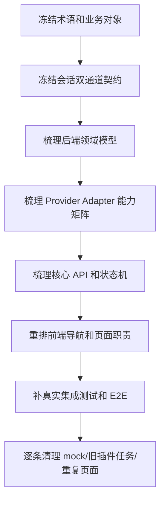
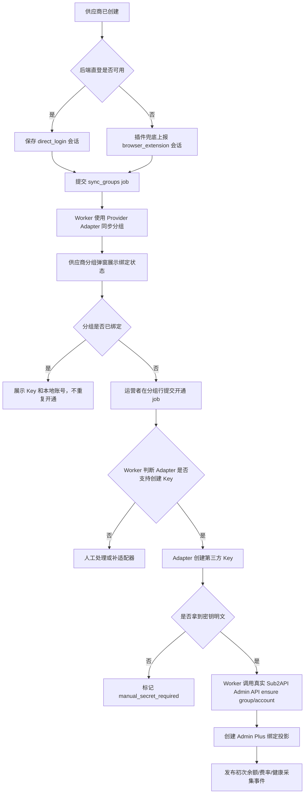

# Admin Plus 重新梳理计划

版本：v0.1.0
日期：2026-06-21
状态：P0 已进入落地，P1/P2 继续执行
范围：重新梳理供应商、后端直登、Chrome 插件兜底、账号/Key、Provider Adapter、前后端页面和真实验收口径。

## 1. 目标

当前问题不是单个页面或单个接口缺失，而是业务链路、插件边界、后端适配器和验收口径混在一起，导致实现容易偏向“先堆页面、先接 mock、先让按钮可点”。下一阶段需要先重新梳理事实源和开发顺序。

本计划的目标：

1. 固定业务主链路：从供应商父级开始，到分组、第三方 Key、本地 Sub2API 账号、绑定、采集、对账、建议和通知。
2. 固定会话获取边界：后端直登优先，Chrome 插件只做站点识别和已登录浏览器会话兜底上报；业务采集由后端 Provider Adapter 完成。
3. 固定余额口径：供应商余额默认是我们作为下游用户在供应商 Sub2API 中的可用余额，不是本地账号 quota，也不是供应商自己的源站账号额度。
4. 固定真实验收：所有功能必须走真实 API、真实 DB/Redis、真实供应商会话或真实只读数据源，不用 mock 当完成。
5. 让插件隔壁进程可以并行开发：本仓库只冻结接口契约、会话包 schema、状态机和安全要求，不阻塞插件 UI/执行器实现。

## 2. 不做

- 不重写插件实现细节，插件开发由隔壁进程推进。
- 不在插件里实现费率、余额、账单、公告或并发的业务解析。
- 不把 Chrome 插件设为所有供应商的默认登录方式；可直登的供应商必须优先走后端 Provider Adapter。
- 不把供应商 Admin API Key 设为新增供应商必填项。
- 不直接写本地 Sub2API DB/Redis。
- 不把本地 Sub2API `accounts.quota_used` 或 `usage_logs` 当成供应商余额。
- 不继续新增重复页面或重复组件来掩盖业务链路不清的问题。

## 3. 事实源拆分

| 文档 | 负责问题 | 处理方式 |
|------|----------|----------|
| `docs/sub2api-admin-plus-prd.md` | 产品目标、范围、用户故事、验收口径 | 保持高层，不继续塞过细实现 |
| `docs/roadmap/accounts/README.md` | 供应商、分组、第三方 Key、本地账号绑定主流程 | 作为账号链路事实源 |
| `docs/roadmap/accounts/ASYNC_PROVISIONING.md` | 账号开通、分组同步、真实 Sub2API 落地的异步任务、事件、队列和 UI/UX 治理 | 作为账号开通异步治理事实源 |
| `docs/roadmap/Chrome/README.md` | 插件兜底职责、会话包、插件状态机、安全边界 | 作为插件契约事实源 |
| `docs/code-structure.md` | 代码目录、模块边界、开发顺序 | 后续按本计划更新 |
| `docs/roadmap/restructure/README.md` | 重新梳理顺序、阶段验收、并行协作 | 本计划 |

后续新增需求必须先判断落在哪个事实源。不能同一个规则在 PRD、Chrome 文档和账号文档里写三套不同口径。

## 4. 总体梳理顺序

执行原则：

- 先事实源，后代码。
- 先契约，后并行开发。
- 先后端能力闭环，后前端完整体验。
- 先 Sub2API 同源供应商，再 New API 或 browser-only。
- 先读和监控，再写和自动执行。

## 5. 阶段计划

### P0：冻结术语和接口契约

目标：让隔壁插件进程和本仓库后端实现使用同一份契约。

交付物：

- 统一术语表：供应商父级、供应商分组、第三方 Key、本地 Sub2API 账号、供应商账号/Key 子级、供应商会话、Provider Adapter。
- 统一会话来源：`direct_login`、`browser_extension`、`manual_import`。
- 后端直登契约：登录输入、登录失败原因、验证码/2FA/强风控兜底错误码、会话包归一化字段。
- 插件会话包 schema：cookie、access token、CSRF、localStorage、sessionStorage、api_base_url、origin、expires_at、page_context、diagnostics。
- 插件状态机：disconnected、connected、matched、unknown、capturing、succeeded、failed。
- 后端接收接口：站点匹配、未知站点候选、后端直登、创建会话采集任务、上报会话包、会话探测。
- 安全约束：host 白名单、路径白名单、只读默认、禁止任意 URL 代理、敏感字段加密和脱敏。

验收：

- 隔壁插件进程可以只看 `docs/roadmap/Chrome/README.md` 完成插件侧开发。
- 后端可以只看该契约实现 extension API 和 session store。
- 插件不需要理解余额、费率、账单等业务表。
- 插件不是默认会话获取方式；后端直登失败时才进入浏览器兜底。

### P1：重建领域模型和数据口径

目标：把父子关系和余额/成本/健康口径彻底理清。

交付物：

- 供应商父级模型。
- 供应商分组模型。
- 第三方 Key 元数据模型。
- 本地 Sub2API 账号绑定模型。
- 供应商余额快照模型。
- 供应商费率快照模型。
- 账单明细和对账结果模型。
- 健康和并发模型。

关键规则：

- 供应商是父级。
- 第三方分组属于供应商。
- 第三方 Key 属于供应商分组。
- 本地 Sub2API 账号是第三方 Key 在本地网关里的落地实体。
- 供应商余额默认是我们在供应商侧的下游用户余额。
- 无余额供应商只能 `monitor_only`，不能进入切换候选。

验收：

- 任一余额、费率、健康和账单都能追溯到供应商父级和账号/Key 子级。
- 页面和接口不再把“供应商”和“本地账号”平铺成同级概念。

### P2：Provider Adapter 主链路

目标：把真实采集和可自动登录的会话获取都迁回后端，插件只保留浏览器兜底。

首批只做 `Sub2APIProviderAdapter`：

- `DirectLogin(credentials)`：调用供应商用户侧登录接口，生成 `direct_login` 会话包；遇到验证码、2FA、强风控时返回浏览器兜底原因。
- `ProbeCapabilities(session)`：识别供应商是否为 Sub2API、版本、可用接口、权限等级。
- `ReadCurrentUserProfile(session)`：读取当前下游用户余额、状态、并发、可用分组。
- `ReadGroups(session)`：读取供应商可用分组和倍率。
- `ReadRates(session)`：读取模型/分组/计费项费率。
- `ReadAnnouncements(session)`：读取公告、充值页或公告配置。
- `ReadBilling(session, date_range)`：读取供应商账单。
- `ReadHealth(session/account)`：读取或探测健康、首 token、耗时、错误率。
- `CreateKey(session, group, params)`：创建第三方 Key，默认关闭，必须管理员确认。

当前 Sub2API 同源 Provider Adapter 已落地的能力矩阵：

| 能力 | 用户侧接口 | 请求类型 | 说明 |
|------|------------|----------|------|
| 当前用户余额/状态 | `/api/v1/user/profile` | GET | 读取供应商侧当前下游用户 profile，写入余额快照 |
| 分组 | `/api/v1/groups/available`、`/api/v1/groups/rates` | GET | 同步供应商分组、渠道颜色、倍率和用户实际倍率 |
| 费率 | `/api/v1/rates/snapshots`、`/api/v1/channels/available` | GET | 优先读取费率快照，兜底从渠道模型价格归一化 |
| 公告 | `/api/v1/announcements`、`/api/v1/payment/checkout-info` | GET | 公告、充值页和活动信息进入公告监控 |
| 账单 | `/api/v1/usage` | GET | 读取用户侧用量/账单明细，旧候选账单端点仅作兼容兜底 |
| Key 管理入口 | `/api/v1/keys?page=1&page_size=1` | GET | 仅用于非破坏性判断用户侧 Key 管理入口是否可访问 |
| 创建第三方 Key | `/api/v1/keys` | POST | 只由管理员确认后的 provision 流程调用 |

能力探测只发非破坏性 GET 请求。`can_create_key` 表示 Key 管理入口可访问，不代表系统会自动创建 Key；真正创建 Key 必须走 `POST /api/v1/admin-plus/suppliers/:id/keys/provision`，并受幂等键、分组唯一绑定和审计约束。

数据源优先级：

1. 供应商明确授权的 Admin API。
2. 供应商只读 PostgreSQL。
3. 供应商只读 Redis。
4. 后端直登后的供应商用户侧 API。
5. 插件上报会话后的供应商用户侧 API。
6. 浏览器兜底导出或页面读取。

验收：

- 至少一个真实 Sub2API 供应商可以通过会话 API 读取当前用户余额。
- Sub2API 同源供应商可以通过后端直登或已保存浏览器兜底会话触发 `POST /api/v1/admin-plus/suppliers/:id/groups/sync` 同步分组。
- Sub2API 同源供应商可以通过后端直登或已保存浏览器兜底会话触发 `POST /api/v1/admin-plus/suppliers/:id/rates/sync` 同步模型/计费项费率，并写入 `admin_plus_rate_snapshots`。
- 失败时写入明确错误：`session_required`、`session_expired`、`permission_denied`、`capability_missing`、`provider_unreachable`。
- 不生成 mock 成功数据。

### P3：分组弹窗内异步开通 Key 和本地落地

目标：从供应商出发提交开通任务，由 Worker 完成第三方 Key 创建、真实 Sub2API group/account ensure 和 Admin Plus 绑定投影。P3 不再把跨供应商和本地网关的长链路放在 HTTP 请求线程里。

流程：

验收：

- 本地 Sub2API 写入只走 Admin API。
- 第三方 Key 明文默认只在内存中流转；失败暂存必须加密和短 TTL。
- API 返回 `job_id` 时只提示任务已提交；只有 job 成功且真实 Sub2API 可见 group/account 后，才提示开通完成。
- 绑定后能在供应商分组弹窗看到第三方 Key、本地账号 ID、任务状态、真实 Sub2API 验证状态和失败原因。
- 账号/Key 独立页只作为修复、审计和历史绑定入口，不作为开通主路径。

### P4：前端导航和页面重新设计

目标：按真实业务拆页面，不再复用重复空壳。

导航建议：

- 供应商
  - 供应商管理
  - 账号/Key 绑定（修复/审计）
- 采集监控
  - 任务调度
  - 采集会话
- 运营事件
  - 公告
- 财务对账
  - 供应商账单
  - 本地用量
  - 对账结果
页面原则：

- 供应商管理页负责父级、会话、分组同步和分组行开通 Key/账号主流程。
- 分组弹窗改为步骤式任务面板：会话、同步分组、开通 Key/账号、真实 Sub2API 验证和初次采集按步骤展示。
- 任务抽屉展示 job/step 进度、错误码、重试、人工修复和审计。
- 账号/Key 绑定页只管失败修复、审计和历史绑定，不承担新增主流程。
- 公告保留独立运营事件入口；费率、健康、并发、账号运行态和余额不再独立成页，只作为供应商管理、账号/Key 绑定、成本对账和事件事实字段展示。
- `运维监控` 是 Sub2API 既有后台能力，不在 Admin Plus 重复注册 current 页面；`/admin/ops` 只保留 compat 重定向到 `/admin/suppliers`。
- `动作建议`、`通知记录`、`执行审计` 不再作为 current 页面入口；`/admin/automation/*` 和旧 `/admin/operations/actions|notifications` 只保留 compat 重定向到 `/admin/suppliers`，确认无外部书签依赖后删除路由。
- 表单、弹窗、工具栏、分页、批量操作继续参考 Sub2API 后台现有交互。

验收：

- 每个页面都有明确数据来源和写操作边界。
- 所有列表支持分页、筛选、刷新、错误态和空状态。
- 所有 CRUD 调真实 API，不使用静态 mock。

### P5：真实测试和清理

目标：把“看起来能用”升级为“真实闭环可验收”。

测试矩阵：

| 层级 | 重点 |
|------|------|
| 单元测试 | Adapter 归一化、余额口径、费率对比、状态机、敏感字段脱敏 |
| 集成测试 | 真实 handler、service、SQL repository、只读 DB/Redis adapter |
| 插件联调 | 真实站点识别、真实会话包上报、后端会话探测 |
| E2E | 创建供应商、上报会话、读取余额、提交分组同步 job、提交按分组开通 job、真实 Sub2API 可见 group/account、生成告警 |
| 安全测试 | SSRF、越权 admin 路径、会话明文泄漏、设备 token 吊销 |

清理项：

- 清理或降级旧插件业务任务：`fetch_groups`、`fetch_rates`、`fetch_balance`、`fetch_announcements`、`fetch_health`、`fetch_usage_costs` 已由调度中心显式选择时直连后端 Provider Adapter / app service；旧插件业务结果摄取仅作为 compat 补录路径，不作为主路径验收。
- 删除或标记不再使用的 mock 数据入口。
- 删除重复组件和重复页面，但只在真实替代路径完成后进行。
- 清理测试夹具，E2E 默认清理本次数据，历史 `e2e-*` 夹具需要显式执行清理。

## 6. 插件隔壁进程协作方式

插件开发并行推进时，本仓库只要求以下协作点：

| 协作点 | 本仓库负责 | 插件进程负责 |
|--------|------------|--------------|
| 站点匹配 API | 定义接口和返回结构 | 调用接口并展示匹配状态 |
| 设备授权 | 生成设备 token、校验任务租约 | 完成 Web 授权连接 |
| 后端直登 | 定义登录 Adapter、错误码、会话归一化 | 不参与 |
| 会话包 schema | 定义字段、加密存储、探测结果 | 仅在兜底场景按 schema 提取并上报 |
| 错误码 | 定义后端错误码和诊断字段 | 展示错误和重试入口 |
| 安全边界 | host 白名单、路径白名单、服务端加密 | 最小 host permission、不保存管理员 token |
| 联调验收 | 提供真实 API、测试供应商和日志 | 在真实供应商页面执行已登录会话一键上报 |

冻结要求：

- P0 完成后，插件契约变更必须走文档变更。
- 插件可以提前开发 UI 和执行器，但不能自定义业务采集结果格式作为主路径。
- 后端直登或插件兜底形成会话后，所有业务采集结果以后端 Provider Adapter 结果为准。

## 7. 推荐执行顺序

1. 本仓库先完成 P0 契约冻结。
2. 本仓库先实现后端直登能力和统一会话包存储。
3. 插件隔壁进程按契约继续开发站点识别、授权、已登录会话一键上报。
4. 本仓库同步完成 P1 领域模型修正。
5. 本仓库实现 P2 `Sub2APIProviderAdapter` 的 profile/余额读取和能力探测。
6. 插件和后端联调真实 Sub2API 供应商浏览器兜底会话。
7. 本仓库补 P3 账号开通和绑定。
8. 前端按 P4 重排导航和页面。
9. P5 补测试、清理旧路径和 mock。

## 8. 当前优先级清单

P0 必须先完成：

- [x] 固定插件会话包 schema。
- [x] 固定插件任务和设备授权接口。
- [x] 固定供应商站点匹配和未知站点候选接口。
- [x] 固定 Provider Adapter capability 名称。
- [x] 固定安全白名单策略。
- [ ] 固定后端直登输入、失败原因和统一会话来源字段。

P1/P2 紧随其后：

- [ ] 实现 Sub2API 同源供应商后端直登。
- [x] 明确供应商余额表和余额事件的口径字段。
- [x] 实现 Sub2API 供应商用户侧 profile 读取。
- [x] 实现会话探测和错误码。
- [x] 实现分组读取。
- [x] 实现费率读取和快照写入。
- [x] 实现余额会话采集和快照写入主链路。
- [ ] 实现真实采集失败可观测。

P3 之后：

- [x] 实现第三方 Key 创建基础 capability。
- [x] 实现本地 Sub2API Admin API 创建账号基础编排。当前已迁入 Provision Worker 第一阶段执行器，并已将落地接口命名收口为 `Sub2APIGateway`。
- [x] `keys/provision` 接入 `Idempotency-Key` 去重和同分组唯一 Key 守卫。当前生产路径已提交异步 job，并用 job/step/outbox 承载业务幂等。
- [x] 实现本地落地失败后的 `keys/:keyID/repair-binding` 修复入口。
- [x] 新增 `supplier_provision_jobs`、`supplier_provision_steps`、`admin_plus_outbox_events`、`processed_events` 和外部调用审计表。
- [x] 将 `groups/sync` 改为提交 `sync_groups` job。
- [x] 将 `keys/provision` 改为提交 `provision_group_key` job。
- [x] 将 `keys/ensure-all` 改为提交 `provision_all_group_keys` job。
- [x] 将本地 Sub2API 落地语义收口到 `Sub2APIGateway` 边界，由 Worker 侧编排调用。
- [x] 新增可配置 `Sub2APIHTTPGateway`。配置 `ADMIN_PLUS_SUB2API_ADMIN_BASE_URL` 和 `ADMIN_PLUS_SUB2API_ADMIN_API_KEY` 后，通过真实 Sub2API Admin API ensure group/account；未配置时仅本地开发回退同进程 `AdminService`。
- [x] 将 `provision_all_group_keys` 从单 step `EnsureAll` 拆成每分组 `ensure_third_party_key` step，支持部分成功和分组级重试。
- [x] 供应商分组弹窗重构为步骤式任务面板，任务状态在弹窗内轮询展示。

P4/P5 最后收口：

## 9. 已落地实现记录

截至 2026-06-21，本仓库已落地以下非 mock 能力：

- `POST /api/v1/admin-plus/suppliers/site-match`：按当前 URL/origin/host 匹配已登记供应商。
- `POST /api/v1/admin-plus/extension/session/capture-task` + `POST /api/v1/admin-plus/extension/tasks/:id/complete`：插件短租约上报供应商浏览器会话。
- `POST /api/v1/admin-plus/suppliers/:id/browser-sessions`：管理员登录态下直接写入供应商浏览器会话，主要用于调试、手动导入和插件联调，不替代插件兜底的短租约路径。
- `GET /api/v1/admin-plus/suppliers/:id/session`：查询供应商会话脱敏状态，只返回摘要和是否已加密保存，不回显 token/cookie。
- `POST /api/v1/admin-plus/suppliers/:id/session/probe`：基于已保存统一会话访问同源 Sub2API 供应商用户侧 `/api/v1/user/profile`，读取当前下游用户余额并写入余额快照。
- `POST /api/v1/admin-plus/suppliers/:id/rates/sync`：基于已保存统一会话访问同源 Sub2API 供应商用户侧费率/渠道接口，归一化后写入 `admin_plus_rate_snapshots` 和变更事件。
- `POST /api/v1/admin-plus/suppliers/:id/keys/provision`：管理员确认后提交 `provision_group_key` job，返回 `202 Accepted + job_id`；Provision Worker 基于已保存会话创建第三方 Key，再通过 `Sub2APIGateway` ensure 本地 Sub2API group/account，并写入 `admin_plus_supplier_keys` 和 `admin_plus_supplier_accounts` 绑定。生产配置 `Sub2APIHTTPGateway` 后走真实 Sub2API Admin API，未配置时仅本地开发回退同进程 `AdminService`。
- `POST /api/v1/admin-plus/suppliers/:id/keys/provision` 已接入业务幂等：HTTP `Idempotency-Key` 写入 job hash；同一供应商分组的未终态 step 会复用已有 job；同一供应商分组还通过数据库唯一索引限制只能存在一个 `provisioning` / `bound` / `manual_secret_required` Key。
- `POST /api/v1/admin-plus/suppliers/:id/groups/sync`：提交 `sync_groups` job，返回 `202 Accepted + job_id`；Provision Worker 执行分组同步并写入投影。
- `POST /api/v1/admin-plus/suppliers/:id/keys/ensure-all`：提交 `provision_all_group_keys` job，返回 `202 Accepted + job_id`；提交时按 active 供应商分组展开 `ensure_third_party_key` step，Worker 分组级执行和重试。
- `GET /api/v1/admin-plus/supplier-provision-jobs/:jobID` 和 `GET /api/v1/admin-plus/supplier-provision-jobs`：查询 job/step 脱敏状态，供前端轮询和审计使用。
- `POST /api/v1/admin-plus/suppliers/:id/keys/:keyID/repair-binding`：只修复本地账号创建或绑定失败的 Key，选择已有本地 Sub2API account 建立绑定并更新 Key 为 `bound`；该接口不调用 Provider Adapter，不创建新的第三方 Key。
- 前端供应商页面已显示浏览器会话状态，并支持手动刷新会话与读取供应商余额。

待补直登能力：

- `POST /api/v1/admin-plus/suppliers/:id/session/login`：后端使用加密供应商登录配置执行 direct_login，成功后写入统一会话；遇到验证码、2FA、强风控时返回浏览器兜底原因。
- 会话表需记录来源：`direct_login` / `browser_extension` / `manual_import`，便于调度、审计和 UI 提示。

安全边界已实现：

- 会话包入库前按供应商 `dashboard_url` / `api_base_url` 做 host 白名单校验。
- `origin` 和 `api_base_url` 只允许 `http` / `https`，禁止 URL userinfo。
- 插件任务结果不会保存或回显 `session_bundle_ciphertext` 明文线索。
- 会话响应只返回 `has_encrypted_bundle`、采集时间、过期时间和摘要。
- Provider Adapter profile 探测默认只访问用户侧 profile，不访问供应商 `/api/v1/admin/*`。
- `ReadGroups(session)` 已落地：`POST /api/v1/admin-plus/suppliers/:id/groups/sync` 使用后端 Provider Adapter 读取供应商用户侧分组接口，并 upsert 到 `admin_plus_supplier_groups`；`GET /api/v1/admin-plus/suppliers/:id/groups` 查询本地分组投影表。目标架构是 `groups/sync` 只提交 `sync_groups` job，Worker 负责同步。
- `ReadRates(session)` 已落地：旧插件 `fetch_rates` 只保留 compat，不作为费率主路径。
- `ReadBalance(session)` 已落地：`POST /api/v1/admin-plus/suppliers/:id/session/probe` 和调度中心显式 `fetch_balance` 都通过后端 `balances.SyncFromSession` 读取供应商用户侧 profile，并写入 `admin_plus_balance_snapshots` 与余额事件；不依赖插件上报已解析余额。
- `ReadUsageCosts(session, date_range)` 已落地：`POST /api/v1/admin-plus/suppliers/:id/usage-costs/sync` 使用后端 Provider Adapter 优先读取供应商用户侧 `/api/v1/usage`，归一化后写入 `admin_plus_supplier_usage_cost_lines`；旧插件 `fetch_usage_costs` 只保留 compat。
- 调度中心已收口：`/admin/collection/scheduler` 只显式调用后端 Provider Adapter / app service 执行业务采集；`/admin/collection/sessions` 只展示和创建 `capture_supplier_session` 会话上报任务；`/admin/collection/plugin-tasks` 仅作为 compat 重定向，不再作为导航入口或业务调度页。旧插件业务结果摄取仅作为兼容入口保留。
- `CreateKey(session, group, params)` 基础链路已落地：供应商侧用户 Key 创建接口为 `/api/v1/keys`；第三方 Key 明文只在 Adapter -> Service -> 本地 Sub2API Admin API 的内存链路中流转，响应和 `provision_response` 不保存明文 key/token/secret。下一步必须迁到 Worker 内存链路，并禁止 job snapshot/outbox payload 保存明文。

下一步仍未完成：

- 真实供应商公告端点联调、健康/并发事实采集生产账号验证和失败可观测完善；健康和账号运行态不再恢复为独立页面入口。
- 第三方 Key 真实供应商联调、失败告警和操作审计。
- Gateway Adapter 重构：`Sub2APIGateway` 边界和可配置 HTTP Adapter 已落地；剩余工作是真实 E2E 验证、生产配置守卫，以及禁止生产路径回退同进程 `AdminService`。
- Saga 细粒度重构：`provision_all_group_keys` 已拆成每分组 step；下一阶段继续把单分组执行器拆成 `ensure_third_party_key`、`ensure_sub2api_group`、`ensure_sub2api_account`、`upsert_admin_plus_binding` 等显式 step。Redis consumer group 已用于 Worker 唤醒和 ack，业务去重仍必须依赖 DB claim、终态状态和外部幂等。
- 账单同步与调度中心的周期触发、真实供应商联调和异常告警。

- [x] 重排导航。
- [ ] 完善所有列表分页和 CRUD UI。
- [ ] 补联调 E2E。
- [ ] 清理 mock 和旧插件业务采集主路径。

## 10. 完成定义

重新梳理完成不是文档写完，而是满足以下条件：

- 后端直登和插件兜底对同一份统一会话包契约联调成功。
- 至少一个真实 Sub2API 供应商可以完成后端直登或插件兜底会话、余额读取和分组读取。
- 供应商父级、供应商分组、第三方 Key、本地账号和绑定关系在 UI 与 DB 中一致。
- 任一失败链路都有明确错误码、前端提示、日志和可重试入口。
- 无余额供应商不会进入切换候选，只会生成充值或观察建议。
- 新增功能不再依赖 mock 数据作为完成依据。
