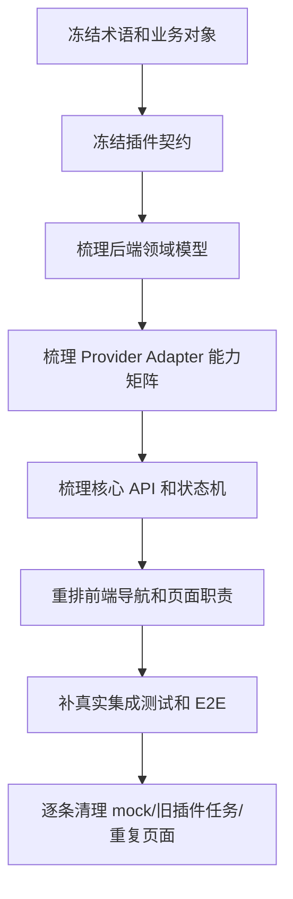
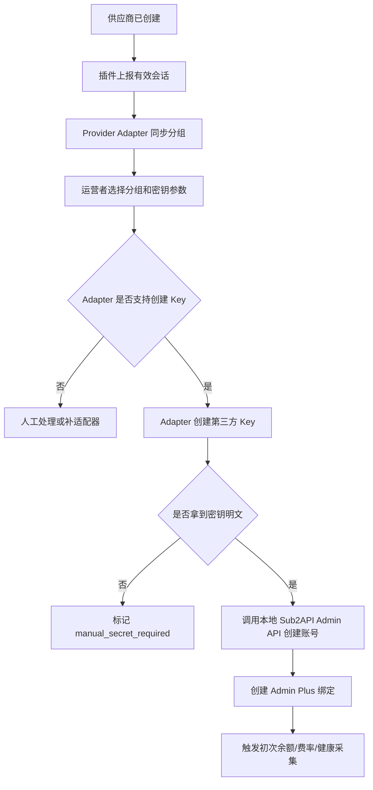

# Admin Plus 重新梳理计划

版本：v0.1.0
日期：2026-06-21
状态：P0 已进入落地，P1/P2 继续执行
范围：重新梳理供应商、账号/Key、Provider Adapter、Chrome 插件契约、前后端页面和真实验收口径。

## 1. 目标

当前问题不是单个页面或单个接口缺失，而是业务链路、插件边界、后端适配器和验收口径混在一起，导致实现容易偏向“先堆页面、先接 mock、先让按钮可点”。下一阶段需要先重新梳理事实源和开发顺序。

本计划的目标：

1. 固定业务主链路：从供应商父级开始，到分组、第三方 Key、本地 Sub2API 账号、绑定、采集、对账、建议和通知。
2. 固定插件边界：插件只做站点识别、浏览器登录、会话包采集和上报；业务采集由后端 Provider Adapter 完成。
3. 固定余额口径：供应商余额默认是我们作为下游用户在供应商 Sub2API 中的可用余额，不是本地账号 quota，也不是供应商自己的源站账号额度。
4. 固定真实验收：所有功能必须走真实 API、真实 DB/Redis、真实供应商会话或真实只读数据源，不用 mock 当完成。
5. 让插件隔壁进程可以并行开发：本仓库只冻结接口契约、会话包 schema、状态机和安全要求，不阻塞插件 UI/执行器实现。

## 2. 不做

- 不重写插件实现细节，插件开发由隔壁进程推进。
- 不在插件里实现费率、余额、账单、优惠或并发的业务解析。
- 不把供应商 Admin API Key 设为新增供应商必填项。
- 不直接写本地 Sub2API DB/Redis。
- 不把本地 Sub2API `accounts.quota_used` 或 `usage_logs` 当成供应商余额。
- 不继续新增重复页面或重复组件来掩盖业务链路不清的问题。

## 3. 事实源拆分

| 文档 | 负责问题 | 处理方式 |
|------|----------|----------|
| `docs/sub2api-admin-plus-prd.md` | 产品目标、范围、用户故事、验收口径 | 保持高层，不继续塞过细实现 |
| `docs/roadmap/accounts/README.md` | 供应商、分组、第三方 Key、本地账号绑定主流程 | 作为账号链路事实源 |
| `docs/roadmap/Chrome/README.md` | 插件职责、会话包、插件状态机、安全边界 | 作为插件契约事实源 |
| `docs/code-structure.md` | 代码目录、模块边界、开发顺序 | 后续按本计划更新 |
| `docs/roadmap/restructure/README.md` | 重新梳理顺序、阶段验收、并行协作 | 本计划 |

后续新增需求必须先判断落在哪个事实源。不能同一个规则在 PRD、Chrome 文档和账号文档里写三套不同口径。

## 4. 总体梳理顺序

执行原则：

- 先事实源，后代码。
- 先契约，后并行开发。
- 先后端能力闭环，后前端完整体验。
- 先 Sub2API 同源供应商，再 New API 或 browser-only。
- 先读和监控，再写和自动执行。

## 5. 阶段计划

### P0：冻结术语和接口契约

目标：让隔壁插件进程和本仓库后端实现使用同一份契约。

交付物：

- 统一术语表：供应商父级、供应商分组、第三方 Key、本地 Sub2API 账号、供应商账号/Key 子级、供应商会话、Provider Adapter。
- 插件会话包 schema：cookie、access token、CSRF、localStorage、sessionStorage、api_base_url、origin、expires_at、page_context、diagnostics。
- 插件状态机：disconnected、connected、matched、unknown、capturing、succeeded、failed。
- 后端接收接口：站点匹配、未知站点候选、创建会话采集任务、上报会话包、会话探测。
- 安全约束：host 白名单、路径白名单、只读默认、禁止任意 URL 代理、敏感字段加密和脱敏。

验收：

- 隔壁插件进程可以只看 `docs/roadmap/Chrome/README.md` 完成插件侧开发。
- 后端可以只看该契约实现 extension API 和 session store。
- 插件不需要理解余额、费率、账单等业务表。

### P1：重建领域模型和数据口径

目标：把父子关系和余额/成本/健康口径彻底理清。

交付物：

- 供应商父级模型。
- 供应商分组模型。
- 第三方 Key 元数据模型。
- 本地 Sub2API 账号绑定模型。
- 供应商余额快照模型。
- 供应商费率快照模型。
- 账单明细和对账结果模型。
- 健康、并发和动作建议模型。

关键规则：

- 供应商是父级。
- 第三方分组属于供应商。
- 第三方 Key 属于供应商分组。
- 本地 Sub2API 账号是第三方 Key 在本地网关里的落地实体。
- 供应商余额默认是我们在供应商侧的下游用户余额。
- 无余额供应商只能 `monitor_only`，不能进入切换候选。

验收：

- 任一余额、费率、健康、账单和动作建议都能追溯到供应商父级和账号/Key 子级。
- 页面和接口不再把“供应商”和“本地账号”平铺成同级概念。

### P2：Provider Adapter 主链路

目标：把真实采集从插件迁回后端。

首批只做 `Sub2APIProviderAdapter`：

- `ProbeCapabilities(session)`：识别供应商是否为 Sub2API、版本、可用接口、权限等级。
- `ReadCurrentUserProfile(session)`：读取当前下游用户余额、状态、并发、可用分组。
- `ReadGroups(session)`：读取供应商可用分组和倍率。
- `ReadRates(session)`：读取模型/分组/计费项费率。
- `ReadPromotions(session)`：读取公告、充值页或优惠配置。
- `ReadBilling(session, date_range)`：读取供应商账单。
- `ReadHealth(session/account)`：读取或探测健康、首 token、耗时、错误率。
- `CreateKey(session, group, params)`：创建第三方 Key，默认关闭，必须管理员确认。

数据源优先级：

1. 供应商明确授权的 Admin API。
2. 供应商只读 PostgreSQL。
3. 供应商只读 Redis。
4. 插件上报会话后的供应商用户侧 API。
5. 浏览器兜底导出或页面读取。

验收：

- 至少一个真实 Sub2API 供应商可以通过会话 API 读取当前用户余额。
- 失败时写入明确错误：`session_required`、`session_expired`、`permission_denied`、`capability_missing`、`provider_unreachable`。
- 不生成 mock 成功数据。

### P3：账号开通和本地落地

目标：从供应商出发完成第三方 Key 创建、本地 Sub2API 账号创建和绑定。

流程：

验收：

- 本地 Sub2API 写入只走 Admin API。
- 第三方 Key 明文默认只在内存中流转；失败暂存必须加密和短 TTL。
- 绑定后能在账号/Key 子级看到余额、健康、成本和最近采集状态。

### P4：前端导航和页面重新设计

目标：按真实业务拆页面，不再复用重复空壳。

导航建议：

- 供应商
  - 供应商管理
  - 账号/Key 绑定
  - 分组同步
- 采集监控
  - 任务调度
  - 插件任务
  - 采集会话
- 运营监控
  - 费率
  - 余额
  - 健康与并发
  - 优惠
- 财务对账
  - 供应商账单
  - 本地用量
  - 对账结果
- 自动化
  - 动作建议
  - 通知记录
  - 执行审计

页面原则：

- 供应商管理页只管父级。
- 账号/Key 绑定页只管子级和本地账号绑定。
- 分组同步页或供应商详情页展示分组，不混到账号编辑表单里。
- 费率、余额、健康、优惠、账单页面各自服务不同任务，不做重复表格换标题。
- 表单、弹窗、工具栏、分页、批量操作继续参考 Sub2API 后台现有交互。

验收：

- 每个页面都有明确数据来源和写操作边界。
- 所有列表支持分页、筛选、刷新、错误态和空状态。
- 所有 CRUD 调真实 API，不使用静态 mock。

### P5：真实测试和清理

目标：把“看起来能用”升级为“真实闭环可验收”。

测试矩阵：

| 层级 | 重点 |
|------|------|
| 单元测试 | Adapter 归一化、余额口径、费率对比、状态机、敏感字段脱敏 |
| 集成测试 | 真实 handler、service、SQL repository、只读 DB/Redis adapter |
| 插件联调 | 真实站点识别、真实会话包上报、后端会话探测 |
| E2E | 创建供应商、上报会话、读取余额、同步分组、创建绑定、生成告警 |
| 安全测试 | SSRF、越权 admin 路径、会话明文泄漏、设备 token 吊销 |

清理项：

- 清理或降级旧 `fetch_rates`、`fetch_balance`、`fetch_promotions`、`fetch_health`、`export_bills` 任务作为兼容路径，不作为主路径验收。
- 删除或标记不再使用的 mock 数据入口。
- 删除重复组件和重复页面，但只在真实替代路径完成后进行。
- 清理测试夹具，E2E 默认清理本次数据，历史 `e2e-*` 夹具需要显式执行清理。

## 6. 插件隔壁进程协作方式

插件开发并行推进时，本仓库只要求以下协作点：

| 协作点 | 本仓库负责 | 插件进程负责 |
|--------|------------|--------------|
| 站点匹配 API | 定义接口和返回结构 | 调用接口并展示匹配状态 |
| 设备授权 | 生成设备 token、校验任务租约 | 完成 Web 授权连接 |
| 会话包 schema | 定义字段、加密存储、探测结果 | 按 schema 提取并上报 |
| 错误码 | 定义后端错误码和诊断字段 | 展示错误和重试入口 |
| 安全边界 | host 白名单、路径白名单、服务端加密 | 最小 host permission、不保存管理员 token |
| 联调验收 | 提供真实 API、测试供应商和日志 | 在真实供应商页面执行一键登录/上报 |

冻结要求：

- P0 完成后，插件契约变更必须走文档变更。
- 插件可以提前开发 UI 和执行器，但不能自定义业务采集结果格式作为主路径。
- 插件上报会话后，所有业务采集结果以后端 Provider Adapter 结果为准。

## 7. 推荐执行顺序

1. 本仓库先完成 P0 契约冻结。
2. 插件隔壁进程按契约继续开发站点识别、授权、一键登录、会话上报。
3. 本仓库同步完成 P1 领域模型修正。
4. 本仓库实现 P2 `Sub2APIProviderAdapter` 的 profile/余额读取和能力探测。
5. 插件和后端联调真实 Sub2API 供应商会话。
6. 本仓库补 P3 账号开通和绑定。
7. 前端按 P4 重排导航和页面。
8. P5 补测试、清理旧路径和 mock。

## 8. 当前优先级清单

P0 必须先完成：

- [x] 固定插件会话包 schema。
- [x] 固定插件任务和设备授权接口。
- [x] 固定供应商站点匹配和未知站点候选接口。
- [x] 固定 Provider Adapter capability 名称。
- [x] 固定安全白名单策略。

P1/P2 紧随其后：

- [x] 明确供应商余额表和余额事件的口径字段。
- [x] 实现 Sub2API 供应商用户侧 profile 读取。
- [x] 实现会话探测和错误码。
- [ ] 实现分组读取。
- [ ] 实现真实采集失败可观测。

P3 之后：

- [ ] 实现第三方 Key 创建 capability。
- [ ] 实现本地 Sub2API Admin API 创建账号。
- [ ] 实现绑定补偿和修复入口。

P4/P5 最后收口：

## 9. 已落地实现记录

截至 2026-06-21，本仓库已落地以下非 mock 能力：

- `POST /api/v1/admin-plus/suppliers/site-match`：按当前 URL/origin/host 匹配已登记供应商。
- `POST /api/v1/admin-plus/extension/session/capture-task` + `POST /api/v1/admin-plus/extension/tasks/:id/complete`：插件短租约上报供应商浏览器会话。
- `POST /api/v1/admin-plus/suppliers/:id/browser-sessions`：管理员登录态下直接写入供应商浏览器会话，主要用于调试、手动导入和插件联调，不替代短租约主路径。
- `GET /api/v1/admin-plus/suppliers/:id/session`：查询供应商会话脱敏状态，只返回摘要和是否已加密保存，不回显 token/cookie。
- `POST /api/v1/admin-plus/suppliers/:id/session/probe`：基于已保存会话访问同源 Sub2API 供应商用户侧 `/api/v1/user/profile`，读取当前下游用户余额并写入余额快照。
- 前端供应商页面已显示浏览器会话状态，并支持手动刷新会话与读取供应商余额。

安全边界已实现：

- 会话包入库前按供应商 `dashboard_url` / `api_base_url` 做 host 白名单校验。
- `origin` 和 `api_base_url` 只允许 `http` / `https`，禁止 URL userinfo。
- 插件任务结果不会保存或回显 `session_bundle_ciphertext` 明文线索。
- 会话响应只返回 `has_encrypted_bundle`、采集时间、过期时间和摘要。
- Provider Adapter profile 探测默认只访问用户侧 profile，不访问供应商 `/api/v1/admin/*`。

下一步仍未完成：

- `ReadGroups(session)`：读取供应商分组和倍率并落本地供应商分组表。
- `ReadRates(session)`：基于分组/模型/计费项读取真实费率。
- `ReadBilling(session, date_range)`：读取真实账单明细并进入对账。
- `CreateKey(session, group, params)`：管理员确认后创建第三方 Key，并同步创建本地 Sub2API 账号。

- [ ] 重排导航。
- [ ] 完善所有列表分页和 CRUD UI。
- [ ] 补联调 E2E。
- [ ] 清理 mock 和旧插件主路径。

## 9. 完成定义

重新梳理完成不是文档写完，而是满足以下条件：

- 插件和后端对同一份会话包契约联调成功。
- 至少一个真实 Sub2API 供应商可以完成站点识别、会话上报、余额读取和分组读取。
- 供应商父级、供应商分组、第三方 Key、本地账号和绑定关系在 UI 与 DB 中一致。
- 任一失败链路都有明确错误码、前端提示、日志和可重试入口。
- 无余额供应商不会进入切换候选，只会生成充值或观察建议。
- 新增功能不再依赖 mock 数据作为完成依据。
