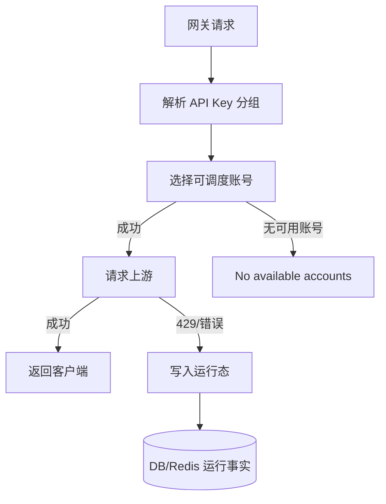
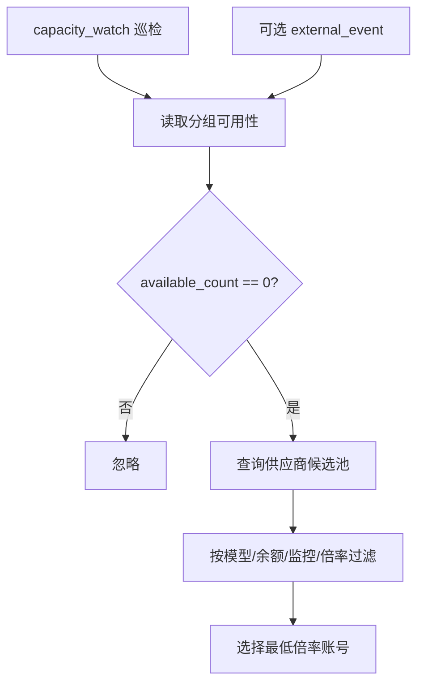
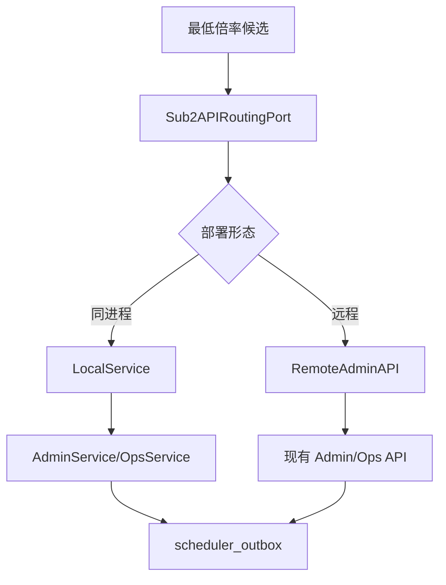
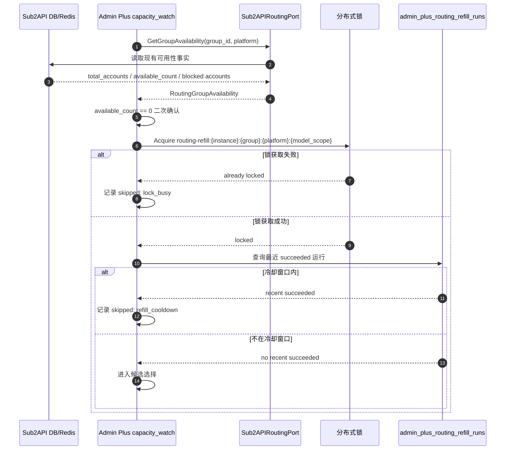
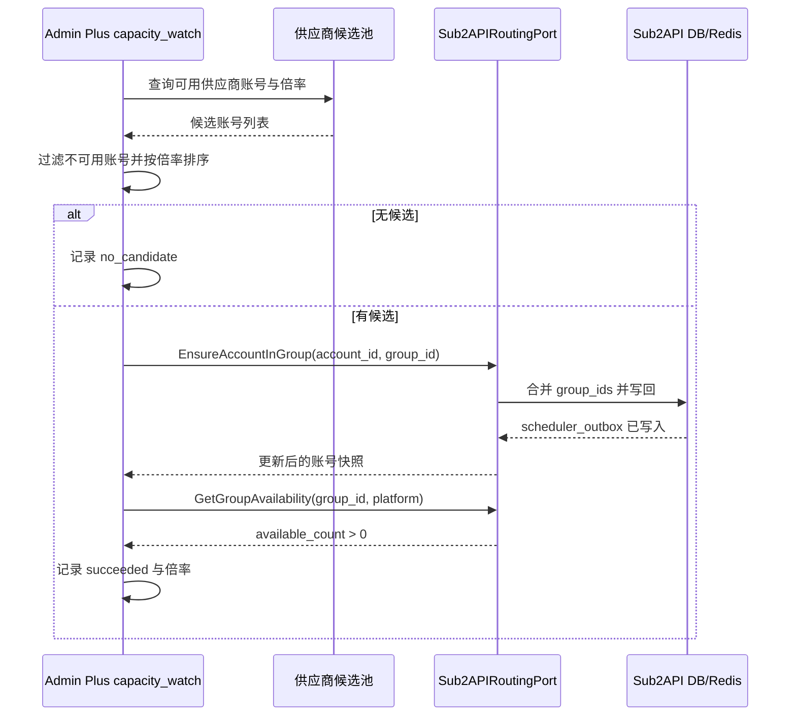
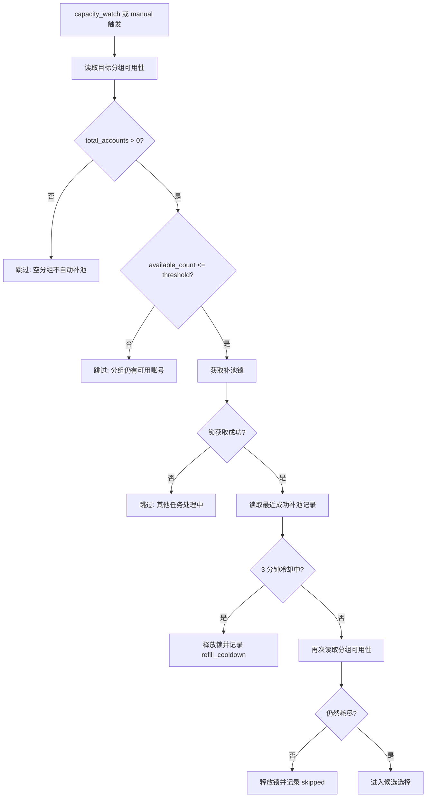
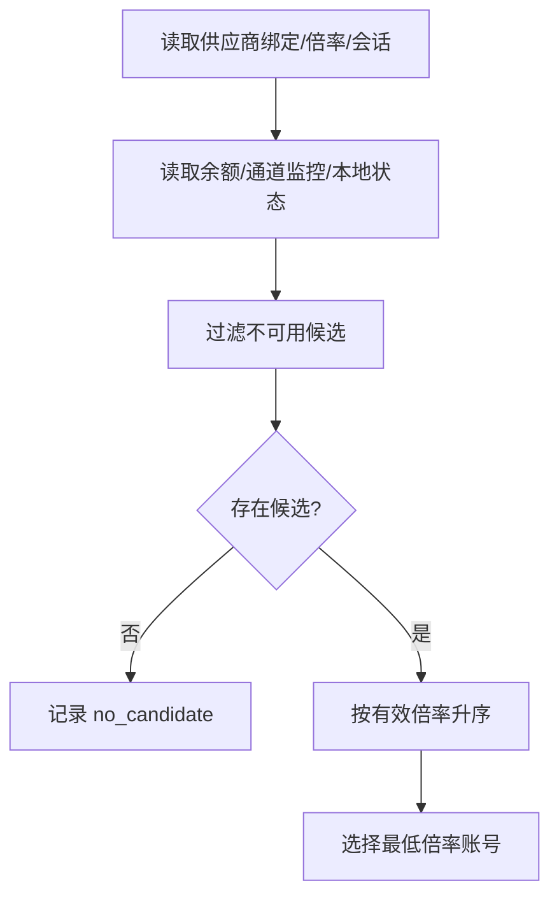

# Sub2API 网关调度耗尽与最低倍率补池方案

版本：v0.3.0
日期：2026-07-08
状态：路由补池专题详设；MVP 本地端口、手动补池、运行记录、同组锁和 3 分钟冷却已落地，自动执行器待实施
范围：只保留本地 Sub2API 分组耗尽后的补池触发、端口、算法、写回、坏账号关闭、测试和验收。供应商、账号、分组、数据库、运营页面的全局事实源统一放在 `supplier-architecture`。

相关架构文档：

- [../supplier-architecture/README.md](../supplier-architecture/README.md)：供应商管理、第三方令牌分组、本地账号和补池的全局关系。
- [../supplier-architecture/04-local-binding-routing.md](../supplier-architecture/04-local-binding-routing.md)：本地绑定、账号管理与路由补池边界。
- [../supplier-architecture/08-database-design.md](../supplier-architecture/08-database-design.md)：补池、drift、本地账号运营镜像和导入导出的数据库事实源。

## 1. 文件定位

本文件不再承担全局架构说明。全局对象关系、运营页面、数据库 ER、导入导出和表级数据流转，以 `supplier-architecture` 目录为准。

本文件只回答一个专题问题：

```text
当本地 Sub2API 某个已启用调度的分组没有可用账号时，
Admin Plus 如何在不修改 Sub2API upstream 的前提下，
从可用供应商候选池中补入最低倍率账号。
```

不在本文重复维护：

- 供应商、第三方分组、第三方 Key、本地账号、用户 API Key 的完整关系。
- Admin Plus 数据库设计和 ER 图。
- 运营中心、供应商详情、本地账号运营镜像的页面信息架构。
- 导入导出范围和敏感字段边界。

## 2. 设计结论

1. 不修改 `/Users/coso/Documents/dev/go/sub2api` upstream。
2. 触发点以“本地分组调度耗尽”为主，不把每个 429 都当补池触发。
3. Sub2API 是运行事实来源和最终调度执行方，不负责选择供应商。
4. Admin Plus 负责决策：读取本地可用性、评估供应商候选、选择最低倍率账号、通过端口写回。
5. 写本地调度只走 `Sub2APIRoutingPort`，不直接 SQL 改 `accounts/account_groups`。
6. 候选判断按成本排序：通道监控、余额和 Key 配额、本地状态、最后才是最小 token 实测。
7. 坏账号关闭调度必须谨慎；单次 429、单次 502、余额不足都不能直接永久关闭。
8. 所有补池和关调度动作必须加锁、幂等、可审计，并在写前重新读取本地状态防止覆盖原后台手工变更。

## 3. 现有 Sub2API 事实

从 `/Users/coso/Documents/dev/go/sub2api` 核对到的关键事实：

| 能力 | 现有位置 | 说明 |
|------|----------|------|
| 账号是否可调度 | `backend/internal/service/account.go` 的 `IsSchedulable()` | 会排除 inactive、`schedulable=false`、过期、429 窗口、过载、临时不可调度和额度耗尽 |
| 上游 429 处理 | `backend/internal/service/ratelimit_service.go` 的 `handle429()` | 会写入 `rate_limit_reset_at`，让账号在 reset 前不可调度 |
| 上游 502/传输错误处理 | `OpenAIGatewayService.handleOpenAIUpstreamTransportError()` 与各 gateway forward 路径 | 可作为 failover 错误处理；持久代理/网络故障会临时摘除账号 |
| 永久错误处理 | `RateLimitService.HandleUpstreamError()` / `SetError()` | 401/402/403/自定义错误等会让账号进入错误或关闭调度 |
| 临时不可调度 | `SetTempUnschedulable()` | 用于 OAuth 401、代理/网络故障、临时错误规则 |
| 网关 failover | `backend/internal/handler/failover_loop.go` | 同账号重试、失败账号排除、切换账号、耗尽处理 |
| 调度耗尽返回 | `gateway_handler_chat_completions.go` / `gateway_handler_responses.go` | 选择账号失败时返回 `No available accounts`；本方案不修改这些网关文件 |
| 可用性查询 | `GET /api/v1/admin/ops/account-availability` | 可按 `group_id` 和 `platform` 查询分组可用账号数 |
| 关闭调度 | `POST /api/v1/admin/accounts/:id/schedulable` | 设置 `schedulable=false` |
| 修改账号分组 | `AdminService.UpdateAccount()` / `PUT /api/v1/admin/accounts/:id` / `POST /api/v1/admin/accounts/bulk-update` | 使用 `group_ids` 绑定分组；当前是替换语义 |
| 调度快照刷新 | `scheduler_outbox` | 账号/分组变化会刷新网关调度快照 |

## 4. 专题适用场景

本文只覆盖三类路由动作：

| 场景 | 是否覆盖 | 说明 |
|------|----------|------|
| 本地分组 `available_count=0` | 是 | 从 Admin Plus 候选池补入最低倍率可用账号 |
| 坏账号关闭调度 | 是 | 只在永久错误或连续稳定故障时执行 |
| Sub2API 原后台手工切换后的 drift | 是 | 写前重读，发现 drift 先提示采纳或恢复 |
| 供应商接入、分组同步、Key 开通 | 否 | 见 `supplier-architecture/02-token-group-management.md` |
| 本地账号运营镜像页面设计 | 否 | 见 `supplier-architecture/05-operations-visualization.md` |
| 数据库 ER 和导入导出 | 否 | 见 `supplier-architecture/08-database-design.md` |

502 处理只作为路由补池的异常输入，需要先判断是哪一层返回：

| 类型 | 现象 | 是否能被 Sub2API 进程感知 | 处理方式 |
|------|------|----------------------------|----------|
| Cloudflare 到 Sub2API 源站 502 | 客户端看到 `cf-ray`，请求可能没有进入 Sub2API 进程 | 不能 | 由部署/源站健康监控处理，Admin Plus 只能通过外部探测发现 |
| Sub2API 网关到上游供应商 502 | Sub2API 进程已收到请求，上游返回或转发失败 | 能 | 进入 failover；连续发生时生成账号/供应商异常事件 |
| 代理/网络传输错误导致 502 | 上游 HTTP 往返未完成，例如 DNS、TCP、TLS、代理认证失败 | 能 | 对持久故障临时摘除账号，并触发补池评估 |
| 所有候选都因 502/failover 失败 | failover 耗尽后返回 502 | 能 | Admin Plus 通过可用性巡检、错误日志或健康检测推导补池评估 |

原则：

- 单次 502 不直接关闭账号调度。
- 同一账号连续 502，且错误指向代理、网络或供应商源站异常时，可进入临时不可调度。
- 同一分组所有候选都因 502/failover 失败时，可以触发补池评估。
- Cloudflare 到 Sub2API 源站的 502 不应归因到供应商账号，也不能依赖 Sub2API 内部状态捕获。

## 5. 总体架构

### 5.1 架构边界图

#### 5.1.1 Sub2API upstream 不改动



#### 5.1.2 Admin Plus 补池决策



#### 5.1.3 写回边界



### 5.2 自动补池时序图

#### 5.2.1 耗尽检测与加锁



#### 5.2.2 候选选择与写回



### 5.3 补池决策流程图

#### 5.3.1 触发判定



#### 5.3.2 候选选择



#### 5.3.3 写回与坏账号关闭

```mermaid
flowchart TD
    A[最低倍率账号] --> B{已在目标分组?}
    B -->|是| B1[记录 already_in_group]
    B -->|否| C[EnsureAccountInGroup]
    C --> D{写回成功?}
    D -->|否| D1[记录 failed]
    D -->|是| E[确认调度快照可见]
    E --> F{启用坏账号关闭?}
    F -->|否| F1[记录补池成功]
    F -->|是| G[评估坏账号]
    G --> H{满足关闭规则且有替代?}
    H -->|否| F1
    H -->|是| I[SetAccountSchedulable(false)]
    I --> J[记录原因和恢复入口]
```

## 6. MVP：Admin Plus 零侵入巡检方案

MVP 不修改 Sub2API 网关代码，也不新增 Sub2API API。新增代码只落在 Admin Plus 侧，通过端口适配复用现有能力完成闭环。

### 6.1 数据来源

首选本地同进程调用：

```go
OpsService.GetAccountAvailability(ctx, platform, &groupID)
```

当 Admin Plus 与 Sub2API 分离部署时，使用远程兼容实现：

```http
GET /api/v1/admin/ops/account-availability?group_id={group_id}&platform={platform}
```

返回中关注：

- `group[group_id].total_accounts`
- `group[group_id].available_count`
- `group[group_id].rate_limit_count`
- `group[group_id].error_count`
- `account[*].is_available`
- `account[*].is_rate_limited`
- `account[*].has_error`
- `account[*].temp_unschedulable_until`

供应商候选池来自 Admin Plus 本地事实：

- `admin_plus_supplier_accounts` 绑定投影。
- 供应商分组倍率快照。
- 供应商会话状态。
- 本地 Sub2API account id。
- 供应商通道监控快照。
- 余额和成本状态，余额不足要保留为充值候选。
- 最近主动实测结果，仅在通道监控缺失、过期、冲突或即将写回时使用。
- 本地账号来源映射：供应商、第三方分组、第三方 Key、本地账号 ID、有效倍率。

### 6.2 巡检策略

建议新增调度任务：

```text
local.sub2api.routing.capacity_watch
```

默认策略：

- 间隔：30 秒到 60 秒。
- 作用域：只监控已开启“自动补池”的目标分组。
- 超时：每个 Sub2API 实例 5 秒。
- 并发：按 Sub2API 实例限流。
- 去抖：同一 `{instance, group_id, platform, model_scope}` 3 分钟内只触发一次补池。

触发条件：

```text
total_accounts > 0
available_count == 0
```

可选增强：

```text
available_count <= min_available_threshold
```

例如低于 1 个可用账号时提前补池。

### 6.3 MVP 优点

- 不需要改 Sub2API。
- 不需要维护私有 Sub2API patch，Sub2API 升级风险低。
- 本地部署时可直接复用现有 service，避免为 Admin Plus 自己调用 HTTP API。
- 能快速验证“最低倍率补池”业务闭环。
- 失败不会影响网关请求热路径。
- 可以先在 Admin Plus 调度中心实现审计、重试和手动确认。

### 6.4 MVP 缺点

- 不是请求级实时触发。
- 不知道触发请求的具体模型，只能按分组/平台补池。
- 可能在调度耗尽后有几十秒空窗。
- 如果只能走 `UpdateAccount(group_ids)` 替换语义，需要依赖锁、重读和重试降低并发覆盖风险。

## 7. 触发信号设计：不改 Sub2API

本方案不在 Sub2API 网关中新增 hook。Admin Plus 统一把不同来源的事实转换为内部路由事件，再交给补池算法处理。

### 7.1 信号来源

| 来源 | 说明 | 是否修改 Sub2API | MVP 使用 |
|------|------|------------------|----------|
| `capacity_watch` | Admin Plus 定时读取分组可用性，发现 `available_count == 0` | 否 | 是 |
| `manual` | 运营在页面手动评估或执行补池 | 否 | 是 |
| `health_probe` | Admin Plus 自己的健康检测发现账号连续失败 | 否 | 可选 |
| `ops_fact` | 复用现有 Ops 可用性、错误状态、账号运行态字段 | 否 | 是 |
| `external_event` | 未来 Sub2API upstream 原生支持事件、或部署侧 sidecar 事件 | 否，对本项目只是接收 | 否 |

关键点：

- 不维护私有 Sub2API hook patch。
- 不把请求热路径和 Admin Plus 决策绑定。
- 即使未来接入外部事件，也必须再次读取 Sub2API 当前可用性确认，不能只凭事件直接补池。

### 7.2 Admin Plus 内部事件

`routing.capacity_exhausted.detected`：

```json
{
  "event": "routing.capacity_exhausted.detected",
  "event_id": "sub2api-main:12:openai:capacity_watch:202607081000",
  "source": "capacity_watch",
  "occurred_at": "2026-07-08T10:00:00Z",
  "sub2api_instance_id": "sub2api-main",
  "group_id": 12,
  "group_name": "Lime",
  "platform": "openai",
  "model_scope": "",
  "total_accounts": 2,
  "available_count": 0,
  "rate_limit_count": 1,
  "error_count": 1,
  "reason": "no_available_accounts"
}
```

`routing.account_blocked.detected`：

```json
{
  "event": "routing.account_blocked.detected",
  "event_id": "sub2api-main:account:94:capacity_watch:202607081000",
  "source": "capacity_watch",
  "occurred_at": "2026-07-08T10:00:00Z",
  "sub2api_instance_id": "sub2api-main",
  "account_id": 94,
  "group_ids": [12],
  "platform": "openai",
  "block_type": "rate_limit",
  "until": "2026-07-08T12:00:00Z",
  "reason": "upstream rate limit"
}
```

这些事件是 Admin Plus 内部审计和幂等模型，不要求 Sub2API 发送 webhook。

### 7.3 外部事件适配原则

如果未来 Sub2API upstream 原生支持 webhook，或部署侧通过网关日志/sidecar 产生事件，只新增 Admin Plus 的 `ExternalRoutingEventAdapter`：

1. 校验来源、签名和时间窗口。
2. 转换为 Admin Plus 内部事件。
3. 调用 `Sub2APIRoutingPort.GetGroupAvailability()` 二次确认。
4. 进入同一个补池锁和幂等流程。

该适配器不得要求修改 Sub2API 网关代码。

## 8. Admin Plus 补池算法

### 8.1 候选过滤

候选账号必须同时满足：

- 供应商启用。
- 供应商会话可用或该账号已在本地可用。
- 本地 Sub2API account id 存在。
- 本地账号 `status=active`。
- 本地账号未处于 429、overload、temp unschedulable。
- 本地账号未在目标分组中。
- 支持目标 platform。
- 支持目标模型或模型路由规则。
- 余额状态不是 `balance_blocked/recharge_required`；余额不足的低倍率账号保留为充值候选，但不自动补池。
- 供应商通道监控推荐，或监控缺失/过期时被策略允许进入人工确认。
- 主动实测未失败；实测只在通道监控缺失、过期、冲突或即将自动写回时执行。
- 最近没有连续 502/源站异常/代理传输错误。
- 未被人工标记为禁止自动补池。

候选过滤优先级：

```text
本地账号绑定
  -> 本地调度状态
  -> 余额状态
  -> 供应商通道监控
  -> 必要时最小 token 实测
  -> 倍率排序
```

排除原因必须可见：

| 原因 | 处理 |
|------|------|
| `balance_blocked` | 保留低倍率机会，提示充值后重算，不归类为渠道不可用 |
| `channel_monitor_failed` | 不自动补池，可人工确认或等待恢复 |
| `health_failed` | 实测失败后排除，可按策略关调度 |
| `local_unschedulable` | 读取 Sub2API 当前状态后排除 |
| `supplier_session_invalid` | 提示重新登录或插件上报 |

### 8.2 排序规则

默认排序：

1. 有效倍率低。
2. 当前可用。
3. 最近成功时间近。
4. 延迟低。
5. 余额更健康。
6. 同供应商补池次数少。
7. 创建时间早，作为稳定 tie-breaker。

有效倍率口径：

```text
effective_rate = supplier_group_rate * local_account_rate_multiplier * model_rate_adjustment
```

如果某个倍率缺失：

- 缺供应商倍率：不作为自动补池候选，除非策略允许未知倍率。
- 缺本地账号倍率：按 1.0。
- 缺模型倍率：按分组默认倍率。

### 8.3 幂等与锁

补池前必须获取锁：

```text
routing-refill:{sub2api_instance_id}:{group_id}:{platform}:{model_scope}
```

当前同库实现：

```text
PostgreSQL advisory lock，按 local_group_id 跨进程互斥，函数返回时释放。
```

多实例或远程实现仍需要可过期分布式锁，建议 TTL：

```text
60s
```

真实补池 apply 在获取锁后读取同一 `local_group_id` 最近成功运行记录；默认 3 分钟内已有 `succeeded` 时，直接记录 `skipped/refill_cooldown`。dry-run 不检查冷却，运营可随时预览候选。

补池完成后记录 `admin_plus_routing_refill_runs`，字段建议：

| 字段 | 说明 |
|------|------|
| id | run id |
| trigger_type | `capacity_watch` / `external_event` / `manual` |
| event_id | Admin Plus 内部事件 id |
| sub2api_instance_id | Sub2API 实例 |
| group_id | 目标分组 |
| platform | 平台 |
| model | 请求模型或模型范围 |
| before_available_count | 补池前可用数 |
| selected_supplier_id | 选中的供应商 |
| selected_account_id | 本地 Sub2API account id |
| selected_effective_rate | 有效倍率 |
| action | `add_account_to_group` |
| status | `succeeded` / `failed` / `skipped` |
| reason | 失败或跳过原因 |
| created_at | 创建时间 |

### 8.4 写回本地调度

写回优先级：

1. 本地同进程：Admin Plus 的 `LocalServiceSub2APIRoutingPort` 调用现有 `AdminService` / `OpsService`。
2. 远程部署：`RemoteAdminAPIRoutingPort` 调用现有 Sub2API Admin/Ops API。
3. 只读共享状态：允许读取 DB/Redis 辅助判断，但不允许直接手写 SQL 改 `accounts`、`account_groups` 等核心表。

MVP 本地写回流程：

1. 获取 `routing-refill:{instance}:{group_id}:{platform}:{model_scope}` 分布式锁。
2. 调用 `AdminService.GetAccount(ctx, accountID)` 读取当前账号和分组。
3. 如果账号已在目标分组中，直接返回成功。
4. 合并当前 `group_ids` 和目标 `group_id`。
5. 调用 `AdminService.UpdateAccount(ctx, accountID, &UpdateAccountInput{GroupIDs: &mergedGroupIDs})`。
6. 依赖现有 `BindGroups()` 写 `scheduler_outbox`，让调度快照刷新。
7. 重新读取账号确认目标分组已存在。

注意：

- `UpdateAccount(group_ids)` 是替换语义，必须在 Admin Plus 补池锁内执行，并在写后重读确认。
- 不新增 Sub2API API，不要求 upstream 接受 `POST /accounts/:id/groups/:group_id` 之类的追加接口。
- 如果后续在 Admin Plus 内部需要更强幂等，可以新增 Admin Plus 自己的 `EnsureAccountInGroup()` service 包装；底层仍调用现有 Sub2API service/repository 能力，不修改 Sub2API upstream。

### 8.5 表级数据流转摘要

| 阶段 | 读表/事实 | 写表/动作 |
|------|-----------|-----------|
| 容量巡检 | Sub2API `accounts`、`groups`、`account_groups`、运行态缓存 | `admin_plus_scheduler_runs/steps` 或内部 run 记录 |
| 候选评估 | `admin_plus_suppliers`、`admin_plus_supplier_groups`、`admin_plus_supplier_keys`、`admin_plus_supplier_accounts`、`admin_plus_supplier_channel_check_snapshots`、`admin_plus_balance_snapshots` | `admin_plus_scheduler_actions` 或 `admin_plus_routing_refill_runs` dry-run |
| 写回补池 | Sub2API 当前账号分组快照 | 通过 `Sub2APIRoutingPort` 写 Sub2API `account_groups` / `scheduler_outbox` |
| 执行记录 | 写回前后可用性、选中供应商、倍率、失败原因 | `admin_plus_routing_refill_runs`、`admin_plus_action_executions`、业务日志 |
| 原后台 drift | Sub2API 原后台当前 `accounts/account_groups` | `admin_plus_local_account_drift_events`、`admin_plus_supplier_accounts` 同步快照 |

## 9. 坏账号关闭调度策略

不能把所有 429 都关闭调度。429 默认只是限流窗口，由 Sub2API 的 `rate_limit_reset_at` 自动恢复。

### 9.1 可以自动关闭调度的情况

满足任一条件时可关闭 `schedulable=false`：

- 账号 `status=error`，错误为认证、403、工作区停用、组织禁用等永久错误。
- 同一账号连续多次触发长窗口 429，且窗口超过策略阈值，例如 1 小时。
- 同一账号连续多次触发 502，且错误稳定指向同一供应商源站、代理或网络链路。
- `temp_unschedulable_reason` 多次出现 proxy、network、token refresh exhausted 等稳定故障。
- 健康检测连续失败超过阈值。
- Admin Plus 已经补入替代账号，关闭不会导致目标分组继续空池。
- 运营策略明确要求“低倍率坏账号自动关调度”。

### 9.2 不应自动关闭调度的情况

- 单次 429。
- 单次 502。
- Cloudflare 到 Sub2API 源站的 502。
- 429 reset 时间很短，例如小于 5 分钟。
- 并发槽位满导致的等待失败。
- 供应商余额不足、Key 配额不足、未开通 Key 或本地 drift 未处理。

### 9.3 当前实现状态

当前阶段只生成动作建议，不自动关闭调度：

- 动作类型：`local_account.schedule.disable`。
- 触发来源：调度中心读取本地账号运营镜像后的 `CandidateEvaluator` 结果。
- 触发条件：本地账号仍 `schedulable=true`、已绑定至少一个本地分组、候选评估为 `blocked`，且 `blocked_reason` 为 `channel_monitor_failed` 或 `channel_active_probe_failed`。
- 排除条件：余额不足、Key 配额不足、未开通 Key、drift、已关调度、未绑定本地分组。
- 操作方式：今日工作台或智能动作跳转本地账号运营页，并带账号 ID 查询；真正关闭调度仍需运营在本地账号运营页 preview/apply。
- 上游 5xx 瞬时错误。
- 供应商余额不足但仍是低倍率优质渠道。
- Admin Plus 无法确认已有替代账号。

### 9.3 关闭动作

本地同进程调用：

```go
Sub2APIRoutingPort.SetAccountSchedulable(ctx, accountID, false, reason)
```

远程部署时降级调用现有 API：

```http
POST /api/v1/admin/accounts/:id/schedulable
Content-Type: application/json

{
  "schedulable": false
}
```

Admin Plus 必须记录：

- 关闭来源：自动/人工。
- 关闭原因。
- 触发事件。
- 关闭前所属分组。
- 是否已有替代账号。
- 是否允许自动恢复。

## 10. 页面边界

完整页面信息架构、本地账号运营镜像列定义和原后台备选操作体验，以 [../supplier-architecture/05-operations-visualization.md](../supplier-architecture/05-operations-visualization.md) 为准。

本文只保留路由补池专题需要的策略配置：

| 配置 | 默认值 | 说明 |
|------|--------|------|
| enabled | false | 是否启用自动补池 |
| routing_port | local_service | `local_service` / `remote_admin_api` |
| trigger_mode | capacity_watch | `capacity_watch` / `external_event` / `hybrid` |
| watch_interval_seconds | 60 | 巡检间隔 |
| min_available_threshold | 0 | 可用账号低于等于该值触发 |
| max_accounts_per_group | 3 | 单个分组最多自动补入数量 |
| cooldown_minutes | 3 | 同一分组补池冷却 |
| allow_unknown_rate | false | 是否允许未知倍率候选 |
| auto_disable_bad_accounts | false | 是否自动关闭坏账号调度 |
| require_manual_approval | true | 是否补池前需要人工确认 |

## 11. 接口与端口设计

补池算法只依赖 Admin Plus 内部端口，不直接依赖 HTTP、SQL 或具体 Sub2API service。

```go
type Sub2APIRoutingPort interface {
	GetGroupAvailability(ctx context.Context, groupID int64, platform string) (*RoutingGroupAvailability, error)
	GetAccount(ctx context.Context, accountID int64) (*Sub2APIAccountSnapshot, error)
	EnsureAccountInGroup(ctx context.Context, accountID int64, groupID int64) (*Sub2APIAccountSnapshot, error)
	SetAccountSchedulable(ctx context.Context, accountID int64, schedulable bool, reason string) (*Sub2APIAccountSnapshot, error)
}
```

实现：

| 实现 | 适用场景 | 读可用性 | 写分组/调度 |
|------|----------|----------|-------------|
| `LocalServiceSub2APIRoutingPort` | Admin Plus 与 Sub2API 同进程、同仓库运行 | `OpsService.GetAccountAvailability()` | `AdminService.GetAccount()` + `AdminService.UpdateAccount()` + `AdminService.SetAccountSchedulable()` |
| `RemoteAdminAPIRoutingPort` | Admin Plus 独立部署或管理远程 Sub2API | 现有 `GET /api/v1/admin/ops/account-availability` | 现有 `GET/PUT /api/v1/admin/accounts/:id`、`POST /api/v1/admin/accounts/:id/schedulable` |
| `SharedStateReadPort` | 只需要辅助读取共享 DB/Redis 状态 | 只读 SQL/Redis | 不写核心表 |

Admin Plus 内部 API：

| API | 说明 |
|-----|------|
| `GET /adminplus/routing/refill/settings` | 读取补池设置 |
| `PUT /adminplus/routing/refill/settings` | 更新补池设置 |
| `POST /adminplus/routing/refill/evaluate` | 手动评估某个分组候选 |
| `POST /adminplus/routing/refill/run` | 手动执行补池 |
| `GET /adminplus/routing/refill/runs` | 补池运行记录 |
| `POST /adminplus/routing/events/external` | 可选接收外部路由事件，不要求 Sub2API 修改 |

不新增 Sub2API API。后续若 upstream 原生提供追加分组 API 或 webhook，只作为 `RemoteAdminAPIRoutingPort` / `ExternalRoutingEventAdapter` 的可选能力接入。

## 12. 分阶段实施计划

### 阶段 1：MVP 本地端口巡检补池

目标：不改 Sub2API，先让业务跑起来。

任务：

1. 在 Admin Plus 增加路由补池设置。
2. 增加 `Sub2APIRoutingPort` 与 `LocalServiceSub2APIRoutingPort`。
3. 增加 `local.sub2api.routing.capacity_watch` 调度任务。
4. 通过 `OpsService.GetAccountAvailability()` 识别耗尽分组。
5. 基于 Admin Plus 供应商/绑定/倍率事实选择最低倍率候选。
6. 通过 `EnsureAccountInGroup()` 将候选账号加入分组。
7. 生成运行记录和智能动作。
8. 对同一分组真实补池写入加 PostgreSQL advisory lock，并用最近成功运行记录做 3 分钟冷却。

验收：

- 目标分组 `available_count=0` 时能产生补池动作。
- 能选出最低有效倍率候选。
- 执行后目标分组可用账号数增加。
- 同一分组不会重复补入同一账号。
- 同一分组短时间重复 apply 会返回 `refill_cooldown`，dry-run 仍可预览。
- 失败可重试、有审计。

### 阶段 2：坏账号关闭调度

目标：在补池成功后，按策略关闭坏倍率账号调度。

任务：

1. 建立坏账号判断规则。
2. 增加自动关闭开关和人工确认模式。
3. 调用 `Sub2APIRoutingPort.SetAccountSchedulable()`。
4. 记录关闭原因和恢复入口。

验收：

- 单次 429 不会被关闭调度。
- 永久错误账号可被关闭调度。
- 关闭前会确认目标分组已有可用替代账号。
- 人工可以恢复调度。

### 阶段 3：外部事件适配与远程端口

目标：不修改 Sub2API 的前提下，支持远程 Sub2API 和未来 upstream 原生事件。

任务：

1. 增加 `RemoteAdminAPIRoutingPort`，复用现有 Admin/Ops API。
2. 增加 `ExternalRoutingEventAdapter`，只接收外部事件并转换为内部事件。
3. 增加 HMAC 签名、时间窗口、幂等和日志。
4. 事件触发后仍通过 `GetGroupAvailability()` 二次确认。
5. 支持 `hybrid` 模式：外部事件加速触发，巡检兜底。

验收：

- 远程 Sub2API 能通过现有 Admin/Ops API 完成补池闭环。
- 外部事件重复发送不会重复补池。
- 外部事件不可用时巡检仍能兜底。
- 任何外部事件都不会要求维护私有 Sub2API patch。

### 阶段 4：模型级与成本优化

目标：按模型/协议精确补池，降低误补。

任务：

1. 将请求模型纳入候选过滤。
2. 计算模型级有效倍率。
3. 接入健康检测延迟和成功率。
4. 支持每个分组的候选上限和供应商分散策略。

验收：

- GPT、Claude、Gemini、Grok 等不同协议能按模型选择候选。
- 候选排序稳定且可解释。
- 不会把不支持目标模型的账号补入分组。

## 13. 风险与约束

| 风险 | 处理 |
|------|------|
| 并发重复补池 | 使用同组锁、运行记录和冷却窗口幂等 |
| 误关账号调度 | 默认关闭自动关调度，先生成动作建议 |
| 现有 `UpdateAccount(group_ids)` 是替换语义 | Admin Plus 端口内加锁、重读、合并、写后确认和失败重试 |
| 维护私有 Sub2API patch 影响升级 | 禁止修改 Sub2API 网关和核心 service，新增代码只落在 Admin Plus 侧 |
| 内部 service 版本耦合 | 用 `Sub2APIRoutingPort` 隔离，端口适配器覆盖单元测试和集成测试 |
| 直接写共享 DB 绕过 outbox | 禁止直接 SQL 改核心调度表，写操作走 service 或现有 Admin API |
| 补入账号仍不可用 | 补池前优先看会话、通道监控、余额和本地状态，必要时才触发最小 token 实测 |
| 原后台手工改动被覆盖 | 写回前重新读取 Sub2API 当前状态，发现 drift 先提示采纳或恢复 |
| 原后台账号难以识别来源 | Admin Plus 提供本地账号运营镜像、账号 ID、短名称、供应商、第三方分组和倍率对照 |
| 供应商倍率不准 | 使用最近一次同步快照，过期则不自动补池 |
| 巡检延迟 | 关键分组缩短巡检间隔，外部事件只作为加速输入 |
| 网关热路径被拖慢 | 不在网关热路径新增 Admin Plus 调用 |
| 跨系统权限风险 | 本地同进程优先；远程 API 使用专用 token，Admin Plus 脱敏存储 |

## 14. 测试用例

### 14.1 单元测试

- 候选过滤：排除不可用、限流、错误、未绑定、未知倍率账号。
- 候选过滤：余额不足账号进入 `balance_blocked`，不自动补池但保留充值候选。
- 候选过滤：通道监控失败不触发默认实测，除非策略明确允许。
- 候选排序：最低倍率优先，tie-breaker 稳定。
- 幂等：同一个 event 不重复补池。
- 坏账号判断：单次 429 不关闭，永久错误可关闭。
- 分组合并：保留原有 group_ids，只追加目标 group。
- 冷却窗口：同一分组最近成功补池在默认 3 分钟内时，apply 跳过并记录 `refill_cooldown`，dry-run 不受影响。
- 端口适配：`LocalServiceSub2APIRoutingPort` 写回后会触发调度刷新路径。
- drift 检测：Sub2API 原后台改动分组或调度后，Admin Plus 能检测并提示采纳。

### 14.2 集成测试

- 模拟 Sub2API `available_count=0`，Admin Plus 生成补池动作。
- 执行补池后，Sub2API 账号分组包含目标 group。
- 补池成功后，调度快照最终可见。
- 在 Sub2API 原后台手工切换账号分组后，Admin Plus 同步本地状态能看到 drift。
- 外部事件重复发送只执行一次。
- 外部事件不可用时巡检兜底。
- 连续上游 502/failover 相关健康检测失败时生成内部阻塞事件，单次 502 不补池。

### 14.3 人工验收

- 在 Sub2API 后台关闭目标分组全部账号调度。
- Admin Plus 在一个巡检周期内发现耗尽。
- 页面展示最低倍率候选和原因。
- 本地账号运营镜像能按 `Lime` 筛选，同时显示供应商、第三方分组和有效倍率。
- 从 Admin Plus 能复制或打开 Sub2API 原后台账号定位信息。
- 点击执行后，目标分组出现新账号。
- 重新发起请求，网关不再返回 `No available accounts`。
- 将某个坏账号标记为关闭调度后，Sub2API 后台显示调度开关关闭。

## 15. 最小可交付定义

MVP 完成标准：

1. Admin Plus 可配置要监控的 Sub2API 分组。
2. Admin Plus 可检测目标分组 `available_count=0`。
3. Admin Plus 可从绑定供应商账号中选出最低倍率可用账号。
4. Admin Plus 可把该账号加入目标分组。
5. Admin Plus 有补池运行记录和失败原因。
6. 默认不自动关闭坏账号调度，只生成动作建议。

v1 完成标准：

1. Admin Plus 支持远程 Sub2API 的现有 Admin/Ops API 端口。
2. Admin Plus 能消费可选外部事件并幂等触发补池评估。
3. 巡检作为外部事件兜底保留。
4. 可按策略自动关闭坏账号调度。
