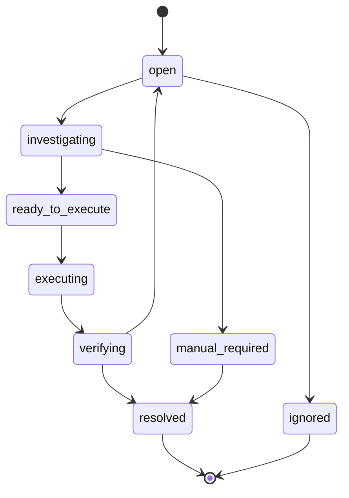
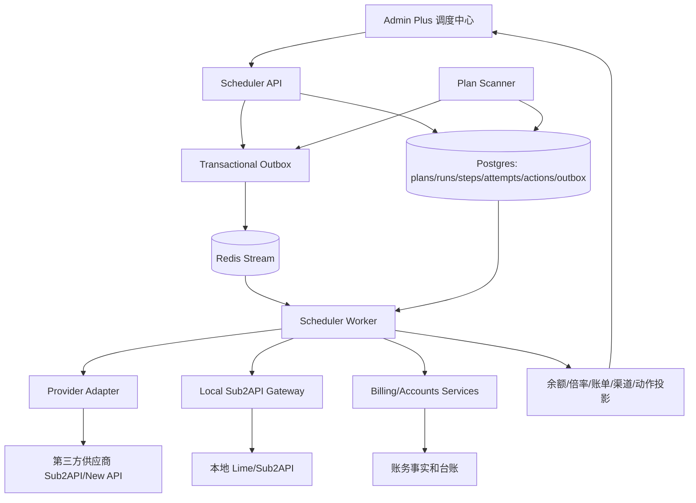
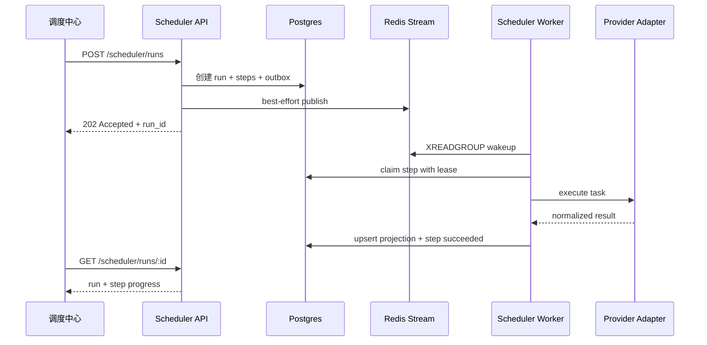
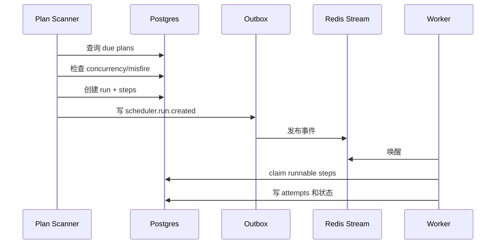
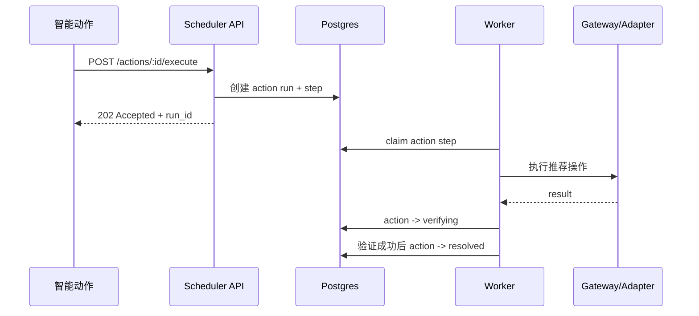
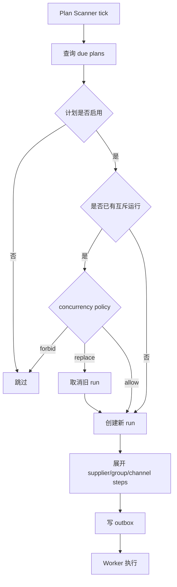
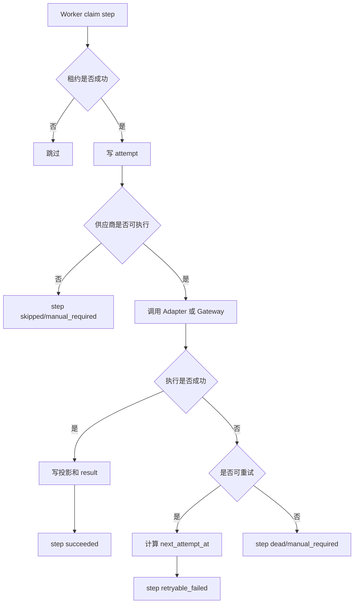
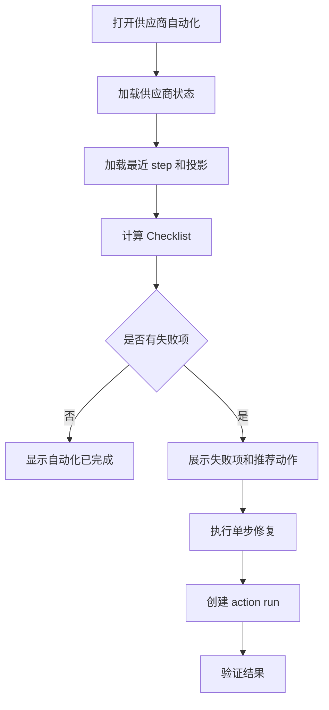

# Admin Plus 调度中心 PRD

版本：v0.1.0
日期：2026-06-23
状态：部分实施，持续迭代
范围：供应商运营自动化调度中心、采集计划、运行审计、供应商自动化矩阵、智能动作、全局设置、异步 Worker 与 Provider Adapter 编排。

## 目录

1. 背景
2. 设计结论
3. 目标与收益
4. 用户角色
5. 调度中心边界
6. 供应商功能调度化清单
7. 页面信息架构
8. UI/UX 交互形态
9. 工作台 Dashboard
10. 计划配置
11. 运行记录
12. 供应商自动化矩阵
13. 智能动作
14. 全局设置
15. 后端调度模型
16. 任务类型与默认策略
17. 智能化策略
18. 数据模型
19. API
20. 架构图
21. 核心时序图
22. 核心流程图
23. 错误码与重试策略
24. 权限、安全与审计
25. 测试用例
26. 验收标准
27. 分阶段实施计划
28. 外部最佳实践映射

## 1. 背景

当前 `/admin/collection/scheduler` 只是一个手动触发采集的页面。它可以选择供应商、窗口分钟和若干采集类型，然后立即返回一次性预检或执行结果。

这个设计无法支撑 Admin Plus 当前业务：

- 供应商功能越来越多：余额、分组、倍率、充值账单、兑换账单、用量、公告、会话、渠道检测、加入本地调度、成本对账。
- 很多任务不是一次性按钮，而是需要周期执行、错过补采、失败重试、人工介入和审计。
- 渠道检测会消耗 token，不能和普通只读采集混在同一个简单调度里。
- 供应商自动化需要回答“有没有跑、为什么没跑、谁失败、能不能重试、是否需要人工处理”。
- 现有页面只有平铺卡片和表格，缺少步骤式配置、Checklist、状态机处理等更适合后台运营的交互。

因此，调度中心应升级为 Admin Plus 的供应商运营自动化中枢，而不是继续作为“采集按钮页”存在。

## 2. 设计结论

1. 调度中心是 Admin Plus 供应商运营自动化的统一入口。
2. 调度中心不替代供应商详情页、成本对账页和本地 Sub2API 管理页，而是负责计划、触发、运行、重试、审计和智能动作。
3. 所有供应商功能都必须可以被调度中心自动化：采集、对账、会话维护、渠道检测、加入本地调度和异常修复。
4. HTTP 请求只提交调度意图，不在请求线程内执行第三方采集。
5. Postgres 是任务事实源；Redis Stream 只做 Worker 唤醒和快速事件通道。
6. Worker 必须支持幂等、租约、重试、退避、重启恢复、失败分类和人工介入。
7. 页面不能只使用平铺式面板。不同任务应使用不同交互形态。
8. 渠道健康检测默认关闭，因为它会产生 token 成本。
9. v1 真实执行优先支持 `sub2api` 类型供应商，`new-api` 按已有 Provider Adapter 能力逐步接入。

治理分类：

- `current`：Provider Adapter 直连采集、Provision Worker 异步底座、供应商分组同步、余额快照、费率快照、usage 成本采集、成本任务异步化。
- `current-target`：调度中心专用 plan/run/step/attempt 模型，统一承载供应商自动化。
- `compat`：旧 `/admin/collection/scheduler` 路由重定向到新调度中心；旧 `/scheduler/run` API 兼容提交 run。
- `deprecated`：内存 ticker 直接同步执行所有采集；页面一次性展示预检结果作为主体验。
- `dead`：插件解析并上报业务采集结果作为主事实源。

当前实现记录（2026-06-23）：

- 已新增 current 入口 `/admin/scheduler`，旧 `/admin/collection/scheduler` 和 `/admin/operations/scheduler` 只做兼容重定向。
- 已删除旧单页表单 `SchedulerView.vue`，前端 current 页面为调度中心工作台。
- 已新增调度中心 API：`/scheduler/center/status`、`/scheduler/plans`、`/scheduler/runs`、`/scheduler/runs/:id`、`/scheduler/runs/:id/cancel`、`/scheduler/runs/:id/retry-failed`、`/scheduler/steps`、`/scheduler/steps/:id/retry`、`/scheduler/steps/:id/cancel`、`/scheduler/suppliers/status`、`/scheduler/suppliers/:id/checklist`、`/scheduler/actions`、`/scheduler/settings`。
- 已接入真实 Provider Adapter 同步能力作为第一阶段执行器，手动 run 会写入 `admin_plus_scheduler_runs` 和 `admin_plus_scheduler_steps`，并展示在运行记录和运行详情中。
- 已新增 `admin_plus_scheduler_plans`、`admin_plus_scheduler_attempts`、`admin_plus_scheduler_actions` 和 `admin_plus_scheduler_settings` 表，计划、attempt、智能动作和设置均进入当前事实源。
- 已新增 DB claim Worker、step lease、attempt 记录、run 取消、step 取消和失败 step 重新入队能力；Redis Stream 唤醒仍作为后续增强，当前 Worker 依赖 DB polling 推进。
- 已新增供应商 Checklist 弹窗，按现有供应商事实展示基础信息、URL、会话、余额、充值倍率、充值入口、分组、倍率、账务、渠道检测和本地调度状态。
- 已新增通知中心入口 `/admin/scheduler/notifications`，支持飞书配置、测试诊断、业务规则、防打扰、投递记录、失败投递重试和抑制记录审计；余额、健康、费率、公告、对账异常和系统测试事件均已接入。
- 未完成项：计划编辑向导持久保存、Redis Stream 唤醒。

## 3. 目标与收益

目标：

1. 让运营能在一个地方看到供应商自动化是否正常。
2. 让所有供应商功能可计划、可暂停、可重试、可审计。
3. 让成本型检测具备预算、频率和风险控制。
4. 让新供应商接入有 Checklist，不再依赖人工记忆。
5. 让失败处理变成状态机单步操作，而不是在多个页面找按钮。
6. 为后续多 Worker、多供应商类型、多任务优先级打基础。

收益：

- 运营能快速发现余额不足、会话失效、账单采集失败、渠道不可用和调度绑定缺失。
- 财务能依赖稳定的账单采集和对账调度。
- 技术排障能按 run/step/attempt 追踪失败链路。
- 高成本探测有预算和频率控制，避免无意识消耗 token。
- 后续新增供应商类型时只需要补 Adapter 和调度任务映射，不重做页面。

## 4. 用户角色

| 角色 | 关注点 | 典型操作 |
|------|--------|----------|
| 运营 | 供应商状态、自动化完成度、渠道可用性 | 查看工作台、处理智能动作、补采失败任务 |
| 财务 | 充值、兑换、usage、余额差异 | 查看账单采集计划、重跑成本对账 |
| 管理员 | 调度策略、权限、预算、Worker 状态 | 配置计划、暂停供应商、设置 token 预算 |
| 技术排障人员 | run/step/attempt、错误码、外部接口失败 | 查看运行详情、重试 step、定位 Adapter 问题 |

## 5. 调度中心边界

调度中心负责：

- 调度计划配置。
- 任务运行和步骤执行事实。
- 供应商自动化状态汇总。
- 失败重试、暂停、恢复和人工处理入口。
- 智能动作生成和处理。
- 高成本任务预算和风险控制。
- 与 Provider Adapter、Sub2API Gateway、成本对账服务、供应商服务协作。

调度中心不负责：

- 直接展示完整供应商业务详情。
- 直接承载财务报表和闭账。
- 直接修改账务历史事实。
- 直接保存供应商 cookie、token、key 明文。
- 替代 Provider Adapter 解析第三方私有响应。
- 替代本地 Sub2API 的调度分组管理后台。

## 6. 供应商功能调度化清单

每个供应商功能都要支持调度中心的统一能力：计划、手动触发、运行记录、失败重试、状态展示、审计。

| 业务能力 | 调度任务 | 默认策略 | 说明 |
|----------|----------|----------|------|
| 余额刷新 | `supplier.balance.sync` | 默认开启，10 分钟 | 读取供应商用户侧 profile 或余额接口 |
| 分组同步 | `supplier.groups.sync` | 默认开启，1 小时 | 同步供应商分组、渠道、协议和状态 |
| 使用倍率同步 | `supplier.rates.sync` | 默认开启，1 小时 | 读取渠道使用倍率和模型倍率 |
| 充值倍率识别 | `supplier.recharge_rate.sync` | 默认开启，1 小时 | 识别实际支付金额和显示额度关系 |
| 充值账单采集 | `supplier.funding_orders.sync` | 默认开启，30 分钟 | 采集充值订单，支持分页和补采 |
| 兑换账单采集 | `supplier.redeem_orders.sync` | 默认开启，30 分钟 | 采集兑换记录，支持错误修正重采 |
| 用量消耗采集 | `supplier.usage_costs.sync` | 默认开启，1 小时 | 采集 supplier usage 成本明细 |
| 公告/充值入口采集 | `supplier.announcements.sync` | 默认开启，1 小时 | 采集公告、通知和充值入口 |
| 会话探测 | `supplier.session.probe` | 默认开启，30 分钟 | 判断会话是否可用和 capability 是否完整 |
| 后端直登刷新会话 | `supplier.session.login` | 默认关闭，按异常触发 | 会话失效后可自动或人工触发 |
| 渠道健康检测 | `supplier.channels.check` | 默认关闭 | 消耗 token，按预算执行 |
| 最低有效倍率评估 | `supplier.best_rate.evaluate` | 默认开启，依赖倍率数据 | 计算 OpenAI/Claude/Gemini 协议下最低有效倍率 |
| 加入本地调度 | `local.sub2api.schedule.ensure` | 手动或策略触发 | 将可用渠道加入本地 Lime/OpenAI 调度分组 |
| 失效自动移除 | `local.sub2api.schedule.remove_invalid` | 默认关闭 | 连续检测失败后移除本地调度 |
| 成本对账 | `supplier.costs.reconcile` | 默认开启，按小时或日 | 生成或刷新成本台账与快照 |
| 初始采集 | `supplier.initial_collection.enqueue` | 事件触发 | 新供应商或 provision job 完成后触发 |

## 7. 页面信息架构

推荐导航：

```text
运营中心
  调度中心
    工作台
    计划配置
    运行记录
    供应商自动化
    智能动作
    全局设置
```

路由建议：

| 页面 | 路由 | 说明 |
|------|------|------|
| 工作台 | `/admin/scheduler` | 默认入口 |
| 计划配置 | `/admin/scheduler/plans` | 创建和编辑自动化计划 |
| 运行记录 | `/admin/scheduler/runs` | run 和 step 审计 |
| 供应商自动化 | `/admin/scheduler/suppliers` | Checklist 和状态矩阵 |
| 智能动作 | `/admin/scheduler/actions` | 系统建议和单步处理 |
| 全局设置 | `/admin/scheduler/settings` | Worker、预算、告警和默认策略 |

兼容路由：

- `/admin/collection/scheduler` 重定向到 `/admin/scheduler`。
- `/admin/operations/scheduler` 继续兼容重定向。

## 8. UI/UX 交互形态

### 8.1 交互形态分类

调度中心必须混合使用多种交互形态：

| 形态 | 适用场景 | 在调度中心中的位置 |
|------|----------|--------------------|
| 后台工作台式 | 日常运营、风险处理、看整体状态 | 工作台首页 |
| 平铺式面板 | 少量关键摘要指标 | 工作台顶部摘要 |
| 步骤式向导 | 创建或编辑复杂计划 | 计划配置抽屉 |
| 状态机单步操作 | 失败处理、智能动作、人工介入 | 运行详情、智能动作 |
| Checklist | 新供应商接入、单供应商自动化完成度 | 供应商自动化 |
| 命令式极简按钮 | 高频明确动作 | 表格行操作、单元格快捷操作 |
| 表格和矩阵 | 大量对象扫描、筛选和排序 | 运行记录、供应商自动化 |
| 抽屉详情 | 不离开当前列表查看细节 | run、step、供应商 Checklist |

### 8.2 使用规则

- Dashboard 不能堆满所有卡片，只展示运营最需要的状态和待办。
- 计划配置不能做成长表单，必须使用步骤式向导。
- 供应商接入和自动化完成度必须使用 Checklist。
- 失败处理必须按状态机展示当前可执行动作。
- 高频动作使用极简按钮，次要动作进入更多菜单。
- 高成本动作必须显示预算和确认。
- 危险动作必须二次确认。
- 空态必须说明下一步，不显示无意义空白。
- 错误态必须给出错误码、原因、影响和可执行动作。

## 9. 工作台 Dashboard

工作台用于回答三个问题：

1. 系统有没有正常运行。
2. 今天有哪些供应商风险。
3. 现在最应该处理什么。

### 9.1 页面布局

推荐布局：

- 顶部：系统健康条。
- 左侧：今日待办和风险队列。
- 中间：运行摘要、关键计划、最近失败。
- 右侧：Worker、队列、高成本预算、下一次运行。
- 底部：最近 runs 简表。

### 9.2 系统健康条

显示：

- Scheduler Worker 状态。
- Redis Stream 状态。
- DB claim 状态。
- 最近心跳。
- 当前运行中 step 数。
- 积压 step 数。
- 最近一次全局成功时间。

状态：

- `healthy`：Worker 正常，有心跳，无严重积压。
- `degraded`：存在积压、部分计划失败或 Redis 不可用但 DB 仍可推进。
- `down`：Worker 无心跳或 DB claim 不可用。
- `paused`：管理员暂停调度中心。

### 9.3 今日调度摘要

指标：

- 成功 runs。
- 部分成功 runs。
- 失败 runs。
- 自动重试次数。
- 待人工 step。
- 跳过 step。
- token 检测消耗。

这些指标只作为入口，点击后跳转到运行记录过滤视图。

### 9.4 供应商风险队列

风险类型：

- 余额不足。
- 会话失效。
- 分组长期未同步。
- 充值账单采集失败。
- 兑换账单采集失败。
- usage 采集失败。
- 最低有效倍率异常。
- 渠道检测失败。
- 未加入本地调度。
- 本地调度渠道连续失败。

每条风险显示：

- 严重程度。
- 供应商。
- 影响范围。
- 最近证据。
- 推荐动作。

### 9.5 最近失败

显示最近失败 step：

- 供应商。
- 任务类型。
- 错误码。
- 错误摘要。
- 失败时间。
- 当前状态。
- 主动作。

主动作示例：

- 重试。
- 刷新会话。
- 查看详情。
- 暂停供应商。

## 10. 计划配置

计划配置用于管理自动化策略。

### 10.1 计划列表

字段：

- 计划名称。
- 任务类型。
- 状态。
- 频率。
- 作用范围。
- 并发策略。
- misfire 策略。
- 重试策略。
- 最近运行。
- 下次运行。
- 失败率。
- 操作。

筛选：

- 任务类型。
- 状态。
- 是否高成本。
- 供应商范围。
- 最近失败。

### 10.2 创建/编辑计划向导

步骤 1：选择任务类型

- 普通采集：余额、分组、倍率、账单、usage、公告。
- 会话维护：探测、直登刷新。
- 渠道运营：渠道检测、最低有效倍率。
- 本地调度：加入调度、移除失效。
- 对账：成本对账、补采。

步骤 2：选择作用范围

- 全部供应商。
- 指定供应商。
- 指定供应商类型。
- 指定标签。
- 只包含已启用供应商。
- 排除暂停供应商。

步骤 3：设置频率和窗口

- 固定间隔。
- Cron 表达式。
- 补采窗口。
- 时间范围。
- misfire 策略。

步骤 4：设置风险控制

- 全局并发。
- 单供应商并发。
- 最大运行时长。
- 最大重试次数。
- 退避策略。
- 失败暂停阈值。
- token 预算。

步骤 5：预览影响

- 将影响多少供应商。
- 预计产生多少 step。
- 是否有 token 成本。
- 是否可能访问第三方写接口。
- 是否会影响本地调度分组。

步骤 6：确认启用

- 普通只读任务直接保存。
- 高成本任务需要确认预算。
- 写操作任务需要确认影响范围。

### 10.3 计划详情

详情抽屉显示：

- 基础配置。
- 最近 runs。
- 最近错误。
- 影响供应商。
- 计划变更历史。
- 暂停和恢复记录。

## 11. 运行记录

运行记录用于审计和排障。

### 11.1 Run 列表

字段：

- run id。
- 触发来源：`manual` / `periodic` / `retry` / `bootstrap` / `event`。
- 任务类型。
- 状态。
- 供应商数量。
- step 总数。
- 成功数。
- 失败数。
- 跳过数。
- 开始时间。
- 结束时间。
- 耗时。
- 操作。

筛选：

- 时间范围。
- 任务类型。
- 状态。
- 供应商。
- 触发来源。
- 错误码。

### 11.2 Run 详情

详情抽屉包含：

- 触发参数。
- 执行统计。
- step 列表。
- 错误聚合。
- 重试记录。
- 关联供应商。
- 关联成本批次或账务批次。
- 关联本地调度动作。

### 11.3 Step 详情

字段：

- step id。
- supplier id。
- supplier name。
- task type。
- target type：supplier/group/channel/account。
- target id。
- status。
- error code。
- error message。
- attempt count。
- max attempts。
- next retry at。
- started at。
- finished at。
- duration ms。
- result count。
- idempotency key。
- evidence snapshot。

状态机动作：

| 当前状态 | 可执行动作 |
|----------|------------|
| `queued` | 取消、提高优先级 |
| `running` | 查看详情、请求取消 |
| `succeeded` | 查看结果、重新执行 |
| `skipped` | 查看原因、重新评估 |
| `retryable_failed` | 重试、刷新会话后重试、暂停供应商 |
| `manual_required` | 执行推荐动作、标记已处理、忽略 |
| `dead` | 重新创建 run、查看错误证据 |
| `cancelled` | 重新执行 |

## 12. 供应商自动化矩阵

供应商自动化矩阵用于看清每个供应商哪些能力已打通、哪些能力失败。

### 12.1 列表字段

每行一个供应商：

- 供应商名称。
- 类型：sub2api/new-api/other。
- 状态。
- 当前余额。
- 最低有效倍率。
- 自动化完成度。
- 会话状态。
- 采集状态。
- 对账状态。
- 渠道检测状态。
- 本地调度绑定状态。
- 最近异常。
- 操作。

### 12.2 矩阵列

矩阵列：

- 基础信息。
- 会话。
- 余额。
- 分组。
- 使用倍率。
- 充值倍率。
- 充值账单。
- 兑换账单。
- usage 消耗。
- 公告/充值入口。
- 渠道检测。
- 最低有效倍率。
- Lime/OpenAI 调度绑定。
- 成本对账。

每个单元格显示：

- 最新状态。
- 最后成功时间。
- 最近错误。
- 单步动作。

### 12.3 Checklist

展开供应商后显示 Checklist：

- 基础信息已配置。
- Dashboard/API URL 可访问。
- 会话可用。
- 余额可采集。
- 分组已同步。
- 使用倍率已同步。
- 充值倍率已配置或已识别。
- 充值账单可采集。
- 兑换账单可采集。
- usage 可采集。
- 公告和充值入口可采集。
- 最低有效倍率已评估。
- 可用渠道已检测。
- 已加入本地 Lime/OpenAI 调度。
- 成本对账已启用。

每项显示：

- 当前状态。
- 最后检查时间。
- 失败原因。
- 推荐动作。
- 单步修复按钮。

### 12.4 操作

行级主动作：

- 立即同步。
- 刷新余额。
- 查看 Checklist。

更多菜单：

- 同步分组。
- 同步账单。
- 采集 usage。
- 检测渠道。
- 刷新会话。
- 暂停自动化。
- 恢复自动化。
- 加入本地调度。
- 移除失效调度。
- 查看运行历史。

## 13. 智能动作

智能动作是调度中心的异常处理入口，不是聊天入口。

### 13.1 动作来源

动作由调度运行、供应商状态、对账差异和渠道检测结果生成。

动作类型：

- 余额不足，建议充值。
- 会话失效，建议重新登录。
- 分组长期未同步，建议同步。
- 充值账单缺口，建议补采。
- 兑换账单缺口，建议补采。
- usage 与余额差异异常，建议对账。
- 低倍率渠道可用，建议加入调度。
- 渠道检测失败，建议移除调度。
- 供应商连续失败，建议暂停。
- Provider capability 缺失，建议补适配器或调整供应商类型。

### 13.2 动作字段

- action id。
- severity。
- supplier id。
- action type。
- status。
- title。
- reason。
- evidence。
- recommended operation。
- related run id。
- related step id。
- created at。
- resolved at。

### 13.3 动作状态机



状态含义：

- `open`：待处理。
- `investigating`：系统已收集证据。
- `ready_to_execute`：存在可自动执行动作。
- `executing`：动作执行中。
- `verifying`：执行后验证。
- `manual_required`：需要人工处理。
- `resolved`：已关闭。
- `ignored`：已忽略。

### 13.4 单步操作规则

- 每条动作默认只展示一个推荐主操作。
- 次要动作进入更多菜单。
- 动作执行后进入验证状态，不直接关闭。
- 验证通过才关闭。
- 危险动作需要确认。
- 高成本动作显示预算影响。

## 14. 全局设置

设置按职责分组。

### 14.1 全局调度

- 调度中心启用/停用。
- Worker 并发。
- 单供应商默认并发。
- 默认最大运行时长。
- run 保留天数。
- step 保留天数。
- attempt 保留天数。

### 14.2 供应商默认策略

- 新供应商是否自动启用采集。
- 默认启用哪些任务。
- 失败多少次暂停供应商自动化。
- 会话失效后是否自动直登。
- 无余额供应商是否继续费率和公告采集。

### 14.3 成本型任务

- 渠道检测默认开关。
- 每日 token 预算。
- 单供应商 token 预算。
- 检测模型。
- 首 token 快慢阈值。
- 总耗时快慢阈值。
- 自动移除失效渠道开关。

### 14.4 对账策略

- 充值账单补采窗口。
- 兑换账单补采窗口。
- usage 补采窗口。
- 错误账单是否允许覆盖修正。
- 余额差异阈值。
- 低置信度匹配是否进入人工动作。

### 14.5 告警

- 余额不足告警。
- 会话失效告警。
- 账单采集失败告警。
- 渠道检测失败告警。
- Worker 停止告警。
- 队列积压告警。

## 15. 后端调度模型

调度中心使用持久化异步模型。

```text
Admin Plus API 接收运营意图
-> 写 Postgres plan/run/step/outbox
-> Redis Stream 唤醒 Worker
-> Worker DB claim step
-> 调用 Provider Adapter / Sub2API Gateway / 对账服务
-> 写投影、attempt、事件和智能动作
-> 前端轮询或订阅 run/step 状态
```

### 15.1 分层职责

| 层 | 职责 | 禁止事项 |
|----|------|----------|
| API Layer | 鉴权、参数校验、创建 run、写 outbox、快速返回 | 不直接执行第三方采集 |
| Scheduler Service | 计划展开、幂等、状态机、策略判断 | 不解析供应商私有响应 |
| Worker | DB claim、执行 step、重试、写 attempt | 不保存敏感明文 |
| Provider Adapter | 读取供应商 API、归一化数据 | 不写本地 Sub2API 事实 |
| Sub2API Gateway | 加入本地调度、ensure account/group | 不绕过真实本地服务 |
| Projection Service | 写余额、倍率、账单、渠道、动作投影 | 不直接修改历史账务事实 |

### 15.2 Worker 规则

- 使用 DB claim 和 lease 防止多 Worker 重复执行。
- step 必须幂等。
- 外部写操作必须带 idempotency key 或先查后写。
- Worker 崩溃后，lease 超时的 step 可以被重新 claim。
- Redis Stream ack 不代表业务成功，业务成功以 DB step 终态为准。
- 每次 attempt 必须记录脱敏摘要。

### 15.3 幂等键

建议格式：

```text
scheduler:{task_type}:supplier:{supplier_id}:target:{target_type}:{target_id}:bucket:{bucket}
```

示例：

```text
scheduler:supplier.balance.sync:supplier:42:target:supplier:42:bucket:202606231410
scheduler:supplier.funding_orders.sync:supplier:42:target:supplier:42:bucket:20260623
scheduler:supplier.channels.check:supplier:42:target:group:1215:bucket:2026062314
```

### 15.4 并发策略

支持：

- `allow`：允许并发执行。
- `forbid`：已有运行中 run 时跳过本次。
- `replace`：取消旧 run，创建新 run。

默认：

- 余额、分组、倍率：`forbid`。
- 账单和 usage：`forbid`，但允许补采不同时间窗口。
- 渠道检测：`forbid`。
- 手动修复：按目标对象加锁。

### 15.5 Misfire 策略

支持：

- `skip`：错过即跳过。
- `fire_once`：只补最近一次。
- `backfill`：按窗口补采。

默认：

- 余额：`fire_once`。
- 分组、倍率、公告：`fire_once`。
- 充值账单、兑换账单、usage：`backfill`。
- 渠道检测：`skip`。

## 16. 任务类型与默认策略

| 任务类型 | 默认启用 | 频率 | misfire | 并发 | 重试 | 成本 |
|----------|----------|------|---------|------|------|------|
| `supplier.balance.sync` | 是 | 10 分钟 | fire_once | forbid | 3 | 低 |
| `supplier.groups.sync` | 是 | 1 小时 | fire_once | forbid | 3 | 低 |
| `supplier.rates.sync` | 是 | 1 小时 | fire_once | forbid | 3 | 低 |
| `supplier.recharge_rate.sync` | 是 | 1 小时 | fire_once | forbid | 3 | 低 |
| `supplier.funding_orders.sync` | 是 | 30 分钟 | backfill | forbid | 3 | 中 |
| `supplier.redeem_orders.sync` | 是 | 30 分钟 | backfill | forbid | 3 | 中 |
| `supplier.usage_costs.sync` | 是 | 1 小时 | backfill | forbid | 3 | 中 |
| `supplier.announcements.sync` | 是 | 1 小时 | fire_once | forbid | 2 | 低 |
| `supplier.session.probe` | 是 | 30 分钟 | fire_once | forbid | 2 | 低 |
| `supplier.session.login` | 否 | 事件触发 | skip | forbid | 2 | 中 |
| `supplier.channels.check` | 否 | 自定义 | skip | forbid | 1 | 高 |
| `supplier.best_rate.evaluate` | 是 | 1 小时 | fire_once | forbid | 2 | 低 |
| `local.sub2api.schedule.ensure` | 否 | 手动或策略 | skip | forbid | 2 | 写操作 |
| `local.sub2api.schedule.remove_invalid` | 否 | 策略触发 | skip | forbid | 2 | 写操作 |
| `supplier.costs.reconcile` | 是 | 1 小时或日 | backfill | forbid | 3 | 中 |
| `supplier.initial_collection.enqueue` | 是 | 事件触发 | skip | forbid | 3 | 中 |

## 17. 智能化策略

### 17.1 频率自适应

调度中心可以根据供应商状态调整计划执行：

- 余额低：提高余额采集频率，降低渠道检测频率。
- 会话失效：暂停依赖会话的账单和 usage 采集，生成会话动作。
- 连续失败：进入退避，超过阈值转人工处理。
- 供应商稳定：按默认频率执行。
- 新供应商：执行 initial collection Checklist。

### 17.2 渠道检测预算

渠道检测必须受预算控制：

- 全局每日 token 预算。
- 单供应商每日 token 预算。
- 单次检测最大候选渠道数。
- 单次检测最大请求数。
- 首 token 阈值。
- 总耗时阈值。

检测优先级：

1. 最近有流量或已加入本地调度的渠道。
2. 低有效倍率渠道。
3. 最近失败后需要验证恢复的渠道。
4. 新同步但未检测的渠道。

### 17.3 最低有效倍率

有效倍率必须区分：

- 使用倍率：供应商渠道本身的 `rate_multiplier` 或同义字段。
- 充值倍率：实际支付金额与供应商显示额度的换算关系。
- 有效倍率：用于运营决策的综合倍率。

协议维度：

- OpenAI。
- Claude。
- Gemini。
- 其他协议按 Adapter 能力展示。

默认优先展示 OpenAI 协议最低有效倍率。多个协议都有数据时，应按协议分组显示。

### 17.4 自动加入和移除本地调度

加入本地调度前必须满足：

- 供应商余额可用。
- 会话或 key 可用。
- 渠道状态可用。
- 协议匹配本地调度分组。
- 有效倍率符合策略。

自动移除必须默认关闭。开启后仍需满足：

- 连续检测失败达到阈值。
- 失败不是临时网络错误。
- 存在替代可用渠道或策略允许移除。
- 生成操作审计。

## 18. 数据模型

### 18.1 `admin_plus_scheduler_plans`

| 字段 | 说明 |
|------|------|
| `id` | plan id |
| `name` | 计划名称 |
| `task_type` | 调度任务类型 |
| `status` | `enabled` / `paused` / `disabled` |
| `scope_type` | `all_suppliers` / `supplier_ids` / `supplier_type` / `tag` |
| `scope_filter` | JSON 过滤条件 |
| `schedule_type` | `interval` / `cron` / `event` |
| `schedule_expr` | 间隔或 cron 表达式 |
| `misfire_policy` | `skip` / `fire_once` / `backfill` |
| `concurrency_policy` | `allow` / `forbid` / `replace` |
| `max_parallel_steps` | 全局 step 并发 |
| `max_parallel_per_supplier` | 单供应商并发 |
| `max_attempts` | 最大重试次数 |
| `backoff_policy` | JSON 退避策略 |
| `budget_policy` | JSON 预算策略 |
| `next_run_at` | 下次运行时间 |
| `last_run_at` | 最近运行时间 |
| `created_by` | 创建人 |
| `updated_by` | 更新人 |

### 18.2 `admin_plus_scheduler_runs`

| 字段 | 说明 |
|------|------|
| `id` | run id |
| `plan_id` | 来源计划，可为空 |
| `task_type` | 任务类型 |
| `trigger_type` | `manual` / `periodic` / `retry` / `bootstrap` / `event` |
| `status` | run 状态 |
| `requested_by` | 触发人 |
| `request_snapshot` | 脱敏请求快照 |
| `total_steps` | step 总数 |
| `succeeded_steps` | 成功数 |
| `failed_steps` | 失败数 |
| `skipped_steps` | 跳过数 |
| `started_at` | 开始时间 |
| `finished_at` | 结束时间 |
| `error_code` | 最后错误码 |
| `error_message` | 最后错误摘要 |

### 18.3 `admin_plus_scheduler_steps`

| 字段 | 说明 |
|------|------|
| `id` | step id |
| `run_id` | run id |
| `plan_id` | plan id |
| `supplier_id` | 供应商 |
| `task_type` | 任务类型 |
| `target_type` | `supplier` / `group` / `channel` / `account` |
| `target_id` | 目标 id |
| `status` | step 状态 |
| `priority` | 优先级 |
| `idempotency_key` | 幂等键 |
| `lease_owner` | Worker id |
| `lease_expires_at` | 租约过期时间 |
| `attempts` | 已尝试次数 |
| `max_attempts` | 最大尝试次数 |
| `next_attempt_at` | 下次尝试时间 |
| `started_at` | 开始时间 |
| `finished_at` | 结束时间 |
| `duration_ms` | 耗时 |
| `result_count` | 结果条数 |
| `error_code` | 错误码 |
| `error_message` | 错误摘要 |
| `evidence_snapshot` | 脱敏证据 |

### 18.4 `admin_plus_scheduler_attempts`

| 字段 | 说明 |
|------|------|
| `id` | attempt id |
| `step_id` | step id |
| `attempt_no` | 第几次尝试 |
| `worker_id` | Worker |
| `started_at` | 开始时间 |
| `finished_at` | 结束时间 |
| `status` | 状态 |
| `request_snapshot` | 脱敏请求摘要 |
| `response_snapshot` | 脱敏响应摘要 |
| `error_code` | 错误码 |
| `error_message` | 错误摘要 |

### 18.5 `admin_plus_scheduler_actions`

| 字段 | 说明 |
|------|------|
| `id` | action id |
| `supplier_id` | 供应商 |
| `action_type` | 动作类型 |
| `severity` | 严重程度 |
| `status` | 动作状态 |
| `title` | 标题 |
| `reason` | 原因 |
| `evidence_snapshot` | 脱敏证据 |
| `recommended_operation` | 推荐操作 |
| `related_run_id` | 关联 run |
| `related_step_id` | 关联 step |
| `created_at` | 创建时间 |
| `resolved_at` | 关闭时间 |

## 19. API

### 19.1 状态

`GET /api/v1/admin-plus/scheduler/status`

返回：

- enabled。
- worker status。
- worker heartbeat。
- redis status。
- db queue status。
- running steps。
- queued steps。
- failed steps。
- last run。
- next run。

### 19.2 计划

`GET /api/v1/admin-plus/scheduler/plans`

`POST /api/v1/admin-plus/scheduler/plans`

`GET /api/v1/admin-plus/scheduler/plans/:id`

`PUT /api/v1/admin-plus/scheduler/plans/:id`

`PATCH /api/v1/admin-plus/scheduler/plans/:id/status`

`POST /api/v1/admin-plus/scheduler/plans/:id/run`

### 19.3 运行

`POST /api/v1/admin-plus/scheduler/runs`

创建手动 run，返回 `202 Accepted + run_id`。

`GET /api/v1/admin-plus/scheduler/runs`

`GET /api/v1/admin-plus/scheduler/runs/:id`

`POST /api/v1/admin-plus/scheduler/runs/:id/cancel`

`POST /api/v1/admin-plus/scheduler/runs/:id/retry-failed`

### 19.4 Step

`GET /api/v1/admin-plus/scheduler/steps`

`POST /api/v1/admin-plus/scheduler/steps/:id/retry`

`POST /api/v1/admin-plus/scheduler/steps/:id/cancel`

### 19.5 供应商自动化

`GET /api/v1/admin-plus/scheduler/suppliers/status`

`GET /api/v1/admin-plus/scheduler/suppliers/:id/checklist`

`POST /api/v1/admin-plus/scheduler/suppliers/:id/run`

`POST /api/v1/admin-plus/scheduler/suppliers/:id/pause`

`POST /api/v1/admin-plus/scheduler/suppliers/:id/resume`

### 19.6 智能动作

`GET /api/v1/admin-plus/scheduler/actions`

`GET /api/v1/admin-plus/scheduler/actions/:id`

`POST /api/v1/admin-plus/scheduler/actions/:id/execute`

`POST /api/v1/admin-plus/scheduler/actions/:id/ignore`

`POST /api/v1/admin-plus/scheduler/actions/:id/resolve`

## 20. 架构图



## 21. 核心时序图

### 21.1 手动运行



### 21.2 周期计划



### 21.3 智能动作处理



## 22. 核心流程图

### 22.1 计划展开



### 22.2 Step 执行



### 22.3 供应商 Checklist



## 23. 错误码与重试策略

### 23.1 错误码

| 错误码 | 含义 | 默认处理 |
|--------|------|----------|
| `SUPPLIER_DISABLED` | 供应商停用 | 跳过 |
| `SUPPLIER_PAUSED` | 供应商暂停 | 跳过 |
| `SUPPLIER_URL_MISSING` | 缺少 Dashboard/API URL | manual_required |
| `SUPPLIER_SESSION_NOT_FOUND` | 缺少会话 | 生成会话动作 |
| `SUPPLIER_SESSION_EXPIRED` | 会话过期 | 生成刷新动作 |
| `SUPPLIER_SESSION_DECRYPT_FAILED` | 会话解密失败 | manual_required |
| `CAPABILITY_MISSING` | Adapter 不支持能力 | manual_required |
| `PROVIDER_RATE_LIMITED` | 第三方限流 | retryable_failed |
| `PROVIDER_UNAVAILABLE` | 第三方不可用 | retryable_failed |
| `PROVIDER_RESPONSE_INVALID` | 响应无法解析 | manual_required |
| `BUDGET_EXHAUSTED` | token 预算用尽 | skipped |
| `LOCAL_GATEWAY_UNAVAILABLE` | 本地 Sub2API Gateway 不可用 | retryable_failed |
| `LOCAL_SCHEDULE_BIND_FAILED` | 加入本地调度失败 | retryable_failed |
| `RECONCILIATION_DIFF_EXCEEDED` | 对账差异超阈值 | 生成智能动作 |

### 23.2 重试策略

默认退避：

- 第 1 次失败：立即重试。
- 第 2 次失败：5 分钟后重试。
- 第 3 次失败：30 分钟后重试。
- 超过阈值：转 `manual_required` 或 `dead`。

不重试：

- 配置缺失。
- capability 缺失。
- 明确权限不足。
- token 预算用尽。
- 危险写操作已部分成功但无法确认幂等。

## 24. 权限、安全与审计

权限：

- 只有管理员可以编辑全局计划和设置。
- 运营可以手动运行普通只读任务。
- 财务可以触发账务补采和对账任务。
- 高成本任务和写操作需要额外权限。

安全：

- 不保存供应商 cookie、token、key 明文。
- request/response snapshot 必须脱敏。
- 外部 URL 必须经过供应商白名单和 SSRF 防护。
- 本地 Sub2API 写操作必须走 Gateway，不直写 DB。
- 渠道检测必须受 token 预算限制。

审计：

- 计划变更记录操作者、时间和 diff。
- run 记录触发来源和请求快照。
- step 记录 attempt 和错误证据。
- 智能动作记录执行人、执行结果和验证结果。
- 危险操作记录确认信息。

## 25. 测试用例

### 25.1 后端单元测试

| 用例 | 预期 |
|------|------|
| plan due 判断 | 到期计划生成 run |
| misfire fire_once | 只补最近一次 |
| misfire backfill | 按窗口补采 |
| concurrency forbid | 已有运行中 run 时跳过 |
| run 创建幂等 | 同幂等键不重复创建 step |
| step claim | 同一 step 只能被一个 Worker claim |
| lease 过期 | 其他 Worker 可接管 |
| retry backoff | 失败后生成正确 next_attempt_at |
| manual_required | 配置缺失不盲目重试 |
| budget exhausted | 渠道检测跳过并记录原因 |

### 25.2 后端集成测试

| 用例 | 预期 |
|------|------|
| Redis 不可用 | DB polling 仍能推进 |
| Worker 崩溃 | lease 超时后恢复 |
| 余额采集 | 写入余额快照和 step result |
| 分组同步 | upsert supplier groups |
| 费率同步 | 写入 rate snapshot |
| 账单采集 | 分页采集并幂等 upsert |
| usage 采集 | 按时间窗口补采 |
| 渠道检测 | 记录首 token、总耗时和预算 |
| 加入本地调度 | 通过 Gateway 修改真实本地服务 |
| 成本对账 | 触发成本台账刷新 |

### 25.3 前端测试

| 用例 | 预期 |
|------|------|
| 工作台加载 | 显示健康状态、风险、最近失败 |
| 计划向导 | 可完成普通计划创建 |
| 高成本计划 | 显示预算和确认 |
| 运行详情 | 可查看 run 和 step |
| step 重试 | 点击后创建 retry run |
| 供应商 Checklist | 展示完成度和失败项 |
| 智能动作 | 按状态机展示单步操作 |
| 空态 | 显示下一步操作 |
| 错误态 | 显示错误码和建议动作 |

验证命令：

```bash
go test ./internal/adminplus/...
pnpm --dir frontend exec vue-tsc --noEmit
pnpm --dir frontend build
```

## 26. 验收标准

产品验收：

- 调度中心不是单页卡片堆砌。
- 工作台可以在 10 秒内判断系统是否正常。
- 创建计划走步骤式向导。
- 供应商自动化有 Checklist。
- 失败处理按状态机展示当前动作。
- 高频动作使用极简按钮。
- 高成本任务有预算和确认。

技术验收：

- HTTP 触发只返回 `202 + run_id`。
- Worker 崩溃后任务可恢复。
- Redis 不作为唯一事实源。
- 每个 step 有幂等键。
- 每次执行有 attempt 审计。
- 失败有明确错误码。
- 错误 step 可以重试并修正历史错误状态。
- 账单采集支持分页和补采。
- 渠道检测默认关闭。
- 写操作有权限和审计。

## 27. 分阶段实施计划

### P0：文档和导航收口

- 新增本文件。
- 更新 restructure/accounts/billing 文档交叉引用。
- 明确旧 `/admin/collection/scheduler` 只作为兼容入口。

### P1：后端调度事实源

- P1.0 已新增 Scheduler API 骨架和旧 scheduler API 兼容转发。
- P1.1 已新增 run/step/action/settings 表，并将手动 run 摘要迁移到 Postgres run/step 事实源。
- P1.2 已新增 plan/attempt 表。
- P1.3 已新增 DB claim Worker、lease 和 attempt 记录；Redis Stream 唤醒进入 P1.4。
- P1.4 待新增 Redis Stream 唤醒，保持 DB 事实源和 polling 兜底。

### P2：普通只读任务接入

- 余额。
- 分组。
- 使用倍率。
- 充值倍率。
- 充值账单。
- 兑换账单。
- usage。
- 公告。
- 会话探测。

### P3：前端工作台和运行记录

- 工作台。
- 计划列表和向导。
- 运行列表。
- run/step 详情抽屉。

### P4：供应商自动化和智能动作

- 供应商矩阵。
- Checklist。
- 智能动作列表。
- 状态机单步操作。

### P5：高成本和写操作任务

- 渠道检测预算。
- 最低有效倍率评估。
- 加入本地调度。
- 失效自动移除。
- 成本对账联动。

### P6：清理旧路径

- 移除旧页面主入口。
- 清理旧内存 ticker 主路径。
- 保留兼容 API 一段时间后再删除。

## 28. 外部最佳实践映射

| 实践 | 采用方式 | 参考 |
|------|----------|------|
| Durable Execution | run/step/attempt 持久化，Worker 可恢复 | https://docs.temporal.io |
| Activity Idempotency | 每个 step 使用 idempotency key | https://docs.temporal.io |
| Cron 并发策略 | 支持 allow/forbid/replace | https://kubernetes.io/docs/concepts/workloads/controllers/cron-jobs/ |
| Misfire 处理 | 支持 skip/fire_once/backfill | https://www.quartz-scheduler.org/documentation/ |
| Transactional Outbox | DB 状态和事件同事务 | https://microservices.io/patterns/data/transactional-outbox.html |
| At-least-once 消费 | Redis Stream 唤醒，DB 终态去重 | https://redis.io/docs/latest/develop/data-types/streams/ |
