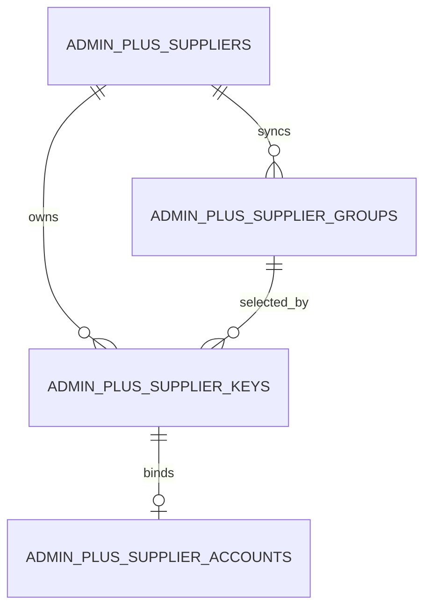
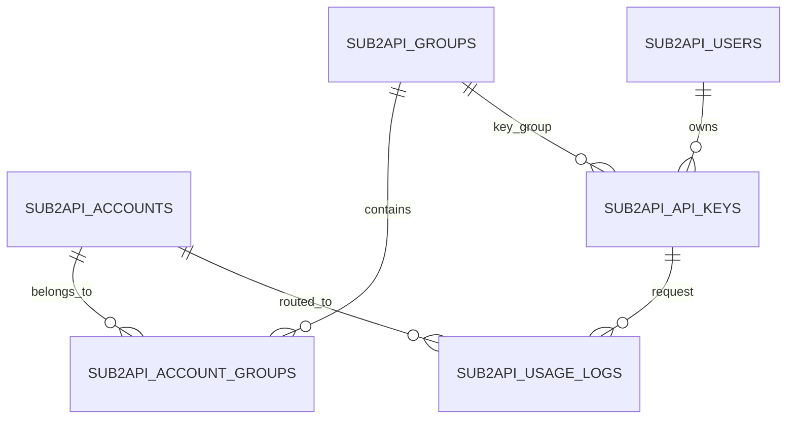
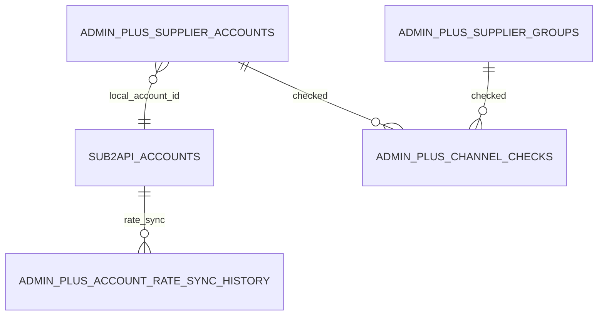
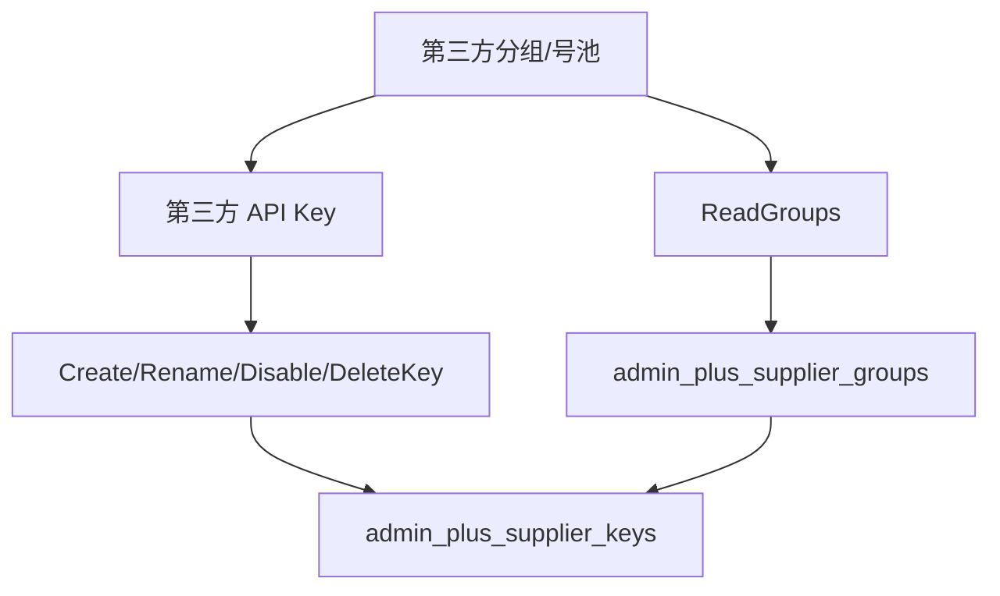
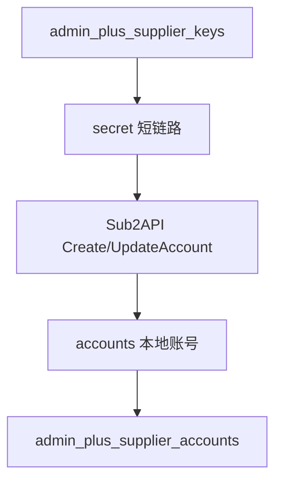
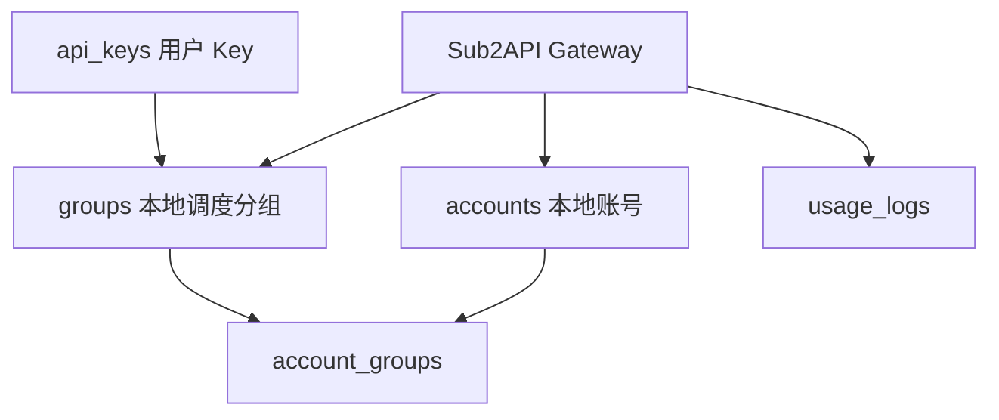
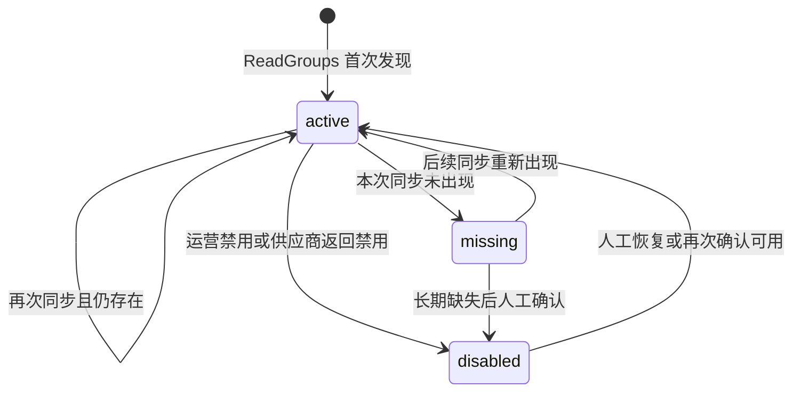
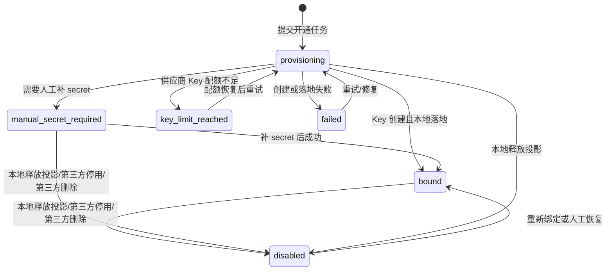

# 01. 核心对象与数据关系

版本：v0.1.0
日期：2026-07-08

## 1. 设计结论

1. `admin_plus_suppliers` 是供应商父级，不等于本地 Sub2API 账号。
2. `admin_plus_supplier_groups` 是第三方供应商分组投影，不等于本地 Sub2API `groups`。
3. `admin_plus_supplier_keys` 是第三方 Key 投影；它记录第三方平台创建出来的 Key 元数据和本地落地状态。
4. `accounts` 是本地 Sub2API 账号；只有它会被网关调度。
5. `admin_plus_supplier_accounts` 是 Admin Plus 的绑定投影，用来把供应商、第三方 Key、本地账号串起来。
6. 候选调度、成本、检测、补池都必须落到 `supplier_group_id + supplier_key_id + local_sub2api_account_id` 这条链。
7. 最终服务对象是本地 Sub2API `users` 和 `api_keys`；用户 API Key 绑定本地调度分组，网关再从该分组选择本地账号。
8. 第三方 Key 创建数量限制属于供应商能力事实，必须进入开通计划；不能默认“一键为所有分组创建 Key”一定完整成功。
9. 余额不足不是渠道不可用。低倍率但余额不足的供应商应标记为 `balance_blocked/recharge_required`，保留机会并提示充值。
10. Sub2API 原后台仍是备选操作入口；运营在原后台切换分组或调度后，Admin Plus 必须能重新同步本地账号状态并更新绑定投影。
11. 完整数据库设计、表域划分、ER 子图、导入导出边界和流程表级读写以 [08-database-design.md](08-database-design.md) 为准；本文只保留核心对象关系。

## 2. 对象关系 ER 图

本节只画核心关系，不把字段塞进 Mermaid。完整 Admin Plus 数据库 ER、字段、导入导出边界和表级读写以 [08-database-design.md](08-database-design.md) 为准。

### 2.1 供应商供给链



### 2.2 本地调度与用户链



### 2.3 Admin Plus 与本地 Sub2API 连接



核心字段摘要：

| 表 | 关键字段 | 运营意义 |
|----|----------|----------|
| `admin_plus_suppliers` | `name/runtime_status/health_status/api_base_url/balance_status/key_capacity_status` | 供应商父级、会话、余额和 Key 配额入口 |
| `admin_plus_supplier_groups` | `supplier_id/external_group_id/name/provider_family/effective_rate_multiplier/status` | 第三方分组投影和倍率排序依据 |
| `admin_plus_supplier_keys` | `supplier_id/supplier_group_id/external_key_id/key_fingerprint/key_last4/status/local_sub2api_account_id` | 第三方 Key 脱敏投影和本地落地状态 |
| `admin_plus_supplier_accounts` | `supplier_id/supplier_key_id/local_sub2api_account_id/source_display_name/local_group_names/effective_rate_multiplier` | 供应商到本地账号的运营绑定投影 |
| `accounts` | `id/name/platform/status/schedulable/rate_multiplier/proxy_id` | 本地网关真实调度对象；`proxy_id` 指向 Sub2API 网关实际使用的代理 |
| `proxies` | `id/name/status/expires_at/deleted_at` | 本地账号绑定代理事实源，用于区分代理故障和供应商故障 |
| `groups` / `account_groups` | `groups.id/name`、`account_groups.account_id/group_id` | 本地调度分组和账号分组绑定 |
| `api_keys` / `usage_logs` | `api_keys.user_id/group_id`、`usage_logs.api_key_id/account_id/group_id/model/actual_cost` | 用户请求入口和最终调度事实 |
| `admin_plus_supplier_channel_check_snapshots` | `supplier_group_id/supplier_key_id/local_sub2api_account_id/check_source/recommended/blocked_reason` | 候选可用性、排除原因和实测成本控制 |

## 3. 三类分组关系图

同样拆成三张小图，避免把第三方平台、Admin Plus 投影和本地 Sub2API 调度挤在一张图里。

### 3.1 第三方平台到 Admin Plus 投影



### 3.2 第三方 Key 落地本地账号



### 3.3 本地调度分组与用户 Key



## 4. 所有权矩阵

| 对象 | 真实所有者 | Admin Plus 是否保存 | 谁可以写 | 写入原因 |
|------|------------|--------------------|----------|----------|
| 供应商父级 | Admin Plus | 是 | Admin Plus | 运营创建、状态维护 |
| 供应商会话 | Admin Plus | 是，密文 | Admin Plus | 后端直登或插件上报 |
| 第三方供应商分组 | 第三方平台 | 是，投影 | Provider Adapter 同步 | 发现倍率、可用池和 Key 创建选项 |
| 第三方 API Key | 第三方平台 | 是，脱敏投影 | Provider Adapter 创建/重命名 | 为某个第三方分组生成可调用凭据 |
| 第三方 Key 配额 | 第三方平台 | 是，能力快照 | Provider Adapter 探测/运营录入 | 约束批量开通计划，避免部分分组创建失败但 UI 不提示 |
| 本地 Sub2API 账号 | 本地 Sub2API | 只保存 ID、来源映射和快照 | Sub2API service/Admin API；Sub2API 原后台可人工改 | 本地网关调度第三方 Key |
| 本地 Sub2API 分组 | 本地 Sub2API | 可读取 | Sub2API service/Admin API | 本地用户授权和网关调度 |
| 用户 API Key | 本地 Sub2API | 可读取 | Sub2API service/Admin API | 用户请求入口，绑定本地调度分组 |
| 用户用量日志 | 本地 Sub2API | 可读取 | Sub2API 网关 | 记录用户请求最终调度到哪个本地账号 |
| Admin Plus 绑定投影 | Admin Plus | 是 | Admin Plus | 串联供应商、Key、本地账号 |
| 检测快照 | Admin Plus | 是 | Admin Plus | 记录候选可用性、推荐状态和失败原因 |

## 5. 状态模型

### 5.1 供应商分组状态



### 5.2 第三方 Key 状态



`manual_secret_required` 的修复在 Admin Plus 修复绑定弹窗内完成：运营补录第三方 Key 明文，后端只用它创建或修复本地 Sub2API 账号，持久化仍只保留 fingerprint、last4 和绑定投影。

`disabled` 是 Admin Plus 本地投影的终态，不等同于第三方一定删除。当前用 `error_code` 区分来源：

| `error_code` | 含义 | 第三方后台影响 | 本地 Sub2API 调度影响 |
|--------------|------|----------------|------------------------|
| `LOCAL_PROJECTION_RELEASED` | 只释放 Admin Plus 本地配额投影 | 不调用第三方 | 不自动修改 |
| `PROVIDER_KEY_DISABLED` | 已调用第三方后台停用 Key | 第三方 Key 变为不可用 | 不自动修改 |
| `PROVIDER_KEY_DELETED` | 已调用第三方后台删除 Key | 第三方 Key 被删除或软删除 | 不自动修改 |

### 5.3 供应商 Key 配额状态

`key_limit_policy` 用来描述第三方供应商的 Key 创建约束：

| 策略 | 含义 | UI 处理 |
|------|------|---------|
| `unknown` | 未探测或供应商不返回限制 | 开通前必须提示不确定风险 |
| `unlimited` | 未发现数量限制 | 允许按计划批量开通 |
| `limited` | 当前已知供应商账号总 Key 数有限制 | 展示已用、上限、剩余 |
| `unsupported` | 不支持自动创建 Key | 进入人工开通向导 |

后续如果 Provider Adapter 能稳定读取更细粒度限制，再扩展为 `max_total_keys/max_active_keys/max_keys_per_group` 等子策略；当前版本先用供应商级策略解决“一键开通但上限未知”的运营风险。

`key_capacity_status` 是运行态判断：

```text
unknown | available | limited | exhausted | unsupported
```

其中 `limited/exhausted/unsupported` 不等于供应商不可用，只表示开通 Key 受限。低倍率分组仍应保留在候选机会里，提示运营选择优先开通哪些分组。

### 5.4 本地账号调度状态

本地账号的可调度性以 Sub2API 现有逻辑为准：

```text
status=active
AND schedulable=true
AND 未过期
AND 不在 rate_limit_reset_at 窗口
AND 不在 overload_until 窗口
AND 不在 temp_unschedulable_until 窗口
AND 未额度耗尽
```

Admin Plus 不能复制一套长期分叉的调度判定规则；候选排序可以使用 Admin Plus 自己的快照，但最终加入本地分组前必须重新读取本地 Sub2API 可用性。

Sub2API 原后台兼容规则：

- 运营可在 Sub2API 原后台临时修改账号分组或调度开关，作为 Admin Plus 功能缺失或故障时的兜底。
- Admin Plus 不应把本地账号投影当作唯一事实源；`local_group_names`、`runtime_status`、`schedulable` 等字段需要从本地 Sub2API 周期同步。
- 若发现 Sub2API 原后台人工改动，应更新 `admin_plus_local_account_state_snapshots.drift_status=pending`，必要时写入 `admin_plus_local_account_drift_events`，并在 Admin Plus 显示“原后台变更，需确认是否采纳或恢复”。
- 自动化补池或关调度写回前必须重新读取本地账号；发现 pending drift 时先阻断，避免覆盖运营刚在 Sub2API 原后台做的应急操作。

本地账号展示映射建议：

| 字段 | 用途 |
|------|------|
| `source_display_name` | 面板里显示“供应商 / 第三方分组 / 倍率 / 本地账号 ID”，帮助运营快速识别来源 |
| `local_account_name` | 写入 Sub2API 的账号名，建议包含短供应商名和倍率，兼容原后台人工检索 |
| `local_group_names` | 本地 Sub2API 当前分组快照，用于发现人工切换 |
| `effective_rate_multiplier` | 结合第三方分组和本地账号倍率后的排序倍率 |
| `last_local_sync_at` | 最近一次从 Sub2API 同步本地账号事实的时间 |

### 5.5 余额与候选阻塞状态

余额状态只决定能否立刻补池，不决定是否丢弃低倍率机会：

| 状态 | 含义 | 候选处理 |
|------|------|----------|
| `balance_ok` | 余额充足或供应商没有余额门禁 | 可进入候选排序 |
| `balance_low` | 低余额但仍可调用 | 降权排序并提示充值 |
| `balance_blocked` | 余额不足导致无法调用 | 不自动补池，保留为充值后候选 |
| `recharge_required` | 明确需要充值或兑换 | 生成充值动作，不关闭供应商分组 |
| `balance_unknown` | 暂无余额事实 | 降级为人工确认候选 |

`blocked_reason` 必须区分 `balance_blocked`、`key_limit_reached`、`health_failed`、`local_unschedulable`、`proxy_unavailable`。代理类故障只要求修复账号绑定代理或网络出口，不能误判供应商坏；只有 `health_failed/local_unschedulable` 这类真实链路失败，才可能进入坏账号关闭调度流程。

## 6. 命名建议

为了避免和截图里的第三方分组、本地账号列表混淆，UI 和代码建议统一命名：

| 场景 | 推荐名称 | 不推荐名称 |
|------|----------|------------|
| 供应商后台里的组 | 第三方分组 / 供应商分组 | 本地分组 |
| Admin Plus 同步记录 | 供应商分组投影 | 分组 |
| 本地 Sub2API `groups` | 本地调度分组 | 供应商分组 |
| 第三方平台 API Key | 第三方 Key / 供应商 Key | 本地账号 |
| 本地 Sub2API `accounts` | 本地账号 / 本地 Sub2API 账号 | 供应商 Key |
| 本地 Sub2API `api_keys` | 用户 API Key / 用户令牌 | 供应商 Key、第三方 Key |
| `admin_plus_supplier_accounts` | 绑定投影 | 账号事实源 |
