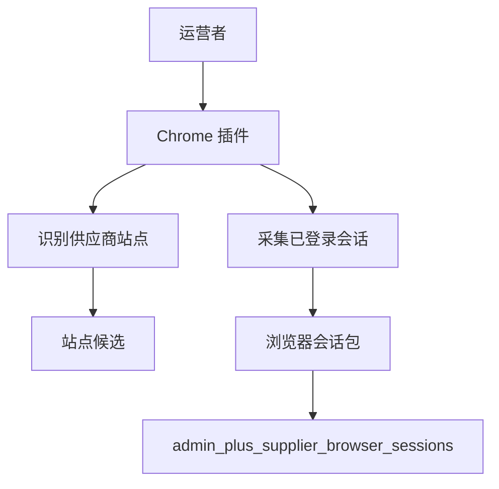
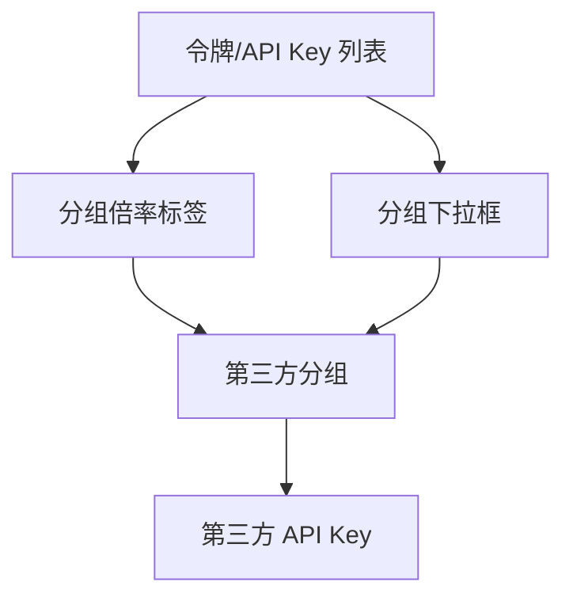
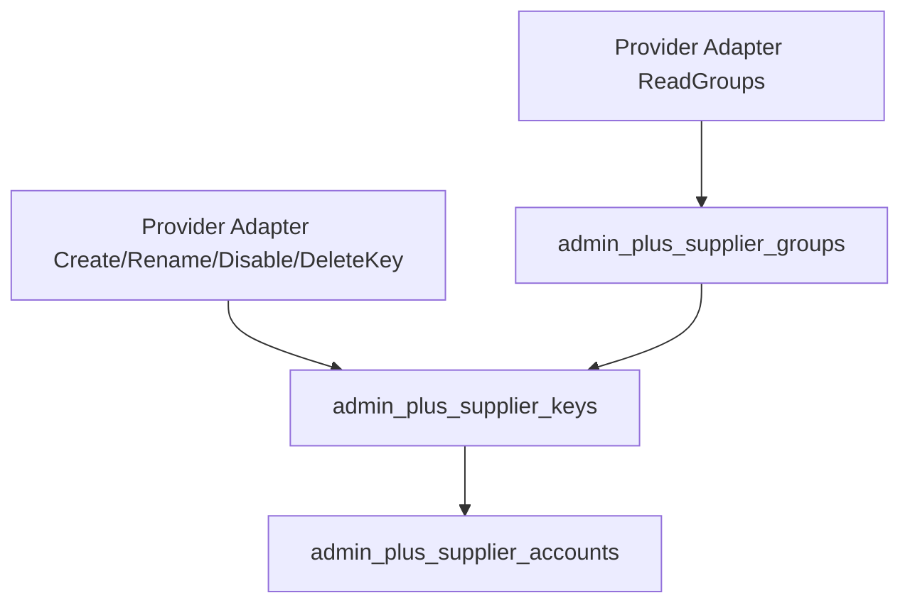
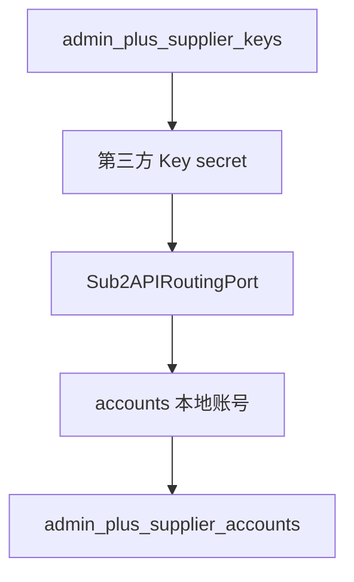
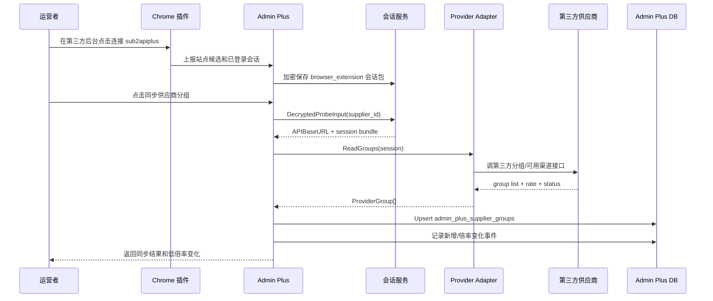
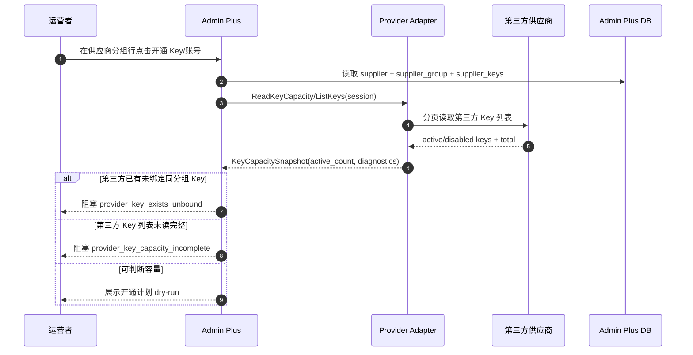
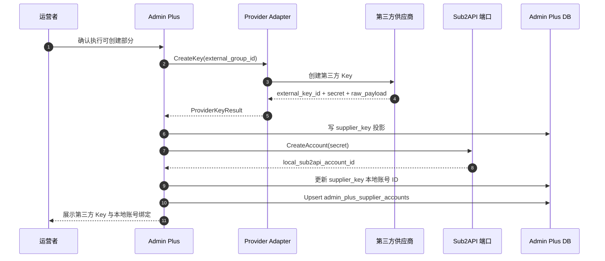
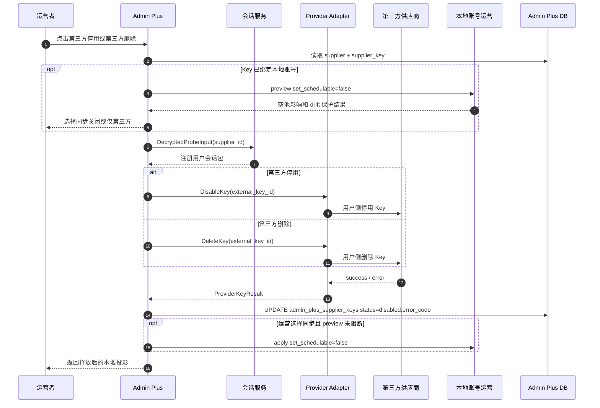
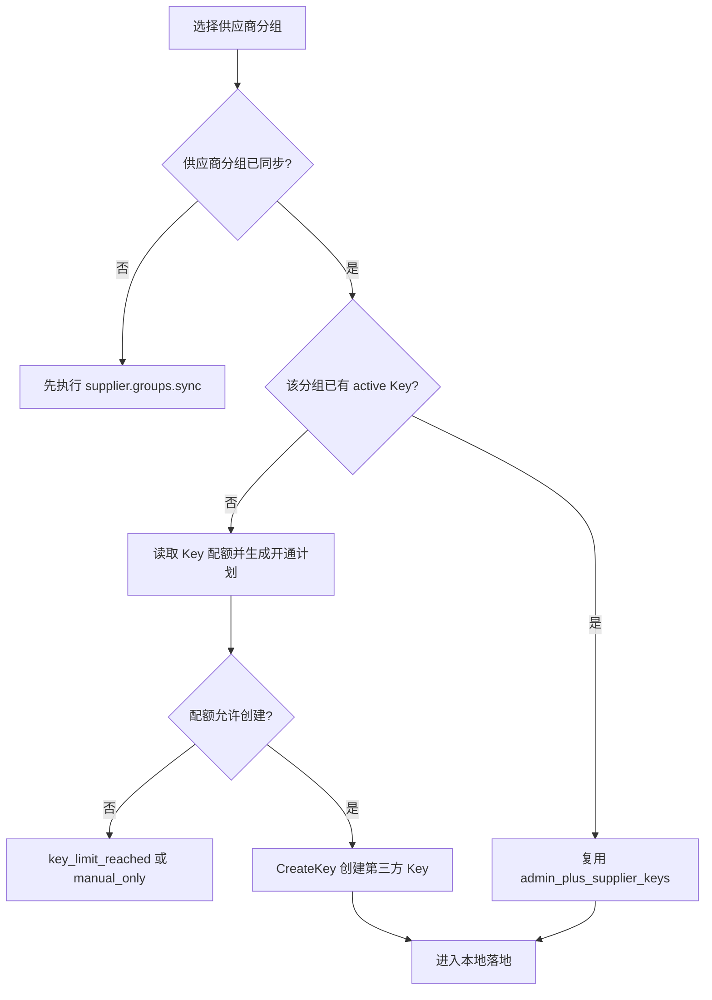
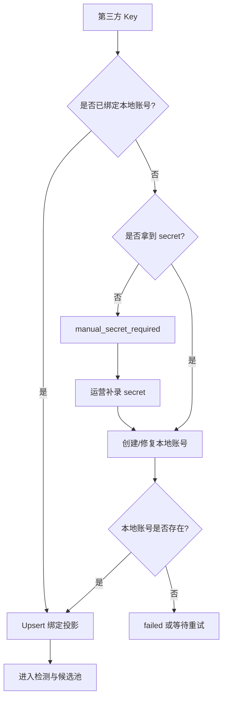

# 02. 第三方供应商令牌分组管理

版本：v0.1.0
日期：2026-07-08

## 1. 关系解释

用户截图里实际出现了两类第三方供应商后台：

1. Codex APIs / Sub2API 类后台：
   - “令牌管理”列表里每个令牌都有“分组”和倍率标签，例如 `kiro-pro 0.2x`、`gptplus 0.06x`。
   - 编辑令牌时可以在“令牌分组”下拉框选择分组，例如 `cc-max`、`gptplus`、`gptproo`、`kiro`、`kiro-pro`。
2. ShareAPI / New API 类后台：
   - “API 密钥”列表里每个 API Key 有一个分组标签，例如 `PRO共享容量号池-7*24稳定 0.16x`。
   - 行内可以“选择分组”，说明第三方 Key 与第三方分组是可变关系。

这些“分组”都属于第三方供应商平台，不是本地 Sub2API 的 `groups`。Admin Plus 需要把它们同步为 `admin_plus_supplier_groups`，再基于某个供应商分组创建或管理第三方 Key。

相关数据库设计见 [08-database-design.md](08-database-design.md) 的“Key 配额 dry-run 与开通”表级时序图。本文聚焦第三方令牌/分组业务流程。

## 2. 令牌分组概念图

概念图按来源拆开。Chrome 插件只提供站点识别和会话桥接，第三方分组和 Key 的业务事实仍以后端 Provider Adapter 为准。

### 2.1 浏览器会话入口



### 2.2 第三方后台对象



### 2.3 Admin Plus 投影



### 2.4 本地落地关系



## 3. 同步与开通边界

| 能力 | Admin Plus 做什么 | 第三方平台做什么 | 本地 Sub2API 做什么 |
|------|------------------|------------------|--------------------|
| 识别供应商站点 | Chrome 插件识别 host/path 并提交候选；后端创建或匹配供应商 | 展示后台页面 | 不参与 |
| 获取会话 | 优先后端直登；失败时通过 Chrome 插件上报已登录会话包 | 维持浏览器登录态 | 不参与 |
| 读取分组 | 通过 Provider Adapter 调 `ReadGroups`，保存投影 | 返回真实分组、倍率、状态 | 不参与 |
| 创建 Key | 先探测 Key 配额并生成开通计划，再传入 `external_group_id`、名称、额度/过期策略 | 创建真实 Key 并返回外部 ID/secret，或返回数量限制 | 不参与 |
| 本地落地 | 使用第三方 Key secret 创建本地账号 | 不参与 | 创建 `accounts` |
| 加入本地分组 | 选择本地 Sub2API `groups` | 不参与 | 维护 `account_groups` |
| 检测可用性 | 优先读通道监控和余额，最后才做耗费 token 的实测 | 返回可用性或请求结果 | 提供本地账号运行态 |

## 4. 第三方 Key 配额与批量开通计划

第三方供应商创建 Key 的能力差异很大：

- 有的供应商允许无限创建 Key。
- 有的供应商限制最多 10 个、5 个、1 个。
- 有的供应商只允许手工创建，或者创建后不返回 secret。
- 有的供应商限制 active Key 数，而不是总 Key 数。
- 有的供应商按第三方分组限制 Key 数。

因此 UI 不应叫“一键创建所有分组 Key”，更准确的动作是“生成批量开通计划”。计划必须在执行前展示：

| 字段 | 说明 |
|------|------|
| `key_limit_policy` | 供应商级 `unknown/unlimited/limited/unsupported`；分组级 `inherit/unknown/unlimited/limited/unsupported` |
| `active_key_count` | 当前可见 active Key 数 |
| `key_limit_value` | 供应商返回或运营录入的上限 |
| `remaining_key_capacity` | 本次还可创建的 Key 数 |
| `requested_group_count` | 本次希望开通的第三方分组数 |
| `will_create_groups` | 可创建的第三方分组 |
| `blocked_groups` | 因配额不足无法创建的第三方分组 |
| `recommended_priority` | 按低倍率、余额、通道监控、本地用户影响排序 |

配额不足时不应把供应商标记为不可用，而是：

1. 标记 `key_capacity_status=limited/exhausted`。
2. 对未能开通的分组标记 `blocked_reason=key_limit_reached`。
3. 在面板提示运营删除无用 Key、提高供应商配额，或选择优先开通的低倍率分组。
4. 对已存在第三方 Key 的分组继续复用，不重复创建。

当前落地口径：

- 批量开通计划使用 `key_capacity_exhausted/key_capacity_unknown/key_provisioning_unsupported/group_key_capacity_exhausted/group_key_capacity_unknown/group_key_provisioning_unsupported/provider_key_exists_unbound/provider_key_capacity_incomplete` 作为阻塞原因。
- 供应商分组弹窗已展示阻塞分组修复区，可打开供应商配额设置、配置单个第三方分组配额、定位阻塞分组，并可对占用配额的 Key 执行“本地释放配额投影”“第三方停用”“第三方删除”。
- `admin_plus_supplier_groups.key_limit_policy/key_limit_value` 已支持分组级配额。默认 `inherit` 继承供应商级策略；运营显式设为 `unknown/limited/unlimited/unsupported` 时，开通计划会额外执行分组级容量校验，且第三方分组同步不会覆盖手工配置。
- “本地释放配额投影”只把 `admin_plus_supplier_keys.status` 改为 `disabled`，让 Admin Plus 不再把该 Key 计入 `active_key_count`；它不会删除第三方后台 Key，也不会自动关闭本地账号调度。
- “第三方停用/删除”会先对已绑定本地账号的 Key 执行本地调度联动 preview；运营可选择“同步”或“仅第三方”。第三方动作仍先通过 Provider Adapter 调第三方后台用户侧 Key 接口，成功后才把本地投影标记为 `disabled`；若选择同步，则在第三方成功后再调用本地账号运营 apply 关闭对应本地账号调度。preview 被空池保护阻断时，只允许继续“仅第三方”。
- Provider Adapter 第一阶段已支持 `ListKeys/ReadKeyCapacity`：New API 读取 `/api/token/`，Sub2API 读取 `/api/v1/keys`，按分页汇总第三方真实 active Key 数，并对 key/token/api_key 等敏感字段脱敏。
- 若第三方后台已有同分组 active Key 但 Admin Plus 没有绑定投影，计划标记 `provider_key_exists_unbound` 并阻止重复创建；阻塞修复区可单个或批量导入这些第三方 Key 的脱敏本地投影，导入后进入 `manual_secret_required` 补密钥绑定流程。
- 若第三方 Key 列表分页读取不完整，计划标记 `provider_key_capacity_incomplete`；批量开通和单分组开通都拒绝执行，避免在无法确认真实占用时继续创建。
- 后端单分组 `Provision` 也会检查供应商级和分组级 Key 配额：有限配额已满、策略未知或策略为不支持自动创建时直接拒绝，不允许绕过开通计划偷偷创建。
- `manual_secret_required` 的 Key 已支持在修复绑定弹窗中补录第三方 Key 明文，后端只保存 `key_fingerprint/key_last4`，并复用本地账号创建和绑定链路完成落地。
- 开通计划已支持 `supplier_group_priority_ids` 优先级覆盖：默认按最低有效倍率优先，运营在计划面板上移/下移后重新 dry-run，有限配额会按覆盖顺序选择可创建分组；真实提交和异步任务快照会携带同一顺序。
- 真实最大 Key 上限自动读取仍依赖具体第三方是否暴露稳定接口；当前 `ReadKeyCapacity` 对 new-api/sub2api 返回 `LimitKnown=false/limit_source=not_exposed_by_provider`，上限仍以运营配置或后续供应商专属适配器为准。

### 4.1 Key 释放方式对比

| 动作 | 后端接口 | 第三方后台调用 | Admin Plus 写回 | 本地 Sub2API 调度 |
|------|----------|----------------|-----------------|-------------------|
| 本地释放配额投影 | `POST /admin-plus/suppliers/:id/keys/:keyID/disable-local-projection` | 不调用 | `status=disabled`、`error_code=LOCAL_PROJECTION_RELEASED` | 不自动修改 |
| 第三方停用 | `POST /admin-plus/suppliers/:id/keys/:keyID/disable-provider` | 使用注册用户会话停用外部 Key | `status=disabled`、`error_code=PROVIDER_KEY_DISABLED` | 可选 preview 后同步关闭 |
| 第三方删除 | `POST /admin-plus/suppliers/:id/keys/:keyID/delete-provider` | 使用注册用户会话删除外部 Key | `status=disabled`、`error_code=PROVIDER_KEY_DELETED` | 可选 preview 后同步关闭 |

当前第三方后台调用不是 root 或超管路径，而是复用供应商注册用户登录态：

| Provider | 停用语义 | 删除语义 |
|----------|----------|----------|
| New API | `PUT /api/token/?status_only=true`，请求体 `id + status=2` | `DELETE /api/token/:id` |
| Sub2API | `PUT /api/v1/keys/:id`，保留原字段并写 `status=inactive` | `DELETE /api/v1/keys/:id` |

## 5. 第三方分组同步流程



## 6. 第三方 Key 创建与本地落地流程

### 6.1 配额 dry-run



### 6.2 创建 Key 与本地落地



关键点：

- `secret` 只在创建本地账号时使用；持久化只保存 `key_fingerprint`、`key_last4`、`external_key_id` 和脱敏响应。
- 如果第三方平台不返回 secret，则进入 `manual_secret_required`；运营者可在 Admin Plus 修复绑定弹窗补录第三方 Key 明文，系统创建或修复本地账号后只保存 fingerprint 和 last4。
- 一个供应商分组默认只保留一个 active/provisioning/bound Key，避免同一号池重复创建候选。
- 批量开通必须先 dry-run；当前计划动作使用 `create/skipped_existing/blocked`，配额不足、配额未知、不支持自动开通、第三方已有未绑定 Key、第三方 Key 列表未读完整都会进入明确阻塞原因，不能静默跳过部分分组。
- 只创建可创建部分必须由运营显式确认，并在请求中携带 `allow_partial=true`；该确认只放行 `key_capacity_exhausted/group_key_capacity_exhausted`，不放行配额未知、不支持自动开通、第三方已有未绑定 Key 或第三方 Key 列表未读完整。

表级流转摘要：

| 阶段 | 读表 | 写表 |
|------|------|------|
| 生成开通计划 | `admin_plus_suppliers`、`admin_plus_supplier_groups`、`admin_plus_supplier_keys`、`admin_plus_supplier_browser_sessions`、第三方 Key 列表 | 当前 dry-run 不写表；`ReadKeyCapacity` 只作为实时事实源参与 active count、未绑定 Key 和读取完整性判断；`admin_plus_supplier_groups.key_limit_policy/key_limit_value` 参与分组级容量校验；`supplier_group_priority_ids` 只作为请求级排序覆盖；真实最大上限写回待后续专属适配 |
| 创建第三方 Key | `admin_plus_supplier_groups` | `supplier_provision_jobs`、`supplier_provision_steps`、`admin_plus_supplier_keys` |
| 落地本地账号 | `admin_plus_supplier_keys` | Sub2API `accounts`，Admin Plus `admin_plus_supplier_accounts` |
| 绑定本地分组 | `accounts`、`groups`、`account_groups` | 当前本地账号运营动作层可写 `account_groups/scheduler_outbox`；P1 第一阶段已从 service 层统一收口为 `Sub2APIRoutingPort` |

### 6.3 第三方 Key 停用/删除



后端第三方停用/删除接口本身只处理第三方 Key 和 Admin Plus 投影；本地账号调度必须通过本地账号运营镜像的 preview/apply 另一路完成。前端修复区已把这两步串起来：先 preview，再执行第三方动作，第三方成功后才按运营选择 apply `set_schedulable=false`，让空池保护和 drift 保护继续生效。

## 7. 第三方 Key 与本地账号的绑定流程图

### 7.1 Key 选择与配额判断



### 7.2 本地落地与候选池



## 8. Provider 差异

### 8.1 Sub2API 同源供应商

Sub2API 类供应商通常可以通过用户侧 API 读取：

- 分组或可用渠道。
- 用户分组倍率。
- API Key 列表、创建接口、Key 上限或创建失败原因。
- 余额、充值订单、兑换记录、usage。
- channel monitor 或类似健康状态。

Admin Plus 的 `SessionProfileClient` 已提供：

- `ReadGroups`
- `CreateKey`
- `RenameKey`
- `ReadRates`
- `ReadChannelMonitors`
- `ReadFundingTransactions`
- `ReadEntitlementTransactions`
- `ReadUsageCosts`

### 8.2 New API / sub2api 类供应商

New API / sub2api 类供应商也有 API Key 和分组，但字段名、用户侧 API、余额单位和渠道状态来源不同：

- New API 余额可能使用 QTA 等供应商自有单位。
- 渠道状态可能来自外部 Pulse API，而不是 sub2api 的 channel monitors。
- 分组名和分组倍率需要由 adapter 归一化为 `ProviderGroup`。
- Key 上限可能只能通过错误提示或页面状态推断，adapter 应返回 `key_limit_policy=unknown` 并让 UI 提示风险。

Admin Plus 只能依赖 `ports.SessionGroupAdapter`、`ports.SessionKeyAdapter` 等抽象，不应把 Sub2API 同源供应商的字段假设扩散到通用业务层。

## 9. 页面呈现建议

供应商详情页建议拆成四个 Tab：

| Tab | 内容 | 主要动作 |
|-----|------|----------|
| 供应商分组 | 第三方分组投影、倍率、状态、最后同步时间 | 同步分组、查看变化、开通 Key/账号 |
| 第三方 Key | 第三方 Key 脱敏列表、绑定状态、本地账号 ID | 修复绑定、重命名、禁用 |
| Key 配额 | Key 上限、已用数量、剩余容量、阻塞分组 | 生成批量开通计划、选择优先分组 |
| 本地绑定 | 本地账号、所属本地分组、调度状态、检测结果 | 加入本地分组、开启/关闭调度、健康检测 |

本地账号管理页只展示本地 Sub2API 视角；如果账号来源于供应商 Key，应显示一个只读来源提示：

```text
来源：供应商 ShareAPI / 分组 PRO共享容量号池-7*24稳定 / Key sk-...ec96
```

这样运营在本地账号页能知道来源，但不会把第三方分组误当本地调度分组。
