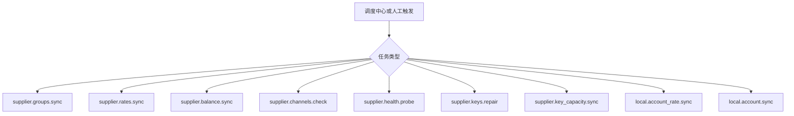
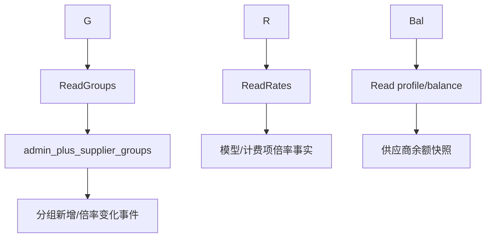
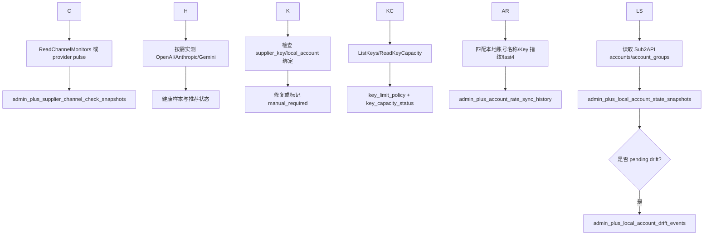
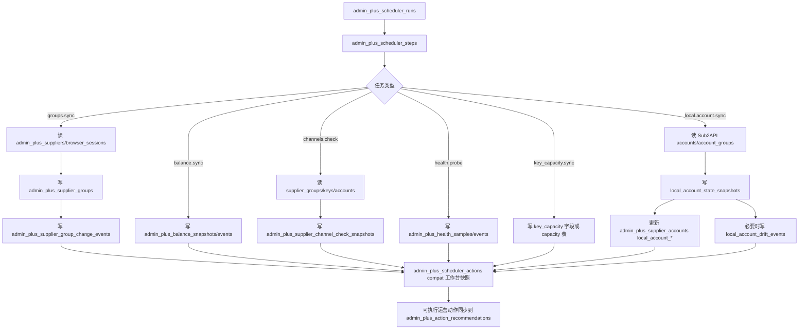
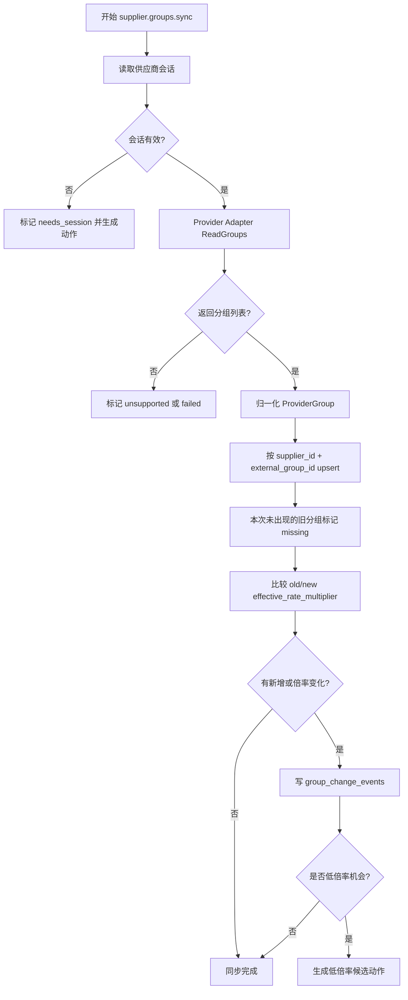
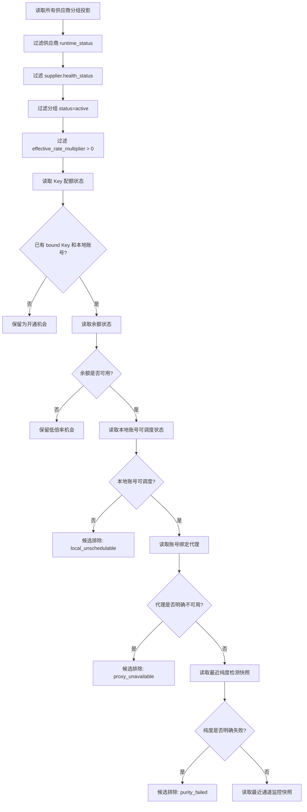
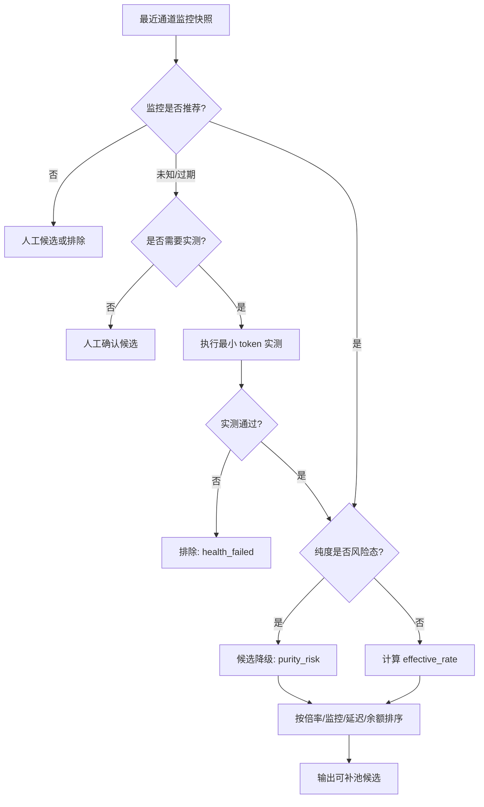
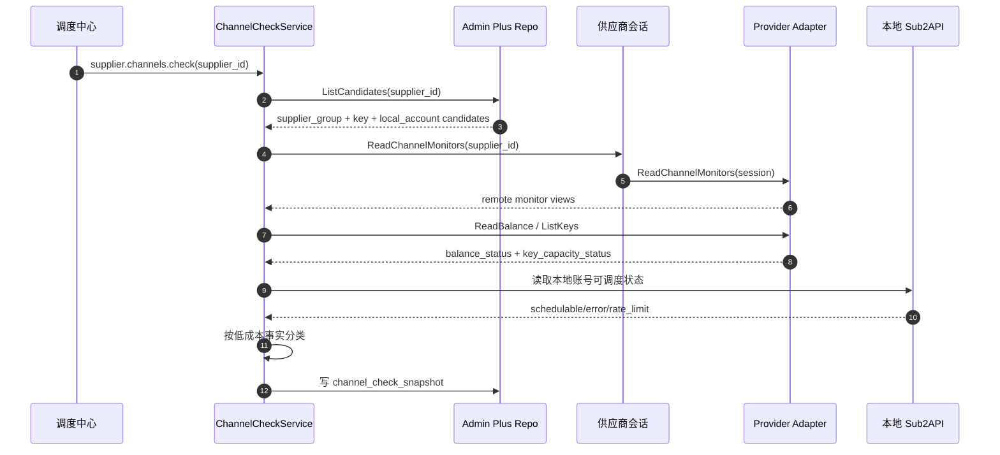
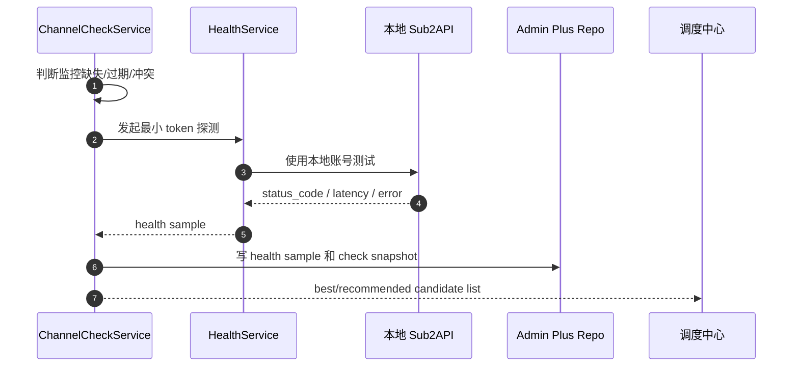
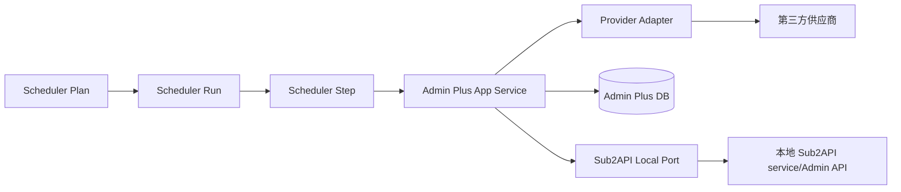

# 03. 同步、检测与候选池

版本：v0.1.0
日期：2026-07-08

## 1. 设计结论

1. 同步负责把第三方事实变成 Admin Plus 投影；检测负责判断投影是否可用。
2. 分组同步、倍率同步、余额同步、渠道检测、健康探测是不同任务，不能混成一个“采集成功/失败”状态。
3. 检查优先级必须按成本排序：通道监控优先，余额/配额其次，本地调度状态再次，耗费 token 的实测最后。
4. 第三方供应商状态和本地 Sub2API 账号状态都要看；只看一边会误判。
5. 自动补池不能只凭历史快照，写回前必须重新读取本地分组可用性和候选账号状态。
6. 余额不足不是渠道不可用；低倍率但余额不足的供应商要保留为 `balance_blocked/recharge_required` 候选，提示充值后复测。
7. Key 配额不足不是供应商不可用；它只阻塞新 Key 开通，应该生成“选择优先开通分组”的动作。
8. 检测流程必须明确读写哪些表；完整表级流转见 [08-database-design.md](08-database-design.md)。
9. 代理异常不是供应商坏；候选评估第一阶段读取 Sub2API 网关真实绑定的 `accounts.proxy_id -> proxies`，明确不可用时只输出 `check_source=proxy` 和代理类阻断原因。

## 2. 同步任务总图

同步任务按事实来源拆图。调度中心只负责任务编排，业务事实由各 service 写入对应投影或快照。

### 2.1 任务入口

### 2.2 供应商事实同步

### 2.3 检测、本地状态和修复

### 2.1 同步任务表级流转

原则：

- `admin_plus_scheduler_runs/steps/attempts` 记录任务运行，不作为业务事实源。
- `admin_plus_supplier_groups/keys/accounts` 是供应商到本地账号的核心投影。
- 检测结果优先写快照，不直接改本地 Sub2API 调度状态。
- 当前本地账号运营动作层已支持手动确认后写本地调度状态；自动补池和后续统一写回必须通过 `Sub2APIRoutingPort` 收口。

## 3. 分组同步流程图

## 4. 检测来源分层与成本优先级

| 优先级 | 检测层 | 来源 | 代表字段 | 成本 | 用途 |
|--------|--------|------|----------|------|------|
| P0 | 远程通道监控 | `ReadChannelMonitors` 或 Pulse | `remote_status`、`latency`、`availability` | 不消耗模型 token | 优先判断第三方平台自己暴露的通道状态 |
| P0 | 供应商父级健康 | `admin_plus_suppliers`、会话探测 | `runtime_status`、`health_status`、session validity | 不消耗模型 token | 判断供应商是否可作为候选来源 |
| P0 | 供应商分组事实 | `admin_plus_supplier_groups` | `status`、`effective_rate_multiplier`、`last_seen_at` | 不消耗模型 token | 判断第三方分组是否仍存在、倍率是否可用 |
| P1 | 余额状态 | `ReadBalance`、充值/兑换记录 | `balance_status`、`balance_cents`、`recharge_required` | 不消耗模型 token | 区分余额不足和通道不可用 |
| P1 | Key 配额状态 | `ListKeys/ReadKeyCapacity` | `key_limit_policy`、`key_capacity_status`、`active_key_count` | 不消耗模型 token | 判断是否能继续自动创建第三方 Key |
| P2 | 第三方 Key 事实 | `admin_plus_supplier_keys` | `status`、`external_key_id`、`local_sub2api_account_id` | 不消耗模型 token | 判断该分组是否已落地本地账号 |
| P2 | 本地调度状态 | 本地 Sub2API `accounts` / `OpsService` | `schedulable`、429、error、temp unsched | 不消耗供应商 token | 判断本地网关能否调度 |
| P2 | 本地账号代理绑定 | 本地 Sub2API `accounts.proxy_id`、`proxies` | `local_account_proxy_status`、`proxy_deleted/proxy_disabled/proxy_expired/proxy_unavailable` | 不消耗供应商 token | 区分代理故障和供应商/账号故障；无代理或未知不误阻断 |
| P2 | 纯度检测快照 | `admin_plus_scheduler_steps.result_snapshot` | `run_purity_check`、`local_sub2api_account_id`、`verdict`、`score`、`model_identity_status`、`purity_freshness_status` | 不新增本次 token 消耗，复用最近检测结果 | 明确能力不匹配时阻断，风险态降级，7 天外快照输出 `purity_stale` 复检建议，未知不阻断 |
| P2 | 主动健康探测 | `health.Service`、`channelchecks.Check` | `probe_status`、`status_code`、`first_token_ms`、`active_probe_daily_budget_tokens`、`channel_check_probe_cooldown_seconds` | 消耗模型 token 和供应商余额 | 只在监控缺失/过期/冲突、人工触发或自动写回前验证真实链路；第一阶段已有每日预算和同分组冷却 |

实测规则：

- 默认不把主动实测作为第一道检查。
- 余额不足时不触发主动实测。
- 调度器执行渠道检测时必须传入预算、冷却和慢阈值设置。
- 预算或冷却命中时不能自动关闭本地账号调度。
- 通道监控明确不可用时，不再立即实测，先生成 `channel_monitor_failed` 或人工确认动作。
- 余额明确不足时，不实测，标记 `balance_blocked/recharge_required`。
- 只有低成本事实无法判断、或即将自动补池/恢复调度时，才执行最小 token 的探测请求。
- 实测必须有预算、冷却时间、并发限制和审计记录。

## 5. 候选池生成流程

### 5.1 低成本事实过滤

### 5.2 监控、实测与排序

候选的最小字段：

| 字段 | 来源 | 说明 |
|------|------|------|
| `supplier_id` | `admin_plus_suppliers` | 供应商父级 |
| `supplier_group_id` | `admin_plus_supplier_groups` | 第三方分组投影 |
| `supplier_key_id` | `admin_plus_supplier_keys` | 第三方 Key 投影 |
| `local_sub2api_account_id` | `accounts` / `admin_plus_supplier_accounts` | 本地可调度账号 |
| `effective_rate_multiplier` | 供应商分组 + 本地账号倍率 | 排序核心 |
| `provider_family` | 供应商分组 | OpenAI/Anthropic/Gemini 等协议族 |
| `health_status` | 检测快照 | 是否推荐 |
| `last_checked_at` | 检测快照 | 新鲜度 |
| `check_source` | 检测快照 | `channel_monitor/balance/local_state/model_scope/purity/proxy/active_probe` |
| `balance_status` | 余额同步 | `balance_ok/balance_low/balance_blocked/recharge_required/balance_unknown` |
| `key_capacity_status` | Key 配额同步 | `unknown/available/limited/exhausted/manual_only` |
| `model_scope/model_match_status` | 第三方分组能力范围 | 模型范围匹配结果，明确不匹配输出 `model_scope_unsupported` |
| `purity_status/purity_verdict/purity_freshness_status` | 最近纯度检测 step | `pass/warn/fail/unknown`；明确失败阻断，风险态降级；检测快照 7 天外派生 `stale`，通道可用时输出 `purity_stale`，提示复检而不触发主动实测 |
| `local_account_proxy_id/proxy_status` | 本地 Sub2API `accounts` + `proxies` | 账号绑定代理状态；`active/unbound/unknown` 不阻断，`deleted/disabled/expired/error` 阻断候选 |
| `blocked_reason` | 候选生成 | `recharge_required/key_capacity_exhausted/health_failed/local_unschedulable/channel_monitor_failed/model_scope_unsupported/purity_failed/purity_risk/proxy_deleted/proxy_disabled/proxy_expired/proxy_unavailable` |
| `probe_cost_class` | 健康探测 | `free/low_token/standard_token`，用于控制实测成本 |

## 6. 检测优先级时序图

### 6.1 低成本事实分类

### 6.2 必要时最小 token 实测

## 7. 新鲜度规则

| 事实 | 推荐有效期 | 过期处理 |
|------|------------|----------|
| 供应商分组 | 1 小时 | 过期后不自动补池，先同步 |
| 分组倍率 | 1 小时 | 过期后不参与最低倍率排序 |
| 供应商余额 | 10 到 30 分钟 | 过期后降级为人工确认候选 |
| Key 配额 | 10 到 30 分钟，或每次批量开通前实时读取 | 过期后禁止自动创建 Key，只能 dry-run |
| 渠道检测 | 10 到 30 分钟 | 过期后可先补测再补池 |
| 主动实测 | 30 到 60 分钟，按供应商和模型限频 | 过期后不直接重测，先看通道监控和余额 |
| 本地账号可调度状态 | 每次执行前实时读取 | 不能使用历史快照直接写回 |
| 第三方 Key 绑定 | 绑定后长期有效，但需要定期修复检测 | 缺失则触发 repair_binding |

## 8. 状态到动作映射

| 状态 | 自动动作 | 人工动作 |
|------|----------|----------|
| 会话失效 | 尝试后端直登刷新 | 打开插件重新上报会话 |
| 分组同步失败 | 重试，退避 | 检查供应商 API/适配器 |
| 新低倍率分组出现 | 生成开通 Key 建议 | 手动开通 Key/账号 |
| Key 配额不足 | 生成批量开通计划和优先级建议 | 删除无用 Key、提高配额或选择重点分组 |
| Key 无本地账号 | 触发 repair_binding | 手动补 secret 或绑定已有账号 |
| 余额不足 | 标记 `balance_blocked/recharge_required`，不删除候选 | 充值或兑换后重跑余额同步 |
| 本地账号不可调度 | 不进入候选 | 查看 Sub2API 账号错误 |
| 通道监控失败 | 记录 `channel_monitor_failed`，默认不消耗 token 实测 | 人工确认或等待供应商恢复 |
| 实测失败 | 记录 `health_failed`，可按策略暂停调度 | 人工复测或换供应商 |
| 目标本地分组耗尽 | 触发 routing refill | 手动选择候选补入 |

## 9. 与调度中心的关系

调度中心只负责任务编排，不直接实现供应商协议：

每个 Step 必须有：

- 幂等键。
- 供应商 ID。
- 可选供应商分组 ID。
- 尝试次数和租约。
- 失败分类。
- 审计记录。
