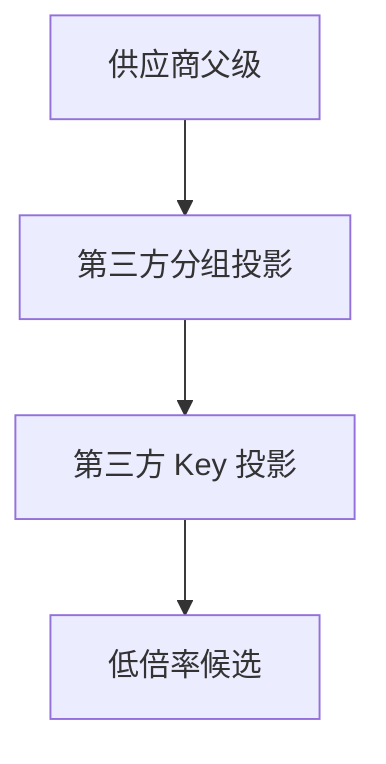
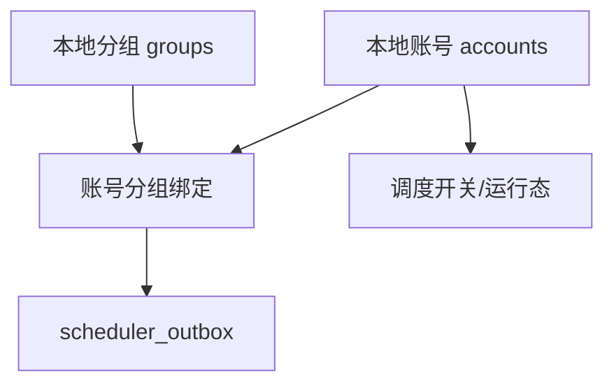
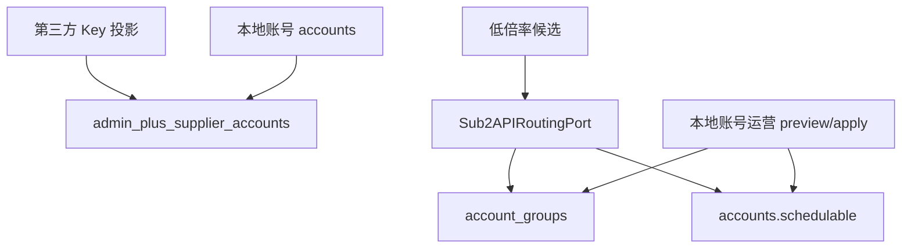
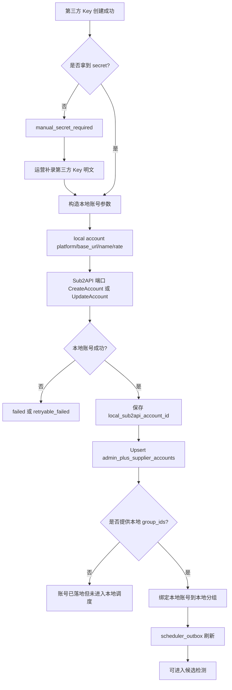
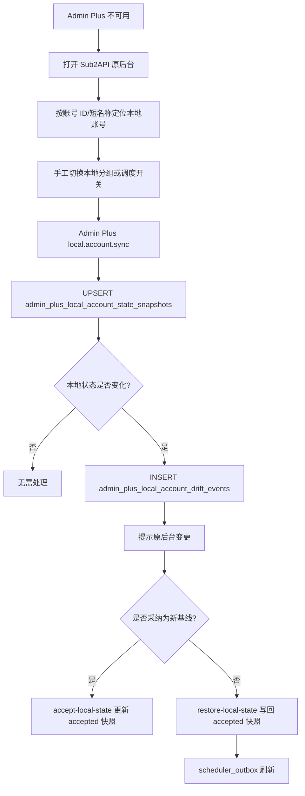
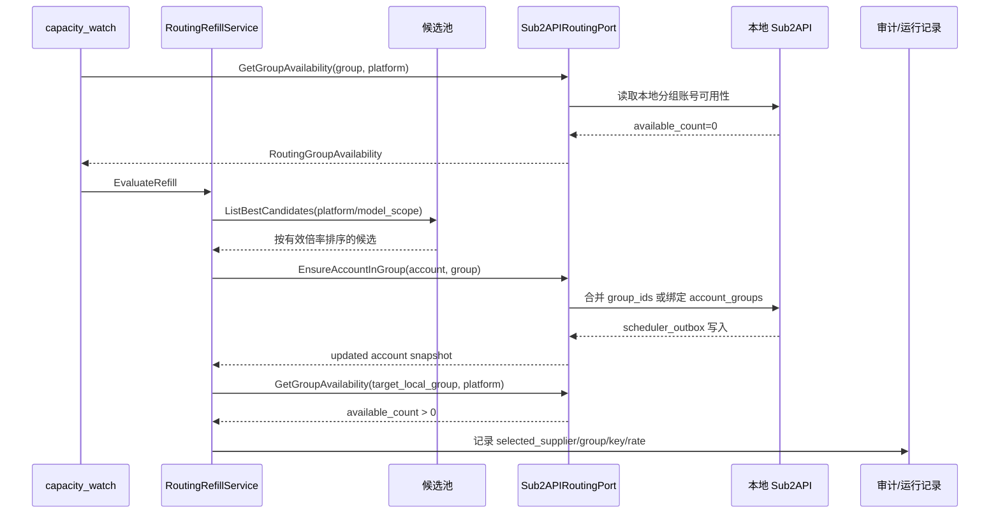
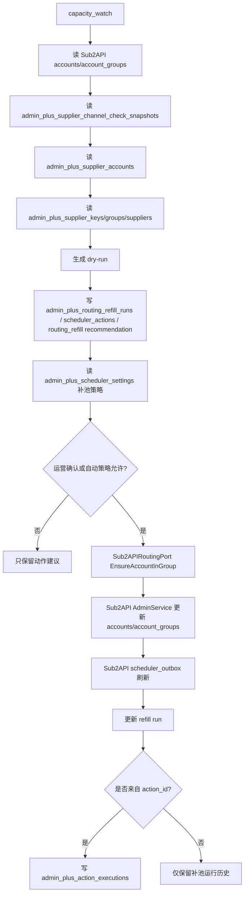
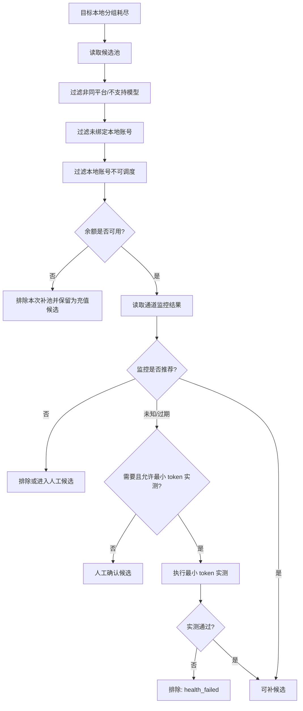
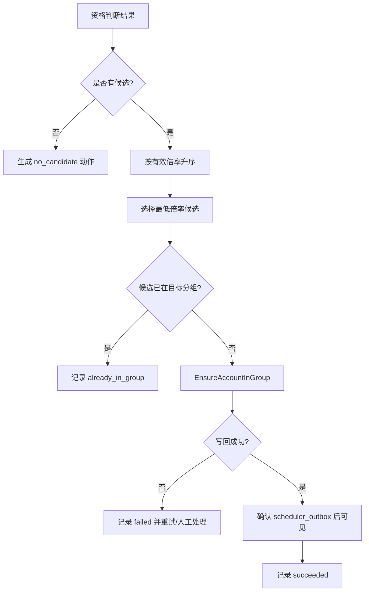

# 04. 本地绑定、账号管理与路由补池

版本：v0.1.0
日期：2026-07-08

## 1. 设计结论

1. 第三方 Key 只有落地为本地 Sub2API `accounts` 后，才可能被网关调度。
2. 本地账号加入哪个本地 Sub2API `groups`，是本地调度决策，不是第三方令牌分组决策。
3. `admin_plus_supplier_accounts` 只是绑定投影，不能替代本地 `accounts`。
4. 路由补池只能写本地账号与本地分组的绑定，不能修改第三方供应商分组。
5. 坏账号关闭调度只关闭本地账号 `schedulable=false`；不等于删除第三方 Key，也不等于禁用供应商分组。
6. 原则上不修改 Sub2API upstream。当前同库版本已在 Admin Plus 内实现本地账号运营基础动作层；P1 第一阶段已新增 `Sub2APIRoutingPort`，同库部署默认复用现有 SQL 写回路径，远程部署可通过现有 Sub2API Admin API 写回账号分组和调度开关。
7. 余额不足应作为 `balance_blocked/recharge_required` 处理：可临时阻止补池或调度，但必须保留低倍率候选和充值后恢复入口。
8. Sub2API 原后台可作为应急备选操作入口；Admin Plus 必须提供账号来源映射、账号名规范和本地变更同步，避免运营在原后台看不出供应商和倍率。
9. 本地绑定、drift、补池写回的表级数据流见 [08-database-design.md](08-database-design.md)。

## 2. 供应商管理与账号管理关系图

### 2.1 供应商供给侧



### 2.2 本地账号管理侧



### 2.3 Admin Plus 绑定桥



当前实现说明：

- `GET /api/v1/admin-plus/sub2api/local-account-ops` 已提供本地账号运营镜像。
- `POST /api/v1/admin-plus/sub2api/local-account-ops/preview` 已提供动作 dry-run。
- `POST /api/v1/admin-plus/sub2api/local-account-ops/apply` 已提供基础写回，支持开启/关闭调度、加入/移出本地分组，并写 `scheduler_outbox`。
- `POST /api/v1/admin-plus/sub2api/local-account-ops/sync-local-state` 已提供本地账号状态同步，写入 `admin_plus_local_account_state_snapshots` 并记录 pending drift。
- `POST /api/v1/admin-plus/sub2api/local-account-ops/accept-local-state` 已支持采纳 Sub2API 原后台当前状态为新基线。
- `POST /api/v1/admin-plus/sub2api/local-account-ops/restore-local-state` 已支持把 Admin Plus 已采纳基线写回 Sub2API，并写 `scheduler_outbox`。
- 本地账号运营 apply 写回前会重新同步当前 Sub2API 状态，若存在 pending drift，会以 `LOCAL_ACCOUNT_STATE_DRIFT_PENDING` 阻断，避免覆盖原后台手工变更。
- 当前 service 层已把本地账号运营 preview/apply/restore 收口到 `Sub2APIRoutingPort`，并已提供 `GetGroupAvailability/GetAccount/EnsureAccountInGroup/SetAccountSchedulable` 语义化方法；同库部署仍由 `SQLRepository` 实现，远程写回第一阶段由 `RemoteAdminAPIRoutingPort` 调用现有 Sub2API Admin API 实现，并在远程写回前继续执行 drift 阻断和空池影响 preview。多实例和完整动作执行表继续沿该端口扩展。

## 3. 本地落地流程



本地账号参数来源：

| 参数 | 来源 | 说明 |
|------|------|------|
| `name` | Admin Plus 命名规则或第三方 Key 名称 | 建议包含供应商、分组、倍率，便于排障 |
| `platform` | 供应商分组 `provider_family` 或用户选择 | OpenAI/Anthropic/Gemini 等 |
| `base_url` | 供应商 `api_base_url` | 第三方 API 入口 |
| `credentials` | 第三方 Key secret | 只用于创建或修复本地账号 |
| `rate_multiplier` | 供应商分组有效倍率 | 本地账号倍率快照，可后续同步 |
| `group_ids` | 本地 Sub2API 分组 | 本地调度分组，不是第三方分组 |

### 3.1 本地账号命名与原后台兼容

由于运营在 Admin Plus 功能缺失或故障时仍会进入 Sub2API 原后台 `/admin/accounts` 手工切换分组和调度，本地账号必须可识别来源。

建议命名：

```text
[AP] {supplier_short} | {supplier_group_short} | {rate}x | #{local_account_id}
```

示例：

```text
[AP] 梦幻API | openai-0.03x | 0.03x | #39
```

命名边界：

- `name` 只保存短标签，避免 Sub2API 原后台表格过长。
- 完整来源保存在 Admin Plus 绑定投影中：供应商、第三方分组、第三方 Key last4、有效倍率、余额状态、通道监控状态。
- 如果本地账号不是 Admin Plus 创建的，也允许人工绑定到供应商来源，绑定后才进入候选池。
- 重命名本地账号必须走 dry-run，避免破坏运营已有命名；不强制改历史账号名。

### 3.2 Sub2API 原后台备选操作同步

备选操作流程：



同步要求：

| 同步项 | 来源 | Admin Plus 处理 |
|--------|------|-----------------|
| 本地账号分组 | Sub2API `account_groups` / service | 更新 `local_group_names`，发现 drift |
| 调度开关 | Sub2API `accounts.schedulable` | 同步到绑定投影并记录操作者未知/原后台 |
| 本地账号状态 | Sub2API `accounts.status` 和运行态 | 影响候选排序和关调度建议 |
| 本地账号名称 | Sub2API `accounts.name` | 用于和原后台保持一致，不自动覆盖 |

当前表级实现：

| 阶段 | 读表 | 写表 | 说明 |
|------|------|------|------|
| 手动同步 | `accounts`、`account_groups` | `admin_plus_local_account_state_snapshots`、`admin_plus_supplier_accounts`、`admin_plus_local_account_drift_events` | 同步当前页或已选账号，pending drift 展示为“原后台变更” |
| 写前保护 | `accounts`、`account_groups`、`admin_plus_local_account_state_snapshots` | `admin_plus_local_account_state_snapshots` | apply 前重读，pending 时不写 `accounts/account_groups` |
| 写回成功后采纳 | `accounts`、`account_groups` | `admin_plus_local_account_state_snapshots` | 将本次 Admin Plus 写回后的本地状态采纳为新基线 |
| 采纳原后台变更 | `admin_plus_local_account_state_snapshots` | `admin_plus_local_account_state_snapshots`、`admin_plus_local_account_drift_events` | 把 observed 写成 accepted，解除 pending drift |
| 恢复 Admin Plus 基线 | `admin_plus_local_account_state_snapshots`、`groups` | `accounts`、`account_groups`、`scheduler_outbox`、`admin_plus_local_account_state_snapshots`、`admin_plus_local_account_drift_events` | 将 accepted 状态写回 Sub2API，刷新账号和受影响本地分组调度 |

后续增强：

- 批量 drift 处理队列。
- 独立操作时间线和失败重试面板。

## 4. 路由补池时序图



### 4.1 路由补池表级写入边界



`admin_plus_routing_refill_runs` 已落地为补池运行历史表，默认不进入核心导出；补池策略字段保存在 `admin_plus_scheduler_settings` 的全局 JSON 中。动作建议页会把空池/低容量本地分组生成 `routing_refill` 持久建议；当真实补池 apply 携带 `action_id` 时，还会写 `admin_plus_action_executions`，用于按建议查看审批后的执行回执。无 `action_id` 的本地账号运营普通手工写动作会创建 `local_account_manual_ops` executed recommendation，并写入同一 execution 表。若动作来自调度 run/step 详情深链，执行记录会保存 `scheduler_run_id/scheduler_step_id`，用于从执行历史反跳调度详情。dry-run 只写 refill run，不写 action execution。

## 5. 补池决策和本地写回流程图

### 5.1 候选资格判断



### 5.2 候选选择与写回



当前第一阶段已实现后端 API `POST /api/v1/admin-plus/sub2api/routing/refill-local-group`：

- 目标本地分组列表来自 `GET /api/v1/admin-plus/sub2api/groups`，不依赖账号反推，因此空池分组也能被选择。
- 先读目标本地分组 `schedulable_accounts`。
- 只在目标本地分组为空池时选择候选。
- 候选来自本地账号运营镜像和 `CandidateEvaluator`，按 `effective_rate_multiplier` 升序选择最低倍率 `available` 账号。
- 写回前二次读取目标本地分组，避免重复补池。
- 写回只调用 `Sub2APIRoutingPort.EnsureAccountInGroup`。
- 本地账号运营页和调度中心 Dashboard 已接入手动入口：选择目标本地调度分组后，可先 dry-run 预览，再执行补入最低倍率候选。
- 补池运行会写 `admin_plus_routing_refill_runs`，记录 dry-run、补入、跳过、失败、候选账号、容量变化和原因；该表是运行历史，不进入核心导出。
- 动作建议页会从本地分组容量、最低倍率候选和调度补池策略生成 `routing_refill` 建议；审批后执行补池会带 `action_id`，成功、跳过或失败都会写入 `admin_plus_action_executions`。
- 补池结果会返回目标本地分组近 24 小时成功请求数、错误数、上游 429 数和 token 数；受影响用户 Key 只展示脱敏预览和逐 Key 近 24 小时成功/错误/429 概览；最近失败请求只展示状态码、脱敏 Key、账号、模型和截断错误信息。
- 本地账号运营页和调度中心复用 `RoutingRefillImpactPanel`；详情弹窗通过 `GET /api/v1/admin-plus/sub2api/routing/group-impact/api-keys` 和 `GET /api/v1/admin-plus/sub2api/routing/group-impact/failures` 分页读取受影响 Key 与失败请求摘要，不返回请求体、headers 或完整 Key。
- 失败请求明细只通过受控接口 `POST /api/v1/admin-plus/sub2api/routing/group-impact/failures/:failureID/sensitive-detail` 查询；必须填写查询原因，后端用 `failureID + local_group_id` 校验归属，只返回已记录错误字段的脱敏值。当前请求体和 headers 已不存储，返回 `not_recorded`。
- 调度中心已新增 `/admin/scheduler/routing-refill-history`，按 `admin_plus_routing_refill_runs` 跨运行查看补池影响历史，并复用同一个影响组件展示运行快照和脱敏详情。
- 调度中心设置页已接入 `routing_refill_low_capacity_threshold`、`routing_refill_cooldown_seconds`、`routing_refill_confirm_window_seconds`、`routing_refill_max_rate_multiplier` 和 `routing_refill_auto_execute_enabled`。
- 调度中心手动补池会把最高倍率、冷却秒数和确认窗口写入请求；运行记录的 `request_snapshot` 会保留这些策略快照。
- `local.sub2api.routing.capacity_watch` 已接入 scheduler worker。自动补池开关默认关闭；开启后仅对“有启用用户 Key 且 `schedulable_accounts=0`”的空池本地分组执行真实补池，低容量分组仍只生成动作建议。
- 真实补池会临时抑制同一分组近期失败过的候选账号；如果所有可用候选都被近期失败记录抑制，会记录 `candidate_suppressed_after_failure`，避免自动执行器反复选择同一个失败账号。

## 6. 坏账号关闭调度边界

坏账号关闭调度只影响本地账号：

```mermaid
flowchart LR
    A[检测失败或永久错误] --> B{是否满足关闭规则?}
    B -->|否| C[只记录快照/动作建议]
    B -->|是| D{是否已有可用替代账号?}
    D -->|否| C
    D -->|是| E[SetAccountSchedulable(false)]
    E --> F[本地 accounts.schedulable=false]
    F --> G[scheduler_outbox 刷新]
    E --> H[记录关闭原因和恢复入口]
```

不应自动关闭的情况：

- 单次 429。
- 单次 502。
- Cloudflare 到本地 Sub2API 源站的 502。
- 短窗口限流。
- 供应商余额不足但仍是低倍率优质渠道。
- 没有可用替代账号。
- 供应商会话同步失败但本地账号仍可调度。

可以考虑自动关闭的情况：

- 本地账号 `status=error` 且错误为认证、403、组织停用等永久错误。
- 健康检测多次失败且错误稳定。
- 供应商分组已 `missing/disabled` 且本地账号仍在调度。
- 已补入更低倍率且可用的替代账号，并启用自动关闭策略。

当前已落地的保守实现：

- 调度中心仍生成 `local_account.schedule.disable` 兼容工作台动作，不自动关闭调度。
- 动作只来自本地账号运营镜像和 `CandidateEvaluator`，且必须满足本地账号仍 `schedulable=true`、已绑定本地分组、阻断原因为 `channel_monitor_failed` 或 `channel_active_probe_failed`。
- `balance_blocked/recharge_required`、`capacity_blocked/key_capacity_exhausted`、未开通 Key、drift 和已关闭调度账号不会生成坏账号关调度建议。
- scheduler 在生成本地路由类工作台动作时，会同步把同一批信号送入 `admin_plus_action_recommendations`；`admin_plus_scheduler_actions` 只作为 compat 工作台快照，真正审批、执行和历史以 `admin_plus_action_recommendations/admin_plus_action_executions` 为准。
- 动作建议页会把同一类信号生成或复用 `local_account_schedule_disable` 持久建议；运营可先预览关闭调度，审批后执行会调用本地账号运营 `set_schedulable=false` apply，并携带 `action_id` 写入 `admin_plus_action_executions`。
- 调度中心 `local_account.schedule.disable` 仍保留为工作台临时动作和跳转入口，但本地路由类动作优先跳 `/admin/actions?type=local_account_schedule_disable&local_sub2api_account_id=...`；本地账号运营页保留为手工备选处理入口。

余额不足的处理边界：

| 场景 | 本地调度动作 | Admin Plus 候选动作 |
|------|--------------|---------------------|
| 余额低但仍可调用 | 不自动关闭，可降权排序 | 标记 `balance_low` 并提示充值 |
| 余额不足导致请求失败 | 可在有替代账号时临时关闭本地调度 | 标记 `balance_blocked/recharge_required`，保留低倍率候选 |
| 充值或兑换完成 | 重新读取余额和通道监控，再考虑恢复 | 触发余额同步和候选重算 |
| 余额状态未知 | 不自动补池，不自动关闭 | 降级为人工确认候选 |

这能避免把“没钱了”误判成“渠道坏了”，从而错过低倍率优质供应商。

## 7. Sub2APIRoutingPort 建议

第一阶段已在 `app/sub2api` 落地 routing port，同一个接口同时保留现有写动作和语义化补池能力：

```go
type Sub2APIRoutingPort interface {
    GetGroupAvailability(ctx context.Context, groupID int64, platform string) (*RoutingGroupAvailability, error)
    GetAccount(ctx context.Context, accountID int64) (*Sub2APIAccountSnapshot, error)
    EnsureAccountInGroup(ctx context.Context, accountID int64, groupID int64) (*Sub2APIAccountSnapshot, error)
    SetAccountSchedulable(ctx context.Context, accountID int64, schedulable bool, reason string) (*Sub2APIAccountSnapshot, error)
    PreviewLocalAccountOpsAction(ctx context.Context, input LocalAccountOpsActionInput) (*LocalAccountOpsActionResult, error)
    ApplyLocalAccountOpsAction(ctx context.Context, input LocalAccountOpsActionInput) (*LocalAccountOpsActionResult, error)
    ResolveLocalAccountState(ctx context.Context, input LocalAccountStateResolutionInput) (*LocalAccountStateResolutionResult, error)
}
```

后续补池和坏账号关闭只能调用语义化方法，不再直接调用 SQL、HTTP 或绕过现有 apply 保护。

实现选择：

| 实现 | 适用场景 | 写回方式 |
|------|----------|----------|
| `SQLRepository` | Admin Plus 与 Sub2API 同库部署 | 事务写 `accounts/account_groups/scheduler_outbox`，复用现有 apply 保护 |
| `RemoteAdminAPIRoutingPort` | 管理远程 Sub2API | 调用现有 Admin API；`GET/PUT /api/v1/admin/accounts/:id` 管理分组，`POST /api/v1/admin/accounts/:id/schedulable` 管理调度开关 |
| `SharedStateReadPort` | 只读辅助判断 | 只读 DB/Redis，不写核心表 |

## 8. 页面联动建议

### 8.1 供应商详情页

供应商详情页应回答：

- 这个供应商有哪些第三方分组？
- 哪些分组倍率低？
- 哪些分组已创建第三方 Key？
- 哪些 Key 已落地本地账号？
- 哪些本地账号正在参与本地调度？
- 哪些候选最近检测可用？

### 8.2 本地账号页

本地账号页应回答：

- 这个本地账号来自哪个供应商和第三方 Key？
- 当前有效倍率是多少，为什么是这个倍率？
- 当前绑定了哪些本地分组？
- 当前为什么不可调度？
- 是否允许 Admin Plus 自动关闭/恢复调度？
- 如果必须进入 Sub2API 原后台，应该搜索哪个账号 ID/短名称？

本地账号页必须提供：

- 供应商来源：供应商名、第三方分组、第三方 Key last4。
- 倍率来源：第三方分组倍率、本地账号倍率、最终有效倍率。
- 原后台定位信息：本地账号 ID、短账号名、当前本地分组；当前已支持复制账号 ID 并打开同站 `/admin/accounts?q=<account_id>` 作为搜索定位入口。
- 操作入口：在 Admin Plus 内切换分组/调度、打开 Sub2API 原后台、同步本地状态。
- drift 提示：如果原后台已改动，展示变更前后差异。

### 8.3 路由补池页

路由补池页应回答：

- 哪些本地分组开启自动补池？
- 目标分组当前可用数是多少？
- 当前最低倍率候选是谁？
- 候选为什么被选中或排除？
- 最近一次补池是否成功？

## 9. 与现有文档关系

- 本文只讲供应商到本地账号和本地调度的桥接。
- 分组耗尽、最低倍率补池和路由运行记录详见 [../routing/README.md](../routing/README.md)。
- 供应商任务计划、重试和审计详见 [../scheduler/README.md](../scheduler/README.md)。
- 第三方 Key 创建和令牌分组详见 [02-token-group-management.md](02-token-group-management.md)。
