# 05. 运营可视化、调度面板与协调工具

版本：v0.1.0
日期：2026-07-08

## 1. 设计结论

sub2apiplus 的产品价值不是多做一个表格，而是把四层关系可视化并可操作：

```text
供应商供给 -> sub2apiplus 协调 -> 本地 Sub2API 调度 -> 用户 API Key 使用
```

运营者需要在一个系统里看清楚：

1. 哪些供应商有低倍率可用供给。
2. 哪些供应商需要 Chrome 插件完成站点识别、授权连接或会话上报。
3. 哪些第三方分组已经开通 Key。
4. 哪些第三方 Key 已经落地为本地账号。
5. 哪些本地账号已经加入本地调度分组。
6. 哪些用户 API Key 正在使用这些本地调度分组。
7. 当某个本地分组不可用时，应该从哪个供应商最低倍率候选补入。
8. 补池、关调度、修复绑定、重跑检测的每一步是否成功、影响谁、为什么。
9. 哪些供应商存在 Key 创建数量限制，批量开通会遗漏哪些第三方分组。
10. 哪些低倍率供应商只是余额不足，不应被误判为渠道不通。
11. 哪些本地账号来自哪个供应商、哪个第三方分组、倍率多少，能否直接在 Admin Plus 里快速切换本地分组和调度。

页面涉及的表级读写、ER 图、导入导出和敏感字段边界，以 [08-database-design.md](08-database-design.md) 为数据库事实源。

## 2. 统一命名

UI、API、文档必须避免把所有东西都叫“令牌”“分组”“账号”。

| 统一名称 | 英文/代码建议 | 所属层 | 说明 |
|----------|---------------|--------|------|
| 供应商 | `supplier` | 供应商供给层 | 第三方平台，例如 ShareAPI、Codex APIs、上游 Sub2API |
| 第三方分组 | `supplier_group` | 供应商供给层 | 第三方平台里的号池/渠道/令牌分组，带倍率 |
| 第三方 Key | `supplier_key` | 供应商供给层 | 在第三方平台创建的 API Key，不给最终用户 |
| 本地账号 | `local_account` | 本地 Sub2API 层 | `accounts`，承载第三方 Key，供网关调度 |
| 本地调度分组 | `local_group` | 本地 Sub2API 层 | `groups`，用户 API Key 和网关调度都依赖它 |
| 用户 API Key | `user_api_key` | 用户服务层 | `api_keys`，给最终用户调用 |
| 绑定投影 | `supplier_account_binding` | sub2apiplus 协调层 | 供应商 + 第三方 Key + 本地账号的关联 |
| 候选池 | `routing_candidate` | sub2apiplus 协调层 | 可补入本地调度分组的低倍率账号 |
| 补池运行 | `routing_refill_run` | sub2apiplus 协调层 | 一次自动/手动补池执行记录 |
| 插件会话 | `browser_session` | 浏览器辅助层 | Chrome 插件上报的第三方后台登录态 |
| 站点候选 | `site_candidate` | 浏览器辅助层 | 插件发现但尚未纳入供应商管理的第三方站点 |
| Key 配额策略 | `key_limit_policy` | 供应商供给层 | 第三方平台允许创建 Key 的数量规则 |
| 开通计划 | `provision_plan` | sub2apiplus 协调层 | 批量开通前的 dry-run 结果和优先级 |
| 余额门禁 | `balance_status` | 供应商供给层 | 区分可调用、低余额、余额阻塞、需要充值 |
| 实测探测 | `active_probe` | 质量与成本层 | 消耗 token 的真实请求检测，优先级最低 |
| 本地账号运营镜像 | `local_account_ops_view` | 本地 Sub2API 协调层 | 在 Admin Plus 中按供应商、倍率、本地分组、调度状态查看本地账号 |
| 本地状态基线 | `local_account_state_snapshot` | 本地 Sub2API 协调层 | Admin Plus 已采纳的本地账号名称、分组和调度开关基线 |
| 原后台备选操作 | `sub2api_fallback_operation` | 兼容层 | Admin Plus 功能不足或故障时，允许回到 Sub2API 原后台操作并同步回来 |

禁止用法：

- 不把第三方分组叫成本地分组。
- 不把第三方 Key 叫成用户 API Key。
- 不把本地账号叫成供应商账号事实源。
- 不在页面上只显示 `分组`、`账号`、`Key` 这种无上下文列名。

## 3. 信息架构

信息架构按页面域拆图。每张图只表达一个导航域，避免 Markdown 把全量导航压成一张不可读的大图。

### 3.1 顶层导航

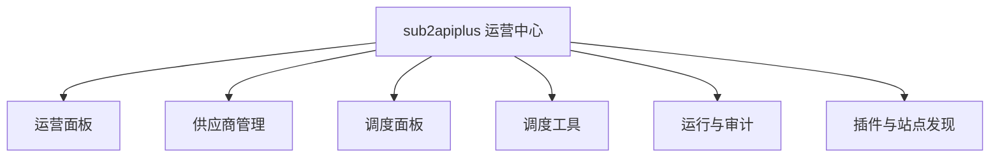

### 3.2 运营面板

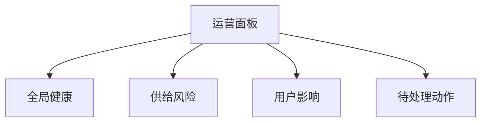

### 3.3 供应商管理

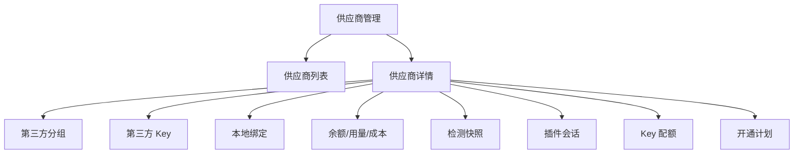

### 3.4 调度面板

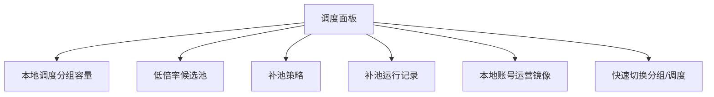

### 3.5 调度工具

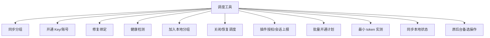

### 3.6 运行审计与插件站点

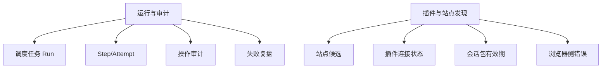

## 4. 运营面板

运营面板回答“现在系统是否能稳定服务用户”。

### 4.1 顶部总览

| 区块 | 指标 | 用途 |
|------|------|------|
| 用户请求 | 今日请求数、错误率、受影响用户 API Key 数 | 观察用户侧影响 |
| 本地调度 | 可用本地分组数、耗尽分组数、低容量分组数 | 观察网关容量 |
| 手动运维 | 本地账号 drift 数、原后台最近变更数、待同步本地状态数 | 兼容 Sub2API 原后台应急操作 |
| 供应商供给 | 可用供应商数、低倍率候选数、会话失效数、Key 配额风险供应商数 | 观察上游供给 |
| 余额风险 | 余额不足但低倍率供应商数、需要充值供应商数、余额未知候选数 | 防止把余额问题误判为渠道不通 |
| 检测成本 | 今日实测次数、实测 token 消耗、被通道监控拦截的实测次数 | 控制健康检测成本 |
| 插件连接 | 已连接浏览器数、待授权站点数、会话上报失败数 | 观察人工兜底能力 |
| 自动化 | 运行中任务、失败任务、待人工动作 | 观察系统协调是否卡住 |

### 4.2 用户影响视图

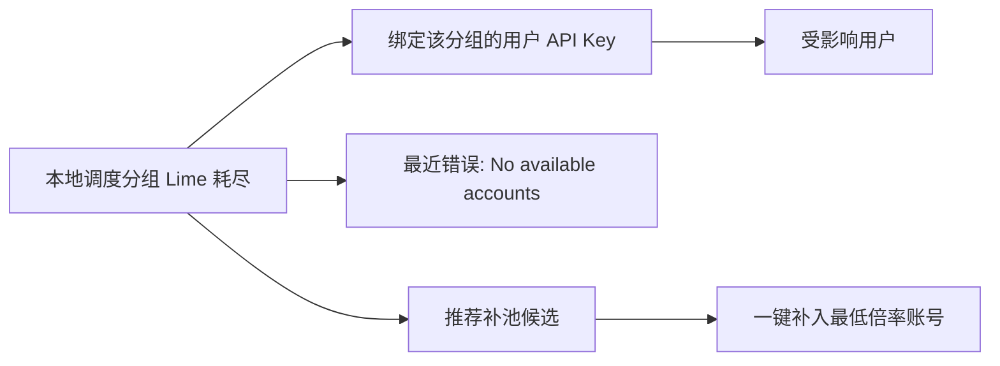

必须展示：

- 受影响本地调度分组。
- 该分组绑定的用户 API Key 数量，以及最多 20 个脱敏 Key 预览。
- 最近 5 到 30 分钟的失败请求数。
- 推荐补池候选和倍率。
- 可执行动作：补池、暂停坏账号、重跑检测、忽略。

当前已落地：

- 补池 dry-run/apply 的 `availability_before` 会返回 `active_api_key_count`、`impacted_api_keys` 和 `impacted_api_keys_truncated`。
- 调度中心和本地账号运营页展示前 5 个受影响 Key，包含 Key 名称、脱敏前后缀和用户 ID。
- 不返回完整 `api_keys.key`，只返回 `key_preview`。

### 4.3 待处理动作队列

动作建议必须是可解释的，不只是“失败”：

| 动作 | 原因 | 执行前检查 |
|------|------|------------|
| 同步供应商分组 | 分组快照过期或新增低倍率 | 会话有效 |
| 重新上报插件会话 | 后端直登失败或会话失效 | 插件已连接且当前站点匹配 |
| 生成批量开通计划 | 新低倍率分组未绑定 Key | 已读取 Key 配额或明确提示未知风险 |
| 开通第三方 Key | 开通计划确认可创建 | 供应商支持 CreateKey 且配额允许 |
| Key 配额不足 | 第三方供应商 Key 上限已满 | 展示被阻塞分组和推荐优先级 |
| Key 配额未知或不支持自动开通 | 供应商未配置上限或只允许人工 Key | 阻止盲目批量开通，提示配置策略或人工处理 |
| 余额不足但低倍率 | 候选倍率低但 `balance_blocked/recharge_required` | 不做实测，提示充值后重测 |
| 修复本地绑定 | Key 已创建但本地账号缺失 | 是否有 secret 或可复用账号 |
| 加入本地调度分组 | 本地分组容量不足 | 候选账号可调度 |
| 同步 Sub2API 本地状态 | 发现原后台可能手工改过分组或调度 | 已支持同步已选/当前页本地账号，读取当前分组和调度开关 |
| 采纳原后台变更 | Admin Plus 本地状态基线与 Sub2API 当前状态不一致 | 已支持展示变更前后差异，并可采纳 Sub2API 当前状态或恢复 Admin Plus 基线 |
| 最小 token 实测 | 通道监控缺失、过期、冲突或即将自动写回 | 余额可用、预算未超、冷却结束 |
| 关闭坏账号调度 | 永久错误或连续检测失败 | 已有可用替代账号 |

当前动作建议页已接入候选评估和供应商级 Key 配额信号：

- 页面入口：`/admin/actions`，旧 `/admin/automation/actions` 和 `/admin/operations/actions` 兼容重定向到当前入口。
- 前端调用 `GET /admin-plus/sub2api/local-account-ops` 获取 `candidate_status/blocked_reason/check_source`。
- 生成建议时把候选评估传给 `POST /admin-plus/actions/generate` 的 `candidate_evaluations`。
- 后端根据候选原因生成可解释动作：余额不足生成充值建议，Key 配额满生成配额审查建议，待开通生成开通/绑定建议，本地状态阻断生成本地状态审查建议，通道监控失败生成监控审查建议。
- 前端同时把供应商级 `key_limit_policy/key_limit_value/active_key_count/key_capacity_status` 传给动作生成接口。
- 后端会为供应商级 Key 配额生成 `supplier_key_capacity_exhausted`、`supplier_key_capacity_unknown`、`supplier_key_provisioning_unsupported`，用于提醒运营执行本地释放配额投影、通过注册用户会话停用/删除第三方 Key、配置策略、手动开通或执行显式部分开通。
- 动作建议页的开放信号统计已包含供应商级配额耗尽、未知和不支持自动开通，避免只在供应商分组弹窗中被动发现。
- 动作建议页还会读取本地分组容量、调度补池策略和最低倍率候选，向 `POST /admin-plus/actions/generate` 传入 `local_group_capacity`。
- 后端会为有启用用户 Key 且可调度账号为空或低于阈值的本地分组生成 `routing_refill` 建议，原因码为 `local_group_routing_refill_required` 或 `local_group_routing_low_capacity`。
- `routing_refill` 建议支持在动作建议页预览补池；审批后执行会调用 `POST /admin-plus/sub2api/routing/refill-local-group` 并携带 `action_id`，真实 apply 结果写入 `admin_plus_action_executions`。
- 动作建议页还会从本地账号运营镜像生成 `local_account_schedule_disable` 建议；仅当本地账号仍在调度、已绑定本地分组且阻断原因为 `channel_monitor_failed/channel_active_probe_failed` 时触发。审批后执行复用本地账号运营 `set_schedulable=false` apply，成功、空池保护阻断或失败都会写入 `admin_plus_action_executions`。
- 调度中心生成的 `local_group.routing.*` 和 `local_account.schedule.disable` 只作为 compat 工作台快照；scheduler 会自动把同一批本地路由信号同步到 `admin_plus_action_recommendations`，工作台按钮优先进入 `/admin/actions` 处理审批和执行历史。
- Key 配额类建议已提供“开通计划”入口，会深链到 `/admin/suppliers?open=groups&tool=key-plan&supplier_id=...`，打开对应供应商分组弹窗并自动生成开通计划。
- 开通计划面板已展示“阻塞分组修复”：可调整供应商 Key 配额、调整单个第三方分组 Key 配额、定位具体被阻塞分组，也可对占用配额的 Key 执行“本地释放配额投影”“第三方停用”“第三方删除”。
- 本地释放配额投影只影响 Admin Plus 的 `active_key_count` 派生结果；不会删除第三方后台 Key，也不会自动关闭本地账号调度。第三方停用/删除会先对已绑定本地账号执行本地调度 preview；运营可选择“同步”或“仅第三方”。第三方动作成功后才把本地投影写为 `disabled`，选择同步时再通过本地账号运营 apply 关闭对应本地账号调度；preview 被空池保护阻断时只允许继续“仅第三方”。
- 后端单分组 Key 创建也会执行配额保护，有限配额已满或不支持自动创建时不会调用第三方创建 Key。
- 余额不足但低倍率不会被通道失败覆盖，也不会触发 token 实测。
- 动作建议页已新增“低倍率余额机会”队列：从本地账号运营镜像读取 `balance_blocked/recharge_required` 候选，按有效倍率升序展示供应商、第三方分组、本地账号、余额和判断来源。
- 队列内“刷新余额”会调用供应商余额读取并重新加载本地账号运营镜像，用于充值后重算候选；“批量刷新余额”按当前余额机会涉及的供应商去重刷新，并限制并发，避免逐个供应商手工点击。
- “通道检测”是运营显式提交的检测任务，不作为余额不足时的默认实测。
- 余额从耗尽或低于阈值恢复时，后端会生成 `balance.recovered` 通知事件；动作建议生成器会把 open 的恢复事件转成 `supplier_balance_recovered_recheck`，提醒运营刷新候选、确认是否进入补池或调度。
- 动作建议通知第一阶段已接入通知中心：持久化后的余额、Key 配额、本地分组容量、drift/本地状态、通道失败、代理、纯度、成本和利润复核建议会映射为 `action.*` 通知事件，复用通知规则、投递记录、去重和静默窗口；飞书未配置时记录为 suppressed，不阻断动作建议生成。
- 动作建议页已读取最新 `SupplierCostSnapshot`：当充值、兑换、退款、调整、usage 成本账本推导的 `expected_balance_cents` 与实际余额快照不一致时，生成 `supplier_cost_balance_reconcile_anomaly`，提示运营优先排查账单差异，避免把余额异常误判为渠道不可用。该建议已使用 `supplier_cost_reconcile_adjustment` 动作类型，审批后可优先选择补充值、补兑换、补退款或补 usage，写回原始业务明细表并刷新成本快照；已人工复核但无法定位原始明细时，才使用 `manual_adjustment` 账本项做差额闭合。两类执行都会进入 `admin_plus_action_executions`，可查看前后快照和幂等回执。

### 4.4 当前已落地的本地账号运营闭环

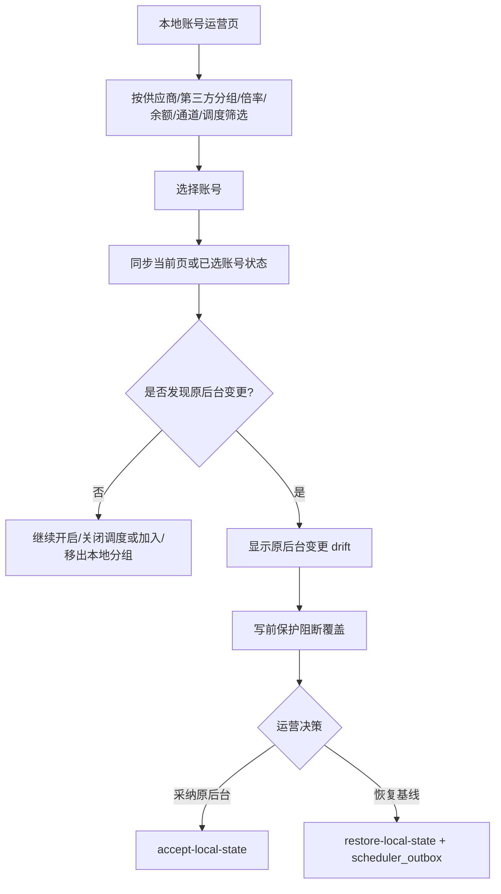

已落地能力：

- 页面入口：`/admin/local-account-ops`。
- 读模型：`GET /api/v1/admin-plus/sub2api/local-account-ops`。
- 同步动作：`POST /api/v1/admin-plus/sub2api/local-account-ops/sync-local-state`。
- 采纳动作：`POST /api/v1/admin-plus/sub2api/local-account-ops/accept-local-state`。
- 恢复动作：`POST /api/v1/admin-plus/sub2api/local-account-ops/restore-local-state`。
- 写动作：`POST /api/v1/admin-plus/sub2api/local-account-ops/preview` 和 `POST /api/v1/admin-plus/sub2api/local-account-ops/apply`。
- 写前保护：发现 `local_account_state_drift` 时返回 `LOCAL_ACCOUNT_STATE_DRIFT_PENDING`，避免覆盖 Sub2API 原后台应急操作。
- 差异处理：行内“变更”会同步该账号状态，展示 Admin Plus 基线和 Sub2API 当前值，并支持采纳或恢复。
- 原后台备选：行内复制本地账号 ID 并打开同站 `/admin/accounts?q=<account_id>`。

### 4.5 当前已落地的操作审计时间线

```mermaid
flowchart TD
    A[Admin Plus 写动作/自动任务] --> B[app/bizlogs Recorder]
    B --> C[ops_system_logs]
    C --> D[/admin/action-audits]
    D --> E[按动作/组件/结果/时间/关键字筛选]
    E --> F[查看操作者/账号/分组/影响/reason/错误]
```

当前入口：

- 页面入口：`/admin/action-audits`。
- 兼容入口：`/admin/automation/audits`、`/admin/operations/audits`。
- 底层日志：`GET /api/v1/admin/ops/system-logs`。
- 本地账号运营页顶部和行内账号可跳转审计。
- 供应商详情弹窗可按供应商跳转审计。
- 调度中心工作台可进入操作审计总览。

当前覆盖组件：

| 组件 | 覆盖动作 |
|------|----------|
| `admin_plus.sub2api` | 本地账号调度开关、本地分组加入/移出、本地状态同步、采纳原后台、恢复基线 |
| `admin_plus.login` | 供应商后端直登、会话读取失败 |
| `admin_plus.balance` | 供应商余额同步 |
| `admin_plus.registration` | 站点发现注册任务 |
| `admin_plus.extension` | Chrome 插件任务 |
| `admin_plus.mail` | 邮箱验证码读取 |

边界：

- 当前操作审计是只读时间线，不清理日志、不重放动作。
- 通用操作审计复用 `ops_system_logs`；动作建议执行历史已写入 `admin_plus_action_executions`，并可在动作建议页按建议展开分页查看执行回执、错误信息、操作者、幂等指纹、replay 标记、执行前后快照和脱敏摘要。普通本地账号手工写动作会创建 `local_account_manual_ops` executed recommendation，并写入同一执行历史；本地账号运营页执行后会保留确认面板，深链到 `/admin/actions?type=local_account_manual_ops&recommendation_id=...&execution_id=...`，动作建议页会自动展开并高亮对应 execution。
- `routing_refill/local_account_schedule_disable` 的 failed 执行已支持在动作建议页安全重试；重试重新走补池 apply 或本地账号运营 apply，并写入新的 `admin_plus_action_executions`，旧执行记录只作为 `retry_source_execution_id` 来源。
- `routing_refill/local_account_schedule_disable` 的 succeeded 执行已支持在动作建议页安全回滚；关调度回滚为恢复调度，补池回滚为移出本次补入账号，仍写入新的 `admin_plus_action_executions`，旧执行记录只作为 `rollback_source_execution_id` 来源。
- 本地路由类 `local_account_manual_ops/routing_refill/local_account_schedule_disable` 和成本对账调整 `supplier_cost_reconcile_adjustment` 的 replay 命中已回填原执行记录；成本对账明细修复第一阶段已复用同一 execution 表。dry-run 快照、更多非本地路由动作 replay 策略和自动明细定位/批量导入仍需要后续扩展统一动作执行模型承载。
- 调度 run/step 当前仍以调度中心自身 attempt 日志为准；本地容量巡检 step 的 `result_snapshot.actions` 已能深链到对应 `routing_refill/local_account_schedule_disable` 动作建议。该深链会把 `scheduler_run_id/scheduler_step_id` 带入动作执行请求，`admin_plus_action_executions` 结构化保存来源，动作建议执行历史可反跳到调度运行详情。

## 5. 供应商详情页

供应商详情页回答“这个供应商能提供什么、哪些已经被接入、哪些还能补”。

### 5.1 页面总览

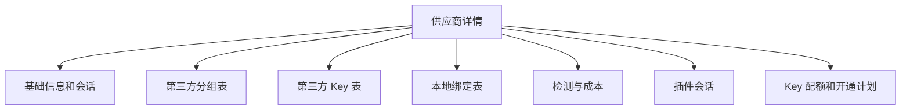

### 5.2 分组、Key 与本地绑定

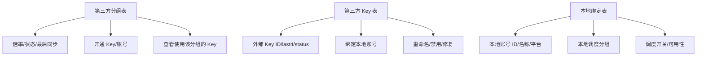

### 5.3 检测、插件和配额

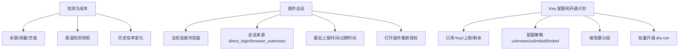

### 5.4 第三方分组表必须有的列

| 列 | 说明 |
|----|------|
| 第三方分组名 | 上游真实名称 |
| 标准名称 | Admin Plus 归一化后的名称 |
| 协议族 | OpenAI/Anthropic/Gemini/mixed |
| 有效倍率 | 排序和候选选择核心 |
| 余额状态 | `balance_ok/balance_low/balance_blocked/recharge_required/balance_unknown` |
| Key 配额 | `available/limited/exhausted/manual_only/unknown` |
| 状态 | active/missing/disabled |
| Key 状态 | 未开通/已开通/需人工 secret/失败 |
| 本地账号 | local_sub2api_account_id |
| 本地调度分组 | 已加入哪些本地 groups |
| 最近通道监控 | recommended/channel_failed/unknown/stale |
| 最近实测 | not_run/probe_passed/probe_failed/skip_balance/skip_budget |
| 动作 | 同步、开通、检测、加入分组、禁用 |

### 5.5 本地绑定表必须有的列

| 列 | 说明 |
|----|------|
| 供应商 | 供应商父级 |
| 第三方分组 | 上游号池/倍率来源 |
| 第三方 Key | external_key_id、last4、status |
| 本地账号 | accounts.id/name/platform，必须可定位到 Sub2API 原后台账号 |
| 来源短标签 | 供应商短名 + 第三方分组短名 + 有效倍率 |
| 本地调度分组 | account_groups |
| 本地可调度 | `IsSchedulable()` 结果 |
| 候选状态 | 可候选/不可候选/需人工 |
| 排除原因 | 会话失效、余额不足、Key 配额不足、通道监控失败、健康失败、未绑定、限流等 |
| 原后台状态 | 是否和 Sub2API 原后台当前状态一致，是否存在 drift |

### 5.6 当前已落地的供应商详情聚合视图

当前 P0 采用“供应商列表行内详情弹窗”的方式收口，不新增后端聚合接口，先复用已有 API 在前端聚合：

| 数据块 | 当前来源 | 展示目的 |
|--------|----------|----------|
| 第三方分组 | `GET /admin-plus/suppliers/:id/groups` | 查看供应商可提供的分组、状态、倍率和阻塞项 |
| 第三方 Key | `GET /admin-plus/suppliers/:id/keys` | 查看 external key id、last4、状态、manual secret、失败原因 |
| 本地绑定 | `GET /admin-plus/suppliers/:id/accounts` | 查看第三方 Key 落地到哪个本地账号 |
| 本地账号 | `GET /admin-plus/sub2api/accounts` | 补齐本地账号调度开关和本地分组 |
| 运营镜像 | `GET /admin-plus/sub2api/local-account-ops?supplier_id=:id` | 补齐 drift、余额状态、通道状态和原后台同步状态 |
| 渠道检测 | `GET /admin-plus/suppliers/:id/channel-checks` | 展示最新检测、推荐状态、调度快照和错误原因 |

当前详情弹窗已经展示：

- 顶部总览：第三方分组、Key 覆盖、可调度账号、可用通道、余额风险、drift 风险。
- Key 配额风险：已创建 Key、已绑定 Key、需补密钥/失败 Key、阻塞有效分组。
- 第三方分组覆盖表：分组、有效倍率、Key、本地账号、本地分组、余额、通道检测、drift。
- 第三方 Key 表：external id、last4、绑定状态、manual secret/failed 状态。
- 开通计划阻塞修复：`provider_key_exists_unbound` 可单个或批量导入第三方已有 Key 的本地投影，导入后进入 `manual_secret_required` 补密钥修复绑定。
- 修复绑定弹窗：`manual_secret_required` 默认进入补录密钥模式，运营粘贴第三方 Key 明文后创建/修复本地账号；failed 绑定失败仍可绑定已有本地账号。
- 本地绑定表：本地账号 ID、来源分组、有效倍率、调度、本地分组、余额、检测、drift。

边界：

- 该视图只读，不触发真实实测、不创建 Key、不写 `accounts/account_groups`。
- 当前 Key 配额已支持供应商级手工配置、分组级手工配置、已用数量派生、容量状态展示、开通计划阻塞、动作建议、本地释放配额投影、第三方 Key 停用/删除、第三方已有未绑定 Key 的脱敏投影导入，以及 `supplier_group_priority_ids` 计划优先级覆盖；Provider Adapter 已支持 new-api/sub2api 用户态 `ListKeys/ReadKeyCapacity` 分页读取真实 active Key 数，并在第三方已有未绑定 Key 或 Key 列表未读完整时阻断开通。真实最大上限和剩余容量自动读取仍依赖具体第三方是否暴露稳定接口。
- 详情页显示的 drift 来自本地账号运营镜像；处理 drift 仍回到 `/admin/local-account-ops` 的采纳/恢复闭环。

## 6. 调度面板

调度面板回答“本地 Sub2API 哪些分组缺容量，应该从哪里补”。

### 6.1 页面总览

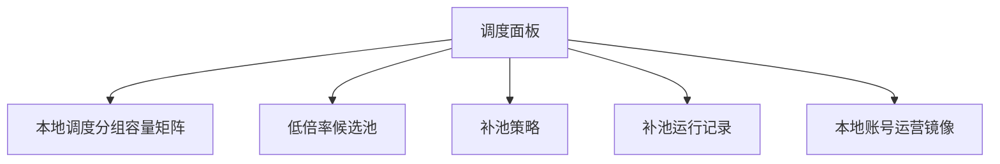

### 6.2 容量与候选

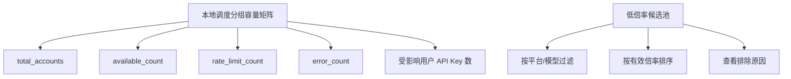

### 6.3 策略、运行与本地账号运营

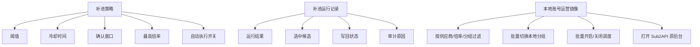

当前已落地的调度中心“供应商自动化”面板：

- `GET /api/v1/admin-plus/scheduler/suppliers/status` 会返回供应商自动化状态，并附带按供应商聚合的 `candidate_summary`。
- `GET /api/v1/admin-plus/scheduler/suppliers/:id/checklist` 会返回单供应商 Checklist，并附带同一份 `candidate_summary`。
- `candidate_summary` 来自本地账号运营镜像的 `CandidateEvaluator` 结果，不新增候选状态表。
- 表格展示候选状态、可用/阻断/未知数量、最低有效倍率、判断来源和阻断原因。
- 余额不足会显示 `balance_blocked/recharge_required`，建议充值后重跑候选评估；不会被覆盖成渠道坏。
- Key 配额阻断会显示 `capacity_blocked/key_capacity_exhausted`，用于提醒先做开通计划或人工处理配额。

当前已落地的补池第一阶段 API：

- 本地分组投影：`GET /api/v1/admin-plus/sub2api/groups`，返回本地调度分组、平台、状态、倍率、账号数、可调度账号数和启用用户 Key 数。
- API：`POST /api/v1/admin-plus/sub2api/routing/refill-local-group`。
- 运行记录：`GET /api/v1/admin-plus/sub2api/routing/refill-runs`，读取 `admin_plus_routing_refill_runs` 最近 dry-run、补入、跳过和失败记录。
- dry-run：只返回目标分组当前容量和最低倍率可用候选，不写本地分组。
- apply：当目标本地分组 `schedulable_accounts=0` 时，把最低倍率 `candidate_status=available` 本地账号加入目标本地分组。
- 写回边界：只走 `Sub2APIRoutingPort.EnsureAccountInGroup`，保留 drift/空池保护和 `scheduler_outbox`。
- 前端入口：本地账号运营页已提供“预览补池”和“补入最低倍率”，结果展示候选供应商、第三方分组、本地账号、倍率、补池前后可调度账号数和用户 Key 数。
- 用户影响：补池结果展示受影响 Key 的脱敏预览，运营可知道会影响哪些下游 Key，而不暴露完整密钥；同时展示目标本地分组近 24 小时成功请求量、错误量、上游 429 和 token 概览，逐 Key 标签展示近 24 小时成功/错误/429，并展示最近失败请求摘要。
- 影响详情组件：本地账号运营页和调度中心复用 `RoutingRefillImpactPanel` 展示补池影响，支持展开当前返回范围内的受影响 Key 和最近失败请求，并提供详情弹窗分页读取完整受影响 Key 列表和失败请求摘要，避免两个入口解释不一致。
- 影响详情 API：`GET /api/v1/admin-plus/sub2api/routing/group-impact/api-keys` 分页返回脱敏 Key 与逐 Key 近 24 小时统计；`GET /api/v1/admin-plus/sub2api/routing/group-impact/failures` 分页返回失败请求摘要，只包含状态码、上游状态码、脱敏 Key、账号、模型、错误类型和截断错误，不暴露请求体、headers 或完整 Key。
- 受控明细 API：`POST /api/v1/admin-plus/sub2api/routing/group-impact/failures/:failureID/sensitive-detail` 必须携带查询原因和 `local_group_id`，按错误 ID 与本地分组校验归属；仅返回 `ops_error_logs` 已记录错误字段的脱敏/截断值，并把查询原因和可用字段写入业务日志。当前请求体和 headers 已不存储，界面显示为 `not_recorded`。
- 调度入口：调度中心 Dashboard 侧栏已提供“路由补池”小工具，复用同一 API 与展示文案，并展示最近补池记录；`/admin/scheduler/routing-refill-history` 提供跨补池运行的全局影响历史，可按本地分组和状态筛选。
- 策略入口：调度中心设置页已提供“路由补池策略”，保存低容量阈值、补池冷却秒数、确认窗口秒数、最高倍率和自动补池开关。
- 策略生效：低容量阈值会影响调度中心容量矩阵和 `local_group.routing.low_capacity` 动作；调度中心手动补池会把最高倍率、冷却秒数和确认窗口传给补池 API。
- 补池目标：分组下拉来自本地分组投影，不从账号反推，因此空池分组也能被选择。
- 智能动作：调度中心会为启用用户 Key 但可调度账号不足的本地分组生成空池/低容量动作，动作理由包含最低倍率候选；今日工作台和智能动作列表可直接进入补池 dry-run。
- 动作建议入口：调度中心和动作建议页会把同一批空池/低容量信号生成或复用 `routing_refill` 持久建议；审批后的真实补池 apply 会写 `admin_plus_action_executions`，用于按建议查看执行历史。若执行来自调度 run/step 深链，执行历史会展示来源并可跳回调度中心。
- 自动执行器：`local.sub2api.routing.capacity_watch` 已接入 scheduler worker；自动补池开关默认关闭，开启后只自动补入空池分组，低容量分组仍先生成动作建议。
- 失败候选抑制：真实补池会读取同分组近期 failed 运行，临时排除已失败候选；如果候选全部被抑制，前端显示“候选近期失败，已临时抑制”。
- 限制：当前已补齐补池影响详情弹窗、分页摘要查询、受控错误明细查询和跨补池运行的全局影响历史页；自动写回能力已存在但默认关闭，需要运营显式开启。

### 6.4 本地调度分组容量矩阵

每一行是一个本地 Sub2API 调度分组：

| 列 | 说明 |
|----|------|
| 本地调度分组 | `groups.name` |
| 平台 | OpenAI/Anthropic/Gemini |
| 用户 API Key 数 | 绑定该分组的下游 Key 数 |
| 今日请求 | 用户侧使用量 |
| 可用账号 | `available_count` |
| 限流账号 | `rate_limit_count` |
| 错误账号 | `error_count` |
| 最低可补倍率 | 当前候选池最低倍率 |
| 推荐动作 | 补池/检测/同步/人工 |

当前已落地：

- 调度中心 Dashboard 已展示本地调度分组容量矩阵。
- 数据来自 `GET /api/v1/admin-plus/sub2api/groups`。
- 当前列：本地分组、平台、状态、用户 Key 数、账号数、可调度账号数、倍率和补池预览入口。
- 当前排序：空池优先，其次低容量，再按可调度账号数和名称排序。
- 推荐动作：空池/低容量分组会同步出现在调度中心智能动作中，可直接预览补池。
- 未完成列：今日请求、限流账号、错误账号和最低可补倍率，需要接入用量与候选池聚合。

### 6.5 候选池表

每一行是一个可补入候选：

| 列 | 说明 |
|----|------|
| 供应商 | supplier |
| 第三方分组 | supplier_group |
| 第三方 Key | supplier_key |
| 本地账号 | local_account |
| 有效倍率 | effective_rate |
| 通道监控 | recommended/channel_failed/unknown/stale |
| 实测状态 | not_run/probe_passed/probe_failed/skipped |
| 余额状态 | balance_ok/balance_low/balance_blocked/recharge_required/balance_unknown |
| Key 配额状态 | available/limited/exhausted/manual_only/unknown |
| 本地状态 | schedulable/rate_limited/error |
| 当前本地分组 | 已加入哪些 local_group |
| 可补入目标 | 哪些 local_group 可以补 |
| 排除原因 | `balance_blocked/key_limit_reached/channel_monitor_failed/health_failed/local_unschedulable` |

### 6.6 本地账号运营镜像

这个页面解决 Sub2API 原后台账号列表难以区分供应商和倍率的问题。它不是复制 Sub2API 后台，而是把本地账号与供应商来源合并展示，作为运营日常切换分组和调度的主入口。

当前已落地：

- 页面入口：`/admin/local-account-ops`
- 后端本地分组接口：`GET /api/v1/admin-plus/sub2api/groups`
- 后端读接口：`GET /api/v1/admin-plus/sub2api/local-account-ops`
- 后端同步接口：`POST /api/v1/admin-plus/sub2api/local-account-ops/sync-local-state`
- 后端采纳/恢复接口：`POST /api/v1/admin-plus/sub2api/local-account-ops/accept-local-state`、`POST /api/v1/admin-plus/sub2api/local-account-ops/restore-local-state`
- 后端动作接口：`POST /api/v1/admin-plus/sub2api/local-account-ops/preview`、`POST /api/v1/admin-plus/sub2api/local-account-ops/apply`
- 后端补池接口：`POST /api/v1/admin-plus/sub2api/routing/refill-local-group`
- 后端补池运行记录接口：`GET /api/v1/admin-plus/sub2api/routing/refill-runs`
- 当前版本已支持基础写回：单账号/批量开启或关闭调度、加入或移出一个本地分组。
- 当前版本已支持手动补池：选择目标本地调度分组后，可 dry-run 预览最低倍率候选，也可在分组耗尽时补入最低倍率可用账号。
- 目标本地调度分组选项来自 `sub2api/groups` 投影，能显示没有账号绑定但仍绑定用户 Key 的空池分组。
- 调度中心 Dashboard 也提供同一手动补池入口和最近补池记录，运营可在调度面板里直接处理耗尽分组，再回到本地账号运营页做细粒度筛选。
- 当前版本已展示统一候选状态：`candidate_status`、`blocked_reason`、`check_source`。余额不足会显示为 `balance_blocked/recharge_required`，不会被通道失败原因覆盖；账号绑定代理明确不可用时会显示 `check_source=proxy`，用于区分代理故障和供应商故障。
- 执行前必须 preview，展示本地分组影响、启用用户 API Key 数、操作前后可调度账号数、空池风险和 warning。
- 写回前会同步当前 Sub2API 本地状态；发现 `local_account_state_drift` 时以 `LOCAL_ACCOUNT_STATE_DRIFT_PENDING` 阻断，避免覆盖原后台手工变更。
- apply 写入本地 `accounts/account_groups` 后，会写 `scheduler_outbox` 的 `account_bulk_changed` 和相关 `group_changed`，触发调度刷新。
- apply 成功后会采纳本次写回后的本地状态到 `admin_plus_local_account_state_snapshots`。
- apply 走 Admin Plus 幂等包装，前端提交 `Idempotency-Key`，后端 scope 为 `admin-plus.local-account-ops.apply`。
- apply 会写 `app/bizlogs` 业务日志，记录操作者、动作、账号、目标分组、影响分组、空池阻断和写入结果。
- 已支持原后台变更差异弹窗：展示账号名、平台、类型、调度开关、本地分组的 Admin Plus 基线和 Sub2API 当前状态。
- 已支持采纳原后台变更：把 observed 状态写成 accepted 基线，并把 drift event 标记为 `accepted`。
- 已支持恢复 Admin Plus 基线：把 accepted 状态写回 Sub2API `accounts/account_groups`，写 `scheduler_outbox`，并把 drift event 标记为 `restored`。
- 已新增全局第三方分组查询：`GET /api/v1/admin-plus/supplier-groups`，本地账号运营页不再只从当前结果反推第三方分组选项。
- 已提供原后台兜底入口：行内“原后台”会复制本地账号 ID，并打开同站 `/admin/accounts?q=<account_id>`，便于在 Sub2API 原后台搜索定位。
- 兼容入口：`/admin/monitoring/account-runtime`、`/admin/operations/account-runtime` 会进入该页面。

已支持的筛选：

| 筛选 | 说明 |
|------|------|
| 关键词 | 支持本地账号、供应商、第三方分组、Key、本地分组名称 |
| 本地调度分组 | 例如 `Lime`，但结果必须继续显示供应商和倍率，不能只给账号列表 |
| 供应商 | 只看某个第三方供应商落地的本地账号 |
| 调度状态 | 已开启、已关闭 |
| 第三方分组 | 按上游号池或倍率分组收窄结果 |
| 最高倍率 | 例如只看 `<= 0.2x` 的账号，便于找低倍率候选 |
| 余额状态 | 余额可用、不足、未知、未绑定 |
| 通道状态 | 可用、未检测、请求错误、远端不可用、检测失败、慢响应等 |

待补齐筛选：

| 筛选 | 说明 |
|------|------|
| 完整倍率区间 | 当前已支持最高倍率；后续补最小/最大区间和预设档位 |
| 最近使用 | 最近 1 小时、24 小时、7 天未使用 |
| 多分组动作 | 当前 UI 一次选择一个目标本地分组，后端能力已支持多 `group_ids` |

必须有的列：

| 列 | 说明 |
|----|------|
| 本地账号 ID | 直接对应 Sub2API `accounts.id`，用于原后台定位 |
| 本地账号名 | 与 Sub2API 原后台一致 |
| 来源供应商 | supplier name + supplier id |
| 第三方分组 | supplier_group name |
| 有效倍率 | 用于快速选低倍率账号 |
| 本地调度分组 | 当前 `account_groups` |
| 调度开关 | 当前 `schedulable`；支持单账号和批量开启/关闭 |
| 本地状态 | active/error/rate_limited/temp_unschedulable |
| 通道监控 | 最近通道监控推荐状态 |
| 余额状态 | 是否因余额阻塞 |
| 最近使用 | last_used_at、最近请求数，待补齐 |
| drift 状态 | Sub2API 原后台是否有未采纳变更 |
| 操作 | 已支持加入/移出本地分组、开启/关闭调度、同步本地状态、复制账号 ID 并打开原后台兜底入口 |

快速切换要求：

- 支持单账号和批量账号修改本地调度分组。
- 修改前展示 dry-run：将加入/移出的本地分组、启用用户 API Key 数、是否会导致目标分组空池。
- 修改执行前重新读取本地状态，发现原后台手工变更则停止写回。
- 修改后重新读取 Sub2API 本地状态确认写回成功，并刷新页面。
- 对批量操作必须要求明确选择，不允许默认对筛选结果全量执行。
- 当 Admin Plus 写回失败时，提供 Sub2API 原后台备选操作提示和账号定位信息。

当前缺口：

- 已有 `app/bizlogs` 业务日志；动作建议已有 `admin_plus_action_executions` 执行历史和前端分页时间线，`routing_refill` 补池 apply、坏账号关调度 apply 与本地账号运营普通手工写动作已接入该执行模型。最小 token 实测仍需继续统一。
- UI 先支持单目标本地分组，后续可放开多分组批量动作。
- 空池保护默认阻断，暂不提供 `allow_empty_pool` 高级强制开关。
- 独立 Sub2API 后台地址配置、精确账号深链、写回失败诊断和批量 drift 处理队列还需要继续补齐。

### 6.7 Sub2API 原后台备选操作

保留 Sub2API 原后台作为应急备选，但 Admin Plus 要降低人工识别成本：

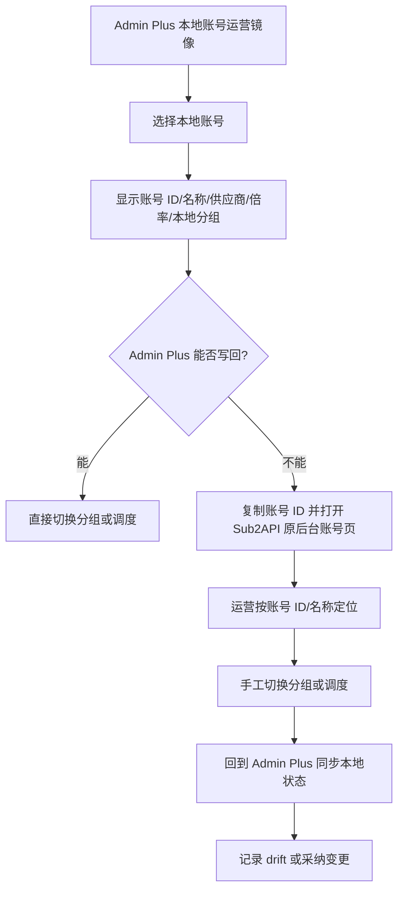

备选操作不应成为主流程，因为原后台看不到第三方供应商倍率、余额、Key 配额和用户影响；它只用于 Admin Plus 功能缺失、故障或紧急手工处理。

## 7. 调度工具

调度工具是运营者处理异常的命令中心，每个工具都必须支持 dry-run、执行、审计。

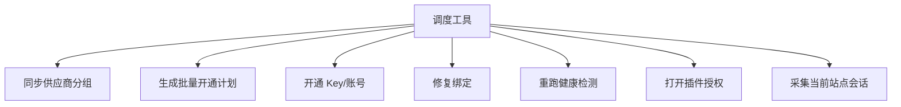

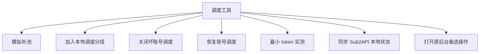

| 工具 | 输入 | 输出 |
|------|------|------|
| 同步供应商分组 | supplier_id | 新增/缺失/倍率变化 |
| 开通 Key/账号 | supplier_group_id、local_group_ids | supplier_key、local_account |
| 生成批量开通计划 | supplier_id、supplier_group_ids、优先级策略 | 可创建/被阻塞分组、配额风险 |
| 修复绑定 | supplier_key_id 或 local_account_id | 修复后的绑定投影 |
| 重跑健康检测 | supplier_id / supplier_group_id | 优先读取通道监控和余额，必要时才实测 |
| 最小 token 实测 | supplier_group_id、local_account_id、model_scope | active_probe 样本和检测成本 |
| 加入本地调度分组 | local_account_id、local_group_id | 更新后的本地账号分组 |
| 关闭坏账号调度 | local_account_id、reason、action_id | `schedulable=false`、空池保护结果与 `admin_plus_action_executions` 回执 |
| 恢复账号调度 | local_account_id、reason | `schedulable=true` 与审计 |
| 模拟补池 | local_group_id、platform、model | 候选排序和预计影响 |
| 同步 Sub2API 本地状态 | local_account_id 或 local_group_id | 本地分组、调度开关、状态 drift |
| 打开原后台备选操作 | local_account_id | Sub2API 账号定位信息和跳转 |
| 打开插件授权 | supplier_id 或 site_candidate_id | 浏览器侧授权连接 |
| 采集当前站点会话 | supplier_id、origin | browser_session 与 session probe |

## 8. 系统协调可视化

必须有一个“链路图”用于排障和解释。

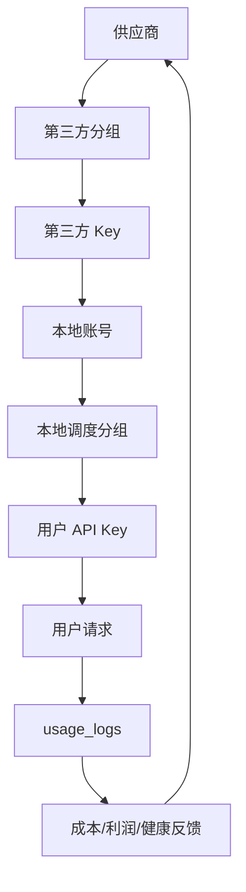

链路图点击任一节点，都应能展开：

- 当前状态。
- 最近同步时间。
- 最近检测结果。
- 最近错误。
- 关联对象。
- 可执行动作。

## 9. 现在没有但必须有的能力

| 能力 | 为什么必须有 | 优先级 |
|------|--------------|--------|
| 全局链路图 | 运营必须看清供应商分组到用户 API Key 的完整影响链 | P0 |
| 本地分组容量矩阵 | 补池要以本地用户服务影响为中心 | P0 |
| 候选池排除原因 | 只显示“无候选”无法排障 | P0 |
| 补池 dry-run | 自动写本地调度前必须可预览影响 | P0 |
| 用户影响分析 | 关闭账号或分组耗尽前要知道影响哪些用户 API Key | P0 |
| 绑定修复向导 | 第三方 Key、本地账号、绑定投影任一断裂都要可修 | P0 |
| 数据新鲜度标记 | 倍率、余额、检测过期时不能自动决策 | P0 |
| Key 配额风险提示 | 批量开通所有分组可能因供应商 Key 上限或单个第三方分组上限失败；当前已支持供应商级/分组级手工配置、展示、开通计划阻塞、动作建议、阻塞分组修复提示、本地释放配额投影、第三方 Key 停用/删除，以及 Provider 分页读取第三方 active Key 数；真实最大上限自动读取待具体供应商适配 | P0 |
| 批量开通 dry-run | 当前已在供应商分组弹窗提供“开通计划”，展示可创建、已覆盖、阻塞分组、优先级和修复入口，阻塞时禁止提交批量任务 | P0 |
| 余额不足与渠道不可用分离 | 避免把低倍率优质供应商误判为坏渠道 | P0 |
| 实测成本控制 | 健康实测会消耗 token，必须排在通道监控和余额之后 | P0 |
| 本地账号运营镜像 | 运营筛选本地分组时必须能同时看到供应商、倍率和调度状态 | P0 |
| 原后台备选操作兼容 | Admin Plus 故障或功能缺失时仍能回到 Sub2API 后台处理，并同步回来 | P0 |
| 本地状态 drift 检测 | 原后台人工改动不能被 Admin Plus 自动覆盖 | P0 |
| 供应商会话健康面板 | 会话失效会导致同步、开通和检测全部失败 | P1 |
| Chrome 插件连接面板 | 后端直登失败、验证码、2FA、强风控时必须有浏览器兜底入口 | P0 |
| 站点候选审批 | 插件发现的新供应商不能静默入库，必须人工确认 | P0 |
| 会话来源与有效期可视化 | 运营要知道当前事实来自直登还是插件，以及是否过期 | P0 |
| 策略中心 | 自动补池、自动关调度、阈值和冷却必须集中配置 | P1 |
| 审计时间线 | 自动化必须能追溯是谁、因为什么、改了什么 | P1 |
| 低倍率发现提醒 | 新低倍率分组出现时要主动提示开通 | P1 |
| 模型级候选视图 | 不同模型/协议支持范围不同，不能只看分组倍率 | P2 |

## 10. 运营日常流程

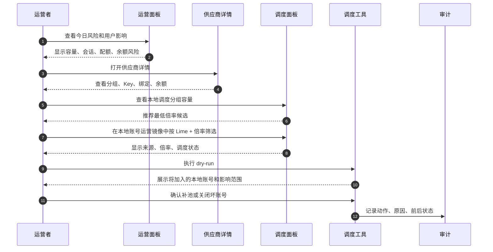

## 11. 页面命名建议

| 导航 | 页面名 | 目的 |
|------|--------|------|
| 运营中心 | 运营面板 | 看全局风险、用户影响、待办 |
| 供应商 | 供应商管理 | 管供应商、分组、Key、余额、检测 |
| 调度 | 调度面板 | 看本地分组容量和候选池 |
| 调度 | 本地账号运营 | 按供应商、倍率、本地分组快速切换账号调度 |
| 调度 | 调度工具 | 执行补池、修复、检测、开关调度 |
| 调度 | 策略设置 | 配置阈值、冷却、自动化权限 |
| 审计 | 运行记录 | 看 Scheduler run/step/attempt |
| 审计 | 操作审计 | 看人工和自动动作 |

这些页面可以分阶段实现，但概念和命名应一次定准，避免后续把供应商后台“令牌管理”和本地 Sub2API “用户 API Key 管理”混在同一个页面里。
