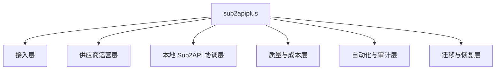
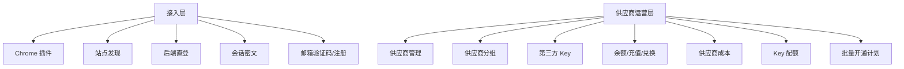
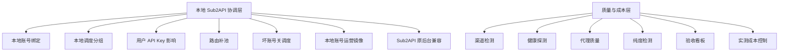
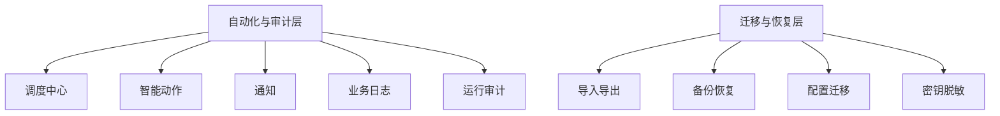
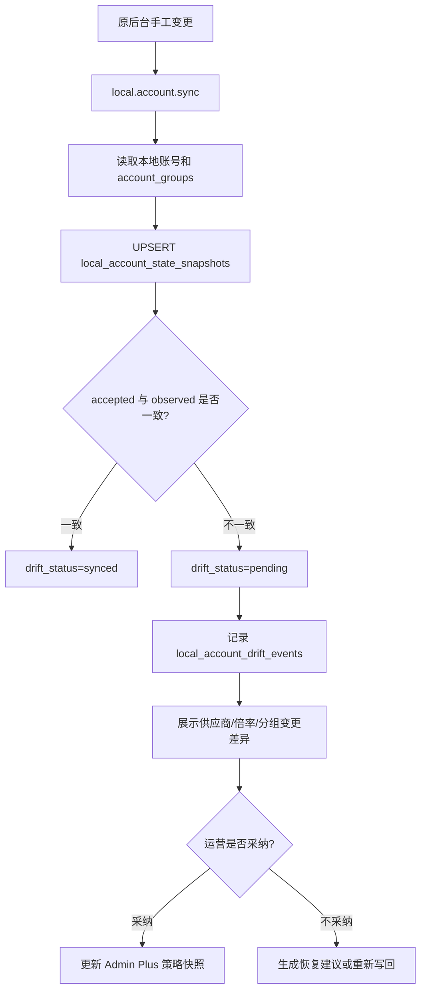
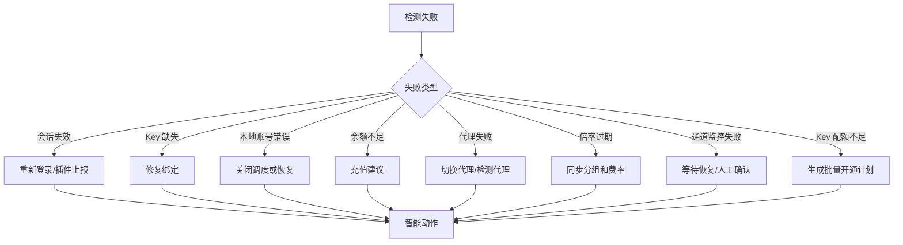
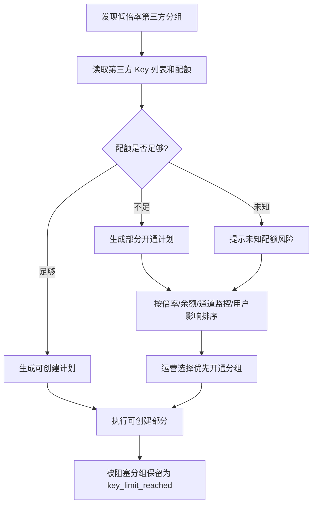
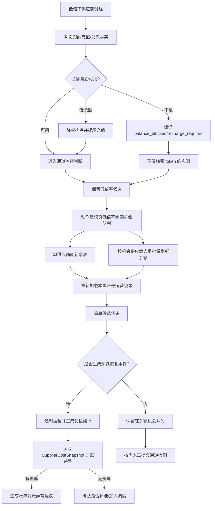
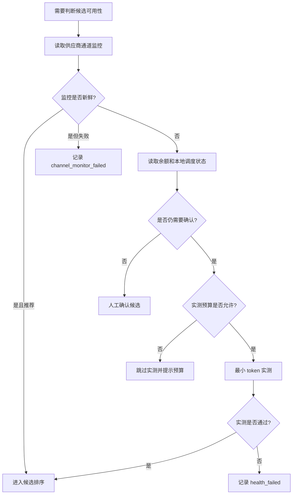

# 06. 功能域清单与必须补齐能力

版本：v0.1.0
日期：2026-07-08

## 1. 设计结论

sub2apiplus 要服务运营者和系统协同，不能只实现“供应商列表 + 本地账号绑定”。完整能力应覆盖：

```text
站点发现/插件
  -> 供应商接入/会话
  -> 分组/倍率/Key/Key 配额/本地账号
  -> 通道监控/余额门禁/实测成本/代理
  -> 调度/补池/本地账号运营镜像/用户影响
  -> 通知/审计/导入导出/备份
```

这些能力可以分阶段交付，但文档和导航必须提前统一，否则运营者会在多个页面之间找不到链路。

数据库表域、ER 图、导入导出边界和核心流程表级数据流转，以 [08-database-design.md](08-database-design.md) 为事实源。

## 2. 功能域全景图

不要用单张大图展示全部功能，Markdown 会压缩到不可读。这里按“总览 + 分域”拆图。

### 2.1 总览



### 2.2 接入与供应商运营



### 2.3 本地协调与质量成本



### 2.4 自动化与迁移



## 3. 功能域状态表

| 功能域 | 当前代码落点 | 运营价值 | 必须补齐的可视化 |
|--------|--------------|----------|------------------|
| Chrome 插件 | `extension/`、`backend/internal/adminplus/app/extension` | 浏览器侧站点识别、授权连接、会话上报 | 插件连接状态、站点候选、会话上报失败 |
| 站点发现 | `app/sitediscovery`、`app/sitecatalog` | 发现可接入供应商，避免人工录 URL | 候选审批、支持度、接入 Checklist |
| 供应商管理 | `app/suppliers`、`/admin/suppliers` | 供应商父级台账 | 已有供应商详情聚合弹窗：分组、Key、本地绑定、倍率、余额、通道、drift；后续补独立详情页和动作时间线 |
| 会话管理 | `app/sessions`、Provider Adapter | 后端直登和插件会话统一入口 | 会话来源、过期时间、刷新动作 |
| 邮箱验证码/注册 | `app/mailverification`、provider registration | 自动注册或验证供应商账号 | 注册步骤、验证码等待、失败重试 |
| 供应商分组 | `app/suppliergroups` | 同步第三方分组和倍率 | 变化事件、低倍率发现、缺失分组 |
| 第三方 Key | `app/supplierkeys` | 创建供应商 Key 并落地本地账号 | Key 状态、本地绑定、修复向导 |
| 第三方 Key 配额 | `app/supplierkeys`、`app/suppliergroups`、`app/actions`、Provider Adapter | 处理供应商最多创建 10 个或更少 Key、以及单个第三方分组独立 Key 上限的限制 | 已支持供应商级策略配置、分组级策略配置、已用数量派生、容量状态展示、批量计划阻塞、供应商级动作建议，以及 new-api/sub2api Provider 分页读取 active Key 数；真实最大上限自动读取待具体供应商适配 |
| 批量开通计划 | `app/supplierkeys`、`app/provisionjobs` | 把“一键创建”改成可预览、可解释的 dry-run | 已支持可创建分组、已覆盖分组、被阻塞分组、默认低倍率优先、运营上移/下移优先级覆盖、阻塞提交和显式部分开通 |
| 本地 Sub2API 读取 | `app/sub2api` | 读取本地用量和运行态 | 本地账号快照、用户影响链路 |
| 本地账号运营镜像 | `app/sub2api`、`app/supplieraccounts` | 在 Admin Plus 里按供应商、倍率、本地分组快速识别和切换账号 | 供应商来源、第三方分组、有效倍率、调度状态、drift |
| Sub2API 原后台兼容 | `app/sub2api`、`admin_plus_local_account_state_snapshots` | Admin Plus 故障或功能缺失时保留原后台应急操作 | 账号 ID/名称定位、打开原后台、同步本地变更、采纳/恢复差异 |
| 渠道检测 | `app/channelchecks` | 优先使用供应商通道监控判断候选是否可用 | 推荐状态、失败原因、自动暂停影响 |
| 余额同步 | `app/balances` | 判断供应商是否能立刻调用，不能误判为渠道坏 | 余额趋势、低余额告警、充值建议 |
| 健康探测 | `app/health`、`app/channelchecks` | 主动请求验证延迟和错误，优先级最低 | 第一阶段已支持渠道检测每日预算、同分组冷却和预算/冷却跳过；后续补按模型/动作来源的预算和成本归集 |
| 费率同步 | `app/rates`、`app/accountratesync` | 保证倍率排序准确 | 账号倍率同步历史、过期标记 |
| 成本/账务 | `app/costs`、`app/usagecosts` | 核算供应商成本和利润 | 充值、兑换、usage、差异 |
| 代理管理 | `app/proxy`、本地 Sub2API `accounts.proxy_id/proxies`、`app/candidateeval` | 保证上游请求网络质量 | 代理中心管理注册/采集代理；候选评估第一阶段读取网关真实绑定代理，明确不可用输出 `check_source=proxy`，无代理或未知不阻断 |
| 模型级候选 | `app/candidateeval`、`app/sub2api`、`admin_plus_supplier_groups.model_family/model_spec` | 避免给目标模型补入明确不支持的账号 | 第一阶段已支持 `model_scope/model_match_status`，补池按模型范围筛选；未知模型不阻断，明确不匹配才阻断 |
| 纯度检测 | `app/purity`、`app/scheduler`、`app/candidateeval`、`app/sub2api` | 验证账号是否符合目标模型/能力 | 第一阶段已联动候选评估：本地账号运营镜像读取最近纯度检测 step，明确失败输出 `purity_failed`，风险态输出 `purity_risk`，未知不阻断；本地账号运营页、供应商详情和动作建议展示纯度状态；当前页可按模型/能力标签圈选过期账号并进入受控复检队列 |
| 看板/验收 | `app/kanban` | 汇总缓存效率、价格源、验收证据 | 运营验收报告、证据链、验收步骤矩阵 |
| 调度中心 | `app/scheduler` | 统一计划、run、step、attempt | 运行详情、失败重试、队列状态 |
| 智能动作 | `app/actions`、`/admin/actions` | 把异常转成可执行建议 | 已有待办队列、开放信号、配额建议到开通计划深链、本地路由执行历史、成本对账调整和明细修复执行；后续补自动明细定位和批量导入向导 |
| 通知 | `app/notifications`、`app/actions` | 飞书等外部提醒 | 已覆盖余额、健康、费率、成本和动作建议通知第一阶段；动作建议按分组容量、Key 配额、通道失败、代理、纯度、drift/本地状态等映射到通知规则、投递记录和抑制记录 |
| 业务日志 | `app/bizlogs`、`/admin/action-audits`、`admin_plus_action_executions` | 自动化动作可追踪 | 已有操作审计时间线、动作执行前后快照、本地路由类失败安全重试和成功执行回滚 |
| 导入导出 | `app/importexport` | 换服务器、迁移配置 | 核心数据导出、脱敏、恢复预检 |

## 4. 必须补齐的跨域链路

### 4.1 从插件到供应商接入


必须补齐：

- 插件连接面板。
- 站点候选审批。
- 会话上报记录。
- 会话可用性探测。
- 失败时提示使用后端直登或插件兜底。

### 4.2 从供应商分组到用户影响


必须补齐：

- 任何本地账号变更前展示影响的本地调度分组。
- 任何本地调度分组耗尽时展示影响的用户 API Key 数。
- 任何候选补池时展示来源供应商、第三方分组、第三方 Key、本地账号。
- 任何本地账号列表都必须能看到供应商来源和有效倍率，不能只显示 Sub2API 本地账号名。

### 4.2.1 从 Sub2API 原后台手工变更到 Admin Plus 同步



必须补齐：

- 已支持从 Admin Plus 行内复制账号 ID 并打开同站 Sub2API 原后台账号页。
- 已支持从 Sub2API 原后台返回后同步当前页或已选本地账号状态。
- 已支持 `LOCAL_ACCOUNT_STATE_DRIFT_PENDING` 写前保护，不能被 Admin Plus 手动写回覆盖；自动补池和坏账号关调度必须复用已经收口的 `Sub2APIRoutingPort`。
- 已支持 drift 差异详情、采纳原后台变更、恢复 Admin Plus 基线。
- 本地账号命名要包含短供应商名和倍率，兼容原后台人工搜索。
- 待补齐批量 drift 处理队列和更完整的操作时间线。

### 4.3 从检测失败到动作闭环



必须补齐：

- 错误分类。
- 动作建议。
- dry-run。
- 执行后审计。
- 失败重试。当前 `routing_refill/local_account_schedule_disable` 已支持 failed 执行安全重试，其他动作类型仍需按适配器语义补齐。
- 成功回滚。当前 `routing_refill/local_account_schedule_disable` 已支持 succeeded 执行安全回滚，其他动作类型仍需按适配器语义补齐。

### 4.4 从 Key 配额到批量开通计划



当前已落地：

- 供应商级 `key_limit_policy/key_limit_value` 已保存，`active_key_count/key_capacity_status` 从第三方 Key 投影派生。
- 分组级 `admin_plus_supplier_groups.key_limit_policy/key_limit_value` 已保存，默认 `inherit` 继承供应商级策略；显式配置 `unknown/limited/unlimited/unsupported` 后，开通计划和单分组开通都会执行分组级校验。
- 批量开通前必须生成 dry-run 计划；配额未知、不支持自动开通或配额不足时不会静默创建部分分组。
- 运营显式确认 `allow_partial=true` 时，只允许执行因 `key_capacity_exhausted/group_key_capacity_exhausted` 被部分阻塞的可创建分组。
- Provider Adapter 第一阶段已支持 `ListKeys/ReadKeyCapacity`：new-api/sub2api 通过注册用户会话分页读取第三方 Key 列表，汇总真实 active Key 数，并脱敏 key/token/api_key 等敏感字段。
- 第三方后台已有同分组 active Key 但 Admin Plus 没有绑定投影时，开通计划阻塞为 `provider_key_exists_unbound`，避免重复创建。
- 第三方 Key 列表未读完整时，开通计划和单分组开通都会阻塞为 `provider_key_capacity_incomplete`，避免在真实占用不明时继续创建。
- 动作建议页已接收供应商级 Key 配额信号，生成 `supplier_key_capacity_exhausted`、`supplier_key_capacity_unknown`、`supplier_key_provisioning_unsupported`。
- Key 配额类建议已能深链到对应供应商分组弹窗并自动生成开通计划。
- 开通计划已支持运营调整优先级：默认最低有效倍率优先；运营上移/下移后会用 `supplier_group_priority_ids` 重新 dry-run，真实提交沿用同一顺序。
- 动作建议页已接收本地分组容量信号，生成 `routing_refill` 类型的 `local_group_routing_refill_required/local_group_routing_low_capacity` 建议。
- 审批后的 `routing_refill` 建议可直接调用补池 apply，并把成功、跳过或失败结果写入 `admin_plus_action_executions`。
- 动作建议页已接收本地账号关调度信号，生成 `local_account_schedule_disable` 类型的 `local_account_schedule_disable_required` 建议；审批后的执行复用本地账号运营 apply，并把成功、空池保护阻断或失败结果写入 `admin_plus_action_executions`。
- 普通本地账号手工写动作已创建 `local_account_manual_ops` executed recommendation，并把成功、空池保护阻断或失败结果写入同一 `admin_plus_action_executions`。
- 调度 run/step 详情进入动作建议的深链会携带 `scheduler_run_id/scheduler_step_id`；执行历史保存该来源并可反跳回调度运行详情，`admin_plus_scheduler_actions` 仍只作为 compat 工作台快照。
- 动作执行历史已保存 `idempotency_key_hash/idempotency_replayed/before_snapshot/after_snapshot`；本地账号手工写、补池和坏账号关调度 apply 会展示幂等指纹与前后容量/影响摘要，同 key replay 命中时只回填原执行记录，不新增执行或重放写回。
- 动作执行历史已支持 `routing_refill/local_account_schedule_disable` 的 failed 执行安全重试；重试记录通过 `retry_source_execution_id` 关联旧执行，仍写入同一 `admin_plus_action_executions` 事实源。
- 动作执行历史已支持 `routing_refill/local_account_schedule_disable` 的 succeeded 执行安全回滚；回滚记录通过 `rollback_source_execution_id` 关联旧执行，仍写入同一 `admin_plus_action_executions` 事实源。
- 调度中心的 `local_group.routing.*` 和 `local_account.schedule.disable` 工作台动作已自动归并到 `admin_plus_action_recommendations`；`admin_plus_scheduler_actions` 保留为 compat 快照和跳转来源，不再作为本地路由类动作的执行事实源。
- 调度运行详情已读取容量巡检 step 的 `result_snapshot.actions`，可直接深链到对应本地分组补池建议或本地账号关调度建议。
- 开通计划面板已展示被阻塞分组修复区，支持调整供应商配额、调整单个第三方分组配额、定位分组、本地释放配额投影、第三方停用 Key 和第三方删除 Key。
- 阻塞分组修复区已支持三类释放动作：本地释放只改 Admin Plus 投影；第三方停用/删除会先对已绑定本地账号执行本地调度 preview，再通过 Provider Adapter 调用注册用户侧 Key 接口，成功后把 `admin_plus_supplier_keys.status` 标记为 `disabled`。运营选择“同步”时，第三方成功后再调用本地账号运营 apply 关闭对应本地账号调度；空池保护阻断时只允许继续“仅第三方”。
- 修复绑定弹窗已支持 `manual_secret_required` Key 的手动补密钥：运营补录第三方 Key 明文后，后端只保存 fingerprint/last4，并复用本地账号创建和绑定链路完成落地。
- `provider_key_exists_unbound` 阻塞分组已支持单个或批量导入第三方已有 Key 的本地投影，导入后进入补密钥修复绑定流程。
- 单分组 Key 创建也会执行供应商级配额保护，不能绕过计划超额创建。

必须补齐：

- 真实最大 Key 上限自动读取仍取决于供应商是否暴露稳定接口；当前 `ReadKeyCapacity` 对 new-api/sub2api 使用 `LimitKnown=false/limit_source=not_exposed_by_provider` 表达未知上限。

### 4.5 从余额不足到保留低倍率候选



必须补齐：

- `balance_blocked` 不能进入 `channel_unavailable`。
- 余额不足时不触发实测，避免继续消耗供应商余额和 token。
- 当前动作建议页已有“低倍率余额机会”队列，运营可在充值后单个或批量刷新余额并重算候选；批量刷新按供应商去重并限制并发。
- 余额恢复事件会进入通知投递链路，并在动作建议中生成复检建议，提示运营确认是否补池或重新加入调度。
- 成本快照中的 `balance_delta_cents` 会进入动作建议；充值、兑换、退款、调整、usage 明细与实际余额不一致时生成账单对账异常建议。当前建议类型为 `supplier_cost_reconcile_adjustment`，审批后可按差额方向写回缺失充值、兑换、退款或 usage 原始明细并刷新快照；已人工复核但无法定位原始明细时，可写入 `manual_adjustment` 账本项。两类执行都记录统一 action execution。
- 通道检测必须由运营显式触发，不作为余额不足时的默认实测。

### 4.6 从通道监控到实测



当前落地：

- `channelchecks.Check` 支持每日 token 预算、单次估算 token 和同供应商分组冷却。
- 预算/冷却基于 `admin_plus_supplier_channel_check_snapshots` 中当天或冷却窗口内的主动实测快照估算，不新增表。
- 调度中心设置已保存 `channel_check_daily_budget_tokens` 和 `channel_check_probe_cooldown_seconds`，自动渠道检测会把预算、冷却和慢阈值传入服务层。
- 命中预算或冷却时只返回本次跳过结果，不保存失败快照，不自动关闭本地账号调度。

仍需补齐：

- 按模型、供应商、动作来源拆分预算。
- 更细的实测原因审计和成本归集。
- 通道监控、余额、本地状态已足够时不实测。

## 5. 导入导出与换服务器

换服务器场景不能只依赖数据库备份。Admin Plus 需要一个运营级导入导出：

| 数据 | 是否导出 | 说明 |
|------|----------|------|
| 供应商父级 | 是 | 核心配置 |
| 供应商分组投影 | 是 | 可重新同步，但导出可加快恢复 |
| 第三方 Key 投影 | 是 | 只导出脱敏元数据和绑定关系 |
| Key 配额策略 | 是 | 导出运营录入或探测到的限制，导入后仍需重新探测 |
| 本地账号绑定投影 | 是 | 用于恢复链路 |
| 路由补池策略 | 是 | 关键运营策略 |
| 路由补池动作建议和执行历史 | 是 | 空池/低容量补池审批、执行和复查 |
| 坏账号关调度动作建议和执行历史 | 是 | 通道失败账号关调度审批、空池保护和复查 |
| 本地账号手工写执行历史 | 是 | 手工开关调度、加入/移出本地分组的执行记录和复查 |
| 动作执行来源反跳调度 run/step | 是 | 从调度详情处理动作后，可在执行历史里追溯触发来源 |
| 动作执行幂等和前后快照 | 是 | 本地账号手工写、补池、关调度 apply 的幂等指纹、replay 回填、前状态和后状态审计 |
| 余额告警阈值 | 是 | 运营策略，余额事实本身可重新同步 |
| 调度计划 | 是 | 自动化配置 |
| 通知规则 | 是 | 告警配置 |
| 代理配置 | 是，敏感字段脱敏或加密 | 运行依赖 |
| 会话密文 | 默认不导出 | 建议迁移后重新登录或插件上报 |
| 第三方 Key 明文 | 不导出 | 安全边界 |
| 日志/运行记录 | 不导出或可选归档 | 非核心恢复数据 |
| 检测快照 | 可选 | 可重跑生成 |

必须补齐：

- 导出预检。
- 导入预检。
- 脱敏报告。
- 目标服务器冲突检测。
- 导入后修复向导。

## 6. 分阶段补齐优先级

| 阶段 | 目标 | 必须包含 |
|------|------|----------|
| P0 | 看清链路并能人工修复 | 全局链路图、插件连接面板、供应商详情、调度面板、本地账号运营镜像、候选池、Key 配额提示、余额门禁、原后台兼容、dry-run、审计 |
| P1 | 自动化稳定运行 | 已可收口：调度计划、动作建议、Key 配额、余额门禁、补池、关调度、重试/回滚、会话健康和核心导入导出边界 |
| P2 | 成本和质量优化 | 模型级候选、纯度检测联动与 7 天过期策略、当前页模型/能力圈选复检、代理联动、通知矩阵、动作建议超时未处理可视化、实测预算/冷却、验收步骤矩阵、目标毛利缺口和建议价偏离第一阶段已完成，当前运营闭环可收口；自动升级投递、值班分组、多渠道通知、代理深度联动、完整财务汇总和细粒度实测成本归集进入后续 P2.x 增强 |
| P3 | 本轮不实施 | `RemoteAdminAPIRoutingPort` 第一阶段已保留；多 Sub2API 实例、实例维度容量和跨实例策略不进入当前实施范围 |

## 7. 不能遗漏的导航入口

```text
运营中心
  运营面板
  站点发现
  插件连接
供应商
  供应商管理
  分组与倍率
  第三方 Key
  Key 配额
  批量开通计划
  本地绑定
调度
  调度面板
  智能动作
  本地账号运营
  调度工具
  补池策略
  运行记录
质量
  通道监控
  健康检测
  实测预算
  代理质量
  纯度检测
财务
  余额
  充值建议
  充值/兑换
  成本对账
系统
  通知
  导入导出
  操作审计
```

导航可以按现有前端逐步收敛，但能力边界应以这份清单为准。
