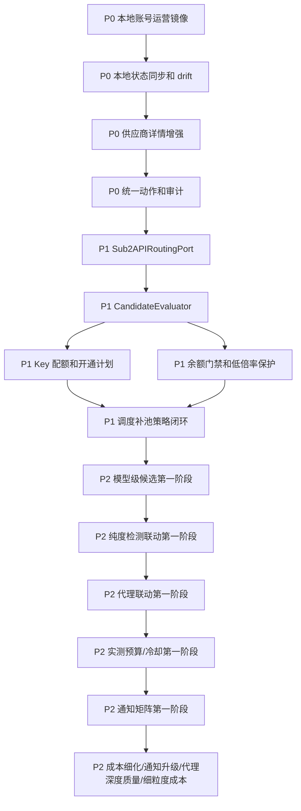

# 07. 基于当前版本的优先级迭代计划

版本：v0.1.0
日期：2026-07-08
状态：迭代计划，作为后续重构、清理和产品补齐的执行顺序
目标：把 sub2apiplus 从“供应商列表 + 若干工具页”推进为真正服务运营者的协调面板，让运营能看清供应商、倍率、余额、Key 配额、本地账号、本地分组、用户影响，并能安全执行切换、补池、修复和迁移。

## 1. 当前版本判断

当前代码已经有较多 Admin Plus 能力模块：

- 后端：`suppliers`、`suppliergroups`、`supplierkeys`、`sub2api`、`channelchecks`、`health`、`balances`、`rates`、`scheduler`、`actions`、`notifications`、`importexport`。
- 前端：`/admin/suppliers`、`/admin/supplier-bindings`、`/admin/supplier-rate-checks`、`/admin/account-rate-sync`、`/admin/scheduler`、`/admin/scheduler/notifications`。
- 插件：已有 `extension/` 和后端 `app/extension`。
- 当前问题：能力分散，运营者仍需要在 Sub2API 原后台和第三方供应商后台之间来回查倍率、切换分组、开关调度。

核心缺口不是“再加几个页面”，而是统一事实、统一动作、统一排障入口。

涉及数据库新增/调整、导入导出范围、运行历史排除和表级数据流转的内容，必须先更新 [08-database-design.md](08-database-design.md)，再进入 migration、service 和前端实现。

## 2. 迭代原则

1. 不改 `/Users/coso/Documents/dev/go/sub2api` upstream，所有新增协调逻辑落在 Admin Plus。
2. Admin Plus 是日常主操作入口，Sub2API 原后台是应急备选入口。
3. 当前本地同库版本可在 Admin Plus 内写 `accounts/account_groups` 并写入 `scheduler_outbox`；P1 第一阶段已从 service 层收口为 `Sub2APIRoutingPort`，并已支持通过现有 Sub2API Admin API 做远程写回。后续多实例继续沿同一端口扩展，避免写回分叉。
4. 候选判断按成本排序：通道监控优先，余额和 Key 配额其次，本地状态再次，耗费 token 的实测最后。
5. 余额不足不能归类为渠道坏；Key 配额不足不能归类为供应商不可用。
6. 重构服务于运营闭环，不做无业务收益的结构洁癖。
7. 旧入口可以短期兼容，但新事实源必须单向收敛，避免新旧并存长期扩大。

## 3. 优先级总表

| 优先级 | 目标 | 交付结果 | 不做什么 |
|--------|------|----------|----------|
| P0 | 运营能看清并手工修复 | 本地账号运营镜像、供应商详情增强、调度面板、drift 同步、dry-run、审计 | 不做全自动大规模切流 |
| P1 | 自动化稳定运行 | 调度补池、Key 配额开通计划、余额门禁、通道监控优先检测、动作队列、通知 | 不依赖私有 Sub2API patch |
| P2 | 成本和质量优化 | 模型级候选、成本利润、代理质量、纯度检测、低倍率保护策略 | 不用实测替代所有监控 |
| P3 | 本轮不实施 | 多 Sub2API 实例、跨实例容量和迁移冲突修复暂不进入当前闭环 | 不把 P3 拖回 P1/P2 验收 |

当前阶段判断：

- P1 主线可以收口：统一写回端口、候选评估器、Key 配额计划、余额门禁、自动补池、坏账号关调度、动作执行历史、失败重试和成功回滚都已落地。
- P1 剩余项降级为增强：真实最大 Key 上限自动读取取决于第三方接口是否暴露稳定字段；账单自动定位和批量导入属于财务运营增强，不阻断 P1。
- P2 不能整体结束：模型级候选第一阶段、纯度检测联动第一阶段、代理联动第一阶段、通知矩阵第一阶段和实测预算/冷却第一阶段已落地，成本利润看板细化、通知升级策略、代理中心深度质量联动和细粒度实测成本归集仍未完成。
- P3 按当前决策不实施；已完成的 `RemoteAdminAPIRoutingPort` 只作为远程写回第一阶段保留，不扩展多实例策略。

## 4. P0：先让运营不用盲切

### P0.1 本地账号运营镜像

目标：解决运营在 Sub2API 原后台筛 `Lime` 后账号太多、看不出供应商和倍率的问题。

当前落地：

- 已实现只读后端聚合接口：`GET /api/v1/admin-plus/sub2api/local-account-ops`。
- 已实现前端入口：`/admin/local-account-ops`，侧栏名称为“本地账号运营”。
- 已支持关键词、供应商、本地分组、第三方分组、最高倍率、余额状态、通道状态、调度状态筛选。
- 已展示本地账号、来源供应商、第三方分组、Key、有效倍率、本地分组、调度开关、余额、通道检测、drift 和同步时间。
- 已实现基础动作层：单账号/批量开启或关闭调度、加入或移出本地分组。
- 已实现执行前 preview：展示受影响本地分组、启用用户 API Key 数、操作前后可调度账号数、空池风险和 warning。
- 已实现空池保护：当本地分组仍有启用 API Key 且操作后可调度账号归零时，默认阻断执行。
- 已实现调度刷新：写入 `scheduler_outbox` 的 `account_bulk_changed` 和相关 `group_changed` 事件。
- 已实现写接口幂等：前端提交 `Idempotency-Key`，后端用 `admin-plus.local-account-ops.apply` scope 包装。
- 已实现基础业务日志：apply 成功、失败、空池阻断都会写入 `app/bizlogs` 系统业务日志。
- 已新增全局第三方分组查询：`GET /api/v1/admin-plus/supplier-groups`，筛选下拉显示供应商、第三方分组、倍率和状态。
- 已新增原后台兜底入口：本地账号行内可复制账号 ID，并打开同站 `/admin/accounts?q=<account_id>` 供 Sub2API 原后台搜索定位。
- 旧入口 `/admin/monitoring/account-runtime`、`/admin/operations/account-runtime` 已重定向到新页面。
- 当前阶段已有业务日志、幂等记录和 `scheduler_outbox`；动作建议执行历史已写入 `admin_plus_action_executions` 并在前端可展开查看；`routing_refill/local_account_schedule_disable` 失败执行已支持安全重试，成功执行已支持安全回滚；普通本地账号手工写动作已通过 `local_account_manual_ops` 进入统一执行历史。

交付：

| 项 | 内容 |
|----|------|
| 后端读模型 | 已实现查询聚合：本地账号、供应商、第三方分组、有效倍率、本地分组、调度状态、余额、通道监控、drift |
| 前端入口 | 已新增 `供应商 -> 本地账号运营`，支持按关键词、本地分组、供应商、调度状态筛选 |
| 操作 | 已实现单账号/批量加入本地分组、移出本地分组、开启/关闭调度 |
| dry-run | 已实现 preview，展示影响本地分组、启用用户 API Key 数、操作前后可调度账号数和空池风险 |
| 备选 | 已展示本地账号 ID/短名称；已支持复制账号 ID 并打开同站原后台账号页；独立后台地址和精确深链待补充配置项 |

验收：

- 按 `Lime` 筛选时，每行能看到供应商、第三方分组、有效倍率和调度状态。
- 当前已满足可视化排查、基础手动修复、手工动作执行历史和原后台 drift 采纳/恢复；独立后台地址深链和批量 drift 处理仍待后续增量。

### P0.2 Sub2API 本地状态同步与 drift 检测

目标：兼容运营从 Sub2API 原后台应急操作。

当前落地：

- 已新增本地状态快照表 `admin_plus_local_account_state_snapshots`，保存 Admin Plus 已采纳基线和 Sub2API 当前观测状态。
- 已新增本地状态 drift 事件表 `admin_plus_local_account_drift_events`，用于记录原后台手工变更事件；该表属于运行/审计历史，默认不进入核心导出。
- 已新增同步接口：`POST /api/v1/admin-plus/sub2api/local-account-ops/sync-local-state`。
- 已在本地账号运营页增加“同步当前页/同步已选”入口；发现 pending drift 时展示为“原后台变更”。
- 已在本地账号运营页增加单账号 drift 差异弹窗，展示 Admin Plus 基线与 Sub2API 当前值。
- `GET /api/v1/admin-plus/sub2api/local-account-ops` 已把 pending 本地状态 drift 映射为 `local_account_state_drift`。
- `POST /api/v1/admin-plus/sub2api/local-account-ops/apply` 写回前会重新读取 Sub2API 当前状态；若发现 pending drift，返回 `LOCAL_ACCOUNT_STATE_DRIFT_PENDING` 并阻断写回。
- 已新增采纳接口：`POST /api/v1/admin-plus/sub2api/local-account-ops/accept-local-state`，把 observed 状态采纳为 accepted 基线。
- 已新增恢复接口：`POST /api/v1/admin-plus/sub2api/local-account-ops/restore-local-state`，把 accepted 基线写回 Sub2API，并写入 `scheduler_outbox`。
- 成功写回本地账号调度或分组后，会把受影响本地账号当前状态采纳为新的 Admin Plus 基线。
- 导入导出已纳入 `admin_plus_local_account_state_snapshots`，不导出 drift events。

交付：

| 项 | 内容 |
|----|------|
| 同步任务 | 已由 `sync-local-state` 读取本地账号、分组和调度开关；运行态仍由本地账号运营镜像和 runtime 视图补充 |
| drift 规则 | 已比较 accepted snapshot 与 observed snapshot，pending 时记录 drift event |
| UI 提示 | 已在本地账号运营镜像显示“原后台变更”；已支持变更前后差异弹窗、采纳原后台、恢复基线 |
| 写前保护 | 已覆盖本地账号运营 apply；P1 的自动补池和坏账号关闭必须复用同一保护 |
| 导入导出 | 已导出 accepted/observed 快照基线；不导出 drift 事件历史 |

验收：

- 在 Sub2API 原后台修改账号分组后，Admin Plus 能检测到差异。
- 自动写回不会覆盖刚发生的原后台手工变更。
- 仍需补齐：批量 drift 处理队列、独立操作时间线，以及非本地路由类动作的修复/回滚向导。

### P0.3 供应商详情页收口

目标：让运营打开一个供应商就能看清“能提供什么、接了多少、还能补什么”。

当前落地：

- 已在 `/admin/suppliers` 行操作新增“详情”入口，打开供应商详情弹窗。
- 详情页复用现有 Admin Plus API 聚合，不新增后端接口和数据库表。
- 当前读取：
  - `GET /api/v1/admin-plus/suppliers/:id/groups`
  - `GET /api/v1/admin-plus/suppliers/:id/keys`
  - `GET /api/v1/admin-plus/suppliers/:id/accounts`
  - `GET /api/v1/admin-plus/sub2api/accounts`
  - `GET /api/v1/admin-plus/sub2api/local-account-ops?supplier_id=:id`
  - `GET /api/v1/admin-plus/suppliers/:id/channel-checks`
- 已展示顶部总览：第三方分组、Key 覆盖、可调度账号、可用通道、余额风险、drift 风险。
- 已展示第三方分组覆盖表：分组、倍率、Key 状态、本地账号、本地分组、余额、通道检测、drift。
- 已展示第三方 Key 表：external id、last4、状态、本地绑定、错误信息。
- 已展示本地绑定表：本地账号 ID/名称/平台、第三方分组、有效倍率、调度状态、本地分组、余额、检测、drift。
- 已展示 Key 配额风险提示：当前基于已同步 Key、Provider `ReadKeyCapacity` 实时读取、异常 Key 和阻塞有效分组做预警；真实最大上限自动读取仍取决于第三方接口是否暴露稳定字段。

P0 已交付：

- 第三方分组：倍率、余额状态、Key 配额、Key 状态、本地账号、本地分组、通道监控。
- 第三方 Key：external id、last4、绑定状态、manual secret 状态。
- 本地绑定：本地账号 ID、来源短标签、有效倍率、drift、调度状态。
- Key 配额：已用、未知风险、被阻塞分组、本地投影释放、第三方 Key 停用/删除；new-api/sub2api 已通过 `ReadKeyCapacity` 分页读取第三方 active Key 数，真实最大上限自动读取待具体供应商适配。

后续补齐：

- Provider Adapter 继续按具体供应商补齐真实 `key_limit_policy/key_limit_value` 自动读取；当前 new-api/sub2api 已能读取 active Key 数，但上游未暴露稳定最大上限。
- 供应商详情从“只读聚合弹窗”升级为“详情页面 + 开通计划 + 配额 dry-run”。
- 详情页操作入口与统一动作审计合并：补 Key、修复绑定、充值后重算、加入调度都走 dry-run 和 bizlogs。

验收：

- 运营不需要打开第三方后台就能知道某个本地账号来自哪个供应商分组和倍率。
- Key 配额不足时明确提示哪些分组没法开通。
- 当前 P0 已满足链路可视化和阻塞提示；第三方 active Key 真实占用已能读取，真实最大 Key 上限仍需具体供应商适配才能完全自动化。

### P0.4 统一动作和审计

目标：所有人工和自动动作都有可解释原因和回滚/恢复入口。

当前落地：

- 已新增前端入口：`/admin/action-audits`，侧栏名称为“操作审计”。
- 旧兼容入口 `/admin/automation/audits`、`/admin/operations/audits` 已进入操作审计页。
- 操作审计页复用 `GET /api/v1/admin/ops/system-logs`，不新增数据库表。
- 默认聚合 Admin Plus 业务日志组件：
  - `admin_plus.sub2api`
  - `admin_plus.login`
  - `admin_plus.balance`
  - `admin_plus.registration`
  - `admin_plus.extension`
  - `admin_plus.mail`
- 已支持按动作域、组件、结果、时间范围和关键字筛选。
- 已展示动作、结果、操作者、账号、分组、写入影响、reason、错误和消息。
- 已补齐系统日志前端筛选项中的 `admin_plus.sub2api`，本地账号 apply、同步、采纳、恢复不再隐藏在系统日志之外。
- 已在 `/admin/local-account-ops` 增加“操作审计”入口，并在本地账号行内增加账号级审计跳转。
- 已在供应商详情弹窗增加供应商级操作审计跳转。
- 已在调度中心工作台增加操作审计入口。
- 已有 `admin_plus_action_executions` 动作执行表，`GET /api/v1/admin-plus/actions/recommendations/:id/executions` 支持分页读取执行历史。
- 动作建议页已支持展开执行历史，展示审批后执行回执、自动执行器支持状态、错误信息、操作者和脱敏后的请求/响应摘要。
- 已新增 `routing_refill` 动作类型；动作建议页会从本地分组容量投影生成空池/低容量补池建议。
- 已支持动作建议路径下的补池执行回写：审批后的 `routing_refill` 建议调用补池 apply 时带 `action_id`，成功、跳过或失败都会写入 `admin_plus_action_executions`；成功时把建议标记为 `executed`，跳过/失败保留为可重试状态。
- 已新增 `local_account_schedule_disable` 动作类型；动作建议页会从本地账号运营镜像生成通道失败账号的关闭调度建议。审批后的关闭调度 apply 会带 `action_id` 调用本地账号运营 `set_schedulable=false`，成功、空池保护阻断或失败都会写入 `admin_plus_action_executions`；成功时把建议标记为 `executed`，阻断/失败保留为可重试状态。
- 已把调度中心本地路由类临时动作自动归并到 `admin_plus_action_recommendations`：`local_group.routing.refill/low_capacity` 生成或复用 `routing_refill` 建议，`local_account.schedule.disable` 生成或复用 `local_account_schedule_disable` 建议；`admin_plus_scheduler_actions` 只保留为 compat 工作台快照。

P0 当前覆盖：

- 已纳入审计时间线：同步本地状态、采纳原后台变更、恢复 Admin Plus 基线、开启/关闭调度、加入/移出本地分组、供应商直登、余额同步、注册任务、插件任务、邮箱验证码。
- 已实现的本地账号写动作要求 dry-run/preview。
- 审计记录写入 `app/bizlogs`，当前已能在操作审计页按时间线查看。
- 动作建议执行记录写入 `admin_plus_action_executions`，当前已能在动作建议页按建议展开分页时间线。
- 普通本地账号手工写动作不再只停留在业务日志；无 `action_id` 的本地账号 apply 会创建 `local_account_manual_ops` executed recommendation，并写入同一 `admin_plus_action_executions`，保存幂等指纹、前后快照、请求/响应摘要和执行结果。
- 本地账号运营页在手工写动作执行后保留确认面板，展示执行记录 ID，并深链到对应 `local_account_manual_ops` recommendation/execution；动作建议页支持 `recommendation_id/execution_id` 查询参数，自动展开并高亮目标执行记录。
- 补池建议和坏账号关调度建议的真实 apply 已能进入同一执行历史；补池 dry-run 仍只写 `admin_plus_routing_refill_runs`，关调度 preview 不写 action execution，避免把预览误标为执行完成。
- 从调度 run/step 详情进入动作建议并执行时，`admin_plus_action_executions.scheduler_run_id/scheduler_step_id` 会记录触发来源；动作建议执行历史可跳回调度中心运行详情。
- `admin_plus_action_executions` 已扩展 `idempotency_key_hash/idempotency_replayed/before_snapshot/after_snapshot`；补池和坏账号关调度 apply 会写入幂等 key 指纹、执行前容量/影响摘要和执行后容量/影响摘要，前端执行历史可查看脱敏审计摘要。
- 已完成本地路由类动作 replay 回填：`local_account_manual_ops`、`local_account_schedule_disable`、`routing_refill`、失败重试和成功回滚命中相同 `Idempotency-Key` 时，不会新增 execution 或重放写回，只把同一幂等指纹的最新执行记录标记为 `idempotency_replayed=true`；自动建议路径仍按 recommendation id 精确回填。
- 已新增失败执行安全重试入口：`POST /api/v1/admin-plus/actions/recommendations/:id/executions/:executionID/retry`。当前只允许重试 `status=failed` 的 `routing_refill` 和 `local_account_schedule_disable` 执行；重试不会盲重放旧 payload，而是按 action type 重新进入补池 apply 或本地账号运营 apply，复用审批状态校验、对象信号校验、drift 保护、空池保护、补池冷却、确认窗口和幂等审计。重试会创建新的 `admin_plus_action_executions` 记录，并在 `request_payload/response_payload.retry_source_execution_id` 保留来源执行记录。
- 已新增成功执行安全回滚入口：`POST /api/v1/admin-plus/actions/recommendations/:id/executions/:executionID/rollback`。当前只允许回滚 `status=succeeded` 的 `routing_refill` 和 `local_account_schedule_disable` 执行；关调度回滚为 `set_schedulable=true`，补池回滚为 `remove_from_groups` 移出本次补入账号。回滚仍复用本地账号运营 apply，保留 drift 保护、空池保护、调度 outbox 和幂等审计，并创建新的 `admin_plus_action_executions` 记录，通过 `request_payload/response_payload.rollback_source_execution_id` 指向来源执行。

后续补齐：

- 把生成开通计划、最小 token 实测、充值后重算纳入同一动作类型和审计模型。
- 非本地路由动作类型的安全重试、回滚、修复向导和幂等 replay 回填策略。
- 自动补池、最小 token 实测统一写入同一动作执行模型。

验收：

- 每次切换分组/调度都能看到操作者、原因、前后状态。
- 失败动作可重试，且不会重复写回。
- 当前 P0 已能看到操作者、原因、影响账号/分组、结果、调度来源、幂等指纹和 apply 前后快照；普通本地账号手工写动作、`routing_refill/local_account_schedule_disable` 都已进入统一执行历史，同 key replay 会回填原执行记录；`routing_refill/local_account_schedule_disable` 失败执行已能在动作建议页安全重试，成功执行已能安全回滚。其他动作类型修复向导和 replay 策略仍需继续扩展统一动作执行模型。

## 5. P1：让系统能自动补池但不乱动

### P1.1 `Sub2APIRoutingPort` 收口

目标：把本地调度写回统一到一个端口。

当前落地：

- 已在 `backend/internal/adminplus/app/sub2api` 拆分服务层依赖：`Repository` 只保留本地账号运营读模型和本地状态同步，写回相关动作收口到 `Sub2APIRoutingPort`。
- 已把当前存在的本地账号运营写动作接入端口：`PreviewLocalAccountOpsAction`、`ApplyLocalAccountOpsAction`、`ResolveLocalAccountState`。
- 已补齐语义化 routing 方法：`GetGroupAvailability`、`GetAccount`、`EnsureAccountInGroup`、`SetAccountSchedulable`；当前实现复用现有 apply 路径，保留 drift 保护、空池保护和 `scheduler_outbox`。
- 已通过 Wire provider 让同一个 `SQLRepository` 在同库部署下同时实现读仓库和 routing port；服务入口使用 `ProvideService` 注入业务日志和 routing port。
- 已新增 `RemoteAdminAPIRoutingPort` 第一阶段实现：当配置 `ADMIN_PLUS_SUB2API_ADMIN_BASE_URL` 与 `ADMIN_PLUS_SUB2API_ADMIN_API_KEY` 时，写回通过远程 Sub2API Admin API 的 `GET/PUT /api/v1/admin/accounts/:id` 和 `POST /api/v1/admin/accounts/:id/schedulable` 执行；未配置时默认仍使用同库 `SQLRepository`，配置错误时 fail-closed。远程 apply 仍先复用本地状态同步、drift 阻断和空池影响 preview，成功后同步并采纳本地状态基线。
- 已新增单元测试，证明 apply 写动作经过 routing port，而不是依赖读仓库接口；SQL 层已覆盖分组可用性和账号快照读取。
- 已新增远程端口测试，覆盖远程配置选择、配置错误 fail-closed、追加本地分组不覆盖已有分组、开关调度走专用 Admin API。
- 已补齐本地账号运营普通手工动作的写后确认面板：无 `action_id` 的 apply 返回 `action_recommendation_id/action_execution_id`，前端保留执行结果并可直接跳转 `/admin/actions?type=local_account_manual_ops&recommendation_id=...&execution_id=...`；动作建议页会加载指定 recommendation、展开 execution 历史并高亮目标执行记录。

重构：

- 第一阶段保留现有 coarse-grained 写动作接口，同时提供语义化端口方法，避免为了抽象一次性重写 SQL 写路径。
- 自动补池已复用 `Sub2APIRoutingPort.EnsureAccountInGroup`；坏账号关闭和后续新增写回必须继续复用语义化端口方法，不再直接写 `accounts/account_groups/scheduler_outbox`。
- 本地同库实现复用现有 SQL 写回路径和 `scheduler_outbox`。
- 远程实现只调用现有 Sub2API Admin API，不修改 upstream。
- 禁止业务层散落直接 HTTP、SQL 或 Redis 写调度状态。

验收：

- 已完成：手动切换、开关调度、采纳/恢复本地状态、自动补池写回都从 service 层走同一个 `Sub2APIRoutingPort`；端口已提供分组可用性、账号快照、加入分组和开关调度能力。
- 已完成：坏账号关闭动作建议路径复用本地账号运营 preview/apply，真实写回继续走 `Sub2APIRoutingPort` 并写入 action execution。
- 已完成：本地账号运营普通手工动作执行后可直接从确认面板深链到对应 action execution，动作页支持 `recommendation_id/execution_id` 精确定位。
- 已完成：远程写回第一阶段统一接入该端口，配置存在时通过 Sub2API Admin API 管理账号分组和调度开关。
- 已降级到 P3 且本轮不实施：多 Sub2API 实例维度的实例选择、容量聚合、跨实例策略和导入导出冲突修复。

### P1.2 候选池评估器重构

目标：供应商详情、调度面板、动作队列使用同一套候选原因。

当前落地：

- 已新增纯函数评估器 `backend/internal/adminplus/app/candidateeval`，统一输出 `candidate_status`、`blocked_reason`、`check_source`、`balance_status`、`key_capacity_status`、`effective_rate_multiplier`。
- 已接入 `GET /api/v1/admin-plus/sub2api/local-account-ops`：本地账号运营镜像返回统一候选状态和阻断原因。
- 已在本地账号运营页展示候选状态、阻断原因和判断来源。
- 已在供应商详情弹窗的第三方分组表、本地绑定表展示同一套候选状态和阻断原因。
- 已在调度中心“供应商自动化”表和供应商 Checklist 弹窗展示候选摘要：`candidate_status`、阻断原因、候选数量、余额阻断数、配额阻断数、未知数和最低有效倍率。
- 已接入动作队列生成接口：`POST /api/v1/admin-plus/actions/generate` 支持 `candidate_evaluations`，前端动作建议页会从本地账号运营镜像传入候选状态。
- 动作队列已能基于候选原因生成充值、Key 配额、待开通、本地状态和通道监控相关建议；其中余额不足生成 `candidate_balance_recharge_required`，不会生成渠道失败建议。
- 已覆盖关键优先级测试：余额不足优先于通道失败，输出 `balance_blocked/recharge_required`，避免把低倍率供应商误判为渠道坏。

重构：

- 从 `channelchecks`、`health`、`supplierkeys`、`balances` 中抽出 `CandidateEvaluator`。
- 输出统一字段：`candidate_status`、`blocked_reason`、`check_source`、`balance_status`、`key_capacity_status`、`effective_rate`。
- 实测只作为 `active_probe` 输入，不再作为默认第一判断。

验收：

- 已完成：本地账号运营页和供应商详情页对同一个本地账号/第三方分组显示同一套排除原因。
- 已完成：余额不足显示 `balance_blocked/recharge_required`，不显示渠道坏。
- 已完成：通道监控失败只输出 `channel_monitor_failed`，评估器本身不触发 token 实测。
- 已完成：动作队列生成建议开始消费同一个 `CandidateEvaluator` 结果。
- 已完成：调度面板供应商状态和 Checklist 已读取同一个 `CandidateEvaluator` 结果并聚合为候选摘要。
- 已完成：补池服务通过本地账号运营镜像读取同一个 `CandidateEvaluator` 结果，只选择 `candidate_status=available` 的候选。

### P1.3 Key 配额与批量开通计划

目标：替代“一键创建所有分组 Key”的不确定行为。

当前落地：

- 已在 `admin_plus_suppliers` 增加供应商级 `key_limit_policy` 和 `key_limit_value`，支持 `unknown/unlimited/limited/unsupported`。
- 已在 `admin_plus_supplier_groups` 增加分组级 `key_limit_policy` 和 `key_limit_value`，支持 `inherit/unknown/unlimited/limited/unsupported`；默认 `inherit` 避免旧分组上线后被误判为未知配额。
- `active_key_count` 不落库，按 `admin_plus_supplier_keys` 中 `provisioning/bound/manual_secret_required` Key 派生，避免重复计数过期。
- 已在供应商创建/编辑接口和前端弹窗支持配置 Key 配额策略。
- 已在供应商列表和供应商详情展示 Key 配额策略、已用/上限和容量状态。
- 已在本地账号运营读模型中派生 `key_capacity_status`，候选评估遇到未开通 Key 时可输出 `capacity_blocked/key_capacity_exhausted`。
- 已新增批量开通 dry-run API：`POST /api/v1/admin-plus/suppliers/:id/keys/ensure-all-plan`。
- 已把 `PlanEnsureAll` 升级为完整开通计划：展示有效分组、将创建、已覆盖、被阻塞、推荐优先级和阻塞原因。
- 已在供应商分组弹窗把“补齐 Key/账号”改为两步：先生成“开通计划”，没有阻塞时才能提交 `provision_all_group_keys` 任务。
- 已在后端提交 `provision_all_group_keys` 前复用同一计划校验；供应商级或分组级配额未知、配额已满、不支持自动开通时返回冲突，不创建部分任务。
- 已支持显式部分开通确认流：当计划只因 `key_capacity_exhausted/group_key_capacity_exhausted` 阻塞且仍有可执行分组时，前端按钮显示“只提交可创建部分”，后端要求请求中带 `allow_partial=true` 才允许执行可创建/已覆盖部分。
- 当前优先级规则：有限配额下优先创建有效倍率最低的未覆盖分组，已有 Key 的分组不消耗剩余配额但仍会进入步骤检查本地账号绑定。
- 已把供应商级 Key 配额信号接入动作建议：`supplier_key_capacity_exhausted` 为 warning，`supplier_key_capacity_unknown` 和 `supplier_key_provisioning_unsupported` 为 info。
- 已在动作建议页把供应商级 Key 配额风险纳入开放信号统计，避免只在供应商详情或开通计划里被动发现。
- 已新增当前动作建议入口 `/admin/actions`；Key 配额类建议可直接跳到对应供应商分组弹窗并自动生成开通计划。
- 已在开通计划面板增加“阻塞分组修复”区：展示被阻塞分组、原因、建议动作，可直接调整供应商配额、调整单个第三方分组配额或定位分组。
- 已支持三类释放动作：本地释放配额投影、第三方停用 Key、第三方删除 Key。第三方动作复用注册用户会话调用 Provider Adapter，成功后才把本地投影标记为 `disabled`。
- 已在后端单分组 Key 创建路径增加供应商级和分组级配额保护，有限配额已满、策略未知或不支持自动创建时不会调用第三方创建 Key。
- 已支持 Provider Adapter `ListKeys/ReadKeyCapacity` 第一阶段：new-api 通过 `/api/token/`、sub2api 通过 `/api/v1/keys` 分页读取第三方 Key 列表，脱敏 key/token/api_key，并汇总真实 active Key 数。
- 已在开通计划和单分组开通中使用第三方实时 Key 快照；本地释放投影后如果第三方仍有 active Key，占用仍会计入容量。
- 已在第三方已有同分组 active Key 但 Admin Plus 无绑定时阻断为 `provider_key_exists_unbound`，避免重复创建。
- 已在第三方 Key 列表未读完整时阻断为 `provider_key_capacity_incomplete`，批量和单分组都不会继续创建。
- 已支持开通计划优先级重排：默认按最低有效倍率优先，运营可在计划明细中上移/下移可创建或容量耗尽阻塞分组，后端通过 `supplier_group_priority_ids` 重新 dry-run 并在真实提交/异步任务中沿用同一顺序。
- 已支持分组级配额修复向导：供应商分组表展示分组配额策略、已用数量和容量状态，行内可配置 `inherit/unknown/unlimited/limited/unsupported`；第三方分组同步不会覆盖运营手工配置。

交付：

- 已完成：保存 `key_limit_policy/key_limit_value`，派生 `active_key_count/key_capacity_status`。
- 已完成：保存分组级 `key_limit_policy/key_limit_value`，派生分组 `active_key_count/key_capacity_status`，并在开通计划中输出 `group_key_capacity_unknown/group_key_capacity_exhausted/group_key_provisioning_unsupported`。
- 已完成：批量开通前强制 dry-run，UI 展示可创建分组、被阻塞分组和推荐优先级。
- 已完成：配额不足时阻止提交批量任务，避免静默只创建一部分分组。
- 已完成：运营显式选择“只创建可创建部分”时，后端使用 `allow_partial` 执行可创建部分，并保留被阻塞分组用于后续处理。
- 已完成：供应商级配额耗尽、配额未知和不支持自动开通会生成动作建议，运营能在待办队列中看到并处理。
- 已完成：运营可从配额动作建议进入对应供应商的 Key 开通计划，不需要回供应商列表手工搜索。
- 已完成：被阻塞分组修复区支持调整供应商配额、调整分组配额、定位分组、本地释放配额投影、第三方停用 Key 和第三方删除 Key；本地释放只停用 `admin_plus_supplier_keys` 本地记录，第三方停用/删除成功后再停用本地投影。
- 已完成：第三方停用/删除已支持本地调度联动 preview。已绑定本地账号的 Key 会先预览 `set_schedulable=false` 的空池影响；运营可选“同步”或“仅第三方”，且只有第三方操作成功后才会 apply 关闭本地调度。
- 已完成：单分组开通不能绕过供应商级或分组级 Key 配额保护。
- 已完成：Provider Adapter 支持 `ListKeys/ReadKeyCapacity` 第一阶段，从第三方后台读取真实 active Key 数、识别未绑定 Key 和读取不完整风险。
- 已完成：`manual_secret_required` 和可修复 failed Key 已进入同一个修复绑定弹窗；补录第三方 Key 明文时后端只保存 fingerprint/last4，复用本地账号创建和绑定链路完成落地，已有本地账号仍可直接绑定。
- 已完成：`provider_key_exists_unbound` 阻塞分组可从开通计划修复区单个或批量导入第三方已有 Key 的本地投影；导入接口会重新读取 Provider Key 列表确认 active Key 仍存在，落库为 `manual_secret_required`，单个导入会跳转补密钥绑定，批量导入后重新生成开通计划供运营逐个补密钥。
- 已完成：有限配额下可通过上移/下移调整重点分组优先级；真实提交不会重新退回默认低倍率排序。
- 已完成：单个第三方分组有限制、未知或不支持自动创建时，UI 明确展示分组级阻塞并可直接打开分组配额配置。
- 待完成：真实最大 Key 上限自动读取仍受第三方接口限制，当前 new-api/sub2api 使用 `LimitKnown=false/limit_source=not_exposed_by_provider` 表达未知上限。

验收：

- 已完成：供应商最多只能创建 10 个 Key 时，UI 明确显示剩余容量和无法创建的分组。
- 已完成：配额不足不标记供应商不可用，也不会静默提交部分批量开通任务。
- 已完成：只有运营在计划面板显式确认部分开通时，才会提交可创建部分。
- 已完成：后端绕过 UI 直接提交 `ensure-all` 时，同样会因计划阻塞而拒绝。
- 已完成：动作建议页能提示供应商级 Key 配额耗尽、未知或不支持自动开通，不需要等到运营点击批量开通才发现。
- 已完成：配额动作建议能深链打开 `/admin/suppliers?open=groups&tool=key-plan&supplier_id=...`，自动展示可创建和被阻塞分组。
- 已完成：配额已满时，即使走单分组开通接口也返回 `SUPPLIER_KEY_CAPACITY_EXHAUSTED`，不会调用第三方创建 Key。
- 已完成：分组配额未知、已满或不支持自动开通时，即使走单分组开通接口也返回 `SUPPLIER_GROUP_KEY_CAPACITY_UNKNOWN/SUPPLIER_GROUP_KEY_CAPACITY_EXHAUSTED/SUPPLIER_GROUP_KEY_PROVISIONING_UNSUPPORTED`，不会调用第三方创建 Key。
- 已完成：对占用配额的第三方 Key 可选择本地释放、第三方停用或第三方删除；第三方调用失败时不会释放本地投影。
- 已完成：第三方已有同分组 active Key 但 Admin Plus 无绑定时返回 `SUPPLIER_PROVIDER_KEY_UNBOUND`，不会重复创建。
- 已完成：第三方已有同分组 active Key 时，运营可先导入脱敏本地投影，再补录 secret 完成本地账号绑定。
- 已完成：第三方 Key 列表分页读取不完整时返回 `SUPPLIER_PROVIDER_KEY_CAPACITY_INCOMPLETE`，不会在真实占用不明时创建。
- 已完成：第三方不返回 secret 导致 `manual_secret_required` 时，运营可在 Admin Plus 补录 secret 并完成本地账号落地，不需要切回第三方后台和 Sub2API 原后台拼接绑定。

### P1.4 余额门禁与低倍率保护

目标：避免余额不足导致错失低倍率优质供应商。

交付：

- 已完成：候选评估把余额不足输出为 `balance_blocked/recharge_required`，不会覆盖成渠道坏。
- 已完成：余额不足候选不自动补池、不实测，但保留为低倍率机会。
- 已完成：动作建议页新增“低倍率余额机会”队列，从本地账号运营镜像中提取余额阻断候选，按有效倍率升序展示供应商、第三方分组、本地账号、余额和判断来源。
- 已完成：队列支持充值后刷新供应商余额并重新加载本地账号运营镜像，从而重算候选状态。
- 已完成：队列支持按低倍率机会涉及的供应商去重后批量刷新余额，刷新过程限制并发，失败单独计数，完成后统一重算候选状态。
- 已完成：队列提供人工“通道检测”入口，提交检测任务时不自动暂停账号；该入口属于运营显式动作，不作为余额不足时的默认实测。
- 已完成：余额从耗尽或低于阈值恢复时会生成 `balance.recovered` 通知事件，复用通知投递链路提醒运营。
- 已完成：动作建议生成器会把 open 的 `recovered` 余额事件转成 `supplier_balance_recovered_recheck` 复检建议，提醒运营刷新候选、确认是否进入补池或调度。
- 已完成：动作建议页会加载最新 `SupplierCostSnapshot`，当充值、兑换、usage 成本账本计算出的 `expected_balance_cents` 与实际余额快照存在差异时，生成 `supplier_cost_balance_reconcile_anomaly` 对账建议；建议类型已收敛为 `supplier_cost_reconcile_adjustment`。
- 已完成：对账异常已支持审批后执行“对账调整”，后端会校验建议、供应商、`cost_snapshot_id` 和 `balance_delta_cents`，写入 `admin_plus_supplier_cost_ledger_entries.manual_adjustment`，刷新成本快照，并把请求/回执、前后快照、幂等指纹写入 `admin_plus_action_executions`。
- 已完成：动作建议页已提供账单明细修复第一阶段入口；正差额可选择补充值或补兑换，负差额可选择补退款或补 usage。后端会校验建议、供应商、快照和差额方向，写回 `admin_plus_supplier_funding_transactions`、`admin_plus_supplier_entitlement_transactions` 或 `admin_plus_supplier_usage_cost_lines` 原始业务表，再刷新成本快照，并把请求/回执、前后快照和幂等指纹写入 `admin_plus_action_executions`。
- 待完成：更细的自动明细定位和批量导入向导，包括从供应商账单中识别缺失记录、提示可能重复项、按时间窗口导入和批量修复；当前人工对账调整只用于已人工复核后的差额闭合，不替代原始账单同步。

验收：

- 已完成：余额不足供应商出现在“低倍率余额机会”队列。
- 已完成：不会因为余额不足被自动删除、禁用供应商分组或永久关闭本地账号。
- 已完成：运营可在队列内刷新余额、重算候选，并按需人工提交通道检测。
- 已完成：运营可一键批量刷新当前余额机会涉及的供应商余额，避免逐个打开供应商处理。
- 已完成：充值到账触发余额恢复事件后，会产生通知和候选复检建议。
- 已完成：充值/兑换账本与余额快照存在差异时，会进入动作建议队列并提示账单差异。
- 已完成：运营审批后可在动作建议页执行对账调整，形成 `manual_adjustment` 账本项和统一 action execution。
- 已完成：运营可在同一个对账建议上按差额方向选择补充值、补兑换、补退款或补 usage；系统优先写回原始业务明细并刷新快照，人工 `manual_adjustment` 仅作为兜底闭合。
- 待完成：缺失明细的自动定位、批量导入、重复账单冲突预检和更细的表单字段编辑。

### P1.5 调度补池策略闭环

目标：本地分组耗尽时能按最低倍率补入可用账号。

当前落地：

- 已新增后端补池方法 `RefillLocalGroup`，输入本地调度分组、平台、最高倍率和 dry-run 标记。
- 已新增 API：`POST /api/v1/admin-plus/sub2api/routing/refill-local-group`。
- 已新增补池运行记录 API：`GET /api/v1/admin-plus/sub2api/routing/refill-runs`。
- 已新增本地调度分组只读投影：`GET /api/v1/admin-plus/sub2api/groups`，返回分组状态、平台、倍率、账号数、可调度账号数和启用用户 Key 数。
- 已新增运行表 `admin_plus_routing_refill_runs`，记录 dry-run、真实写入、跳过、失败、候选、容量变化和用户影响快照；该表属于运行历史，不进入核心导出。
- 当前写回行为：仅当目标本地分组当前 `schedulable_accounts=0` 时，才从本地账号运营镜像中选择最低有效倍率的 `candidate_status=available` 账号补入。
- 写回前会再次读取目标本地分组可用性；如果分组已恢复，返回 `group_recovered_before_write`，避免重复补池。
- 写回复用 `Sub2APIRoutingPort.EnsureAccountInGroup`，不直接散落 SQL 写 `accounts/account_groups`。
- 前端 API 已提供 `refillLocalGroup`，本地账号运营页和调度中心侧栏已接入“预览补池”和“补入最低倍率”按钮；调度中心设置页已接入补池策略。
- 动作建议页已接入本地分组容量信号：读取 `sub2api/groups`、本地账号候选和调度补池策略，生成 `local_group_routing_refill_required` 与 `local_group_routing_low_capacity` 的 `routing_refill` 建议。
- 动作建议页已支持补池预览和审批后补入最低倍率候选；真实补池带 `action_id` 调用补池 API，并把结果回写到 `admin_plus_action_executions`。

交付：

- 已完成：本地分组耗尽时读取候选池，选择最低有效倍率且可用的候选，并写回 Sub2API 本地分组。
- 已完成：补池 dry-run 和真实写入 API；真实写入走 `admin-plus.routing.refill-local-group` 幂等 scope。
- 已完成：本地账号运营页可以对选定目标本地分组手动预览补池候选、执行补入，并展示候选供应商、第三方分组、账号、倍率、补池前后可调度账号数和用户 Key 数。
- 已完成：补池 dry-run/apply 结果会返回受影响用户 API Key 的脱敏列表，调度中心和本地账号运营页展示前 5 个 Key，并提示是否还有更多。
- 已完成：补池结果会展示目标本地分组近 24 小时成功请求数、错误数、上游 429 数和 token 数；受影响 Key 列表会展示逐 Key 近 24 小时成功/错误/429 概览。
- 已完成：补池结果会展示目标本地分组近 24 小时最近失败请求摘要，包含状态码、上游状态码、脱敏 Key、账号、模型和截断错误信息，不暴露请求体、headers 或完整 Key。
- 已完成：补池用户影响展示已抽取为前端复用组件 `RoutingRefillImpactPanel`，本地账号运营页和调度中心使用同一组件展示 24 小时概览、受影响 Key、最近失败请求和展开详情，避免两个入口解释分叉。
- 已完成：补池影响详情弹窗接入分页 API，可按目标本地分组分页查看受影响 Key 和最近失败请求摘要；后端接口为 `routing/group-impact/api-keys` 与 `routing/group-impact/failures`，仍只返回脱敏摘要，不返回请求体、headers 或完整 Key。
- 已完成：补池失败请求摘要已接入受控明细查询：`POST /api/v1/admin-plus/sub2api/routing/group-impact/failures/:failureID/sensitive-detail` 必须携带查询原因和 `local_group_id`，后端按错误 ID 与本地分组校验归属，只返回 `ops_error_logs` 已记录字段的脱敏值，并把查询原因、字段可用性和操作者写入 Admin Plus 业务日志。
- 已完成：当前 `ops_error_logs.request_body/request_headers` 已在历史迁移中删除，受控明细会对 `request_body/request_headers` 返回 `not_recorded`，不会伪造不存在的请求体或 headers。
- 已完成：调度中心 Dashboard 侧栏已提供“路由补池”小工具，复用同一 API 和展示文案，便于运营在调度面板内快速处理耗尽分组。
- 已完成：补池目标分组下拉来自 `sub2api/groups` 投影，不再从本地账号反推，因此没有绑定账号但有用户 Key 的空池分组也能直接选择。
- 已完成：调度中心 Dashboard 展示最近补池记录，能看到预览、补入、跳过和失败状态。
- 已完成：调度中心 Dashboard 展示本地调度分组容量矩阵，按空池、低容量、未服务、正常排序，并可直接对分组预览补池。
- 已完成：新增默认暂停计划 `local.sub2api.routing.capacity_watch`，用于本地容量巡检。
- 已完成：调度中心智能动作会为有启用用户 Key 且可调度账号为 0 的本地分组生成 `local_group.routing.refill` 严重动作；可调度账号为 1 时生成 `local_group.routing.low_capacity` 预警动作。
- 已完成：补池类智能动作会携带最低倍率候选提示；今日工作台和智能动作列表会优先进入动作建议页处理审批和执行历史。
- 已完成：同库 SQLRepository 使用 PostgreSQL advisory lock 对同一 `local_group_id` 的真实补池写入做跨进程互斥；拿不到锁时返回 `refill_locked`，不读取候选、不写本地分组。
- 已完成：真实补池 apply 会读取同一 `local_group_id` 最近成功的 `admin_plus_routing_refill_runs`，默认 3 分钟内返回 `refill_cooldown` 跳过；dry-run 不受冷却影响，运营仍可随时预览候选。
- 已完成：调度中心智能动作会为仍在调度、已绑定本地分组、且候选评估为 `channel_monitor_failed/channel_active_probe_failed` 的本地账号生成 `local_account.schedule.disable` 建议；余额不足、Key 配额不足和已关调度账号不会生成关调度建议。
- 已完成：坏账号动作在今日工作台可直接跳转到动作建议页，并带本地账号 ID 查询上下文；实际关闭仍复用本地账号运营 preview/apply。
- 已完成：动作建议页会把同类坏账号信号生成 `local_account_schedule_disable` 持久建议；审批后执行会调用本地账号运营 `set_schedulable=false` apply 并把成功、空池保护阻断或失败写入 `admin_plus_action_executions`。
- 已完成：补池策略已保存到 `admin_plus_scheduler_settings`，字段包括自动补池开关、低容量阈值、冷却秒数、确认窗口秒数和最高倍率。
- 已完成：调度中心设置页已提供“路由补池策略”，并把低容量阈值用于容量矩阵和 `local_group.routing.low_capacity` 动作生成。
- 已完成：调度中心手动补池会带上最高倍率、冷却秒数和确认窗口；补池运行 `request_snapshot` 会记录这些策略值。
- 已完成：当确认窗口大于 0 时，真实补池 apply 必须在同分组最近 preview 后执行，否则返回 `refill_confirmation_required`。
- 已完成：`local.sub2api.routing.capacity_watch` 已接入 scheduler worker；自动补池开关默认关闭，开启后只对有启用用户 Key 且 `schedulable_accounts=0` 的空池分组执行真实补池。
- 已完成：自动容量巡检会先刷新空池/低容量动作队列；自动开关关闭时只生成动作，不写回本地分组。
- 已完成：真实补池会临时抑制同分组近期失败过的候选账号；如果所有可用候选都被抑制，返回 `candidate_suppressed_after_failure` 并记录跳过，避免反复选择同一失败账号。
- 已完成：动作建议路径下的补池建议会写入统一 action execution；成功标记建议已执行，跳过或失败保留建议用于复查/重试。
- 已完成：调度中心本地路由类临时智能动作会自动归并到 action recommendation；动作建议生成会复用同一对象信号下的 open/acknowledged/approved 建议，避免巡检重复堆积待办。
- 已完成：本地容量巡检 run/step 的 `result_snapshot.actions` 会保存对应工作台动作、推荐动作类型和本地分组/账号 ID；运行详情弹窗可直接跳到对应动作建议并查看执行历史。该深链会携带 `scheduler_run_id/scheduler_step_id`，真实执行写入 `admin_plus_action_executions` 后可从动作建议执行历史跳回调度运行详情。
- 已完成：新增 `/admin/scheduler/routing-refill-history` 补池影响历史页，按全局 `admin_plus_routing_refill_runs` 查询 dry-run、真实补入、跳过和失败记录，可按本地分组和状态筛选，并从运行快照复用 `RoutingRefillImpactPanel` 展示脱敏 Key、容量变化和失败摘要。
- 已完成：失败请求受控明细查询要求运营填写原因，默认列表和补池面板继续只展示脱敏摘要；明细接口不返回完整 Key，已记录的错误体/上游详情会再次脱敏和截断，未记录的请求体/headers 明确显示 `not_recorded`。

验收：

- 已完成后端验收：目标本地分组 `schedulable_accounts=0` 时，API 能补入最低倍率可用账号。
- 已完成后端验收：执行后目标分组可用账号数增加。
- 已完成前端验收：本地账号运营页可手动 dry-run 和 apply 补池，跳过原因会明确显示为已有可调度账号、写回前已恢复或找不到候选。
- 已完成前端验收：调度中心 Dashboard 可选择本地调度分组并直接 dry-run/apply 补池。
- 已完成用户影响验收：补池预览会显示受影响 Key 的脱敏名称/前后缀和用户 ID，不暴露完整 Key。
- 已完成审计验收：dry-run、apply、skip、failed 会写入 `admin_plus_routing_refill_runs`，调度中心可读取最近记录。
- 已完成动作验收：调度动作队列会自动生成空池/低容量补池动作。
- 已完成并发验收：同一分组同一时间只能有一个真实补池写入流程进入候选选择和本地分组写回。
- 已完成冷却验收：同一分组 3 分钟内已有成功补池时，真实写入会被跳过并记录 `refill_cooldown`，但 dry-run 仍可执行。
- 已完成坏账号建议验收：通道监控失败或主动实测失败的本地账号会生成关闭调度建议，但不会自动关闭；余额不足和配额阻断不会误触发。
- 已完成策略验收：调度中心可配置冷却时长、低容量阈值、最高倍率和确认窗口；确认窗口会阻断未先预览的真实补池。
- 已完成自动执行器验收：scheduler worker 能执行 `routing_capacity_watch` 本地任务；自动关闭时只生成动作，自动开启时只对空池分组调用补池端口。
- 已完成失败候选抑制验收：同分组近期 failed 的候选账号会被真实补池临时跳过，存在次优候选时选择次优候选，全部被抑制时返回 `candidate_suppressed_after_failure`。
- 已完成用户影响增强验收：补池预览和执行结果展示目标分组近 24 小时成功请求量、错误量、上游 429 和 token 概览；受影响 Key 列表展示逐 Key 近 24 小时成功/错误/429。
- 已完成最近失败请求验收：补池预览和执行结果展示最近失败请求摘要，能区分客户端状态码和上游状态码，并只展示脱敏 Key 与截断错误信息。
- 已完成影响展示复用验收：本地账号运营页和调度中心复用同一个补池影响组件，支持在当前返回范围内展开受影响 Key 和最近失败请求。
- 已完成影响详情分页验收：补池影响组件可打开详情弹窗，并分别分页加载受影响 Key 与最近失败请求摘要。
- 已完成全局影响历史验收：调度中心新增补池影响历史页，可跨补池运行筛选本地分组、状态、候选账号和容量变化，并复用脱敏影响详情。
- 已完成动作执行历史验收：动作建议页生成 `routing_refill` 后，审批执行会调用补池 apply 并写入 `admin_plus_action_executions`，执行历史可按建议展开查看。
- 已完成坏账号执行历史验收：动作建议页生成 `local_account_schedule_disable` 后，审批执行会调用本地账号运营 apply 并写入 `admin_plus_action_executions`，执行历史可按建议展开查看。
- 已完成归并验收：调度中心生成 `local_group.routing.refill/low_capacity` 或 `local_account.schedule.disable` 时，会同步生成或复用 `routing_refill/local_account_schedule_disable` 动作建议；工作台入口优先跳 `/admin/actions`，并带 `local_group_id` 或 `local_sub2api_account_id` 过滤到对应建议。
- 已完成 run/step 深链验收：`routing_capacity_watch` step 的结果快照保留动作建议定位字段，调度运行详情可直接进入对应 `routing_refill/local_account_schedule_disable` 建议；从该入口执行的动作会在 `admin_plus_action_executions` 结构化记录 `scheduler_run_id/scheduler_step_id`，并可从执行历史反跳调度运行详情。
- 已完成失败重试验收：动作建议执行历史中 `routing_refill/local_account_schedule_disable` 的 failed 记录可点击重试；后端校验 execution 属于当前 recommendation 且 recommendation 仍为 approved，重试重新走既有 apply/refill 安全链路，并写入新的 `admin_plus_action_executions`。
- 已完成安全回滚验收：动作建议执行历史中 `routing_refill/local_account_schedule_disable` 的 succeeded 记录可点击回滚；后端校验 execution 属于当前 recommendation、未被回滚过且类型支持，回滚重新走本地账号运营 apply，并写入新的 `admin_plus_action_executions`。
- 已完成敏感明细验收：默认运营面板继续只返回脱敏摘要；运营点击失败请求明细时必须填写查询原因，后端校验 `failureID + local_group_id` 归属，返回已记录字段的脱敏值，并对未记录的请求体/headers 返回 `not_recorded`。

## 6. P2：提升运营质量和成本收益

| 任务 | 目标 | 主要交付 |
|------|------|----------|
| 模型级候选 | 不同模型按真实支持范围补池 | 第一阶段已完成：本地账号运营读模型返回第三方分组 `model_family/model_spec`，`CandidateEvaluator` 支持 `model_scope/model_match_status`，明确模型不匹配时输出 `model_scope_unsupported`，未知模型不阻断；补池请求支持 `model_scope` 并写入运行记录和动作执行 payload |
| 成本利润看板 | 让运营知道低倍率是否真的赚钱 | 未完成：成本、收入、毛利、异常对账汇总视图 |
| 通知策略 | 关键风险主动提醒 | 第一阶段已完成：余额、健康、费率、成本沿既有通知链路投递；动作建议持久化后会按 `action.balance_required/action.key_capacity/action.routing_capacity/action.local_state/action.channel_failure/action.proxy_review/action.purity_review/action.cost_reconcile/action.profit_review` 映射到通知中心，复用规则、投递、去重和静默窗口。未完成：跨事件升级、值班分组和长时间未处理告警升级 |
| 代理质量联动 | 区分供应商坏和网络出口坏 | 第一阶段已完成：本地账号运营镜像读取 Sub2API `accounts.proxy_id -> proxies`，`CandidateEvaluator` 对明确 deleted/disabled/expired/error 代理输出 `check_source=proxy` 和代理类阻断原因；无代理或 unknown 不阻断；本地账号运营页、供应商详情和动作建议展示代理状态。未完成：Admin Plus 代理中心节点健康、出口失败、fallback 自动建议与网关绑定策略深度联动 |
| 纯度检测联动 | 避免补入能力不匹配账号 | 第一阶段已完成：本地账号运营读模型读取同供应商、同本地账号最近 `run_purity_check` step 结果；`CandidateEvaluator` 对明确失败输出 `purity_failed` 并阻断，对风险态输出 `purity_risk` 并降级，未知不阻断；本地账号运营、供应商详情和动作建议展示纯度状态 |
| 实测预算/冷却 | 避免用主动实测替代监控 | 第一阶段已完成：`channelchecks.Check` 支持每日 token 预算、单次估算 token 和同供应商分组冷却；调度中心设置新增 `channel_check_probe_cooldown_seconds`，调度执行会把预算、冷却和慢阈值传入渠道检测；预算或冷却跳过不会写失败快照，也不会自动关闭调度 |

## 7. P3：多实例、迁移和外部事件

当前决策：P3 本轮不实施，不作为 P1/P2 收口阻断。

| 任务 | 目标 | 主要交付 |
|------|------|----------|
| RemoteAdminAPIRoutingPort | 管理远程 Sub2API | 已完成第一阶段：复用现有 Admin API 写回账号分组和调度开关；不继续扩展多实例选择 |
| 多 Sub2API 实例 | 多网关统一运营 | 不实施 |
| 导入导出冲突增强 | 换服务器可恢复核心运营配置 | 不实施 P3 级冲突修复；现有核心导入导出保持 |
| 外部事件适配 | 未来接 Sub2API upstream 原生事件 | 不实施 |

## 8. 必须重构的点

| 重构项 | 当前问题 | 目标结构 | 优先级 |
|--------|----------|----------|--------|
| 供应商候选评估 | 可用性、余额、健康、倍率散在多个 service | `CandidateEvaluator` 统一输出候选状态和原因 | P1 |
| 本地调度写回 | 多入口容易绕过校验或覆盖原后台操作 | `Sub2APIRoutingPort` 统一读写 | P1 |
| 健康检测 | 容易把实测当默认检查，消耗 token | `ChannelMonitor -> Balance -> LocalState -> ActiveProbe` 分层 | P1 |
| 供应商 Key 开通 | “创建 Key”与“批量计划”边界不清 | `ProvisionPlanService` + `SupplierKeyCapacity` | P1 |
| 前端运营入口 | 页面分散，旧 monitoring/operations/collection 入口仍干扰 | 运营中心、供应商、调度、质量、财务、系统的稳定导航 | P0-P1 |
| 状态枚举 | 字符串散落，页面解释不一致 | 统一 `blocked_reason/balance_status/key_capacity_status/check_source` | P0 |

## 9. 必须清理的点

| 清理项 | 处理方式 | 完成标准 |
|--------|----------|----------|
| 旧账号链路文档口径 | 保留历史，入口指向 `supplier-architecture` | 不再把旧 accounts 文档当当前关系事实源 |
| 旧 `/admin/operations/*` 和 `/admin/monitoring/*` 入口 | 短期 redirect，导航不再暴露 | 用户只看到当前主入口 |
| 插件业务结果摄取旧路径 | 保留 compat，真实业务事实以后端 Provider Adapter 为准 | 新任务不依赖旧路径 |
| E2E/测试夹具残留 | 保留 dry-run 清理脚本和测试隔离说明 | 不污染真实供应商事实 |
| 重复的状态解释 | 收敛到统一枚举和前端标签映射 | 同一原因在不同页面显示一致 |
| 历史账号名不规范 | 不强制批量改名，新增命名规范和人工重命名 dry-run | 旧账号可绑定来源，新账号默认可识别 |

## 10. 推荐实施顺序

## 11. 每阶段验收标准

### P0 验收

- 运营按 `Lime` 分组筛选账号时，能看到供应商、第三方分组、有效倍率和调度状态。
- 运营能在 Admin Plus 内执行分组切换和调度开关 dry-run。
- Sub2API 原后台手工变更能同步回 Admin Plus，并显示 drift。
- 供应商详情页能解释某个本地账号的来源、倍率、余额和通道状态。

### P1 验收

- 分组耗尽时能生成最低倍率补池建议。
- 所有补池和关调度写回走 `Sub2APIRoutingPort`。
- Key 配额不足时生成开通计划，不静默失败。
- 余额不足时保留低倍率候选，不误判为渠道坏。
- 实测不作为默认第一检查；预算和冷却进入 P2 增强，不阻断 P1。

### P2 验收

- 已完成第一阶段：模型级候选可解释，补池可按 `model_scope` 选择候选；未知模型范围不误阻断，明确不匹配才阻断。
- 未完成：成本利润能支撑运营判断低倍率是否值得补。
- 已完成第一阶段：通知覆盖余额、Key 配额、分组耗尽、drift/本地状态、通道异常、代理复核、纯度复核、成本对账和利润复核，并复用通知中心规则、投递记录、去重和静默窗口。
- 未完成：通知升级策略、值班分组、长时间未处理动作提醒和多渠道投递策略。
- 已完成第一阶段：纯度检测进入候选评估，明确失败阻断、风险降级、未知不阻断，并生成纯度复核动作建议。
- 已完成第一阶段：Sub2API 账号绑定代理进入候选评估，明确代理不可用阻断并生成代理复核动作建议；无代理或 unknown 不误阻断。
- 未完成：Admin Plus 代理中心节点质量、出口失败、fallback 建议与本地账号绑定代理的深度联动；纯度检测仍需补齐按模型/能力标签的批量复检、过期策略和报告详情深链。
- 已完成第一阶段：主动实测有每日预算和同分组冷却；预算/冷却跳过不会误触发自动关调度。
- 未完成：主动实测按模型/动作来源细分预算、原因审计和成本归集。

### P3 验收

- 本轮不实施 P3。
- 已完成的远程写回第一阶段保留，不扩展多实例。

## 12. 近期不做

- 不做请求热路径 hook patch。
- 不修改 Sub2API upstream 核心网关。
- 不把 Chrome 插件变成业务事实源。
- 不默认自动关闭余额不足账号。
- 不默认批量重命名历史本地账号。
- 不做没有 dry-run 和审计的批量写操作。
