# 08. Admin Plus 数据库设计、ER 图与数据流转

版本：v0.1.0
日期：2026-07-08
状态：数据库设计事实源，覆盖当前已存在表和下一阶段建议新增/调整项
范围：Admin Plus 私有表、本地 Sub2API 事实表、第三方供应商投影、运行历史、导入导出边界，以及核心流程中的表级读写流转。

## 1. 设计结论

1. Admin Plus 数据库不是替代 Sub2API 数据库，而是保存运营协调事实。
2. 本地 Sub2API `accounts/groups/account_groups/api_keys/usage_logs` 仍是网关调度和用户请求事实源。
3. Admin Plus 核心链路必须能从 `admin_plus_suppliers` 追到 `admin_plus_supplier_groups`、`admin_plus_supplier_keys`、`admin_plus_supplier_accounts`、本地 `accounts`、本地 `groups` 和用户 `api_keys`。
4. 运行历史、检测快照、通知投递、插件任务、调度 run/step/attempt 不属于核心迁移数据；换服务器时默认不导出或只归档。
5. 第三方 Key 明文、浏览器会话密文、邮箱凭据、代理订阅等敏感数据必须单独标记，不进入普通导出。
6. 本地账号状态基线、drift 事件、供应商级 Key 配额字段、分组级 Key 配额字段、批量开通计划、计划优先级覆盖、Provider `ListKeys/ReadKeyCapacity` 第一阶段、第三方未绑定 Key 脱敏投影导入、`manual_secret_required` 手动补密钥修复绑定、余额机会队列、余额恢复通知/复检建议、充值/兑换账单对账异常动作建议、对账差额人工调整闭环、账单明细级修复第一阶段、路由补池运行、模型级候选第一阶段、动作建议路径下的补池/关调度执行历史、普通本地账号手工写执行历史、动作执行到调度 run/step 的反向来源、动作执行幂等指纹、replay 回填和前后快照，以及本地路由类失败执行安全重试和成功执行回滚已经落地；真实最大 Key 上限自动读取、成本利润看板、通知矩阵、代理质量联动、纯度检测联动、账单明细自动定位和批量导入、非本地路由类动作回滚仍是下一阶段必须补齐的能力。
7. 当前同库部署下，本地账号运营动作层已在 Admin Plus 内事务写 `accounts/account_groups` 并补写 `scheduler_outbox`；P1 第一阶段已从 service 层收口为 `Sub2APIRoutingPort`，并提供分组可用性、账号快照、加入分组和开关调度语义化方法。远程写回第一阶段已通过 `RemoteAdminAPIRoutingPort` 调用现有 Sub2API Admin API，不新增 Admin Plus 表；多实例仍沿同一写回边界扩展。

## 2. 表域划分

| 表域 | 主要表 | 事实性质 | 导入导出 |
|------|--------|----------|----------|
| 供应商核心 | `admin_plus_suppliers`、`admin_plus_supplier_groups`、`admin_plus_supplier_keys`、`admin_plus_supplier_accounts` | 核心运营配置和绑定投影 | 是，敏感字段脱敏或排除 |
| 本地 Sub2API 核心 | `accounts`、`groups`、`account_groups`、`users`、`api_keys`、`usage_logs` | 网关、用户、调度事实源 | 核心配置可导，日志不导 |
| 本地状态同步 | `admin_plus_local_account_state_snapshots`、`admin_plus_local_account_drift_events` | Admin Plus 已采纳基线、Sub2API 当前观测状态和 drift 历史 | 快照导出，事件默认不导 |
| 同步与检测 | `admin_plus_rate_snapshots`、`admin_plus_balance_snapshots`、`admin_plus_health_samples`、`admin_plus_supplier_channel_check_snapshots` | 监控历史和候选输入 | 默认不导，可重跑 |
| 开通与修复 | `supplier_provision_jobs`、`supplier_provision_steps`、`supplier_provision_attempts`、`admin_plus_outbox_events`、`processed_events` | 异步运行态 | 默认不导 |
| 调度中心 | `admin_plus_scheduler_runs`、`admin_plus_scheduler_steps`、`admin_plus_scheduler_attempts`、`admin_plus_scheduler_plans`、`admin_plus_scheduler_settings`、`admin_plus_scheduler_actions` | 计划配置和运行历史 | plans/settings 导出，run 历史不导 |
| 动作与审计 | `ops_system_logs`、`admin_plus_action_recommendations`、`admin_plus_action_executions`、`admin_plus_notification_deliveries`、`admin_plus_notification_settings` | 当前 P0 操作审计时间线、建议、执行和通知 | settings 导出，历史默认不导 |
| 成本财务 | `admin_plus_supplier_funding_transactions`、`admin_plus_supplier_entitlement_transactions`、`admin_plus_supplier_cost_ledger_entries`、`admin_plus_supplier_cost_snapshots`、`admin_plus_supplier_usage_cost_lines` | 成本、充值、权益和 usage 成本历史 | 可选归档，默认可重采 |
| 插件与会话 | `admin_plus_extension_tasks`、`admin_plus_supplier_browser_sessions` | 浏览器辅助任务和会话包 | 会话默认不导 |
| 站点发现与目录 | `admin_plus_site_discoveries`、`admin_plus_site_catalog_*` | 接入候选、站点目录 | 目录配置可导，采集历史可选 |
| 邮箱、代理、质量 | `admin_plus_mail_credentials`、`admin_plus_proxy_*`、`admin_plus_purity_public_reports`、`admin_plus_kanban_*` | 辅助运行和质量证据 | 凭据脱敏，历史默认不导 |

## 3. 画图规范

Markdown Mermaid 图必须按可读性拆分：

- 单图尽量不超过 10 个节点。
- 不画横向大图，不用一张图展示所有模块。
- ER 图只画关系，不在同一张图里塞完整字段。
- 字段解释用表格补充。
- 流程图和时序图必须标明读写表。

## 4. 核心运营 ER 图

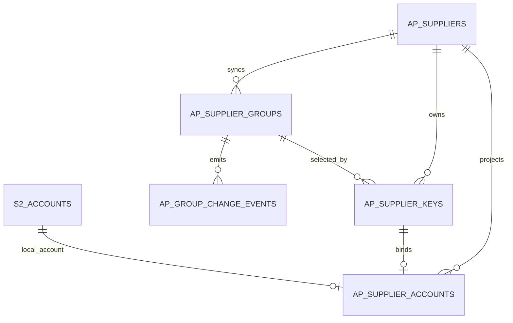

图中 `AP_*` 是 Admin Plus 表缩写，`S2_*` 是本地 Sub2API 表缩写；真实表名见下方字段表。

核心字段：

| 表 | 关键字段 | 说明 |
|----|----------|------|
| `admin_plus_suppliers` | `id/name/kind/type/runtime_status/health_status/dashboard_url/api_base_url/balance_cents/recharge_multiplier/key_limit_policy/key_limit_value` | 供应商父级、运营状态、充值倍率和 Key 配额策略 |
| `admin_plus_supplier_groups` | `supplier_id/external_group_id/name/provider_family/model_family/model_spec/effective_rate_multiplier/key_limit_policy/key_limit_value/status/raw_payload/last_seen_at` | 第三方分组投影、模型范围、倍率和分组级 Key 配额策略 |
| `admin_plus_supplier_keys` | `supplier_id/supplier_group_id/external_key_id/key_fingerprint/key_last4/status/local_sub2api_account_id` | 第三方 Key 脱敏投影 |
| `admin_plus_supplier_accounts` | `supplier_id/supplier_key_id/local_sub2api_account_id/local_account_name/supplier_group_name/supplier_group_rate/runtime_status/health_status` | 供应商到本地账号绑定投影 |

### 4.1 本地 Sub2API 调度 ER 图

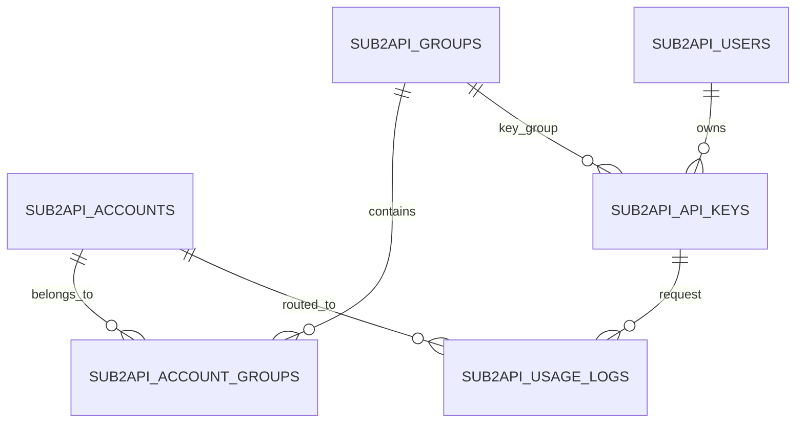

本地核心字段：

| 表 | 关键字段 | 说明 |
|----|----------|------|
| `accounts` | `id/name/platform/type/status/schedulable/rate_multiplier` | 本地上游账号，网关真实调度对象 |
| `groups` | `id/name/platform` | 本地调度分组，用户 Key 绑定它 |
| `account_groups` | `account_id/group_id` | 本地账号加入本地分组 |
| `api_keys` | `id/user_id/group_id/status/quota` | 用户 API Key |
| `usage_logs` | `api_key_id/account_id/group_id/model/actual_cost` | 用户请求最终调度和成本事实 |

说明：

- `admin_plus_supplier_accounts.local_sub2api_account_id` 现在已经取消数据库外键，原因是 Admin Plus 可能管理远程 Sub2API 或跨实例账号。
- `admin_plus_supplier_keys` 只保存脱敏 Key 元数据，不能保存第三方 Key 明文。
- `admin_plus_supplier_accounts` 是绑定投影，不是本地账号事实源；调度状态以 Sub2API `accounts` 为准。

### 4.2 本地状态基线 ER 图

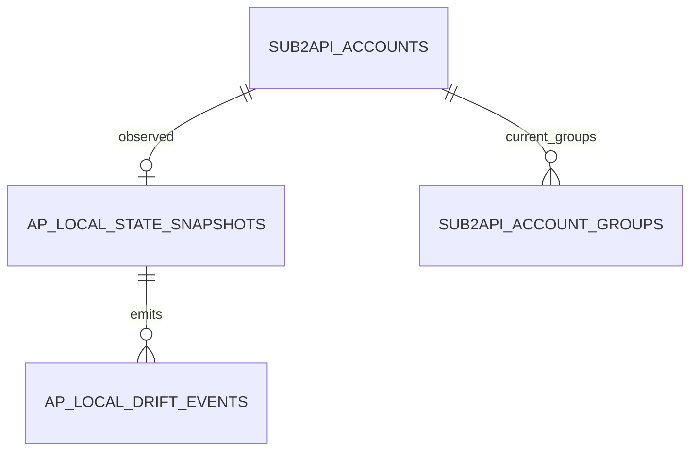

本地状态同步字段：

| 表 | 关键字段 | 说明 |
|----|----------|------|
| `admin_plus_local_account_state_snapshots` | `local_sub2api_account_id/accepted_* / observed_* / drift_status/first_drift_detected_at/last_checked_at/accepted_at` | Admin Plus 已采纳基线和最近一次从 Sub2API 观测到的本地账号状态 |
| `admin_plus_local_account_drift_events` | `local_sub2api_account_id/drift_type/old_snapshot/new_snapshot/status/detected_at/resolved_at` | 原后台手工变更等 drift 历史事件，默认不导出 |

边界：

- `accepted_*` 是 Admin Plus 认为可以安全写回的本地状态基线。
- `observed_*` 是最近一次从 Sub2API `accounts/account_groups` 读取到的状态。
- `drift_status=pending` 时，本地账号运营写回必须先停止，避免覆盖原后台应急操作。

## 5. 自动化与运行 ER 图

### 5.1 开通任务 ER

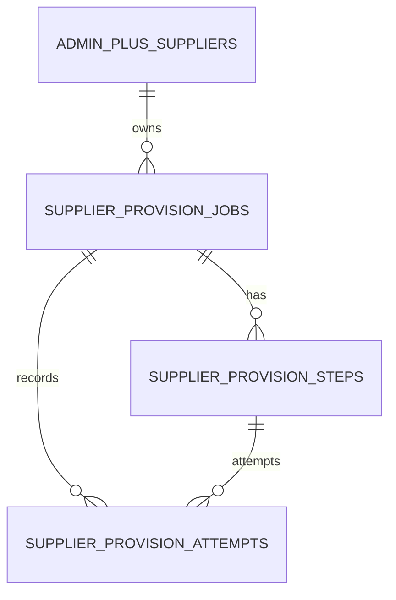

### 5.2 调度中心 ER

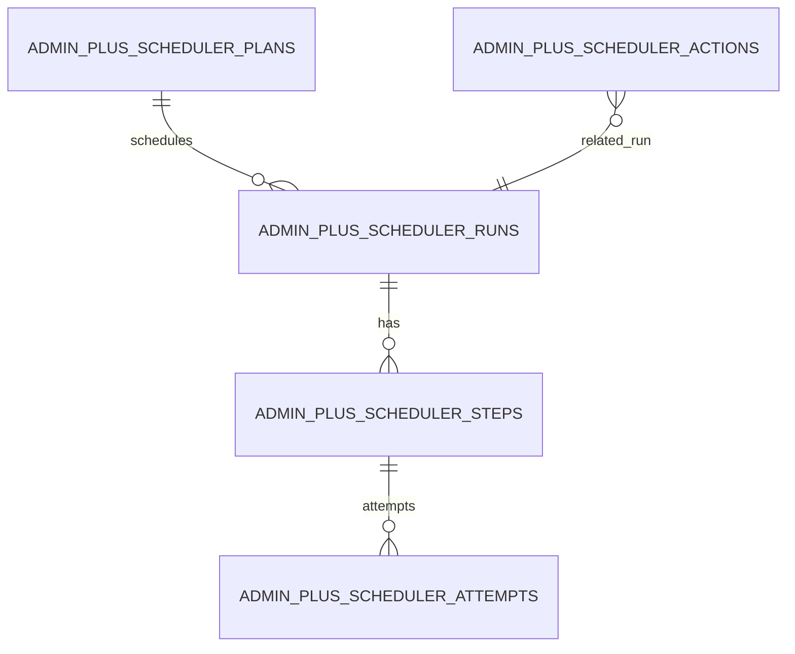

### 5.3 Outbox 幂等 ER

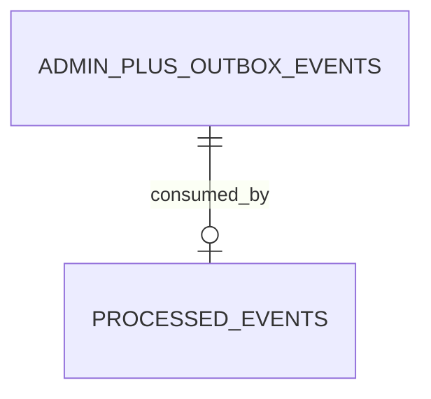

自动化核心字段：

| 表 | 关键字段 | 说明 |
|----|----------|------|
| `supplier_provision_jobs` | `job_type/supplier_id/status/idempotency_key_hash/request_snapshot/result_snapshot` | 分组同步、Key 开通、绑定修复等异步 job |
| `supplier_provision_steps` | `job_id/supplier_id/supplier_group_id/step_type/status/request_snapshot/result_snapshot` | job 下可重试步骤 |
| `supplier_provision_attempts` | `job_id/step_id/status/request_snapshot/response_snapshot` | 每次外部调用或本地落地尝试 |
| `admin_plus_scheduler_plans` | `id/name/task_type/status/interval_seconds/next_run_at` | 调度计划配置，属于核心可导配置 |
| `admin_plus_scheduler_runs` | `id/trigger_type/task_type/status/request_snapshot/result_snapshot` | 调度运行历史，默认不导出 |
| `admin_plus_scheduler_steps` | `run_id/supplier_id/task_type/status/extension_task_id/request_snapshot/result_snapshot` | 单次运行下的步骤 |
| `admin_plus_scheduler_attempts` | `step_id/run_id/status/worker_id/request_snapshot/response_snapshot` | 步骤重试历史 |

## 6. 质量、余额、成本 ER 图

### 6.1 费率、余额、健康 ER

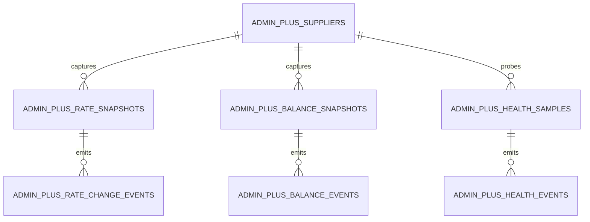

### 6.2 通道检测 ER

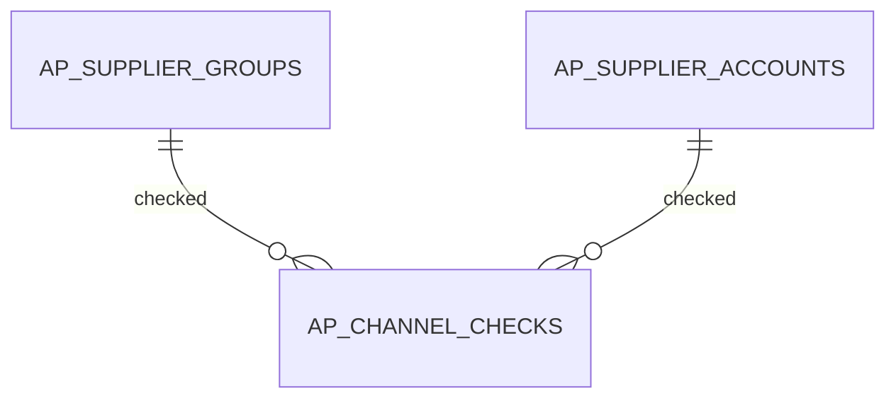

### 6.3 成本 ER

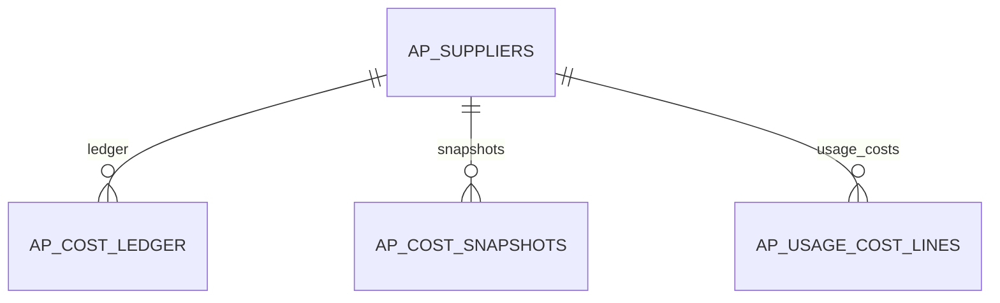

质量与成本核心字段：

| 表 | 关键字段 | 说明 |
|----|----------|------|
| `admin_plus_supplier_channel_check_snapshots` | `supplier_id/supplier_group_id/supplier_key_id/supplier_account_id/local_sub2api_account_id/remote_status/probe_status/recommended/effective_rate_multiplier/error_class/captured_at` | 候选可用性、推荐状态和排除原因 |
| `admin_plus_balance_snapshots` | `supplier_id/balance_cents/currency/captured_at` | 余额门禁事实，余额不足不等于渠道不可用 |
| `admin_plus_health_samples` | `supplier_id/model/status/first_token_ms/captured_at` | 消耗 token 的主动探测结果，优先级最低 |

质量判断必须遵循：

```text
通道监控 -> 余额门禁 -> Key 配额 -> 本地调度状态 -> 必要时最小 token 实测
```

当前 Key 配额事实先落在 `admin_plus_suppliers.key_limit_policy/key_limit_value` 和 `admin_plus_supplier_groups.key_limit_policy/key_limit_value`；`active_key_count` 从 `admin_plus_supplier_keys` 中 `provisioning/bound/manual_secret_required` 状态派生，`key_capacity_status` 在读模型层计算，避免保存重复计数。

## 7. 插件、站点、代理和辅助表

### 7.1 插件与会话 ER

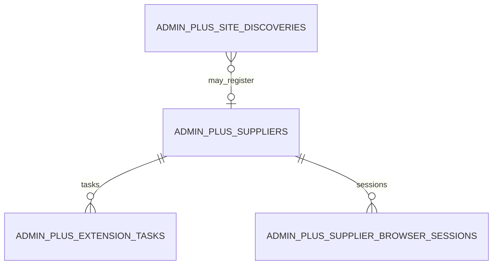

### 7.2 站点目录 ER

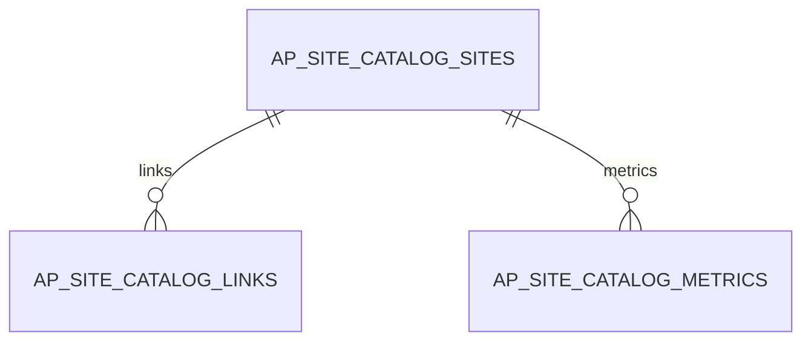

### 7.3 代理 ER

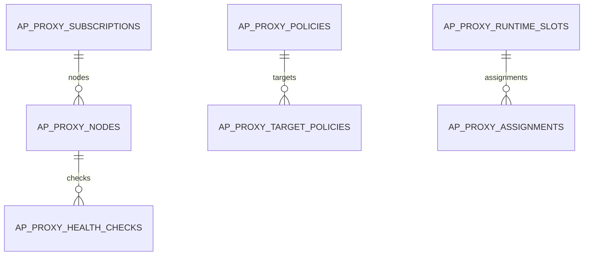

插件与会话核心字段：

| 表 | 关键字段 | 说明 |
|----|----------|------|
| `admin_plus_extension_tasks` | `supplier_id/task_type/status/schedule_key/input/result` | Chrome 插件任务和浏览器侧错误回传 |
| `admin_plus_supplier_browser_sessions` | `supplier_id/source/encrypted_payload/captured_at/expires_at` | 插件上报的会话包，默认不进入普通导出 |

## 8. 当前表清单

### 8.1 核心必须理解的表

| 表 | 当前状态 | 作用 | 主要写入方 |
|----|----------|------|------------|
| `admin_plus_suppliers` | 已存在 | 供应商父级台账、状态、余额、后台/API 地址 | `app/suppliers`、同步任务 |
| `admin_plus_supplier_groups` | 已存在 | 第三方分组投影、倍率、状态、raw payload | `app/suppliergroups` |
| `admin_plus_supplier_keys` | 已存在 | 第三方 Key 脱敏投影、本地账号落地状态 | `app/supplierkeys` |
| `admin_plus_supplier_accounts` | 已存在 | 供应商 Key/本地账号绑定投影 | `app/suppliers`、`app/supplierkeys` |
| `admin_plus_supplier_group_change_events` | 已存在 | 分组新增、倍率变化、低倍率事件 | `app/suppliergroups` |
| `admin_plus_supplier_channel_check_snapshots` | 已存在 | 通道监控、实测、本地可调度快照 | `app/channelchecks` |
| `admin_plus_account_rate_sync_history` | 已存在 | 本地账号和供应商倍率匹配/重命名历史 | `app/accountratesync` |
| `admin_plus_local_account_state_snapshots` | 已存在 | 本地账号 accepted/observed 状态基线和 pending drift | `app/sub2api` |
| `admin_plus_local_account_drift_events` | 已存在 | 本地账号原后台变更等 drift 事件历史 | `app/sub2api` |

### 8.2 运行和任务表

| 表 | 当前状态 | 作用 |
|----|----------|------|
| `supplier_provision_jobs` | 已存在 | 供应商分组同步、开通 Key、修复绑定等异步 job |
| `supplier_provision_steps` | 已存在 | job 下每个可重试步骤 |
| `supplier_provision_attempts` | 已存在 | 每次尝试记录 |
| `admin_plus_outbox_events` | 已存在 | Admin Plus 事件投递 outbox |
| `processed_events` | 已存在 | 消费幂等记录 |
| `admin_plus_scheduler_runs` | 已存在 | 调度中心 run |
| `admin_plus_scheduler_steps` | 已存在 | 调度中心 step |
| `admin_plus_scheduler_attempts` | 已存在 | 调度中心 attempt |
| `admin_plus_scheduler_plans` | 已存在 | 调度计划配置 |
| `admin_plus_scheduler_settings` | 已存在 | 调度设置 |
| `admin_plus_scheduler_actions` | 已存在 | 调度中心 compat 工作台动作快照，可由运行信号重建 |
| `admin_plus_action_recommendations` | 已存在 | current 动作建议队列，承载审批、执行入口和跨模块待办 |
| `admin_plus_action_executions` | 已存在 | 动作执行历史 |
| `ops_system_logs` | 已存在 | P0 操作审计页当前复用的 Admin Plus 业务日志时间线，来源为 `app/bizlogs` |

### 8.3 监控、成本和辅助表

| 表 | 当前状态 | 作用 |
|----|----------|------|
| `admin_plus_rate_snapshots` / `admin_plus_rate_change_events` | 已存在 | 费率快照与变化事件 |
| `admin_plus_balance_snapshots` / `admin_plus_balance_events` | 已存在 | 余额快照与余额事件 |
| `admin_plus_health_samples` / `admin_plus_health_events` | 已存在 | 主动健康检测样本和事件 |
| `admin_plus_supplier_funding_transactions` | 已存在 | 供应商充值流水 |
| `admin_plus_supplier_entitlement_transactions` | 已存在 | 兑换/权益流水 |
| `admin_plus_supplier_cost_ledger_entries` | 已存在 | 成本账本 |
| `admin_plus_supplier_cost_snapshots` | 已存在 | 成本快照 |
| `admin_plus_supplier_usage_cost_lines` | 已存在 | 供应商 usage 成本明细 |
| `admin_plus_notification_deliveries` / `admin_plus_notification_settings` | 已存在 | 通知投递和设置 |
| `admin_plus_extension_tasks` / `admin_plus_supplier_browser_sessions` | 已存在 | 插件任务和浏览器会话 |
| `admin_plus_site_discoveries` / `admin_plus_site_catalog_*` | 已存在 | 站点发现和目录 |
| `admin_plus_mail_credentials` | 已存在 | 邮箱验证码凭据 |
| `admin_plus_proxy_*` | 已存在 | 代理订阅、节点、策略、运行槽、健康检查 |
| `admin_plus_purity_public_reports` | 已存在 | 纯度公开报告 |
| `admin_plus_market_price_snapshots`、`admin_plus_cache_efficiency_snapshots`、`admin_plus_supply_quality_snapshots`、`admin_plus_acceptance_reports`、`admin_plus_kanban_events` | 已存在 | 看板和验收证据 |

## 9. 建议新增/调整的数据结构

这些是下一阶段为运营闭环必须补齐的数据库设计，不代表当前 migration 已经存在。

### 9.1 供应商 Key 配额

当前供应商级 Key 配额事实已经落在 `admin_plus_suppliers`：

| 字段 | 类型 | 说明 |
|------|------|------|
| `key_limit_policy` | text | `unknown/unlimited/limited/unsupported` |
| `key_limit_value` | int | 当前探测到或人工录入的上限 |
| `active_key_count` | 派生字段 | 从 `admin_plus_supplier_keys` 中 `provisioning/bound/manual_secret_required` 状态派生，不落库 |
| `key_capacity_status` | 派生字段 | `unknown/available/limited/exhausted/unsupported`，在读模型层计算 |

供应商级 Key 配额动作建议不新增专表，复用现有动作建议模型：

| 动作事实 | 表/字段 | 说明 |
|----------|---------|------|
| 配额耗尽建议 | `admin_plus_action_recommendations.reason_code=supplier_key_capacity_exhausted` | warning，提示本地释放配额投影、第三方停用/删除 Key、提高上限或显式执行部分开通计划 |
| 配额未知建议 | `admin_plus_action_recommendations.reason_code=supplier_key_capacity_unknown` | info，提示配置或刷新 Key 配额策略，避免盲目批量开通 |
| 不支持自动开通建议 | `admin_plus_action_recommendations.reason_code=supplier_key_provisioning_unsupported` | info，提示转人工 Key 流程 |
| 配额信号 | `admin_plus_action_recommendations.signals` | 保存 `key_limit_policy/key_limit_value/active_key_count/key_capacity_status` 等解释字段 |

Key 释放动作不新增表，统一复用 `admin_plus_supplier_keys.status=disabled` 和 `error_code` 区分来源。`active_key_count` 只统计 `provisioning/bound/manual_secret_required`，因此被停用的投影不再占用 Admin Plus 的本地配额计算。

| 动作 | 接口 | 写回 | 第三方影响 | 本地 Sub2API 调度 |
|------|------|------|------------|-------------------|
| 本地释放配额投影 | `POST /admin-plus/suppliers/:id/keys/:keyID/disable-local-projection` | `error_code=LOCAL_PROJECTION_RELEASED` | 不调用第三方；真实上限可能仍被占用 | 不写 `accounts/account_groups` |
| 第三方停用 Key | `POST /admin-plus/suppliers/:id/keys/:keyID/disable-provider` | `error_code=PROVIDER_KEY_DISABLED` | 使用注册用户会话停用外部 Key，成功后才写本地投影 | 接口本身不写；UI 可在 preview 后另调本地账号运营 apply |
| 第三方删除 Key | `POST /admin-plus/suppliers/:id/keys/:keyID/delete-provider` | `error_code=PROVIDER_KEY_DELETED` | 使用注册用户会话删除外部 Key，成功后才写本地投影 | 接口本身不写；UI 可在 preview 后另调本地账号运营 apply |

分组级 Key 配额不新增平级表，直接落在 `admin_plus_supplier_groups`，这样第三方分组投影、倍率和运营录入的分组容量策略在导入导出时保持同一行：

| 字段 | 类型 | 说明 |
|------|------|------|
| `key_limit_policy` | text | `inherit/unknown/unlimited/limited/unsupported`，默认 `inherit` |
| `key_limit_value` | int | 分组独立上限，非 `limited` 时为 0 |
| `active_key_count` | 派生字段 | 从该分组 `admin_plus_supplier_keys` 活跃状态派生，不落库 |
| `key_capacity_status` | 派生字段 | `inherit/unknown/available/limited/exhausted/unsupported` |

分组同步只更新第三方事实字段，不覆盖运营手工配置的 `key_limit_policy/key_limit_value`。开通计划和单分组创建都会先校验分组级策略，再校验供应商级策略。

### 9.2 本地账号运营镜像与 drift

当前实现采用“查询模型 + 状态快照表”：

- 本地账号运营镜像仍由 `app/sub2api.SQLRepository.ListLocalAccountOps` 查询生成，不单独建物理 view。
- 候选状态由 `app/candidateeval` 在服务层根据本地账号运营镜像事实投影生成，不新增候选状态表；当前随读 API 返回 `candidate_status`、`blocked_reason`、`check_source`、`key_capacity_status`。
- 本地状态基线由 `admin_plus_local_account_state_snapshots` 保存。
- drift 历史由 `admin_plus_local_account_drift_events` 保存，默认不导出。
- 读 API：`GET /api/v1/admin-plus/sub2api/local-account-ops`
- 同步 API：`POST /api/v1/admin-plus/sub2api/local-account-ops/sync-local-state`
- 采纳 API：`POST /api/v1/admin-plus/sub2api/local-account-ops/accept-local-state`
- 恢复 API：`POST /api/v1/admin-plus/sub2api/local-account-ops/restore-local-state`
- 预览 API：`POST /api/v1/admin-plus/sub2api/local-account-ops/preview`
- 执行 API：`POST /api/v1/admin-plus/sub2api/local-account-ops/apply`
- 主表：Sub2API `accounts`
- 本地分组：`account_groups`、`groups`
- 供应商投影：`admin_plus_supplier_accounts`、`admin_plus_suppliers`
- 第三方分组和 Key：`admin_plus_supplier_groups`、`admin_plus_supplier_keys`
- 通道检测：最近一条 `admin_plus_supplier_channel_check_snapshots`
- 该模型要求 Admin Plus 与 Sub2API 当前部署共用数据库或可读同一组表；如果后续 `SUB2API_READONLY_DATABASE_URL` 指向只含 Sub2API 表的只读库，需要把 Admin Plus 表读取拆回默认库并在应用层合并。

逻辑字段：

```text
local_account_ops_view
  local_sub2api_account_id
  local_account_name
  local_account_platform
  local_account_type
  local_account_status
  local_account_error_message
  local_account_schedulable
  local_account_group_ids
  local_account_group_names
  supplier_account_id
  supplier_id
  supplier_name
  supplier_type
  supplier_runtime_status
  supplier_health_status
  supplier_account_runtime_status
  supplier_account_health_status
  supplier_group_id
  supplier_external_group_id
  supplier_group_name
  supplier_group_status
  supplier_key_id
  supplier_key_last4
  supplier_key_status
  effective_rate_multiplier
  balance_cents
  balance_currency
  balance_status
  channel_check_status
  channel_remote_status
  last_channel_check_at
  drift_status
  last_local_sync_at
```

已新增状态快照表：

```text
admin_plus_local_account_state_snapshots
  local_sub2api_account_id
  accepted_account_name
  accepted_account_platform
  accepted_account_type
  accepted_schedulable
  accepted_group_ids
  observed_account_name
  observed_account_platform
  observed_account_type
  observed_schedulable
  observed_group_ids
  drift_status
  first_drift_detected_at
  last_checked_at
  accepted_at
  updated_at
```

已新增 drift 事件表：

```text
admin_plus_local_account_drift_events
  id
  local_sub2api_account_id
  drift_type
  old_snapshot
  new_snapshot
  status
  detected_at
  resolved_at
```

当前动作层写表边界：

| 动作 | 写表 | 刷新事件 |
|------|------|----------|
| 开启/关闭调度 | `accounts.schedulable`、`accounts.updated_at` | `scheduler_outbox.account_bulk_changed`；关闭调度时额外对账号所在本地分组写 `group_changed` |
| 加入本地分组 | `account_groups(account_id, group_id, priority, created_at)` | `scheduler_outbox.account_bulk_changed` 和目标分组 `group_changed` |
| 移出本地分组 | `account_groups` 删除目标绑定 | `scheduler_outbox.account_bulk_changed` 和目标分组 `group_changed` |
| 同步本地状态 | `admin_plus_local_account_state_snapshots`、`admin_plus_supplier_accounts`、必要时 `admin_plus_local_account_drift_events` | 无 |
| Admin Plus 写回后采纳 | `admin_plus_local_account_state_snapshots` | 无 |
| 采纳原后台变更 | `admin_plus_local_account_state_snapshots`、`admin_plus_local_account_drift_events` | 无 |
| 恢复 Admin Plus 基线 | `accounts`、`account_groups`、`admin_plus_local_account_state_snapshots`、`admin_plus_local_account_drift_events` | `scheduler_outbox.account_bulk_changed` 和受影响本地分组 `group_changed` |

本地账号运营动作执行还会写 `app/bizlogs` 系统业务日志：

| 结果 | 组件 | 记录内容 |
|------|------|----------|
| 成功 | `admin_plus.sub2api` | action、account_ids、group_ids、requested_by、updated_accounts/added_bindings/removed_bindings |
| 空池阻断 | `admin_plus.sub2api` | blocked_reason、group_impacts、active_api_key_count、before/after schedulable |
| 失败 | `admin_plus.sub2api` | action、account_ids、group_ids、错误 reason/status/message |

动作建议执行会写 `admin_plus_action_executions`：

| 字段 | 说明 |
|------|------|
| `recommendation_id/action_type/supplier_id/target_supplier_id` | 关联动作建议和供应商对象 |
| `status/error_message` | 执行状态、失败原因或不支持自动执行的原因 |
| `request_payload/response_payload` | 执行请求和回执摘要；前端展示时会隐藏 key/token/secret/password/cookie/authorization 等敏感字段 |
| `scheduler_run_id/scheduler_step_id` | 可选调度来源；从调度 run/step 详情深链进入动作建议并执行时写入，用于执行历史反跳调度运行详情 |
| `idempotency_key_hash/idempotency_replayed` | 幂等 key 指纹和 replay 标记；不保存原始 `Idempotency-Key` |
| `before_snapshot/after_snapshot` | 执行前后对象摘要；本地账号手工写和坏账号关调度保存本地分组影响，补池保存本地分组容量，不保存请求体、headers 或完整用户 Key |
| `operator_user_id/created_at/updated_at` | 操作者和时间线 |

当前 `action_type` 已包含 `routing_refill`、`local_account_schedule_disable`、`local_account_manual_ops` 和 `supplier_cost_reconcile_adjustment`。无 `action_id` 的本地账号运营手工写动作会创建 `status=executed/requires_approval=false` 的 `local_account_manual_ops` recommendation，并立刻写入 execution；它不是待审批队列，只用于让普通手工开关调度、加入本地分组和移出本地分组进入同一执行事实源：

- `request_payload.mode=local_account_manual_ops_apply`、本地账号、目标分组、调度开关、空池保护开关和 reason。
- `signals` 保存 `action/manual/local_sub2api_account_id(s)/local_group_id(s)/schedulable/reason`，便于从动作页按账号或分组过滤。
- `idempotency_key_hash` 保存请求幂等 key 指纹；同 key replay 不新增 recommendation/execution，只把同一 action type 和幂等指纹的最新 execution 标记为 `idempotency_replayed=true`。
- `before_snapshot/after_snapshot` 保存受影响本地分组的前后可调度账号、启用用户 Key 数、空池风险和写入计数。
- 成功写 `succeeded`，空池保护阻断或失败写 `failed`；业务日志仍写 `app/bizlogs`，但 current 执行事实源为 `admin_plus_action_executions`。
- apply 响应会返回 `action_recommendation_id/action_execution_id`，前端用这两个 ID 深链到动作建议页；动作建议列表支持 `recommendation_id` 过滤，执行历史支持在前端按 `execution_id` 高亮，不新增索引表或审计历史表。

成本对账异常建议使用 `supplier_cost_reconcile_adjustment`。成本账本业务事实源仍是 `admin_plus_supplier_cost_ledger_entries`，执行事实源仍是 `admin_plus_action_executions`，不新增平级修复历史表：

- `signals` 保存 `cost_snapshot_id/currency/expected_balance_cents/actual_balance_cents/balance_delta_cents`。
- 审批后执行会校验建议状态、供应商、`cost_snapshot_id` 和 `balance_delta_cents`，只允许用等于差额的金额写入 `entry_type=manual_adjustment/source_type=action_recommendation/source_id=<recommendation_id>`。
- 写入账本后刷新 `admin_plus_supplier_cost_snapshots`，并把 `request_payload.mode=supplier_cost_reconcile_adjustment`、`ledger_entry_id`、调整金额、前后成本快照和幂等指纹写入 `admin_plus_action_executions`。
- 缺失明细修复同样挂在该动作建议下，不新增平级修复历史表。`request_payload.mode=supplier_cost_reconcile_detail_repair` 会记录 `detail_type`、金额、快照 ID 和来源；`funding_credit/refund_debit` 写回 `admin_plus_supplier_funding_transactions` 并派生 `funding_credit/refund_debit` ledger，`entitlement_credit` 写回 `admin_plus_supplier_entitlement_transactions` 并派生 `entitlement_credit` ledger，`usage_cost` 写回 `admin_plus_supplier_usage_cost_lines` 后刷新快照。
- `manual_adjustment` 仅用于已人工复核后的差额闭合；能定位为缺失充值、兑换、退款或 usage 时，应优先写回原始业务表，再刷新快照。

动作建议页从 `local_group_capacity` 信号生成空池/低容量补池建议，`signals` 保存 `local_group_id/local_group_name/platform/schedulable_accounts/active_api_key_count/low_capacity_threshold/candidate_*` 等解释字段。真实补池 apply 携带 `action_id` 时会写：

- `request_payload.mode=routing_refill_apply`、目标本地分组、平台、最高倍率、冷却和确认窗口。
- 从调度 run/step 深链触发时，结构化列 `scheduler_run_id/scheduler_step_id` 和 `request_payload.scheduler_*` 同步保存来源。
- `idempotency_key_hash` 保存请求幂等 key 指纹；`before_snapshot/after_snapshot` 保存补池前后本地分组总账号、可调度账号、用户 Key、近 24 小时请求摘要和候选账号摘要。
- `response_payload.mode=routing_refill_apply`、补池前后容量、候选账号/供应商/第三方分组、跳过原因或写回账号摘要。
- `status=succeeded` 时把建议更新为 `executed`；跳过或失败写 `failed`，建议保留为可复查/可重试状态。
- dry-run 不写 `admin_plus_action_executions`，只写 `admin_plus_routing_refill_runs previewed`，避免把预览误判为执行完成。
- failed 执行重试会新增一条 execution，不修改旧记录；新记录的 `request_payload.retry_source_execution_id/response_payload.retry_source_execution_id` 指向旧执行。
- succeeded 执行回滚会新增一条 execution，不修改旧记录；回滚通过本地账号运营 `remove_from_groups` 移出本次补入账号，新记录的 `request_payload.rollback_source_execution_id/response_payload.rollback_source_execution_id` 指向旧执行。

动作建议页还会从 `local_account_schedule` 信号生成坏账号关调度建议，`signals` 保存 `local_sub2api_account_id/local_account_name/local_group_ids/local_group_names/supplier_group_id/blocked_reason/check_source/channel_check_status/effective_rate_multiplier` 等解释字段。真实关闭调度 apply 携带 `action_id` 时会写：

- `request_payload.mode=local_account_ops_apply`、`action=set_schedulable`、目标本地账号、`schedulable=false`、`action_id` 和 reason。
- 从调度 run/step 深链触发时，结构化列 `scheduler_run_id/scheduler_step_id` 和 `request_payload.scheduler_*` 同步保存来源。
- `idempotency_key_hash` 保存请求幂等 key 指纹；`before_snapshot/after_snapshot` 保存受影响本地分组的前后可调度账号、启用用户 Key 数和空池风险。
- `response_payload.mode=local_account_ops_apply`、更新账号数、group impacts、空池保护阻断原因或 warning。
- `status=succeeded` 时把建议更新为 `executed`；空池保护阻断或失败写 `failed`，建议保留为可复查/可重试状态。
- preview 不写 `admin_plus_action_executions`，只返回本地账号运营 preview 结果，避免把预览误判为执行完成。
- failed 执行重试会新增一条 execution，不修改旧记录；新记录的 `request_payload.retry_source_execution_id/response_payload.retry_source_execution_id` 指向旧执行。
- succeeded 执行回滚会新增一条 execution，不修改旧记录；回滚通过本地账号运营 `set_schedulable=true` 恢复调度，新记录的 `request_payload.rollback_source_execution_id/response_payload.rollback_source_execution_id` 指向旧执行。

执行前 preview 会读取目标账号和分组，并计算每个本地分组：

- 启用用户 API Key 数：`api_keys.status='active'`。
- 操作前可调度账号数。
- 操作后可调度账号数。
- 是否触发 `LOCAL_GROUP_SCHEDULABLE_POOL_WOULD_BE_EMPTY`。

当某个本地分组仍有启用用户 API Key，且操作后可调度账号数为 0 时，apply 默认返回 blocked，不写业务表。前端当前不暴露 `allow_empty_pool` 高级强制执行。

当 `admin_plus_local_account_state_snapshots.drift_status='pending'` 时，apply 默认返回 `LOCAL_ACCOUNT_STATE_DRIFT_PENDING`，不写 `accounts/account_groups/scheduler_outbox`。前端当前展示为“原后台变更”，并支持查看 accepted/observed 差异、采纳原后台当前状态或恢复 Admin Plus 基线。

### 9.2.1 供应商详情聚合视图

当前 P0 的供应商详情不新增物理表，也不新增后端聚合模型。原因：

- 详情页是只读运营视图，当前已有表已经能覆盖“供应商 -> 第三方分组 -> 第三方 Key -> 本地账号 -> 本地分组 -> 通道检测 -> drift”链路。
- 新增重复聚合表会引入同步时序和事实源分歧，暂时没有业务收益。
- 后续 P1 的 Key 配额和候选评估需要新增事实字段时，应优先扩展 `admin_plus_suppliers`、`admin_plus_supplier_groups`、`admin_plus_supplier_channel_check_snapshots`，而不是为详情页单独建表。

当前供应商详情的数据流：

| 详情区块 | 读取表/API | 说明 |
|----------|------------|------|
| 顶部总览 | `admin_plus_suppliers`、下方聚合结果 | 供应商状态、分组数、Key 数、调度和风险汇总 |
| 第三方分组覆盖 | `admin_plus_supplier_groups` | 分组名称、外部 ID、协议族、模型族/规格、倍率、状态 |
| Key 状态 | `admin_plus_supplier_keys` | external key id、last4、status、manual secret、失败原因 |
| 本地绑定 | `admin_plus_supplier_accounts` -> `accounts` | 绑定投影和本地账号真实调度状态 |
| 本地分组 | `account_groups`、`groups` | 本地账号加入哪些本地调度分组 |
| 余额 | `admin_plus_supplier_accounts.balance_*`、本地账号运营镜像 | P0 使用绑定投影余额，P1 统一为余额门禁状态 |
| 通道检测 | `admin_plus_supplier_channel_check_snapshots` | 最新检测状态、推荐状态、错误原因、调度快照 |
| drift | `admin_plus_local_account_state_snapshots` 经 local-account-ops 查询 | 原后台变更和 Admin Plus 基线是否一致 |

当前只读接口组合：

```text
GET /admin-plus/suppliers/:id/groups
GET /admin-plus/suppliers/:id/keys
GET /admin-plus/suppliers/:id/accounts
GET /admin-plus/sub2api/accounts
GET /admin-plus/sub2api/local-account-ops?supplier_id=:id
GET /admin-plus/suppliers/:id/channel-checks
```

写入边界：

- 供应商详情弹窗不写任何表，不触发 `scheduler_outbox`。
- 分组同步、Key 开通、修复绑定仍走原有 `supplier_provision_jobs/steps/attempts`。
- 调度开关和本地分组修改仍走本地账号运营镜像的 preview/apply。
- drift 采纳/恢复仍走 `admin_plus_local_account_state_snapshots` 和 `admin_plus_local_account_drift_events`。

待增强：

- 真实最大 Key 上限自动读取和 `key_capacity_checked_at`
- 候选评估已读取 `admin_plus_supplier_groups.model_family/model_spec` 并输出 `model_scope/model_match_status`；后续继续扩展模型级健康、模型级倍率和 `probe_cost_class`

### 9.3 路由补池运行

已新增轻量运行事实表，用于运营查询和审计补池结果：

```text
admin_plus_routing_refill_runs
  id
  run_id
  sub2api_instance_id
  local_group_id
  local_group_name
  platform
  model_scope
  trigger_type
  dry_run
  status
  reason
  skipped_reason
  before_total_accounts
  before_schedulable_accounts
  before_active_api_key_count
  after_total_accounts
  after_schedulable_accounts
  after_active_api_key_count
  selected_supplier_id
  selected_supplier_group_id
  selected_supplier_key_id
  selected_local_account_id
  selected_effective_rate_multiplier
  requested_by
  error_code
  error_message
  request_snapshot
  result_snapshot
  created_at
  updated_at
```

当前状态：

- `previewed`
- `succeeded`
- `skipped`
- `failed`

运行表默认不导出，只用于运营追踪和事故复盘。

补池策略保存在 `admin_plus_scheduler_settings.value` 的全局 JSON 中：

```text
routing_refill_auto_execute_enabled
routing_refill_low_capacity_threshold
routing_refill_cooldown_seconds
routing_refill_confirm_window_seconds
routing_refill_max_rate_multiplier
```

当前真实补池 apply 复用 `admin_plus_routing_refill_runs` 做冷却和确认判断：同一 `local_group_id` 最近 `succeeded` 记录仍在 `routing_refill_cooldown_seconds` 窗口内时，本次写入记录为 `skipped/refill_cooldown`；`routing_refill_confirm_window_seconds` 大于 0 时，apply 必须存在同分组最近 `previewed` 记录，否则记录为 `skipped/refill_confirmation_required`。dry-run 不参与冷却判断，避免影响运营预览候选。

`request_snapshot` 会保存 `local_group_id`、`platform`、`max_rate_multiplier`、`limit`、`dry_run`、`action_id`、`reason`、`trigger_type`、`cooldown_seconds`、`confirm_window_seconds` 和 `failed_candidate_cooldown_seconds`，用于回放运营策略和事故复盘。`action_id` 只用于关联动作建议路径，不改变运行表仍属于历史表、不进入核心导出的边界。

### 9.4 候选评估快照

可先从 `admin_plus_supplier_channel_check_snapshots` 扩字段：

| 字段 | 说明 |
|------|------|
| `check_source` | `channel_monitor/balance/local_state/active_probe` |
| `balance_status` | 余额门禁状态 |
| `key_capacity_status` | Key 配额状态 |
| `blocked_reason` | 候选排除原因 |
| `probe_cost_class` | 实测成本等级 |

当前实现中，`CandidateEvaluator` 在读模型层生成候选状态；调度面板的 `candidate_summary` 是按 `supplier_id` 聚合后的响应字段，不新增表。若后续性能不足，再把该聚合下沉为物化视图或缓存表。

## 10. 核心流程数据流转

### 10.1 供应商接入与会话

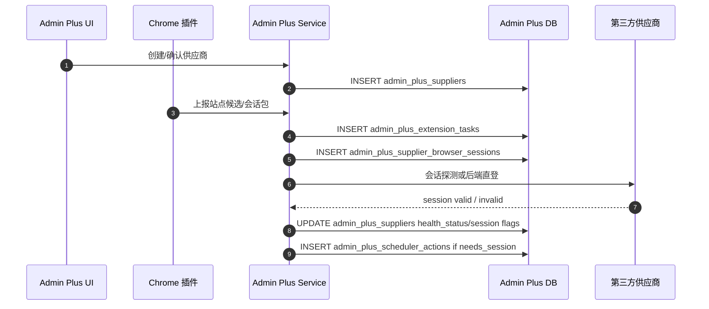

### 10.2 第三方分组同步

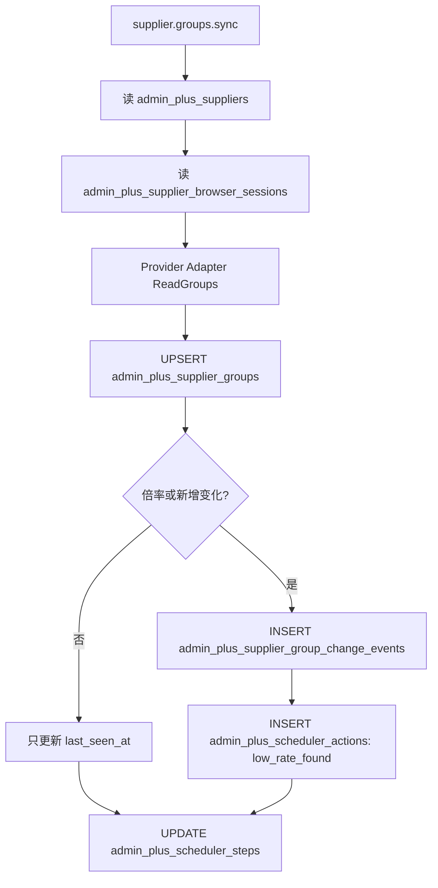

表级写入：

| 步骤 | 写表 | 说明 |
|------|------|------|
| 同步开始 | `admin_plus_scheduler_runs/steps` | 记录任务运行 |
| 分组 upsert | `admin_plus_supplier_groups` | 保存第三方分组投影 |
| 变化事件 | `admin_plus_supplier_group_change_events` | 新增、涨价、降价 |
| 调度中心提醒 | `admin_plus_scheduler_actions` | 低倍率提醒、会话失效提醒，属于 compat 工作台快照 |

### 10.3 Key 配额 dry-run 与开通

#### 10.3.1 配额 dry-run

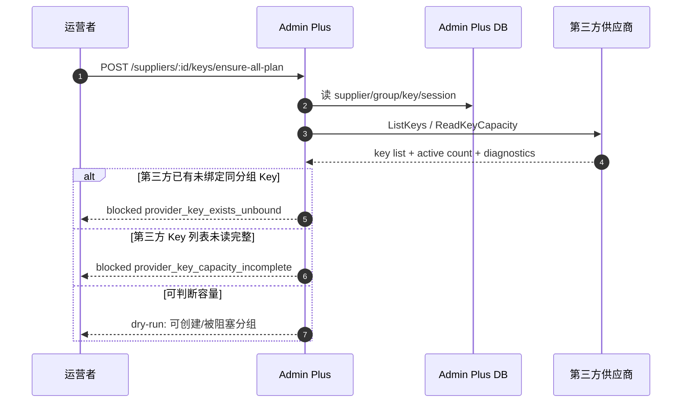

当前 dry-run 不新增表，不写运行历史；计划由 `admin_plus_suppliers.key_limit_policy/key_limit_value`、`admin_plus_supplier_groups.key_limit_policy/key_limit_value`、`admin_plus_supplier_keys`、`admin_plus_supplier_browser_sessions` 和第三方实时 Key 列表派生。有限配额默认优先创建有效倍率最低的未覆盖分组；运营通过 `supplier_group_priority_ids` 覆盖顺序后，会按该顺序选择可创建分组，未列入的分组继续按有效倍率排序。已有 Key 的分组不消耗供应商级剩余配额，但仍可进入执行步骤以检查/补齐本地账号绑定。Provider `ReadKeyCapacity` 当前用于实时读取 active Key 数、识别未绑定第三方 Key 和读取完整性风险；真实最大上限写回仍待具体供应商适配。

供应商分组弹窗的开通计划面板当前还展示阻塞分组修复区：读取同一份 dry-run 结果，不新增表；可打开供应商配额设置、配置单个第三方分组配额、定位具体第三方分组，调整 `supplier_group_priority_ids` 请求级优先级覆盖，或对占用配额的 Key 执行本地释放配额投影、第三方停用 Key、第三方删除 Key。`provider_key_exists_unbound` 可通过 `import-provider-projection` 单个导入，也可通过 `import-provider-projections` 批量导入第三方已有 Key 的本地投影；两者都会重新读取 Provider Key 列表确认 active Key 仍存在，写入 `admin_plus_supplier_keys.status=manual_secret_required`，`provision_response` 只保留二次过滤后的脱敏 payload。`manual_secret_required` 的手动补密钥修复绑定第一阶段不新增表：补录 secret 只用于创建/修复本地账号，落库只更新 `admin_plus_supplier_keys.key_fingerprint/key_last4/local_sub2api_account_id/status` 和 `admin_plus_supplier_accounts` 绑定投影。第三方停用/删除后的本地调度联动 preview 不新增表，复用本地账号运营 `preview/apply`；真实最大 Key 上限自动读取需要后续新增能力。

#### 10.3.2 创建 Key 与本地落地

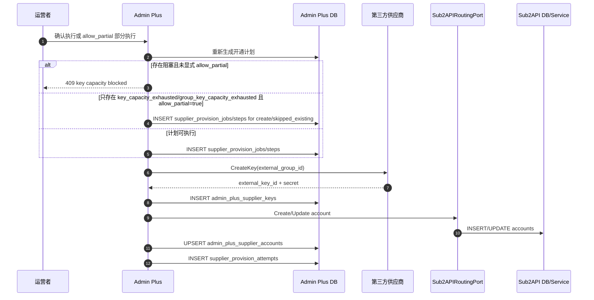

关键约束：

- secret 只经过短链路，不落普通明文表。
- 配额不足不把供应商置为 unavailable；供应商级风险复用 `admin_plus_action_recommendations` 写入 `supplier_key_capacity_exhausted/unknown/provisioning_unsupported`，不新增配额动作表。
- 第三方已有同分组 active Key 但 Admin Plus 无绑定投影时，返回 `SUPPLIER_PROVIDER_KEY_UNBOUND`，并可通过 `import-provider-projection` 或 `import-provider-projections` 导入脱敏投影后补密钥修复绑定；不再使用时可先在第三方停用/删除。
- 第三方 Key 列表分页读取不完整时，返回 `SUPPLIER_PROVIDER_KEY_CAPACITY_INCOMPLETE`，批量和单分组创建都不调用第三方 `CreateKey`。
- 部分开通必须显式携带 `allow_partial=true`，且只允许 `key_capacity_exhausted/group_key_capacity_exhausted` 阻塞；`key_capacity_unknown/group_key_capacity_unknown` 和 `key_provisioning_unsupported/group_key_provisioning_unsupported` 仍拒绝执行。
- 单分组创建 Key 也必须读取 `admin_plus_supplier_keys` 当前活跃数量并校验 `admin_plus_suppliers.key_limit_policy/key_limit_value` 和 `admin_plus_supplier_groups.key_limit_policy/key_limit_value`；供应商级有限配额已满时返回 `SUPPLIER_KEY_CAPACITY_EXHAUSTED`，分组级有限配额已满时返回 `SUPPLIER_GROUP_KEY_CAPACITY_EXHAUSTED`，不调用第三方 `CreateKey`。
- 当 `key_limit_policy=unsupported` 时返回 `SUPPLIER_KEY_PROVISIONING_UNSUPPORTED`，不调用第三方 `CreateKey`。
- 当分组 `key_limit_policy=unknown/unsupported` 时返回 `SUPPLIER_GROUP_KEY_CAPACITY_UNKNOWN/SUPPLIER_GROUP_KEY_PROVISIONING_UNSUPPORTED`，不调用第三方 `CreateKey`。
- 若第三方不返回 secret，`admin_plus_supplier_keys.status=manual_secret_required`；运营补录 secret 后同一修复绑定接口会更新 fingerprint/last4、创建或修复本地账号并把 Key 状态推进到 `bound`。

#### 10.3.3 Key 释放、第三方停用与删除

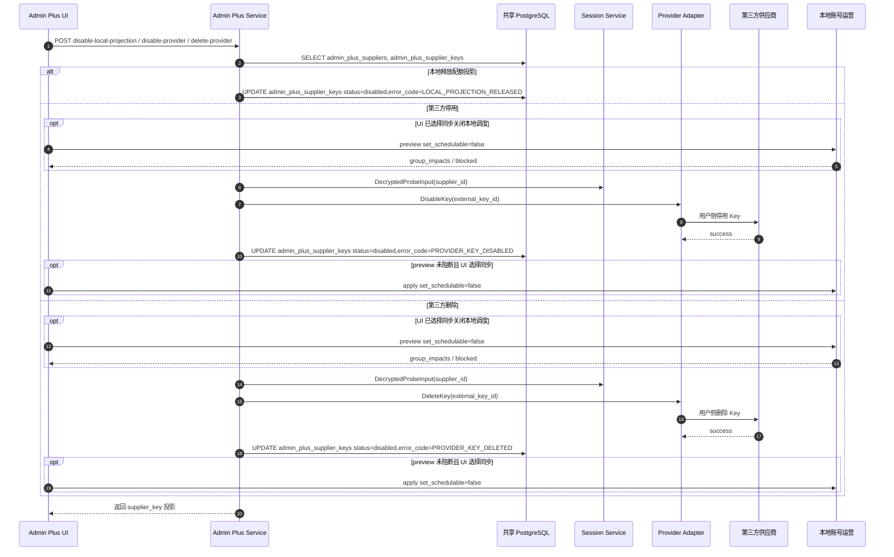

表级约束：

| 动作 | 读表 | 写表 | 不写表 |
|------|------|------|--------|
| 本地释放配额投影 | `admin_plus_supplier_keys` | `admin_plus_supplier_keys.status/error_code/error_message` | 第三方后台、`accounts`、`account_groups`、`scheduler_outbox` |
| 第三方停用/删除 | `admin_plus_suppliers`、`admin_plus_supplier_keys`、`admin_plus_supplier_browser_sessions`；可选读取本地账号运营 preview | 第三方后台；成功后写 `admin_plus_supplier_keys.status/error_code/error_message`；选择同步时另由本地账号运营写 `accounts/scheduler_outbox` | provider 接口本身不直接写 `accounts/account_groups/scheduler_outbox` |

如果运营需要同时关闭本地账号调度，必须复用本地账号运营镜像的 preview/apply 流程。前端修复区已把该流程串到第三方停用/删除动作里：先 preview，第三方成功后再 apply；第三方失败不会关闭本地账号调度。

### 10.4 本地账号运营镜像与 drift

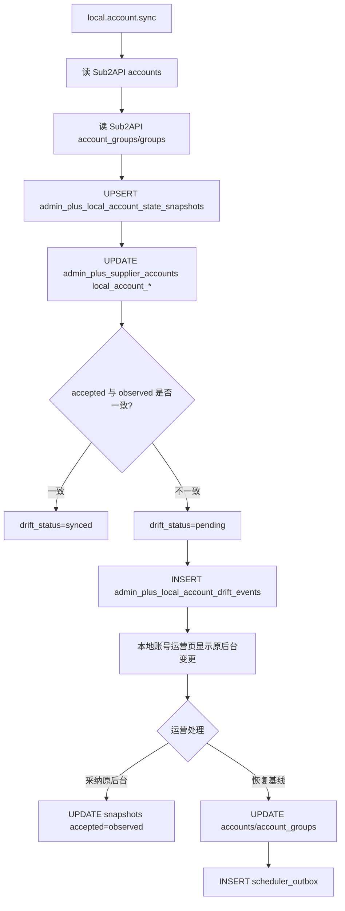

这里 `local_account_ops_view` 是后端查询模型，不建物理表；`admin_plus_local_account_state_snapshots` 是状态基线表。运营镜像必须把 Sub2API 本地账号和 Admin Plus 供应商来源拼起来，支撑运营按 `Lime + 供应商 + 倍率` 快速筛选。

### 10.4.1 本地账号动作 preview/apply

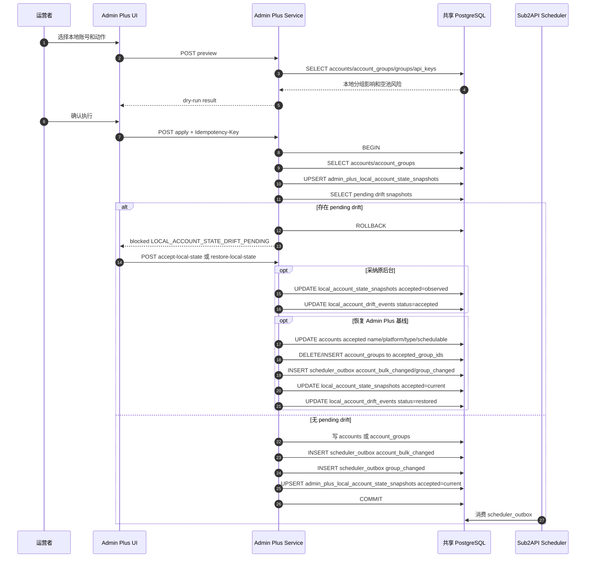

表级流转：

| 阶段 | 读表 | 写表 |
|------|------|------|
| preview | `accounts`、`account_groups`、`groups`、`api_keys` | 无 |
| apply 写前同步 | `accounts`、`account_groups`、`admin_plus_local_account_state_snapshots` | `admin_plus_local_account_state_snapshots`、`admin_plus_supplier_accounts` |
| apply drift 阻断 | `admin_plus_local_account_state_snapshots` | 无业务写入 |
| 采纳原后台变更 | `accounts`、`account_groups`、`admin_plus_local_account_state_snapshots` | `admin_plus_local_account_state_snapshots`、`admin_plus_local_account_drift_events` |
| 恢复 Admin Plus 基线 | `admin_plus_local_account_state_snapshots`、`groups` | `accounts`、`account_groups`、`scheduler_outbox`、`admin_plus_local_account_state_snapshots`、`admin_plus_local_account_drift_events` |
| apply 开关调度 | `accounts`、`account_groups`、`groups`、`api_keys` | `accounts`、`scheduler_outbox` |
| apply 加入/移出分组 | `accounts`、`groups`、`api_keys` | `account_groups`、`scheduler_outbox` |
| apply 成功后采纳 | `accounts`、`account_groups` | `admin_plus_local_account_state_snapshots` |
| 幂等 | idempotency 相关表 | idempotency 相关表 |

### 10.5 检测与候选池

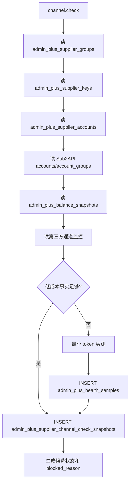

候选状态不建议长期单独建表，优先从最新 `admin_plus_supplier_channel_check_snapshots`、余额、Key 配额、本地账号状态组合生成。若性能不足，再引入 materialized view。

### 10.6 路由补池写回

```mermaid
sequenceDiagram
    autonumber
    participant UI as Admin Plus 本地账号运营页/调度中心
    participant Watch as capacity_watch
    participant API as Admin Plus API
    participant Eval as CandidateEvaluator
    participant DB as DB
    participant Port as Sub2APIRoutingPort

    Watch->>API: ListActions
    API->>DB: SELECT admin_plus_scheduler_settings
    API->>DB: SELECT groups + account_groups + accounts + api_keys
    API->>DB: SELECT local_account_ops projection
    API->>Eval: 生成空池/低容量补池动作
    API->>DB: UPSERT admin_plus_scheduler_actions
    API->>DB: SELECT equivalent open/acknowledged/approved admin_plus_action_recommendations
    API->>DB: INSERT admin_plus_action_recommendations routing_refill/local_account_schedule_disable if missing
    API->>DB: UPDATE admin_plus_scheduler_steps.result_snapshot.actions
    UI->>API: GET sub2api/groups
    API->>DB: SELECT groups + account_groups + accounts + api_keys
    API-->>UI: 本地分组容量投影
    UI->>API: dry-run/apply refill-local-group
    alt apply
        API->>DB: pg_try_advisory_lock(local_group_id)
        alt 锁未获取
            API->>DB: INSERT admin_plus_routing_refill_runs skipped/refill_locked
            API-->>UI: 返回 skipped
        else 锁已获取
            API->>DB: SELECT recent succeeded admin_plus_routing_refill_runs
            alt 仍在冷却窗口
                API->>DB: pg_advisory_unlock(local_group_id)
                API->>DB: INSERT admin_plus_routing_refill_runs skipped/refill_cooldown
                API-->>UI: 返回 skipped
            else 不在冷却窗口
                API->>DB: SELECT recent previewed admin_plus_routing_refill_runs
                alt 确认窗口要求但没有最近 preview
                    API->>DB: pg_advisory_unlock(local_group_id)
                    API->>DB: INSERT admin_plus_routing_refill_runs skipped/refill_confirmation_required
                    API-->>UI: 返回 skipped
                else 确认通过
                    API->>Port: GetGroupAvailability(local_group_id)
                    Port->>DB: SELECT groups/account_groups/accounts/api_keys
                    Port->>DB: SELECT api_keys active keys with masked key_preview LIMIT 21
                    API->>DB: SELECT local_account_ops projection
                    API->>Eval: 生成 candidate_status
                    API->>API: 选择最低 effective_rate_multiplier 的 available 候选
                    API->>Port: 二次 GetGroupAvailability(local_group_id)
                    API->>Port: EnsureAccountInGroup(account_id, local_group_id)
                    Port->>DB: INSERT account_groups + scheduler_outbox
                    API->>DB: pg_advisory_unlock(local_group_id)
                    API->>Port: GetGroupAvailability(local_group_id)
                    API->>DB: INSERT admin_plus_routing_refill_runs
                    API-->>UI: 返回补池结果
                end
            end
        end
    else dry-run
        API->>Port: GetGroupAvailability(local_group_id)
        Port->>DB: SELECT groups/account_groups/accounts/api_keys
        Port->>DB: SELECT api_keys active keys with masked key_preview LIMIT 21
        API->>DB: SELECT local_account_ops projection
        API->>Eval: 生成 candidate_status
        API->>API: 选择最低 effective_rate_multiplier 的 available 候选
        API->>DB: INSERT admin_plus_routing_refill_runs previewed
        API-->>UI: 返回候选和当前容量
    end
```

写回边界：

- Admin Plus 读 Sub2API 可走 service/Admin API/只读 DB。
- 当前手动本地账号运营动作已在同库部署中落地，并已从 service 层收口到 `Sub2APIRoutingPort`；同库实现仍事务写 `accounts/account_groups/scheduler_outbox`，语义化端口方法复用同一 apply 路径。配置 `ADMIN_PLUS_SUB2API_ADMIN_BASE_URL` 与 `ADMIN_PLUS_SUB2API_ADMIN_API_KEY` 后，远程写回由 `RemoteAdminAPIRoutingPort` 调用 Sub2API Admin API，不直接写远程数据库；远程 apply 仍先同步本地状态基线并检查 pending drift，写回成功后再同步并采纳新基线。
- 当前本地分组目标列表来自 `GET /api/v1/admin-plus/sub2api/groups`，只读 `groups/account_groups/accounts/api_keys` 并派生容量，不新增表。
- 当前补池 API 复用本地账号运营投影、`Sub2APIRoutingPort` 和现有 `scheduler_outbox`，并写入 `admin_plus_routing_refill_runs`。
- 当前动作建议页可为本地分组容量不足生成 `routing_refill` 持久建议；审批后真实补池 apply 会同时写 `admin_plus_routing_refill_runs` 和 `admin_plus_action_executions`。
- 当前真实补池写入在同库 SQLRepository 上使用 PostgreSQL advisory lock，对同一 `local_group_id` 做跨进程互斥；拿不到锁会记录 `refill_locked` 跳过。
- 当前补池策略保存在 `admin_plus_scheduler_settings`，调度中心设置页可配置低容量阈值、冷却秒数、确认窗口秒数、最高倍率和自动补池开关。
- 当前真实补池写入会读取同一 `local_group_id` 最近成功运行记录，在冷却窗口内记录 `refill_cooldown` 跳过；dry-run 不读取冷却窗口。
- 当前真实补池写入支持确认窗口，窗口大于 0 且缺少同分组最近 `previewed` 记录时记录 `refill_confirmation_required` 跳过。
- 当前分组可用性会返回最多 20 个受影响用户 API Key 的脱敏预览，并附带目标本地分组近 24 小时成功请求量、错误量、上游 429 和 token 概览；逐 Key 影响同样只返回脱敏 Key 和统计，不返回完整 `api_keys.key`。
- 当前分组可用性会读取 `ops_error_logs` 返回最多 5 条最近失败请求摘要，只包含状态码、上游状态码、脱敏 Key、账号、模型、错误类型和截断错误信息；请求体、headers 和完整 Key 不进入补池响应或运行记录核心导出。
- 当前补池影响详情通过 `routing/group-impact/api-keys` 和 `routing/group-impact/failures` 分页读取 `api_keys`、`usage_logs` 和 `ops_error_logs` 的近 24 小时摘要；分页接口仍只返回脱敏 Key、统计值、状态码、账号、模型和截断错误，不读取或输出请求体、headers、完整 Key。
- 当前失败请求受控明细通过 `routing/group-impact/failures/:failureID/sensitive-detail` 读取单条 `ops_error_logs`，用 `failureID + local_group_id` 校验归属；该接口必须携带查询原因，返回字段只来自 `ops_error_logs` 已记录的错误消息、错误体、上游错误、端点和模型映射字段，并在返回前再次脱敏/截断。`request_body/request_headers` 字段已被历史迁移删除，因此明细接口返回 `not_recorded`，不创建新的请求体留存表。
- 受控明细查询不写 `admin_plus_routing_refill_runs`，也不进入核心导出；查询原因、错误日志 ID、本地分组 ID、请求字段和字段可用性写入 `ops_system_logs` 的 `admin_plus.sub2api` 业务日志，日志不保存敏感明细值。
- 当前 `/admin/scheduler/routing-refill-history` 复用 `admin_plus_routing_refill_runs` 做跨补池运行的全局影响历史页；页面读取运行快照中的 `availability_before/after`、候选账号和容量变化，并继续通过 `group-impact` 分页接口查看脱敏 Key 与失败摘要，不新增平级历史表。
- 当前 `local.sub2api.routing.capacity_watch` 已接入 scheduler worker：自动补池开关关闭时只生成空池/低容量 compat 工作台动作并同步到 `admin_plus_action_recommendations`，开启后只对有启用用户 Key 且 `schedulable_accounts=0` 的空池分组调用补池端口；低容量分组仍只生成动作建议。
- 当前坏账号关调度在调度中心仍生成 `local_account.schedule.disable` compat 工作台动作，写入 `admin_plus_scheduler_actions`；scheduler 会同步生成或复用 `local_account_schedule_disable` 持久建议并在动作建议页审批执行。真正写回仍走本地账号运营 preview/apply 和 `Sub2APIRoutingPort`，成功、空池保护阻断或失败回写 `admin_plus_action_executions`。
- 当前容量巡检 step 的 `result_snapshot.actions` 会保存 `action_id/type/recommendation_type/local_group_id/local_sub2api_account_id`，用于调度运行详情深链到对应动作建议；该字段属于运行历史，不进入核心导出。
- 当前本地账号运营页和调度中心已能发起 dry-run 和 apply；调度中心会读取最近补池运行记录。
- 后续 P1/P3 新增写回只能走 `Sub2APIRoutingPort`，不能在业务层直接新增散落 SQL、HTTP 或 Redis 写路径。
- 后续自动化需要把策略 ID 写入同一运行记录或统一 action execution；全局用户影响历史已复用现有 `admin_plus_routing_refill_runs`，敏感明细查询保持独立审计，不进入补池运行历史。
- 自动写回前要重新读取本地状态，发现 drift 先停下生成动作。

### 10.7 导入导出

```mermaid
flowchart TD
    A[导出预检] --> B[读取 table_specs]
    B --> C[导出核心配置表]
    C --> D[脱敏敏感表]
    D --> E[跳过运行历史和日志]
    E --> F[生成 manifest 和风险报告]
    F --> G[导入预检]
    G --> H[检查目标冲突]
    H --> I[写核心配置]
    I --> J[导入后修复向导]
```

核心导出表来自 `app/importexport/table_specs.go`，运行历史排除原因也必须维护在那里。

## 11. 导入导出边界

| 数据 | 默认导出 | 原因 |
|------|----------|------|
| `admin_plus_suppliers` | 是 | 核心供应商配置 |
| `admin_plus_supplier_groups` | 是 | 分组投影可重建，但导出可加快恢复 |
| `admin_plus_supplier_keys` | 是，敏感 | 只导脱敏元数据和绑定，不导 secret |
| `admin_plus_supplier_accounts` | 是 | 恢复供应商到本地账号链路 |
| `admin_plus_local_account_state_snapshots` | 是 | 恢复 Admin Plus 对本地账号状态的已采纳基线，避免换服务器后误覆盖原后台变更 |
| `admin_plus_local_account_drift_events` | 否 | drift 历史事件，可重新同步生成或作为审计归档 |
| `admin_plus_scheduler_plans/settings` | 是 | 自动化配置 |
| `admin_plus_notification_settings` | 是 | 告警配置 |
| `admin_plus_site_catalog_*` | 是 | 运营目录配置 |
| `admin_plus_proxy_policies/target_policies` | 是 | 代理策略 |
| `admin_plus_supplier_browser_sessions` | 否 | 会话依赖本机加密和浏览器上下文 |
| `admin_plus_scheduler_runs/steps/attempts` | 否 | 运行历史，可归档 |
| `admin_plus_routing_refill_runs` | 否 | 补池运行历史，可归档 |
| `admin_plus_supplier_channel_check_snapshots` | 否 | 可重跑生成 |
| `usage_logs` | 否 | 用量日志量大，不属于核心迁移 |

## 12. 数据库演进路线

| 阶段 | 变更 | 目的 |
|------|------|------|
| P0 | 已增加本地账号运营镜像查询模型 | 解决运营按供应商、第三方分组、倍率、余额、通道和调度状态筛选 |
| P0 | 已增加 `admin_plus_local_account_state_snapshots` 和 `admin_plus_local_account_drift_events` | 支撑原后台手工变更检测、写前保护和换服务器后的基线恢复 |
| P1 | 已增加供应商级和分组级 Key 配额字段 | 支撑批量开通计划、分组级阻塞和修复向导 |
| P1 | 扩展 `admin_plus_supplier_channel_check_snapshots` 候选状态字段 | 统一余额、通道监控、实测和 blocked reason |
| P1 | 已增加 `admin_plus_routing_refill_runs` | 让补池运行可查询、可审计 |
| P1 | 已扩展 `admin_plus_action_recommendations/admin_plus_action_executions` 的 `routing_refill` 动作类型 | 让动作建议路径下的补池 apply 进入统一执行历史 |
| P1 | 已扩展 `admin_plus_action_recommendations/admin_plus_action_executions` 的 `local_account_schedule_disable` 动作类型 | 让动作建议路径下的坏账号关调度 apply 进入统一执行历史 |
| P1 | 已扩展 `admin_plus_action_recommendations/admin_plus_action_executions` 的 `local_account_manual_ops` 动作类型 | 让普通本地账号手工写 apply 进入统一执行历史，不再只依赖业务日志 |
| P1 | 已扩展 `admin_plus_action_recommendations/admin_plus_action_executions` 的 `supplier_cost_reconcile_adjustment` 动作类型 | 让成本对账差额的人工调整和明细修复进入统一执行历史，并优先写回原始业务表 |
| P1 | 已把调度中心本地路由类 compat 动作同步到 `admin_plus_action_recommendations` | 让 `admin_plus_scheduler_actions` 退回工作台快照，current 执行事实源收敛到动作建议和执行历史 |
| P1 | 已扩展 `admin_plus_action_executions.scheduler_run_id/scheduler_step_id` | 让从调度 run/step 触发的动作执行可反向追溯来源 |
| P1 | 已扩展 `admin_plus_action_executions.idempotency_key_hash/idempotency_replayed/before_snapshot/after_snapshot` | 让执行历史能证明幂等来源、replay 命中和执行前后影响 |
| P2 | 已接入模型级候选第一阶段 | 复用 `admin_plus_supplier_groups.model_family/model_spec` 和 `admin_plus_routing_refill_runs.model_scope`，不新增表；补池按 `model_scope` 选择候选，明确不匹配输出 `model_scope_unsupported` |
| P2 | 成本利润、通知矩阵、代理质量、纯度检测和实测预算字段 | 待补齐，用于支撑模型级运营质量和利润判断 |
| P3 | `sub2api_instance_id` 维度 | 本轮不实施多 Sub2API 实例 |

## 13. 相关文档

- [01-domain-model.md](01-domain-model.md)：核心对象和所有权边界。
- [03-sync-detection.md](03-sync-detection.md)：同步、检测、候选池数据来源。
- [04-local-binding-routing.md](04-local-binding-routing.md)：本地绑定和补池写回边界。
- [05-operations-visualization.md](05-operations-visualization.md)：运营面板如何使用这些表。
- [07-iteration-plan.md](07-iteration-plan.md)：数据库相关迭代优先级。
