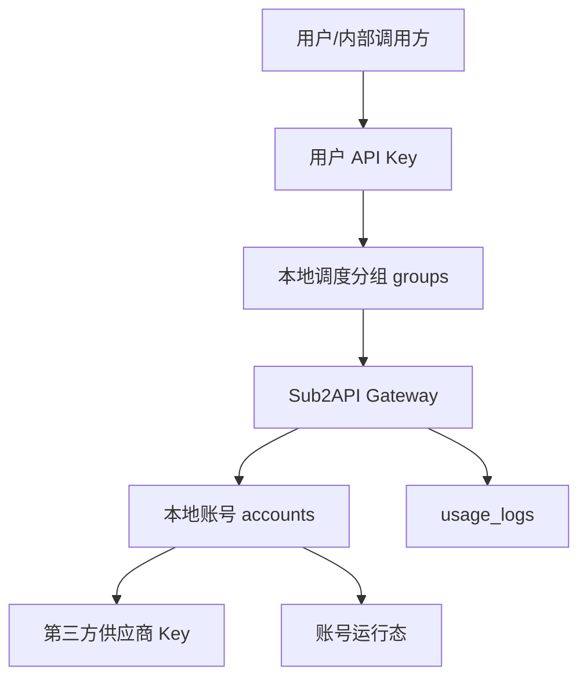
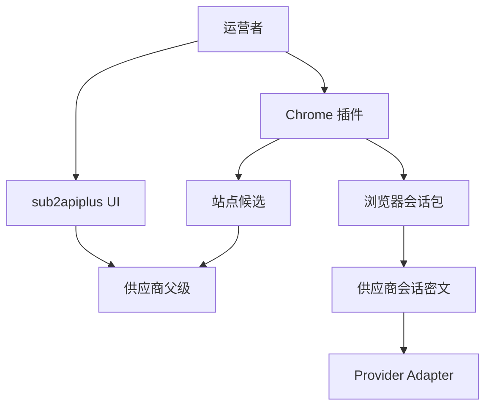
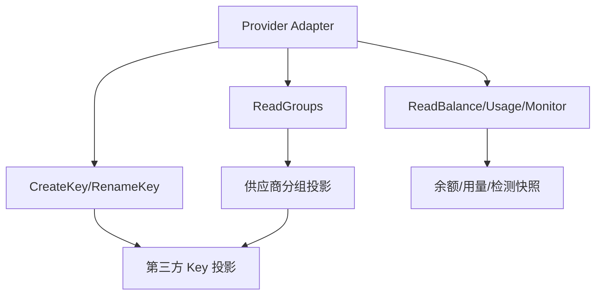
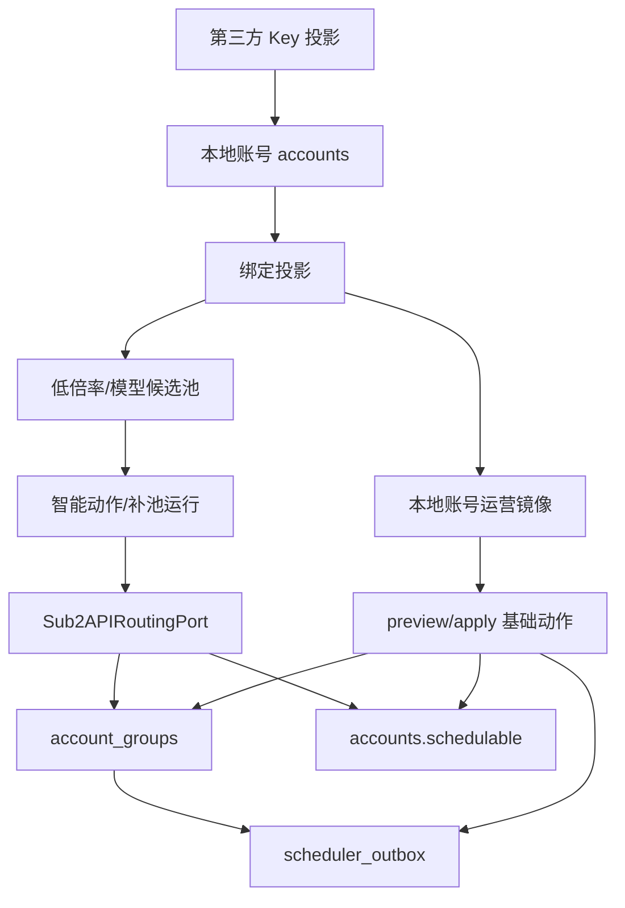
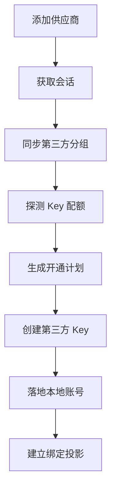
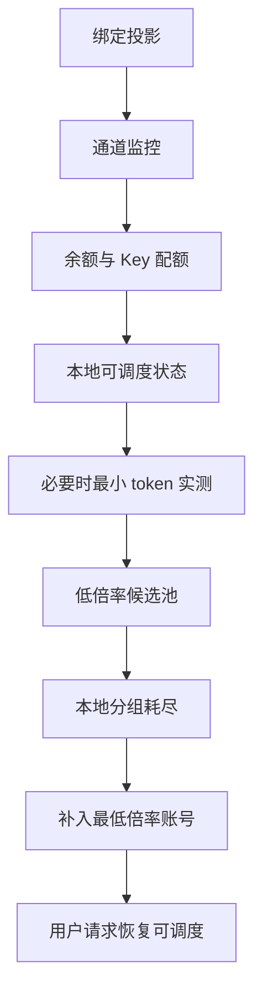

# Admin Plus 供应商、Sub2API、用户服务全局架构

版本：v0.1.0
日期：2026-07-08
状态：架构梳理，作为后续实现和文档更新事实源
范围：梳理 sub2apiplus 如何打通第三方供应商和本地 Sub2API，并最终通过本地 Sub2API 用户 API Key 服务用户；覆盖供应商管理、第三方供应商令牌/分组管理、本地账号管理、用户分组、检测同步、调度补池和运营可视化。

## 1. 文档分层

本目录把原来散在账号开通、调度中心、路由补池里的内容拆开，避免一张 Markdown 大图不可读。

| 文档 | 说明 |
|------|------|
| [01-domain-model.md](01-domain-model.md) | 核心对象、表关系、三类分组、所有权边界 |
| [02-token-group-management.md](02-token-group-management.md) | 第三方供应商令牌分组管理，以及截图中的令牌/分组/倍率、Key 配额关系 |
| [03-sync-detection.md](03-sync-detection.md) | 会话探测、分组同步、倍率同步、余额同步、通道监控、低成本检测和最后优先级的实测 |
| [04-local-binding-routing.md](04-local-binding-routing.md) | 第三方 Key 落地本地账号、本地分组绑定、调度补池、坏账号关闭 |
| [05-operations-visualization.md](05-operations-visualization.md) | 运营面板、调度面板、调度工具、系统协调可视化和必须补齐的能力 |
| [06-capability-map.md](06-capability-map.md) | Chrome 插件、站点发现、通知、成本、代理、纯度、导入导出等功能域清单 |
| [07-iteration-plan.md](07-iteration-plan.md) | 基于当前版本的优先级迭代计划，覆盖重构、清理、运营主入口和阶段验收 |
| [08-database-design.md](08-database-design.md) | Admin Plus 完整数据库设计、ER 图、表域划分、导入导出边界和核心流程表级数据流转 |

相关旧文档：

- [../accounts/README.md](../accounts/README.md)：原账号链路方案，保留历史上下文。
- [../scheduler/README.md](../scheduler/README.md)：调度中心计划、运行、重试和审计。
- [../routing/README.md](../routing/README.md)：分组耗尽后的最低倍率补池专题详设，只保留触发、端口、算法、写回、坏账号关闭和测试验收。
- [../newapi/README.md](../newapi/README.md)：New API 供应商适配事实。

## 2. 一句话模型

sub2apiplus 是供应商供给和本地 Sub2API 服务之间的协调层。它不替代第三方供应商后台，也不替代本地 Sub2API 网关；它把供应商侧的分组、Key、Key 配额、倍率、余额、通道监控和健康事实，转换成本地 Sub2API 可调度的账号和分组容量，最终保障用户 API Key 可持续调用。

```text
第三方供应商供给
  -> sub2apiplus 同步、检测、开通、绑定、补池
  -> 本地 Sub2API 账号和本地调度分组
  -> 本地 Sub2API 用户 API Key
  -> 用户请求被网关调度到可用供应商账号
```

运营日常操作应优先在 Admin Plus 完成，因为 Admin Plus 能同时展示供应商、第三方分组、倍率、余额和用户影响。Sub2API 原后台保留为应急备选入口；运营在原后台切换本地分组或调度后，Admin Plus 必须能同步本地状态、识别 drift，并提示采纳或恢复。当前 P0 已支持本地状态同步、写前保护、差异查看、采纳原后台、恢复基线、供应商详情聚合视图，以及操作审计时间线；打开单个供应商即可查看第三方分组、第三方 Key、本地绑定、有效倍率、余额、通道检测和 drift，进入 `/admin/action-audits` 可查看本地账号写回、同步、直登、余额、插件等动作结果。

数据库事实源见 [08-database-design.md](08-database-design.md)。任何新增表、字段、导入导出策略、表级时序图和数据流转都应先更新该文档，再改 migration 或 service。

当前阶段口径：

- P1 主线已经可以收口：自动补池、Key 配额计划、余额门禁、统一候选评估、统一写回端口、动作执行历史、失败重试和成功回滚已形成闭环。
- P2 不能整体结束：模型级候选第一阶段已完成，补池可按 `model_scope` 选择候选，明确不匹配输出 `model_scope_unsupported`；纯度检测联动和过期策略第一阶段已完成，本地账号运营镜像会读取最近纯度检测结果并派生 `purity_freshness_status=fresh/stale/unknown`，明确失败输出 `purity_failed`，风险态输出 `purity_risk`，过期输出 `purity_stale` 并进入复检动作建议；代理联动第一阶段已完成，候选评估会读取 Sub2API `accounts.proxy_id -> proxies`，明确代理不可用输出 `check_source=proxy`，无代理或未知不阻断；通知矩阵第一阶段已完成，动作建议会按余额、Key 配额、分组容量、drift/本地状态、通道失败、代理、纯度、成本和利润风险进入通知中心；实测预算/冷却第一阶段已完成，渠道检测可按每日 token 预算和同分组冷却跳过主动实测；成本利润看板细化、通知升级策略、代理深度联动和细粒度实测成本归集仍待实施。
- P3 本轮不实施：已完成的 `RemoteAdminAPIRoutingPort` 只作为远程写回第一阶段保留，不继续扩展多 Sub2API 实例、跨实例容量和迁移冲突修复。

因此有三个容易混淆但必须区分的“分组”和三类容易混淆的“Key/令牌”。

| 名称 | 所属系统 | 例子 | 作用 | ID 是否可混用 |
|------|----------|------|------|--------------|
| 第三方供应商分组 | 第三方平台 | ShareAPI 的 `PRO共享容量号池-7*24稳定`，Codex APIs 的 `kiro-pro` | 第三方平台创建 Key 时选择的费率/权限/额度池 | 否 |
| Admin Plus 供应商分组投影 | Admin Plus | `admin_plus_supplier_groups` 中的同步记录 | 保存第三方分组的名称、倍率、状态、原始 payload | 否 |
| 本地 Sub2API 调度分组 | 本地 Sub2API | `Lime`、`OpenAI`、`Claude` | 本地用户 API Key 授权和网关调度使用的分组 | 否 |

| 名称 | 所属系统 | 例子 | 作用 | 是否给最终用户 |
|------|----------|------|------|----------------|
| 第三方供应商 Key | 第三方平台 | ShareAPI/Codex APIs 后台创建的 `sk-...` | sub2apiplus 用它创建本地上游账号 | 否 |
| 本地 Sub2API 账号凭据 | 本地 Sub2API `accounts.credentials` | 供应商 Key 落地后的账号凭据 | 只给网关调度，不直接给用户 | 否 |
| 用户 API Key | 本地 Sub2API `api_keys.key` | 发给客户或内部调用方的 `sk-...` | 用户请求入口，绑定本地调度分组 | 是 |

## 3. 全局架构图

Markdown 中一张横向大图会被压缩到不可读。全局架构按链路拆成四张小图，每张图只回答一个问题。

### 3.1 用户请求链路



### 3.2 供应商接入链路



### 3.3 供应商事实同步链路



### 3.4 本地协调与补池链路



## 4. 管理边界

### 4.1 供应商管理负责什么

供应商管理以 `admin_plus_suppliers` 为父级，负责：

- 维护第三方平台的后台地址、API 地址、类型、运行状态。
- 保存登录配置和会话状态。
- 触发 Provider Adapter 读取分组、倍率、余额、用量、公告、通道监控、Key 配额状态。
- 展示第三方分组和第三方 Key 的投影。
- 判断哪些第三方分组具备低倍率和可用性，可以作为补池候选；余额不足时保留低倍率机会并提示充值。

供应商管理不负责：

- 直接修改本地 Sub2API 网关调度逻辑。
- 把第三方分组 ID 当作本地 Sub2API 分组 ID。
- 绕过 Provider Adapter 解析第三方私有页面。

### 4.2 账号管理负责什么

账号管理以本地 Sub2API `accounts` 为事实源，负责：

- 管理本地账号凭据、平台、并发、优先级、倍率、调度开关。
- 管理本地账号与本地 Sub2API 分组的绑定。
- 通过 `scheduler_outbox` 刷新网关调度快照。
- 暴露账号可用性事实，例如限流、错误、临时不可调度、余额/额度状态。
- 记录用户请求、用量和本地网关错误。
- 作为应急备选后台，允许运营手工切换本地账号分组和调度开关。

账号管理不负责：

- 解释第三方平台的分组倍率。
- 判断第三方供应商是否值得补池。
- 保存第三方供应商后台会话。

### 4.3 第三方令牌分组管理负责什么

第三方令牌分组管理是供应商管理和账号管理之间的桥：

- 从第三方平台同步可选分组和倍率。
- 在创建第三方 Key 时选择一个第三方分组。
- 在批量开通前探测 Key 配额，生成开通计划，提示哪些分组会因上限被阻塞。
- 把第三方 Key 的明文只用于本地账号落地，之后只保存脱敏投影。
- 将 `supplier_group_id`、`supplier_key_id`、`local_sub2api_account_id` 串起来，形成可检测、可调度、可审计的候选。

### 4.4 用户服务侧负责什么

用户服务侧以本地 Sub2API `users`、`api_keys`、`groups` 和 `usage_logs` 为事实源，负责：

- 给用户发放用户 API Key。
- 将用户 API Key 绑定到本地调度分组。
- 按用户余额、并发、Key 额度、Key 状态控制访问。
- 记录用户请求用量和扣费。

用户服务侧不负责：

- 知道第三方供应商 Key 明文。
- 直接选择第三方供应商分组。
- 直接修复供应商会话、余额或低倍率候选。

## 5. 核心数据流

### 5.1 接入与开通



### 5.2 检测与补池



## 6. 强约束

1. 原则上不修改 `/Users/coso/Documents/dev/go/sub2api`，避免 Sub2API 升级冲突。
2. Admin Plus 新增逻辑应集中在 `backend/internal/adminplus/`。
3. 当前同库部署已实现本地账号运营基础动作层，可在 Admin Plus 内写 `accounts/account_groups` 并写 `scheduler_outbox`。
4. P1 第一阶段已把本地账号运营写回从 service 层收口为 `Sub2APIRoutingPort`，并已提供分组可用性、账号快照、加入分组和开关调度语义化方法；自动补池和动作建议路径下的坏账号关闭已沿该端口落地。远程写回第一阶段已接入 `RemoteAdminAPIRoutingPort`，通过现有 Sub2API Admin API 管理账号分组和调度开关；多实例仍必须继续沿这个端口扩展。
5. 本地路由类运营动作的 current 事实源是 `admin_plus_action_recommendations/admin_plus_action_executions`；`admin_plus_scheduler_actions` 只作为调度中心 compat 工作台快照和跳转来源。普通本地账号手工写动作会创建 `local_account_manual_ops` executed recommendation，并写入同一 execution 表；成本对账异常会生成 `supplier_cost_reconcile_adjustment`，审批后优先把缺失充值、兑换、退款或 usage 写回原始业务表，无法定位明细时才写入成本账本 `manual_adjustment`，两类执行都记录同一 execution；调度 run/step 进入动作建议并执行时，执行历史会保存 `scheduler_run_id/scheduler_step_id` 并可反跳调度运行详情；本地账号手工写、补池、关调度和成本对账 apply 会保存幂等 key 指纹和前后状态快照，同 key replay 命中只回填旧执行记录的 `idempotency_replayed`，不会新增 execution 或重放写回；failed 执行可在动作建议页安全重试，succeeded 执行可安全回滚，重试和回滚都写入新的 `admin_plus_action_executions`，旧执行记录只作为来源。
6. 禁止新增散落 SQL 写本地 `accounts`、`account_groups` 的路径，避免绕过统一校验和 `scheduler_outbox`。
7. 第三方供应商 Key 明文只允许在开通/修复本地账号的短链路中使用，落库只保存指纹、last4、外部 ID 和脱敏响应。
8. 所有自动化写动作都必须有幂等键、运行记录和可审计原因。
9. Chrome 插件只做浏览器侧辅助：站点识别、授权连接、供应商候选提交、已登录会话上报；分组、倍率、余额、账单、健康等业务事实以后端 Provider Adapter 为准。
10. 批量开通第三方 Key 必须先 dry-run，展示供应商 Key 上限、已用数量、剩余容量和被阻塞分组。
11. 余额不足不能归类为渠道不可用；应标记为 `balance_blocked/recharge_required` 并保留低倍率候选。
12. 主动实测会消耗 token 和供应商余额，只能在通道监控、余额、本地状态都不足以判断时作为最后优先级执行。
12. Admin Plus 必须提供本地账号运营镜像，按供应商、第三方分组、有效倍率、本地调度分组和调度状态快速筛选账号。
13. Sub2API 原后台手工变更必须可同步、可审计、可采纳或恢复；Admin Plus 自动写回前必须重新读取本地状态，避免覆盖应急操作。
14. Admin Plus 数据库设计、ER 图和流程表级读写以 [08-database-design.md](08-database-design.md) 为准。
