# Sub2API Admin Plus 产品需求文档

版本：v0.1.0
日期：2026-06-20  
项目：`sub2api-admin-plus`  
定位：Sub2API 的非侵入式自动化运营扩展系统

## 0. 文档 Review 结论

本次 review 后，PRD 采用更严格的完成口径：

- 产品目标、架构设计和接口草案不等同于已完成实现。
- “已完成”只能用于已经走真实 HTTP handler、service、SQL repository、前端真实 API 或真实只读 Sub2API DB/Redis 的能力。
- E2E 中的 `e2e-*` 数据、本地 OpenAI-compatible `/v1/responses` 测试服务和插件解析样例只证明本地链路有效，不代表真实外部供应商采集完成；E2E 默认清理本次夹具，历史夹具用 `node tools/cleanup-admin-plus-e2e.mjs` dry-run 检查。
- Chrome 插件只有在真实登录目标供应商页面、读取实际页面数据并回传后，才能标记为该供应商适配完成。
- 自动执行只有在管理员确认后真实调用本地 Sub2API Admin API，并记录审计后，才能标记完成。

当前产品缺口集中在：首批 Sub2API 供应商真实适配、Chrome 当前网站识别与会话包上报、后端会话 API 采集、每日账单自动导出、动作确认执行、多通道通知和操作审计闭环。

## 1. 背景

当前 Sub2API 已承担核心网关职责，包括账号管理、API Key 分发、计费、调度、并发控制、使用记录和渠道监控。实际运营中还存在一批偏“运营自动化”和“供应商管理”的需求：

- 下游/上游供应商费率会变化，需要定时抓取、比对并告警。
- 需要把供应商账单导出后与本地 Sub2API 使用记录对账，计算真实成本、收入和利润。
- 需要持续监控第三方节点速度，例如首 token 时间、总耗时、可用率、错误率和可并发数。
- 需要在供应商父级配置后台登录账号、密码或临时 token，通过 Chrome 插件识别当前供应商后台、一键登录或读取已登录会话，并把第三方会话包上报给 Admin Plus；后端优先使用会话包模拟已登录 API 请求完成采集，网页侧抓取和账单导出只作为兜底能力。供应商 Admin API Key 只作为可选高级集成，不作为 MVP 必需条件。
- 需要保持主系统 `/Users/coso/Documents/dev/go/sub2api` 可持续跟随上游更新，不能把自用运营逻辑侵入 Sub2API 核心代码。

因此，`sub2api-admin-plus` 作为独立扩展系统开发，复用 Sub2API 的技术栈、管理员权限和公开集成点，只开发自动化运营业务能力。

## 2. 产品目标

### 2.1 核心目标

`sub2api-admin-plus` 的初步核心目的，是让中转站在多上游供应商之间自动选择成本、稳定性和利润都合理的运营方案：客户尽量使用到低成本、稳定的 API；中转商获得可持续的合理利润；系统在上游故障、余额不足、费率变化、公告命中关键运营信息时及时发现、通知并给出切换或充值建议，减少人工盯盘。

1. 建立供应商台账：管理第三方供应商父级、下挂的本地 Sub2API 账号/Key 子级、供应商费率、登录凭据和运营状态。
2. 自动监控费率：每 10 分钟抓取一次供应商费率，发现变更后记录快照、生成事件并告警。
3. 自动对账：每天导入或自动导出供应商账单，与本地 `usage_logs` 对齐，计算成本、收入、毛利和异常差异。
4. 自动监控节点质量：持续采集首 token、总耗时、可用率、错误率、并发容量和余额状态，用于运营决策。
5. 利益最优调度建议：综合上游成本、节点质量、可用余额、客户售价和目标毛利，推荐最符合客户利益且能保留合理利润的上游节点。
6. 公告监控与关键词分类：即使某个供应商当前没有余额，也持续关注其公告、通知、充值页和费率页；命中充值赠送、费率折扣、套餐活动等成本类关键词时生成充值或调权建议。
7. 自动化运营告警：余额不足、费率上涨、节点故障、对账异常、毛利过低、供应商公告命中关键运营信息时及时通知。
8. 自动化执行闭环：在管理员确认后，通过 Sub2API Admin API 调整账号调度状态、优先级或并发。
9. Chrome 插件协同：当供应商没有完整 API 或数据库权限时，通过浏览器插件完成当前网站识别、一键登录、会话包获取和上报；后端优先用会话包调用供应商内部 API，只有 API 不可用时才使用浏览器导出和页面抓取兜底。

### 2.2 非侵入目标

`sub2api-admin-plus` 不修改 Sub2API 核心业务代码，不新增 Sub2API 私有分支逻辑，不直接写 Sub2API 数据库或 Redis。

允许的集成方式按优先级排序：

1. 独立 Admin Plus URL，通过 Sub2API 管理员 JWT 校验复用管理员身份。
2. Sub2API Admin API。
3. Sub2API PostgreSQL 只读查询。
4. Sub2API Redis 只读查询。
5. Chrome 插件登录供应商后台获取第三方会话包，网页数据抓取仅作为兜底。
6. 可选在 Sub2API 后台配置外链入口，但不依赖 iframe。
7. 仅当缺少通用扩展点时，向上游 Sub2API 提交小型通用 PR。

## 3. 明确不做

- 不开发独立用户系统。
- 不开发独立角色/权限系统。
- 不开发新的登录体系。
- 不把自用业务逻辑 PR 到 Sub2API 上游。
- 不直接写入 Sub2API PostgreSQL 或 Redis。
- 不重做 Sub2API 已有的账号管理、用户管理、API Key 管理、网关转发、计费扣费和核心调度。
- 不开发 OpenAI、Anthropic、Gemini 等源站账号添加功能，不保存这些源站账号的 API Key、OAuth、Cookie 等凭据。
- MVP 不支持所有供应商后台；OpenAI、Anthropic、Gemini 等源站账号的添加继续由 Sub2API 负责，admin-plus 只运营 Sub2API 已添加的源站账号，并优先支持 Sub2API 中转型上游。
- MVP 不开发账号采购、库存下单、付款和卖家推荐功能；仅预留账号采购成本、库存来源和采购记录模型。

## 4. 设计原则

- KISS：先做 Sub2API 供应商适配器，避免一开始抽象过度。
- YAGNI：New API 和其它相似系统保留适配器接口，MVP 不展开。
- DRY：费率、账单、监控统一走 Provider Adapter，避免每个页面各写一套抓取逻辑。
- SOLID：采集、对账、策略决策、执行动作分层，单一职责。
- 非侵入：主系统只读或通过 Admin API 写入，确保 Sub2API 可持续升级。

## 5. 用户与角色

### 5.1 目标用户

系统运营者，即当前 Sub2API 的管理员。

### 5.2 权限复用

`sub2api-admin-plus` 不维护自己的用户、角色和权限表。

认证来源：

- Admin Plus 独立访问，不依赖 iframe、跨子域共享 cookie 或同时登录状态。
- Admin Plus 可以提供自己的登录页，但登录、2FA、刷新 token 和登出动作都代理到本地 Sub2API 认证接口。
- Admin Plus 前端保存的是 Sub2API 签发的 access token 和 refresh token，存储位置在 Admin Plus 自己域名下。
- Admin Plus 后端校验请求时，复用 Sub2API JWT/管理员判断逻辑，或调用本地 Sub2API `/api/v1/auth/me` 校验当前 token。
- 服务端执行写操作调用本地 Sub2API 时，使用经校验后的管理员 JWT 或本地 Sub2API 允许的 Admin API Key，具体按 Sub2API 现有接口要求选择。
- Chrome 插件与 admin-plus 通信时，使用 admin-plus 生成的短期设备 token，设备 token 只代表插件任务执行权限，不代表用户体系。
- Chrome 插件不提供管理员登录 UI，不接收 Sub2API 管理员账号、密码、2FA 或 OAuth 输入；未连接时只打开 sub2apiplus Web 登录/授权页，登录和授权都在 Web 页面完成。

授权规则：

- 只要当前请求不能证明来自 Sub2API 管理员，就拒绝访问 admin-plus。
- admin-plus 内部不做二级角色，例如运营、财务、只读管理员等。
- 操作审计记录操作人使用 Sub2API 的管理员用户 ID、用户名或管理员 token 指纹。

### 5.3 登录策略结论

是否与 Sub2API 后台“同时登录”不是核心目标。Admin Plus 的认证边界应定义为：

- Admin Plus 有独立登录入口。
- 登录表单提交给 Admin Plus 后端。
- Admin Plus 后端代理调用本地 Sub2API `/api/v1/auth/login`、`/api/v1/auth/login/2fa`、`/api/v1/auth/refresh` 和 `/api/v1/auth/logout`。
- Sub2API 负责密码校验、2FA 校验、refresh token 管理、用户状态和管理员角色判断。
- Admin Plus 只接受 `role=admin` 的 Sub2API 用户。
- Admin Plus 不签发自己的用户 token，不保存用户密码，不维护用户表。

这样可以支持：

```text
Sub2API:    https://sub2api.demo.com
Admin Plus: https://sub2api-plus.demo.com
```

并且不需要：

- iframe。
- 共享父域 cookie。
- 跨子域读取 `localStorage`。
- Chrome 插件同步 Sub2API 登录 token。
- 在 Chrome 插件内实现 Admin Plus 登录表单。
- 给 Sub2API 增加 SSO 或 token handoff PR。

复制 Sub2API 后端代码的价值在于复用 DTO、JWT 校验、管理员判断、响应结构和只读查询模型；MVP 登录链路优先走 Sub2API 现有认证 API 代理，避免在 admin-plus 中复制一套会写 Sub2API DB/Redis 的认证服务。

## 6. 上游供应商支持策略

### 6.1 MVP 优先级

上游需要区分两类：

- Sub2API 源站账号：Sub2API 中已添加的 OpenAI、Anthropic、Gemini 等原始 LLM 账号，是成本链路的最上游。
- 中转型上游：Sub2API、New API、New API-like、仅网页后台的供应商。

MVP 优先级：

1. Sub2API 源站账号：读取并运营 Sub2API 已添加的 OpenAI、Anthropic、Gemini 账号。
2. 中转型上游：供应商也是 Sub2API 部署实例。
3. 中转型上游：New API 或 New API-like 系统。
4. 仅提供网页后台的供应商。
5. 其它自定义供应商。

MVP 必须支持读取和运营 Sub2API 已添加的源站 LLM 账号，以及 Sub2API 中转型上游。

### 6.2 Sub2API 供应商适配能力

当上游供应商也是 Sub2API 时，优先使用以下数据源：

- Admin API：账号列表、使用记录、渠道监控、账单导出、余额调整等可公开管理接口。
- PostgreSQL 只读：`usage_logs`、`accounts`、`channel_monitors`、`channel_monitor_histories`、`channel_monitor_daily_rollups` 等分析数据。
- Redis 只读：并发会话、窗口费用等运行态数据，例如 `session_limit:account:{accountID}`、`window_cost:account:{accountID}`。
- Chrome 插件：当供应商未开放管理 API 或无法直连 DB/Redis 时，使用供应商父级配置的后台账号密码或临时 token 登录后台，获取 access token、cookie、CSRF token、组织/账号上下文和 API base URL 等会话包；后端使用会话包调用供应商内部 API。只有会话 API 不可用时，才通过插件导出 CSV、读取少量页面指标或上传诊断截图。

余额采集必须区分三种口径：

- 供应商用户余额：我们作为下游用户在供应商 Sub2API 实例中的余额或有效额度。MVP 余额监控主路径采集这个值，通常由 Provider Adapter 使用插件上报的登录会话调用供应商用户侧 profile/账户接口读取。
- 供应商上游源站账号余额：供应商自己的 OpenAI、Anthropic、Gemini 等源站账号额度。作为普通下游默认没有权限，只有供应商明确提供 Admin API Key、只读数据库或只读 Redis 时才采集。
- 本地 Sub2API 账号 quota/usage：这是本地网关账号用量和限额，只能用于本地调度、成本核算和对账，不能当作供应商余额。

因此，Sub2API 同源供应商可以采集余额，但默认只采集“我们在供应商侧的下游用户余额”。普通下游会话不得默认调用供应商 `/api/v1/admin/*`。

### 6.3 Sub2API 源站账号运营能力

OpenAI、Anthropic、Gemini 等源站 LLM 账号的添加、OAuth、API Key 录入和凭据刷新继续由 Sub2API 完成。admin-plus 只读取 Sub2API 已存在的账号，并管理这些账号的运营属性。

核心能力：

- 读取 Sub2API 已添加的源站账号和分组绑定。
- 配置官方/采购成本费率。
- 采集余额、额度、限速、可并发数和可用模型。
- 执行连通性测试和模型探测。
- 监控首 token、总耗时、错误率和可用率。
- 根据成本、稳定性、额度和目标毛利生成调度建议。

源站账号不依赖供应商账单页面时，优先使用 Sub2API Admin API、只读数据库、使用记录和账号测试结果做成本核算；admin-plus 不直接保存源站账号 API Key 或 OAuth 凭据。

### 6.4 Provider Adapter 设计

所有上游能力都通过 Adapter 暴露，MVP 实现 `Sub2APISourceAccountAdapter` 和 `Sub2APIProviderAdapter`。

```text
ProviderAdapter
  - ProviderKind()
  - FetchRateCatalog()
  - FetchUsageBills()
  - FetchBalance()
  - FetchConcurrency()
  - FetchHealthMetrics()
  - FetchModels()
  - ProbeCredential()
  - ExportBillsByBrowserTask()
  - ValidateCredential()
```

Sub2API 源站账号按 platform 归类处理：OpenAI、Anthropic、Gemini。后续 New API 只新增 `NewAPIProviderAdapter`，不影响已实现业务模块。

## 7. 业务范围

### 7.1 供应商台账

用于维护所有上游供应商父级。供应商父级只表达一个上游组织、系统或后台入口，不直接等同于某一个可调度账号/Key。

核心字段：

- 供应商名称。
- 上游类别：`source_account`、`relay`、`browser_only`、`custom`。
- 供应商类型：`openai`、`anthropic`、`gemini`、`sub2api`、`new_api`、`browser_only`、`custom`。
- 后台地址。
- API Base URL。
- Chrome 插件登录配置：后台登录账号、登录密码、临时 token、是否允许插件登录采集。
- PostgreSQL 只读连接，可选，仅在供应商允许只读库访问时配置。
- Redis 只读连接，可选，仅在供应商允许只读 Redis 访问时配置。
- 管理 API Key 可选，仅作为供应商明确提供管理 API 时的高级集成，不作为新增供应商的必填项。
- 下挂账号/Key 数量。
- 供应商状态：正常、不可用、凭据失效、暂停监控。
- 供应商备注。

供应商运行分类：

- `monitor_only`：仅监控费率、公告和余额，不进入切换候选。
- `candidate`：有余额且健康达标，可以进入切换候选。
- `active`：当前正在承载流量。
- `disabled`：暂停监控和调度。

余额规则：

- 供应商无余额或额度不足时，不允许作为流量切换候选。
- 供应商无余额时，仍然保留费率、公告、账单和页面监控。
- 如果无余额供应商出现成本类公告命中，系统只生成“充值建议”，不生成“切换建议”。
- 充值后，系统重新校验余额、健康和凭据，通过后才能进入 `candidate`。

### 7.2 供应商账号/Key 子级管理

用于在供应商父级下面管理“供应商分组 -> 第三方 Key -> 本地 Sub2API 账号”的落地关系。MVP 主流程不是先手工选择已有本地账号，而是在供应商分组弹窗内对某个真实分组创建第三方 Key，并同步创建本地 Sub2API `accounts.id`；切换建议、成本核算、健康指标和对账最终都要落到这些绑定子级上。供应商余额属于父级供应商或供应商侧账户口径，单个 Key 不展示余额，只展示真实用量 token 和金额。

核心关系：

- 供应商是父级，例如某个 Sub2API 中转站、New API 中转站、仅网页后台供应商，或一组源站账号的运营归类。
- 供应商分组是供应商侧事实，由 Provider Adapter 同步；Admin Plus 不创建供应商分组。
- 第三方 Key 创建时选择供应商分组，MVP 按“一组一个可调度 Key/本地账号绑定”收敛。
- 供应商账号/Key 是子级，绑定第三方 Key 和本地 Sub2API 账号。
- Admin Plus 不负责新增 OpenAI、Anthropic、Gemini 等源站账号，也不保存源站 API Key、OAuth 或 Cookie。
- 子级可以记录供应商侧账号标识，例如后台用户名、供应商侧 account id、组织 ID、项目 ID、账号标签或供应商侧 API Key 指纹，但不要求保存供应商侧 API Key 明文。

核心能力：

- 在供应商分组弹窗中展示分组、第三方 Key、本地账号和绑定状态。
- 对未绑定分组创建第三方 Key，并同步创建本地 Sub2API 账号。
- 读取并展示本地 Sub2API 账号名称、平台、类型、分组、状态和是否可调度。
- 配置供应商侧账号标识、账号标签、组织 ID、项目 ID 或 API Key 指纹。
- 配置该子账号/Key 的成本费率、质量阈值和毛利目标。
- 记录默认并发、最大并发和实际观测并发。
- 一个供应商父级下可以挂多个子账号/Key。
- 同一个本地账号/Key 默认只能在同一个供应商父级下绑定一次，避免重复核算；确有特殊场景时再通过明确业务规则扩展。
- 独立账号/Key 绑定页只读展示已生成绑定，用作审计和历史查看；创建和本地落地失败修复都必须从供应商分组弹窗触发，不在该页保留新增、编辑或删除按钮。
- 账号/Key 绑定页视觉和信息密度对齐 Sub2API 用户 API 密钥列表：第一列展示本地账号名称、脱敏供应商 Key、供应商上下文；分组列使用与 Sub2API `GroupBadge` 一致的名称、倍率和渠道颜色展示。

子级目标：

- 对账时知道某条本地使用记录应归属哪个供应商账单。
- 监控时知道哪个供应商节点影响哪个本地账号。
- 调度建议时能定位到应调整的本地账号。
- 成本、健康和并发指标可以按供应商父级聚合，也可以按子账号/Key 精确决策；余额按供应商父级或供应商侧账户聚合，不作为单 Key 字段展示。

### 7.3 费率监控

每 10 分钟抓取供应商费率并生成快照。

MVP 数据源：

- Sub2API 供应商 Admin API 的渠道/模型定价接口。
- Sub2API 供应商数据库的渠道定价表，只读查询。
- 后端使用 Chrome 插件上报的供应商会话包调用供应商内部 API。
- Chrome 插件从供应商后台费率页面抓取仅作为兜底。
- 手动维护费率作为兜底。

核心能力：

- 按供应商、模型、计费模式、计费层级记录费率。
- 支持 token、按次、图片等计费模式。
- 支持输入、输出、缓存创建、缓存读取等不同价格项。
- 支持与上一快照对比。
- 发现变更后生成事件。
- 支持变更阈值，例如大于 1% 才告警。
- 支持人工确认变更。
- 支持把确认后的费率用于成本核算。

### 7.4 公告监控

用于持续读取供应商公告、通知、充值页和活动页文本，并通过关键词分类识别成本类公告、维护通知、故障公告和普通通知。公告监控是一级能力；充值赠送、费率折扣、套餐和限时公告只是关键词分类结果。

数据来源：

- 供应商 Sub2API 公告、后台页面或配置接口。
- 后端使用供应商会话包调用供应商内部 API 或公告接口。
- Chrome 插件读取供应商后台活动、充值页和公告仅作为兜底。
- 手动录入公告。

核心能力：

- 记录公告分类：充值赠送、费率折扣、套餐、限时公告、维护、故障、普通通知。
- 对成本类公告记录有效期、适用模型、适用账号、最低充值金额、预计折后成本。
- 对比当前可用供应商成本，计算成本类公告是否能降低成本或提高毛利。
- 对无余额供应商也执行公告监控。
- 成本类公告在无余额供应商上只生成充值建议，不进入切换候选。
- 维护、故障和普通通知只作为信息或风险信号，不生成切换/充值建议。
- 有有效期的成本类公告即将结束时生成提醒。

### 7.5 账单导出与对账

用于核算成本和利润。

数据来源：

- 供应商 Sub2API Admin API 使用记录。
- 供应商 Sub2API 数据库 `usage_logs` 只读查询。
- 供应商后台 CSV 导出。
- 本地 Sub2API 数据库 `usage_logs` 只读查询。

对账维度：

- 日期。
- 供应商。
- 供应商账号/Key 子级。
- 本地账号。
- API Key。
- 模型。
- 请求 ID。
- Token。
- 成本。
- 收入。
- 毛利。
- 首 token 时间。
- 总耗时。

对账结果：

- 已匹配。
- 供应商有、本地无。
- 本地有、供应商无。
- 成本差异。
- token 差异。
- 模型映射差异。
- 重复账单。
- 账单时间跨日。

### 7.6 节点质量监控

质量指标：

- 首 token 时间 P50/P90/P95。
- 总耗时 P50/P90/P95。
- 成功率。
- 错误率。
- 429/529/5xx 比例。
- 可用率。
- 当前并发。
- 最大可并发。
- 余额。
- 最近一次账单导出时间。
- 最近一次费率更新时间。

数据来源：

- 本地 Sub2API `usage_logs.first_token_ms`。
- 本地 Sub2API `usage_logs.duration_ms`。
- 本地 Sub2API Ops 和 Channel Monitor API。
- 本地 Sub2API `channel_monitor_histories`。
- 本地 Sub2API Redis 并发会话只读数据。
- 供应商 Sub2API 的相同指标。
- 后端使用供应商会话包调用供应商内部 API。
- Chrome 插件读取供应商后台余额和并发卡片仅作为兜底。

### 7.7 自动化运营策略

策略只生成建议，MVP 默认不自动执行破坏性动作。

建议类型：

- 降低账号优先级。
- 提高账号优先级。
- 暂停调度账号。
- 恢复调度账号。
- 调整账号并发。
- 提醒补充余额。
- 提醒供应商公告命中的关键运营信息。
- 提醒供应商费率变更。
- 提醒账单异常。

执行方式：

- 默认人工确认。
- 确认后通过 Sub2API Admin API 执行。
- 所有执行动作写审计日志。

调度候选硬规则：

- 只有父级供应商状态为 `candidate` 或 `active`，且其下挂子账号/Key 也处于可候选状态时，才可以进入切换候选。
- 切换候选实际落在供应商账号/Key 子级维度。
- 父级供应商必须有可用余额或有效额度。
- 子账号/Key 必须通过健康阈值。
- 供应商父级登录凭据或只读数据源必须有效。
- `monitor_only` 供应商只能生成充值、观察或手动评估建议，不能生成流量切换执行动作。

### 7.8 Chrome 插件

Chrome 插件负责浏览器侧会话能力，不负责业务采集主路径。详细路线图见 `docs/roadmap/Chrome/README.md`。

MVP 职责：

- 自动识别当前 active tab 是否匹配已配置供应商。
- 先检测是否已通过 sub2apiplus Web 页面授权；未授权时只提示并打开 sub2apiplus Web 登录/授权页。
- 插件不设计管理员登录 UI，不提供账号、密码、2FA 或 OAuth 输入。
- 在供应商后台页面展示匹配状态、登录状态和一键动作。
- 使用供应商父级配置的后台账号密码、临时 token，或运营者已手动登录的浏览器状态，完成一键登录/一键获取会话。
- 获取并上报第三方会话包，包括 access token、cookie、CSRF token、组织 ID、账号 ID、API base URL、过期时间和必要请求头。
- 上报任务状态、登录失败原因、会话探测诊断和必要截图。
- 仅在后端确认会话 API 不可用时，执行 CSV 下载、页面指标读取或截图等浏览器兜底任务。

插件不负责：

- 费率变化判断。
- 账单归一化。
- 对账计算。
- 余额阈值判断。
- 策略判断。
- 直接修改本地 Sub2API。
- 保存长期明文密码。
- 保存 Sub2API 管理员身份。
- 绕过 sub2apiplus 登录态匿名上传供应商会话包。

### 7.9 账号采购与库存成本预留

部分上游账号可能来自账号采购平台或人工采购，每个账号本身有采购成本、有效期和库存状态。该能力作为后续预留，MVP 不开发采购下单和库存管理。

预留范围：

- 记录账号来源：官方自有、采购平台、人工采购、供应商赠送。
- 记录采购成本、币种、采购时间、有效期。
- 记录账号库存状态：未使用、使用中、失效、待续费。
- 将账号采购成本折算到成本核算和毛利分析中。

MVP 不做：

- 自动购买账号。
- 采购平台商家推荐。
- 下单、支付、退款、售后流程。
- 账号库存自动补货。

## 8. 用户故事

### 8.1 客户使用低成本稳定 API

作为中转站客户，我希望系统优先把我的请求路由到稳定且成本合理的上游 API，这样我可以用更低价格获得可持续的服务，而不是频繁遇到慢响应、失败或突然涨价。

验收标准：

- 系统可以按模型、供应商、账号计算当前可用上游的成本。
- 系统可以结合首 token、总耗时、错误率和可用率判断节点质量。
- 系统可以给出“低成本且稳定”的推荐节点。
- 当最低成本节点质量不达标时，系统可以推荐次优成本但更稳定的节点。
- 推荐理由必须可解释，例如成本最低、P95 延迟达标、错误率低于阈值。

### 8.2 运营 Sub2API 已添加的源站账号

作为中转商，我希望系统可以读取和运营 Sub2API 已添加的 OpenAI、Anthropic、Gemini 等源站账号，这样不重复开发账号添加能力，也能把最上游账号纳入成本、额度和稳定性管理。

验收标准：

- 可以读取 Sub2API 中已添加的 OpenAI、Anthropic、Gemini 账号。
- 可以读取这些账号在 Sub2API 中的分组、调度和状态信息。
- 可以采集可用模型、额度、余额、限速和健康指标。
- 可以把原始 LLM 账号纳入成本、利润和切换建议计算。

### 8.3 中转商保持合理利润

作为中转商，我希望系统在选择低成本上游的同时计算客户售价、上游成本和毛利，这样既能让客户获得有竞争力的价格，也能保证业务有合理利润。

验收标准：

- 可以按供应商、模型、账号、API Key 计算收入、成本、毛利和毛利率。
- 可以配置最低毛利率阈值。
- 当某个上游费率上涨导致毛利过低时，系统生成告警。
- 当某个模型存在更优成本节点时，系统生成切换建议。
- 对账结果可以解释利润变化来源，例如费率上涨、用量变化、模型映射变化。

### 8.4 上游故障及时切换

作为运营者，我希望系统发现上游故障、慢响应、错误率升高或并发不足时，及时推荐切换到成本和稳定性更合适的节点，避免客户持续受到影响。

验收标准：

- 可以按供应商、账号、模型查看延迟趋势。
- 可以展示 P50/P90/P95。
- 可以展示近 5 分钟、1 小时、24 小时指标。
- 可以生成“建议切换”状态。
- 可以看到建议原因，例如首 token P95 超阈值、错误率超阈值、余额不足、可用并发不足。
- 切换建议必须展示候选节点的成本、健康分和预计毛利。
- 默认只生成建议，管理员确认后才执行调度变更。

### 8.5 余额不足及时通知

作为运营者，我希望系统持续监控每个上游供应商余额，并在余额不足或预计即将耗尽时通知我，这样我可以及时充值或切换，避免客户请求失败。

验收标准：

- 可以读取供应商当前余额。
- 可以基于最近消耗速度估算剩余可用时间。
- 可以配置余额阈值和预计耗尽时间阈值。
- 余额不足时生成告警并显示影响的本地账号、模型和客户分组。
- 余额不足时可以生成暂停、降权或切换建议。
- MVP 余额事件通知优先使用飞书自定义机器人 Webhook。

### 8.6 费率变化自动发现

作为运营者，我希望系统定时监控上游供应商费率变化，这样上游涨价或降价时可以及时调整调度策略、售价或利润预期。

验收标准：

- 可以创建供应商。
- 可以在供应商父级下绑定多个本地 Sub2API 账号/Key 子级。
- 可以配置或抓取模型费率。
- 定时任务每 10 分钟执行一次。
- 费率变化会生成快照和变更事件。
- 页面能展示变更前、变更后、变化比例、影响账号和预计利润影响。

### 8.7 无余额供应商公告监控

作为中转商，我希望系统即使在某个供应商没有余额时，也继续关注它是否出现充值公告、折扣费率或套餐公告，这样我可以在合适时机充值，获得更低成本；但在没有额度前，它不能被用于流量切换。

验收标准：

- 无余额供应商可以保持 `monitor_only` 状态。
- `monitor_only` 供应商继续执行费率和公告监控。
- 发现成本类公告命中时生成充值建议，展示活动有效期、预计折后成本、预计毛利变化。
- 无余额供应商不能出现在自动切换候选列表。
- 充值后必须重新校验余额、健康和凭据，达标后才能进入切换候选。

### 8.8 每日账单对账

作为运营者，我希望每天自动导出供应商账单并与本地使用记录对账，这样可以确认真实成本、客户收入、利润和异常账单。

验收标准：

- 可以为供应商配置每日导出时间。
- 可以通过 API、数据库或 Chrome 插件导入账单。
- 可以按日期生成对账批次。
- 可以看到总收入、总成本、毛利、毛利率。
- 可以看到未匹配、成本差异、token 差异明细。
- 可以导出对账结果 CSV。

### 8.9 自动化运营少盯盘

作为中转商，我希望系统自动完成费率监控、公告监控、余额监控、账单对账、节点健康评估和切换建议，这样日常运营不需要长期人工盯盘，只在需要决策时收到通知。

验收标准：

- 系统能自动执行定时采集和对账任务。
- 系统能把异常聚合成待处理事项。
- 系统能按严重程度排序告警。
- 系统能记录每个建议的原因、影响范围和建议动作。
- 系统能保留处理记录，方便复盘。

### 8.10 供应商后台登录凭据绑定

作为运营者，我希望在供应商父级绑定后台登录账号、密码、临时 token 和可选只读数据库连接，这样 Chrome 插件和只读适配器可以用最合适的数据源采集运营数据。

验收标准：

- 凭据加密存储。
- 页面不回显明文。
- 可以测试凭据是否可用。
- 可以禁用某个凭据。
- 凭据使用记录进入审计日志。
- 新增供应商不要求填写供应商 Admin API Key。
- Chrome 插件只能领取当前供应商相关任务，并在任务执行窗口短期解密登录凭据。

### 8.11 OpenAI-compatible 源站健康探测

作为运营者，我希望对供应商账号/Key 子级绑定的本地 Sub2API OpenAI 账号发起真实 Responses 探测，这样可以用最新模型链路判断首字速度、总耗时和可用性，而不是只靠手工录入健康样本。

验收标准：

- 探测入口选择供应商父级和账号/Key 子级，不在前端输入 API Key。
- 后端从绑定的本地 Sub2API `accounts.credentials` 读取 `api_key` 和可选 `base_url`。
- 默认模型为 `gpt-5.5`，请求 OpenAI-compatible `/v1/responses`，并启用 streaming。
- 系统记录首字耗时、总耗时、HTTP 状态码、错误类别和并发配置。
- 探测结果写入健康样本表，并按阈值生成健康事件。
- API 响应和前端页面不得暴露 API Key。
- 没有有效 Key 或可用 base URL 时，系统只能给出明确错误，不能假装探测成功。

## 9. 用户用例

### 9.1 低成本稳定路由建议

参与者：运营者、Admin Plus、Sub2API Admin API。

前置条件：

- 已配置至少两个上游供应商。
- 每个参与调度的供应商下已绑定至少一个本地 Sub2API 账号/Key 子级。
- 已采集费率和健康指标。

主流程：

1. 系统按模型读取所有可用上游节点。
2. 系统过滤不可用、余额不足、无有效额度、错误率超阈值、延迟超阈值的节点。
3. 系统计算每个候选节点的上游成本、客户售价、预计毛利和健康分。
4. 系统选择“满足稳定性阈值下成本最低，并满足最低毛利率”的节点。
5. 系统生成调度建议。
6. 运营者确认后，系统通过 Sub2API Admin API 更新账号优先级、并发或调度状态。

异常流程：

- 如果最低成本节点不稳定，选择成本次优但健康分达标的节点。
- 如果所有节点毛利都低于阈值，生成售价或供应商调整告警。
- 如果某个供应商成本更低但没有余额，只生成充值建议，不进入切换候选。
- 如果所有节点不可用，生成高优先级故障告警。

### 9.2 Sub2API 源站账号运营接入

参与者：运营者、Admin Plus、本地 Sub2API Admin API。

前置条件：

- 本地 Sub2API 已添加 OpenAI、Anthropic 或 Gemini 账号。
- admin-plus 已配置本地 Sub2API 管理员访问能力或只读数据库连接。

主流程：

1. 系统从 Sub2API 读取已添加的源站账号。
2. 系统识别账号平台、类型、分组、状态、并发和调度配置。
3. 系统读取或计算账号可用模型、额度、限速和健康状态。
4. 系统为账号绑定成本费率、余额阈值和毛利目标。
5. 系统将达标账号纳入调度建议候选。

异常流程：

- 如果 Sub2API 中账号凭据失效，admin-plus 标记该账号不可候选并提示去 Sub2API 修复。
- 如果账号无额度，状态为 `monitor_only`，只监控公告或额度恢复，不进入切换候选。
- 如果 Sub2API 无法返回余额，允许手动录入或通过账号测试结果推断。

### 9.3 上游余额不足处理

参与者：运营者、Admin Plus、Provider Adapter、Chrome 插件、供应商 Sub2API。

前置条件：

- 供应商已配置余额采集方式。
- 已配置余额阈值和预计耗尽时间阈值。

主流程：

1. 系统定时读取供应商余额。
2. 系统根据最近 24 小时消耗速度估算剩余可用时间。
3. 余额低于阈值或预计耗尽时间低于阈值时，生成告警。
4. 系统列出受影响的本地账号、模型、客户分组和预计影响。
5. 系统推荐充值、降权、暂停调度或切换到其它供应商。
6. 运营者确认后执行调度调整。

异常流程：

- 如果 Admin API、只读 DB/Redis 均无法读取余额，优先使用 Chrome 插件已上报的供应商会话包调用供应商内部 API。
- 如果会话 API 仍无法读取余额，再创建 Chrome 浏览器兜底任务。
- 如果兜底任务失败，标记凭据、会话或页面结构异常并提升告警等级。

### 9.4 上游故障切换

参与者：Admin Plus、Sub2API Admin API、运营者。

前置条件：

- 已配置健康阈值。
- 已采集使用日志或渠道监控数据。

主流程：

1. 系统持续聚合首 token、总耗时、错误率、可用率。
2. 指标超过阈值时，系统识别故障供应商和影响账号。
3. 系统查询可替代节点。
4. 系统比较替代节点的成本、健康分、余额和毛利。
5. 系统生成切换建议。
6. 运营者确认后执行切换。

异常流程：

- 如果替代节点成本明显更高但当前节点故障严重，系统标记“稳定性优先”。
- 如果替代节点会导致毛利过低，系统标记“利润风险”并提示是否临时接受。
- 如果替代节点无余额，即使成本更低，也不能作为切换目标，只能生成充值建议。

### 9.5 无余额供应商公告监控

参与者：运营者、Admin Plus、Provider Adapter、Chrome 插件、供应商后台。

前置条件：

- 供应商已配置费率或公告采集方式。
- 供应商当前余额不足或没有充值。
- 供应商状态为 `monitor_only`。

主流程：

1. 系统继续通过 Admin API、只读数据源或供应商会话 API 定时抓取该供应商的费率、公告、通知和充值页。
2. 系统对公告文本执行关键词分类，识别充值赠送、折扣费率、套餐、限时公告、维护、故障或普通通知。
3. 系统计算公告分类后的预计成本和预计毛利。
4. 系统与当前可用供应商成本做比较。
5. 如果成本类公告分类后成本更低或毛利更好，系统生成充值建议；维护、故障和普通通知只进入信息/风险信号。
6. 运营者充值后，系统重新校验余额、健康和凭据。
7. 校验通过后，供应商才可从 `monitor_only` 进入 `candidate`。

异常流程：

- 如果有有效期的成本类公告即将结束但余额仍为 0，系统提高提醒等级。
- 如果充值后健康指标不达标，供应商仍不能进入切换候选。
- 如果公告信息无法通过后端数据源和会话 API 自动抓取，系统创建 Chrome 浏览器兜底任务或提示手动录入。

### 9.6 每日利润核算

参与者：运营者、Admin Plus、Provider Adapter、Chrome 插件、供应商 Sub2API。

前置条件：

- 已配置供应商账单导出方式。
- 已配置本地 Sub2API 只读数据库连接。

主流程：

1. 系统按计划获取供应商账单。
2. 系统读取本地 Sub2API 使用记录。
3. 系统按 request_id、账号、模型、时间窗口匹配账单。
4. 系统计算收入、上游成本、毛利和毛利率。
5. 系统生成对账报告。
6. 系统标记成本差异、未匹配记录和利润异常。

异常流程：

- 如果供应商账单缺少 request_id，系统使用弱匹配并标记置信度。
- 如果账单导出失败，创建重试任务并通知运营者。

### 9.7 费率变化后的策略调整

参与者：运营者、Admin Plus、供应商 Sub2API。

前置条件：

- 已配置费率采集方式。
- 已配置最低毛利率阈值。

主流程：

1. 系统每 10 分钟抓取供应商费率。
2. 系统与上一快照比较。
3. 系统计算费率变化对本地账号、客户售价和毛利的影响。
4. 如果毛利低于阈值，生成策略建议。
5. 策略建议包括切换供应商、调整本地账号倍率、暂停低利润模型或提示改价。
6. 运营者确认后执行可自动化的调度动作。

异常流程：

- 如果费率来源冲突，优先使用管理员指定的权威来源。
- 如果无法抓取费率，保留旧费率并生成采集失败告警。

## 10. 总体架构

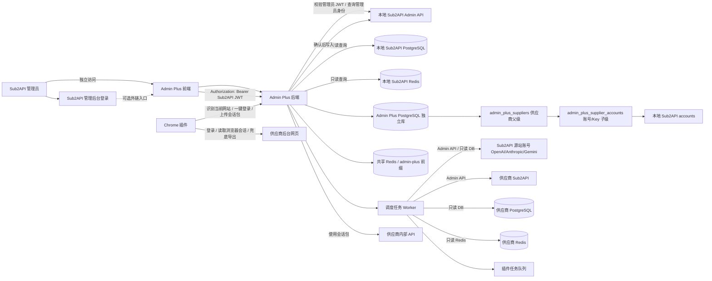

## 11. 部署与数据隔离

`sub2api-admin-plus` 部署时复用 Sub2API 的基础设施，但必须做到逻辑隔离。

### 11.1 PostgreSQL

部署策略：

- 复用 Sub2API 的 PostgreSQL 实例。
- 使用独立数据库 `superllm`。
- 不与 Sub2API 主库共用 schema。
- admin-plus 的业务表、迁移记录、任务表、审计表全部写入独立数据库。
- 读取 Sub2API 主库时必须使用独立只读连接配置，例如 `SUB2API_READONLY_DATABASE_URL`。

禁止：

- admin-plus 业务表建在 Sub2API 主库。
- admin-plus 迁移工具连接 Sub2API 主库执行 DDL。
- admin-plus 直接写 Sub2API 主库。

推荐连接划分：

```text
ADMIN_PLUS_DATABASE_URL        -> PostgreSQL 实例 / superllm，读写
SUB2API_READONLY_DATABASE_URL  -> PostgreSQL 实例 / sub2api，严格只读
```

### 11.2 Redis

部署策略：

- 复用 Sub2API 的 Redis 实例。
- admin-plus 所有自有 key 必须使用独立前缀。
- 默认前缀：`admin-plus:{env}:`，例如 `admin-plus:prod:`。
- 读取 Sub2API Redis 时只读访问 Sub2API 已有 key，例如 `session_limit:account:{accountID}`。
- admin-plus 不写入、删除或改动任何 Sub2API key。

admin-plus 自有 key 示例：

```text
admin-plus:prod:lock:rate-poll:{providerID}
admin-plus:prod:task:chrome:{taskID}
admin-plus:prod:queue:chrome
admin-plus:prod:cache:supplier-health:{providerID}
admin-plus:prod:idempotency:{operation}:{key}
```

推荐配置：

```text
REDIS_URL                  -> 复用 Sub2API Redis 实例
ADMIN_PLUS_REDIS_PREFIX    -> admin-plus:prod:
SUB2API_REDIS_READ_PREFIX  -> 空值或 Sub2API 实际前缀
```

验收要求：

- 任意 admin-plus Redis 写入必须带 `ADMIN_PLUS_REDIS_PREFIX`。
- 启动时校验 `ADMIN_PLUS_REDIS_PREFIX` 非空。
- 禁止使用无前缀写入。
- 禁止执行 `FLUSH*`。
- Redis key 扫描和清理只能作用于 admin-plus 前缀。

### 11.3 后端代码复用策略

admin-plus 的主要复杂度在后端逻辑。为了减少重复实现并兼容 Sub2API 持续更新，允许把 Sub2API 后端代码复制到 admin-plus 仓库内部，但必须按“同步快照 + 扩展层覆盖”的方式管理。

复用目标：

- 复用 Sub2API 后端 DTO、类型定义、分页、响应结构。
- 复用 Admin API 相关请求/响应模型。
- 复用账号、使用记录、渠道监控等只读查询模型。
- 复用 PostgreSQL / Redis 连接、配置解析、日志、时间等可独立使用的工具函数。
- 复用成本、token、延迟、使用记录等统计口径。

不复用：

- 网关转发核心。
- 用户登录和权限系统。
- Sub2API 主服务启动入口。
- 会写入 Sub2API 主库或主 Redis key 的 repository/service。
- 与 admin-plus 后端业务无关的大量前端代码。

推荐目录：

```text
internal/
  app/                         # admin-plus 自有业务
  adapters/
    sub2api/                   # 本地/供应商 Sub2API 适配层
  hooks/                       # 针对复制代码的 hook / override
  clients/
    sub2api_admin/             # Admin API client
  copied/
    sub2api/                   # Sub2API 后端代码快照，只同步不手改
      backend/
        internal/
        ent/
```

同步规则：

- `internal/copied/sub2api` 是上游同步区，不承载 admin-plus 私有逻辑。
- 复制目录必须记录来源 commit，例如 `internal/copied/sub2api/SOURCE.md`。
- 复制目录只允许通过脚本从 `/Users/coso/Documents/dev/go/sub2api` 同步。
- 禁止人工直接修改 `internal/copied/sub2api` 下的文件。
- 如果必须修补复制代码，优先在 `internal/hooks`、`internal/adapters` 或 wrapper 中处理。
- 确实属于通用问题时，再考虑给 Sub2API 上游提 PR。

允许的扩展方式：

- 用接口包裹复制代码暴露的能力。
- 用 adapter 转换 Sub2API 类型为 admin-plus 内部类型。
- 用 function option 注入不同的 DB、Redis、logger、clock。
- 用 decorator 拦截写操作，强制改为只读或转发 Admin API。
- 用 build tag 隔离不可复用的入口文件。

禁止的扩展方式：

- 在复制目录中直接改 Sub2API 业务逻辑。
- fork 出一套难以同步的 service。
- 把 admin-plus 的业务规则写进复制代码。
- 通过全局变量修改 Sub2API 核心行为。

运行边界不变：

- 读取 Sub2API 数据：通过 Admin API、只读 DB、只读 Redis。
- 写入 Sub2API 数据：只通过 Admin API。
- SuperLLM 自有数据：写入独立 `superllm` 数据库。
- admin-plus 自有缓存、锁、队列：写入共享 Redis 的 `ADMIN_PLUS_REDIS_PREFIX` 前缀。

升级流程：

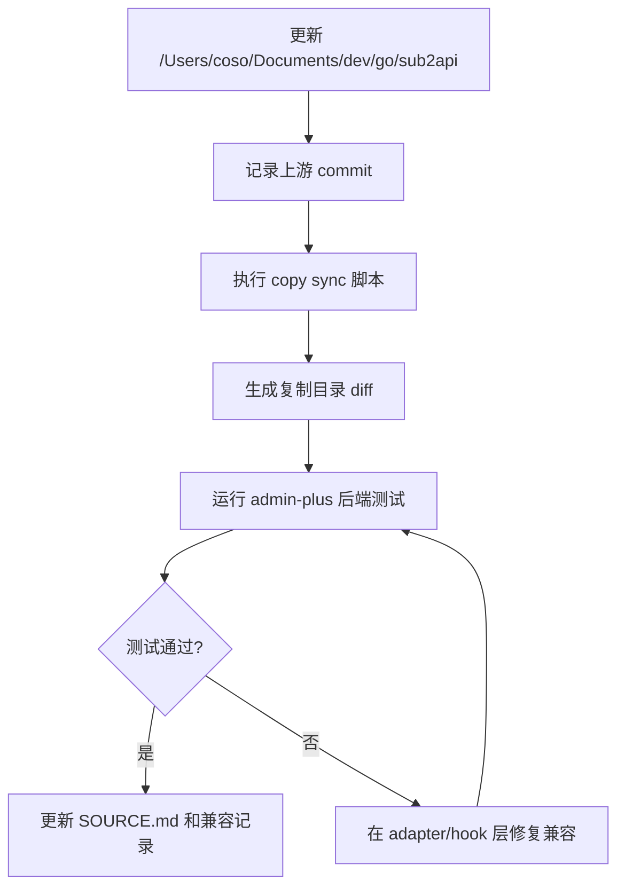

验收要求：

- `internal/copied/sub2api` 可以整体删除后通过同步脚本重建。
- 复制目录中不存在 admin-plus 私有业务逻辑。
- 所有自定义行为都能在 `internal/app`、`internal/adapters` 或 `internal/hooks` 中定位。
- 同步 Sub2API 上游后，不需要修改原 Sub2API 项目文件。
- 代码复用只服务后端业务实现，前端不要求复制 Sub2API 前端。

## 12. 逻辑架构

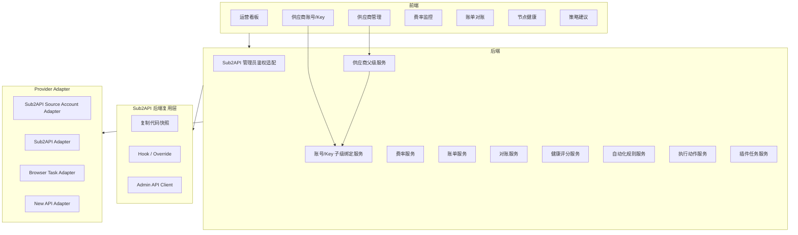

## 13. 关键时序

### 13.1 管理员访问 admin-plus

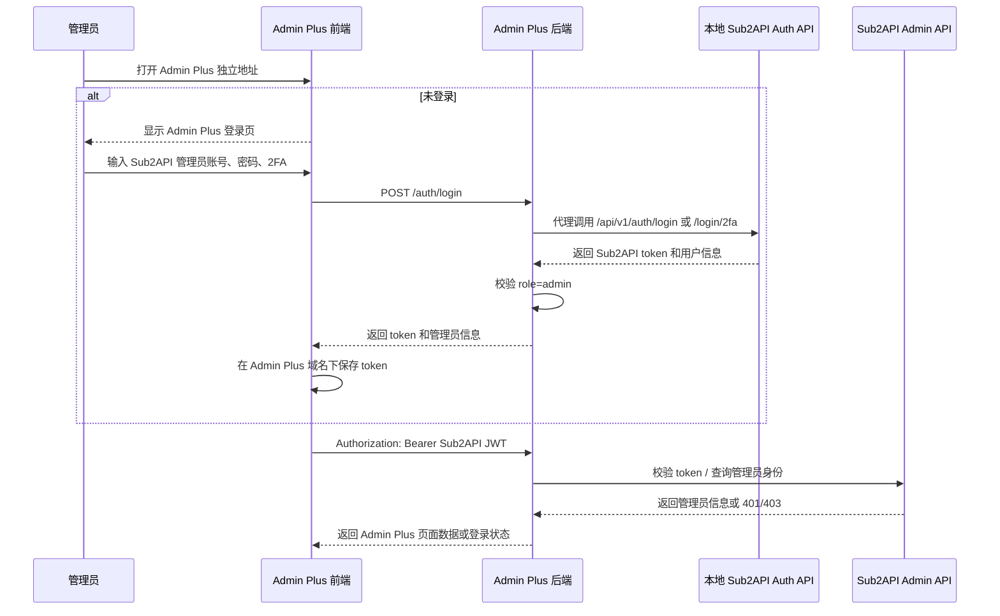

### 13.2 每 10 分钟费率抓取

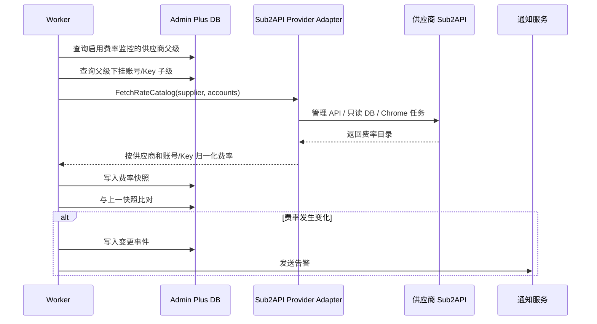

### 13.3 每日账单导出与对账

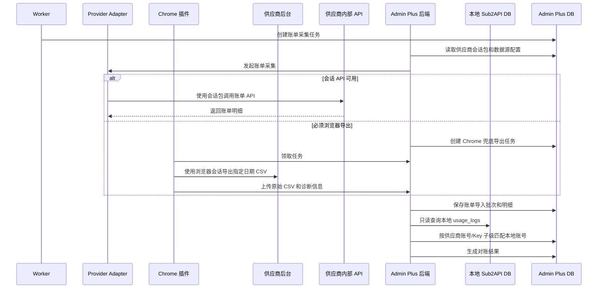

### 13.4 节点异常后的调度建议

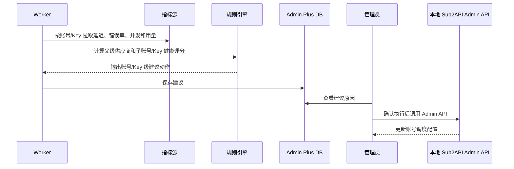

## 14. 核心流程

### 14.1 费率变更流程

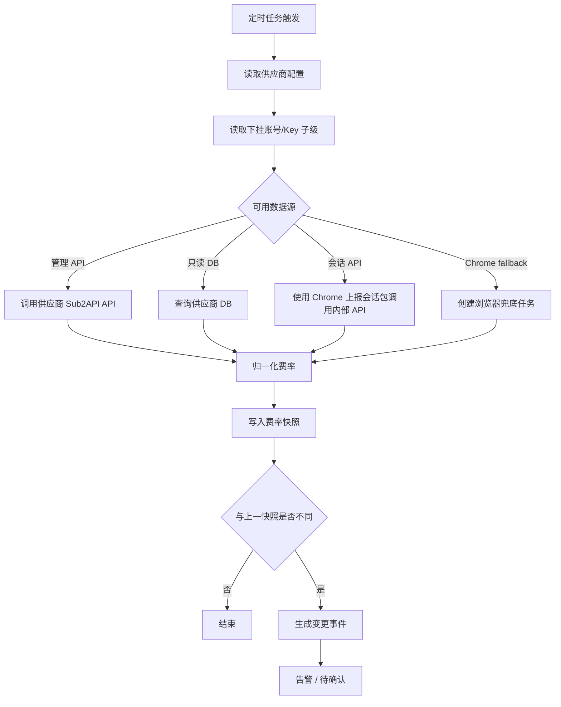

### 14.2 对账流程

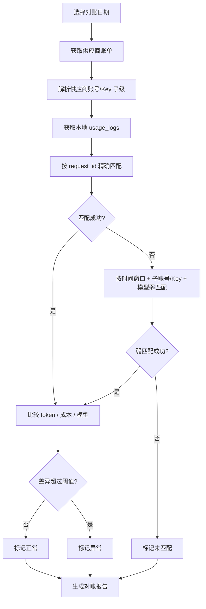

### 14.3 节点切换判断流程

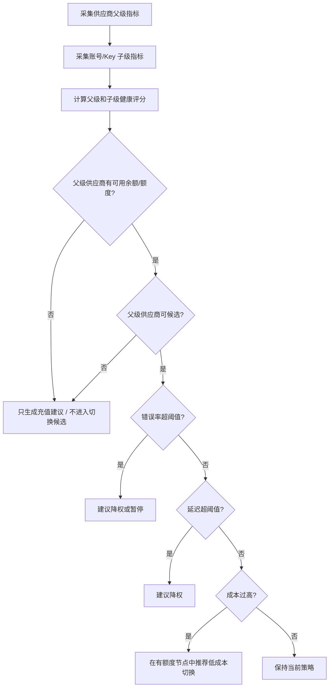

## 15. 数据模型草案

### 15.1 ER 图

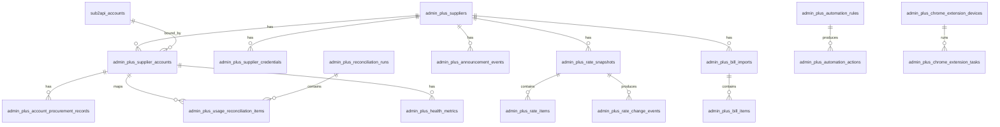

### 15.2 表说明

#### admin_plus_suppliers

供应商父级实例，表达一个上游组织、系统或后台入口，不直接等同于可调度账号。

关键字段：

- `id`
- `name`
- `supplier_kind`：`source_account`、`relay`、`browser_only`、`custom`
- `supplier_type`
- `platform`：`openai`、`anthropic`、`gemini`、`sub2api`、`new_api` 等
- `admin_base_url`
- `api_base_url`
- `browser_login_enabled`
- `browser_login_username_configured`
- `browser_login_password_configured`
- `browser_login_token_configured`
- `masked_browser_login_username`
- `postgres_readonly_configured`
- `redis_readonly_configured`
- `status`
- `runtime_mode`：`monitor_only`、`candidate`、`active`、`disabled`
- `rate_poll_interval_seconds`
- `bill_export_schedule`
- `metadata`
- `created_at`
- `updated_at`

#### admin_plus_supplier_credentials

供应商凭据。

关键字段：

- `id`
- `supplier_id`
- `credential_type`：`browser_login`、`temporary_token`、`postgres_readonly`、`redis_readonly`、`management_api_key`
- `encrypted_payload`
- `status`
- `last_validated_at`
- `last_used_at`
- `created_at`
- `updated_at`

#### admin_plus_supplier_accounts

供应商父级下挂账号/Key 子级绑定表。

关键字段：

- `id`
- `supplier_id`
- `local_sub2api_account_id`
- `local_account_name`
- `local_account_platform`
- `local_account_type`
- `supplier_account_identifier`
- `supplier_account_label`
- `supplier_key_id`
- `supplier_key_name`
- `supplier_key_external_id`
- `supplier_key_last4`
- `supplier_group_id`
- `supplier_external_group_id`
- `supplier_group_name`
- `supplier_group_provider`
- `supplier_group_rate`
- `supplier_api_key_fingerprint`
- `organization_id`
- `project_id`
- `rate_profile`
- `procurement_source`
- `procurement_cost`
- `procurement_currency`
- `procured_at`
- `procurement_expires_at`
- `model_scope`
- `current_rate_snapshot_id`
- `configured_concurrency`
- `observed_max_concurrency`
- `balance_threshold`
- `balance_cents`
- `balance_currency`
- `has_usable_balance`
- `runtime_mode`
- `health_status`
- `status`
- `metadata`

#### admin_plus_rate_snapshots

供应商费率快照。

关键字段：

- `id`
- `supplier_id`
- `supplier_account_id`
- `source_type`
- `source_version`
- `snapshot_hash`
- `fetched_at`
- `created_at`

#### admin_plus_rate_items

费率明细。

关键字段：

- `id`
- `snapshot_id`
- `model`
- `billing_mode`
- `billing_tier`
- `input_price`
- `output_price`
- `cache_creation_price`
- `cache_read_price`
- `per_request_price`
- `image_price`
- `currency`
- `unit`

#### admin_plus_rate_change_events

费率变更事件。

关键字段：

- `id`
- `supplier_id`
- `supplier_account_id`
- `snapshot_id`
- `model`
- `field_name`
- `old_value`
- `new_value`
- `change_percent`
- `severity`
- `ack_status`
- `ack_by_sub2api_admin_id`
- `ack_at`

#### admin_plus_announcement_events

供应商公告命中的关键运营信息。

关键字段：

- `id`
- `supplier_id`
- `supplier_account_id`
- `source_type`
- `type`：`recharge_bonus`、`rate_discount`、`package_deal`、`limited_offer`、`maintenance`、`incident`、`notice`、`other`
- `title`
- `description`
- `starts_at`
- `ends_at`
- `min_topup_amount`
- `bonus_amount`
- `discount_percent`
- `applicable_models`
- `estimated_effective_cost`
- `estimated_margin_after_topup`
- `provider_balance_state`：`no_balance`、`low_balance`、`sufficient`
- `recommendation_type`：`topup_only`、`topup_then_candidate`、`observe`
- `ack_status`
- `raw_payload`
- `created_at`

#### admin_plus_account_procurement_records

账号采购记录，绑定供应商账号/Key 子级，MVP 只预留，不开发采购流程。

关键字段：

- `id`
- `supplier_account_id`
- `source_type`：`official_owned`、`marketplace`、`manual_purchase`、`gift`
- `source_name`
- `purchase_cost`
- `currency`
- `purchased_at`
- `expires_at`
- `inventory_status`：`unused`、`active`、`expired`、`renewal_needed`
- `notes`
- `raw_payload`

#### admin_plus_bill_imports

账单导入批次。

关键字段：

- `id`
- `supplier_id`
- `bill_date`
- `source_type`
- `file_path`
- `status`
- `total_items`
- `total_cost`
- `started_at`
- `finished_at`
- `error_message`

#### admin_plus_bill_items

供应商账单明细。

关键字段：

- `id`
- `import_id`
- `supplier_id`
- `supplier_account_id`
- `request_id`
- `api_key_name`
- `model`
- `endpoint`
- `request_type`
- `billing_mode`
- `reasoning_effort`
- `input_tokens`
- `output_tokens`
- `cache_read_tokens`
- `total_tokens`
- `cost`
- `currency`
- `first_token_ms`
- `duration_ms`
- `user_agent`
- `occurred_at`
- `raw_payload`

#### admin_plus_reconciliation_runs

对账批次。

关键字段：

- `id`
- `supplier_id`
- `bill_date`
- `status`
- `local_revenue`
- `supplier_cost`
- `gross_profit`
- `gross_margin`
- `matched_count`
- `unmatched_local_count`
- `unmatched_supplier_count`
- `diff_count`
- `created_by_sub2api_admin_id`

#### admin_plus_usage_reconciliation_items

对账明细。

关键字段：

- `id`
- `run_id`
- `local_usage_log_id`
- `supplier_bill_item_id`
- `supplier_account_id`
- `local_sub2api_account_id`
- `match_type`
- `status`
- `local_cost`
- `supplier_cost`
- `cost_diff`
- `token_diff`
- `reason`

#### admin_plus_health_metrics

供应商父级和账号/Key 子级健康指标。

关键字段：

- `id`
- `supplier_id`
- `supplier_account_id`
- `local_sub2api_account_id`
- `model`
- `window_start`
- `window_end`
- `success_rate`
- `error_rate`
- `first_token_p50_ms`
- `first_token_p90_ms`
- `first_token_p95_ms`
- `duration_p50_ms`
- `duration_p90_ms`
- `duration_p95_ms`
- `current_concurrency`
- `max_concurrency`
- `balance`
- `health_score`

#### admin_plus_chrome_extension_tasks

Chrome 插件任务。

关键字段：

- `id`
- `device_id`
- `supplier_id`
- `task_type`
- `payload`
- `status`
- `result`
- `error_message`
- `screenshot_path`
- `created_at`
- `claimed_at`
- `finished_at`

## 16. 接口设计与当前落地状态

### 16.1 已落地 API

当前运行时已注册以下 `/api/v1/admin-plus/*` 路由，均走 Sub2API 管理员中间件：

```text
GET    /api/v1/admin-plus/suppliers
POST   /api/v1/admin-plus/suppliers
GET    /api/v1/admin-plus/suppliers/:id
PUT    /api/v1/admin-plus/suppliers/:id
DELETE /api/v1/admin-plus/suppliers/:id
PATCH  /api/v1/admin-plus/suppliers/:id/status
GET    /api/v1/admin-plus/suppliers/:id/accounts
POST   /api/v1/admin-plus/suppliers/:id/accounts
PUT    /api/v1/admin-plus/suppliers/:id/accounts/:accountID
DELETE /api/v1/admin-plus/suppliers/:id/accounts/:accountID

GET    /api/v1/admin-plus/sub2api/accounts
GET    /api/v1/admin-plus/sub2api/account-runtime
GET    /api/v1/admin-plus/sub2api/usage-lines
GET    /api/v1/admin-plus/sub2api/usage-summary

POST   /api/v1/admin-plus/rates/snapshots
GET    /api/v1/admin-plus/rates/snapshots
GET    /api/v1/admin-plus/rates/events
PATCH  /api/v1/admin-plus/rates/events/:id/ack

POST   /api/v1/admin-plus/balances/snapshots
GET    /api/v1/admin-plus/balances/snapshots
GET    /api/v1/admin-plus/balances/events
PATCH  /api/v1/admin-plus/balances/events/:id/ack

POST   /api/v1/admin-plus/announcements
GET    /api/v1/admin-plus/announcements
PATCH  /api/v1/admin-plus/announcements/:id/ack

POST   /api/v1/admin-plus/health/probe
POST   /api/v1/admin-plus/health/samples
GET    /api/v1/admin-plus/health/samples
GET    /api/v1/admin-plus/health/events
PATCH  /api/v1/admin-plus/health/events/:id/ack

GET    /api/v1/admin-plus/notifications/deliveries

POST   /api/v1/admin-plus/billing/lines/import
GET    /api/v1/admin-plus/billing/lines
POST   /api/v1/admin-plus/suppliers/:id/billing/sync

GET    /api/v1/admin-plus/suppliers/:id/keys
POST   /api/v1/admin-plus/suppliers/:id/keys/provision
POST   /api/v1/admin-plus/suppliers/:id/keys/:keyID/repair-binding

POST   /api/v1/admin-plus/extension/tasks
GET    /api/v1/admin-plus/extension/tasks
POST   /api/v1/admin-plus/extension/tasks/claim
POST   /api/v1/admin-plus/extension/tasks/:id/heartbeat
POST   /api/v1/admin-plus/extension/tasks/:id/browser-credential
POST   /api/v1/admin-plus/extension/tasks/:id/complete
POST   /api/v1/admin-plus/extension/tasks/:id/fail

GET    /api/v1/admin-plus/scheduler/status
POST   /api/v1/admin-plus/scheduler/run

POST   /api/v1/admin-plus/reconciliation/run

POST   /api/v1/admin-plus/actions/generate
GET    /api/v1/admin-plus/actions/recommendations
PATCH  /api/v1/admin-plus/actions/recommendations/:id/status
```

已落地 API 的限制：

- `actions` 当前只生成和更新建议状态，尚未执行本地 Sub2API Admin API 写操作。
- `scheduler` 当前可以生成任务，但真实供应商周期采集取决于具体 provider adapter 和 Chrome adapter 是否完成。
- `extension` 当前具备任务协议和结果摄取，供应商专用页面适配仍需逐个完成。
- `billing` 当前支持结构化账单导入、查询，以及 `POST /api/v1/admin-plus/suppliers/:id/billing/sync` 通过已保存供应商会话触发后端 Provider Adapter 读取账单；网页自动下载账单文件仍仅作为补录/compat 方向。

### 16.2 规划 API

以下接口属于产品规划或后续增强，不能按当前完成状态验收：

- 供应商凭据独立 CRUD、凭据测试和凭据审计接口。
- 供应商账号/Key 子级更新、同步和批量绑定接口。
- 费率主动 poll 接口和 provider adapter 直接抓取接口。
- 公告主动同步、详情和充值建议接口。
- 账单导出任务、对账批次查询、对账明细查询和 CSV 导出接口。
- 动作建议详情、审批、拒绝和执行接口。
- Chrome 插件设备注册、上传文件和截图接口。
- 通知规则、通知重试和多通道接口。

### 16.3 健康探测说明

- `POST /api/v1/admin-plus/health/probe`
- `POST /api/v1/admin-plus/health/samples`
- `GET /api/v1/admin-plus/health/samples`
- `GET /api/v1/admin-plus/health/events`
- `PATCH /api/v1/admin-plus/health/events/:id/ack`

当前已落地 `POST /api/v1/admin-plus/health/probe`：

- 输入供应商父级 ID、供应商账号/Key 子级 ID、模型和阈值。
- 默认模型为 `gpt-5.5`。
- 仅支持绑定到本地 Sub2API `accounts` 的 OpenAI-compatible API Key 账号。
- 后端读取本地账号凭据并请求 `/v1/responses`，前端不接收 API Key。
- 探测成功或失败都会落健康样本；请求错误、慢首字、慢总耗时和并发饱和按规则生成事件。

## 17. 与本地 Sub2API 的集成

### 17.1 Admin API 写入

允许 admin-plus 通过本地 Sub2API Admin API 做以下写入：

- 更新账号 `rate_multiplier`。
- 更新账号 `concurrency`。
- 更新账号 `priority`。
- 设置账号 `schedulable`。
- 清除账号错误。
- 清除账号临时不可调度状态。
- 执行账号测试或刷新。

写入前必须：

- 有明确的管理员确认。
- 记录动作原因。
- 记录执行前后的关键字段快照。
- 使用幂等键，避免重复执行。

### 17.2 PostgreSQL 只读

允许读取：

- `accounts`
- `usage_logs`
- `channel_monitors`
- `channel_monitor_histories`
- `channel_monitor_daily_rollups`
- `groups`
- `channel_model_pricing`
- 其它只读分析所需表

禁止：

- `INSERT`
- `UPDATE`
- `DELETE`
- DDL
- 直接修复数据

### 17.3 Redis 只读

允许读取：

- `session_limit:account:{accountID}`：账号活跃会话。
- `window_cost:account:{accountID}`：窗口费用缓存。
- 其它可明确识别且只读安全的运行态 key。

禁止：

- `DEL`
- `SET`
- `ZADD`
- `ZREM`
- `FLUSH*`
- 任何改变调度状态的 Redis 写操作。

## 18. Chrome 插件设计

当前 Chrome 插件设计的完整事实源为 `docs/roadmap/Chrome/README.md`。本节只保留 PRD 摘要。

### 18.1 插件架构

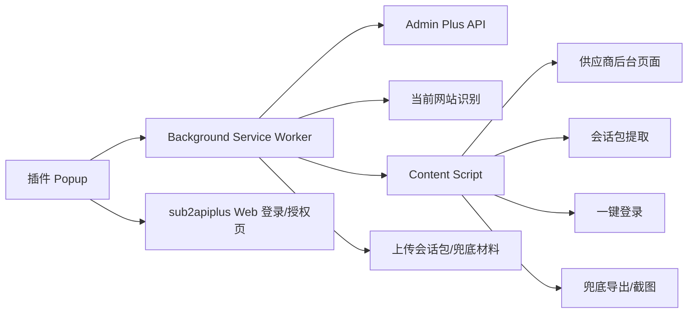

### 18.2 任务类型

主路径任务：

- `identify_current_site`
- `capture_supplier_session`
- `refresh_supplier_session`
- `probe_supplier_session`

兜底任务：

- `fallback_export_usage_csv`
- `fallback_scrape_page_metric`
- `fallback_capture_debug_screenshot`

旧版 `scrape_rate_page`、`scrape_announcement_page`、`scrape_balance`、`scrape_concurrency`、`export_usage_csv` 不再作为插件主路径，只能在会话 API 不可用时作为 fallback。

### 18.3 安全要求

- 插件设备需要在 admin-plus 页面配对。
- 插件未连接 sub2apiplus 时，不允许读取供应商凭据或上传供应商会话包，只允许打开 sub2apiplus Web 登录/授权页。
- sub2apiplus 已登录时，Web 授权页可一键授权插件并下发可吊销设备 token。
- 设备 token 有效期可控，可吊销。
- 插件不长期保存明文密码。
- 任务 payload 中的敏感字段只在执行窗口短期解密。
- 上传会话包、原始文件或诊断信息前做供应商 ID 和任务 ID 校验。
- 失败时允许上传截图，但截图需要按供应商配置决定是否脱敏。
- 插件不保存 Sub2API 管理员 token。
- 插件不提供管理员登录 UI。
- 会话包必须服务端加密存储，并记录设备 ID、任务 ID、来源页面和采集时间。

## 19. 健康评分草案

默认健康分 100，按规则扣分：

- 余额低于阈值：扣 40。
- 错误率超过 5%：扣 30。
- 首 token P95 超过阈值：扣 20。
- 总耗时 P95 超过阈值：扣 15。
- 可用并发低于配置并发：扣 20。
- 费率在 24 小时内上涨超过阈值：扣 10。
- 账单连续 2 天未成功导入：扣 15。

评分等级：

- `90-100`：健康。
- `70-89`：观察。
- `50-69`：降权建议。
- `<50`：暂停或切换建议。

## 20. 页面规划

### 20.1 运营看板

展示：

- 今日请求数。
- 今日收入。
- 今日供应商成本。
- 今日毛利。
- 毛利率。
- 费率变更事件数。
- 公告事件数。
- 对账异常数。
- 节点异常数。
- 余额告警数。

### 20.2 供应商管理

展示：

- 供应商列表。
- 凭据状态。
- 最近费率抓取时间。
- 最近公告同步时间。
- 最近账单导入时间。
- 最近健康评分。
- 供应商类型。
- 运行分类：仅监控、候选、使用中、禁用。

### 20.3 供应商账号/Key 子级

展示：

- 所属供应商父级。
- 本地账号。
- 供应商侧账号标识。
- 账号/Key 标签。
- 模型范围。
- 当前费率。
- 本地并发。
- 供应商可并发。
- 余额。
- 健康状态。

### 20.4 费率监控

展示：

- 最新费率。
- 历史快照。
- 变更记录。
- 影响账号。
- 确认状态。

### 20.5 公告监控

展示：

- 供应商公告命中的关键运营信息。
- 成本类公告有效期。
- 充值门槛。
- 预计折后成本。
- 预计毛利变化。
- 是否有余额。
- 建议类型：仅充值、充值后可候选、观察。

### 20.6 账单对账

展示：

- 对账批次。
- 总收入。
- 供应商成本。
- 毛利。
- 异常数量。
- 明细列表。
- CSV 导出。

### 20.7 节点健康

展示：

- 延迟趋势。
- 错误率趋势。
- 并发趋势。
- 余额趋势。
- 健康分。
- 切换建议。

### 20.8 自动化建议

展示：

- 建议动作。
- 触发规则。
- 影响账号。
- 预期收益。
- 风险提示。
- 确认执行按钮。

## 21. MVP 里程碑

### M1：基础框架与供应商台账

- Go/Gin 后端骨架。
- Vue/Vite/Tailwind 前端骨架。
- 复用 Sub2API 管理员鉴权。
- 复用 Sub2API PostgreSQL 实例，但创建并使用 admin-plus 独立数据库。
- 复用 Sub2API Redis 实例，但所有 admin-plus 写入 key 强制使用 `ADMIN_PLUS_REDIS_PREFIX`。
- 建立 Sub2API 后端代码复制目录和来源 commit 记录。
- 建立 copy sync 脚本，复制目录只同步不手改。
- 供应商 CRUD。
- 供应商运行分类：仅监控、候选、使用中、禁用。
- 凭据加密存储。
- 本地 Sub2API Admin API 连接测试。
- 本地 Sub2API DB/Redis 只读连接测试。

### M2：Sub2API 源站账号与中转型上游适配器

- Sub2API Admin API 适配。
- Sub2API 已添加的 OpenAI / Anthropic / Gemini 源站账号读取与运营适配。
- 供应商 Sub2API DB 只读适配。
- 供应商 Redis 只读适配。
- 供应商账号/Key 子级绑定。
- 费率抓取和快照。
- 公告监控和充值建议。
- 10 分钟调度任务。

### M3：账单导入与对账

- 本地 `usage_logs` 只读查询。
- 供应商账单 API/DB 导入。
- CSV 导入。
- 对账批次。
- 对账明细。
- 毛利计算。

### M4：健康监控与建议

- 首 token、总耗时、错误率聚合。
- 并发和余额采集。
- 健康评分。
- 降权、暂停、调并发建议。
- 人工确认后通过 Admin API 执行动作。

### M5：Chrome 插件

- 插件设备配对。
- 任务领取。
- 当前网站自动识别。
- 供应商一键登录。
- 已登录页面一键获取会话。
- 第三方会话包上报。
- 后端会话探测结果展示。
- 浏览器兜底 CSV 导出、页面指标读取和截图上传。

## 22. 验收指标

MVP 必须满足：

- Sub2API 主项目无代码改动即可运行 admin-plus。
- 不需要 admin-plus 独立账号密码。
- admin-plus 业务数据写入独立 PostgreSQL 数据库，不写入 Sub2API 主库。
- admin-plus Redis 写入全部带独立前缀，可以与 Sub2API key 明确区分。
- 如果复用 Sub2API 后端代码，复制目录可通过同步脚本重建，且不包含 admin-plus 私有业务改动。
- 能读取至少 1 个 Sub2API 已添加的 OpenAI、Anthropic 或 Gemini 源站账号。
- 能添加至少 1 个供应商 Sub2API 实例。
- 能在供应商父级下绑定至少 1 个本地 Sub2API 账号/Key 子级。
- 能每 10 分钟生成费率快照。
- 能识别费率变更并生成事件。
- 能监控无余额供应商的成本类公告，并生成充值建议。
- 无余额供应商不能进入自动切换候选。
- 账号采购/库存字段仅预留，不出现采购下单入口。
- 能导入一天供应商账单并完成对账。
- 能计算收入、成本、毛利和毛利率。
- 能展示首 token P95、总耗时 P95、错误率和健康评分。
- 能生成人工确认的调度建议。
- 写入本地 Sub2API 的动作全部通过 Admin API。

## 23. 风险与处理

### 23.1 供应商页面变化

风险：Chrome 插件依赖 DOM，供应商后台升级会导致抓取失败。  
处理：优先 API/DB；插件只做兜底；DOM 选择器按供应商版本配置化。

### 23.2 对账无法精确匹配

风险：供应商账单没有 request_id。  
处理：先按 request_id 匹配；缺失时按时间窗口、模型、账号、token 弱匹配，并标记低置信度。

### 23.3 凭据安全

风险：供应商后台账号密码、临时 token、只读数据库连接或可选管理 API Key 泄露。
处理：加密存储、脱敏展示、审计使用、最小权限、只读数据库账号；新增供应商不要求管理 API Key。

### 23.3A 会话请求越权与 SSRF

风险：插件上报供应商会话后，如果后端直接信任插件提交的 URL 或请求参数，Provider Adapter 可能变成任意请求代理，造成 SSRF、越权访问供应商 admin 接口或高敏凭据外泄。
处理：插件只上报会话包和页面上下文，不上报任意请求指令；Provider Adapter 必须按供应商 `base_url`、`api_base_url`、host 白名单和已登记接口路径发起请求；普通下游会话默认只允许访问用户侧只读接口，写操作和 `/api/v1/admin/*` 必须有明确授权、能力开关和审计。

### 23.4 读取 DB/Redis 依赖内部结构

风险：Sub2API 升级后表或 key 变化。  
处理：Admin API 优先；DB/Redis 查询做版本探测；适配器按版本维护。

### 23.5 自动切换误伤

风险：自动暂停或降权导致可用容量不足。  
处理：MVP 默认只建议不自动执行；执行前展示影响范围；保留操作审计。

### 23.6 共享 Redis key 污染

风险：admin-plus 与 Sub2API 复用 Redis，错误写入无前缀 key 会污染主系统运行态。  
处理：启动时强制校验 `ADMIN_PLUS_REDIS_PREFIX`；Redis client 封装统一加前缀；清理任务只允许操作此前缀。

### 23.7 复制代码漂移

风险：复制 Sub2API 后端代码后，如果在复制目录中直接修改，会导致后续同步困难。  
处理：复制目录只同步不手改；自定义行为放到 adapter、hook、wrapper 或独立 service；同步脚本和 `SOURCE.md` 记录来源 commit。

### 23.8 无余额低价供应商误切换

风险：供应商有更低费率或公告，但当前无余额，如果被自动切换会导致客户请求失败。
处理：调度候选必须校验可用余额或有效额度；无余额供应商只能生成充值建议，不能生成切换执行动作。

## 24. 上游 PR 策略

只有以下情况才考虑给 Sub2API 上游提交 PR：

- 增加通用 Admin API 读接口。
- 增加通用外链菜单入口。
- 增加通用账单导出能力。
- 增加通用健康指标导出能力。

不提交：

- 供应商私有适配逻辑。
- 个人运营策略。
- admin-plus 业务页面。
- Chrome 插件业务逻辑。

## 25. 开发约束

- 前后端框架优先复用 Sub2API 技术选型：Go/Gin、PostgreSQL、Redis、Vue 3、Vite、TailwindCSS。
- PostgreSQL 复用 Sub2API 实例，但 admin-plus 必须使用独立数据库。
- Redis 复用 Sub2API 实例，但 admin-plus 自有 key 必须使用独立前缀。
- 如需复用 Sub2API 后端代码，可以复制到 `internal/copied/sub2api`，但复制目录只允许脚本同步，不允许手工业务改动。
- admin-plus 私有逻辑必须通过 wrapper、hook、adapter、decorator 或独立 service 实现。
- 代码结构保持业务模块清晰，不把 Provider Adapter 和业务规则混写。
- 后端任务必须幂等。
- 所有外部写操作必须有审计日志。
- 所有凭据字段必须脱敏日志。
- 所有直接读取 Sub2API DB/Redis 的逻辑必须集中在 adapter/integration 层。
- 所有 Sub2API 写入必须集中在 Admin API client 层。
- 所有 admin-plus Redis 写入必须通过统一封装，不允许业务代码手写裸 key。

## 26. 待确认问题

1. Admin Plus 登录代理是否只支持本地 Sub2API 管理员账号密码登录，还是也需要代理 Sub2API 已启用的 OAuth 登录入口。
2. 首批供应商是否能提供只读数据库连接；不能提供时是否只能依赖 Chrome 插件账号密码或临时 token 采集。
3. 供应商账单是否包含 request_id；如果没有，需要确认弱匹配容忍度。
4. 费率来源以供应商渠道定价为准，还是以供应商网页展示价格为准。
5. 自动调度建议是否允许在特定低风险动作上自动执行，例如余额为 0 时暂停调度。
6. 首批需要复制的 Sub2API 后端模块范围：只复制 API DTO/client，还是包含 ent schema、repository 和 service 的只读部分。

## 27. 当前实现进度

更新日期：2026-06-20

### 27.1 已完成的基础能力

- 完整复制 Sub2API 前后端架构和 UI 风格，Admin Plus 独立运行。
- 复用 Sub2API 管理员登录与管理员中间件，不新增权限系统。
- 去除用户端、支付、渠道、网关转发等非 Admin Plus 当前路由入口。
- 完成供应商父级台账。
- 完成供应商账号/Key 子级绑定，子级绑定本地 Sub2API `accounts.id`。
- 新增供应商不要求 Admin API Key，支持记录浏览器登录账号、密码、临时 token 的配置状态和脱敏展示。
- 完成费率快照、费率变更事件、事件确认。
- 完成余额快照、余额事件、低余额/耗尽/恢复规则。
- 完成飞书自定义机器人基础通知：
  - `ADMIN_PLUS_FEISHU_WEBHOOK_URL` 启用通用飞书通知。
  - `ADMIN_PLUS_FEISHU_WEBHOOK_SECRET` 可选启用飞书签名。
  - 兼容旧变量 `ADMIN_PLUS_FEISHU_BALANCE_WEBHOOK_URL` 和 `ADMIN_PLUS_FEISHU_BALANCE_WEBHOOK_SECRET`。
  - 当前覆盖余额事件、费率变更事件、健康事件、公告事件和对账异常事件。
  - 发送前写入 `admin_plus_notification_deliveries`。
  - 同一业务事件同一通道通过 `dedupe_key` 去重。
  - 费率、健康和公告等高频事件支持窗口去重，避免同一事件窗口重复刷屏。
  - 通知中心提供后台飞书配置、测试诊断、业务规则、防打扰、投递记录和失败投递重试。
  - 通知成功或失败都会记录投递状态，不回滚业务快照或事件。
- 完成公告事件、无余额供应商充值建议规则。
- 完成健康样本、首 token/总耗时/错误/并发饱和事件。
- 完成 OpenAI-compatible Responses 健康探测接口和前端入口：
  - `POST /api/v1/admin-plus/health/probe`。
  - 默认模型 `gpt-5.5`。
  - 从供应商账号/Key 子级绑定的本地 Sub2API `accounts.credentials` 读取 API Key 和 base URL。
  - 前端不输入、不展示 API Key。
- 完成插件任务创建、领取、心跳、完成、失败的任务协议后端。
- 完成调度中心后端与前端：
  - 手动或周期触发默认生成 `capture_supplier_session` 会话上报任务。
  - 显式选择 `fetch_groups`、`fetch_rates`、`fetch_balance`、`fetch_announcements`、`fetch_health`、`export_bills` 时，调度中心直接调用后端 Provider Adapter / app service 同步分组、费率、余额、公告、健康和账单，不再创建插件业务采集任务。
  - `fetch_announcements` 通过已保存会话读取供应商用户侧公告端点并写入公告事件；`fetch_health` 通过本地 Sub2API 账号执行 OpenAI-compatible Responses 探测并写入健康样本。
  - 基于 `schedule_key` 防止同一窗口重复创建。
  - 无余额供应商仍可执行分组、费率、余额、公告监控，但不执行健康和账单这类可切换执行任务。
- 完成供应商账单同步主路径：
  - `ReadBilling(session, date_range)` 在后端 Provider Adapter 执行。
  - 写入 `admin_plus_supplier_bill_lines`。
  - 插件 `export_bills` 只保留 compat，不作为账单事实源继续增强。
- 完成旧版插件任务结果摄取基础能力：
  - `fetch_rates` 在插件结果摄取中仅保留为兼容任务类型；费率主路径改为插件完成 `capture_supplier_session` 上报会话包后，由后端 Provider Adapter 执行 `ReadRates(session)` 并写入费率快照和变更事件。
  - `fetch_balance`、`fetch_announcements`、`fetch_health`、`export_bills` 在插件结果摄取中仅保留为兼容任务类型；调度主路径已经改为后端同步。
  - 新主路径统一为 `capture_supplier_session` 上报会话包，由后端 Provider Adapter 使用会话 API 或只读数据源采集余额、公告、健康、账单并写入业务表。
  - 插件不得把已解析业务结果作为余额、费率、健康、账单或 Key 创建事实源。
- 完成供应商账单导入、对账服务和动作建议生成。
- 完成本地 Sub2API 只读 DB 适配：
  - 读取真实 `accounts` 用于账号/Key 绑定。
  - 读取真实 `usage_logs` 明细用于账单对账。
  - 按账号和模型聚合真实请求数、token、收入、原始成本、首 token 和总耗时。
- 完成本地 Sub2API Redis 只读运行态适配：
  - 读取 `concurrency:account:{accountID}` 当前并发。
  - 读取 `wait:account:{accountID}` 等待队列。
  - 读取 `temp_unsched:account:{accountID}` 临时不可调度状态。
  - 结合 `accounts` 表状态、限流、过载、调度开关计算只读切换资格。
- 前端已提供独立导航模块：
  - 供应商管理
  - 账号/Key 绑定
  - 账号运行态
  - 费率监控
  - 余额监控
  - 健康监控
  - 公告监控
  - 调度中心
  - 插件任务
  - 账单对账
  - 本地用量
  - 动作建议
  - 通知记录
- 供应商管理页已按 Sub2API 后台账号管理页的工作台交互改造：
  - 筛选条：搜索、供应商归类、系统类型、运行状态、健康状态。
  - 右侧工具：刷新、更多操作、添加供应商。
  - 表格：选择列、供应商、归类/类型、状态、余额、采集凭据、地址、创建时间、行内操作。
  - 批量操作：全选当前页、清除选择、批量状态、批量删除。
  - CRUD：创建、编辑、状态调整、删除均调用真实 Admin Plus API。
- 账号/Key 绑定页已按父供应商、子账号/Key 模型改造：
  - 筛选条：供应商、本地账号搜索、运行状态、健康状态。
  - 表格：名称/API Key、分组、用量、状态、并发、创建时间、操作；第一列合并本地账号、脱敏供应商 Key 和供应商上下文。
  - 分组展示复用 Sub2API `GroupBadge` 视觉口径，用分组名称、渠道颜色和倍率表达真实供应商分组。
  - 页面只读展示已生成绑定；新增从供应商管理页的分组弹窗触发，失败修复在分组弹窗内处理，不在该页保留新增、编辑或删除入口。
  - 用量/金额来自本地 Sub2API `usage_logs` 账号聚合，展示今日和近 30 天 token 与账号成本金额，不把供应商余额误展示为单 Key 余额。
- API E2E 脚本覆盖真实 HTTP、真实 PostgreSQL、真实 Redis 运行态、供应商父子绑定、本地用量读取、OpenAI-compatible Responses 健康探测、调度生成、插件任务结果摄取、账单对账和动作建议。
- API E2E 已覆盖供应商父级 `PUT` 更新、供应商账号/Key 子级 `PUT` 更新和删除，避免编辑 UI 停留在未验证状态。
- 完成供应商浏览器登录凭据加密存储。
- 完成插件任务租约读取供应商浏览器凭据接口：`POST /api/v1/admin-plus/extension/tasks/:id/browser-credential`。
- 完成新版 `extension/` Chrome MV3 会话获取器基础链路：
  - Popup 不提供 Sub2API 管理员登录 UI，不展示/输入管理员 Token。
  - 插件从已登录 sub2apiplus Web 页面完成连接；未登录时只打开 Web 登录页。
  - 插件识别当前 active tab 与已配置供应商的匹配关系。
  - 插件创建 `capture_supplier_session` 短租约任务，按租约读取供应商浏览器凭据。
  - 插件打开或复用供应商后台，辅助一键登录或识别已登录状态。
  - 插件提取前端 storage、Cookie、CSRF 和请求上下文组成会话包，并上报后端。
  - 后端完成任务时删除明文 `session_bundle`，只保留摘要和加密会话包。
  - `parser.js` 页面解析纯函数和旧任务领取协议保留为浏览器兜底/兼容路径，不作为 Chrome 插件新的主路径继续扩展。

### 27.2 基础闭环已完成但不能视为生产完成

- 插件任务后端协议、调度生成、租约凭据读取、结果摄取和 Chrome 最小执行器已完成，但这是旧版页面抓取路径的基础能力；新方向需要优先完成当前网站识别、一键登录、会话包上报和后端会话 API 采集。
- 账单对账服务已完成，插件任务可摄取结构化账单结果，但新主路径应由后端使用供应商会话 API 获取账单；供应商网页自动下载账单文件和解析只作为兜底能力。
- 动作建议生成已完成，但“管理员确认后调用 Sub2API Admin API 执行动作”未完成。
- 本地 Sub2API DB/Redis 只读已完成基础账号、用量、并发运行态读取，但窗口成本和 Channel Monitor 深度指标适配未完成。
- 飞书通知发送已接入余额、费率、健康、公告和对账异常事件，SQL 投递审计、事件级去重、窗口限流、通知记录页面、测试诊断和失败投递重试已完成；多通道通知尚未完成。
- Scheduler 已能生成幂等插件任务，但周期 Worker 的任务审计、超时回收、失败重试可视化和每日账单任务闭环尚未完成。

### 27.3 未完成的核心需求

- 首批供应商专用会话 API 适配器：基于 Chrome 上报的真实登录会话获取费率、余额、公告和账单；页面抓取/导出只作为 fallback。
- 第三方供应商 Sub2API/New API Admin API client 和只读 DB/Redis provider adapter。
- Sub2API Redis 窗口成本 adapter。
- 每日自动账单导出和定时对账。
- 多通道通知。
- 管理员确认后调用 Sub2API Admin API 执行动作建议。
- 动作执行审计、执行前后快照和失败重试。
- 凭据使用审计和敏感操作审计页面。
- 源站 Anthropic/Gemini 账号的额度/限速/模型探测运营适配。
- 真实外部 OpenAI 账号的生产可用性探测验证；当前只完成 OpenAI-compatible 请求链路和本地测试 upstream E2E，不代表已有生产 Key 可用。

## 28. 非 mock 验收标准

任何功能只有满足以下条件，才能在进度中标记为“已完成”：

- 后端能力必须走真实 HTTP handler、真实 service、真实 repository。
- 需要持久化的数据必须写入 PostgreSQL 表，不能只写内存。
- 读取 Sub2API 数据必须来自 Sub2API Admin API、只读 DB 或只读 Redis。
- 写 Sub2API 状态必须通过 Sub2API Admin API，不能直接写 Sub2API DB/Redis。
- 前端页面必须调用真实 API，不能依赖静态列表或假数据。
- E2E 测试允许创建 `e2e-*` 测试夹具，但必须默认清理本次夹具；夹具只用于验证真实链路，不代表供应商真实采集已完成。
- Chrome 插件相关能力只有在插件真实登录目标页面、读取实际页面数据并回传后，才能标记为完成。
- 定时任务只有在 scheduler 真实触发、记录任务状态、支持失败重试和幂等后，才能标记为完成。
- 自动执行只有在管理员确认后真实调用 Sub2API Admin API，并记录审计后，才能标记为完成。

当前 E2E 中的 `e2e-test-only-*` 凭据、usage 记录和本地 OpenAI-compatible `/v1/responses` 服务是测试夹具，用于验证本地 API/DB/Redis/HTTP 探测链路；它们不是生产采集器，也不表示 Chrome 插件真实采集或真实外部供应商探测已完成。历史 `e2e-*` 夹具应通过 `node tools/cleanup-admin-plus-e2e.mjs` 先 dry-run 统计，再显式设置 `ADMIN_PLUS_CLEAN_E2E_EXECUTE=1` 清理。

## 29. 下一阶段计划

### M2：Sub2API 真实数据源适配

目标：让 Admin Plus 基于本地 Sub2API 的事实数据运营。

- 完善 `SUB2API_READONLY_DATABASE_URL` 配置文档和启动校验。
- 读取 `accounts`、`usage_logs`、`channel_monitor_histories`、`channel_monitor_daily_rollups`。
- 扩展 Redis 窗口成本读取；当前已完成账号并发、等待队列和临时不可调度只读读取。
- 把本地用量明细接入账单对账默认流程。
- 用真实数据生成第一版成本、健康和利润信号。

验收：

- 账号绑定页读取真实 Sub2API `accounts`，不是 Admin Plus 自有测试表。
- 本地用量页读取真实 Sub2API `usage_logs`。
- Redis 运行态只读 adapter 不写、不删、不清理任何 Sub2API key。
- 成本、健康和利润信号能追溯到具体供应商账号/Key 子级。

### M3：首批 Sub2API 供应商采集

目标：让费率、余额、公告、账单和健康数据自动进入系统。

- 扩展 scheduler 任务审计、超时回收和失败重试可视化。
- 完善周期策略：每 10 分钟生成费率/余额/公告/健康任务，每日生成账单导出任务。
- 首批优先支持上游也是 Sub2API 的供应商。
- 实现 Sub2API 供应商 Admin API / 只读 DB / 只读 Redis provider adapter。
- Chrome 插件完成至少一个真实 Sub2API 供应商后台的一键登录或已登录会话上报；Provider Adapter 基于该真实会话完成费率、余额、公告、健康或账单采集。
- 插件失败必须回传明确错误，不允许生成 mock 成功结果。

验收：

- 可以添加一个真实 Sub2API 供应商父级，并在其下绑定本地账号/Key 子级。
- 10 分钟任务能产出真实费率、余额、公告或健康数据中的至少三类。
- 每日账单任务能导入真实供应商账单或供应商只读库账单。
- 采集失败时能在插件任务和告警中看到失败原因。

### M4：通知、审计与执行闭环

目标：从监控走向可控执行。

- 通知余额不足、费率变更、公告、健康异常和对账异常。
- 增加多通道通知记录。
- 动作建议详情展示影响范围、成本差异、健康差异和毛利风险。
- 管理员确认后调用本地 Sub2API Admin API 调整账号状态、优先级或并发。
- 所有执行动作进入审计日志。

验收：

- 同一供应商同一事件窗口不会重复刷屏。
- 通知审计表能记录发送时间、事件类型、目标通道、发送结果和错误原因；前端页面需要能查询这些记录。
- 管理员确认动作后，后端真实调用本地 Sub2API Admin API，而不是只改 Admin Plus 状态。
- 审计记录包含操作人、动作原因、执行前快照、执行后结果和失败详情。

### M5：前端业务闭环

目标：让运营者不需要直接调用 API，也能完成核心流程。

- 供应商管理页支持父级和账号/Key 子级分层管理。
- 费率、余额、健康、公告、账单、动作建议拆成独立导航模块，不复用重复空壳页面。
- 所有页面使用真实 API，不使用静态 mock 列表。
- 页面风格继续贴近 Sub2API 后台：列表、弹窗、表单位置和交互习惯保持一致。
- 添加/编辑表单遵循 Sub2API 现有弹窗或页面模式，不把核心新增表单塞进右侧随意区域。

验收：

- 运营者能从导航完成供应商创建、子级绑定、采集任务生成、事件查看、对账运行和动作建议处理。
- 前端所有空状态、错误态、加载态可用。
- Playwright E2E 覆盖核心页面和真实 API 交互。
